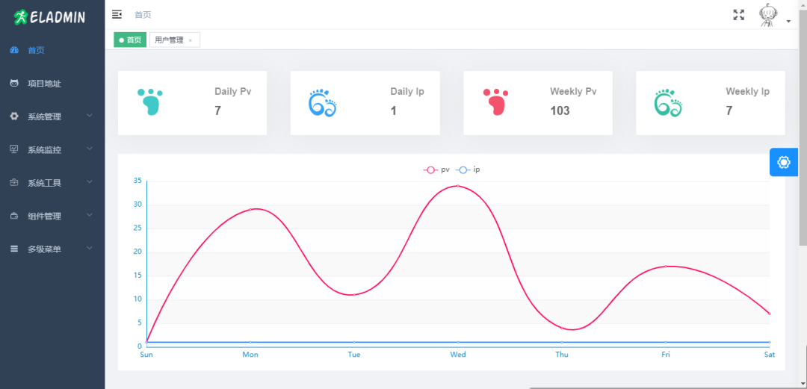

# SpringBoot

## 知识学习

### [Spring Boot Demo](https://github.com/xkcoding)

该项目已成功集成 actuator(`监控`)、admin(`可视化监控`)、logback(`日志`)、aopLog(`通过AOP记录web请求日志`)、统一异常处理(`json级别和页面级别`)、freemarker(`模板引擎`)、thymeleaf(`模板引擎`)、Beetl(`模板引擎`)、Enjoy(`模板引擎`)、JdbcTemplate(`通用JDBC操作数据库`)、JPA(`强大的ORM框架`)、mybatis(`强大的ORM框架`)、通用Mapper(`快速操作Mybatis`)、PageHelper(`通用的Mybatis分页插件`)、mybatis-plus(`快速操作Mybatis`)、BeetlSQL(`强大的ORM框架`)、upload(`本地文件上传和七牛云文件上传`)、redis(`缓存`)、ehcache(`缓存`)、email(`发送各种类型邮件`)、task(`基础定时任务`)、quartz(`动态管理定时任务`)、xxl-job(`分布式定时任务`)、swagger(`API接口管理测试`)、security(`基于RBAC的动态权限认证`)、SpringSession(`Session共享`)、Zookeeper(`结合AOP实现分布式锁`)、RabbitMQ(`消息队列`)、Kafka(`消息队列`)、websocket(`服务端推送监控服务器运行信息`)、socket.io(`聊天室`)、ureport2(`中国式报表`)、打包成`war`文件、集成 ElasticSearch(`基本操作和高级查询`)、Async(`异步任务`)、集成Dubbo(`采用官方的starter`)、MongoDB(`文档数据库`)、neo4j(`图数据库`)、docker(`容器化`)、`JPA多数据源`、`Mybatis多数据源`、`代码生成器`、GrayLog(`日志收集`)、JustAuth(`第三方登录`)、LDAP(`增删改查`)、`动态添加/切换数据源`、单机限流(`AOP + Guava RateLimiter`)、分布式限流(`AOP + Redis + Lua`)、ElasticSearch 7.x(`使用官方 Rest High Level Client`)、HTTPS、Flyway(`数据库初始化`)。

### [SpringBoot-Labs](https://github.com/YunaiV/SpringBoot-Labs)

一个涵盖六个专栏：Spring Boot 2.X、Spring Cloud、Spring Cloud Alibaba、Dubbo、分布式消息队列、分布式事务的仓库

### [springboot-guide](https://github.com/Snailclimb/springboot-guide)

### [527515025](https://github.com/527515025)/**[springBoot](https://github.com/527515025/springBoot)**

## 项目练习

### [elunez](https://github.com/elunez)/**[eladmin](https://github.com/elunez/eladmin)**

项目基于 Spring Boot 2.1.0 、 Jpa、 Spring Security、redis、Vue的前后端分离的后台管理系统，项目采用分模块开发方式， 权限控制采用 RBAC，支持数据字典与数据权限管理，支持一键生成前后端代码，支持动态路由

### [macrozheng](https://github.com/macrozheng)/**[mall](https://github.com/macrozheng/mall)**

mall项目是一套电商系统，包括前台商城系统及后台管理系统，基于SpringBoot+MyBatis实现，采用Docker容器化部署。 前台商城系统包含首页门户、商品推荐、商品搜索、商品展示、购物车、订单流程、会员中心、客户服务、帮助中心等模块。 后台管理系统包含商品管理、订单管理、会员管理、促销管理、运营管理、内容管理、统计报表、财务管理、权限管理、设置等模块。

### [lenve](https://github.com/lenve)/**[vhr](https://github.com/lenve/vhr)**

微人事是一个前后端分离的人力资源管理系统，项目采用SpringBoot+Vue开发。

### [cloudfavorites](https://github.com/cloudfavorites)/**[favorites-web](https://github.com/cloudfavorites/favorites-web)**

云收藏是一个使用 Spring Boot 构建的开源网站，可以让用户在线随时随地收藏的一个网站

### [codedrinker](https://github.com/codedrinker)/**[community](https://github.com/codedrinker/community)**

开源论坛、问答系统，现有功能提问、回复、通知、最新、最热、消除零回复功能。功能持续更新中…… 技术栈 Spring、Spring Boot、MyBatis、MySQL/H2、Bootstrap