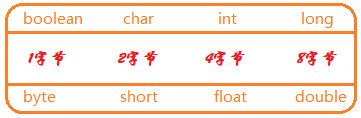
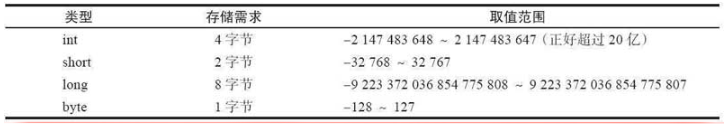
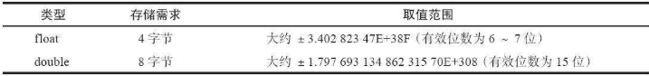
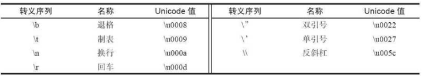
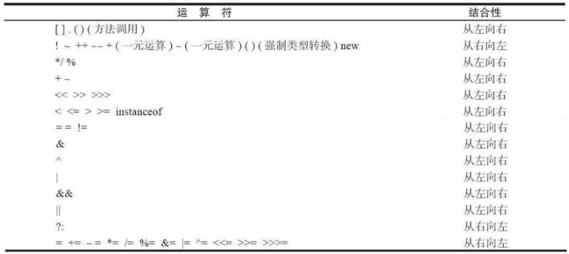
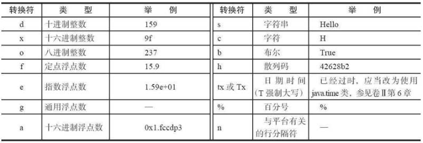
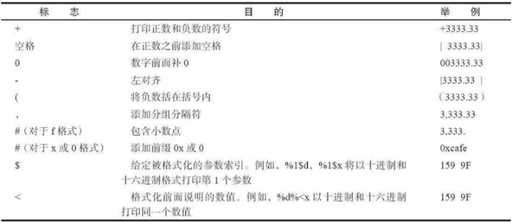
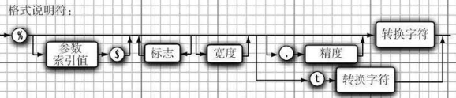

## 1.1 数据类型

### 1.1.1 8种基本数据类型

Java 支持的数据类型包括基本数据类型和引用类型。

Java是一种强类型语言。必须为每一个变量声明一种类型。在Java中，一共有8种基本类型（primitive type），其中有4种整型、2种浮点类型、1种用于表示Unicode编码的字符单元的字符类型char和1种用于表示真值的boolean类型。

> Java有一个能够表示任意精度的算术包，通常称为“大数值”（big number）。虽然被称为大数值，但它并不是一种新的Java类型，而是一个Java对象

> 引用类型声明的变量是指该变量在内存中实际存储的是一个引用地址，实体在堆中。
> 引用类型包括类、接口、数组等。
> 特别注意，String 是引用类型不是基本类型。

**基本数据类型如下：**

- 整数值型：byte、short、int、long
- 字符型：char
- 浮点类型：float、double
- 布尔型：boolean
  

> **字节：存储容量的基本单位**
> 
>
> 计算中1字节（8bit）可以表示的数字：**最小值：10000000 （-128）(-2^7) 最大值：01111111（127）(2^7-1) **https://blog.csdn.net/qq_23418393/article/details/57421688

---

#### **整型：**



> byte和short类型主要用于特定的应用场合，例如，底层的文件处理或者需要控制占用存储空间量的大数组。

整数型默认` int` 型，小数默认是` double `型。

长整型数值有一个后缀`L`或`l`（如4000000000L）。

十六进制数值有一个前缀`0x`或`0X`（如0xCAFE）。

八进制有一个前缀`0`，例如，010对应八进制中的8

前缀·`0b`或`0B`就可以写二进制数。例如，0b1001就是9

一个字节Bytes等于8位bit，一个字节等于256个数，就是`-128到127`一共256。

kB就是kBytes ，Bytes就是“字节”的意思！

K就是千的意思，因为计算机是通过二进制来计算，`10个1正好是1024`:`1111111111（二进制）=1024（十进制）`

**一个英文字母或一个阿拉伯数字就是一个字符，占用一个字节；一个汉字就是两个字符，占用两个字节。**

**一般讲大小是用Bytes，大写的“B”，讲网络速率是用bit，注意是小写的“b”**。
例：一个文件有8MBytes
例：我下载文件的速率是256KB/s，即2Mbit，这通常就是我们宽带上网的速率。

>==字节是存储容量的基本单位， 字符是数子， 字母， 汉子以及其他语言的各种符号==。
>1 字节=8 个二进制单位： 字符由一个字节或多个字节的二进制单位组成。  

---

#### **浮点型**

计算机使用浮点数运算的主因，在于电脑使用二进位制的运算。例如：4÷2=2，4的二进制表示为100、2的二进制表示为010，在二进制中，相当于退一位数(100 -> 010)。

1的二进制是01，1.0/2=0.5，那么，0.5的二进制表示应该为(0.1)，以此类推，0.25的二进制表示为0.01，所以，并不是说所有的十进制小数都能准确的用二进制表示出来，如0.1，因此只能使用近似值的方式表达。

也就是说，，十进制的小数在计算机中是由一个整数或定点数（即尾数）乘以某个基数（计算机中通常是2）的整数次幂得到的，这种表示方法类似于基数为10的科学计数法。

一个浮点数a由两个数m和e来表示：a = m × be。在任意一个这样的系统中，我们选择一个基数b（记数系统的基）和精度p（即使用多少位来存储）。m（即尾数）是形如±d.ddd...ddd的p位数（每一位是一个介于0到b-1之间的整数，包括0和b-1）。如果m的第一位是非0整数，m称作正规化的。有一些描述使用一个单独的符号位（s 代表+或者-）来表示正负，这样m必须是正的。e是指数。

位（bit）是衡量浮点数所需存储空间的单位，通常为32位或64位，分别被叫作单精度和双精度。



整数型默认` int` 型，小数默认是` double `型。

double表示这种类型的数值精度是float类型的两倍（有人称之为双精度数值）。绝大部分应用程序都采用double类型。

float类型的数值有一个后缀`F`或`f`（例如，3.14F）。没有后缀F的浮点数值（如3.14）默认为double类型。当然，也可以在浮点数值后面添加后缀D或d（例如，3.14D）

> 可以使用十六进制表示浮点数值。例如，0.125=2-3可以表示成0x1.0p-3。在十六进制表示法中，使用p表示指数，而不是e。注意，尾数采用十六进制，指数采用十进制。指数的基数是2，而不是10。

----

#### **char类型**

char类型原本用于表示单个字符。不过，现在情况已经有所变化。如今，有些Unicode字符可以用一个char值描述，另外一些Unicode字符则需要两个char值。

char类型的字面量值要用单引号括起来。例如：`'A'`是编码值为65所对应的字符常量。它与`"A"`不同，"A"是包含一个字符A的字符串。

**可以用4位十六进制值表示char类型的值，其范围从`\u0000 ~ \Uffff`。**例如：\u2122表示注册符号（TM），\u03C0表示希腊字母π。（`\u`为转义序列）

(==每四位bit可以表示成为一个16进制的数字，char字符2字节16位，因此可以用4个16进制的数字表示==)

> **特殊字符的转义序列**
>
> 

*****

**Unicode和char类型:**

Unicode出现之前，已经有许多种不同的标准，会出现以下问题：

- 一个是对于任意给定的代码值，在不同的编码方案下有可能对应不同的字母；
- 二是采用大字符集的语言其编码长度有可能不同。

**码点（code point）**是指与一个编码表中的某个字符对应的代码值。**在Unicode标准中，码点采用十六进制书写**，并加上前缀U+，例如U+0041就是拉丁字母A的码点。

Unicode的码点可以分成17个代码级别（code plane）。

- 第一个代码级别称为基本的多语言级别（basic multilingualplane），码点从·`U+0000`到`U+FFFF`，其中包括经典的Unicode代码；
- 其余的16个级别码点从`U+10000`到`U+10FFFF`，其中包括一些辅助字符（supplementary character）。

----

### 1.1.2 装箱拆箱

> ##### 基本数据类型有什么好处
>
> 我们都知道在Java语言中，`new`一个对象是存储在堆里的，我们通过栈中的引用来使用这些对象；所以，对象本身来说是比较消耗资源的。
>
> 对于经常用到的类型，如int等，如果我们每次使用这种变量的时候都需要new一个Java对象的话，就会比较笨重。所以，和C++一样，Java提供了基本数据类型，这种数据的变量不需要使用new创建，他们不会在堆上创建，而是直接在栈内存中存储，因此会更加高效。
>
> ##### 为什么使用包装类
>
> Java语言是一个面向对象的语言，但是Java中的基本数据类型却是不面向对象的，这在实际使用时存在很多的不便，比如集合中只能放对象，为了解决这个不足，在设计类时为每个基本数据类型设计了一个对应的类进行代表，这样八个和基本数据类型对应的类统称为包装类(Wrapper Class)。
>
> 包装类使得基本类型具有了对象的性质，并且为其添加了属性和方法，丰富了基本类型的操作。

#### Integer和int的区别

int是java的8种基本数据类型之一。Integer是Java为int类型提供的封装类。

int变量的默认值为`0`，Integer变量的默认值为`null`，这一点说明Integer可以区分出未赋值和值为0的区别，比如说一名学生没来参加考试，另一名学生参加考试全答错了，那么第一名考生的成绩应该是null，第二名考生的成绩应该是0分。

Integer类内提供了一些关于整数操作的一些方法。

> 注意：对象类型默认值是null，基本类型boolean默认是false

#### 自动装箱拆箱

自动装箱是 Java 编译器在基本数据类型和对应的对象包装类型（引用类型）之间做的一个转化。 比如： 把 int 转化成 Integer， double 转化成 Double， 等等。 反之就是自动拆箱。

原始类型: boolean， char， byte， short， int， long， float， double

封装类型： Boolean， Character， Byte， Short， Integer， Long， Float， Double  

##### 怎么自动转换？
https://www.cnblogs.com/wang-yaz/p/8516151.html

```
//自动装箱
Integer total = 99;
//自动拆箱
int totalprim = total;
```

`Integer total = 99; `执行上面那句代码的时候，系统为我们执行了： `Integer total = Integer.valueOf(99)；`

`int totalprim = total; ` 执行上面那句代码的时候，系统为我们执行了： `int totalprim = total.intValue();`

1. 看**valueOf**的源码会发现：

```java
public static Integer valueOf(int i) {
	 return  i >= 128 || i < -128 ? new Integer(i) : SMALL_VALUES[i + 128]; 
}
//下面看看SMALL_VALUES[i + 128]是什么东西：
private static final Integer[] SMALL_VALUES = new Integer[256];
//它是一个静态的 Integer对象 的数组对象 ，也就是说最终valueOf返回的都是一个  Integer对象。
```

装箱的过程会创建对应的对象，这个会消耗内存，所以装箱的过程会增加内存的消耗，影响性能。

2. 接着看看**intValue**函数

```java
1 @Override
2 public int intValue() {
3     return value;
4 }
```

这个很简单，直接返回value值即可。

**Integer派别**：Byte、Short、Integer、Long、Character这几个类的valueOf方法的实现是类似的。 

**Double派别**：Double、Float的valueOf方法的实现是类似的。每次都返回不同的对象。

Boolean 每次都是真，因为内部只有两个对象。

----

谈谈`Integer i = new Integer(xxx)`和`Integer i =xxx;`这两种方式的区别。

1）第一种方式不会触发自动装箱的过程；而第二种方式会触发；

2）在执行效率和资源占用上的区别。第二种方式的执行效率和资源占用在一般性情况下要优于第一种情况（注意这并不是绝对的）

```java
  public class Main {
    public static void main(String[] args) {
        Int a1 = 1；
        Integer a = 1;
        Integer b = 2;
        Integer c = 3;
        Integer d = 3;
        Integer e = 321;
        Integer f = 321;
        Long g = 3L;
        Long h = 2L;
        System.out.println(a1==a); //true 相当于两个数在比较
        System.out.println(c==d);//true 比较的是对象，-128~127之间
        System.out.println(e==f);//false  比较的是对象
        System.out.println(c==(a+b));//true  相当于两个数在比较
        System.out.println(c.equals(a+b));//true
        System.out.println(g==(a+b));//true
        System.out.println(g.equals(a+b));//false  
        System.out.println(g.equals(a+h));//true
    }
}
 
```

1）当 "=="运算符的两个操作数都是包装器类型的引用，则是比较指向的是否是同一个对象，而如果其中有一个操作数是表达式（即包含**算术运算**）则比较的是数值（即会触发自动拆箱的过程）

2）`a+b`包含了**算术运算**，因此会触发自动拆箱过程（会调用intValue方法），因此它们比较的是数值是否相等。
而对于`c.equals(a+b)`会先触发自动拆箱过程，再触发自动装箱过程，也就是说a+b，会先各自调用`intValue`方法，得到了加法运算后的数值之后，便调用`Integer.valueOf`方法，再进行`equals`比较。

3）**equals**源码：

```java
@Override
public boolean equals(Object o) {
	//instanceof 严格来说是Java中的一个双目运算符，用来测试一个对象是否为一个类的实例
     return (o instanceof Integer) && (((Integer) o).value == value);
 }
```

说明它必须满足两个条件才为true： 
 **1、类型相同 2、内容相同**   所以解释了第六个false的原因

```java
int a=25;
Integer b=25;
Integer c=25;
Integer d=new Integer(a);
Integer d1=new Integer(a);
Integer f = Integer.intValue(a); 

System.out.println(d==d1); 
//  false  两个Integer对象进行“==”比较时，如果有一方的Integer对象是new获得的，返回false,因为比较的是两个对象的地址  （和字符串的相似）
System.out.println(b==d);
//  false  两个Integer对象进行“==”比较时，如果有一方的Integer对象是new获得的，返回false,因为比较的是两个对象的地址。
 
System.out.println(b==f);
//2  true  因为值在-127和128之间 就会在常量池中直接获取（不通过new方式）此时比较的也是两个对象的地址 因为常量池中只有一个25  所以返回true 
//而且这两个都会调用valueOf方法,所以返回的是同一个
//解释：new出来的是对象放在堆中，不调用valueOf方法。
//两个基本型的封装型进行equals()比较，首先equals()会比较类型，如果类型相同，则继续比较值，如果值也相同，返回true，
```

#### 什么时候会触发自动拆装箱？

**装箱：**

1. **在基本类型的值赋值给包装类型时触发**。例如：Integer a = 1，调用`valueOf()`方法；

2. **equals方法比较时会触发装箱；**

3. **基本类型放入集合中**

4. ###### 函数参数与返回值

**拆箱：**

1. 只要**遇到算术运算**就会自动拆箱
2. 当第二，第三位操作数分别为**基本类型**和**对象**时，其中的对象就会拆箱为基本类型进行操作。
3. 函数参数与返回值

#### 自动拆装箱带来的问题

当然，自动拆装箱是一个很好的功能，大大节省了开发人员的精力，不再需要关心到底什么时候需要拆装箱。但是，他也会引入一些问题。

> 包装对象的数值比较，不能简单的使用`==`，虽然-128到127之间的数字可以，但是这个范围之外还是需要使用`equals`比较。
>
> 前面提到，有些场景会进行自动拆装箱，同时也说过，由于自动拆箱，如果包装类对象为null，那么自动拆箱时就有可能抛出NPE。
>
> 如果一个for循环中有大量拆装箱操作，会浪费很多资源

### 1.1.3 `short s1 = 1; s1 = s1 + 1;`与 `short s1 = 1; s1 +=1;`

对于`short s1 = 1; s1 = s1 + 1;`由于1是int类型，因此`s1+1`计算结果也是int 型，需要强制转换类型才能赋值给short型。
而`short s1 = 1; s1 += 1;`可以正确编译，因为`s1+= 1;`相当于`s1 = (short)(s1 + 1);`其中有隐含的强制类型转换。

### 1.1.4 char 型变量中能不能存贮一个中文汉字？为什么？

在 Java 语言中，char 类型占 2 个字节，而且 Java 默认采用 **Unicode 编码**，一个 Unicode 码是 16 位，所以一个 **Unicode 码占两个字节**，Java 中无论汉字还是英文字母，都是用 Unicode 编码来表示的。所以，在 Java 中，**char 类型变量可以存储一个中文汉字。**

在 C 语言中，char 类型占 1 个字节，而**汉字占 2 个字节**，所以不能存储。

### 1.1.5 switch语句能否作用在byte上，能否作用在long上，能否作用在string上？

在switch(expr1)中，expr1只能是一个**整数表达式**或者**枚举常量**或者**String类型**，
整数表达式可以是**int基本类型**或**Integer包装类型**。
由于，**byte,short,char**都可以隐式转换为int，所以，这些类型以及这些类型的包装类型也是可以的。

long和String类型都不符合switch的语法规定，并且不能被隐式转换成int类型，所以，它们不能作用于swtich语句中。

不过，在1.7版本之后switch就**可以作用在string上**了（使用hashcode转换）。

### 1.1.6 基本类型和引用类型

基本类型保存原始值， 引用类型保存的是引用值（ 引用值就是指对象在堆中所处的位置/地址）  

## 1.2 字符串

从概念上讲，Java字符串就是Unicode字符序列。Java没有内置的字符串类型，而是在标准Java类库中提供了一个预定义类String。每个用双引号括起来的字符串都是String类的一个实例

字符串底层是`public static final char[];`不可变的char数组


---

**不可变字符串**

String类对象称为不可变字符串，不可变字符串却有一个优点：编译器可以让字符串共享。各种字符串存放在字符串常量池中，字符串变量指向存储池中相应的位置。

对于字符串，**其对象的引用都是存储在栈中的，如果是编译期已经创建好(直接用双引号定义的)的就存储在常量池中，如果是运行期（new出来的）才能确定的就存储在堆中**。对于equals相等的字符串，在常量池中永远只有一份，在堆中有多份。

---

**检测字符串是否相等**

可以使用equals方法检测两个字符串是否相等。一定不要使用`==`运算符检测两个字符串是否相等！这个运算符只能够确定两个字符串是否放置在同一个位置上（地址值是否相等）。如果虚拟机始终将相同的字符串共享，就可以使用==运算符检测是否相等。但实际上只有字符串常量是共享的，而**+或substring等操作产生的结果并不是共享的**。

---

**空串与Null串**

空串""是长度为0的字符串。可以调用以下代码检查一个字符串是否为空：`if(str.length()==0)`或`if(str.equals(""))`

空串是一个Java对象，有自己的串长度（0）和内容（空）。不过，String变量还可以存放一个特殊的值，名为null，这表示目前没有任何对象与该变量关联。要检查一个字符串是否为null，要使用以下条件：`if(str == null)`。

有时要**检查一个字符串既不是null也不为空串**，这种情况下就需要使用以下条件：`if((str!=null)&&(str.length()!=0))`,首先要检查str不为null。

---

**码点与代码单元**

Java字符串由char值序列组成。

char数据类型是一个采用UTF-16编码表示Unicode码点的代码单元（2字节/16位）。大多数的常用Unicode字符使用**一个代码单元**就可以表示，而辅助字符需要**一对代码单元**表示。

`length()`方法将返回采用UTF-16编码表示的给定字符串所需要的代码单元数量。

---

**字符串拼接**

Java语言允许使用`+`号连接（拼接）两个字符串。当将一个字符串与一个非字符串的值进行拼接时，后者被转换成字符串（任何一个Java对象都可以转换成字符串）

1. String s = "a" + "b"，编译器会进行常量折叠(因为两个都是编译期常量，编译期可知)，即变成 String s = "ab"
2. 对于能够进行优化的(String s = "a" + 变量 等)用 StringBuilder 的 `append()` 方法替代，最后调用 `toString()` 方法 (底层就是一个 new String())

---

**构建字符串**

采用字符串连接的方式达到构建字符串的目的效率比较低。每次连接字符串，都会构建一个新的String对象，既耗时，又浪费空间。

应该按照下列步骤进行。

- 首先，构建一个空的字符串构建器：`StringBuilder builder = new StringBuilder();`
- 每次需要添加一部分内容时，就调用append方法:`builder.append("love ")`,`builder.append('Y')`
- 在需要构建字符串时就调用toString方法，将可以得到一个String对象:`String res = builder.toString();`

> 循环体内，字符串的连接方式，使用 `StringBuilder` 的 `append` 方法进行扩展。而不要使用`+`。

----

**String API:**


## 1.3 变量与运算符

在Java中，每个变量都有一个类型（type）。在声明变量时，变量的类型位于变量名之前。

声明一个变量之后，必须用赋值语句对变量进行显式初始化，千万不要使用未初始化的变量。

在Java中，变量的声明尽可能地靠近变量第一次使用的地方，这是一种良好的程序编写风格。

在Java中，利用关键字final指示常量。关键字final表示这个变量只能被赋值一次。一旦被赋值之后，就不能够再更改了。

Java中，经常希望某个常量可以在一个类中的多个方法中使用，通常将这些常量称为类常量。可以使用关键字static final设置一个类常量。

----

Java中，使用算术运算符+、-、*、/表示加、减、乘、除运算。当参与/运算的两个操作数都是整数时，表示整数除法；否则，表示浮点除法。整数的求余操作（有时称为取模）用%表示。



## 1.4 输入与输出

要想通过控制台进行输入，首先需要构造一个Scanner对象，并与“标准输入流”System.in关联：`Scanner in = new Scanner(System.in);`

- `nextLine()`方法将输入一行
- 要想读取一个单词（以空白符作为分隔符），就调用:`in.next()`
- 要想读取一个整数，就调用`nextInt()`。
- 要想读取下一个浮点数，就调用`nextDouble()`
- `boolean hasNext()`检测输入中是否还有其他单词。
- `boolean hasNextInt()`,`boolean hasNextDouble()`检测是否还有表示整数或浮点数的下一个字符序列。

---------

 **格式化输出:**

可以使用`System.out.print(x)`将数值x输出到控制台上

可以用`System.out.printf()`格式化输出：

> 在printf中，可以使用多个参数，每一个以`%`字符开始的格式说明符都用相应的参数替换。
>
> 格式说明符尾部的转换符将指示被格式化的数值类型：`f表示浮点数，s表示字符串，d表示十进制整数`。
>
> 
>
> 另外，还可以给出控制格式化输出的各种标志:`System.out.printf("%,.2f",10000.0/3.0)`=>`3,33.33`
>
> 
>
> 可以同时使用多个标志，参数索引值从1开始，而不是从0开始，索引必须紧跟在%后面，并以$终止
>
> 

----

**文件的输入输出**

## 1.5 数组赋值

数组是一种数据结构，用来存储同一类型值的集合。通过一个整型下标可以访问数组中的每一个值。

在声明数组变量时，需要指出数组类型（**数据元素类型紧跟[]**）和数组变量的名字:`int[] a;`

不过，这条语句只声明了变量a，并没有将a初始化为一个真正的数组。应该使用new运算符创建数组:`a=new int[100];`

创建一个数字数组时，所有元素都初始化为`0`。boolean数组的元素会初始化为`false`。对象数组的元素则初始化为一个特殊值`null`，这表示这些元素（还）未存放任何对象。

> 声明变量之后，就在内存中分配了一块位置，位置的内容是未知的，赋值就是把这块位置的内容设为一个确定的值。

基本类型的数组有3中赋值方式：

```java
int[] arr = {1,2,3};//已知数组内容;一种创建数组对象并同时赋予初始值的简化书写形式
int[] arr = new int[]{1,2,3};//已知数组内容;初始化一个匿名的数组
int[] arr = new int[3];arr[0]=1;//先分配长度，再单独赋值
```

数组长度可以动态确定，但定了之后就不能改变。数组的length属性只能读不能改。

数组不能在给的初始值的同时给定长度。

> 在Java中，允许数组长度为0。在编写一个结果为数组的方法时，如果碰巧结果为空，则这种语法形式就显得非常有用。

> 基本类型变量，内存中只会有一块对应的内存空间。数组有两块：一块用于存储数组内容本身（堆），另一块用于存储内容的位置（栈）。

----

**for each循环**

Java有一种功能很强的循环结构，可以用来依次处理数组中的每个元素（其他类型的元素集合亦可）而不必为指定下标值而分心。这种增强的for循环的语句格式为：`for(T variable : collection){statement}`

定义一个变量用于暂存集合中的每一个元素，并执行相应的语句（当然，也可以是语句块）。collection这一集合表达式必须是一个数组或者是一个实现了Iterable接口的类对象

----

**数组拷贝**

在Java中，允许将一个数组变量拷贝给另一个数组变量。这时，两个变量将引用同一个数组：

```java
int arr1 = arr2;
arr1[0] = 3;//arr1和arr2指向同一个数组
```

如果希望将一个数组的所有值拷贝到一个新的数组中去，就要使用Arrays类的copyOf方法：这个方法通常用来增加数组的大小

```java
arr1 = Arrays.copyOf(arr1,2*arr1.length);
```

-----

**多维数组**

多维数组将使用多个下标访问数组元素，它适用于表示表格或更加复杂的排列形式。

声明一个二维数组:`int[][] arrs;`

初始化：`arrs = new int[m][n]`

Java实际上没有多维数组，只有一维数组。多维数组被解释为“数组的数组。”

## 1.6 大数值

如果基本的整数和浮点数精度不能够满足需求，那么可以使用java.math包中的两个很有用的类：BigInteger和BigDecimal。这两个类可以处理包含任意长度数字序列的数值。BigInteger类实现了任意精度的整数运算，BigDecimal实现了任意精度的浮点数运算。

静态的valueOf方法可以将普通的数值转换为大数值：`BigInteger a = BigInteger.valueOf(100)`

大数值不能使用人们熟悉的算术运算符（如：+和*）处理。而需要使用大数值类中的`add·`和`multiply`方法

- BigInteger add（BigInteger other）
- BigInteger subtract（BigInteger other）
- BigInteger multiply（BigInteger other）
- BigInteger divide（BigInteger other）
- BigInteger mod（BigInteger other）返回这个大整数和另一个大整数other的和、差、积、商以及余数。
- int compareTo（BigInteger other）如果这个大整数与另一个大整数other相等，返回0；如果这个大整数小于另一个大整数other，返回负数；否则，返回正数。
- static BigInteger valueOf（long x）返回值等于x的大整数。

## 1.7 条件执行

> **块**（即复合语句）是指由一对大括号括起来的若干条简单的Java语句。块确定了变量的作用域。一个块可以嵌套在另一个块中。但是，不能在嵌套的两个块中声明同名的变量。

----

**条件语句if**

`if(condition){statement}`

单一条件满足时使用`if`；根据一个条件是否满足执行不同分支使用`if/else`；表达复杂的条件使用`if/else if/else`;

> **条件赋值**使用三元运算符；根据某一个表达式的值执行不同的分支使用switch；

> 程序最终都是一条条的指令，CPU有一个指令指示器，指向下一条要执行的指令，CPU根据指示器的指示加载指令并且执行。指令大部分是具体的操作和运算，在执行这些操作时，执行完一个操作后，指令指示器会自动指向挨着的下一条指令。
>
> 但有一些特殊的指令，称为**跳转指令**，这些指令会修改指令指示器的值，让CPU跳到一个指定的地方执行。
>
> 跳转有两种：**一种是条件跳转；另一种是无条件跳转**。条件跳转检查某个条件，满足则进行跳转，无条件跳转则是直接进行跳转。
>
> **条件执行就是依赖跳转指令实现的。**
>
>  如果分支比较多，使用条件跳转会进行很多次的比较运算，效率比较低，可能会使用一种更为高效的方式，叫**跳转表**。跳转表是一个映射表，存储了可能的值以及要跳转到的地址。

---

**循环**

`while(condition){statement}`

while循环语句首先检测循环条件。因此，循环体中的代码有可能不被执行。如果希望循环体至少执行一次，则应该将检测条件放在最后。使用do/while循环语句可以实现这种操作方式:

`do{statement}while(conditon)`

---

**确定循环**

for循环语句是支持迭代的一种通用结构，利用每次迭代之后更新的计数器或类似的变量来控制迭代次数。

`for(int i=0; i<10; i++){statement}`for语句的第1部分通常用于对计数器初始化；第2部分给出每次新一轮循环执行前要检测的循环条件；第3部分指示如何更新计数器。

> for语句的3个部分应该对同一个计数器变量进行初始化、检测和更新。若不遵守这一规则，编写的循环常常晦涩难懂。

----

**多重选择：switch语句**

```java
int res=2;
switch(res){
	case: 1
		...
		break;
    case: 2
    	...
    	break;
    default:
    	...
    	break;
}
```

switch语句将从与选项值相匹配的case标签处开始执行直到遇到break语句，或者执行到switch语句的结束处为止。如果没有相匹配的case标签，而有default子句，就执行这个子句。

> 程序源代码中的case值排列不要求是排序的，编译器会自动排序。
>
> 有可能触发多个case分支。如果在case分支语句的末尾没有break语句，那么就会接着执行下一个case分支语句。

case标签可以是：

- 类型为char、byte、short或int的常量表达式。
- 枚举常量。
- 从Java SE 7开始，case标签还可以是**字符串字面量**。

> 其中byte、short、int本来就是整数，char本质上也是整数，而枚举类型也有对应的整数, String用于switch时也会转换为整数。
>
> 不可以使用long，为什么呢？**跳转表**值的存储空间一般为32位，**容纳不下long**。
>
> 简单说明下String, String是通过hashCode方法转换为整数的，但不同String的hashCode可能相同，跳转后会再次根据String的内容进行比较判断。

----

**中断控制流程语句**

break跳出整个循环

continue跳出当前循环

> Java还提供了一种带标签的break语句，用于跳出多重嵌套的循环语句。有时候，在嵌套很深的循环语句中会发生一些不可预料的事情。此时可能更加希望跳到嵌套的所有循环语句之外。
>
> ```
> label:
> {
> ....
> if(condition) break label;
> }
> ```
>
> 标签必须放在希望跳出的最外层循环之前，并且必须紧跟一个冒号。

## 1.8 函数调用

函数的主要组成部分有以下几种。
1）函数名字：名字是不可或缺的，表示函数的功能。
2）参数：参数有0个到多个，每个参数由参数的数据类型和参数名字组成。
3）操作：函数的具体操作代码。
4）返回值：函数可以没有返回值，如果没有返回值则类型写成void，如果有则在函数代码中必须使用return语句返回一个值，这个值的类型需要和声明的返回值类型一致。
5）修饰符：Java中函数有很多修饰符，分别表示不同的目的

程序执行基本上只有顺序执行、条件执行和循环执行，但更完整的描述应该包括函数的调用过程。程序从main函数开始执行，碰到函数调用的时候，会跳转进函数内部，函数调用了其他函数，会接着进入其他函数，函数返回后会继续执行调用后面的语句，返回到main函数并且main函数没有要执行的语句后程序结束

**理解返回** ：return可以用于函数内的任意地方，可以在函数结尾，也可以在中间，可以在if语句内，可以在for循环内，用于提前结束函数执行，返回调用方。

**重复的命名** ：同一个类里，函数可以重名，但是参数不能完全一样，即要么参数个数不同，要么参数个数相同但至少有一个参数类型不一样。 
同一个类中函数名相同但参数不同的现象，一般称为**函数重载**

**调用的匹配过程** :参数传递实际上是给参数赋值，调用者传递的数据需要与函数声明的参数类型是匹配的，但不要求完全一样

>Java编译器会自动进行类型转换，并寻找最匹配的函数  
>在只有一个函数的情况下，即没有重载，只要可以进行类型转换，就会调用该函数，在有函数重载的情况下，会调用最匹配的函数

**递归函数**:函数大部分情况下都是被别的函数调用的，但其实函数也可以调用它自己，调用自己的函数就叫递归函数  
递归函数经常可以转换为非递归的形式，通过循环实现。   

## 1.9 函数调用的基本原理

程序执行的基本原理：CPU有一个指令指示器，指向下一条要执行的指令，要么顺序执行，要么进行跳转（条件跳转或无条件跳转）。

计算机系统主要使用栈来存放函数调用过程中需要的数据，包括参数、返回地址，以及函数内定义的局部变量。计算机系统就如何在栈中存放这些数据，调用者和函数如何协作做了约定；  
返回值不太一样，它可能放在栈中，但它使用的栈和局部变量不完全一样，有的系统使用CPU内的一个存储器存储返回值，我们可以简单<u>认为存在一个专门的返回值存储器</u>。main函数的相关数据放在栈的最下面，每调用一次函数，都会将相关函数的数据入栈，调用结束会出栈。

函数中的参数和函数内定义的变量，都分配在栈中，这些变量只有在函数被调用的时候才分配，而且在调用结束后就被释放了。但这个说法主要针对基本数据类型  
对于数组和对象类型，我们介绍过，它们都有两块内存，一块存放实际的内容，一块存放实际内容的地址，实际的内容空间一般不是分配在栈上的，而是分配在堆 

函数调用主要是通过栈来存储相关的数据，系统就函数调用者和函数如何使用栈做了约定，返回值可以简单认为是通过一个专门的返回值存储器存储的。从函数调用的过程可以看出，调用是有成本的，每一次调用都需要分配额外的栈空间用于存储参数、局部变量以及返回地址，需要进行额外的入栈和出栈操作

## TheEnd

1. 对象是由基本数据类型、数组和其他对象组合而成的一个东西，以方便对其整体进行操作。
2. 日期在Java中也是一个对象，内部表示为整型long。
3. 内存在程序看来就是一块有地址编号的连续空间。
4. 变量表示的是内存中的位置，这个位置存放的值是可以变化的。但是变量的名字是不变的，代表程序员心目中这块内存空间的意义。即变量就是给数据起名字，方便找不同的数据，它的值可以改变，但是含义不变。

