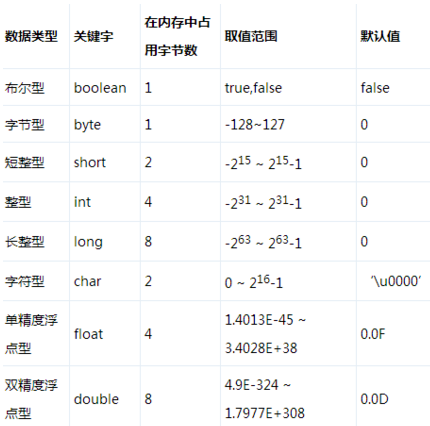

## 1.1 数据类型

### 1.1.1 8种基本数据类型

Java 支持的数据类型包括基本数据类型和引用类型。
**基本数据类型如下：**
整数值型：byte、short、int、long
字符型：char
浮点类型：float、double
布尔型：boolean


**字节：**
boolean 布尔型 1/8或者1
byte 字节类型 1
char 字符型 2 一个字符能存储一个中文汉字
short 短整型 2
int 整数类型 4
float 浮点类型（单精度） 4
long 长整形 8
double 双精度类型（双精度） 8

整数型：默认 int 型，小数默认是 double 型。
Float 和 Long 类型的必须加后缀。比如：`float f = 100f `。
一个字节Bytes等于8位bit，一个字节等于256个数，就是`-128到127`一共256。
kB就是kBytes Bytes就是“字节”的意思！
K就是千的意思，因为计算机是通过二进制来计算，`10个1正好是1024`:`1111111111（二进制）=1024（十进制）`
**一个英文字母或一个阿拉伯数字就是一个字符，占用一个字节
一个汉字就是两个字符，占用两个字节。**
**一般讲大小是用Bytes，大写的“B”，讲网络速率是用bit，注意是小写的“b”**。
例：一个文件有8MBytes
例：我下载文件的速率是256KB/s，即2Mbit，这通常就是我们宽带上网的速率。

>字节是存储容量的基本单位， 字符是数子， 字母， 汉子以及其他语言的各种符号。
>1 字节=8 个二进制单位： 字符由一个字节或多个字节的二进制单位组成。  

> 引用类型声明的变量是指该变量在内存中实际存储的是一个引用地址，实体在堆中。
> 引用类型包括类、接口、数组等。
> 特别注意，String 是引用类型不是基本类型。

### 1.1.2 装箱拆箱

自动装箱是 Java 编译器在基本数据类型和对应的对象包装类型（引用类型）之间做的一个转化。 
比如： 把 int 转化成 Integer， double 转化成 Double， 等等。 反之就是自动拆箱。
原始类型: boolean， char， byte， short， int， long， float， double
封装类型： Boolean， Character， Byte， Short， Integer， Long， Float， Double  

#### Integer和int的区别

int是java的8种基本数据类型之一。Integer是Java为int类型提供的封装类。

int变量的默认值为0，Integer变量的默认值为null，这一点说明Integer可以区分出未赋值和值为0的区别，比如说一名学生没来参加考试，另一名学生参加考试全答错了，那么第一名考生的成绩应该是null，第二名考生的成绩应该是0分。

Integer类内提供了一些关于整数操作的一些方法。

#### 为什么要转换？
如果你在 Java5 下进行过编程的话，你一定不会陌生这一点，你不能直接地向集合( Collection )中放入原始类型值，因为**集合只接收对象**。

https://www.cnblogs.com/wang-yaz/p/8516151.html

```
//自动装箱
Integer total = 99;
//自动拆箱
int totalprim = total;
```

`Integer total = 99; `执行上面那句代码的时候，系统为我们执行了： `Integer total = Integer.valueOf(99)；`

`int totalprim = total; ` 执行上面那句代码的时候，系统为我们执行了： `int totalprim = total.intValue();`

1、看**valueOf**的源码会发现：

```java
public static Integer valueOf(int i) {
	 return  i >= 128 || i < -128 ? new Integer(i) : SMALL_VALUES[i + 128]; 
}
//下面看看SMALL_VALUES[i + 128]是什么东西：
private static final Integer[] SMALL_VALUES = new Integer[256];
//它是一个静态的Integer数组对象，也就是说最终valueOf返回的都是一个  Integer对象。
```

装箱的过程会创建对应的对象，这个会消耗内存，所以装箱的过程会增加内存的消耗，影响性能。

2、接着看看**intValue**函数

```java
1 @Override
2 public int intValue() {
3     return value;
4 }
```

这个很简单，直接返回value值即可。

3、**Integer派别**：Byte、Short、Integer、Long、Character这几个类的valueOf方法的实现是类似的。 
 **Double派别**：Double、Float的valueOf方法的实现是类似的。每次都返回不同的对象。

Boolean 每次都是真，因为内部只有两个对象。

4、谈谈`Integer i = new Integer(xxx)`和`Integer i =xxx;`这两种方式的区别。

　　1）第一种方式不会触发自动装箱的过程；而第二种方式会触发；
	   2）在执行效率和资源占用上的区别。第二种方式的执行效率和资源占用在一般性情况下要优于第一种情况（注意这并不是绝对的）

```java
  public class Main {
    public static void main(String[] args) {
        Int a1 = 1；
        Integer a = 1;
        Integer b = 2;
        Integer c = 3;
        Integer d = 3;
        Integer e = 321;
        Integer f = 321;
        Long g = 3L;
        Long h = 2L;
        System.out.println(a1==a); //true 相当于两个数在比较
        System.out.println(c==d);//true 比较的是对象
        System.out.println(e==f);//false  比较的是对象
        System.out.println(c==(a+b));//true  相当于两个数在比较
        System.out.println(c.equals(a+b));//true
        System.out.println(g==(a+b));//true
        System.out.println(g.equals(a+b));//false  
        System.out.println(g.equals(a+h));//true
    }
}
 
```

1）当 "=="运算符的两个操作数都是包装器类型的引用，则是比较指向的是否是同一个对象，而如果其中有一个操作数是表达式（即包含**算术运算**）则比较的是数值（即会触发自动拆箱的过程）

2）`a+b`包含了**算术运算**，因此会触发自动拆箱过程（会调用intValue方法），因此它们比较的是数值是否相等。
而对于`c.equals(a+b)`会先触发自动拆箱过程，再触发自动装箱过程，也就是说a+b，会先各自调用`intValue`方法，得到了加法运算后的数值之后，便调用`Integer.valueOf`方法，再进行`equals`比较。

3）**equals**源码：

```java
@Override
public boolean equals(Object o) {
	//instanceof 严格来说是Java中的一个双目运算符，用来测试一个对象是否为一个类的实例
     return (o instanceof Integer) && (((Integer) o).value == value);
 }
```

说明它必须满足两个条件才为true： 
 **1、类型相同 2、内容相同**   所以解释了第六个false的原因

6、

```java
int a=25;
Integer b=25;
Integer c=25;
Integer d=new Integer(a);
Integer d1=new Integer(a);
Integer f = Integer.intValue(a); 

System.out.println(d==d1); 
//  false  两个Integer对象进行“==”比较时，如果有一方的Integer对象是new获得的，返回false,因为比较的是两个对象的地址  （和字符串的相似）
System.out.println(b==d);
//  false  两个Integer对象进行“==”比较时，如果有一方的Integer对象是new获得的，返回false,因为比较的是两个对象的地址。
 
System.out.println(b==f);
//2  true  因为值在-127和128之间 就会在常量池中直接获取（不通过new方式）此时比较的也是两个对象的地址 因为常量池中只有一个25  所以返回true 
//而且这两个都会调用valueOf方法,所以返回的是同一个
//解释：new出来的是对象放在堆中，不调用valueOf方法。
//两个基本型的封装型进行equals()比较，首先equals()会比较类型，如果类型相同，则继续比较值，如果值也相同，返回true，
```

7、==什么时候会触发自动拆装箱？==

**装箱：**
**1、在基本类型的值赋值给包装类型时触发**。例如：Integer a = 1，调用`valueOf()`方法；
**2、equals方法比较时会触发装箱；**

**拆箱：**
只要**遇到算术运算**就会自动拆箱

### 1.1.3 `short s1 = 1; s1 = s1 + 1;`与 `short s1 = 1; s1 +=1;`

对于`short s1 = 1; s1 = s1 + 1;`由于1是int类型，因此`s1+1`计算结果也是int 型，需要强制转换类型才能赋值给short型。
而`short s1 = 1; s1 += 1;`可以正确编译，因为`s1+= 1;`相当于`s1 = (short)(s1 + 1);`其中有隐含的强制类型转换。

### 1.1.4 char 型变量中能不能存贮一个中文汉字？为什么？

在 Java 语言中，char 类型占 2 个字节，而且 Java 默认采用 **Unicode 编码**，一个 Unicode 码是 16 位，所以一个 **Unicode 码占两个字节**，Java 中无论汉字还是英文字母，都是用 Unicode 编码来表示的。所以，在 Java 中，**char 类型变量可以存储一个中文汉字。**

在 C 语言中，char 类型占 1 个字节，而**汉字占 2 个字节**，所以不能存储。

### 1.1.5 switch语句能否作用在byte上，能否作用在long上，能否作用在string上？

在switch(expr1)中，expr1只能是一个**整数表达式**或者**枚举常量**或者**String类型**，
整数表达式可以是**int基本类型**或**Integer包装类型**。
由于，**byte,short,char**都可以隐式转换为int，所以，这些类型以及这些类型的包装类型也是可以的。

long和String类型都不符合switch的语法规定，并且不能被隐式转换成int类型，所以，它们不能作用于swtich语句中。

不过，在1.7版本之后switch就可以作用在string上了。

### 1.1.6 基本类型和引用类型

基本类型保存原始值， 引用类型保存的是引用值（ 引用值就是指对象在堆中所处的位置/地址）  

## 1.2 数组赋值

声明变量之后，就在内存中分配了一块位置，单证位置的内容是未知的，赋值就是把这块位置的内容设为一个确定的值。

基本类型的数组有3中赋值方式：

```java
int[] arr = {1,2,3};//已知数组内容
int[] arr = new int[]{1,2,3};//已知数组内容
int[] arr = new int[3];arr[0]=1;//先分配长度，再单独赋值
```

数组长度可以动态确定，但定了之后就不能改变。数组的length属性只能读不能改。
数组不能在给的初始值的同时给定长度。

基本类型变量，内存中只会有一块对应的内存空间。数组有两块：一块用于存储数组内容本身（堆），另一块用于存储内容的位置（栈）。

## 1.3 条件执行

单一条件满足时使用if；根据一个条件是否满足执行不同分支使用if/else；表达复杂的条件使用if/else if/else;条件赋值使用三元运算符；根据某一个表达式的值执行不同的分支使用switch；

程序最终都是一条条的指令，CPU有一个指令指示器，指向下一条要执行的指令，CPU根据指示器的指示加载指令并且执行。指令大部分是具体的操作和运算，在执行这些操作时，执行完一个操作后，指令指示器会自动指向挨着的下一条指令。
但有一些特殊的指令，称为**跳转指令**，这些指令会修改指令指示器的值，让CPU跳到一个指定的地方执行。
跳转有两种：**一种是条件跳转；另一种是无条件跳转**。条件跳转检查某个条件，满足则进行跳转，无条件跳转则是直接进行跳转。条件执行就是依赖跳转指令实现的。

 如果分支比较多，使用条件跳转会进行很多次的比较运算，效率比较低，可能会使用一种更为高效的方式，叫**跳转表**。跳转表是一个映射表，存储了可能的值以及要跳转到的地址。

 程序源代码中的case值排列不要求是排序的，编译器会自动排序。之前说switch值的类型可以是**byte、short、int、char、枚举和String**。其中byte/short/int本来就是整数，char本质上也是整数，而枚举类型也有对应的整数, String用于switch时也会转换为整数。不可以使用long，为什么呢？**跳转表**值的存储空间一般为32位，容纳不下long。简单说明下String, String是通过hashCode方法转换为整数的，但不同String的hashCode可能相同，跳转后会再次根据String的内容进行比较判断。

## 1.4 函数调用

函数的主要组成部分有以下几种。
1）函数名字：名字是不可或缺的，表示函数的功能。
2）参数：参数有0个到多个，每个参数由参数的数据类型和参数名字组成。
3）操作：函数的具体操作代码。
4）返回值：函数可以没有返回值，如果没有返回值则类型写成void，如果有则在函数代码中必须使用return语句返回一个值，这个值的类型需要和声明的返回值类型一致。
5）修饰符：Java中函数有很多修饰符，分别表示不同的目的

程序执行基本上只有顺序执行、条件执行和循环执行，但更完整的描述应该包括函数的调用过程。程序从main函数开始执行，碰到函数调用的时候，会跳转进函数内部，函数调用了其他函数，会接着进入其他函数，函数返回后会继续执行调用后面的语句，返回到main函数并且main函数没有要执行的语句后程序结束

**理解返回** ：return可以用于函数内的任意地方，可以在函数结尾，也可以在中间，可以在if语句内，可以在for循环内，用于提前结束函数执行，返回调用方。

**重复的命名** ：同一个类里，函数可以重名，但是参数不能完全一样，即要么参数个数不同，要么参数个数相同但至少有一个参数类型不一样。 
同一个类中函数名相同但参数不同的现象，一般称为**函数重载**

**调用的匹配过程** :参数传递实际上是给参数赋值，调用者传递的数据需要与函数声明的参数类型是匹配的，但不要求完全一样

>Java编译器会自动进行类型转换，并寻找最匹配的函数  
>在只有一个函数的情况下，即没有重载，只要可以进行类型转换，就会调用该函数，在有函数重载的情况下，会调用最匹配的函数

**递归函数**:函数大部分情况下都是被别的函数调用的，但其实函数也可以调用它自己，调用自己的函数就叫递归函数  
递归函数经常可以转换为非递归的形式，通过循环实现。   

## 1.5 函数调用的基本原理

程序执行的基本原理：CPU有一个指令指示器，指向下一条要执行的指令，要么顺序执行，要么进行跳转（条件跳转或无条件跳转）。

计算机系统主要使用栈来存放函数调用过程中需要的数据，包括参数、返回地址，以及函数内定义的局部变量。计算机系统就如何在栈中存放这些数据，调用者和函数如何协作做了约定；  
返回值不太一样，它可能放在栈中，但它使用的栈和局部变量不完全一样，有的系统使用CPU内的一个存储器存储返回值，我们可以简单<u>认为存在一个专门的返回值存储器</u>。main函数的相关数据放在栈的最下面，每调用一次函数，都会将相关函数的数据入栈，调用结束会出栈。

函数中的参数和函数内定义的变量，都分配在栈中，这些变量只有在函数被调用的时候才分配，而且在调用结束后就被释放了。但这个说法主要针对基本数据类型  
对于数组和对象类型，我们介绍过，它们都有两块内存，一块存放实际的内容，一块存放实际内容的地址，实际的内容空间一般不是分配在栈上的，而是分配在堆 

函数调用主要是通过栈来存储相关的数据，系统就函数调用者和函数如何使用栈做了约定，返回值可以简单认为是通过一个专门的返回值存储器存储的。从函数调用的过程可以看出，调用是有成本的，每一次调用都需要分配额外的栈空间用于存储参数、局部变量以及返回地址，需要进行额外的入栈和出栈操作

## TheEnd

1. 对象是由基本数据类型、数组和其他对象组合而成的一个东西，以方便对其整体进行操作。
2. 日期在Java中也是一个对象，内部表示为整型long。
3. 内存在程序看来就是一块有地址编号的连续空间。
4. 变量表示的是内存中的位置，这个位置存放的值是可以变化的。但是变量的名字是不变的，代表程序员心目中这块内存空间的意义。即变量就是给数据起名字，方便找不同的数据，它的值可以改变，但是含义不变。

