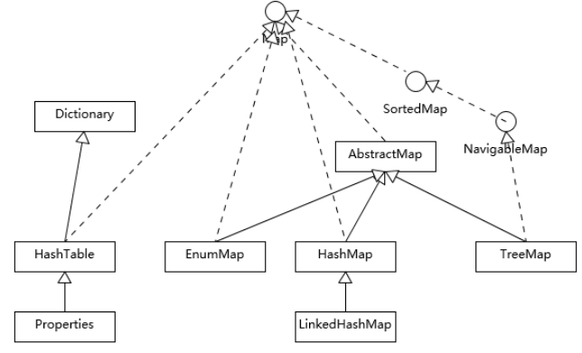
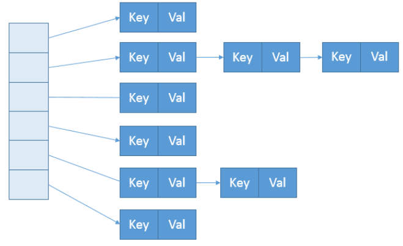
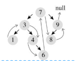

## 10.1 HashMap

### 10.1.1 Map 整体结构



### 10.1.2 HashMap源码分析

#### 内部组成

````java
//内部类变量
static final int DEFAULT_INITIAL_CAPACITY = 1 << 4; //16
static final int MAXIMUM_CAPACITY = 1 << 30;
static final float DEFAULT_LOAD_FACTOR = 0.75f;
static final int TREEIFY_THRESHOLD = 8;
static final int UNTREEIFY_THRESHOLD = 6;
static final int MIN_TREEIFY_CAPACITY = 64;
//内部实例变量
transient Node<K,V>[] table;//实现了Map.Entry<K,V>接口
transient Set<Map.Entry<K,V>> entrySet;
transient int size;//键值对个数
transient int modCount;//修改次数
int threshold;//阈值，键值对个数size大于等于threshold时考虑进行扩展;threshold等于table.length乘以loadFactor
final float loadFactor;//负载因子0.75f

````

首先，我们来一起看看 HashMap 内部的结构，它可以看作是**数组（Node[] table）**和**链表**结合组成的复合结构，数组被分为一个个**桶**（bucket），通过哈希值决定了键值对在这个数组的寻址；哈希值相同的键值对，则以链表形式存储，你可以参考下面的示意图。这里需要注意的是，如果链表大小超过**阈值（TREEIFY_THRESHOLD, 8）**，图中的链表就会被改造为**红黑树**形结构



#### put(K key, V val)

JDK8 HashMap put的基本思路：

1. 对key的hashCode()进行hash后计算数组下标index;
2. 然后进入putVal()方法，如果当前数组table为null，进行resize()初始化；(懒加载，使用时初始化)
3. 如果没碰撞即tab[i]==null，直接放到对应下标的位置上；
4. 如果碰撞了，且节点已经存在，即key相等，就替换掉 value；
   1. 如果碰撞后发现为树结构，挂载到树上。
   2. 如果碰撞后为链表，添加到链表尾，并判断链表如果过长(大于等于TREEIFY_THRESHOLD，默认8)，就把链表转换成树结构；
5. 数据 put 后，如果数据量超过threshold，就要resize扩容。

````java
public V put(K key, V value) {
    return putVal(hash(key), key, value, false, true);
}

final V putVal(int hash, K key, V value, boolean onlyIfAbsent, boolean evict) {
    Node<K,V>[] tab; 
    Node<K,V> p;
    int n, i;
    //判断table是否初始化，否则初始化操作resize()
    if ((tab = table) == null || (n = tab.length) == 0)
        n = (tab = resize()).length;
    //计算存储的索引位置，如果没有元素，直接赋值
    if ((p = tab[i = (n - 1) & hash]) == null)
        tab[i] = newNode(hash, key, value, null);
    else {
        //发生碰撞
        Node<K,V> e; 
        K k;
        //判断 key是否存在 如果存在就覆盖原来的value  
        if (p.hash == hash && ((k = p.key) == key || (key != null && key.equals(k))))
            e = p;
        //key不存在，判断链表是否是红黑树
        else if (p instanceof TreeNode)
            //红黑树是为了防止哈希表碰撞攻击，当链表链长度为8时，及时转成红黑树，提高map的效率
            e = ((TreeNode<K,V>)p).putTreeVal(this, tab, hash, key, value);
        else {
            //为链表，
            for (int binCount = 0; ; ++binCount) {
                if ((e = p.next) == null) {
                    p.next = newNode(hash, key, value, null);
                    //链表长度8，将链表转化为红黑树存储
                    if (binCount >= TREEIFY_THRESHOLD - 1) // -1 for 1st 
                         treeifyBin(tab, hash);
                    break;
                }
                //key存在，直接覆盖
                if (e.hash == hash && (k = e.key) == key || (key != null && key.equals(k))))
                    break;
                p = e;
            }
        }
        if (e != null) { // existing mapping for key
            V oldValue = e.value;
            if (!onlyIfAbsent || oldValue == null)
                e.value = value;
            afterNodeAccess(e);
            return oldValue;
        }
    }
    //记录修改次数
    ++modCount;
    //判断是否需要扩容(HashMap这一步是元素插入完成之后才开始判断的)
    if (++size > threshold)
        resize();
    //空操作    afterNodeInsertion(evict);
    return null;
}

````

从 putVal 方法最初的几行，我们就可以发现几个有意思的地方：

- 如果表格是 null，resize 方法会负责初始化它，这从 tab = resize() 可以看出。
- resize 方法兼顾两个职责，**创建初始存储表格**，或者在容量不满足需求的时候，进行**扩容（resize）**。
- 在放置新的键值对的过程中，如果发生下面条件，就会发生扩容。`if (++size > threshold)   resize();`

具体键值对在哈希表中的位置（数组 index）取决于下面的位运算：`i = (n - 1) & hash`  
仔细观察哈希值的源头，我们会发现，它并不是 key 本身的 hashCode，而是来自于HashMap 内部的另外一个 hash 方法。  

````java
static final int hash(Object kye) {   
    int h;   
    return (key == null) ? 0 : (h = key.hashCode()) ^ (h >>>16);
}
````

> 注意，为什么这里需要将高位数据移位到低位进行异或 运算呢？这是因为有些数据计算出的哈希值差异主要在高位，而 HashMap 里的哈希寻址是忽略容量以上的高位的，那么这种处理就可以有效避免类似情况下的哈希碰撞。

#### resize()

数组的长度为2的N次方，也就是说初始为16，扩容一次为32...好处呢？就是上文提到的扩容是性能优化和减少碰撞，就是体现在此处。

> 数组下标计算： `index = (table.length - 1) & hash `，由于 table.length 也就是capacity 肯定是2的N次方，使用 & 位运算意味着只是多了最高位，这样就不用重新计算 index，元素要么在原位置，要么在原位置+ oldCapacity.如果增加的高位为0，resize 后 index 不变；高位为1在原位置+ oldCapacity。resize 的过程中原来碰撞的节点有一部分会被分开。

扩容简单说有两步：

1. 扩容：创建一个新的Entry空数组，长度是原数组的2倍。
2. ReHash：遍历原Entry数组，把所有的Entry重新Hash到新数组。

````java
final Node<K,V>[] resize() {
    Node<K,V>[] oldTab = table;
    int oldCap = (oldTab == null) ? 0 : oldTab.length;
    int oldThr = threshold;
    int newCap, newThr = 0;
    // 如果 table 不为空，表明已经初始化过了
    if (oldCap > 0) {
        // 当 table 容量超过容量最大值，则不再扩容
        if (oldCap >= MAXIMUM_CAPACITY) {
            threshold = Integer.MAX_VALUE;
            return oldTab;
        }
        // 按旧容量和阈值的2倍计算新容量和阈值的大小
        else if ((newCap = oldCap << 1) < MAXIMUM_CAPACITY && oldCap >= DEFAULT_INITIAL_CAPACITY)
            newThr = oldThr << 1; // double threshold
    } else if (oldThr > 0) // initial capacity was placed in threshold
        /*
         * 初始化时，将 threshold 的值赋值给 newCap，
         * HashMap 使用 threshold 变量暂时保存 initialCapacity 参数的值
         */
        newCap = oldThr;
    else {               // zero initial threshold signifies using defaults
        /*
         * 调用无参构造方法时，桶数组容量为默认容量，
         * 阈值为默认容量与默认负载因子乘积
         */
        newCap = DEFAULT_INITIAL_CAPACITY;
        newThr = (int)(DEFAULT_LOAD_FACTOR * DEFAULT_INITIAL_CAPACITY);
    }
    
    // newThr 为 0 时，按阈值计算公式进行计算
    if (newThr == 0) {
        float ft = (float)newCap * loadFactor;
        newThr = (newCap < MAXIMUM_CAPACITY && ft < (float)MAXIMUM_CAPACITY ?
                  (int)ft : Integer.MAX_VALUE);
    }
    threshold = newThr;
    // 创建新的桶数组，桶数组的初始化也是在这里完成的
    Node<K,V>[] newTab = (Node<K,V>[])new Node[newCap];
    table = newTab;
    if (oldTab != null) {
        // 如果旧的桶数组不为空，则遍历桶数组，并将键值对映射到新的桶数组中
        for (int j = 0; j < oldCap; ++j) {
            Node<K,V> e;
            if ((e = oldTab[j]) != null) {
                oldTab[j] = null;
                if (e.next == null)
                    newTab[e.hash & (newCap - 1)] = e;
                else if (e instanceof TreeNode)
                    // 重新映射时，需要对红黑树进行拆分
                    ((TreeNode<K,V>)e).split(this, newTab, j, oldCap);
                else { // preserve order
                    Node<K,V> loHead = null, loTail = null;
                    Node<K,V> hiHead = null, hiTail = null;
                    Node<K,V> next;
                    // 遍历链表，并将链表节点按原顺序进行分组
                    do {
                        next = e.next;
                        if ((e.hash & oldCap) == 0) {
                            if (loTail == null)
                                loHead = e;
                            else
                                loTail.next = e;
                            loTail = e;
                        }
                        else {
                            if (hiTail == null)
                                hiHead = e;
                            else
                                hiTail.next = e;
                            hiTail = e;
                        }
                    } while ((e = next) != null);
                    // 将分组后的链表映射到新桶中
                    if (loTail != null) {
                        loTail.next = null;
                        newTab[j] = loHead;
                    }
                    if (hiTail != null) {
                        hiTail.next = null;
                        newTab[j + oldCap] = hiHead;
                    }
                }
            }
        }
    }
    return newTab;
}
````

上面的源码总共做了3件事，分别是：

- 计算新桶数组的容量 newCap 和新阈值 newThr
- 根据计算出的 newCap 创建新的桶数组，桶数组 table 也是在这里进行初始化的将键值对节点重新映射到新的桶数组里。
- 如果节点是 TreeNode 类型，则需要拆分红黑树。如果是普通节点，则节点按原顺序进行分组。

####  get()

get 方法看起来就要简单许多了。

- 首先将 key hash 之后取得所定位的桶。
- 如果桶为空则直接返回 null 。否则判断桶的第一个位置(有可能是链表、红黑树)的 key 是否为查询的 key，是就直接返回 value。
- 如果第一个不匹配，则判断它的下一个是红黑树还是链表。
  - 红黑树就按照树的查找方式返回值。
  - 不然就按照链表的方式遍历匹配返回值。

````java
public V get(Object key) {
    Node<K,V> e;
    return (e = getNode(hash(key), key)) == null ? null : e.value;
}
final Node<K,V> getNode(int hash, Object key) {
    Node<K,V>[] tab; Node<K,V> first, e; int n; K k;
    if ((tab = table) != null && (n = tab.length) > 0 &&
        (first = tab[(n - 1) & hash]) != null) {
        if (first.hash == hash && // always check first node
            ((k = first.key) == key || (key != null && key.equals(k))))
            return first;
        if ((e = first.next) != null) {
            if (first instanceof TreeNode)
                return ((TreeNode<K,V>)first).getTreeNode(hash, key);
            do {
                if (e.hash == hash &&
                    ((k = e.key) == key || (key != null && key.equals(k))))
                    return e;
            } while ((e = e.next) != null);
        }
    }
    return null;
}
````

#### remove()

````java
public V remove(Object key) {
    Node<K,V> e;
    return (e = removeNode(hash(key), key, null, false, true)) == null ? null : e.value;
}
final Node<K,V> removeNode(int hash, Object key, Object value,
                               boolean matchValue, boolean movable) {
        Node<K,V>[] tab; Node<K,V> p; int n, index;
        if ((tab = table) != null && (n = tab.length) > 0 &&
            (p = tab[index = (n - 1) & hash]) != null) {
            Node<K,V> node = null, e; K k; V v;
            if (p.hash == hash &&
                ((k = p.key) == key || (key != null && key.equals(k))))
                node = p;
            else if ((e = p.next) != null) {
                if (p instanceof TreeNode)
                    node = ((TreeNode<K,V>)p).getTreeNode(hash, key);
                else {
                    do {
                        if (e.hash == hash &&
                            ((k = e.key) == key ||
                             (key != null && key.equals(k)))) {
                            node = e;
                            break;
                        }
                        p = e;
                    } while ((e = e.next) != null);
                }
            }
            if (node != null && (!matchValue || (v = node.value) == value ||
                                 (value != null && value.equals(v)))) {
                if (node instanceof TreeNode)
                    ((TreeNode<K,V>)node).removeTreeNode(this, tab, movable);
                else if (node == p)
                    tab[index] = node.next;
                else
                    p.next = node.next;
                ++modCount;
                --size;
                afterNodeRemoval(node);
                return node;
            }
        }
        return null;
    }

````

#### HashMap和Hashtable的区别

1. HashMap允许key和value为null，Hashtable不允许。
2. HashMap的默认初始容量为16，Hashtable为11。
3. HashMap的扩容为原来的2倍，Hashtable的扩容为原来的2倍加1。
4. HashMap是非线程安全的，Hashtable是线程安全的。
5. HashMap的hash值重新计算过，Hashtable直接使用hashCode。
6. HashMap去掉了Hashtable中的contains方法。
7. HashMap继承自AbstractMap类，Hashtable继承自Dictionary类。

#### 如何让HashMap实现线程安全？

1. 直接使用Hashtable
2. Collections.synchronizeMap方法
3. 使用ConcurrentHashMap

## 10.2 HashSet

HashSet内部是用HashMap实现的，它内部有一个HashMap实例变量，值都是相同的固定值

## 10.3 TreeMap/TreeSet

排序二叉树也是二叉树，但它没有重复元素，而且是有序的二叉树。什么顺序呢？对每个节点而言：

- 如果左子树不为空，则左子树上的所有节点都小于该节点；
- 如果右子树不为空，则右子树上的所有节点都大于该节点。

### 10.3.1基本算法

#### 查找

1）首先与根节点比较，如果相同，就找到了；  
2）如果小于根节点，则到左子树中递归查找；  
3）如果大于根节点，则到右子树中递归查找。

#### 遍历

递归：

==非递归==：

第一个节点为**最左边的节点**，从第一个节点开始，依次找**后继节点**。给定一个节点，==找其后继节点的算法==为：  

1. 如果该节点有右孩子，则后继节点为**右子树中最小的节点**。  
2. 如果该节点没有右孩子，则后继节点为**父节点或某个祖先节点**，从当前节点往上找：
   1. 如果它是父节点的右孩子，则继续找父节点，直到它不是右孩子或父节点为空，第一个非右孩子节点的父节点就是后继节点
   2. 如果找不到这样的祖先节点，则后继为空，遍历结束。

eg：  


1）**第一个节点1**没有右孩子，它不是父节点的右孩子，所以它的后继节点就是其父节点3；  
2）3有右孩子，右子树中最小的就是4，所以3的后继节点为4；  
3）4有右孩子，右子树中只有一个节点6，所以4的后继节点为6；  
4）6没有右孩子，往上找父节点，它是父节点4的右孩子，4又是父节点3的右孩子， 3不是父节点7的右孩子，所以6的后继节点为3的父节点7；  
5）7有右孩子，右子树中最小的是8，所以7的后继节点为8；  
6）8没有右孩子，往上找父节点，它不是父节点9的右孩子，所以它的后继节点就是其父节点9；  
7）9没有右孩子，往上找父节点，它是父节点7的右孩子，接着往上找，但7已经是根节点，父节点为空，所以后继为空。

#### 插入

1）从根节点开始与当前节点比较，如果相同，表示已经存在了，不能再插入；  
2）如果小于当前节点，则到左子树中寻找，如果左子树为空，则当前节点即为要找的父节点；  
3）如果大于当前节点，则到右子树中寻找，如果右子树为空，则当前节点即为要找的父节点。  
4）找到父节点后，即可插入，如果插入元素小于父节点，则作为左孩子插入，否则作为右孩子插入。

#### 删除

从排序二叉树中删除一个节点有三种情况：

1. 节点为叶子节点；
   1. 直接删掉，修改父节点的对应孩子节点为空
2. 节点只有一个孩子节点；
   1. 替换待删节点为孩子节点，或者说，在孩子节点和父节点之间直接建立链接
3. 节点有两个孩子节点。
   1. 首先找该节点的后继节点，找到后继节点后，替换待删节点为后继节点的内容，然后再删除后继节点。（后继节点一定没有左孩子，这就将两个孩子节点的情况转换为了叶子节点或只有一个孩子节点的情况）

### 10.3.2 平衡的排序二叉树

**任何节点的左右子树的高度差最多为一**。满足这个平衡定义的排序二叉树又被称为**AVL树**

在TreeMap的实现中，用的并不是AVL树，而是**红黑树**，与AVL树类似，红黑树也是一种平衡的排序二叉树，它确保任意一条从根到叶子节点的路径，没有任何一条路径的长度会比其他路径长过两倍。