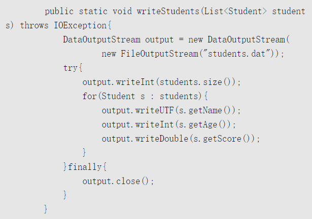
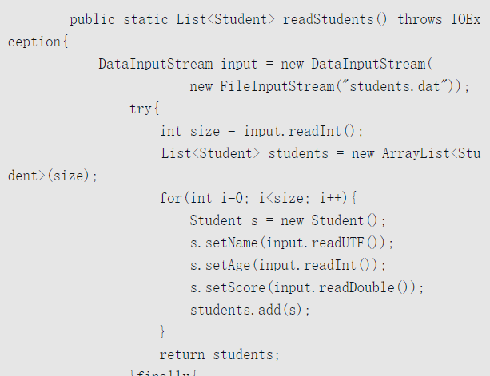
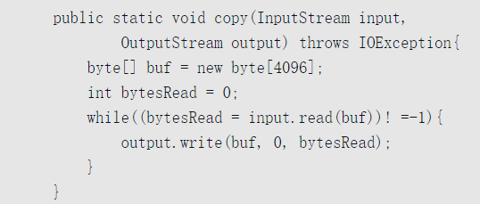
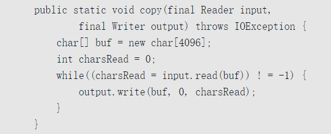

# 13.1 文件概述

## 13.1.1 基本概念和常识

**二进制思维**

为了透彻理解文件，我们首先要有一个二进制思维。所有文件，不论是可执行文件、图片文件、视频文件、Word文件、压缩文件、txt文件，都没什么可神秘的，它们**都是以0和1的二进制形式保存的。**

----

**文件类型**

虽然所有数据都是以二进制形式保存的，但为了方便处理数据，高级语言引入了**数据类型**的概念。文件处理也类似，所有文件都是以二进制形式保存的，但为了便于理解和处理文件，文件也有**文件类型**的概念。**文件类型通常以扩展名的形式体现**

文件类型可以粗略分为两类：一类是文本文件；另一类是二进制文件。

- 文本文件的例子有普通的文本文件（.txt），程序源代码文件（.java）、HTML文件（.html）等；
- 二进制文件的例子有压缩文件（.zip）、PDF文件（.pdf）、MP3文件（.mp3）、Excel文件（.xlsx）等。

----

**文本文件的编码**

对于文本文件，我们还必须注意文件的编码方式。文本文件中包含的基本都是可打印字符，但**字符到二进制的映射**（即==编码==）却有多种方式，如GB18030、UTF-8

----

**文件系统**

文件一般是放在硬盘上的，一个机器上可能有多个硬盘，但各种操作系统都会隐藏物理硬盘概念，提供一个逻辑上的统一结构。

> 在Windows中，可以有多个逻辑盘，如C、D、E等，每个盘可以被格式化为一种不同的文件系统，常见的文件系统有FAT32和NTFS。
>
> 在Linux中，只有一个逻辑的根目录，用斜线/表示。Linux支持多种不同的文件系统，如Ext2/Ext3/Ext4等。

在逻辑上，Windows中有多个根目录，Linux中有一个根目录，每个根目录下有一棵子目录和文件构成的树。每个文件都有文件路径的概念，路径有两种形式：**一种是绝对路径，另一种是相对路径。**

- 所谓绝对路径，是从根目录开始到当前文件的完整路径
- 所谓相对路径，是相对于当前目录而言的

----

**文件读写**

文件是放在硬盘上的，程序处理文件需要将文件读入内存，修改后，需要写回硬盘。

> **一个基本常识是：硬盘的访问延时，相比内存，是很慢的。**操作系统和硬盘一般是按块批量传输，而不是按字节，以摊销延时开销，块大小一般至少为512字节，即使应用程序只需要文件的一个字节，操作系统也会至少将一个块读进来。
>
> 另一个基本常识是：**一般读写文件需要两次数据复制**，比如读文件，需要先从硬盘复制到操作系统内核，再从内核复制到应用程序分配的内存中。操作系统运行所在的环境和应用程序是不一样的，操作系统所在的环境是**内核态**，应用程序是**用户态**，应用程序调用操作系统的功能，需要两次环境的切换，先从用户态切到内核态，再从内核态切到用户态。这种用户态/内核态的切换是有开销的，应尽量减少这种切换。
>
> 为了提升文件操作的效率，应用程序经常使用一种常见的策略，即使用**缓冲区**。读文件时，即使目前只需要少量内容，但预知还会接着读取，就一次读取比较多的内容，放到读缓冲区，下次读取时，如果缓冲区有，就直接从缓冲区读，减少访问操作系统和硬盘。写文件时，先写到写缓冲区，写缓冲区满了之后，再一次性调用操作系统写到硬盘。不过，需要注意的是，在写结束的时候，要记住将缓冲区的剩余内容同步到硬盘。

**操作系统操作文件一般有打开和关闭的概念**。*打开文件会在操作系统内核建立一个有关该文件的内存结构，这个结构一般通过一个整数索引来引用*，这个索引一般称为**文件描述符**。这个结构是消耗内存的，操作系统能同时打开的文件一般也是有限的，在不用文件的时候，应该记住关闭文件。关闭文件一般会同步缓冲区内容到硬盘，并释放占据的内存结构。

## 13.1.2 Java文件概述

**流**

在Java中（很多其他语言也类似），文件一般不是单独处理的，而是视为**输入输出（Input/Output, IO）设备的一种**。Java使用基本统一的概念处理所有的IO，包括键盘、显示终端、网络等。这个统一的概念是流，流有**输入流和输出流之分**

---

File

IO是操作数据本身，而关于文件路径、文件元数据、文件目录、临时文件、访问权限管理等，Java使用File这个类来表示。

---

序列化和反序列化

简单来说，**序列化就是将内存中的Java对象持久保存到一个流中，反序列化就是从流中恢复Java对象到内存**。

序列化和反序列化主要有两个用处：一是对象状态持久化，二是网络远程调用，用于传递和返回对象。

Java主要通过接口·`Serializable`和类`ObjectInputStream/ObjectOutputStream`提供对序列化的支持

---

# 13.2 二进制文件和字节流

以二进制方式读写的主要流有：

1. InputStream/OutputStream：这是基类，它们是抽象类。
2. FileInputStream/FileOutputStream：输入源和输出目标是文件的流。
3. ByteArrayInputStream/ByteArrayOutputStream：输入源和输出目标是字节数组的流。
4. *DataInputStream/DataOutputStream：装饰类，按基本类型和字符串而非只是字节读写流。*
5. *BufferedInputStream/BufferedOutputStream：装饰类，对输入输出流提供缓冲功能。*

## 13.2.1 InputStream/OutputStream

1. **InputStream**

`read()`:

read方法从流中读取下一个**字节**，返回类型为int，但取值为`0～255`，当读到流结尾的时候，返回值为`-1`，如果流中没有数据，read方法会阻塞直到数据到来、流关闭或异常出现。异常出现时，read方法抛出异常，类型为IOException，这是一个受检异常，调用者必须进行处理

`read(byte[] b)`

读入的字节放入`参数数组b`中，第一个字节存入b[0]，第二个存入b[1]，以此类推，一次最多读入的字节个数为数组b的长度，但实际读入的个数可能小于数组长度，返回值为实际读入的`字节个数`。如果刚开始读取时已到流结尾，则返回`-1`；否则，只要数组长度大于0，该方法都会尽力至少读取一个字节，如果流中一个字节都没有，它会阻塞，异常出现时也是抛出IOException

`read(byte[] b, int off, int len)`

读入的第一个字节放入b[off]，最多读取len个字节

`close()`

流读取后需要关闭

-----

2. OutputStream

`write(int b)`

向流中写入一个字节，参数类型虽然是int，但其实只会用到最低的8位。

`write(byte[] b)`

`write(byte[] b, int off, int len)`

在第二个方法中，第一个写入的字节是b[off]，写入个数为len，最后一个是b[off+len-1]，第一个方法等同于调用write(b, 0, b.length); 

`flush()`

flush方法将缓冲而未实际写的数据进行实际写入，比如，在BufferedOutputStream中，调用flush方法会将其缓冲区的内容写到其装饰的流中，并调用该流的flush方法。基类OutputStream没有缓冲，flush方法代码为空

`close()`

close方法一般会首先调用flush方法，然后再释放流占用的系统资源。同InputStream一样，close方法一般应该放在finally语句内。

----

## 13.2.2 FileInputStream/FileOutputStream

1. FileOutputStream

FileOutputStream有多个构造方法，其中两个如下所示：

`FileOutputStream(File file, boolean append)`

`FileOutputStream(String name)`

File类型的参数file和字符串的类型的参数name都表示**文件路径**，路径可以是绝对路径，也可以是相对路径，如果文件已存在，append参数指定是**追加还是覆盖**，true表示追加， false表示覆盖，第二个构造方法没有append参数，表示覆盖

`write(byte[] bytes)`

OutputStream只能以byte或byte数组写文件，为了写字符串，我们调用String的getBytes方法得到它的UTF-8编码的字节数组，再调用write()方法，写的过程放在try语句内，在finally语句中调用close方法。

----

2. FileInputStream

FileInputStream的主要构造方法有：

`FileInputStream(File file)`

`FileInputStream(String name)`

参数与FileOutputStream类似，可以是文件路径或File对象，**但必须是一个已存在的文件，不能是目录**。new一个FileInputStream对象也会实际打开文件，操作系统会分配相关资源


## 13.2.4 DataInputStream/DataOutputStream

上面介绍的类都只能以字节为单位读写，如何以其他类型读写呢？比如int、double。可以使用DataInputStream / DataOutputStream ，它们都是装饰类。

1. DataOutputStream

DataOutputStream是装饰类基类FilterOutputStream的子类，FilterOutputStream是Output-Stream的子类，它的构造方法是：

`DataOutputStream(OutputStream out)`

在写入时，DataOutputStream会将这些类型的数据转换为其对应的二进制字节，比如：

1. writeBoolean：写入一个字节，如果值为true，则写入1，否则0。
2. writeInt：写入4个字节，最高位字节先写入，最低位最后写入。
3. writeUTF：将字符串的UTF-8编码字节写入，这个编码格式与标准的UTF-8编码略有不同，不过，我们不用关心这个细节。

> 
>
> 

## 13.2.5 BufferedInputStream/BufferedOutputStream

FileInputStream/FileOutputStream是没有缓冲的，按单个字节读写时性能比较低，虽然可以按字节数组读取以提高性能，但有时必须要按字节读写，怎么解决这个问题呢？方法是将文件流包装到缓冲流中。BufferedInputStream内部有个字节数组作为缓冲区，读取时，先从这个缓冲区读，缓冲区读完了再调用包装的流读，它的构造方法有两个：

`BufferedInputStream(InputStream in)`

`BufferedInputStream(InputStream in, int size)`

size表示缓冲区大小，如果没有，默认值为8192。

-----


> 复制输入流的内容到输出流
>
> 

# 13.3 文本文件和字符流

> 字节流是按字节读取的，而字符流则是按char读取的，一个char在文件中保存的是几个字节与编码有关，但字符流封装了这种细节，我们操作的对象就是char。
>
> 一个char不完全等同于一个字符，对于绝大部分字符，一个字符就是一个char，但我们之前介绍过，对于增补字符集中的字符，需要两个char表示

1. Reader/Writer：字符流的基类，它们是抽象类；
2. InputStreamReader/OutputStreamWriter：适配器类，将字节流转换为字符流；
3. FileReader/FileWriter：输入源和输出目标是文件的字符流；
4. CharArrayReader/CharArrayWriter：输入源和输出目标是char数组的字符流；
5. StringReader/StringWriter：输入源和输出目标是String的字符流；
6. BufferedReader/BufferedWriter：装饰类，对输入/输出流提供缓冲，以及按行读写功能；
7. PrintWriter：装饰类，可将基本类型和对象转换为其字符串形式输出的类。

> FileReader/FileWriter不能指定编码类型，只能使用默认编码，如果需要指定编码类型，可以使用InputStreamReader/OutputStreamWriter。
>
> FileReader/FileWriter是没有缓冲的，也不能按行读写，所以，一般应该在它们的外面包上对应的缓冲类

> 

# 13.4 文件和目录操作

## 13.4.1 构造方法

File既可以表示**文件**，也可以表示**目录**，它的主要构造方法有：

```java
public File(String pathname)
//parent表示父目录，child表示孩子
public File(String parent,String child)
public File(File parent,String child)
```

File中的路径可以是已经存在的，也可以是不存在的。**通过new新建一个File对象，不会实际创建一个文件，只是创建一个表示文件或目录的对象，new之后，File对象中的路径是不可变的**。

## 13.4.2 文件元数据

文件元数据主要包括文件名和路径、文件基本信息以及一些安全和权限相关的信息。文件名和路径相关的主要方法有：

```java
public String getName()//返回文件或目录名称，不含路径名
public boolean isAbsolute()//判断File中的路径是否是绝对路径
public String getPath()//返回构造File对象时的完整路径名，包括路径和文件名称
public String getAbsolutePath()//返回完整的绝对路径名
public String getCanonicalPath() throws IOException
public String getParent()//返回父目录路径
public File getParentFile()//返回父目录的File对象
//返回一个新的File对象，新的File对象使用getAbsolutePath()的返回值作为参数构造
public File getAbsoluteFile()//返回一个新的File对象，新的File对象使用getCanonicalPath()的返回值作为参数构造
public File getCanonicalFile() throws IOException
```

## 13.4.3 文件操作

文件操作主要有创建、删除、重命名。新建一个File对象不会实际创建文件，但如下方法可以：

`boolean createNewFile()`

## 13.4.4 目录操作

当File对象代表目录时，可以执行目录相关的操作，如创建、遍历。有两个方法用于创建目录：

`mkdir()`

`mkdirs()`

如果某一个中间父目录不存在，则mkdir会失败，返回false，而mkdirs则会创建必需的中间父目录。

有如下方法访问一个目录下的子目录和文件：

```java
public String[] list()
public String[] list(FilenameFilter filter)
public File[] listFiles)
public File[] listFiles(FileFilter filter)
public File[] listFiles(FilenameFilter filter)
```

list返回的是文件名数组，而listFiles返回的是File对象数组。FilenameFilter和FileFilter都是接口，用于过滤


# IO模型

## [同步、异步](http://hollischuang.gitee.io/tobetopjavaer/#/basics/java-basic/synchronized-vs-asynchronization?id=同步、异步)

**同步与异步描述的是被调用者的。**

如A调用B：

如果是同步，B在接到A的调用后，会立即执行要做的事。A的本次调用可以得到结果。

如果是异步，B在接到A的调用后，不保证会立即执行要做的事，但是保证会去做，B在做好了之后会通知A。A的本次调用得不到结果，但是B执行完之后会通知A。

### [同步，异步 和 阻塞，非阻塞之间的区别](http://hollischuang.gitee.io/tobetopjavaer/#/basics/java-basic/synchronized-vs-asynchronization?id=同步，异步-和-阻塞，非阻塞之间的区别)

同步，异步，是描述被调用方的。

[阻塞、非阻塞](http://hollischuang.gitee.io/tobetopjavaer/#/basics/java-basic/block-vs-non-blocking)，是描述调用方的。

同步不一定阻塞，异步也不一定非阻塞。没有必然关系。

举个简单的例子，老张烧水。 1 老张把水壶放到火上，一直在水壶旁等着水开。（同步阻塞） 2 老张把水壶放到火上，去客厅看电视，时不时去厨房看看水开没有。（同步非阻塞） 3 老张把响水壶放到火上，一直在水壶旁等着水开。（异步阻塞） 4 老张把响水壶放到火上，去客厅看电视，水壶响之前不再去看它了，响了再去拿壶。（异步非阻塞）

1和2的区别是，调用方在得到返回之前所做的事情不一行。 1和3的区别是，被调用方对于烧水的处理不一样。

## [阻塞、非阻塞](http://hollischuang.gitee.io/tobetopjavaer/#/basics/java-basic/block-vs-non-blocking?id=阻塞、非阻塞)

**阻塞与非阻塞描述的是调用者的**

如A调用B：

如果是阻塞，A在发出调用后，要一直等待，等着B返回结果。

如果是非阻塞，A在发出调用后，不需要等待，可以去做自己的事情。

### [同步，异步 和 阻塞，非阻塞之间的区别](http://hollischuang.gitee.io/tobetopjavaer/#/basics/java-basic/block-vs-non-blocking?id=同步，异步-和-阻塞，非阻塞之间的区别)

[同步、异步](http://hollischuang.gitee.io/tobetopjavaer/#/basics/java-basic/synchronized-vs-asynchronization)，是描述被调用方的。

阻塞，非阻塞，是描述调用方的。

同步不一定阻塞，异步也不一定非阻塞。没有必然关系。

举个简单的例子，老张烧水。 1 老张把水壶放到火上，一直在水壶旁等着水开。（同步阻塞） 2 老张把水壶放到火上，去客厅看电视，时不时去厨房看看水开没有。（同步非阻塞） 3 老张把响水壶放到火上，一直在水壶旁等着水开。（异步阻塞） 4 老张把响水壶放到火上，去客厅看电视，水壶响之前不再去看它了，响了再去拿壶。（异步非阻塞）

1和2的区别是，调用方在得到返回之前所做的事情不一行。 1和3的区别是，被调用方对于烧水的处理不一样。