13.1 文件概述

## 13.1.1 基本概念和常识

**二进制思维**

为了透彻理解文件，我们首先要有一个二进制思维。所有文件，不论是可执行文件、图片文件、视频文件、Word文件、压缩文件、txt文件，都没什么可神秘的，它们**都是以0和1的二进制形式保存的。**

----

**文件类型**

虽然所有数据都是以二进制形式保存的，但为了方便处理数据，高级语言引入了**数据类型**的概念。文件处理也类似，所有文件都是以二进制形式保存的，但为了便于理解和处理文件，文件也有**文件类型**的概念。**文件类型通常以扩展名的形式体现**

文件类型可以粗略分为两类：一类是文本文件；另一类是二进制文件。

- 文本文件的例子有普通的文本文件（.txt），程序源代码文件（.java）、HTML文件（.html）等；
- 二进制文件的例子有压缩文件（.zip）、PDF文件（.pdf）、MP3文件（.mp3）、Excel文件（.xlsx）等。

----

**文本文件的编码**

对于文本文件，我们还必须注意文件的编码方式。文本文件中包含的基本都是可打印字符，但**字符到二进制的映射**（即==编码==）却有多种方式，如GB18030、UTF-8

----

**文件系统**

文件一般是放在硬盘上的，一个机器上可能有多个硬盘，但各种操作系统都会隐藏物理硬盘概念，提供一个逻辑上的统一结构。

> 在Windows中，可以有多个逻辑盘，如C、D、E等，每个盘可以被格式化为一种不同的文件系统，常见的文件系统有FAT32和NTFS。
>
> 在Linux中，只有一个逻辑的根目录，用斜线/表示。Linux支持多种不同的文件系统，如Ext2/Ext3/Ext4等。

在逻辑上，Windows中有多个根目录，Linux中有一个根目录，每个根目录下有一棵子目录和文件构成的树。每个文件都有文件路径的概念，路径有两种形式：**一种是绝对路径，另一种是相对路径。**

- 所谓绝对路径，是从根目录开始到当前文件的完整路径
- 所谓相对路径，是相对于当前目录而言的

----

**文件读写**

文件是放在硬盘上的，程序处理文件需要将文件读入内存，修改后，需要写回硬盘。

> **一个基本常识是：硬盘的访问延时，相比内存，是很慢的。**操作系统和硬盘一般是按块批量传输，而不是按字节，以摊销延时开销，块大小一般至少为512字节，即使应用程序只需要文件的一个字节，操作系统也会至少将一个块读进来。
>
> 另一个基本常识是：**一般读写文件需要两次数据复制**，比如读文件，需要先从硬盘复制到操作系统内核，再从内核复制到应用程序分配的内存中。操作系统运行所在的环境和应用程序是不一样的，操作系统所在的环境是**内核态**，应用程序是**用户态**，应用程序调用操作系统的功能，需要两次环境的切换，先从用户态切到内核态，再从内核态切到用户态。这种用户态/内核态的切换是有开销的，应尽量减少这种切换。
>
> 为了提升文件操作的效率，应用程序经常使用一种常见的策略，即使用**缓冲区**。读文件时，即使目前只需要少量内容，但预知还会接着读取，就一次读取比较多的内容，放到读缓冲区，下次读取时，如果缓冲区有，就直接从缓冲区读，减少访问操作系统和硬盘。写文件时，先写到写缓冲区，写缓冲区满了之后，再一次性调用操作系统写到硬盘。不过，需要注意的是，在写结束的时候，要记住将缓冲区的剩余内容同步到硬盘。

**操作系统操作文件一般有打开和关闭的概念**。*打开文件会在操作系统内核建立一个有关该文件的内存结构，这个结构一般通过一个整数索引来引用*，这个索引一般称为**文件描述符**。这个结构是消耗内存的，操作系统能同时打开的文件一般也是有限的，在不用文件的时候，应该记住关闭文件。关闭文件一般会同步缓冲区内容到硬盘，并释放占据的内存结构。

## 13.1.2 Java文件概述

**流**

在Java中（很多其他语言也类似），文件一般不是单独处理的，而是视为**输入输出（Input/Output, IO）设备的一种**。Java使用基本统一的概念处理所有的IO，包括键盘、显示终端、网络等。这个统一的概念是流，流有**输入流和输出流之分**

---

File

IO是操作数据本身，而关于文件路径、文件元数据、文件目录、临时文件、访问权限管理等，Java使用File这个类来表示。

---

序列化和反序列化

简单来说，**序列化就是将内存中的Java对象持久保存到一个流中，反序列化就是从流中恢复Java对象到内存**。

序列化和反序列化主要有两个用处：一是对象状态持久化，二是网络远程调用，用于传递和返回对象。

Java主要通过接口·`Serializable`和类`ObjectInputStream/ObjectOutputStream`提供对序列化的支持

---

# 13.2 二进制文件和字节流

以二进制方式读写的主要流有：

1. InputStream/OutputStream：这是基类，它们是抽象类。
2. FileInputStream/FileOutputStream：输入源和输出目标是文件的流。
3. ByteArrayInputStream/ByteArrayOutputStream：输入源和输出目标是字节数组的流。
4. *DataInputStream/DataOutputStream：装饰类，按基本类型和字符串而非只是字节读写流。*
5. *BufferedInputStream/BufferedOutputStream：装饰类，对输入输出流提供缓冲功能。*

## 13.2.1 InputStream/OutputStream

1. **InputStream**

`read()`:

read方法从流中读取下一个**字节**，返回类型为int，但取值为`0～255`，当读到流结尾的时候，返回值为`-1`，如果流中没有数据，read方法会阻塞直到数据到来、流关闭或异常出现。异常出现时，read方法抛出异常，类型为IOException，这是一个受检异常，调用者必须进行处理

`read(byte[] b)`

读入的字节放入`参数数组b`中，第一个字节存入b[0]，第二个存入b[1]，以此类推，一次最多读入的字节个数为数组b的长度，但实际读入的个数可能小于数组长度，返回值为实际读入的`字节个数`。如果刚开始读取时已到流结尾，则返回`-1`；否则，只要数组长度大于0，该方法都会尽力至少读取一个字节，如果流中一个字节都没有，它会阻塞，异常出现时也是抛出IOException

`read(byte[] b, int off, int len)`

读入的第一个字节放入b[off]，最多读取len个字节

`close()`

流读取后需要关闭

-----

2. OutputStream

`write(int b)`

向流中写入一个字节，参数类型虽然是int，但其实只会用到最低的8位。

`write(byte[] b)`

`write(byte[] b, int off, int len)`

在第二个方法中，第一个写入的字节是b[off]，写入个数为len，最后一个是b[off+len-1]，第一个方法等同于调用write(b, 0, b.length); 

`flush()`

flush方法将缓冲而未实际写的数据进行实际写入，比如，在BufferedOutputStream中，调用flush方法会将其缓冲区的内容写到其装饰的流中，并调用该流的flush方法。基类OutputStream没有缓冲，flush方法代码为空

`close()`

close方法一般会首先调用flush方法，然后再释放流占用的系统资源。同InputStream一样，close方法一般应该放在finally语句内。

----

## 13.2.2 FileInputStream/FileOutputStream

1. FileOutputStream

FileOutputStream有多个构造方法，其中两个如下所示：

`FileOutputStream(File file, boolean append)`

`FileOutputStream(String name)`

File类型的参数file和字符串的类型的参数name都表示**文件路径**，路径可以是绝对路径，也可以是相对路径，如果文件已存在，append参数指定是**追加还是覆盖**，true表示追加， false表示覆盖，第二个构造方法没有append参数，表示覆盖

`write(byte[] bytes)`

OutputStream只能以byte或byte数组写文件，为了写字符串，我们调用String的getBytes方法得到它的UTF-8编码的字节数组，再调用write()方法，写的过程放在try语句内，在finally语句中调用close方法。

----

2. FileInputStream

FileInputStream的主要构造方法有：

`FileInputStream(File file)`

`FileInputStream(String name)`

参数与FileOutputStream类似，可以是文件路径或File对象，**但必须是一个已存在的文件，不能是目录**。new一个FileInputStream对象也会实际打开文件，操作系统会分配相关资源


## 13.2.4 DataInputStream/DataOutputStream

上面介绍的类都只能以字节为单位读写，如何以其他类型读写呢？比如int、double。可以使用DataInputStream / DataOutputStream ，它们都是装饰类。

1. DataOutputStream

DataOutputStream是装饰类基类FilterOutputStream的子类，FilterOutputStream是Output-Stream的子类，它的构造方法是：

`DataOutputStream(OutputStream out)`

在写入时，DataOutputStream会将这些类型的数据转换为其对应的二进制字节，比如：

1. writeBoolean：写入一个字节，如果值为true，则写入1，否则0。
2. writeInt：写入4个字节，最高位字节先写入，最低位最后写入。
3. writeUTF：将字符串的UTF-8编码字节写入，这个编码格式与标准的UTF-8编码略有不同，不过，我们不用关心这个细节。

> 
>
> 

## 13.2.5 BufferedInputStream/BufferedOutputStream

FileInputStream/FileOutputStream是没有缓冲的，按单个字节读写时性能比较低，虽然可以按字节数组读取以提高性能，但有时必须要按字节读写，怎么解决这个问题呢？方法是将文件流包装到缓冲流中。BufferedInputStream内部有个字节数组作为缓冲区，读取时，先从这个缓冲区读，缓冲区读完了再调用包装的流读，它的构造方法有两个：

`BufferedInputStream(InputStream in)`

`BufferedInputStream(InputStream in, int size)`

size表示缓冲区大小，如果没有，默认值为8192。

-----


> 复制输入流的内容到输出流
>
> 

# 13.3 文本文件和字符流

> 字节流是按字节读取的，而字符流则是按char读取的，一个char在文件中保存的是几个字节与编码有关，但字符流封装了这种细节，我们操作的对象就是char。
>
> 一个char不完全等同于一个字符，对于绝大部分字符，一个字符就是一个char，但我们之前介绍过，对于增补字符集中的字符，需要两个char表示

1. Reader/Writer：字符流的基类，它们是抽象类；
2. InputStreamReader/OutputStreamWriter：适配器类，将字节流转换为字符流；
3. FileReader/FileWriter：输入源和输出目标是文件的字符流；
4. CharArrayReader/CharArrayWriter：输入源和输出目标是char数组的字符流；
5. StringReader/StringWriter：输入源和输出目标是String的字符流；
6. BufferedReader/BufferedWriter：装饰类，对输入/输出流提供缓冲，以及按行读写功能；
7. PrintWriter：装饰类，可将基本类型和对象转换为其字符串形式输出的类。

> FileReader/FileWriter不能指定编码类型，只能使用默认编码，如果需要指定编码类型，可以使用InputStreamReader/OutputStreamWriter。
>
> FileReader/FileWriter是没有缓冲的，也不能按行读写，所以，一般应该在它们的外面包上对应的缓冲类

> 

# 13.4 文件和目录操作

## 13.4.1 构造方法

File既可以表示**文件**，也可以表示**目录**，它的主要构造方法有：

```java
public File(String pathname)
//parent表示父目录，child表示孩子
public File(String parent,String child)
public File(File parent,String child)
```

File中的路径可以是已经存在的，也可以是不存在的。**通过new新建一个File对象，不会实际创建一个文件，只是创建一个表示文件或目录的对象，new之后，File对象中的路径是不可变的**。

## 13.4.2 文件元数据

文件元数据主要包括文件名和路径、文件基本信息以及一些安全和权限相关的信息。文件名和路径相关的主要方法有：

```java
public String getName()//返回文件或目录名称，不含路径名
public boolean isAbsolute()//判断File中的路径是否是绝对路径
public String getPath()//返回构造File对象时的完整路径名，包括路径和文件名称
public String getAbsolutePath()//返回完整的绝对路径名
public String getCanonicalPath() throws IOException
public String getParent()//返回父目录路径
public File getParentFile()//返回父目录的File对象
//返回一个新的File对象，新的File对象使用getAbsolutePath()的返回值作为参数构造
public File getAbsoluteFile()//返回一个新的File对象，新的File对象使用getCanonicalPath()的返回值作为参数构造
public File getCanonicalFile() throws IOException
```

## 13.4.3 文件操作

文件操作主要有创建、删除、重命名。新建一个File对象不会实际创建文件，但如下方法可以：

`boolean createNewFile()`

## 13.4.4 目录操作

当File对象代表目录时，可以执行目录相关的操作，如创建、遍历。有两个方法用于创建目录：

`mkdir()`

`mkdirs()`

如果某一个中间父目录不存在，则mkdir会失败，返回false，而mkdirs则会创建必需的中间父目录。

有如下方法访问一个目录下的子目录和文件：

```java
public String[] list()
public String[] list(FilenameFilter filter)
public File[] listFiles)
public File[] listFiles(FileFilter filter)
public File[] listFiles(FilenameFilter filter)
```

list返回的是文件名数组，而listFiles返回的是File对象数组。FilenameFilter和FileFilter都是接口，用于过滤


# IO模型

IO就是用来传输数据的

## 基本概念

### [同步、异步](http://hollischuang.gitee.io/tobetopjavaer/#/basics/java-basic/synchronized-vs-asynchronization?id=同步、异步)

**同步与异步描述的是==被调用者==的。**

如A调用B：

如果是同步，B在接到A的调用后，会立即执行要做的事。A的本次调用可以得到结果。

如果是异步，B在接到A的调用后，不保证会立即执行要做的事，但是保证会去做，B在做好了之后会通知A。A的本次调用得不到结果，但是B执行完之后会通知A。

### [阻塞、非阻塞](http://hollischuang.gitee.io/tobetopjavaer/#/basics/java-basic/block-vs-non-blocking?id=阻塞、非阻塞)

**阻塞与非阻塞描述的是==调用者==的**

如A调用B：

如果是阻塞，A在发出调用后，要一直等待，等着B返回结果。

如果是非阻塞，A在发出调用后，不需要等待，可以去做自己的事情。

### [同步，异步 和 阻塞，非阻塞之间的区别](http://hollischuang.gitee.io/tobetopjavaer/#/basics/java-basic/block-vs-non-blocking?id=同步，异步-和-阻塞，非阻塞之间的区别)

[同步、异步](http://hollischuang.gitee.io/tobetopjavaer/#/basics/java-basic/synchronized-vs-asynchronization)，是描述被调用方的。

阻塞，非阻塞，是描述调用方的。

同步不一定阻塞，异步也不一定非阻塞。没有必然关系。

举个简单的例子，老张烧水。 1 老张把水壶放到火上，一直在水壶旁等着水开。（同步阻塞） 2 老张把水壶放到火上，去客厅看电视，时不时去厨房看看水开没有。（同步非阻塞） 3 老张把响水壶放到火上，一直在水壶旁等着水开。（异步阻塞） 4 老张把响水壶放到火上，去客厅看电视，水壶响之前不再去看它了，响了再去拿壶。（异步非阻塞）

1和2的区别是，调用方在得到返回之前所做的事情不一行。 1和3的区别是，被调用方对于烧水的处理不一样。


## NIO

Java NIO（New IO或 Non Blocking IO）是从Java 1.4版本开始引入的一个新的IO API，可以替代标准的Java IO API。NIO支持面向缓冲区的、基于通道的IO操作。NIO将以更加高效的方式进行文件的读写操作。

**java IO 与 java NIO 的区别：**

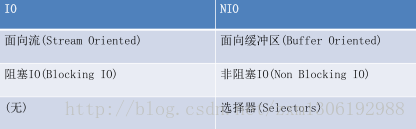

### 通道（Channel）与缓冲区（Buffer）
**若需要使用 NIO 系统，需要获取用于连接 IO 设备的通道以及用于容纳数据的缓冲区。然后操作缓冲区，对数据进行处理。简而言之，==Channel 负责传输， Buffer 负责存储==。**

#### 缓冲区（Buffer）--双向火车

- 缓冲区（ Buffer） ：一个用于特定基本数据类型的容器。由 java.nio 包定义的，所有缓冲区都是 Buffer 抽象类的子类。
- Java NIO 中的 Buffer 主要用于与 NIO 通道进行交互，数据是从通道读入缓冲区，从缓冲区写入通道中的。  

-----

##### 缓冲区子类

Buffer 就像一个数组，可以保存多个相同类型的数据。根据数据类型不同(boolean 除外) ，有以下 Buffer 常用子类：

- ByteBuffer
- CharBuffer
- ShortBuffer
-  IntBuffer
-  LongBuffer
- FloatBuffer
- DoubleBuffer

上述 Buffer 类 他们都采用相似的方法进行管理数据，只是各自管理的数据类型不同而已。都是通过如下方法获取一个 Buffer
对象：`static XxxBuffer allocate(int capacity)` : 创建一个容量为 capacity 的 XxxBuffer 缓冲区对象  

-----

##### 缓冲区的数据操作  

`put()`:存入数据到缓冲区中

`put(byte b)`：将给定单个字节写入缓冲区的当前位置

`put(byte[] src)`：将 src 中的字节写入缓冲区的当前位置

`put(int index, byte b)`：将指定字节写入缓冲区的索引位置(不会移动 position)


`get()`:获取缓存区中的数据

`get()` ：读取单个字节

`get(byte[] dst)`：批量读取多个字节到 dst 中

`get(int index)`：读取指定索引位置的字节(不会移动 position)

###### Buffer 的常用方法 

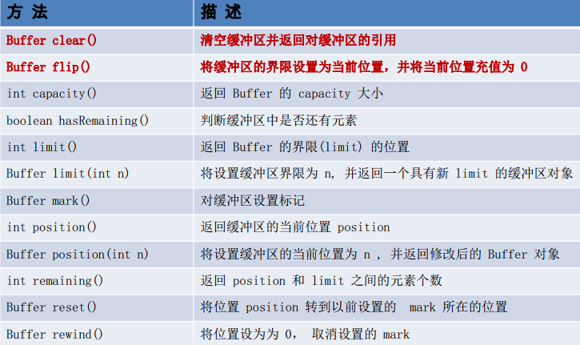

----

##### 缓冲区中的四个核心属性：

- 容量 (capacity) ： 表示 Buffer 最大数据容量，缓冲区容量不能为负，并且创建后不能更改。
- 限制 (limit)： 第一个不应该读取或写入的数据的索引，即位于 limit 后的数据不可读写。缓冲区的限制不能为负，并且不能大于其容量。
- 位置 (position)： 下一个要读取或写入的数据的索引。缓冲区的位置不能为负，并且不能大于其限制
- 标记 (mark)与重置 (reset)： 标记是一个索引，通过 Buffer 中的 **mark() 方法指定 Buffer 中一个特定的 position，之后可以通过调用 reset() 方法恢复到这个 position.**  

0<=mark<=position<=limit<=capacity

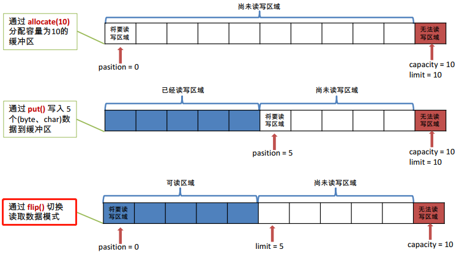

----

##### 直接缓冲区与非直接缓冲区：

- 非直接缓冲区：通过`allocate()`方法分配缓冲区，将缓冲区建立在**JVM的内存中**。

- 直接缓冲区：通过`allocateDirect()·`方法分配直接缓冲区，将缓冲区建立在**物理内存中**，Java 虚拟机会尽最大努力直接在此缓冲区上执行本机 I/O 操作  。可以提高效率，此方法返回的 缓冲区进行分配和取消分配所需成本通常高于非直接缓冲区 。
  - 直接缓冲区的内容可以驻留在常规的**垃圾回收堆之外**，因此，它们对应用程序的**内存需求量造成的影响可能并不明显**。所以，建议将直接缓冲区主要分配给那些易受基础系统的本机 I/O 操作影响的大型、持久的缓冲区。一般情况下，最好仅在直接缓冲区能在程序性能方面带来明显好处时分配它们。  
  - 直接字节缓冲区还可以过 通过`FileChannel` 的 `map() `方法 将文件区域直接映射到内存中来创建 。该方法返回MappedByteBuffe。
- 字节缓冲区是直接缓冲区还是非直接缓冲区可通过调用其` isDirect() `方法来确定。  

**非直接缓冲区：**

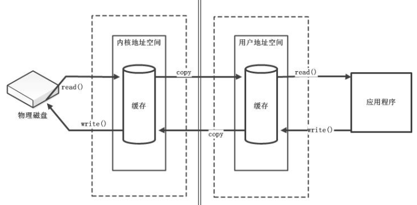

**直接缓冲区：**

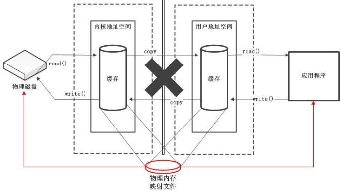

##### 测试案例

```java
public class TestBuffer {
    @Test
    public void test1(){
        String str="abcde";

        //1.分配一个指定大小的缓冲区
        ByteBuffer buf=ByteBuffer.allocate(1024);

        System.out.println("--------------allocate()----------------");
        System.out.println(buf.position());//0
        System.out.println(buf.limit());//1024
        System.out.println(buf.capacity());//1024

        //2.利用put()存放数据到缓冲区中
        buf.put(str.getBytes());

        System.out.println("-------------put()-------------");
        System.out.println(buf.position());//5
        System.out.println(buf.limit());//1024
        System.out.println(buf.capacity());//1024

        //3.切换读取数据模式
        buf.flip();
        System.out.println("--------------flip()------------");
        System.out.println(buf.position());//0
        System.out.println(buf.limit());//5
        System.out.println(buf.capacity());//1024

        //4.利用get()读取缓冲区中的数据
        byte[] dst=new byte[buf.limit()];
        buf.get(dst);
        System.out.println(new String(dst,0,dst.length));//abcd

        System.out.println("--------------get()------------");
        System.out.println(buf.position());//5
        System.out.println(buf.limit());//5
        System.out.println(buf.capacity());//1024

        //5.rewind():可重复读
        buf.rewind();

        System.out.println("--------------rewind()------------");
        System.out.println(buf.position());//0
        System.out.println(buf.limit());//5
        System.out.println(buf.capacity());//1024

        //6.clear():清空缓冲区。但是缓冲区中的数据依然存在，但是处在“被遗忘”状态
        buf.clear();

        System.out.println("--------------clear()------------");
        System.out.println(buf.position());//0
        System.out.println(buf.limit());//1024
        System.out.println(buf.capacity());//1024

        System.out.println((char)buf.get());
    }

    @Test
    public void test2(){
        String str="abcde";
        ByteBuffer buf=ByteBuffer.allocate(1024);
        buf.put(str.getBytes());
        buf.flip();

        byte[] dst=new byte[buf.limit()];
        buf.get(dst,0,2);
        System.out.println(new String(dst,0,2));//ab
        System.out.println(buf.position());//2

        //mark():标记
        buf.mark();
        buf.get(dst,2,2);//再读两个位置
        System.out.println(new String(dst, 2, 2));//cd
        System.out.println(buf.position());//4

        //reset():恢复到mark的位置
        buf.reset();
        System.out.println(buf.position());//2

        //判断缓冲区中是否还有剩余数据
        if(buf.hasRemaining()){
            //获取缓冲区中可以操作的数量
            System.out.println(buf.remaining());//3
        }
    }

    @Test
    public void test3(){
        //分配直接缓冲区
        ByteBuffer buf=ByteBuffer.allocate(1024);
        System.out.println(buf.isDirect());//false
    }
}
```

#### 通道（ Channel）  

通道（ Channel）：由` java.nio.channels `包定义的。 Channel 表示 **IO 源与目标打开的连接**。Channel 类似于传统的“流”。只不过 Channel本身**不能直接访问数据， Channel 只能与Buffer 进行交互**。  

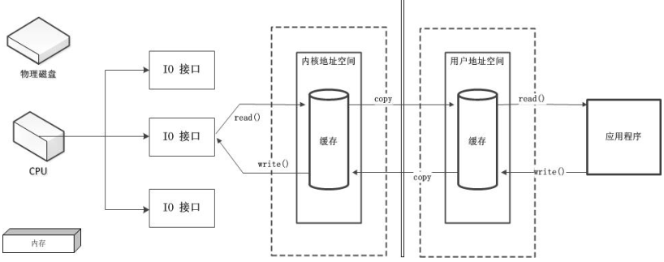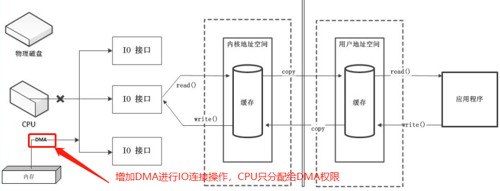

传统数据传输方式DMA：需要CPU分配权限，但是IO连接交给DMA（如果DMA总线过多，同样会影响CPU性能）


增加通道：（完全独立的处理器，专门处理数据IO操作）

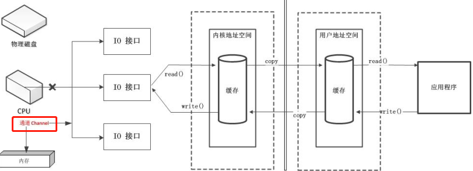

----

##### 通道的主要实现类

- java.nio.channels.Channel 接口：
  - FileChannel：用于读取、写入、映射和操作文件的通道。
  - SocketChannel：通过 TCP 读写网络中的数据。
  - ServerSocketChannel：可以监听新进来的 TCP 连接，对每一个新进来的连接都会创建一个 SocketChannel。
  - DatagramChannel：通过 UDP 读写网络中的数据通道。

FileChannel 的常用方法  ：

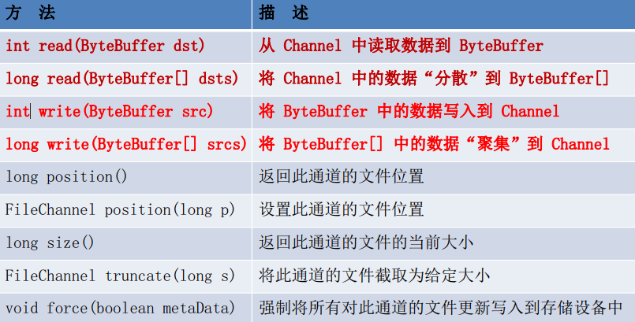

---

##### 获取通道

1. java针对支持通道的类提供了`getChannel()`方法: 
   - 本地IO：
     - FileInputStream/FileOutputStream
     - RandomAccessFile
   - 网络IO：
     - Socket
     - ServerSocket
     - DatagramSocket

2. 在JDK 1.7 中的NIO.2 针对各个通道提供了静态方法` open()`

3. 在JDK 1.7 中的NIO.2 的Files工具类的`newByteChannel()`

---

##### 通道之间的数据传输

将 Buffer 中数据写入 Channel ： `inChannel.write(buf)`

从 Channel 读取数据到 Buffer  : `inChannel.read(buf)`

直接缓冲区方式：

- `transferFrom()`

- `transferTo()`

---

##### 分散(Scatter)与聚集(Gather)

分散读取（Scattering Reads）：**将通道中的数据分散到多个缓冲区中**

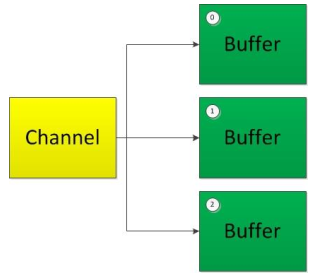

- 注意：按照缓冲区的顺序，从 Channel 中读取的数据依次将 Buffer 填满。  

聚集写入（Gathering Writes）：**将多个缓冲区中的数据聚集到通道中**

---

##### 字符集：Charset

编码：字符串-》字符数组

解码：字符数组-》字符串

---

##### 测试案例

```java
public class TestChannel {
    //利用通道完成文件的复制(非直接缓冲区)
    @Test
    public void test1(){
        long start=System.currentTimeMillis();

        FileInputStream fis=null;
        FileOutputStream fos=null;

        FileChannel inChannel=null;
        FileChannel outChannel=null;
        try{
            fis=new FileInputStream("d:/1.avi");
            fos=new FileOutputStream("d:/2.avi");

            //1.获取通道
            inChannel=fis.getChannel();
            outChannel=fos.getChannel();

            //2.分配指定大小的缓冲区
            ByteBuffer buf=ByteBuffer.allocate(1024);

            //3.将通道中的数据存入缓冲区中
            while(inChannel.read(buf)!=-1){
              //然后将缓冲区中的数据读取到通道中
                buf.flip();//切换读取数据的模式
                //4.将缓冲区中的数据写入通道中
                outChannel.write(buf);
                buf.clear();//清空缓冲区
            }
        }catch(IOException e){
            e.printStackTrace();
        }finally{
          //关闭流
            closeSources(inChannel, outChannel, fis, fos);
        }
        long end=System.currentTimeMillis();
        System.out.println("耗费时间："+(end-start));//耗费时间：1094
    }

    //使用直接缓冲区完成文件的复制(内存映射文件)
    @Test
    public void test2() {
        long start=System.currentTimeMillis();

        FileChannel inChannel=null;
        FileChannel outChannel=null;
        try {
            inChannel = FileChannel.open(Paths.get("d:/1.avi"), StandardOpenOption.READ);
            outChannel=FileChannel.open(Paths.get("d:/2.avi"), StandardOpenOption.WRITE,StandardOpenOption.READ,StandardOpenOption.CREATE);

            //内存映射文件
            MappedByteBuffer inMappedBuf=inChannel.map(MapMode.READ_ONLY, 0, inChannel.size());
            MappedByteBuffer outMappedBuf=outChannel.map(MapMode.READ_WRITE, 0, inChannel.size());
           
          //直接对缓冲区进行数据的读写操作，不需要通道
            byte[] dst=new byte[inMappedBuf.limit()];
            inMappedBuf.get(dst);
            outMappedBuf.put(dst);
        } catch (IOException e) {
            e.printStackTrace();
        }finally{
            //关闭流
            closeSources(inChannel, outChannel);
        }

        long end=System.currentTimeMillis();
        System.out.println("耗费的时间为："+(end-start));//耗费的时间为：200
    }

    //通道之间的数据传输(直接缓冲区)
    @Test
    public void test3(){
        long start=System.currentTimeMillis();

        FileChannel inChannel=null;
        FileChannel outChannel=null;
        try {
            inChannel = FileChannel.open(Paths.get("d:/1.avi"), StandardOpenOption.READ);
            outChannel=FileChannel.open(Paths.get("d:/2.avi"), StandardOpenOption.WRITE,StandardOpenOption.READ,StandardOpenOption.CREATE);
						//这两个效果一样
            //inChannel.transferTo(0, inChannel.size(), outChannel);
            outChannel.transferFrom(inChannel, 0, inChannel.size());
        } catch (IOException e) {
            e.printStackTrace();
        }finally{
            if(outChannel!=null){
                try {
                    outChannel.close();
                } catch (IOException e) {
                    e.printStackTrace();
                }
            }
            if(inChannel!=null){
                try {
                    inChannel.close();
                } catch (IOException e) {
                    e.printStackTrace();
                }
            }
        }
        long end=System.currentTimeMillis();
        System.out.println("耗费的时间为："+(end-start));//耗费的时间为：147
    }

    //分散和聚集
    @Test
    public void test4(){
        RandomAccessFile raf1=null;
        FileChannel channel1=null;
        RandomAccessFile raf2=null;
        FileChannel channel2=null;
        try {
            raf1=new RandomAccessFile("1.txt","rw");

            //1.获取通道
            channel1=raf1.getChannel();

            //2.分配指定大小的缓冲区
            ByteBuffer buf1=ByteBuffer.allocate(100);
            ByteBuffer buf2=ByteBuffer.allocate(1024);

            //3.分散读取
            ByteBuffer[] bufs={buf1,buf2};
            channel1.read(bufs);

            for(ByteBuffer byteBuffer : bufs){
                byteBuffer.flip();
            }
            System.out.println(new String(bufs[0].array(),0,bufs[0].limit()));
            System.out.println("--------------------");
            System.out.println(new String(bufs[1].array(),0,bufs[1].limit()));

            //4.聚集写入
            raf2=new RandomAccessFile("2.txt", "rw");
            channel2=raf2.getChannel();

            channel2.write(bufs);

        }catch (IOException e) {
            e.printStackTrace();
        }finally{
            if(channel2!=null){
                try {
                    channel2.close();
                } catch (IOException e) {
                    e.printStackTrace();
                }
            }
            if(channel1!=null){
                try {
                    channel1.close();
                } catch (IOException e) {
                    e.printStackTrace();
                }
            }
            if(raf2!=null){
                try {
                    raf2.close();
                } catch (IOException e) {
                    e.printStackTrace();
                }
            }
            if(raf1!=null){
                try {
                    raf1.close();
                } catch (IOException e) {
                    e.printStackTrace();
                }
            }
        }
    }

    //输出支持的字符集
    @Test
    public void test5(){
        Map<String,Charset> map=Charset.availableCharsets();
        Set<Entry<String,Charset>> set=map.entrySet();

        for(Entry<String,Charset> entry:set){
            System.out.println(entry.getKey()+"="+entry.getValue());
        }
    }

    //字符集
    @Test
    public void test6(){
        Charset cs1=Charset.forName("GBK");

        //获取编码器
        CharsetEncoder ce=cs1.newEncoder();

        //获取解码器
        CharsetDecoder cd=cs1.newDecoder();
				//char和byte之间的转换
        CharBuffer cBuf=CharBuffer.allocate(1024);
        cBuf.put("啦啦哈哈吧吧");
        cBuf.flip();

        //编码
        ByteBuffer bBuf=null;
        try {
            bBuf = ce.encode(cBuf);
        } catch (CharacterCodingException e) {
            e.printStackTrace();
        }

        for(int i=0;i<12;i++){
            System.out.println(bBuf.get());//-64-78-64-78-71-2-7-2-80-55-80-55
        }

        //解码
        bBuf.flip();
        CharBuffer cBuf2=null;
        try {
            cBuf2 = cd.decode(bBuf);
        } catch (CharacterCodingException e) {
            e.printStackTrace();
        }
        System.out.println(cBuf2.toString());//啦啦哈哈吧吧
    }
}
```

### 阻塞与非阻塞

- 传统的 IO 流都是阻塞式的。也就是说，当一个线程调用 read() 或 write()时，该线程被阻塞，直到有一些数据被读取或写入，该线程在此期间不能执行其他任务。因此，在完成网络通信进行 IO 操作时，由于线程会阻塞，所以服务器端必须为每个客户端都提供一个独立的线程进行处理，当服务器端需要处理大量客户端时，性能急剧下降。

- Java NIO 是非阻塞模式的。当线程从某通道进行读写数据时，若没有数据可用时，该线程可以进行其他任务。线程通常将非阻塞 IO 的空闲时间用于在其他通道上执行 IO 操作，所以单独的线程可以管理多个输入和输出通道。因此， NIO 可以让服务器端使用一个或有限几个线程来同时处理连接到服务器端的所有客户端  

#### 选择器（ Selector）
选择器（ Selector） 是 **SelectableChannle 对象的多路复用器**， Selector 可以同时监控多个 ·`SelectableChannel `的 IO 状况，也就是说，**利用 Selector可使一个单独的线程管理多个 Channel**。 Selector 是非阻塞 IO 的核心。

- SelectableChannle 的结构如下图： 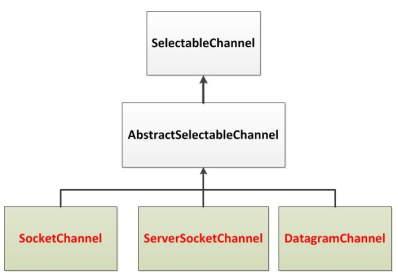 

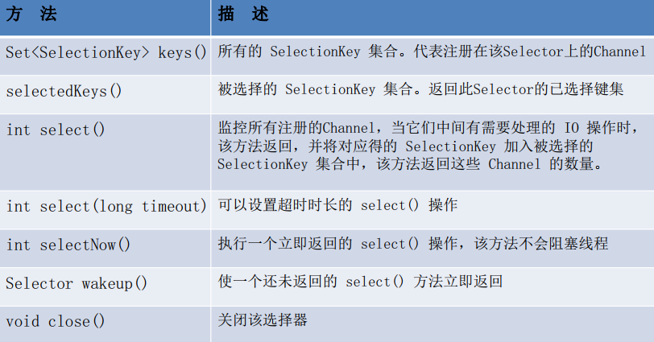


##### SelectionKey  

SelectionKey： 表示 SelectableChannel 和 Selector 之间的注册关系。每次向选择器注册通道时就会选择一个事件(选择键)。 选择键包含两个表示为整数值的操作集。操作集的每一位都表示该键的通道所支持的一类可选择操作  

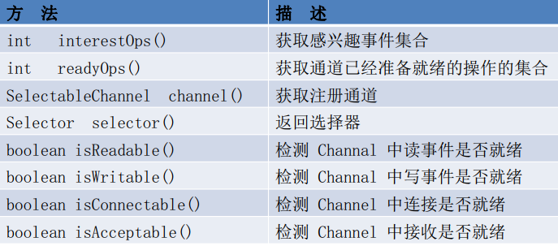

> 当调用` register(Selector sel, int ops) `将通道注册选择器时，选择器对通道的监听事件，需要通过第二个参数 ops 指定。
>
> - 可以监听的事件类型（ 可使用 SelectionKey 的四个常量表示）：
> - 读 : SelectionKey.OP_READ （ 1）
> - 写 : SelectionKey.OP_WRITE （ 4）
> - 连接 : SelectionKey.OP_CONNECT （ 8）
> - 接收 : SelectionKey.OP_ACCEPT （ 16）
>
> 若注册时不止监听一个事件，则可以使用“位或”操作符连接。


#### 选择器的应用  

使用NIO 完成网络通信的三个核心：

1. 通道(Channel):**负责连接**
   - `java.nio.channels.Channel `接口：
     - `SelectableChannel`
     - `SocketChannel`
     - `ServerSocketChannel`
     - `DatagramChannel`
     - `Pipe.SinkChannel`
     - `Pipe.SourceChannel`

2. 缓冲区(Buffer):**负责数据的存取**

3. 选择器(Selector):是 SelectableChannel 的多路复用器。**用于监控SelectableChannel的IO状况**


````java
//没用Selector，阻塞型的
public class TestBlockingNIO {

    //客户端
    @Test
    public void client() throws IOException{
      //获取通道
        SocketChannel sChannel=SocketChannel.open(new InetSocketAddress("127.0.0.1",9898));
        FileChannel inChannel=FileChannel.open(Paths.get("1.jpg"), StandardOpenOption.READ);
      //分配指定大小的缓冲区
      ByteBuffer buf=ByteBuffer.allocate(1024);
        while(inChannel.read(buf)!=-1){
            buf.flip();
            sChannel.write(buf);
            buf.clear();
        }
        sChannel.shutdownOutput();//关闭发送通道，表明发送完毕

        //接收服务端的反馈
        int len=0;
        while((len=sChannel.read(buf))!=-1){
            buf.flip();
            System.out.println(new String(buf.array(),0,len));
            buf.clear();
        }
        inChannel.close();
        sChannel.close();
    }

    //服务端
    @Test
    public void server() throws IOException{
      //获取通道
        ServerSocketChannel ssChannel=ServerSocketChannel.open();
        FileChannel outChannel=FileChannel.open(Paths.get("2.jpg"), StandardOpenOption.WRITE,StandardOpenOption.CREATE);
      //绑定端口号  
      ssChannel.bind(new InetSocketAddress(9898));
      //获取客户端的通道
        SocketChannel sChannel=ssChannel.accept();
      //分配缓冲区
        ByteBuffer buf=ByteBuffer.allocate(1024);
        while(sChannel.read(buf)!=-1){
            buf.flip();
            outChannel.write(buf);
            buf.clear();
        }

        //发送反馈给客户端
        buf.put("服务端接收数据成功".getBytes());
        buf.flip();//给为读模式
        sChannel.write(buf);

        sChannel.close();
        outChannel.close();
        ssChannel.close();
    }
}
````


````java
public class TestNonBlockingNIO {
    //客户端
    @Test
    public void client()throws IOException{
        //1.获取通道
        SocketChannel sChannel=SocketChannel.open(new InetSocketAddress("127.0.0.1", 9898));
        //2.切换非阻塞模式
        sChannel.configureBlocking(false);
        //3.分配指定大小的缓冲区
        ByteBuffer buf=ByteBuffer.allocate(1024);
        //4.发送数据给服务端
        Scanner scan=new Scanner(System.in);
        while(scan.hasNext()){
            String str=scan.next();
            buf.put((new Date().toString()+"\n"+str).getBytes());
            buf.flip();
            sChannel.write(buf);
            buf.clear();
        }
        //5.关闭通道
        sChannel.close();
    }

    //服务端
    @Test
    public void server() throws IOException{
        //1.获取通道
        ServerSocketChannel ssChannel=ServerSocketChannel.open();
        //2.切换非阻塞式模式
        ssChannel.configureBlocking(false);
        //3.绑定连接
        ssChannel.bind(new InetSocketAddress(9898));
        //4.获取选择器
        Selector selector=Selector.open();
        //5.将通道注册到选择器上，并且指定“监听接收事件”
        ssChannel.register(selector,SelectionKey.OP_ACCEPT);
        //6.轮询式的获取选择器上已经“准备就绪”的事件
        while(selector.select()>0){
            //7.获取当前选择器中所有注册的“选择键（已就绪的监听事件）”
            Iterator<SelectionKey> it=selector.selectedKeys().iterator();

            while(it.hasNext()){
                //8.获取准备“就绪”的事件
                SelectionKey sk=it.next();

                //9.判断具体是什么时间准备就绪
                if(sk.isAcceptable()){
                    //10.若“接收就绪”，获取客户端连接
                    SocketChannel sChannel=ssChannel.accept();

                    //11.切换非阻塞模式
                    sChannel.configureBlocking(false);

                    //12.将该通道注册到选择器上
                    sChannel.register(selector, SelectionKey.OP_READ);
                }else if(sk.isReadable()){
                    //13.获取当前选择器上“读就绪”状态的通道
                    SocketChannel sChannel=(SocketChannel)sk.channel();
                    //14.读取数据
                    ByteBuffer buf=ByteBuffer.allocate(1024);
                    int len=0;
                    while((len=sChannel.read(buf))>0){
                        buf.flip();
                        System.out.println(new String(buf.array(),0,len));
                        buf.clear();
                    }
                }
                //15.取消选择键SelectionKey
                it.remove();
            }
        }
    }
}
````

##### **DatagramChannel**

Java NIO中的DatagramChannel是一个能收发UDP包的通道。

```java
public class TestNonBlockNIO2 {
    @Test
    public void send() throws IOException{
        DatagramChannel dc=DatagramChannel.open();
        dc.configureBlocking(false);
        ByteBuffer buf=ByteBuffer.allocate(1024);
        Scanner scan=new Scanner(System.in);
        while(scan.hasNext()){
            String str=scan.next();
            buf.put((new Date().toString()+"\n"+str).getBytes());
            buf.flip();
            dc.send(buf, new InetSocketAddress("127.0.0.1", 9898));
            buf.clear();
        }
        dc.close();
    }

    @Test
    public void receive() throws IOException{
        DatagramChannel dc=DatagramChannel.open();
        dc.configureBlocking(false);
        dc.bind(new InetSocketAddress(9898));
        Selector selector=Selector.open();
        dc.register(selector, SelectionKey.OP_READ);
        while(selector.select()>0){
            Iterator<SelectionKey> it=selector.selectedKeys().iterator();
            while(it.hasNext()){
                SelectionKey sk=it.next();

                if(sk.isReadable()){
                    ByteBuffer buf=ByteBuffer.allocate(1024);
                    dc.receive(buf)
;
                    buf.flip();
                    System.out.println(new String(buf.array(),0,buf.limit()));
                    buf.clear();
                }
            }
            it.remove();
        }
    }
}
```

##### **管道 (Pipe)**

Java NIO 管道是2个线程之间的单向数据连接。Pipe有一个source通道和一个sink通道。数据会被写到sink通道，从source通道读取。

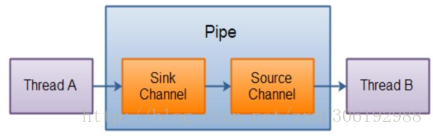

```java
public class TestPipe {
    @Test
    public void test1()throws IOException{
        //1.获取管道
        Pipe pipe=Pipe.open();
        //2.将缓冲区中的数据写入管道
        ByteBuffer buf=ByteBuffer.allocate(1024);
        Pipe.SinkChannel sinkChannel=pipe.sink();
        buf.put("通过单向管道发送数据".getBytes());
        buf.flip();
        sinkChannel.write(buf);

        //3.读取缓冲区中的数据
        Pipe.SourceChannel sourceChannel=pipe.source();
        buf.flip();
        int len=sourceChannel.read(buf);
        System.out.println(new String(buf.array(),0,len));

        sourceChannel.close();
        sinkChannel.close();
    }
}
```

