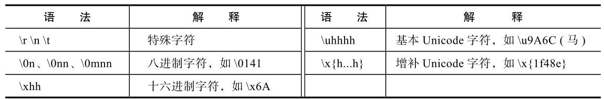
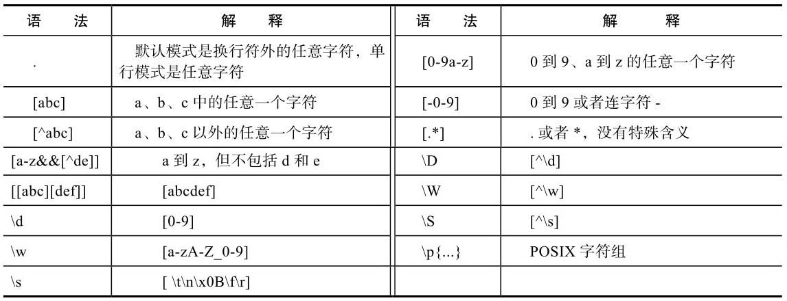
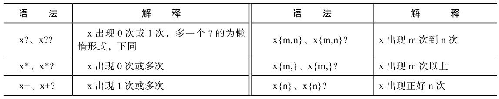
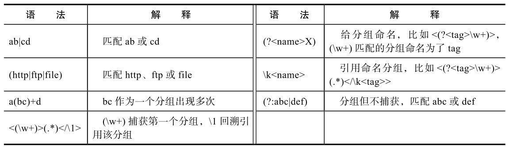
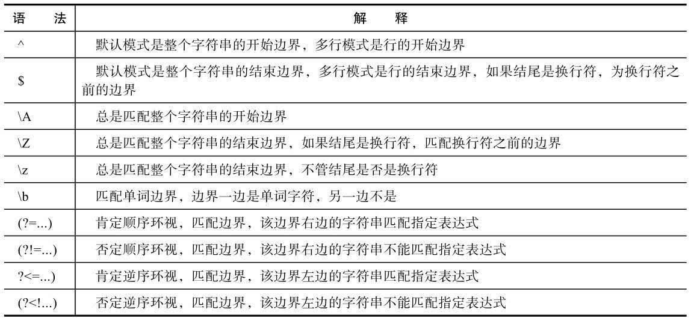
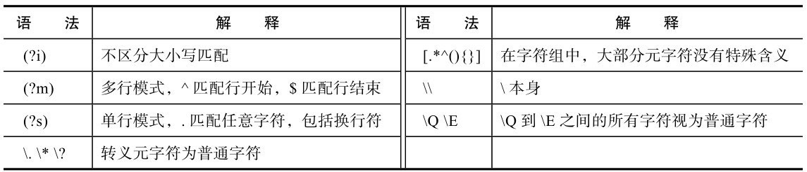

## 25.1 语法

正则表达式是一串字符，它描述了一个文本模式，利用它可以方便地处理文本。

正则表达式中的字符有两类：一类是普通字符，就是匹配字符本身；另一类是元字符，这些字符有特殊含义，这些元字符及其特殊含义构成了正则表达式的语法。

### 1．单个字符

有一些单个字符使用多个字符表示：

1. 特殊字符，比如tab字符'\t'、换行符'\n'、回车符'\r'等。
2. 八进制表示的字符，以\0开头，后跟1～3位数字，比如\0141，对应的是ASCII编码为97的字符，即字符'a'。
3. 十六进制表示的字符，以\x开头，后跟两位字符，比如\x6A，对应的是ASCII编码为106的字符，即字符'j'。
4. Unicode编号表示的字符，以\u开头，后跟4位字符，比如\u9A6C，表示的是中文字符'马'，这只能表示编号在0xFFFF以下的字符，如果超出0ⅩFFFF，使用\x{...}形式，比如\x{1f48e}。
5. 斜杠\本身，斜杠\是一个元字符，如果要匹配它自身，使用两个斜杠表示，即`\\`。
6. 元字符本身，除了'`\`'，正则表达式中还有很多元字符，比如．、*、?、+等，要匹配这些元字符自身，需要在前面加转义字符'`\`'，比如'`\.`'。

### 2．字符组

点号字符'.'是一个元字符，默认模式下，它匹配除了换行符以外的任意字符

> **字符组:匹配组中的任意一个字符**，用中括号[]表示

比如：`[abcd]`,匹配a、b、c、d中的任意一个字符。

为方便表示连续的多个字符，字符组中可以使用连字符'-':`[0-9]`

可以有多个连续空间，可以有其他普通字符，比如：`[a-z0-9A-Z]`

在字符组中，'-'是一个元字符，如果要匹配它自身，可以使用转义，即'`\-`'，或者把它放在字符组的最前面，比如：`[-123]`,`[123\-]`

字符组支持排除的概念，在[后紧跟一个字符^，比如：`[^123]`,匹配除了1/2/3以外的任意一个字符

^只有在字符组的开头才是元字符，如果不在开头，就是普通字符，匹配它自身，比如：`[a^c]`匹配a/^/b

在字符组中，除了`^`、`-`、`[ ]`、`\`外，其他在字符组外的元字符不再具备特殊含义，变成了普通字符，比如字符'`.`'和'`＊`',` [.*]`就是匹配'`.`'或者'`*`'本身。

### 3．量词

量词指的是指定出现次数的元字符，有三个常见的元字符：`+`、`*`、`? `

1. `+`：表示前面字符的一次或多次出现，比如正则表达式ab+c，既能匹配abc，也能匹配abbc，或abbbc。
2. `*`:表示前面字符的零次或多次出现，比如正则表达式ab*c，既能匹配abc，也能匹配ac，或abbbc。
3. `?` ：表示前面字符的零次或一次出现，比如正则表达式ab? c，既能匹配abc，也能匹配ac，但不能匹配abbc。

更为通用的表示出现次数的语法是{m, n}，出现次数从m到n，包括m和n，如果n没有限制，可以省略，如果m和n一样，可以写为{m}，比如：

- ab{1,10}c:b可以出现1次到10次。
- ab{3}c:b必须出现三次，即只能匹配abbbc。
- ab{1, }c：与ab+c一样。
- ab{0, }c：与ab*c一样。
- ab{0,1}c：与ab? c一样。

> `?、*、+`{是元字符，如果要匹配这些字符本身，需要使用'`\`'转义

### 4．分组

表达式可以用括号()括起来，表示一个分组，比如a(bc)d, bc就是一个分组。分组可以嵌套，比如a(de(fg))。分组默认都有一个编号，按照括号的出现顺序，从1开始，从左到右依次递增，比如表达式：

### 5．特殊边界匹配

^匹配整个字符串的开始，^abc表示整个字符串必须以abc开始。

> 需要注意的是^的含义，在字符组中它表示排除，但在字符组外，它匹配开始

$匹配整个字符串的结束，不过，如果整个字符串以换行符结束，$匹配的是换行符之前的边界，比如表达式abc$，表示整个表达式以abc结束，或者以abc\r\n或abc\n结束。

### 总结

