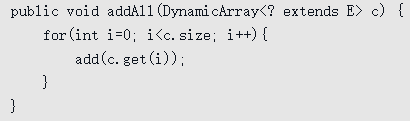
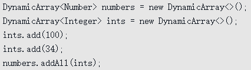
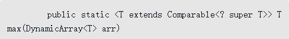
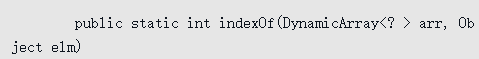
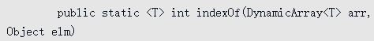
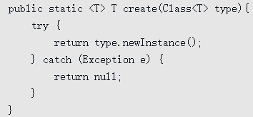

# 8 泛型

**泛型就是类型参数化，处理的数据类型不是固定的，而是作为参数传入**。Java泛型是通过擦除实现的，类定义中的类型参数如T会被替换为Object，在程序运行过程中，不知道泛型的实际类型参数。因此对于运行期的Java语言来说，`ArrayList`与`ArrayList`就是同一个类。

所以说泛型技术实际上是Java语言的一颗语法糖，Java语言中的泛型实现方法称为**类型擦除**，基于这种方法实现的泛型被称为`伪泛型`。

> 类型擦除指的是通过类型参数合并，将泛型类型实例关联到同一份字节码上。编译器只为泛型类型生成一份字节码，并将其实例关联到这份字节码上。类型擦除的关键在于从泛型类型中清除类型参数的相关信息，并且再必要的时候添加类型检查和类型转换的方法。 类型擦除可以简单的理解为将泛型java代码转换为普通java代码，只不过编译器更直接点，将泛型java代码直接转换成普通java字节码。 类型擦除的主要过程如下： **1.将所有的泛型参数用其最左边界（最顶级的父类型）类型替换。2.移除所有的类型参数。**

## Java编译器处理泛型过程

**code 1:**

```java
public static void main(String[] args) {  
    Map<String, String> map = new HashMap<String, String>();  
    map.put("name", "hollis");  
    map.put("age", "22");  
    System.out.println(map.get("name"));  
    System.out.println(map.get("age"));  
}  复制ErrorOK!
```

**反编译后的code 1:**

```java
public static void main(String[] args) {  
    Map map = new HashMap();  
    map.put("name", "hollis");  
    map.put("age", "22"); 
    System.out.println((String) map.get("name"));  
    System.out.println((String) map.get("age"));  
}  
```

**code 2:**

```
interface Comparable<A> {
    public int compareTo(A that);
}

public final class NumericValue implements Comparable<NumericValue> {
    private byte value;

    public NumericValue(byte value) {
        this.value = value;
    }

    public byte getValue() {
        return value;
    }

    public int compareTo(NumericValue that) {
        return this.value - that.value;
    }
}复制ErrorOK!
```

**反编译后的code 2:**

```
 interface Comparable {
  public int compareTo( Object that);
} 

public final class NumericValue
    implements Comparable
{
    public NumericValue(byte value)
    {
        this.value = value;
    }
    public byte getValue()
    {
        return value;
    }
    public int compareTo(NumericValue that)
    {
        return value - that.value;
    }
    public volatile int compareTo(Object obj)
    {
        return compareTo((NumericValue)obj);
    }
    private byte value;
}
```

> 泛型类`Comparable `擦除后 A被替换为最左边界`Object`。`Comparable`的类型参数`NumericValue`被擦除掉，但是这直 接导致`NumericValue`没有实现接口`Comparable的compareTo(Object that)`方法，于是编译器充当好人，添加了一个**桥接方法**。 


**code 3:**

```java 
public class Collections {
    public static <A extends Comparable<A>> A max(Collection<A> xs) {
        Iterator<A> xi = xs.iterator();
        A w = xi.next();
        while (xi.hasNext()) {
            A x = xi.next();
            if (w.compareTo(x) < 0)
                w = x;
        }
        return w;
    }
}
```

**反编译后的code 3:**

```java
public class Collections
{
    public Collections()
    {
    }
    public static Comparable max(Collection xs)
    {
        Iterator xi = xs.iterator();
        Comparable w = (Comparable)xi.next();
        while(xi.hasNext())
        {
            Comparable x = (Comparable)xi.next();
            if(w.compareTo(x) < 0)
                w = x;
        }
        return w;
    }
}
```

> 示例中限定了类型参数的边界`>A`，A必须为`Comparable`的子类，按照类型擦除的过程，先讲所有的类型参数替换为最左边界`Comparable`，然后去掉参数类型`A`，得到最终的擦除后结果。

---

1. 虚拟机中没有泛型，只有普通类和普通方法,所有泛型类的类型参数在编译时都会被擦除,泛型类并没有自己独有的Class类对象。比如并不存在`List<String>.class`或是`List<Integer>.class`，而只有`List.class`。
2. 创建泛型对象时请指明类型，让编译器尽早的做参数检查（**Effective Java，第23条：请不要在新代码中使用原生态类型**）
3. 不要忽略编译器的警告信息，那意味着潜在的`ClassCastException`等着你。 
4. 静态变量是被泛型类的所有实例所共享的。对于声明为`MyClass`的类，访问其中的静态变量的方法仍然是 `MyClass.myStaticVar`。不管是通过`new MyClass<String>`还是`new MyClass<Integer>`创建的对象，都是共享一个静态变量。 
5. 泛型的类型参数不能用在`Java`异常处理的`catch`语句中。因为异常处理是由JVM在运行时刻来进行的。由于类型信息被擦除，`JVM`是无法区分两个异常类型`MyException<String>`和`MyException<Integer>`的。对于`JVM`来说，它们都是 `MyException`类型的。也就无法执行与异常对应的`catch`语句。

## 8.1 类型参数

- E - Element (在集合中使用，因为集合中存放的是元素)

- T - Type（Java 类）

- K - Key（键）

- V - Value（值）

- N - Number（数值类型）

- ？ - 表示不确定的java类型（无限制通配符类型）

- S、U、V - 2nd、3rd、4th types

- Object - 是所有类的根类，任何类的对象都可以设置给该Object引用变量，使用的时候可能需要类型强制转换，但是用使用了泛型T、E等这些标识符后，在实际用之前类型就已经确定了，不需要再进行类型强制转换。

----

**泛型类**：**类型参数放在类名之后**

```java
public class Pair<U,V>{
    U first;
    V second;
    public Pair(U first,V second){
        this.first = first;
        this.second = second;
    }
}
Pair<String,Integer> pair = new Pair<>("laomu",20);
```


**泛型方法**：**类型参数放在返回值前**；与泛型类一样，类型参数可以有多个，以逗号分隔，比如：

```java
public static <U,V> Pair<U,V> makePair(U first, V second){ 
    Pair<U,V> pair = new Pair<>(first, second); 
    return pair; 
}
```

**泛型接口**：和泛型类差不多

### 类型参数限定 

1. **上界为某个具体类**：`<T extends Number>`

2. **上界为某个接口**:`<T extends Comparable<T>>`,这里因为Comparable是一个泛型接口，它也需要一个类型参数

   1. ````java
      public static <T extends Comparable<T>> T max(T[] arr){//主体代码}
      ````

   2. 这种形式称为递归类型限制，可以这么解读：T表示一种数据类型，必须实现Comparable接口，且必须可以与相同类型的元素进行比较。

3. **上界为其他类型参数**：上面的限定都是指定了一个明确的类或接口，Java支持一个类型参数以另一个类型参数作为上界，`<T extends E>`。

泛型是计算机程序中一种重要的思维方式，它将数据结构和算法与数据类型相分离，使得同一套数据结构和算法能够应用于各种数据类型，而且可以保证类型安全，提高可读性

## 8.2 通配符

### 8.2.1 限定通配符



这个方法没有定义类型参数，==c的类型是DynamicArray<? extends E>, ？表示通配符，<? extends E>表示有限定通配符，匹配E或E的某个子类型，具体什么子类型是未知的。==

使用这个方法的代码不需要做任何改动，还可以是：



这里，E是Number类型，`DynamicArray<? extends E>`可以匹配`DynamicArray<Integer>`。

> #### **`<T extends E>`和`<? extends E>`到底有什么关系？**  它们用的地方不一样，我们解释一下：  
>
> - `<T extends E>`用于**定义类型参数**，它声明了一个类型参数T，可放在泛型类定义中类名后面、泛型方法返回值前面。
>
> - `<? extends E> `用于**实例化类型参数**，它用于实例化泛型变量中的类型参数，只是这个具体类型是未知的，只知道它是E或E的某个子类型。
>
> #### `List<?>`和`List<Object>` 的区别
>
> `List<?>` 是一个未知类型的List，而`List<Object>` 其实是任意类型的List。你可以把`List<String>`, `List<Integer>`赋值给`List<?>`，却不能把`List<String>`赋值给 `List<Object>`。

-----

`<? extends T>`：是指 “上界通配符（Upper Bounds Wildcards）”，即泛型中的类必须为**当前类或其子类**。

`<? super T>`：是指 “下界通配符（Lower Bounds Wildcards）”，即泛型中的类必须为**当前类或者其父类**。

---

`<? extends T>`：说明泛型是T类型或者子类，所以可以确定取出来的都属于T类型，但是放入的时候不能确定是哪一个子类，因此只能读取，不能放入。

`List<? extends T>`可以`Fruit f = list.get(1)`；只能读取不能放入

因为泛型中用的是extends，在向list中存放元素的时候，我们并不能确定List中的元素的具体类型，即可能是Apple也可能是Banana。因此调用add方法时，不论传入new Apple()还是new Banana()，都会出现编译错误。

---

`<? super E>`，称为超类型通配符，表示E的**某个父类型**，**所以可以放入当前类型和其子类**，但是获取的时候不知道究竟是哪一个父类型，所以只能是Object类型

eg:`List<? super Fruit> list`可以：`list.add(new Apple())`，`Object o = list.get(1)`不能确定testSuper方法的参数中的泛型是Fruit的哪个父类，因此在调用get方法时只能返回Object类型。

错误的方式：

正确的方式：

>对于有限定的通配符形式`<? extends E>`，可以用类型参数限定替代，但是对于类似上面的**超类型通配符，则无法用类型参数替代**。

> #### 频繁往外读取内容的，适合用上界Extends。经常往里插入的，适合用下界Super。


### 8.2.1 非限定通配符

除了有限定通配符，还有一种通配符，形如`DynamicArray<?>`，称为**无限定通配符**。  
无限定通配符形式也可以改为使用类型参数:



> 通配符形式更为简洁，返回值之前不需要类型参数。虽然通配符形式更为简洁，但上面两种通配符都有一个重要的限制：**只能读，不能写。**


>为什么呢？问号就是表示类型安全无知，`? extends Number`表示是Number的某个子类型，但不知道具体子类型，如果允许写入，Java就无法确保类型安全性，所以干脆禁止
>
>#### 同理：`List<Object>`和原始类型`List`之间的区别?
>
>原始类型`List`和带参数类型`List<Object>`之间的主要区别是，在编译时编译器不会对原始类型进行类型安全检查，却会对带参数的类型进行检查。
>
>通过使用Object作为类型，可以告知编译器该方法可以接受任何类型的对象，比如String或Integer。
>
>它们之间的第二点区别是，你可以把任何带参数的类型传递给原始类型List，但却不能把`List<String>`传递给接受 `List<Object>`的方法，因为会产生编译错误。

**泛型方法到底应该用通配符的形式还是加类型参数。两者到底有什么关系？**

- 通配符形式都可以用类型参数的形式来替代，通配符能做的，用类型参数都能做。
- 通配符形式可以减少类型参数，形式上往往更为简单，可读性也更好，所以，能用通配符的就用通配符。
- 如果类型参数之间有依赖关系，或者返回值依赖类型参数，或者需要写操作，则只能用类型参数。
- 通配符形式和类型参数往往配合使用，比如，定义必要的类型参数，使用通配符表达依赖，并接受更广泛的数据类型。


### 8.2.4 <? >、<? super E>和<? extends E>

1. 它们的目的都是为了使方法接口更为灵活，可以接受更为广泛的类型。
2. <? super E>**用于灵活写入或比较**，使得对象可以写入父类型的容器，使得父类型的比较方法可以应用于子类对象，它不能被类型参数形式替代。
3. <? >和<? extends E>**用于灵活读取**，使得方法可以读取E或E的任意子类型的容器对象，它们可以用类型参数的形式替代，但通配符形式更为简洁。

## 8.3 泛型的局限

### 8.3.1 使用泛型类、方法和接口

使用泛型类、方法和接口时，有一些值得注意的地方，比如：

- 基本类型不能用于实例化类型参数。
- 运行时类型信息不适用于泛型。
- **类型擦除**可能会引发一些冲突。

Java中，因为类型参数会被替换为Object，所以Java泛型中不能使用基本数据类型，但是**可以使用基本类型的包装类**。

> 在内存中每个类都有一份**类型信息**，而每个对象也都保存着其**对应类型信息的引用**。
>
> 在Java中，这个类型信息也是一个**对象**，它的类型为**Class**, Class本身也是一个**泛型类**，每个类的类型对象可以通过`<类名>.class`的方式引用，比如`String. class`、`Integer.class`。这个类型对象也可以通过对象的`getClass()`方法获得.
>
> 泛型对象的类型对象和原始对象的类型对象一样

### 8.3.2 定义泛型类、方法和接口

在定义泛型类、方法和接口时，也有一些需要注意的地方，比如：

- 不能通过类型参数创建对象。
- 泛型类类型参数不能用于静态变量和方法。
- 了解多个类型限定的语法。

1. 如果确实希望根据类型创建对象呢？需要设计API接受类型对象，即Class对象，并使用Java中的反射机制。  
   

2. 对于泛型类声明的类型参数，可以在实例变量和方法中使用，但在静态变量和静态方法中是不能使用的。