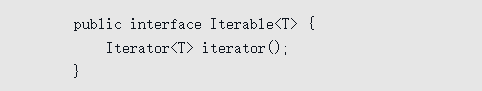
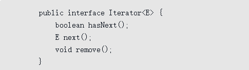
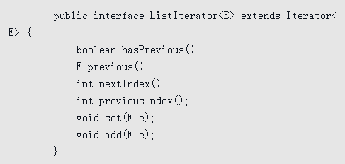
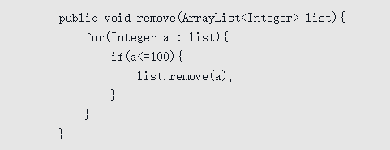
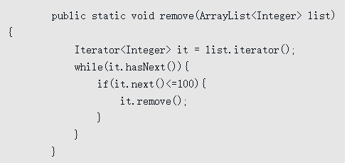
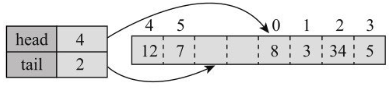

## 9.1 剖析ArrayList

ArrayList是一个泛型容器，新建ArrayList需要实例化泛型参数：

```java
Arraylist<Integer> intList = new Arraylist<>();
```

ArrayList的主要方法有：

```java
boolean add(Element e) //增加指定元素到链表尾部.
void add(int index, Element e) //增加指定元素到链表指定位置.
boolean addAll(Collection<? extends E> c) //将指定collection中的所有元素插入到ArrayList中
boolean addAll(int index, Collection<? extends E> c) //从指定的位置开始，将指定collection 中的所有元素插入到ArrayList中
void clear() //从链表中删除所有元素.
E remove(int index) //删除链表中指定位置的元素.
boolean removeIf(Predicate<? super E> filter) //根据重写Predicate类的test方法选择删除集合中的元素
boolean removeAll(Collection<?> c) //移除ArrayList中Collection所包含的所有元素
boolean remove(Object o) //移除ArrayList中首次出现的指定元素（如果存在则移除并返回true，否则返回false）
E get(int index) //获取链表中指定位置处的元素.
Object[] toArray() //获取一个数组，数组中所有元素是链表中的元素.（即将链表转换为一个数组）
<T> T[] toArray(T[] a) //构造一个数组
List<E> subList(int fromIndex, int toIndex) //获取从fromIndex到toIndex位置的元素
E set(int index, E element) //将链表中指定位置上的元素替换成新元素。
boolean contains(Object o) //如果链表包含指定元素，返回true.
int indexOf(Object o) //返回元素在链表中第一次出现的位置，如果返回-1，表示链表中没有这个元素。
int lastIndexOf(Object o) //返回元素在链表中最后一次出现的位置，如果返回-1，表示链表中没有这个元素。
boolean isEmpty() //返回true表示链表中没有任何元素. 判断逻辑是size == 0
int size() //返回链表长度（链表包含元素的个数）
```

### 9.1.2 基本原理

内部有一个数组elementData，一般会有一些预留的空间，默认10，有一个整数size记录实际的元素个数（基于Java 7）


#### add()方法

```java
public boolean add(E e) {
        ensureCapacityInternal(size + 1);  //确保容量，最小是10，1.5倍扩容
        elementData[size++] = e;
        return true;
    }
```

#### remove()方法

```java
public E remove(int index) {
        rangeCheck(index);

        modCount++;
        E oldValue = elementData(index);

        int numMoved = size - index - 1;
        if (numMoved > 0)
            System.arraycopy(elementData, index+1, elementData, index,
                             numMoved);
        elementData[--size] = null; // clear to let GC do its work

        return oldValue;
    }
```

### 9.1.3 迭代

```java
for(Integer n : intList){
    System.out.print(n);
}
//这种foreach会被编译器转化为：
Iterator<Integer> iterator = intList.iterator();
	while(iterator.hasNext()){
    	System.out.print(iterator.next());
 }
```

1. ArrayList实现了`Iterable接口`，Iterable表示可迭代；iterator方法返回一个实现了`Iterator接口`的对象
   
   

2. 只要对象实现了Iterable接口，就可以使用foreach语法，编译器会转换为调用Iterable和Iterator接口的方法。
   1. Iterable表示对象可以被迭代，它有一个方法iterator()，返回Iterator对象，实际通过Iterator接口的方法进行遍历；
   2. 如果对象实现了Iterable，就可以使用foreach语法；
   3. 类可以不实现Iterable，也可以创建Iterator对象。

3. ArrayList还提供了ListIterator接口的方法：
   

#### 迭代的陷阱

错误的删除元素方法：  

抛出异常：  


因为**迭代器内部会维护一些索引位置相关的数据，要求在迭代过程中，容器不能发生结构性变化，否则这些索引位置就失效了**。所谓结构性变化就是添加、插入和删除元素，只是修改元素内容不算结构性变化

正确的删除元素方法：  


**实现原理：**

ArrayList中iterator方法的实现:

```java
public Iterator<E> iterator() {
        return new Itr();
    }
```

新建了一个**Itr对象**，Itr是一个成员内部类，实现了Iterator接口，有三个成员变量：

```java
int cursor;       // 下一个要返回的元素索引
int lastRet = -1; // 最后一个要返回元素的索引，没有为-1
int expectedModCount = modCount;//期望的修改次数初始化为外部类当前的修改次数modCount
```

Itr对象的方法：

```java
public boolean hasNext() {
     return cursor != size;
}
public E next() {
    checkForComodification();//检查链表结构是否改变
    int i = cursor;
    if (i >= size)
        throw new NoSuchElementException();
    Object[] elementData = ArrayList.this.elementData;
    if (i >= elementData.length)
        throw new ConcurrentModificationException();
    cursor = i + 1;//更新cursor
    return (E) elementData[lastRet = i];//更新lastRet
}
public void remove() {
    if (lastRet < 0)
        throw new IllegalStateException();
    checkForComodification();

    try {
        ArrayList.this.remove(lastRet);
        cursor = lastRet;
        lastRet = -1;
        expectedModCount = modCount;
    } catch (IndexOutOfBoundsException ex) {
        throw new ConcurrentModificationException();
    }
}
//remove()调用了ArrayList的remove方法，但同时更新了cursor、lastRet和expectedModCount的值，所以它可以正确删除。
//不过，需要注意的是，调用remove方法前必须先调用next
```

>迭代器表示的是一种关注点分离的思想，将数据的实际组织方式与数据的迭代遍历相分离，是一种常见的设计模式。需要访问容器元素的代码只需要一个Iterator接口的引用，不需要关注数据的实际组织方式，可以使用一致和统一的方式进行访问。

#### 总结

1）可以随机访问，按照索引位置进行访问效率很高，用算法描述中的术语，效率是O(1)，简单说就是可以一步到位。

2）除非数组已排序，否则按照内容查找元素效率比较低，具体是O(N), N为数组内容长度，也就是说，性能与数组长度成正比。

3）添加元素的效率还可以，重新分配和复制数组的开销被平摊了，具体来说，添加N个元素的效率为O(N)。

4）插入和删除元素的效率比较低，因为需要移动元素，具体为O(N)。

## 9.2 LinkedList

LinkedList与ArrayList一样，同样实现了List接口，而List接口扩展了Collection接口，Collection又扩展了Iterable接口，所有这些接口的方法都是可以使用的，LinkedList还实现了队列接口Queue接口、双端队列Duque接口。

Queue扩展了Collection，它的主要操作有三个：

- 在尾部添加元素（add、offer）；
- 查看头部元素（element、peek），返回头部元素，但不改变队列；
- 删除头部元素（remove、poll），返回头部元素，并且从队列中删除。

>每种操作都有两种形式，有什么区别呢？区别在于，对于特殊情况的处理不同。**特殊情况是指队列为空或者队列为满**，为空容易理解，为满是指队列有长度大小限制，而且已经占满了。LinkedList的实现中，队列长度没有限制，但别的Queue的实现可能有。在队列为空时，element和remove会抛出异常NoSuchElementException，而peek和poll返回特殊值null；在队列为满时，add会抛出异常IllegalStateException，而offer只是返回false。

Deque中，主要有三个方法：

- push表示入栈，在头部添加元素，栈的空间可能是有限的，如果栈满了，push会抛出异常IllegalStateException。
- pop表示出栈，返回头部元素，并且从栈中删除，如果栈为空，会抛出异常NoSuch-ElementException。
- peek查看栈头部元素，不修改栈，如果栈为空，返回null。

#### 实现原理

ArrayList内部是数组，元素在内存是连续存放的，但LinkedList不是。LinkedList直译就是链表，确切地说，它的内部实现是双向链表，每个元素在内存都是单独存放的，元素之间通过链接连在一起

为了表示链接关系，需要一个节点的概念。节点包括实际的元素，但同时有两个链接

```java
private static class Node<E> {
    E item;
    Node<E> next;
    Node<E> prev;
    Node(Node<E> prev, E element, Node<E> next) {
        this.item = element;
        this.next = next;
        this.prev = prev;
    }
}

transient int size = 0;
transient Node<E> first;
transient Node<E> last;
```

#### add()

```java
 public boolean add(E e) {
     linkLast(e);
     return true;
 }
void linkLast(E e) {
    final Node<E> l = last;
    final Node<E> newNode = new Node<>(l, e, null);
    last = newNode;
    if (l == null)
        first = newNode;
    else
        l.next = newNode;
    size++;
    modCount++;
}
```

#### get()

```java
public E get(int index) {
    checkElementIndex(index);
    return node(index).item;
}
Node<E> node(int index) {
    // assert isElementIndex(index);
    if (index < (size >> 1)) {
        Node<E> x = first;
        for (int i = 0; i < index; i++)
            x = x.next;
        return x;
    } else {
        Node<E> x = last;
        for (int i = size - 1; i > index; i--)
            x = x.prev;
        return x;
    }
}
//size>>1等于size/2，如果索引位置在前半部分（index<(size>>1)），则从头节点开始查找，否则，从尾节点开始查找。
```

#### add(int index, E ele)

```java
public void add(int index, E element) {
    checkPositionIndex(index);

    if (index == size)
        linkLast(element);
    else
        linkBefore(element, node(index));//先用node(index)查找对应节点，O(N)
}

void linkBefore(E e, Node<E> succ) {
    // assert succ != null;
    final Node<E> pred = succ.prev;
    final Node<E> newNode = new Node<>(pred, e, succ);
    succ.prev = newNode;
    if (pred == null)
        first = newNode;
    else
        pred.next = newNode;
    size++;
    modCount++;
}
```

### 总结

1）按需分配空间，不需要预先分配很多空间。  
2）不可以随机访问，按照索引位置访问效率比较低，必须从头或尾顺着链接找，效率为O(N/2)。  
3）不管列表是否已排序，只要是按照内容查找元素，效率都比较低，必须逐个比较，效率为O(N)。  
4）在两端添加、删除元素的效率很高，为O(1)。  
5）在中间插入、删除元素，要先定位，效率比较低，为O(N)，但修改本身的效率很高，效率为O(1)。

## 9.3 ArrayDeque

ArrayDeque，它是基于数组实现的。一般而言，由于需要移动元素，数组的插入和删除效率比较低，但ArrayDeque的效率却非常高

ArrayDeque实现了Deque接口，同LinkedList一样，它的队列长度也是没有限制的， Deque扩展了Queue，有队列的所有方法，还可以看作栈，有栈的基本方法push/pop/peek，还有明确的操作两端的方法如addFirst/removeLast等

### 实现原理

ArrayDeque内部主要有如下实例变量：

````java
transient Object[] elements;//默认16
transient int head;
transient int tail;
````

ArrayDeque的高效来源于head和tail这两个变量，它们使得物理上简单的从头到尾的数组变为了一个逻辑上循环的数组，避免了在头尾操作时的移动

#### 循环数值

1）如果head和tail相同，则数组为空，长度为0。  
2）如果tail大于head，则第一个元素为elements[head]，最后一个为elements[tail-1]，长度为tail-head，元素索引从head到tail-1。  
3）如果tail小于head，且为0，则第一个元素为`elements[head]`，最后一个为`elements [elements.length-1]`，元素索引从`head到elements.length-1`。  
4）如果tail小于head，且大于0，则会形成循环，第一个元素为`elements[head]`，最后一个是`elements[tail-1]`，元素索引从`head到elements.length-1`，然后再从`0到tail-1`。



#### add()

````java
public boolean add(E e) {
    addLast(e);
    return true;
}
public void addLast(E e) {
    if (e == null)
        throw new NullPointerException();
    elements[tail] = e;
    //tail的下一个位置是(tail+1) &(elements.length-1)，如果与head相同，则队列就满了
    if ( (tail = (tail + 1) & (elements.length - 1)) == head)
        doubleCapacity();
}
````

> 与(elements.length-1)相与就可以得到下一个正确位置，是因为elements.length是2的幂次方，(elements.length-1)的后几位全是1，无论是正数还是负数，与(elements.length-1)相与都能得到期望的下一个正确位置

```java
private void doubleCapacity() {
    assert head == tail;
    int p = head;
    int n = elements.length;
    int r = n - p; // number of elements to the right of p
    int newCapacity = n << 1;
    if (newCapacity < 0)
        throw new IllegalStateException("Sorry, deque too big");
    Object[] a = new Object[newCapacity];
    System.arraycopy(elements, p, a, 0, r);
    System.arraycopy(elements, 0, a, r, p);
    elements = a;
    head = 0;
    tail = n;
}
```

> 分配一个长度翻倍的新数组a，将head右边的元素复制到新数组开头处，再复制左边的元素到新数组中，最后重新设置head和tail, head设为0, tail设为n。

#### addFirst()

````jav
public void addFirst(E e) {
    if (e == null)
    	throw new NullPointerException();
    //head的前一个位置是(head-1) & (elements.length-1)。
    elements[head = (head - 1) & (elements.length - 1)] = e;
    if (head == tail)
    	doubleCapacity();
}
````

### 总结

1）在两端添加、删除元素的效率很高，动态扩展需要的内存分配以及数组复制开销可以被平摊，具体来说，添加N个元素的效率为O(N)。  
2）根据元素内容查找和删除的效率比较低，为O(N)。  
3）与ArrayList和LinkedList不同，没有索引位置的概念，不能根据索引位置进行操作。  

> ArrayDeque和LinkedList都实现了Deque接口，应该用哪一个呢？  
> 如果只需要Deque接口，从两端进行操作，一般而言，ArrayDeque效率更高一些，应该被优先使用；  
> 如果同时需要根据索引位置进行操作，或者经常需要在中间进行插入和删除，则应该选LinkedList。