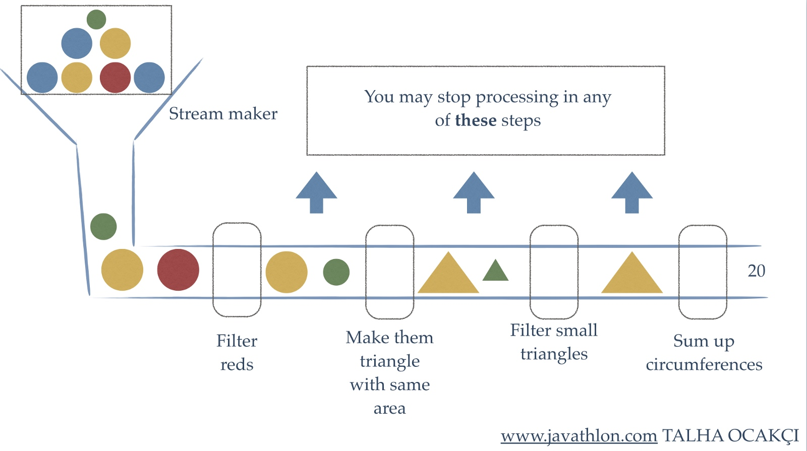
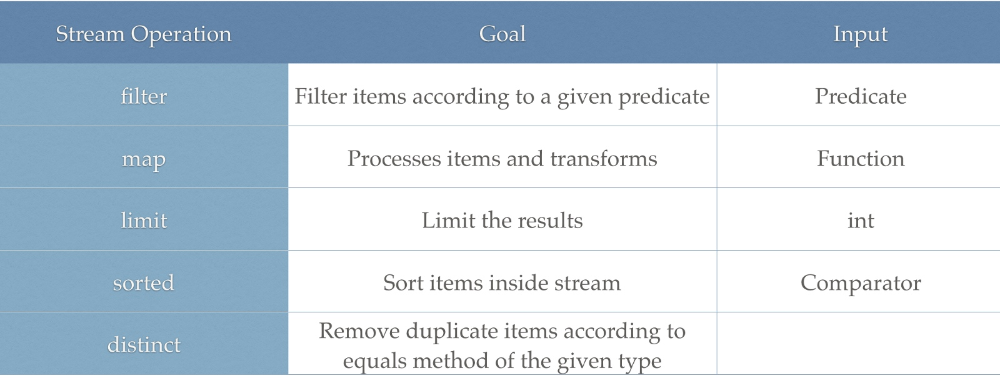
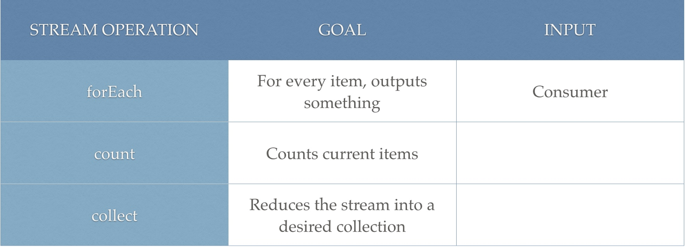
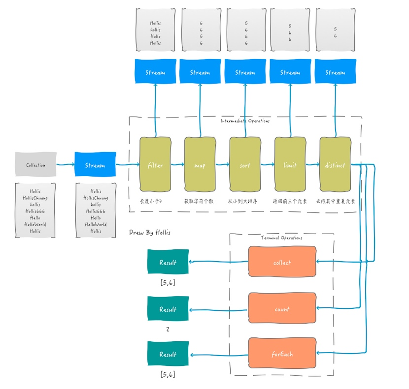

# 20 函数式编程

## 20.1  Lambda表达式

### 20.1.1 通过接口传递代码

**接口常被用于传递代码**

`public File[] listFiles(FilenameFilter filter)`,listFiles需要的其实不是FilenameFilter对象，而是它包含的如下方法：`boolean accept(File dir,String name);`或者说，listFiles希望接受**一段方法代码作为参数**，但没有办法直接传递这个方法代码本身，只能传递一个接口。

通过接口传递行为代码，就要传递一个实现了该接口的实例对象，最简洁的方式是使用匿名内部类，比如：

```java
//列出当前目录下的所有扩展名为.txt的文件
File f=new File(".")；
File[] files=f.listFiles(new FilenameFilter){
	@Override
	public boolean accept(File dir,String name){
		if(name.endsWith(".txt")){
			return true;
        }
		return false;
	}
});
```

### 20.1.2 Lambda语法

Lambda表达式由`->`分隔为两部分，前面是方法的参数，后面`{}`内是方法的代码。

```java
//列出当前目录下的所有扩展名为.txt的文件
File f=new File(".");
File[] files=f.listFiles((File dir,String name)->
{
		if(name.endsWith(".txt")){
			return true;
        }
		return false;
});

//简化
File[] files=f.listFiles((File dir,String name)->{
		return name.endsWith(".txt"));
});                        
```

当主体代码只有一条语句的时候，括号和return语句也可以省略:

`File[] files=f.listFiles((File dir,String name) -> name.endsWith(".txt"));   `

> 没有括号的时候，主体代码是一个表达式，这个表达式的值就是函数的返回值，结尾不能加分号，也不能加return语句。

当参数只有一个的时候，参数部分的括号可以省略

> Lambda表达式也可以访问定义在主体代码外部的变量，但对于局部变量，它也只能访问final类型的变量，与匿名内部类的区别是，它不要求变量声明为final，但变量事实上不能被重新赋值
>
> 这个原因与匿名内部类是一样的，Java会将msg的值作为参数传递给Lambda表达式，为Lambda表达式建立一个副本，它的代码访问的是这个副本，而不是外部声明的msg变量。如果允许msg被修改，则程序员可能会误以为Lambda表达式读到修改后的值，引起更多的混淆。
>
> 为什么非要建立副本，直接访问外部的msg变量不行吗？不行，因为msg定义在栈中，当Lambda表达式被执行的时候，msg可能早已被释放了。如果希望能够修改值，可以将变量定义为实例变量，或者将变量定义为数组

Java会为每个匿名内部类生成一个类，但Lambda表达式不会。

### 20.1.3 函数式接口

Java 8引入了函数式接口的概念，函数式接口也是接口，但只能有一个抽象方法


### 20.1.4 方法引用

Lambda表达式经常用于调用对象的某个方法，比如

`List<String> names =map(students, t -> t.getName()) `

`List<String> names =map(students, student::getName) `

`Student::getName`这种写法是Java 8引入的一种新语法，称为方法引用。它是Lambda表达式的一种简写方法，由：：分隔为两部分，**前面是类名或变量名，后面是方法名**。方法可以是实例方法，也可以是静态方法，但含义不同。

## 20.2 stream API

在Java中，集合和数组是我们经常会用到的数据结构，需要经常对他们做增、删、改、查、聚合、统计、过滤等操作。相比之下，关系型数据库中也同样有这些操作，但是在Java 8之前，集合和数组的处理并不是很便捷。

不过，这一问题在Java 8中得到了改善，Java 8 API添加了一个新的抽象称为流Stream，可以让你**以一种声明的方式处理数据。**

### Stream介绍

Stream 使用一种类似用 SQL 语句从数据库查询数据的直观方式来提供一种对 Java 集合运算和表达的高阶抽象。

Stream API可以极大提高Java程序员的生产力，让程序员写出高效率、干净、简洁的代码。

这种风格将要处理的元素集合看作一种流，流在管道中传输，并且可以在管道的节点上进行处理，比如筛选，排序，聚合等。

Stream有以下特性及优点：

- 无存储。Stream不是一种数据结构，它只是某种数据源的一个视图，数据源可以是一个数组，Java容器或I/O channel等。
- 为函数式编程而生。对Stream的任何修改都不会修改背后的数据源，比如对Stream执行过滤操作并不会删除被过滤的元素，而是会产生一个不包含被过滤元素的新Stream。
- 惰式执行。Stream上的操作并不会立即执行，只有等到用户真正需要结果的时候才会执行。
- 可消费性。Stream只能被“消费”一次，一旦遍历过就会失效，就像容器的迭代器那样，想要再次遍历必须重新生成。

我们举一个例子，来看一下到底Stream可以做什么事情：



上面的例子中，获取一些带颜色塑料球作为数据源，首先过滤掉红色的、把它们融化成随机的三角形。再过滤器并删除小的三角形。最后计算出剩余图形的周长。

如上图，对于流的处理，主要有三种关键性操作：**分别是流的创建、中间操作（intermediate operation）以及最终操作(terminal operation)。**

### [Stream的创建](http://hollischuang.gitee.io/tobetopjavaer/#/basics/java-basic/stream?id=stream的创建)

在Java 8中，可以有多种方法来创建流。

**1、通过已有的集合来创建流**

在Java 8中，除了增加了很多Stream相关的类以外，还对集合类自身做了增强，在其中增加了`stream`方法，可以将一个集合类转换成流。

```
List<String> strings = Arrays.asList("Hollis", "HollisChuang", "hollis", "Hello", "HelloWorld", "Hollis");
Stream<String> stream = strings.stream();
```

以上，通过一个已有的List创建一个流。除此以外，还有一个`parallelStream`方法，可以为集合创建一个并行流。

这种通过集合创建出一个Stream的方式也是比较常用的一种方式。

**2、通过Stream创建流**

可以使用Stream类提供的方法，直接返回一个由指定元素组成的流。

```
Stream<String> stream = Stream.of("Hollis", "HollisChuang", "hollis", "Hello", "HelloWorld", "Hollis");
```

如以上代码，直接通过of方法，创建并返回一个Stream。

### [Stream中间操作](http://hollischuang.gitee.io/tobetopjavaer/#/basics/java-basic/stream?id=stream中间操作)

Stream有很多中间操作，多个中间操作可以连接起来形成一个流水线，每一个中间操作就像流水线上的一个工人，每人工人都可以对流进行加工，加工后得到的结果还是一个流。



以下是常用的中间操作列表:



**filter**

filter 方法用于通过设置的条件过滤出元素。以下代码片段使用 filter 方法过滤掉空字符串：

```
List<String> strings = Arrays.asList("Hollis", "", "HollisChuang", "H", "hollis");
strings.stream().filter(string -> !string.isEmpty()).forEach(System.out::println);
//Hollis, , HollisChuang, H, hollis
```

**map**

map 方法用于映射每个元素到对应的结果，以下代码片段使用 map 输出了元素对应的平方数：

```
List<Integer> numbers = Arrays.asList(3, 2, 2, 3, 7, 3, 5);
numbers.stream().map( i -> i*i).forEach(System.out::println);
//9,4,4,9,49,9,25`
```

**limit/skip**

limit 返回 Stream 的前面 n 个元素；skip 则是扔掉前 n 个元素。以下代码片段使用 limit 方法保理4个元素：

```
List<Integer> numbers = Arrays.asList(3, 2, 2, 3, 7, 3, 5);
numbers.stream().limit(4).forEach(System.out::println);
//3,2,2,3`
```

**sorted**

sorted 方法用于对流进行排序。以下代码片段使用 sorted 方法进行排序：

```
List<Integer> numbers = Arrays.asList(3, 2, 2, 3, 7, 3, 5);
numbers.stream().sorted().forEach(System.out::println);
//2,2,3,3,3,5,7`
```

**distinct**

distinct主要用来去重，以下代码片段使用 distinct 对元素进行去重：

```
List<Integer> numbers = Arrays.asList(3, 2, 2, 3, 7, 3, 5);
numbers.stream().distinct().forEach(System.out::println);
//3,2,7,5`
```

接下来我们通过一个例子和一张图，来演示下，当一个Stream先后通过filter、map、sort、limit以及distinct处理后会发生什么。

代码如下：

```
List<String> strings = Arrays.asList("Hollis", "HollisChuang", "hollis", "Hello", "HelloWorld", "Hollis");
Stream s = strings.stream().filter(string -> string.length()<= 6).map(String::length).sorted().limit(3)
            .distinct();
```

过程及每一步得到的结果如下图：



### [Stream最终操作](http://hollischuang.gitee.io/tobetopjavaer/#/basics/java-basic/stream?id=stream最终操作)

Stream的中间操作得到的结果还是一个Stream，那么如何把一个Stream转换成我们需要的类型呢？比如计算出流中元素的个数、将流装换成集合等。这就需要最终操作（terminal operation）

最终操作会消耗流，产生一个最终结果。也就是说，在最终操作之后，不能再次使用流，也不能在使用任何中间操作，否则将抛出异常：

```
java.lang.IllegalStateException: stream has already been operated upon or closed
```

常用的最终操作如下图：



**forEach**

Stream 提供了方法 'forEach' 来迭代流中的每个数据。以下代码片段使用 forEach 输出了10个随机数：

```
Random random = new Random();
random.ints().limit(10).forEach(System.out::println);
```

**count**

count用来统计流中的元素个数。

```
List<String> strings = Arrays.asList("Hollis", "HollisChuang", "hollis","Hollis666", "Hello", "HelloWorld", "Hollis");
System.out.println(strings.stream().count());
//7
```

**collect**

collect就是一个归约操作，可以接受各种做法作为参数，将流中的元素累积成一个汇总结果：

```
List<String> strings = Arrays.asList("Hollis", "HollisChuang", "hollis","Hollis666", "Hello", "HelloWorld", "Hollis");
strings  = strings.stream().filter(string -> string.startsWith("Hollis")).collect(Collectors.toList());
System.out.println(strings);
//Hollis, HollisChuang, Hollis666, Hollis
```

接下来，我们还是使用一张图，来演示下，前文的例子中，当一个Stream先后通过filter、map、sort、limit以及distinct处理后会，在分别使用不同的最终操作可以得到怎样的结果：

下图，展示了文中介绍的所有操作的位置、输入、输出以及使用一个案例展示了其结果。 

