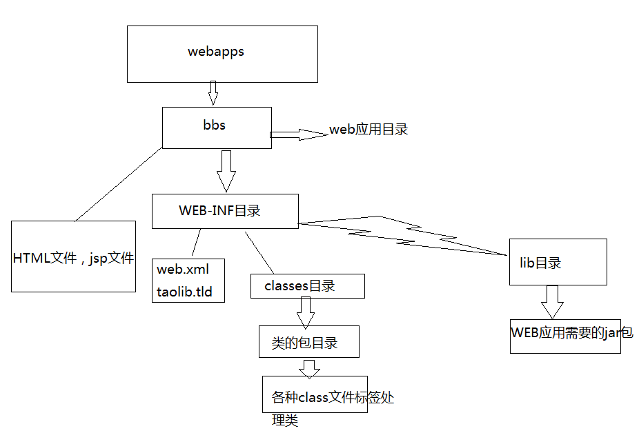

# Tomcat

Tomcat简单的说就是一个运行JAVA的网络服务器，底层是Socket的一个程序，它也是JSP和Serlvet的一个容器。

## 为什么我们需要用到Tomcat

如果你学过html，css，你会知道你写的页面只能自己访问，**别人不能远程访问你写的页面**，Tomcat就是**提供能够让别人访问自己写的页面的一个程序**


## tomcat结构目录


1. bin：启动和关闭tomcat的bat文件

2. conf：配置文件

3. - `server.xml`该文件用于配置server相关的信息，比如tomcat启动的端口号，配置主机(Host)
   - `web.xml`文件配置与web应用（web应用相当于一个web站点）
   - `tomcat-user.xml`配置用户名密码和相关权限.

4. lib：该目录放置运行tomcat运行需要的jar包

5. logs：存放日志，当我们需要查看日志的时候，可以查询信息

6. webapps：放置我们的web应用

7. work工作目录：该目录用于存放**jsp被访问后生成对应的server文件和.class文件**

### webapps目录的详细说明

**在webapps中建立了bbs目录**，下面放置我们的html文件，jsp文件，图片等等，**则web1就被当做web应用管理起来**【tomcat6.0以后的版本才支持】



## 设置虚拟主机

### 什么是虚拟主机？

**多个不同域名的网站共存于一个Tomcat中**

### 为什么需要用到虚拟主机？

例子：我现在开发了4个网站，有4个域名。如果我不配置虚拟主机，一个Tomcat服务器运行一个网站，我就需要4台电脑才能把4个网站运行起来。

### 配置虚拟主机的步骤

- 在tomcat的server.xml文件中添加主机名

- ```xml
  <Host name="zhongfucheng"appBase="D:\\web1">
  	<Context path="/web1" docBase="D:\\web1"/>
  </Host>
  ```

- 访问虚拟主机下的web站`zhongfucheng:8080/web1/1.html`

## Tomcat体系结构


------

## 浏览器访问WEB资源的流程图

