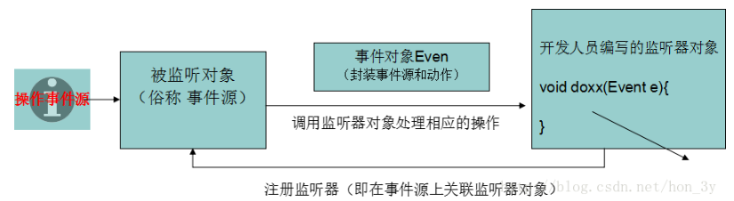

# Listener

监听器就是一个**实现特定接口的普通java程序**，这个程序专门用于**监听另一个java对象的方法调用或属性改变**，当被监听对象发生上述事件后，监听器某个方法将立即被执行。

## 监听器组件

监听器涉及三个组件：**事件源，事件对象，事件监听器**

**当事件源发生某个动作的时候，它会调用事件监听器的方法，并在调用事件监听器方法的时候把事件对象传递进去。**

**我们在监听器中就可以通过事件对象获取得到事件源，从而对事件源进行操作！**



## Servlet监听器

在Servlet规范中定义了多种类型的监听器，它们**用于监听的事件源分别**：**ServletContext、HttpSession、ServletRequest**,即**三大域对象**。

- 监听域对象“创建”与“销毁”的监听器；
- 监听域对象“操作域属性”的监听器；
- 监听HttpSession的监听器。

和其它事件监听器略有不同的是，**servlet监听器的注册不是直接注册在事件源上，而是由WEB容器负责注册**，开发人员**只需在web.xml文件中使用`<listener>`标签配置好监听器**，

## 创建与销毁监听器
创建与销毁监听器一共有三个：

- `ServletContextListener`:**Tomcat启动和关闭时调用下面两个方法(可以获取web.xml里面的参数配置)**
  - public void contextlnitialized(ServletContextEvent evt):ServletContext对象被创建后调用：
  - public void contextDestroyed(ServletContextEvent evt):ServletContext对象被销毁前调用；
- `HttpSessionListener`:**开始会话和结束会话时调用下面两个方法(可以用来收集在线者信息)**
  - public void sessionCreated(HttpSessionEvent evt):HttpSession 对象被创建后调用；
  - public void sessionDestroyed(HttpSessionEvent evt):HttpSession对象被销毁前调用：
- `ServletRequestListener`:**开始请求和结束请求时调用下面两个方法**
  - public void requestinitiallized(ServletRequestEvent evt):ServletRequest 对象被创建后调用
  - public yoid requestDestroyed(ServletRequestEvent evt):ServletRequest 对象被销毁前调用。

### 事件对象

1. ServletContextEvent:ServletContext getServletContext()；
2. HttpSessionEvent:HttpSession getSession()；
3. ServletRequestEvent:
   1. ServletRequest getServletRequest()
   2. ServletContext getServletContext()

## 操作域属性的监听器
当对域属性进行增、删、改时，执行的监听器一共有三个：

- ServletContextAttributelistener:**在ServletContext域进行增、删、改属性时调用下面方法**。
  - public void attributeAdded(ServletContextAttributeEvent evt)
  - public void attributeRemoved(ServletContextAttributeEvent evt)
  - public void attributeReplaced(ServletContextAttributeEvent evt)
- HttpSessionAttributeListener:**在HttpSession域进行增、删、改属性时调用下面方法**
  - public void attributeAdded(HttpSessionBindingEvent evt)
  - public void attributeRemoved(HttpSessionBindingEvent evt)
  - public void attributeReplaced(HttpSessionBindingEvent evt)
- ServletRequestAttributeListener:**在ServletRequest域进行增、删、改属性时调用下面方法**
  - public void attributeAdded(ServletRequestAttributeEvent evt)
  - public void attributeRemoved(ServletRequestAttributeEvent evt)
  - public void attributeReplaced(ServletRequestAttributeEvent evt)

下面对这三个监听器的**事件对象**功能进行介绍：

- ServletContextAttributeEvent
  - String getName（)：获取当前操作的属性名；
  - Object getValue（):获取当前操作的属性值；
  - ServletContext getServletContext():获取 ServletContext对象。
- HttpSessionBindingEvent
  - String getName（):获取当前操作的属性名；
  - Object getValue():获取当前操作的属性值；
  - HttpSession getsession():获取当前操作的 session对象。
- ServletRequestAttributeEvent
  - String getName（):获取当前操作的属性名；
  - object getValue（):获取当前操作的属性值；
  - ServletContext getServletContext():获取ServletContext对象；
  - ServletRequest getServletRequest():获取当前操作的ServletRequest对象。

如果是替换，那么getValue返回的是原值；如果想拿到新值，那么去对应的域对象中取。

## HttpSession的监听器

还有两个与HttpSession相关的特殊的监听器，这两个监听器的特点如下：

- 不用在web.xml文件中部署
- 这两个监听器不是给session添加，而是给Bean添加。即**让Bean 类实现监听器接口，然后再把Bean 对象添加到session域中**。(首先实现接口的类，然后把类对象设置成session的属性中)

下面对这两个监听器介绍一下：

`HttpSessionBindinglistener`:当某个类实现了该接口后，可以感知本类对象添加到session中，以及感知从session中移除。例如让Person类实现HttpSessionBindingListener接口，那么当把Person 对象添加到session中，或者把Person对象从session中移除时会调用下面两个方法：

- public void valueBound(HttpSessionBindingEvent event):当把监听器对象添加到session中会调用监听器对象的本方法；
- public void valueUnbound(HttpSessionBindingEvent event):当把监听器对象从session中移除时会调用监听器对象的本方法；

这里要注意，HttpSessionBindinglistener监听器的使用与前面介绍的都不相同，当该监听器对象添加到session中，或把该监听器对象从session移除时会调用监听器中的方法。并且无需在web.xml文件中部署这个监听器。

---

**Session 有一种重生的性质。**

> 在服务器开启时保存了session，然后当服务器被关闭时，会在硬盘上保存一个session属性的序列化文件。启动服务器时会重新将该序列化文件读入内存，并删除该文件。

META-INF下的context.xml文件中进行一些配置可以取消保存session序列化文件的操作。

```xml
<Context>
  <Manager className="org.apache.catalina.session.PersistentManager" maxIdleSwap="1">
  <Store className="org.apache.catalina.session.FileStore" directory="zhongfucheng"/>
  </Manager>
</Context>
```

`HttpSessionActivationListener`:Tomcat 会在session 不被使用时钝化 session对象，所谓**饨化session，就是把 session通过序列化的方式保存到硬盘文件中**。当用户再使用session时，Tomcat 还会把钝化的对象再活化 session，所谓**活化就是把硬盘文件中的 session在反序列化回内存**。当session被Tomcat钝化时，session中存储的对象也被钝化，当 session被活化时，也会把session中存储的对象活化。如果某个类实现了
HttpSessionActivationListener 接口后，当对象随着 session被钝化和活化时，下面两个方法就会被调用：

- public void sessionWillPassivate(HttpSessionEvent se):当对象感知被活化时调用本方法；
- public void sessionDidActivate(HttpSessionEvent se):当对象感知被钝化时调用本方法；

HttpSessionActivationListener 监听器与HttpSessionBindingListener监听器相似，都是感知型的监听器，例如让Person 类实现了HttpSessionActivationListener 监听器接口，并把 Person对象添加到了session中后，当Tomcat钝化session时，同时也会钝化session中的Person对象，这时Person对象就会感知到自己被钝化了，其实就是调用Person对象的sessionWillPassivate（)方法。当用户再次使用session时，Tomcat会活化session，这时Person会感知到自己被活化，其实就是调用Person对象的 sessionDidActivatel）方法。

注意**JavaBean 同时需要实现Serializable接口**。

注意，因为钝化和活化session，其实就是使用序列化和反序列化技术把 session从内存保存到硬盘，和把session从硬盘加载到内存。这说明如果Person类没有实现Serializable接口，那么当session钝化时就不会钝化Person，而是把Person从session中移除再钝化！这也说明session活化后，session中就不再有Person对象了。

## 模拟监听器

监听器涉及三个组件：事件源，事件对象，事件监听器。

### 事件监听器

监听器定义为接口，**监听的方法需要事件对象传递进来，从而在监听器上通过事件对象获取得到事件源，对事件源进行修改**！

```Java
  /**
   * 事件监听器：监听Person事件源的eat和sleep方法
   */
  interface PersonListener{  
      void doEat(Event event);
      void doSleep(Event event);
  }
```

### 事件源

事件源是一个Person类，它有eat和sleep()方法。

**事件源需要注册监听器(即在事件源上关联监听器对象)**

如果**触发了eat或sleep()方法的时候，会调用监听器的方法，并将事件对象传递进去**

```java

  /**
   * 事件源Person：事件源要提供方法注册监听器(即在事件源上关联监听器对象)
   */  
  class Person {  
      //在成员变量定义一个监听器对象
      private PersonListener personListener ;      
      //在事件源中定义两个方法
      public void Eat() {          
          //当事件源调用了Eat方法时，应该触发监听器的方法，调用监听器的方法并把事件对象传递进去
          personListener.doEat(new Event(this));
      }  
      public void sleep() {  
          //当事件源调用了Eat方法时，应该触发监听器的方法，调用监听器的方法并把事件对象传递进去
          personListener.doSleep(new Event(this));
      }  
      //注册监听器，该类没有监听器对象啊，那么就传递进来吧。
      public void registerLister(PersonListener personListener) {
          this.personListener = personListener;
      }  
  }
```

### 事件对象

**事件对象封装了事件源。监听器可以从事件对象上获取得到事件源的对象(信息)**

```Java
 /**
   * 事件对象Even
   * 事件对象封装了事件源
   * 在监听器上能够通过事件对象获取得到事件源
   */
  class Event{
      private Person person;  
      public Event() {
      } 
      public Event(Person person) {
          this.person = person;
      }  
      public Person getResource() {
          return person;
      }  
  }
```

测试

```Java
    public static void main(String[] args) {
        Person person = new Person();
        //注册监听器()
        person.registerLister(new PersonListener() {
            @Override
            public void doEat(Event event) {
                Person person1 = event.getResource();
                System.out.println(person1 + "正在吃饭呢！");
            }
            @Override
            public void doSleep(Event event) {
                Person person1 = event.getResource();
                System.out.println(person1 + "正在睡觉呢！");
            }
        });
        //当调用eat方法时，触发事件，将事件对象传递给监听器，最后监听器获得事件源，对事件源进行操作
        person.Eat();
    }

```

- 事件源：拥有事件
- 监听器：监听事件源所拥有的事件（带事件对象参数的）
- 事件对象：事件对象封装了事件源对象
  - **事件源要与监听器有关系，就得注册监听器【提供方法得到监听器对象】**
  - **触发事件源的事件，实际会提交给监听器对象处理，并且把事件对象传递过去给监听器**。

## 监听器应用

### 1. 统计网站在线人数

ps:这个可以使用WebSocket来做，但这里讲解的是监听器，所以这里以监听器来举例子。

 我们在网站中一般使用Session来标识某用户是否登陆了，如果登陆了，就在Session域中保存相对应的属性。如果没有登陆，那么Session的属性就应该为空。

现在，我们想要统计的是网站的在线人数。我们应该这样做：**我们监听是否有新的Session创建了，如果新创建了Sesssion，那么在线人数就应该+1。这个在线人数是整个站点的，所以应该有Context对象保存。**

大致思路：

- 监听Session是否被创建了
- 如果Session被创建了，那么在Context的域对象的值就应该+1
- 如果Session从内存中移除了，那么在Context的域对象的值就应该-1.

监听器代码：

```Java
  public class CountOnline implements HttpSessionListener {  
      public void sessionCreated(HttpSessionEvent se) {  
          //获取得到Context对象，使用Context域对象保存用户在线的个数
          ServletContext context = se.getSession().getServletContext();          
          //直接判断Context对象是否存在这个域，如果存在就人数+1,如果不存在，那么就将属性设置到Context域中
          Integer num = (Integer) context.getAttribute("num");         
          if (num == null) {
              context.setAttribute("num", 1);
          } else {
              num++;
              context.setAttribute("num", num);
          }
      }
      public void sessionDestroyed(HttpSessionEvent se) {  
          ServletContext context = se.getSession().getServletContext();
          Integer num = (Integer) se.getSession().getAttribute("num");  
          if (num == null) {
              context.setAttribute("num", 1);
          } else {
              num--;
              context.setAttribute("num", num);
          }
      }
  }

```

显示页面代码：

```
在线人数：${num}
```

我们每使用一个浏览器访问服务器，都会新创建一个Session。那么网站的在线人数就会+1。

使用同一个页面刷新，还是使用的是那个Sesssion，所以网站的在线人数是不会变的。

### 2.自定义Session扫描器

我们都知道Session是保存在内存中的，如果Session过多，服务器的压力就会非常大。

但是呢，**Session的默认失效时间是30分钟(30分钟没人用才会失效)，这造成Seesion可能会过多（没人用也存在内存中，这不是明显浪费吗？）**

当然啦，我们可以**在web.xml文件中配置Session的生命周期**。但是呢，**这是由服务器来做的，我嫌它的时间不够准确。**（有时候我配置了3分钟，它用4分钟才帮我移除掉Session）

所以，我决定自己**用程序手工移除那些长时间没人用的Session。**

#### 2.1 分析

要想移除长时间没人用的Session，肯定要先拿到全部的Session啦。所以我们**使用一个容器来装载站点所有的Session**。。

只要**Sesssion一创建了，就把Session添加到容器里边**。毫无疑问的，我们需要监听Session了。

接着，我们要做的就是**隔一段时间就去扫描一下全部Session，如果有Session长时间没使用了，我们就把它从内存中移除。隔一段时间去做某事，这肯定是定时器的任务呀。**

**定时器应该在服务器一启动的时候，就应该被创建了。因此还需要监听Context**

最后，我们还要考虑到并发的问题，如果有人同时访问站点，那么**监听Session创建的方法就会被并发访问了**。**定时器扫描容器的时候，可能是获取不到所有的Session的**。

**这需要我们做同步**

于是乎，我们已经有大致的思路了

- **监听Session和Context的创建**
- **使用一个容器来装载Session**
- **定时去扫描Session，如果它长时间没有使用到了，就把该Session从内存中移除。**
- **并发访问的问题**

监听器代码：

```Java
  public class Listener1 implements ServletContextListener, HttpSessionListener {  
      //服务器一启动，就应该创建容器。我们使用的是LinkList(涉及到增删)。容器也应该是线程安全的。
      List<HttpSession> list = Collections.synchronizedList(new LinkedList<HttpSession>());
      //定义一把锁（Session添加到容器和扫描容器这两个操作应该同步起来）
      private Object lock = 1;
      public void contextInitialized(ServletContextEvent sce) {  
          Timer timer = new Timer();
          //执行我想要的任务，0秒延时，每10秒执行一次
          timer.schedule(new MyTask(list, lock), 0, 10 * 1000);  
      }
      
      public void sessionCreated(HttpSessionEvent se) {  
          //只要Session一创建了，就应该添加到容器中
          synchronized (lock) {
              list.add(se.getSession());
          }
          System.out.println("Session被创建啦");  
      }
  
      public void sessionDestroyed(HttpSessionEvent se) {
          System.out.println("Session被销毁啦。");
      }
      public void contextDestroyed(ServletContextEvent sce) {  
      }
  }
```

任务代码：

```java
 /*
  * 在任务中应该扫描容器，容器在监听器上，只能传递进来了。
  * 要想得到在监听器上的锁，也只能是传递进来
  * */
  class MyTask extends TimerTask {  
      private List<HttpSession> sessions;
      private Object lock;  
      public MyTask(List<HttpSession> sessions, Object lock) {
          this.sessions = sessions;
          this.lock = lock;
      }  
      @Override
      public void run() {  
          synchronized (lock) {
              //遍历容器
              for (HttpSession session : sessions) {  
                  //只要15秒没人使用，我就移除它啦
                  if (System.currentTimeMillis() - session.getLastAccessedTime() > (1000 * 15)) {
                      session.invalidate();
                      sessions.remove(session);
                  }
  
              }
          }
      }
  }

```

**15秒如果Session没有活跃，那么就被删除！**

### 3. 踢人小案列

列出所有的在线用户，后台管理者拥有踢人的权利，点击踢人的超链接，该用户就被注销了。

#### 3.1 分析

首先，怎么能列出所有的在线用户呢？？一般我们在线用户都是用Session来标记的**，所有的在线用户就应该用一个容器来装载所有的Session。。**

我们监听Session的是否有属性添加(**监听Session的属性有添加、修改、删除三个方法。如果监听到Session添加了，那么这个肯定是个在线用户！**)。

**装载Session的容器应该是在Context里边的【属于全站点】，并且容器应该使用Map集合【待会还要通过用户的名字来把用户踢了】**

思路：

- 写监听器，监听是否有属性添加在Session里边了。
- 写简单的登陆页面。
- 列出所有的在线用户
- 实现踢人功能(也就是摧毁Session)

监听器

```java
public class KickPerson implements HttpSessionAttributeListener {
    // Public constructor is required by servlet spec
    public KickPerson() {
    }
    public void attributeAdded(HttpSessionBindingEvent sbe) {
        //得到context对象，看看context对象是否有容器装载Session
        ServletContext context = sbe.getSession().getServletContext();
        //如果没有，就创建一个呗
        Map map = (Map) context.getAttribute("map");
        if (map == null) {
            map = new HashMap();
            context.setAttribute("map", map);
        }
//-----------------------------------------------------------------------------------       
        //得到Session属性的值
        Object o = sbe.getValue();
        //判断属性的内容是否是User对象
        if (o instanceof User) {
            User user = (User) o;
            map.put(user.getUsername(), sbe.getSession());
        }
    }
    public void attributeRemoved(HttpSessionBindingEvent sbe) {
      /* This method is called when an attribute
         is removed from a session.
      */
    }

    public void attributeReplaced(HttpSessionBindingEvent sbe) {
      /* This method is invoked when an attibute
         is replaced in a session.
      */
    }
}

```

登陆页面

```xml
<form action="${pageContext.request.contextPath }/LoginServlet" method="post">
    用户名：<input type="text" name="username">
    <input type="submit" value="登陆">
</form>
```

处理登陆Servlet

```java
        //得到传递过来的数据
        String username = request.getParameter("username");
        User user = new User();
        user.setUsername(username);
        //标记该用户登陆了！
        request.getSession().setAttribute("user", user);
        //提供界面，告诉用户登陆是否成功
        request.setAttribute("message", "恭喜你，登陆成功了！");
        request.getRequestDispatcher("/message.jsp").forward(request, response);
```

列出在线用户

```
<c:forEach items="${map}" var="me">
    ${me.key} <a href="${pageContext.request.contextPath}/KickPersonServlet?username=${me.key}">踢了他吧</a>
	<br>
</c:forEach>
```

处理踢人的Servlet

```java
        String username = request.getParameter("username");
        //得到装载所有的Session的容器
        Map map = (Map) this.getServletContext().getAttribute("map");
        //通过名字得到Session
        HttpSession httpSession = (HttpSession) map.get(username);
        httpSession.invalidate();
        map.remove(username);
        //摧毁完Session后，返回列出在线用户页面
        request.getRequestDispatcher("/listUser.jsp").forward(request, response);
```