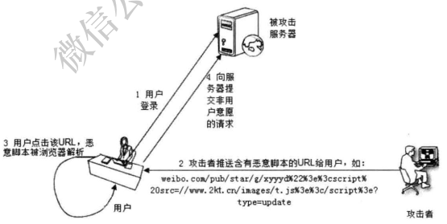
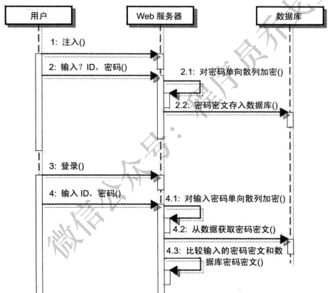
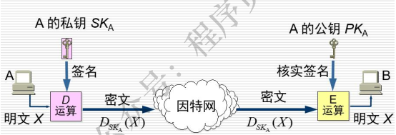
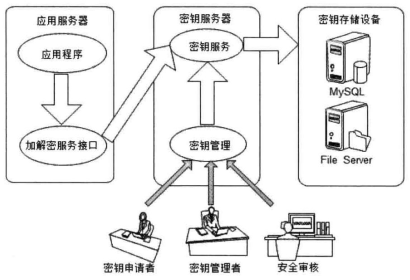

# 安全

## XSS攻击
### 原理

**跨站脚本攻击（Cross-Site Scripting.XSS）**：主要是指在用户浏览器内运行了JavaScript脚本。比如富文本编辑器，如果不过滤用户输入的数据直接显示用户输入的HTML内容的话，就会有可能运行恶意的JavaScript 脚本，导致页面结构错乱，Cookies信息被窃取等问题。

XSS的原理是恶意攻击者往Web页面里插入恶意可执行网页脚本代码，当用户浏览该页之时，嵌入其中Web里面的脚本代码会被执行，从而可以达到攻击者盗取用户信息或其他侵犯用户安全隐私的目的。

常见的XSS攻击类型有两种，一种是反射型，一种是持久型。

#### 反射型

攻击者诱使用户点击一个嵌入恶意脚本的链接，达到工具的目的。

比如新浪微博中，攻击者发布的微博中含有一个恶意脚本的URL（URL中包含脚本的链接），用户点击该URL，脚本会自动关注攻击者的新浪微博ID，发布含有恶意脚本URL的微博，攻击就被扩散了。

现实中，攻击者可以采用XSs攻击，偷取用户Cookie、密码等重要数据，进而伪造交易、盗窃用户财产、窃取情报。

#### 持久型

黑客提交含有恶意脚本的请求， 保存在被攻击的 Web 站点的数据库中， 用户浏览网页时，恶意脚本被包含在正常页面中， 达到攻击的目的。 此种攻击经常使用在论坛、 博客等 Web应用中。  

### 预防
Web页面渲染的所有内容或者渲染的数据都必须来自于服务端。

- 后端在入库前应该选择不相信任何前端数据，将所有的字段统一进行转义处理。
- 后端在输出给前端数据统一进行转义处理。

前端在渲染页面DOM的时候应该选择不相信任何后端数据，任何字段都需要做转义处理。

#### 消毒

XSS攻击者一般都是在请求中嵌入恶意脚本达到攻击的目的，这些脚本是一般在用户输入中不常用的，如果进行过滤和消毒处理，即对某些HTML危险字符转义，如”>”转义为“&gt；\"，就可以防止大部分的攻击。为了避免对不必要的内容错误转义，如“3<5”中的”<”需要进行文本匹配后再转义，如”可以用公钥加密， 私钥解密； 也可以用私钥加密、 公钥解密。  

## 消息摘要/单向散列
单向散列函数也称为消息摘要函数（message digest function)，哈希函数，适用于检查消息完整性的加密技术。

单向散列函数有一个输入和一个输出，其中输入称为信息，输出称为散列值。单向散列函数可以根据消息的内容计算出散列值，篡改后的信息的散列值计算结果会不一样，所以散列值可以被用来检查消息的完整性。

常见消息摘要技术：**MD5、SHA-1、SHA-256**

CRC、MD5、SHA1都是通过对数据进行计算，来生成一个校验值，该校验值用来校验数据的完整性。

不同点：

1. 算法不同。CRC采用多项式除法，MD5和SHA1使用的是替换、轮转等方法；
2. 校验值的长度不同。CRC校验位的长度跟其多项式有关系，一般为16位或32位；MD5是16个字节（128位）；SHA1是20个字节（160位）；
3. 校验值的称呼不同。CRC一般叫做CRC值；MD5和SHA1一般叫做哈希值（Hash)或散列值；
4. 安全性不同。这里的安全性是指检错的能力，即数据的错误能通过校验位检测出来。CRC的安全性跟多项式有很大关系，相对于MD5和SHA1要弱很多；MD5的安全性很高，不过大概在04年的时候被山东大学的王小云破解了；SHA1的安全性最高（现在SHA-256安全性比较高）。
5. 效率不同，CRC的计算效率很高；MD5和SHA1比较慢。
6. 用途不同。CRC一般用作通信数据的校验；MD5和SHA1用于安全（Security)领域，比如文件校验、数字签名等。

### 密码

单向散列加密：

利用单向散列加密的特性， 可以进行密码加密保存， 即用户注册时输入的密码不直接保存到数据库， 而是对密码进行单向散列加密， 将密文存入数据库， 用户登录时， 进行密码验证，同样计算得到输入密码的密文， 并和数据库中的密文比较， 如果一致， 则密码验证成功  

这样保存在**数据库中的是用户输入的密码的密文， 而且不可逆地计算得到密码的明文**， 因此即使数据库被拖库（指网站遭到入侵后， 黑客窃取其数据库） ， 也不会泄露用户的密码信息。

虽然不能通过算法将单向散列密文反算得到明文， 但是由于人们设置密码具有一定的模式吗，因此通过彩虹表（建立一个 源数据与加密数据之间对应的 hash 表。 这样在获得加密数据后通过比较， 查询或者一定的运算， 可以快速定位源数据） 等手段可以进行猜测式破解。

为了加强单向散列计算的安全性， 还会给散列算法加点盐， **salt 相当于加密的密钥， 增加破解的难度**。 **盐一般都是跟 hash 一起保存在数据库里， 或者作为 hash 字符串的一部分**。 salt是由系统随机生成的， 并且只有系统知道。 这样， 即便两个用户使用了同一个密码， 由于系统为它们生成的 salt 值不同， 他们的散列值也是不同的。  

### 算法介绍

sha 比md5更安全一些，sha比md5哈希碰撞的概率更小一些。

到目前为止，我们已经了解如何为密码生成安全的Hash值以及通过利用salt 来加强它的安全性。但今天的问题是，硬件的速度已经远远超过任何使用字典或彩虹表进行的暴力攻击，并且任何密码都能被破解，只是使用时间多少的问题。

为了解决这个问题，主要想法是尽可能降低暴力攻击速度来保证最小化的损失。我们下一个算法同样是基于这个概念。目标是使Hash函数足够慢以妨碍攻击，并对用户来说仍然非常快且不会感到有明显的延时。

要达到这个目的通常是使用某些CPU密集型算法来实现，比如PBKDF2，Bcrypt或Scrypt。这些算法采用work factor（也称之为security factor)或迭代次数作为参数来确定|Hash 函数将变的有多慢，并且随着日后计算能力的提高，可以逐步增大work factor来使之与计算能力达到平衡。bcrypt是单向的，而且经过salt和cost的处理，使其受rainbow攻击破解的概率大大降低，同时破解的难度也提升不少。入因为bcrypt 采用了一系列各种不同的Blowfish 加密算法，并引入了一个work factor，这个工作因子可以让你决定这个算法的代价有多大。因为这些，这个算法不会因为计算机CPU处理速度变快了，而导致算法的时间会缩短了。因为，你可以增加work factor 来把其性能降下来。

### 数字签名

别人不能冒充我的签名（不可伪造），我也不能否认上面的签名是我的（不可抵赖）。

数字签名又是靠什么保证不可伪造和不可抵赖两个特性呢？答案是利用公钥加密系统。

RSA 既可以用公钥加密然后私钥解密，也可以用私钥加密然后公钥解密（对称性）。

因为RSA中的每一个公钥都有唯一的私钥与之对应，任一公钥只能解开对应私钥加密的内容。换句话说，其它私钥加密的内容，这个公钥是解不开的。

这样，如果你生成了一对RSA密钥，你把公钥公布出去，并告诉全世界人这个公钥是你的。之后你只要在发送的消息，比如“123456”，后面加上用私钥加密过的密文，其他人拿公钥解密，看解密得到的内容是不是“123456”就可以知道这个“123456”是不是你发的。

其他人因为没有对应的私钥，所以没法生成公钥可以解密的密文，所以是不可伪造的。又因为公钥对应的私钥只有一个，所以只要能成功解密，那么发消息的一定是你，不会是其他人，所以是不可抵赖的。

### 密钥管理

对称密码的密钥、 非对称加密的私钥、 salt 等都需要保证不被泄露。

改善密钥安全性的方式有两种：

1. 把密钥和算法放在一个单独的服务器上， 对外提供加密和解密服务， 应用系统通过调用这个服务实现数据的加解密。 容易成为应用瓶颈， 系统性能开销较高。
2. 将加解密算法放到应用系统中， 密钥放在独立服务器中。 实际存储时， 密钥被切分成薯片， 加密后分别保存在不同存储介质中， 兼顾密钥安全性的同时又改善了性能。  

应用程序调用密钥安全管理系统提供的加解密服务接口对信息进行加解密，该接口实现了常用的加密解密算法并可根据需求任意扩展。加解密服务接口通过密钥服务器的密钥服务取得加解密密钥，并缓存在本地（定时更新）。而密钥服务器中的密钥则来自多个密钥存储服务器，一个密钥分片后存储在多个存储服务器中，每个服务器都有专人负责管理。密钥申请者、密钥管理者、安全审核人员通过密钥管理控制台管理更新密钥，每个人各司其事，没有人能查看完整的密钥信息。