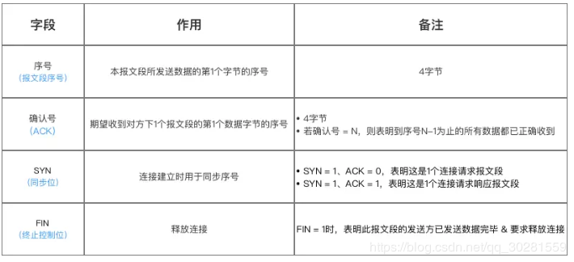
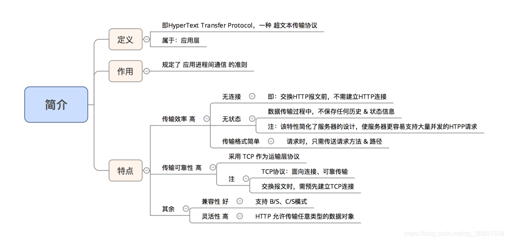
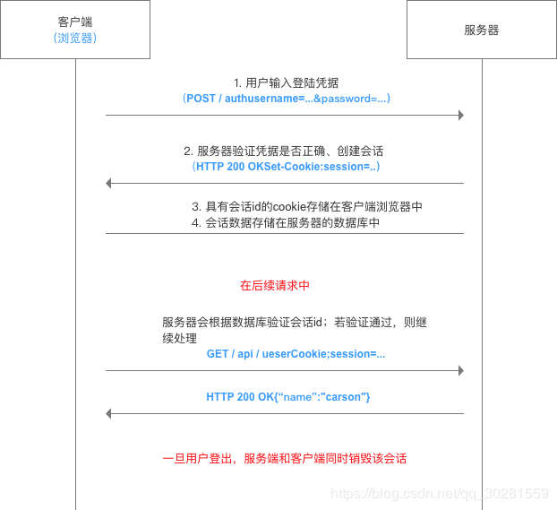

[「计算机网络」面试，看这篇就够了！](https://mp.weixin.qq.com/s/12fnofLZW66twmM9ktDhdg)

**[面试带你飞：这是一份全面的 计算机网络基础 总结攻略](https://juejin.im/post/5ad7e6c35188252ebd06acfa)**
[**计算机网络体系结构综述**](https://blog.csdn.net/justloveyou_/article/details/69612153)
# 1. 计算机网络体系结构
端系统通过通信链路和分组交换机连接到一起，组成网络。网络和网络之间通过路由器相连，组成了因特网。因此，因特网是“网络的网络”

## 1.1 简介
**定义** 计算机网络的各层 + 其协议的集合
**作用** 定义该计算机网络的所能完成的功能
## 1.2 结构介绍
计算机网络体系结构分为3种：OSI体系结构、TCP / IP体系结构、五层体系结构
 - OSI体系结构：概念清楚 & 理念完整，但复杂 & 不实用
 - TCP / IP体系结构：含了一系列构成互联网基础的网络协议，是Internet的核心协议 & 被广泛应用于局域网 和 广域网
 - 五层体系结构：融合了OSI 与 TCP / IP的体系结构，目的是为了学习 & 讲解计算机原理

低三层为通信子网，负责数据传输 高三层为资源子网，相当于计算机系统，完成数据处理； 传输层承上启下
### **OSI** 的体系结构

 - 应用层：任务是通过应用**进程间**的交互来完成特定网络应用 
 - 表示层：使通信的应用程序能够解释交换数据的含义，提供数据压缩、数据加密等服务
 - 会话层：提供了数据交换的定界和同步功能，包括建立检查点和恢复方案的方法 
 - 运输层：负责向两台主机中进程之间的通信提供数据传输服务网络层的任务
   就是选择合适的**网间路由和交换结点**， 确保数据及时传送。
   在发送数据时，网络层把运输层产生的报文段或用户数据报封装成分组和包进行传送。由于**网络层使用** **IP** **协议**，因此分组也叫 **IP** **数据报** **，简称数据报**。
 - 网络层：负责为分组交换网上的不同主机提供通信服务、选择合适的路由
 - 链路层：**两台主机之间的数据传输，总是在一段一段的链路上传送的。** 在两个相邻节点之间传送数据时，数据链路层将网络层交下来的 IP数据报组装成帧，在两个相邻节点间的链路上传送帧。
 - 物理层：在物理层上所传送的数据单位是**比特**。 物理层(physical layer)的作用是实现相邻计算机节点之间比特流的透明传送，尽可能屏蔽掉物理设备的差异，使其上面的数据链路层不必考虑网络的具体传输介质是什么。

### **TCP/IP**的结构体系

### **四层七层对应关系**

### **数据包**

## 2. TCP协议
### 1 定义
`Transmission Control Protocol`，即 传输控制协议

- 属于 传输层通信协议
- 基于TCP的应用层协议有HTTP、SMTP、FTP、Telnet 和 POP3
### 2 特点
- 面向连接、面向字节流、全双工通信、可靠
- 具体介绍如下：

### 3. 优缺点
- 优点：数据传输可靠
- 缺点：效率慢（因需建立连接、发送确认包等）
### 4. 应用场景（对应的应用层协议）
要求通信数据可靠时，即 数据要准确无误地传递给对方

如：传输文件：HTTP、HTTPS、FTP等协议；传输邮件：POP、SMTP等协议

- 万维网：HTTP协议
- 文件传输：FTP协议
- 电子邮件：SMTP协议
- 远程终端接入：TELNET协议
### 5. 报文段格式
TCP虽面向字节流，但传送的  **数据单元 = 报文段**
**报文段 = 首部 + 数据** 2部分
TCP的全部功能体现在它首部中各字段的作用，故下面主要讲解TCP报文段的首部
 **首部**前20个字符固定、后面有4n个字节是根据需而增加的选项
故 TCP首部最小长度 = 20字节

### 6. 建立连接过程☆☆☆

> Seq 是 Sequence 的缩写，表示序列；
> Ack(ACK) 是 Acknowledge 的缩写，表示确认，Ack = Seq + 1；
> SYN 是 Synchronous 的缩写，愿意是“同步的”，这里表示建立同步连接；
> FIN 是 Finish 的缩写，表示完成。

- TCP建立连接需 三次握手
- 具体介绍如下：

- 
- 成功进行TCP的三次握手后，就建立起一条TCP连接，即可传送应用层数据
- 因 TCP提供的是全双工通信，故通信双方的应用进程在任何时候都能发送数据
- 三次握手期间，任何1次未收到对面的回复，则都会重发
- 三次握手的过程中，Client 和 Server 互相做了一次 SYNC 和 ACK
#### 为什么TCP建立连接需三次握手？

**目的就是双方确认自己与对方的发送与接收是正常的。**  **防止服务器端因接收了早已失效的连接请求报文，从而一直等待客户端请求，最终导致形成死锁、浪费资源**

#### SYN洪泛攻击：
从上可看出：**服务端的TCP资源分配时刻 = 完成第二次握手时**；而**客户端的TCP资源分配时刻 = 完成第三次握手时**
这就使得服务器易于受到*SYN洪泛攻击*，即同时多个客户端发起连接请求，从而需进行多个请求的TCP连接资源分配

> 1、客户端向服务端发送请求连接数据包。
2、服务端向客户端发送确认数据包。
3、客户端不向服务端发送确认数据包，服务器一直等待来自客户端的确认。

如何检测 SYN 攻击？检测 SYN 攻击非常的方便，当你在服务器上看到大量的半连接状态时，特别是源 IP 地址是随机的，基本上可以断定这是一次 SYN 攻击。在 Linux/Unix 上可以使用系统自带的 netstat 命令来检测 SYN 攻击。

怎么解决 SYN 攻击呢？答案是只能预防，没有彻底根治的办法，除非不使用 TCP 。方式如下：
1、限制同时打开 SYN 半链接的数目
2、缩短 SYN 半链接的 Timeout 时间
3、关闭不必要的服务。
4、增加最大半连接数。
5、过滤网关防护。
6、SYN cookie 技术。

### 7. 释放连接过程☆☆☆
- 在通信结束后，双方都可以释放连接，共需 四次挥手
- 具体如下

#### 特别说明：为什么TCP释放连接需四次挥手？
**为了保证通信双方都能通知对方 需释放 & 断开连接**
即释放连接后，都无法接收 / 发送消息给对方
TCP 协议是一种面向连接的、可靠的、基于字节流的运输层通信协议。TCP 是**全双工模式**，这就意味着：

- 当主机 1 发出 FIN 报文段时，只是表示主机 1 已经没有数据要发送了，主机 1 告诉主机 2 ，它的数据已经全部发送完毕了；但是，这个时候主机 1 还是可以接受来自主机 2 的数据；当主机 2 返回 ACK 报文段时，表示它已经知道主机 1 没有数据发送了，但是主机 2 还是可以发送数据到主机 1 的。
- 当主机 2 也发送了 FIN 报文段时，这个时候就表示主机 2 也没有数据要发送了，就会告诉主机 1 ，我也没有数据要发送了，之后彼此就会愉快的中断这次 TCP 连接。

#### 延伸疑问：[为什么客户端关闭连接前要等待2MSL时间](https://www.zhihu.com/question/67013338)？
即 TIME - WAIT 状态的作用是什么；
MSL = 最长报文段寿命（Maximum Segment Lifetime）
- 原因1：为了保证**客户端发送的最后1个连接释放确认报文 能到达服务器，从而使得服务器能正常释放连接**
- 原因2：防止 上文提到的早已失效的连接请求报文 出现在本连接中；客户端发送了最后1个连接释放请求确认报文后，再经过2MSL时间，则可**使本连接持续时间内所产生的所有报文段都从网络中消失。即 在下1个新的连接中就不会出现早已失效的连接请求报文**
- 
>客户端最后一次向服务器回传ACK包时，有可能会因为网络问题导致服务器收不到，服务器会再次发送 FIN 包，如果这时客户端完全关闭了连接，那么服务器无论如何也收不到ACK包了，所以客户端需要等待片刻、确认对方收到ACK包后才能进入CLOSED状态。那么，要等待多久呢？
>    数据包在网络中是有生存时间的，超过这个时间还未到达目标主机就会被丢弃，并通知源主机。这称为**报文最大生存时间**（MSL，Maximum Segment Lifetime）。TIME_WAIT 要等待 **2MSL** 才会进入 CLOSED 状态。ACK 包到达服务器需要 MSL 时间，服务器重传 FIN 包也需要 MSL 时间，2MSL 是数据包往返的最大时间，如果 2MSL 后还未收到服务器重传的 FIN 包，就说明服务器已经收到了 ACK 包。

### 8. 无差错传输☆☆☆

将 TCP 与 UDP 这样的简单传输协议区分开来的是，它传输数据的质量。TCP 对于发送数据进行跟踪，这种数据管理需要协议有以下两大关键功能：
☆**可靠性/无差错**：保证数据确实到达目的地。如果未到达，能够发现并重传。
☆**数据流控**：管理数据的发送速率，以使接收设备不致于过载。
要完成这些任务，整个协议操作是围绕**滑动窗口 + 确认机制**来进行的。

#### 8.1 含义
- 无差错：即 传输信道不出差错
- 发送 & 接收效率匹配：即 无论发送方以多快的速度发送数据，接收方总来得及处理收到的数据
#### 8.2 基础：滑动窗口 协议
[《TCP 滑动窗口控制流量的原理》](https://www.cnblogs.com/luoquan/p/4886345.html)
[《网络基本功（八）：细说 TCP 滑动窗口》](https://wizardforcel.gitbooks.io/network-basic/content/7.html)
[《TCP 协议的滑动窗口具体是怎样控制流量的？》](https://www.zhihu.com/question/32255109)
> 滑动窗口协议，是传输层进行流控的一种措施，接收方通过通告发送方自己的窗口大小，从而控制发送方的发送速度，从而达到防止发送方发送速度过快而导致自己被淹没的目的。
TCP 的滑动窗口解决了端到端的流量控制问题，允许接受方对传输进行限制，直到它拥有足够的缓冲空间来容纳更多的数据。

- 先理解2个基础概念：**发送窗口、接收窗口**

- 工作原理
**对于发送端**：
每收到一个确认帧，发送窗口就向前滑动一个帧的距离
当发送窗口内无可发送的帧时（即窗口内的帧全部是已发送但未收到确认的帧），发送方就会停止发送，直到收到接收方发送的确认帧使窗口移动，窗口内有可以发送的帧，之后才开始继续发送
具体如下图：

- **对于接收端**：
当收到数据帧后，将窗口向前移动一个位置，并发回确认帧，若收到的数据帧落在接收窗口之外，则一律丢弃。

#### 滑动窗口 协议的重要特性
只有接收窗口向前滑动、接收方发送了确认帧时，发送窗口才有可能（只有发送方收到确认帧才是一定）向前滑动
停止等待协议、后退N帧协议 & 选择重传协议  只是在发送窗口大小和接收窗口大小上有所差别：

- 停止等待协议：发送窗口大小=1，接收窗口大小=1；即 单帧滑动窗口 等于 停止-等待协议
- 后退N帧协议：发送窗口大小>1，接收窗口大小=1。
- 选择重传协议：发送窗口大小>1，接收窗口大小>1。

- 当接收窗口的大小为1时，可保证帧有序接收。
- 数据链路层的滑动窗口协议中，窗口的大小在传输过程中是固定的（注意要与TCP的滑动窗口协议区别）
#### 8.3 实现无差错传输的解决方案
核心思想：采用一些可靠传输协议，使得
- 出现差错时，让发送方重传差错数据：即 **出错重传**
- 当接收方来不及接收收到的数据时，可通知发送方降低发送数据的效率：即 **速度匹配**

针对上述2个问题，分别采用的解决方案是：**自动重传协议** 和 **流量控制 & 拥塞控制协议**
##### 解决方案1：自动重传请求协议ARQ（针对 出错重传）
即 Auto Repeat reQuest，具体介绍如下：

**类型1：停等式ARQ（Stop-and-Wait）**

原理：（单帧滑动窗口）停止 - 等待协议 + 超时重传
即 ：发送窗口大小=1、接收窗口大小=1
停止 - 等待协议的协议原理如下：
- 发送方每发送一帧，要等到接收方的应答信号后才能发送下一帧
- 接收方每接收一帧，都要反馈一个应答信号，表示可接下一帧
- 若接收方不反馈应答信号，则发送方必须一直等待

**类型2：后退N帧协议**
也称：连续ARQ协议
原理：多帧滑动窗口 + 累计确认 + 后退N帧 + 超时重传
即 ：发送窗口大小>1、接收窗口大小=1
具体描述
- a. 发送方：采用多帧滑动窗口的原理，可连续发送多个数据帧 而不需等待对方确认
- b. 接收方：采用 累计确认 & 后退N帧的原理，只允许按顺序接收帧。具体原理如下：

**类型3：选择重传ARQ（Selective Repeat）**
原理
多帧滑动窗口 + 累计确认 + 后退N帧 + 超时重传
即 ：发送窗口大小>1、接收窗口大小>1
类似于类型2（后退N帧协议），此处仅仅是接收窗口大小的区别，故此处不作过多描述
特点
- a. 优：因连续发送数据帧而提高了信道的利用率
- b. 缺：重传时又必须把原来已经传送正确的数据帧进行重传（仅因为这些数据帧前面有一个数据帧出了错），将导致传送效率降低

    由此可见，若信道传输质量很差，导致误码率较大时，后退N帧协议不一定优于停止-等待协议
##### [解决方案2：流量控制 & 拥塞控制（针对 速度匹配）](https://www.jianshu.com/p/65605622234b)
### TCP 协议如何来保证传输的可靠性？
**数据包校验：**目的是检测数据在传输过程中的任何变化，若校验出包有错，则丢弃报文段并且不给出响应，这时 TCP 发送数据端超时后会重发数据。
**对失序数据包重排序：**既然 TCP 报文段作为 IP 数据报来传输，而 IP 数据报的到达可能会失序，因此 TC P报文段的到达也可能会失序。TCP 将对失序数据进行重新排序，然后才交给应用层。
**丢弃重复数据：**对于重复数据，能够丢弃重复数据。
**应答机制：**当 TCP 收到发自 TCP 连接另一端的数据，它将发送一个确认。这个确认不是立即发送，通常将推迟几分之一秒。
**超时重发：**当 TCP 发出一个段后，它启动一个定时器，等待目的端确认收到这个报文段。如果不能及时收到一个确认，将重发这个报文段。
**流量控制：**TCP 连接的每一方都有固定大小的缓冲空间。TCP 的接收端只允许另一端发送接收端缓冲区所能接纳的数据，这可以防止较快主机致使较慢主机的缓冲区溢出，这就是流量控制。TCP 使用的流量控制协议是可变大小的滑动窗口协议。
## 3. UDP协议
UDP（User Data Protocol，用户数据报协议），是与 TCP 相对应的协议。它是面向非连接的协议，它不与对方建立连接，而是直接就把数据包发送过去。
### 3.1 定义
`User Datagram Protocol`，即 用户数据报协议
属于 传输层通信协议
基于UDP的应用层协议有 TFTP、SNMP 与 DNS
### 3.2 特点
**无连接的、不可靠的、面向报文、无拥塞控制**，具体介绍如下：

### 3.3 应用场景（对应应用层协议）
要求通信速度高
如： 域名转换：DNS协议 文件传输：FTP协议 网络管理：SNMP协议 远程文件服务器：NFS协议
### 3.4 报文段格式
UDP的报文段共有2个字段：数据字段 & 首部字段
下面主要介绍首部（8字节、4个字段）

### 3.5 TCP、UDP区别

TCP是面向连接的，UDP是无连接的；

TCP是可靠的，UDP是不可靠的；

TCP只支持点对点通信，UDP支持一对一、一对多、多对一、多对多的通信模式；

TCP是面向字节流的，UDP是面向报文的；

TCP有拥塞控制机制;UDP没有拥塞控制，适合媒体通信；

TCP首部开销(20个字节)比UDP的首部开销(8个字节)要大；

###  为什么 TCP 叫数据流模式？ UDP 叫数据报模式？
所谓的“**流模式**”，是指**TCP 发送端发送几次数据和接收端接收几次数据是没有必然联系的**。
比如你通过 TCP 连接给另一端发送数据，你只调用了一次 write ，发送了 100 个字节，但是对方可以分 10 次收完，每次 10 个字节；你也可以调用 10 次 write ，每次 10 个字节，但是对方可以一次就收完。
原因：这是因为 TCP 是面向连接的，一个 Socket 中收到的数据都是由同一台主机发出，且有序地到达，所以每次读取多少数据都可以。

所谓的“**数据报模式**”，是指 **UDP 发送端调用了几次 write ，接收端必须用相同次数的 read 读完**。
UDP 是基于报文的，在接收的时候，*每次最多只能读取一个报文，报文和报文是不会合并的*，如果缓冲区小于报文长度，则多出的部分会被丢弃。
原因：这是因为 UDP 是无连接的，只要知道接收端的 IP 和端口，任何主机都可以向接收端发送数据。这时候，如果一次能读取超过一个报文的数据，则会乱套。
## 4 [HTTP协议](https://www.jianshu.com/p/a6d086a3997d)
**HTTP协议 属于 最高层的应用层**

**主要特点如下：**
**简单快速：** 客户向服务器请求服务时，只需传送请求方法和路径。请求方法常用的有 `GET、HEAD、POST` 等等。每种方法规定了客户与服务器联系的类型不同。由于 HTTP 协议简单，使得 HTTP 服务器的程序规模小，因而通信速度很快。
**数据格式灵活：** HTTP 允许传输`任意类型的数据对象`。正在传输的类型由Content-Type 加以标记。
**无连接：** 无连接的含义是`限制每次连接只处理一个请求`。服务器处理完客户的请求，并收到客户的应答后，即断开连接。采用这种方式可以节省传输时间。
**无状态：** HTTP 协议是无状态协议。无状态，是指`协议对于事务处理没有记忆能力`。无状态意味着如果后续处理需要前面的信息，则它必须重传，这样可能导致每次连接传送的数据量增大。另一方面，在服务器不需要先前信息时它的应答就较快。（无状态，所以更容易做服务的扩容，支撑更大的访问量）
**支持 B/S 及 C/S 模式。**
另外，HTTP 协议已经不仅仅使用在浏览器上。在前后端分离的架构中，又或者微服务架构的内部通信中，HTTP 因为其数据格式的通用性，和语言无关，被大规模使用。

### 4.1 请求方式
HTTP协议采用 **请求 / 响应** 的工作方式

### 4.2 [HTTP报文详解](https://github.com/kaiye/kaiye.github.com/issues/3)
- HTTP在 应用层 交互数据的方式 = 报文
- HTTP的报文分为：请求报文 & 响应报文
- 分别用于 发送请求 & 响应请求时
#### 4.2.1 请求报文
报文结构
HTTP的请求报文由 **请求行、请求头 & 请求体** 组成，如下图

**请求行的组成 = 请求方法 + 请求路径 + 协议版本**

#### [GET与POST的本质](https://www.oschina.net/news/77354/http-get-post-different)

**GET与POST**是我们常用的两种HTTP Method，二者之间的区别主要包括如下五个方面：

(1). 从功能上讲，GET一般用来从服务器上获取资源，POST一般用来更新服务器上的资源；

(2). 从REST服务角度上说，GET是**幂等**的，即读取同一个资源，总是得到相同的数据，而POST不是幂等的，因为每次请求对资源的改变并不是相同的；进一步地，GET不会改变服务器上的资源，而POST会对服务器资源进行改变；

(3). 从请求参数形式上看，GET请求的数据会附在URL之后，即将请求数据放置在HTTP报文的 请求头 中，以?分割URL和传输数据，参数之间以&相连。特别地，如果数据是英文字母/数字，原样发送；否则，会将其编码为 application/x-www-form-urlencoded MIME 字符串(如果是空格，转换为+，如果是中文/其他字符，则直接把字符串用BASE64加密，得出如：%E4%BD%A0%E5%A5%BD，其中％XX中的XX为该符号以16进制表示的ASCII)；而POST请求会把提交的数据则放置在是HTTP请求报文的 请求体 中。

(4). 就安全性而言，POST的安全性要比GET的安全性高，因为GET请求提交的数据将明文出现在URL上，而且POST请求参数则被包装到请求体中，相对更安全。

(5). 从请求的大小看，GET请求的长度受限于浏览器或服务器对URL长度的限制，允许发送的数据量比较小，而POST请求则是没有大小限制的。

#### **请求头**

- 作用：声明 客户端、服务器 / 报文的部分信息
- 使用方式：采用”header（字段名）：value（值）“的方式
常用请求头
1. 请求和响应报文的通用Header

2. 常见请求Header
   

  #### **请求体**
- 作用：存放 需发送给服务器的数据信息

**示例**

### 4.2.2 HTTP响应报文
HTTP的响应报文包括：**状态行、响应头 & 响应体**

- 其中，响应头、响应体 与请求报文的请求头、请求体类似

- 这2种报文最大的不同在于 状态行 & 请求行

  #### **状态行**

- 作用:声明 **协议版本，状态码，状态码描述**

- 组成:状态行有**协议版本、状态码 &状态信息**组成
  

  ####  响应头

- 作用：声明客户端、服务器 / 报文的部分信息

- 使用方式：采用”header（字段名）：value（值）“的方式
**1. 请求和响应报文的通用Header**

2. 常见响应Header
  

  #### 响应体
- 作用：存放需返回给客户端的数据信息
- 使用方式：和请求体是一致的，同样分为：任意类型的数据交换格式、键值对形式和分部分形式

### 4.2.3 区别

## 4.3 补充
### HTTP 与HTTPS的区别
[《九个问题从入门到熟悉 HTTPS》](https://juejin.im/post/58c5268a61ff4b005d99652a)

HTTPS ，实际就是在 TCP 层与 HTTP 层之间加入了 SSL/TLS 来为上层的安全保驾护航，主要用到对称加密、非对称加密、证书，等技术进行客户端与服务器的数据加密传输，最终达到保证整个通信的安全性。

**HTTP + 加密 + 认证 + 完整性保护 = HTTPS** 

### HTTP 有哪些状态码？
- 1×× : 请求处理中，请求已被接受，正在处理
- 2×× : 请求成功，请求被成功处理
	- 200 OK // 客户端请求成功
- 3×× : 重定向，要完成请求必须进行进一步处理
	- 301 Moved Permanently // 永久重定向,使用域名跳转
	- 302 Found // 临时重定向,未登陆的用户访问用户中心重定向到登录页面
- 4×× : 客户端错误，请求不合法
	- 400 Bad Request // 客户端请求有语法错误，不能被服务器所理解
	- 401 Unauthorized // 请求未经授权，这个状态代码必须和 WWW-Authenticate 报头域一起使用
	- 403 Forbidden // 服务器收到请求，但是拒绝提供服务
	- 404 Not Found // 请求资源不存在，eg：输入了错误的 URL
- 5×× : 服务器端错误，服务器不能处理合法请求
	- 500 Internal Server Error // 服务器发生不可预期的错误
	- 503 Server Unavailable // 服务器当前不能处理客户端的请求，一段时间后可能恢复正常
### HTTP是不保存状态的协议,如何保存用户状态?

HTTP 是无状态（stateless）协议。也就是说 HTTP 协议自身不对请求和响应之间的通信状态进行保存。

因此采用**Session机制**（有时间限制，过了时间就会销毁这个Session）来追踪用户

在服务端保存 Session 的方法很多，最常用的就是**内存和数据库**(比如是使用内存数据库redis保存)。既然 Session 存放在服务器端，那么我们如何实现 Session 跟踪呢？大部分情况下，我们都是通过在 **Cookie 中附加一个 Session ID** 来方式来跟踪。

Cookie 被禁用怎么办? 最常用的就是利用 **URL 重写把 Session ID 直接附加在URL路径的后面**。

### HTTP长连接、短连接 

在HTTP/1.0中默认使用短连接。也就是说，客户端和服务器每进行一次HTTP操作，就建立一次连接，任务结束就中断连接。

而从HTTP/1.1起，默认使用长连接，用以保持连接特性。使用长连接的HTTP协议，会在响应头加入这行代码：`Connection:keep-alive`

在使用长连接的情况下，当一个网页打开完成后，客户端和服务器之间用于传输HTTP数据的**TCP连接不会关闭，客户端再次访问这个服务器时，会继续使用这一条已经建立的连接**。Keep-Alive不会永久保持连接，它**有一个保持时间**，可以在不同的服务器软件（如Apache）中设定这个时间。实现长连接需要客户端和服务端都支持长连接。

HTTP协议的长连接和短连接，实质上是TCP协议的长连接和短连接。

### HTTP处理长连接的方式

### forward 和 redirect 的区别？
**直接转发方式（Forward）**，客户端和浏览器`只发出一次请求`，Servlet、HTML、JSP 或其它信息资源，由第二个信息资源响应该请求，在请求对象 request 中，保存的对象对于每个信息资源是共享的。

> 转发过程：客户浏览器发送http请求----》web服务器接受此请求--》调用内部的一个方法在容器内部完成请求处理和转发动作----》将目标资源发送给客户;在这里，转发的路径必须是同一个web容器下的url，其不能转向到其他的web路径上去，中间传递的是自己的容器内的request。在客户浏览器路径栏显示的仍然是其第一次访问的路径，也就是说客户是感觉不到服务器做了转发的。转发行为是浏览器只做了一次访问请求。

**间接转发方式（Redirect）**，实际是`两次 HTTP 请求`，服务器端在响应第一次请求的时候，让浏览器再向另外一个 URL 发出请求，从而达到转发的目的。

> 重定向过程：客户浏览器发送http请求----》web服务器接受后发送302状态码响应及对应新的location给客户浏览器--》客户浏览器发现是302响应，则自动再发送一个新的http请求，请求url是新的location地址----》服务器根据此请求寻找资源并发送给客户。在这里 location可以重定向到任意URL，既然是浏览器重新发出了请求，则就没有什么request传递的概念了。在客户浏览器路径栏显示的是其重定向的路径，客户可以观察到地址的变化的。重定向行为是浏览器做了至少两次的访问请求的。

***转发是服务器行为，重定向是客户端行为***。
[《请求转发（Forward）和重定向（Redirect）的区别》](https://www.cnblogs.com/Qian123/p/5345527.html) 
## 5. Socket

 http://c.biancheng.net/view/2123.html 

- TCP/IP 代表传输控制协议/网际协议，指的是**一系列协议族**。
- HTTP 本身就是一个协议，是从 Web 服务器**传输超文本到本地浏览器的传送协议**。
- Socket 是 **TCP/IP 网络的 API** ，其实就是一个门面模式，它把复杂的 TCP/IP 协议族隐藏在 Socket 接口后面。对用户来说，一组简单的接口就是全部，让 Socket 去组织数据，以符合指定的协议。
### 5.1 简介

计算机通信领域，socket 被翻译为“套接字”，它是计算机之间进行通信的一种约定或一种方式。通过 socket 这种约定，一台计算机可以接收其他计算机的数据，也可以向其他计算机发送数据。 
**套接字**，是应用层 与 TCP/IP 协议族通信的中间软件抽象层，表现为**一个封装了 TCP / IP协议族 的编程接口（API）**

- Socket不是一种协议，而是一个编程调用接口（API），属于传输层（主要解决数据如何在网络中传输）
- 即：通过Socket，我们才能在Andorid平台上通过 TCP/IP协议进行开发
- 对用户来说，只需调用Socket去组织数据，以符合指定的协议，即可通信
- 成对出现，一对套接字：Socket ={(IP地址1:PORT端口号)，(IP地址2:PORT端口号)}
- 一个 Socket 实例 唯一代表一个主机上的一个应用程序的通信链路
## 6. 其他问题
### 6.1 在浏览器中输入url地址 ->> 显示主页的过程
**域名解析 --> 发起TCP的3次握手 --> 建立TCP连接后发起http请求 --> 服务器响应http请求，浏览器得到html代码 --> 浏览器解析html代码，并请求html代码中的资源（如js、css、图片等） --> 浏览器对页面进行渲染呈现给用户**

### 一次完整的HTTP请求所经历的7个步骤
HTTP通信机制是在一次完整的HTTP通信过程中，Web浏览器与Web服务器之间将完成下列7个步骤：

1. 建立TCP连接
在HTTP工作开始之前，Web浏览器首先要通过网络与Web服务器建立连接，该连接是通过TCP来完成的，该协议与IP协议共同构建 Internet，即著名的TCP/IP协议族，因此Internet又被称作是TCP/IP网络。HTTP是比TCP更高层次的应用层协议，根据规则， 只有低层协议建立之后才能，才能进行更层协议的连接，因此，首先要建立TCP连接，一般TCP连接的端口号是80。

2. Web浏览器向Web服务器发送请求行
一旦建立了TCP连接，Web浏览器就会向Web服务器发送请求命令。例如：GET /sample/hello.jsp HTTP/1.1。

3. Web浏览器发送请求头
浏览器发送其请求命令之后，还要以头信息的形式向Web服务器发送一些别的信息，之后浏览器发送了一空白行来通知服务器，它已经结束了该头信息的发送。
4. Web服务器应答
客户机向服务器发出请求后，服务器会客户机回送应答， HTTP/1.1 200 OK ，应答的第一部分是协议的版本号和应答状态码。
5. Web服务器发送应答头
正如客户端会随同请求发送关于自身的信息一样，服务器也会随同应答向用户发送关于它自己的数据及被请求的文档。
6. Web服务器向浏览器发送数据
Web服务器向浏览器发送头信息后，它会发送一个空白行来表示头信息的发送到此为结束，接着，它就以Content-Type应答头信息所描述的格式发送用户所请求的实际数据。
7. Web服务器关闭TCP连接
一般情况下，一旦Web服务器向浏览器发送了请求数据，它就要关闭TCP连接，然后如果浏览器或者服务器在其头信息加入了这行代码：
Connection:keep-alive

TCP连接在发送后将仍然保持打开状态，于是，浏览器可以继续通过相同的连接发送请求。保持连接节省了为每个请求建立新连接所需的时间，还节约了网络带宽。

**建立TCP连接->发送请求行->发送请求头->（到达服务器）发送状态行->发送响应头->发送响应数据->断TCP连接**

最具体的HTTP请求过程：http://blog.51cto.com/linux5588/1351007
### 6.2 IP地址（IPv4地址）
定义
连接在Internet中的每一台主机（或 路由器）的全球唯一的标识符
组成

    IP地址 = 32位 = 网络号 + 主机号；即IP地址::={<网络号>，<主机号>}

其中：

- 网络号：标志主机（或路由器）所连接到的网络。一个网络号在整个因特网范围内必须是唯一的。
- 主机号：标志该主机（或路由器）。一个主机号在它面前的网络号所指明的网络范围必须是唯一的。
不同类型的IP地址，其主机号 & 网络号所占字节数不同；故：**一个IP地址在整个网络范围内是唯一的**
### 6.3 路由器与交换机的区别

### 6.4 Cookie 与 Session
[**彻底理解cookie，session，token**](https://www.cnblogs.com/moyand/p/9047978.html)
- Session 在服务器端，Cookie 在客户端（浏览器）。
	- Session 默认被存在在`服务器的一个文件`里（不是内存）。
- Session 的运行依赖 sessionID ，而 sessionID 是存在 Cookie 中的，也就是说，如果浏览器禁用了 Cookie ，同时 session 也会失效。但是，可以通过其它方式实现，比如在 url 参数中传递 sessionid 。
- Session 可以放在文件、数据库、或内存中都可以。
- 【关键】用户验证这种场合一般会用 Session 。

### 6.5 Cookie 与 Token
[**彻底理解cookie，session，token**](https://www.cnblogs.com/moyand/p/9047978.html)

- **基于Cookie的身份验证 & 验证流程**

- **基于Token的身份验证 & 验证流程**
**==服务器不保存sessionID，只有一个验证算法==**

**计算机网络面试问题集锦**https://blog.csdn.net/justloveyou_/article/details/78303617

## 7.Rest

Restful接口有哪些内容 如何实现  restful风格是什么

这个很好： [https://blog.csdn.net/hjc1184117/article/details/77334616](https://blog.csdn.net/hjc1984117/article/details/77334616)

### 7.1 概念

**REST是将资源的状态以最适合客户端或服务端的形式从服务端转移到客户端（或者反过来）。其中URL定位资源，用HTTP动词（GET,POST,PUT,DELETE)描述操作。**

**RPC是面向服务的，并关注于行为和动作；而REST是面向资源的，强调描述应用程序的事物和名词。**

RESTful API就是REST风格的API。 那么在什么场景下使用RESTful API呢？在当今的互联网应用的前端展示媒介很丰富。有手机、有平板电脑还有PC以及其他的展示媒介。那么这些前端接收到的用户请求统一由一个后台来处理并返回给不同的前端肯定是最科学和最经济的方式，**RESTful API就是一套协议来规范多种形式的前端和同一个后台的交互方式，很好的实现了前后端的分离。**

### 7.2 规范

​    RESTful API由后台也就是SERVER来提供调用。前端调用API向后台发起HTTP请求，后台响应请求将处理结果反馈给前端。也就是说RESTful 是典型的基于HTTP的协议。那么RESTful API有哪些设计原则和规范呢？

   1，**资源**。首先是弄清楚资源的概念。资源就是网络上的一个实体，一段文本，一张图片或者一首歌曲。资源总是要通过一种载体来反应它的内容。文本可以用TXT，也可以用HTML或者XML、图片可以用JPG格式或者PNG格式，**JSON是现在最常用的资源表现形式**。

   2，**统一接口**，在设计web接口的时候，REST主要是用于定义接口名，接口名一般是用名词写，不用动词，那怎么表达“获取”或者“删除”或者“更新”这样的操作呢——用请求类型来区分。

比如，我们有一个friends接口，对于“朋友”我们有增删改查四种操作，怎么定义REST接口？

增加一个朋友，`url: generalcode.cn/v1/friends `接口类型：POST
删除一个朋友，`url: generalcode.cn/va/friends` 接口类型：DELETE
修改一个朋友，`url: generalcode.cn/va/friends` 接口类型：PUT
查找朋友，`url: generalcode.cn/va/friends`接口类型：GET

上面我们定义的四个接口就是符合REST协议的，请注意，这几个接口都没有动词，只有名词friends，都是通过Http请求的接口类型来判断是什么业务操作。

举个反例：`generalcode.cn/va/deleteFriends `该接口用来表示删除朋友，这就是不符合REST协议的接口。

   3，**URL**。每个URL都对应一个特定的资源，要获取这个资源访问它的URL就可以。

   4，**无状态**。所谓无状态即所有的资源都可以URL定位，而且这个定位与其他资源无关，也不会因为其他资源的变化而变化。有状态和无状态的区别，举个例子说明一下，例如要查询员工工资的步骤为第一步：登录系统。第二步：进入查询工资的页面。第三步：搜索该员工。第四步：点击姓名查看工资。这样的操作流程就是有状态的，查询工资的每一个步骤都依赖于前一个步骤，只要前置操作不成功，后续操作就无法执行。如果输入一个URL就可以得到指定员工的工资，则这种情况就是无状态的，因为获取工资不依赖于其他资源或状态，且这种情况下，员工工资是一个资源，由一个URL与之对应可以通过HTTP中的GET方法得到资源，这就是典型的RESTful风格。

   说了这么多，到底RESTful长什么样子的呢？

`GET:http://www.xxx.com/source/id `获取指定ID的某一类资源。例如`GET:http://www.xxx.com/friends/123`表示获取ID为123的会员的好友列表。如果不加id就表示获取所有会员的好友列表。

`POST:http://www.xxx.com/friends/123`示为指定ID为123的会员新增好友。其他的操作类似就不举例了。

5、**URL中只能有名词而不能有动词**，操作的表达是使用HTTP的动词GET,POST,PUT,DELETEL。URL只标识资源的地址，既然是资源那就是名词了。

6、如果记录数量很多，服务器不可能都将它们返回给用户。**API应该提供参数，过滤返回结果**。`?limit=10`：指定返回记录的数量、`?page=2&per_page=100`：指定第几页，以及每页的记录数。