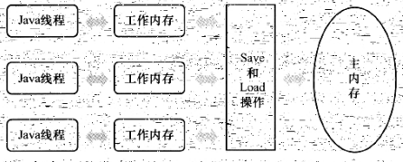
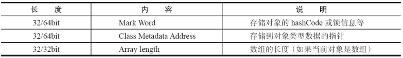
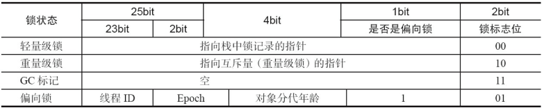
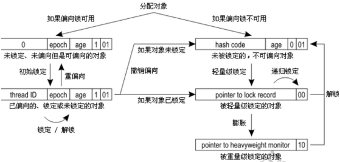
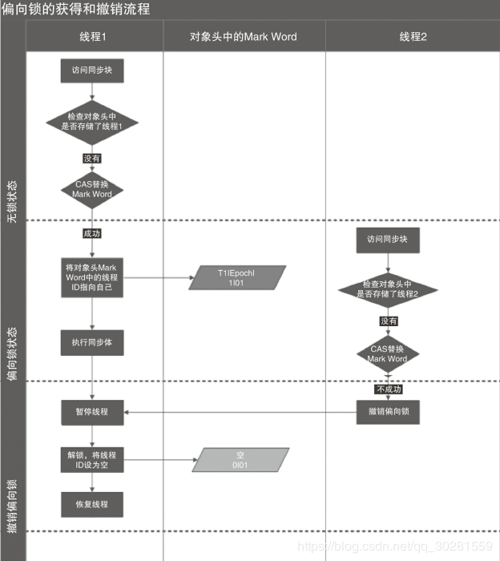
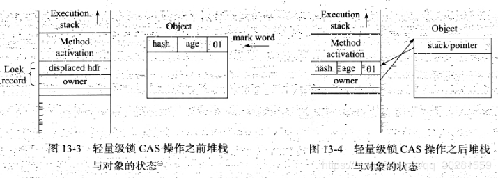
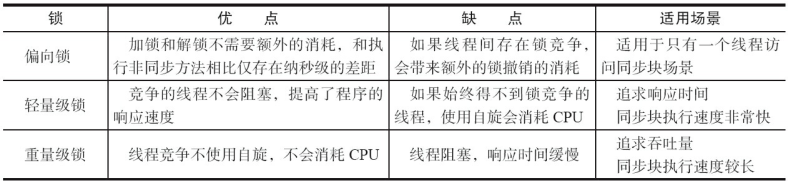

# 3.Java内存模型


## 3.1 Java内存模型的基础
在并发编程中两个关键问题：**线程之间如何通信及线程之间如何同步**（这里的线程是指并发执行的活动实体）。

**通信**是指线程之间以何种机制来交换信息。

- 在命令式编程中，线程之间的通信机制有两种：**共享内存和消息传递**。
- 在共享内存的并发模型里，线程之间共享程序的公共状态，通过写-读内存中的公共状态进行隐式通信。
- 在消息传递的并发模型里，线程之间没有公共状态，线程之间必须通过发送消息来显式进行通信。

**同步**是指程序中用于**控制不同线程间操作发生相对顺序的机制**。

- 在共享内存并发模型里，同步是显式进行的。程序员必须显式指定某个方法或某段代码需要在线程之间互斥执行。
- 在消息传递的并发模型里，由于消息的发送必须在消息的接收之前，因此同步是隐式进行的。

**Java的并发采用的是共享内存模型**，Java线程之间的通信总是隐式进行，整个通信过程对程序员完全透明。

> 在Java中，所有实例域、静态域和数组元素都存储在堆内存中，堆内存在线程之间共享。
>
> 局部变量，方法定义参数和异常处理器参数不会在线程之间共享，它们不会有内存可见性问题，也不受内存模型的影响
>
> **共享内存有两个重要问题：**
>
> - **一个是竞态条件**
> - **一个是内存可见性**

### Java内存模型JMM

Java中堆内存在线程之间共享， 线程之间的通信由 Java 内存模型 JMM 控制。Java内存模型的主要目标是**定义程序中各个变量的访问规则**；即在虚拟机中将变量存储到内存和从内存中取出变量这样的底层细节。

- 此处的变量（Variables）与java编程中所说的变量有所区别，它包括了**实例字段、静态字段和构成数组对象**的元素，但不包括局部变量与一方法参数，因为后者是线程私有的，不会被共享，自然就不会存在竞争问题。

**主内存与工作内存**

- Java内存模型规定所有的变量都存储在**主内存**（Main Memory中（此处的主内存：与介绍物理硬件时的主内存名字一样，两者也可以互相类比，但此处仅是虚拟机内存的一部分）。
- 每条线程还自己的**工作内存**（Working Meimory，可与前面讲的处理器高速缓存类比），线程的工作内存中保存了被该线程使用到的变量的**主内存副本拷贝**；
- **线程对变量的所有操作（读取、赋值等）都必须在工作内存中进行，而不能直接读写主内存中的变量”**。不同的线程之间也无法直接访问对方工作内存中的变量，**线程间变量值的传递均需要通过主内存来完成**，线程、主内存、工作内存三者的交关系如图:
  

> 注：这里所讲的主内存、工作内存与Java内存区域中的Java堆、栈、方法区等并不是同一个层次的内存划分，这两者基本上是没有关系的：如果两者一定要勉强对应起来，那从变量、主内存、工作内存的定义来看，**主内存主要对应于Java堆中的对象实例数据部分，而工作内存则对应于虚拟机栈中的部分区域**。从更低层次上说，主内存就直接对应于物理硬件的内存，而为了获取更好的运行速度，虚拟机（甚至是硬件系统本身的优化措施）可能会让工作内存优先存储于寄存器和高速缓存中，因为程序运行时主要访问读写的是工作内存。

#### jvm 运行时刻内存的分配： 

其中有一个内存区域是 jvm 虚拟机栈， 每一个线程运行时都有一个线程栈， 线程栈保存了线程运行时候变量值信息。 

当线程访问某一个对象时候值的时候，首先通过对象的引用找到对应在堆内存的变量的值， 然后把堆内存变量的具体值 load 到线程本地内存中， 建立一个变量副本， 之后线程就不再和对象在堆内存变量值有任何关系， 而是直接修改副本变量的值， （从线程内存中读值）在修改完之后的某一个时刻（线程退出之前）， 把线程变量副本的值回写到对象在堆中变量。这样在堆中的对象的值就产生变化了  

## 3.2 指令重排序
**重排序**是指编译器和处理器为了优化程序性能而对指令序列进行重新排序的一种手段。

1. 编译优化重排序。编译器在不改变单线程程序语义的前提下，可以重新安排语句执行顺序。
2. 指令级并行的重排序。CPU采用了指令级并行技术将多条指令重叠执行。
3. 内存系统的重排序。由于CPU使用cache和读/写缓冲区，因此加载和存储操作可能在乱序执行。

> 1 属于编译器重排序,2 和 3 属于处理器重排序。 这些重排序可能会导致多线程程序出现内存可见性问题。
> 对于编译器,JMM 的编译器重排序规则会禁止特定类型的编译器重排序(不是所有的编译器重排序都要禁止)。
> 对于处理器重排序,JMM 的处理器重排序规则会要求 Java 编译器在生成指令序列时,插入特定类型的内存屏障(Memory Barriers,Intel 称之为 Memory Fence)指令,通过内存屏障指令来禁止特定类型的处理器重排序。  

### 内存屏障  

JMM把内存屏障分为四类：

- LoadLoad屏障：对于这样的语句Load1；LoadLoad；Load2。在Load2及后续读取操作要读取的数据被访问前，保证Load1要读取的数据被读取完毕。
- StoreStore屏障：对于这样的语句Store1；StoreStore,Store2，在Store2及后续写入操作执行前，保证Store1的写入操作对其它处理器可见。
- LoadStore屏障：对于这样的语句Load1；LoadStore；Store2，在Store2及后续写入操作被刷出前，保证Load1要读取的数据被读取完毕。
- StoreLoad 屏障：对于这样的语句Store1；StoreLoad；Load2，在Load2及后续所有读取操作执行前，保证 Store1的写入对所有处理器可见。它的开销是四种屏障中最大的。在大多数处理器的实现中，这个屏障是个万能屏障，兼具其它三种内存屏障的功能。

### happens-before

抽象概念， 基于内存屏障 

Java 使用happens-before的概念来阐述操作之间的**内存可见性**。在JMM中，如果一个操作执行的结果需要对另一个操作可见，那么这两个操作之间必须要存在happens-before关系。这里提到的**两个操作既可以是在一个线程之内，也可以是在不同线程之间。**

- **程序次序规则（Program erder Rule）**：在一个线程内，按照程序代码顺序，书写在前面的操作先行发生于书写在后面的操作。准确地说，应该是控制流顺序而不是程序代码顺序，因为要考虑分支、循环等结构。
- **管程锁定规则：（Monitor Lock Rile）**:一个unlock 操作先行发生于后面对同一个锁的lock操作。这里必须强调的是同一个锁；而“后面”是指时间上的先后顺序。
- **volatile变量规则（Volatile Variable Rule）**：对一个volatile变量的写操作先行发生于后面对这个变量的读操作，这里的：“后面“同样是指时间上的先后顺序。
- **传递性**：（Transitivity）:如果A操作先行发生于操作B，操作B先行发生于操作C就可以得出操作A先行发生于操作C的结论。
- 线程启动规则（Thread Start Rule）：Thread对象的start()方法先行发生于此线程的每一个动作。
- 线程终止规则（Thread Termination Rule）：线程的所有操作都先行发生手对此线程的终正检测，我们可以通Thread.join方法结束，Thread.isAlive的返回值等手段检测到线程已经终止执行
- 线程中断规则（Thread Interuption Rule）：对线程interupt方法的调用先行发生于被中断线程的代码检测到中断事件的发生，可以通过Thread.interiupted方法检测到是否有中断发生
- 对象终结规则（Finalizer.Rule）：个对象的初始化完成（构造函数执行结束）先行发生于它的finalize方法的开始

> 注意 两个操作之间具有happens-before关系，并不意味着前一个操作必须要在后一个操作之前执行！ happens-before**仅仅要求前一个操作（执行的结果）对后一个操作可见，且前一个操作按顺序排在第二个操作之前**
>
> 如果一个操作happens-before另一个操作，那么第一个操作的执行结果将对第二个操作可见，而且第一个操作的执行顺序排在第二个操作之前。
>
> 两个操作之间存在happens-before关系，并不意味着Java平台的具体实现必须要按照happens-before关系指定的顺序来执行。如果重排序之后的执行结果，与按happens-before关系来执行的结果一致，那么这种重排序并不非法（也就是说，JMM允许这种重排序）。


一个happens-before规则对应于一个或多个编译器和处理器重排序规则

### 数据依赖性

如果两个操作访问同一个变量，且这两个操作中有一个为写操作，此时这两个操作之间就存在数据依赖性。（三种类型：写后读、写后写、读后写）

- 编译器和处理器可能会对操作做重排序。编译器和处理器在重排序时，会遵守数据依赖性，编译器和处理器不会改变存在数据依赖关系的两个操作的执行顺序。(仅针对单个处理器中执行的指令序列和单个线程中执行的操作)
- **as-if-serial语义**的意思是：不管怎么重排序（编译器和处理器为了提高并行度），（单线程）程序的执行结果不能被改变。编译器、runtime和处理器都必须遵守as-if-serial语义。
- 在多线程程序中，对存在控制依赖的操作重排序，可能会改变程序的执行结果

> happens-before关系本质上和as-if-serial语义是一回事。
> ·as-if-serial语义保证单线程内程序的执行结果不被改变，happens-before关系保证正确同步的多线程程序的执行结果不被改变。
> ·as-if-serial语义给编写单线程程序的程序员创造了一个幻境：单线程程序是按程序的顺序来执行的。happens-before关系给编写正确同步的多线程程序的程序员创造了一个幻境：正确同步的多线程程序是按happens-before指定的顺序来执行的。

## 3.3 顺序一致性

程序未正确同步的时候， 就可能存在数据竞争。
**数据竞争**：

- 在一个线程中写一个变量
- 在另一个线程中读同一个变量
- 而且写和读没有通过同步来排序  

JMM对正确同步的多线程程序的内存一致性做了如下保证。

- 如果程序是正确同步的，程序的执行将具有顺序一致性（Sequentially Consistent）——即程序的执行结果与该程序在顺序一致性内存模型中的执行结果相同。
  - 1） 一个线程中的所有操作必须按照程序的顺序来执行
  - 2） 不管程序是否同步， 所有线程都只能看到单一的操作执行顺序。 每个操作都必须原子执行且立即对所有线程可见。  
- 这里的同步是指广义上的同步，包括对常用同步原语（synchronized、volatile和final）的正确使用。

## 3.4 volatile

> 是为成员变量的同步访问提供了一种免锁机制， 如果声明一个成员变量是 volatile 的，那么会通知编译器和虚拟机**这个成员变量可能是其他线程并发更新的**.
>
> 对于 volatile 修饰的变量， jvm 虚拟机只是保证从主内存加载到线程工作内存的值是最新的  

**作用**：

- 保证可见性
- 不会引起线程上下文的切换和调度-->
- 可以禁止指令重排（保证有序性）
- 不具有互斥性（**仍会发生同时读取，同时操作的竞态条件**）
- 不能保证原子性

**定义**：Java编程语言允许线程访问共享变量，为了确保共享变量能被**准确和一致地更新**，线程应该确保通过排他锁单独获得这个变量。

 **实现原理**：对声明了volatile的变量进行写操作，JVM就会向处理器发送一条**Lock前缀的指令**，将这个变量所在缓存行的数据写回到系统内存。 每个处理器按照**缓存一致性协议**，通过嗅探在总线上传播的数据来检查自己缓存的值是不是过期了。

**Lock前缀的指令**在多核处理器下会引发了两件事情。
	1）将当前处理器缓存行的数据写回到系统内存。
	2）这个写回内存的操作会使在其他CPU里缓存了该内存地址的数据无效。

**volatile的两条实现原则**
	1）Lock前缀指令会引起处理器缓存回写到内存。
	2）一个处理器的缓存回写到内存会导致其他处理器的缓存无效。

### volatile的内存语义

**可见性**：对一个volatile变量的读，总是能看到（任意线程）对这个volatile变量最后的写入。

**原子性**：对任意单个volatile变量的读/写具有原子性，但类似于`i++`这种复合操作不具有原子性

**volatile变量的写-读可以实现线程之间的通信。**从内存语义的角度来说，**volatile的写-读** 与 **锁的释放-获取** 有相同的内存效果：volatile写和锁的释放有相同的内存语义；volatile读与锁的获取有相同的内存语义。

- **volatile写的内存语义如下**
  当写一个volatile变量后，JMM会把**该线程对应的本地内存中的所有共享变量值**刷新到主内存，因此本地内存和主内存中的共享变量的值是一致的。
- **volatile读的内存语义如下**
  当读一个volatile变量时，JMM会把**该线程对应的本地内存置为无效，线程接下来将从主内存中读取共享变量**。

> **一个 volatile 变量的单个读写操作， 与一个普通变量的读写操作使用同一个锁来同步， 它们的执行效果相同**。 锁的 happens-before 规则保证释放锁和获取锁的两个线程之间的内存可见性， 这也意味着对一个 volatile 变量的读操作， 总是能看到任意线程对该变量最后的写入。  
>
> 对于 volatile 变量本身的单个读写操作具有原子性， 但是与锁不同的是， 多个对于 volatile变量的复合操作不具有原子性。 而锁的语义保证了临界区代码的执行具有原子性。  

**eg**：A 线程写一个 volatile 变量 x 后， B 线程读取 x 以及其他共享变量。

1. 当 A 线程对 x 进行写操作时， JMM 会把该线程 A 对应的 cache 中的共享变量值刷新到主存中.（实质上是线程 A 向接下来要读变量 x 的线程发出了其对共享变量修改的消息）
2. 当 B 线程对 x 进行读取时， JMM 会把该线程对应的 cache 值设置为无效， 而从主存中读取x。 （实质上是线程 B 接收了某个线程发出的对共享变量修改的消息）  
3. 两个步骤综合起来看， 在线程 B 读取一个 volatile 变量 x 后， **线程 A 本地 cache 中在写这个变量 x 之前所有其他可见的共享变量的值都立即变得对 B 可见**。 线程 A 写 volatile 变量 x， B读 x 的过程实质上是线程 A 通过主存向 B 发送消息。  

### volatile内存语义的实现

重排序分为编译器重排序和处理器重排序。为了实现volatile内存语义，JMM会分别限制这两种类型的重排序类型


> 当第二个操作是volatile写时，不管第一个操作是什么，都不能重排序。这个规则确保volatile写之前的操作不会被编译器重排序到volatile写之后。

> 当第一个操作是volatile读时，不管第二个操作是什么，都不能重排序。这个规则确保volatile读之后的操作不会被编译器重排序到volatile读之前。

> 当第一个操作是volatile写，第二个操作是volatile读时，不能重排序。

为了实现volatile的内存语义，编译器在生成字节码时，会在指令序列中插入**内存屏障**来禁止特定类型的处理器重排序。
下面是基于保守策略的JMM内存屏障插入策略。

- 在每个volatile写操作的前面插入一个StoreStore屏障。
- 在每个volatile写操作的后面插入一个StoreLoad屏障。
- 在每个volatile读操作的后面插入一个LoadLoad屏障。
- 在每个volatile读操作的后面插入一个LoadStore屏障。


StoreStore屏障将保障上面所有的普通写在volatile写之前刷新到主内存。
StoreLoad屏障的作用是避免volatile写与后面可能有的volatile读/写操作重排序。
LoadLoad屏障用来禁止处理器把上面的volatile读与下面的普通读重排序。
LoadStore屏障用来禁止处理器把上面的volatile读与下面的普通写重排序。

## 3.5 synchronized 的实现原理与应用

利用synchronized实现同步的基础：**Java中的任意对象都有一个锁和等待队列，每一个对象都可以作为锁对象**。具体表现为以下3种形式。

- 对于实例方法，锁是当前`实例对象`。
- 对于静态方法，锁是当前类的`Class对象`。
- 对于方法块，锁是Synchonized括号里配置的对象。

> synchronized 锁定的是对象而非代码， 所处的位置是代码块或方法  
>
> #### **注意：synchronized保护的是对象而非代码，只要访问的是同一个对象的synchronized方法，即使是不同的代码，也会被同步顺序访问**

### monitor

**Synchonized在JVM里的实现原理**：  

JVM基于进入和退出Monitor对象来实现方法同步和代码块同步，但两者的实现细节不一样。

- **代码块同步**是使用monitorenter和monitorexit指令实现的
- **方法同步**是使用另外一种方式实现的，细节在JVM规范里并没有详细说明。但是，方法的同步同样可以使用这两个指令来实现
  - **monitorenter指令是在编译后插入到同步代码块的开始位置，而monitorexit是插入到方法结束处和异常处，JVM要保证每个monitorenter必须有对应的monitorexit与之配对。**
  - 任何对象都有一个`monitor`与之关联，当且一个monitor被持有后，它将处于锁定状态。**线程执行到monitorenter指令时，将会尝试获取对象所对应的monitor的所有权，即尝试获得对象的锁。**

> 任意一个对象都拥有自己的监视器（monitor），当这个对象由同步块或者这个对象的同步方法调用时，执行方法的线程必须先获取到该对象的监视器才能进入同步块或者同步方法，而没有获取到监视器（执行该方法）的线程将会被阻塞在同步块和同步方法的入口处，进入·`BLOCKED`状态。
> 任意线程对Object（Object由synchronized保护）的访问，首先要获得Object的监视器。如果获取失败，线程进入**同步队列**，线程状态变为`BLOCKED`。当访问Object的前驱（获得了锁的线程）释放了锁，则该释放操作唤醒阻塞在同步队列中的线程，使其重新尝试对监视器的获取。


> 其实 wait/notify 等方法也依赖于 monitor 对象， 这就是为什么只有在同步的块或者方法中才能调用 wait/notify 等方法， 否则会抛出 java.lang.IllegalMonitorStateException 的异常的原因  

### Java对象头

synchronized用的锁（一般我们也将其称为**监视器monitor**）是**存在Java对象头里的**。如果对象是数组类型，则虚拟机用3个字宽（Word = 32/64bit）存储对象头，如果对象是非数组类型，则用2字宽存储对象头。


Java对象头里的Mark Word里默认存储：对象的HashCode、分代年龄和**锁标记位**。


在运行期间，Mark Word里存储的数据会随着锁标志位的变化而变化。Mark Word可能变化为存储以下4种数据


### 锁的内存语义

锁除了让**临界区互斥执行**外，还可以**让释放锁的线程向获取同一个锁的线程发送消息**。

**当线程释放锁时，JMM会把该线程对应的本地内存中的共享变量刷新到主内存中。**
**当线程获取锁时，JMM会把该线程对应的本地内存置为无效。从而使得被监视器保护的临界区代码必须从主内存中读取共享变量。**

**锁释放与volatile写有相同的内存语义；锁获取与volatile读有相同的内存语义。**

- 线程A释放一个锁，实质上是线程A向接下来将要获取这个锁的某个线程发出了（线程A对共享变量所做修改的）消息。
- 线程B获取一个锁，实质上是线程B接收了之前某个线程发出的（在释放这个锁之前对共享变量所做修改的）消息。
- **线程A释放锁，随后线程B获取这个锁，这个过程实质上是线程A通过主内存向线程B发送消息**。

### 锁释放-获取的内存语义的实现

**1）利用volatile变量的写-读所具有的内存语义。**
**2）利用CAS所附带的volatile读和volatile写的内存语义。**

**ReentrantLock的实现**依赖于Java同步器框架**AbstractQueuedSynchronizer**（本文简称之为AQS）。
AQS使用一个**整型的volatile变量（命名为state）**来维护同步状态。

**公平锁**在释放锁的最后写volatile变量state，在获取锁时首先读这个volatile变量。根据volatile的happens-before规则，**释放锁的线程在写volatile变量之前可见的共享变量，在获取锁的线程读取同一个volatile变量后将立即变得对获取锁的线程可见**。

**非公平锁**获取时，首先会用**CAS更新volatile变量**，这个操作同时具有volatile读和volatile写的内存语义。

> **CAS如何同时具有volatile读和volatile写的内存语义。**
> 编译器不会对volatile读与volatile读后面的任意内存操作重排序；编译器不会对volatile写与volatile写前面的任意内存操作重排序。组合这两个条件，意味着为了同时实现volatile读和volatile写的内存语义，编译器不能对CAS与CAS前面和后面的任意内存操作重排序

## 3.6 锁的分类

锁一共有4种状态，级别从低到高依次是：**无锁状态、偏向锁状态、轻量级锁状态、重量级锁状态**，这几个状态会随着竞争情况逐渐升级。锁可以升级但不能降级。

monitorenter 和 monitorexit 是上层指令， 底层实现可能是偏向锁、 轻量级锁、 重量级锁等。  



### 1.偏向锁

只有一个线程进入临界区

> 引入背景： 大多数情况下锁不仅不存在多线程竞争， 而且总是由同一线程多次获得， 为了让线程获得锁的代价更低而引入了偏向锁， 减少不必要的 CAS 操作。  

**偏向锁加锁：**
**程访问同步块并获取锁时，会通过**CAS(Compare And Swap)**来尝试将**对象头和栈帧中的锁记录**中的 Thread ID字段设置为自己的线程号，如果设置成功，则获得锁，以后该线程在进入和退出同步块时不需要进行CAS操作来加锁和解锁，只需**简单地检测MarkWord中存储的threadID和当前访问的线程的threadID是否相等**，如果相等，表示当前线程已经获得了偏向锁，则不需要再获得锁直接执行同步代码；如果不相等，则需要再测试下 **Mark Word 中偏向锁的标识是否设置成 1（表示当前是偏向锁） ， 如果没有设置， 则使用 CAS 竞争锁**， 如果设置了， 则尝试使用 CAS 将对象头的偏向锁指向当前线程（此时会引发竞争， 偏向锁会升级为轻量级锁）。   

**偏向锁的撤销：**
偏向锁使用了一种**等到竞争出现才释放锁的机制**，所以当其他线程尝试竞争偏向锁时，持有偏向锁的线程才会释放锁。

- 当前线程执行 CAS 获取偏向锁失败（这一步是偏向锁的关键） ， 表示在该锁对象上存在竞争并且这个时候另外一个线程获得偏向锁所有权。  
- 需要等待全局安全点（在这个时间点上没有正在执行的字节码），此时获得偏向锁的线程被挂起  
- 然后检查持有偏向锁的线程是否活着
- 如果线程处于死亡状态，则将对象头设置成无锁状态，其他直接去尝试获得锁（根据是否允许重偏向（rebiasing），获得偏向锁或者轻量级锁）；
- 如果线程仍然活着，那么锁升级为轻量级锁，其他线程自旋请求获得锁

````java
// 撤销流程的伪代码，在全局检查点执行该操作
if mark word 存储的不是可偏向状态:
    return;     // 如果不是偏向锁，那么没有撤销偏向的必要
else:
    if Thread ID 指向的线程不存活:
        if 允许重偏向:
            退回可偏向但未偏向的状态   // Thread ID为0
        else:
            偏向撤销，变为无锁状态
    else:
        if Thread ID 指向的线程，仍然拥有锁:
            升级为轻量级锁，将mark word复制到线程栈中，然后stack pointer指向最老的相关锁记录
        else:
            if 允许重偏向:
                退回可偏向但未偏向的状态   // Thread ID为0
            else:
                偏向撤销，变为无锁状态
````



### 2.轻量级锁

> 引入背景： 轻量级锁认为竞争存在， 但是竞争的程度很轻， 一般两个线程对于同一个锁的操作都会错开， 或者说稍微等待一下（自旋） ， 另一个线程就会释放锁。 但是当自旋超过一定的次数， 或者一个线程在持有锁， 一个在自旋， 又有第三个来访时， 轻量级锁膨胀为重量级锁， 重量级锁使除了拥有锁的线程以外的线程都阻塞， 防止 CPU 空转。  

**轻量级锁CAS加锁** 

在代码进入同步块的时候，如果此同步对象没有被锁定（锁标志位为“01”状态）,**虚拟机首先将在当前线程的栈帧中建立一个名为锁记录（Lock Record)的空间，用于存储锁对象目前的Mark Word的拷贝**（官方把这份拷贝加了一个Displaced前缀，即Displaced Mark Word)，这时候线程堆栈与对象头的状态如图13-3所示。然后，虚拟机将使用**CAS操作**尝试**将锁对象的Mark Word 更新为指向栈帧中Lock Record的指针**。如果这个更新动作成功了，那么这个线程就拥有了该对象的锁，并且对象Mark Word的锁标志位（Mark Word的最后2bit)将转变为“00”，即表示此对象处于轻量级锁定状态，这时候线程堆栈与对象头的状态如图13-4所示。

 如果这个更新操作失败了，虚拟机首先会检查对象的Mark Word是否指向当前线程的栈帧，如果是，说明当前线程已经拥有了这个对象的锁，那就可以直接进入同步块继续执行；否则说明这个锁对象已经被其他线程抢占了，就**先进行自旋（running状态，但会出让时间片，所以其他线程依旧有申请锁和释放锁的机会），如果仍然获取不到锁，那轻量级锁就不再有效，要膨胀为重量级锁，锁标志的状态值变为“10”**，Mark Word中存储的就是指向重量级锁（互斥量）的指针，后面等待锁的线程也要进入阻塞状态。




**轻量级锁CAS解锁**

如果对象的Mark Word仍然指向着线程的锁记录，那就用**CAS操作将Displaced Mark Word替换回到对象头**，如果替换成功，整个同步过程就完成了。如果替换失败，表示当前锁存在竞争，锁就会膨胀成重量级锁。


因为自旋会消耗CPU，为了避免无用的自旋（比如获得锁的线程被阻塞住了），一旦锁升级成重量级锁，就不会再恢复到轻量级锁状态。当锁处于这个状态下，其他线程试图获取锁时，都会被阻塞住，当持有锁的线程释放锁之后会唤醒这些线程，被唤醒的线程就会进行新一轮的夺锁之争。

### 3. 锁的优缺点对比



### 4. 锁的优化

#### 自旋锁

线程的阻塞和唤醒需要 CPU 从用户态转为核心态， 频繁的阻塞和唤醒对 CPU 来说是一件负担很重的工作， 势必会给系统的并发性能带来很大的压力。 同时我们发现在许多应用上面，对象锁的锁状态只会持续很短一段时间， 为了这一段很短的时间频繁地阻塞和唤醒线程是非常不值得的。 所以引入自旋锁。

何谓自旋锁？

所谓自旋锁， 就是**让该线程等待一段时间， 不会被立即挂起， 看持有锁的线程是否会很快释放锁。 怎么等待呢？ 执行一段无意义的循环即可（自旋）**。

自旋等待不能替代阻塞， 先不说对处理器数量的要求（多核， 貌似现在没有单核的处理器了） ，虽然它可以避免线程切换带来的开销， 但是它**占用了处理器的时间**。 如果持有锁的线程很快就释放了锁， 那么自旋的效率就非常好， 反之， 自旋的线程就会白白消耗掉处理的资源， 它不会做任何有意义的工作， 反而会带来性能上的浪费。 所以说， 自旋等待的时间（自旋的次数） 必须要有一个限度， 如果自旋超过了规定的时间仍然没有获取到锁， 则应该被挂起。  

#### 适应性自旋锁
JDK 1.6 引入了更加聪明的自旋锁， 即自适应自旋锁。 所谓自适应就意味着自旋的次数不再是固定的， 它是由上一次在同一个锁上的自旋时间及锁的拥有者的状态来决定。 它怎么做呢？ **线程如果自旋成功了， 那么下次自旋的次数会更加多， 因为虚拟机认为既然上次成功了，那么此次自旋也很有可能会再次成功， 那么它就会允许自旋等待持续的次数更多。 反之， 如果对于某个锁， 很少有自旋能够成功的， 那么在以后要获得这个锁的时候自旋的次数会减少甚至省略掉自旋过程， 以免浪费处理器资源。**

有了自适应自旋锁， 随着程序运行和性能监控信息的不断完善， 虚拟机对程序锁的状况预测会越来越准确， 虚拟机会变得越来越聪明  

#### 锁消除

为了保证数据的完整性， 我们在进行操作时需要对这部分操作进行同步控制， 但是在有些情况下， JVM 检测到不可能存在共享数据竞争， 这是 JVM 会对这些同步锁进行锁消除。 锁消除的依据是**逃逸分析**的数据支持  

#### 锁粗化  

我们知道在使用同步锁的时候， 需要让同步块的作用范围尽可能小—仅在共享数据的实际作用域中才进行同步， 这样做的目的是为了使需要同步的操作数量尽可能缩小， 如果存在锁竞争， 那么等待锁的线程也能尽快拿到锁。

在大多数的情况下， 上述观点是正确的。 但是如果一系列的连续加锁解锁操作， 可能会导致不必要的性能损耗， 所以引入锁粗化的概念。

锁粗化是将多个连续的加锁、 解锁操作连接在一起， 扩展成一个范围更大的锁。   

## 3.7 final域的内存语义
与前面介绍的锁和volatile相比，对final域的读和写更像是普通的变量访问。
对于final域，编译器和处理器要遵守**两个重排序规则**。

- 在构造函数内对一个final域的写入，与随后把这个被构造对象的引用赋值给一个引用变量，这两个操作之间不能重排序。
- 初次读一个包含final域的对象的引用，与随后初次读这个final域，这两个操作之间不能重排序。

**写final域的重排序规则**禁止把final域的写重排序到构造函数之外。这个规则的实现包含下面2个方面。

- 1）JMM禁止编译器把final域的写重排序到构造函数之外。
- 2）编译器会在final域的写之后，构造函数return之前，插入一个StoreStore屏障。这个屏障禁止处理器把final域的写重排序到构造函数之外。

> 写final域的重排序规则可以确保：在对象引用为任意线程可见之前，对象的final域已经被正确初始化过了，而普通域不具有这个保障。

**读final域的重排序规则**是，在一个线程中，初次读对象引用与初次读该对象包含的final域，JMM禁止处理器重排序这两个操作（注意，这个规则仅仅针对处理器）。编译器会在读final域操作的前面插入一个LoadLoad屏障。

> 初次读对象引用与初次读该对象包含的final域，这两个操作之间存在间接依赖关系。由于编译器遵守间接依赖关系，因此编译器不会重排序这两个操作。
> 读final域的重排序规则会把读对象final域的操作“限定”在读对象引用之后，此时该final域已经被A线程初始化过了，这是一个正确的读取操作。

**对于引用类型**，写final域的重排序规则对编译器和处理器增加了如下约束：**在构造函数内对一个final引用的对象的成员域的写入，与随后在构造函数外把这个被构造对象的引用赋值给一个引用变量，这两个操作之间不能重排序**。

````java
//在这里除了1不能和3重排序外，2和3也不能重排序。
public class FinalReferenceExample {
    final int[] intArray; // final是引用类型
    static FinalReferenceExample obj;
    public FinalReferenceExample () { // 构造函数
        intArray = new int[1]; // 1 final域的写入
        intArray[0] = 1; // 2 final域引用的对象的成员域的写入
        }
    public static void writerOne () { // 写线程A执行
        obj = new FinalReferenceExample (); // 3 把被构造的对象的引用赋值给某个引用变量
    }
    public static void writerTwo () { // 写线程B执行
        obj.intArray[0] = 2; // 4
    }
    public static void reader () { // 读线程C执行
        if (obj != null) { // 5
            int temp1 = obj.intArray[0]; // 6
        }
    }
}
````

写final域的重排序规则可以确保：**在引用变量为任意线程可见之前，该引用变量指向的对象的final域已经在构造函数中被正确初始化过了**。其实，要得到这个效果，还需要一个保证：在构造函数内部，不能让这个被构造对象的引用为其他线程所见，也就是对象引用不能在构造函数中“逸出”。

## 3.8 原子操作的实现原理


### 1.处理器CPU如何实现原子操作

处理器使用基于**对缓存加锁或总线加锁**的方式来实现多处理器之间的原子操作。

- 首先处理器会自动保证基本的内存操作的原子性。处理器保证从系统内存中读取或者写入一个字节是原子的，意思是当一个处理器读取一个字节时，其他处理器不能访问这个字节的内存地址
- 多个处理器提供总线锁定和缓存锁定两个机制来保证复杂内存操作的原子性。

1. **总线锁保证原子性**：读改写操作（i++）就不是原子的，操作完之后共享变量的值会和期望的不一致。处理器使用总线锁就是来解决这个问题的。
   **所谓总线锁就是使用处理器提供的一个`LOCK信号`，当一个处理器在总线上输出此信号时，其他处理器的请求将被阻塞住，那么该处理器可以独占共享内存**。
2. **缓存锁保证原子性：**频繁使用的内存会缓存在处理器的L1、L2和L3高速缓存里，那么原子操作就可以直接在处理器内部缓存中进行，并不需要声明总线锁，在Pentium 6和目前的处理器中可以使用“缓存锁定”的方式来实现复杂的原子性。
   所谓“**缓存锁定**”是指内存区域如果被缓存在处理器的缓存行中，并且在Lock操作期间被锁定，那么当它执行锁操作回写到内存时，处理器不在总线上声言`LOCK信号`，而是修改内部的内存地址，并允许它的缓存一致性机制来保证操作的原子性，因为缓存一致性机制会阻止同时修改由两个以上处理器缓存的内存区域数据，**当其他处理器回写已被锁定的缓存行的数据时，会使缓存行无效**

> 但是有两种情况下处理器不会使用缓存锁定。
> 第一种情况是：当操作的数据不能被缓存在处理器内部，或操作的数据跨多个缓存行（cache line）时，则处理器会调用总线锁定。
> 第二种情况是：有些处理器不支持缓存锁定。对于Intel 486和Pentium处理器，就算锁定的内存区域在处理器的缓存行中也会调用总线锁定。

### 2.Java如何实现原子操作

Java中可以通过**锁、循环CAS、原子包装类**的方式来实现原子操作。

- 使用循环 CAS 实现原子操作。 JVM 的 CAS 操作使用了 CPU 提供的 `CMPXCHG `指令来实现，自旋式 CAS 操作的基本思路是循环进行 CAS 操作直到成功为止。 1.5 之后的并发包中提供了诸如 AtomicBoolean, AtomicInteger 等包装类来支持原子操作。 CAS 存在 ABA， 循环时间长开销大， 以及只能保证一个共享变量的原子操作三个问题。
   `cmpxchg(ptr, old, new)`， 如果 ptr 和 old 的值一样， 则把 new 写到 ptr 内存， 否则返回 ptr 的值， 整个操作是原子的。  
  
- 使用锁机制实现原子操作。 锁机制保证了只有获得锁的线程才能给操作锁定的区域。 JVM 的内部实现了多种锁机制。 除了偏向锁， 其他锁的方式都使用了循环 CAS， 也就是当一个线程想进入同步块的时候， 使用循环 CAS 方式来获取锁， 退出时使用 CAS 来释放锁  

