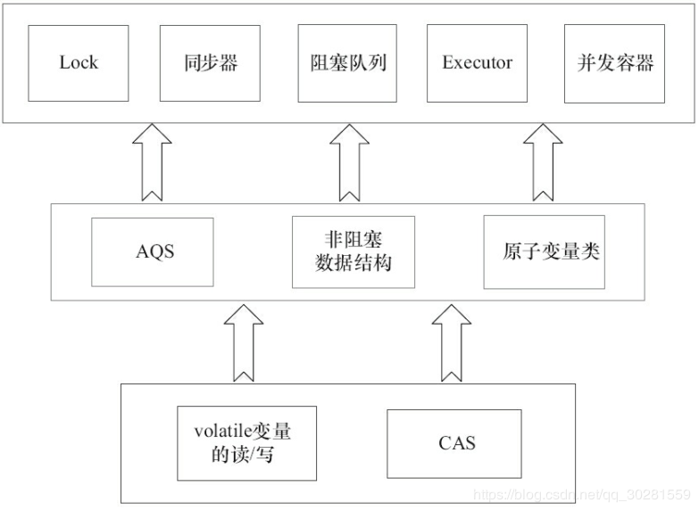

# 4 Java并发容器和框架

同步容器类都是线程安全的， 但在某些情况下可能需要额外的客户端加锁来保护复合操作。
容器上常见的复合操作包括： 迭代， 跳跃， 以及条件运算。  

## 4.1 concurrent包的实现

由于Java的CAS同时具有volatile读和volatile写的内存语义，因此Java线程之间的通信现在有了下面4种方式。
1）A线程写volatile变量，随后B线程读这个volatile变量。
2）A线程写volatile变量，随后B线程用CAS更新这个volatile变量。
3）A线程用CAS更新一个volatile变量，随后B线程用CAS更新这个volatile变量。
4）A线程用CAS更新一个volatile变量，随后B线程读这个volatile变量。

**concurrent包的源代码实现，是一个通用化的实现模式。**

- 首先，声明共享变量为volatile。

- 然后，使用CAS的原子条件更新来实现线程之间的同步。

- 同时，配合以volatile的读/写和CAS所具有的volatile读和写的内存语义来实现线程之间的通信

  > AQS，非阻塞数据结构、原子变量类，这些concurrent包中的基础类都是使用这种模式来实现的



## 4.1 ConcurrentHashMap的实现原理与使用
【基于1.8】https://juejin.im/post/5aeeaba8f265da0b9d781d16

在多线程环境下，使用HashMap进行put操作会引起死循环，是**因为多线程会导致HashMap的Entry链表形成环形数据结构，一旦形成环形数据结构，Entry的next节点永远不为空，就会产生死循环获取Entry**。

ConcurrentHashMap所使用的**锁分段技术（1.7)**：首先将数据分成一段一段地存储，然后给每一段数据配一把锁，当一个线程占用锁访问其中一个段数据的时候，其他段的数据也能被其他线程访问。

ConcurrentHashMap是由**Segment数组结构**和**HashEntry数组结构**组成。Segment是一种**可重入锁**（ReentrantLock），在ConcurrentHashMap里**扮演锁的角色**；HashEntry则用于**存储键值对数据**。一个ConcurrentHashMap里包含一个Segment数组。Segment的结构和HashMap类似，是一种**数组和链表结构**。一个Segment里**包含一个HashEntry数组**，每个**HashEntry是一个链表结构的元素**，每个Segment守护着一个HashEntry数组里的元素，当对HashEntry数组的数据进行修改时，必须首先获得与它对应的Segment锁。

segments数组的长度size是通过concurrencyLevel计算得出的。为了能通过按位与的散列算法来定位segments数组的索引，必须保证segments数组的长度是**2的N次方**

segment的容量threshold＝（int）cap*loadFactor，默认情况下initialCapacity等于`16`，loadfactor等于`0.75`

###  ConcurrentHashMap的操作
#### 1.get操作
Segment的get操作实现非常简单和高效。**先经过一次再散列，然后使用这个散列值通过散列运算定位到Segment，再通过散列算法定位到元素**

之所以进行再散列，目的是减少散列冲突，使元素能够均匀地分布在不同的Segment上，从而提高容器的存取效率

get操作的高效之处在于整个get过程不需要加锁，除非读到的值是空才会加锁重读。

它的get方法里将要使用的**共享变量都定义成volatile类型**，如用于统计当前Segement大小的count字段和用于存储值的HashEntry的value。定义成volatile的变量，能够在**线程之间保持可见性，能够被多线程同时读，并且保证不会读到过期的值，但是只能被单线程写**（有一种情况可以被多线程写，就是写入的值不依赖于原值），在get操作里只需要读不需要写共享变量count和value，所以可以不用加锁。

之所以不会读到过期的值，是因为根据Java内存模型的happen before原则，对volatile字段的写入操作先于读操作，即使两个线程同时修改和获取volatile变量，get操作也能拿到最新的值，这是用volatile替换锁的经典应用场景。

#### 2.put操作
由于put方法里需要对共享变量进行写入操作，所以为了线程安全，在**操作共享变量时必须加锁**。put方法首先定位到Segment，然后在Segment里进行插入操作。插入操作需要经历两个步骤，**第一步判断是否需要对Segment里的HashEntry数组进行扩容，第二步定位添加元素的位置，然后将其放在HashEntry数组里**。
（1）是否需要扩容
在插入元素前会先判断Segment里的HashEntry数组是否超过容量（threshold），如果超过阈值，则对数组进行扩容。值得一提的是，Segment的扩容判断比HashMap更恰当，因为<u>HashMap是在插入元素后判断元素是否已经到达容量的，如果到达了就进行扩容，但是很有可能扩容之后没有新元素插入，这时HashMap就进行了一次无效的扩容</u>。
（2）如何扩容
在扩容的时候，首先**会创建一个容量是原来容量两倍的数组，然后将原数组里的元素进行再散列后插入到新的数组里。为了高效，ConcurrentHashMap不会对整个容器进行扩容，而只对某个segment进行扩容。**

#### 3.size操作
如果要统计整个ConcurrentHashMap里元素的大小，就必须统计所有Segment里元素的大小后求和。Segment里的全局变量count是一个volatile变量，虽然可以相加每个Segment的count的最新值，但是可能<u>累加前使用的count发生了变化，那么统计结果就不准了。</u>

ConcurrentHashMap的做法是**先尝试2次通过不锁住Segment的方式来统计各个Segment大小（count值），如果统计的过程中，容器的count发生了变化，则再采用加锁的方式（把所有Segment的put、remove和clean方法全部锁住）来统计所有Segment的大小。**

ConcurrentHashMap是如何判断在统计的时候容器是否发生了变化呢？ **使用modCount变量**，在put、remove和clean方法里操作元素前都会将变量modCount进行加1，那么在统计size前后比较modCount是否发生变化，从而得知容器的大小是否发生变化。

## 4.2 ConcurrentLinkedQueue
【重要】https://juejin.im/post/5aeeae756fb9a07ab11112af
在并发编程中，有时候需要使用线程安全的队列。如果要实现一个线程安全的队列有两种方式：一种是使用阻塞算法，另一种是使用非阻塞算法。**使用阻塞算法的队列可以用一个锁（入队和出队用同一把锁）或两个锁（入队和出队用不同的锁）等方式来实现。非阻塞的实现方式则可以使用循环CAS的方式来实现。**

ConcurrentLinkedQueue是一个基于链接节点的无界线程安全队列，它采用先进先出的规则对节点进行排序，当我们添加一个元素的时候，它会添加到队列的尾部；当我们获取一个元素时，它会返回队列头部的元素。**它采用了“wait-free”算法（即CAS算法）来实现**

ConcurrentLinkedQueue 内部的队列使用单向链表方式实现，其中有**两个 volatile 类型的 Node 节点分别用来存放队列的首、尾节点** 。在 Node 节点内部则维护一个使用 volatile 修饰的变量 item，用来存放节点的值；volatile 修饰的变量 next用来存放链表的下一个节点，从而链接为一个单向无界链表。其 内部则使用 UNSafe 工具类提供的 CAS 算法来保证出入队时操作链表的原子性。

1. **入队列的过程**
   入队主要做两件事情：**第一是将入队节点设置成当前队列尾节点的下一个节点；第二是更新tail节点**，如果tail节点的next节点不为空，则将入队节点设置成tail节点，如果tail节点的next节点为空，则将入队节点设置成tail的next节点，所以tail节点不总是尾节点。
   

2. **定位尾节点**
   tail节点并不总是尾节点，所以每次入队都必须先通过tail节点来找到尾节点。尾节点可能是tail节点，也可能是tail节点的next节点。

3. **设置入队节点为尾节点**
   p.casNext（null，n）方法用于将入队节点设置为当前队列尾节点的next节点，如果p是null，表示p是当前队列的尾节点，如果不为null，表示有其他线程更新了尾节点，则需要重新获取当前队列的尾节点。

   > 让tail节点永远作为队列的尾节点，这样实现代码量非常少，而且逻辑清晰和易懂。但是，这么做有个缺点，每次都需要使用循环CAS更新tail节点。如果能减少CAS更新tail节点的次数，就能提高入队的效率，所以doug lea使用hops变量来控制并减少tail节点的更新频率，并不是每次节点入队后都将tail节点更新成尾节点，而是当tail节点和尾节点的距离大于等于常量HOPS的值（默认等于1）时才更新tail节点，tail和尾节点的距离越长，使用CAS更新tail节点的次数就会越少，但是距离越长带来的负面效果就是每次入队时定位尾节点的时间就越长，因为循环体需要多循环一次来定位出尾节点

4. **出队列**
   并不是每次出队时都更新head节点，当head节点里有元素时，直接弹出head节点里的元素，而不会更新head节点。只有当head节点里没有元素时，出队操作才会更新head节点。这种做法也是通过hops变量来减少使用CAS更新head节点的消耗，从而提高出队效率。

   首先获取头节点的元素，然后判断头节点元素是否为空，如果为空，表示另外一个线程已经进行了一次出队操作将该节点的元素取走，如果不为空，则使用CAS的方式将头节点的引用设置成null，如果CAS成功，则直接返回头节点的元素，如果不成功，表示另外一个线程已经进行了一次出队操作更新了head节点，导致元素发生了变化，需要重新获取头节点。

## 4.3 Java中的阻塞队列
阻塞队列（BlockingQueue）是一个支持两个附加操作的队列。这两个附加的操作支持阻塞的插入和移除方法。

1）支持阻塞的插入方法：意思是当队列满时，队列会阻塞插入元素的线程，直到队列不满。
2）支持阻塞的移除方法：意思是在队列为空时，获取元素的线程会等待队列变为非空。
两个附加操作提供了4种处理方式：


1.ArrayBlockingQueue
ArrayBlockingQueue是一个用数组实现的有界阻塞队列。此队列按照先进先出（FIFO）的原则对元素进行排序。默认情况下不保证线程公平的访问队列
2.LinkedBlockingQueue
LinkedBlockingQueue是一个用链表实现的有界阻塞队列。此队列的默认和最大长度为Integer.MAX_VALUE。此队列按照先进先出的原则对元素进行排序。
3.PriorityBlockingQueue
PriorityBlockingQueue是一个支持优先级的无界阻塞队列。默认情况下元素采取自然顺序升序排列。也可以自定义类实现compareTo()方法来指定元素排序规则
4.DelayQueue
DelayQueue是一个支持延时获取元素的无界阻塞队列。队列使用PriorityQueue来实现。队列中的元素必须实现Delayed接口，在创建元素时可以指定多久才能从队列中获取当前元素。只有在延迟期满时才能从队列中提取元素。
5.SynchronousQueue
SynchronousQueue是一个不存储元素的阻塞队列。每一个put操作必须等待一个take操作，否则不能继续添加元素。它支持公平访问队列。默认情况下线程采用非公平性策略访问队列。

###  阻塞队列的实现原理
使用**通知模式**实现。所谓通知模式，就是当生产者往满的队列里添加元素时会阻塞住生产者，当消费者消费了一个队列中的元素后，会通知生产者当前队列可用。

#### ArrayBlockingQueue
使用了Condition来实现   [https://juejin.im/post/5aeebdb26fb9a07aa83ea17e]

ArrayBlockingQueue的主要属性如下:

````java
/** The queued items */
final Object[] items;
 
/** items index for next take, poll, peek or remove */
int takeIndex;
 
/** items index for next put, offer, or add */
int putIndex;
 
/** Number of elements in the queue */
int count;
 
/*
 * Concurrency control uses the classic two-condition algorithm
 * found in any textbook.
 */
 
/** Main lock guarding all access */
final ReentrantLock lock;
 
/** Condition for waiting takes */
private final Condition notEmpty;
 
/** Condition for waiting puts */
private final Condition notFull;
````

从源码中可以看出ArrayBlockingQueue内部是采用**数组进行数据存储的（属性items）**，为了保证线程安全，采用的是`ReentrantLock lock`，为了保证可阻塞式的插入删除数据利用的是`Condition`，当获取数据的消费者线程被阻塞时会将该线程放置到notEmpty等待队列中，当插入数据的生产者线程被阻塞时，会将该线程放置到notFull等待队列中。而notEmpty和notFull等中要属性在构造方法中进行创建：

````java
public ArrayBlockingQueue(int capacity, boolean fair) {
    if (capacity <= 0)
        throw new IllegalArgumentException();
    this.items = new Object[capacity];
    lock = new ReentrantLock(fair);
    notEmpty = lock.newCondition();
    notFull =  lock.newCondition();
}
public void put(E e) throws InterruptedException {
    checkNotNull(e);
    final ReentrantLock lock = this.lock;
    lock.lockInterruptibly();
    try {
        while (count == items.length)
        notFull.await();
        insert(e);
    } finally {
        lock.unlock();
    }
}
public E take() throws InterruptedException {
    final ReentrantLock lock = this.lock;
    lock.lockInterruptibly();
    try {
        while (count == 0)
        notEmpty.await();
        return extract();
    } finally {
        lock.unlock();
    }
}
private void insert(E x) {
    items[putIndex] = x;
    putIndex = inc(putIndex);
    ++count;
    notEmpty.signal();
}
````

#### LinkedBlockingQueue

LinkedBlockingQueue的主要属性有：

`````java
/** Current number of elements */
private final AtomicInteger count = new AtomicInteger();
 
/**
 * Head of linked list.
 * Invariant: head.item == null
 */
transient Node<E> head;
 
/**
 * Tail of linked list.
 * Invariant: last.next == null
 */
private transient Node<E> last;
 
/** Lock held by take, poll, etc */
private final ReentrantLock takeLock = new ReentrantLock();
 
/** Wait queue for waiting takes */
private final Condition notEmpty = takeLock.newCondition();
 
/** Lock held by put, offer, etc */
private final ReentrantLock putLock = new ReentrantLock();
 
/** Wait queue for waiting puts */
private final Condition notFull = putLock.newCondition();
`````

可以看出与ArrayBlockingQueue主要的区别是，LinkedBlockingQueue在**插入数据和删除数据时分别是由两个不同的lock（takeLock和putLock）来控制线程安全的**，因此，也由这两个lock生成了两个对应的condition（notEmpty和notFull）来实现可阻塞的插入和删除数据。并且，采用了**链表的数据结构来实现队列**

**ArrayBlockingQueue与LinkedBlockingQueue的比较**
相同点：ArrayBlockingQueue和LinkedBlockingQueue都是通过**condition通知机制**来实现可阻塞式插入和删除元素，并满足线程安全的特性；

不同点：1. ArrayBlockingQueue底层是采用的数组进行实现，而LinkedBlockingQueue则是采用链表数据结构； 2. ArrayBlockingQueue插入和删除数据，只采用了一个lock，而LinkedBlockingQueue则是在插入和删除分别采用了putLock和takeLock，<u>这样可以降低线程由于线程无法获取到lock而进入WAITING状态的可能性，从而提高了线程并发执行的效率。</u>
## 4.4 CopyOnWriteArrayList解读
https://juejin.im/post/5aeeb55f5188256715478c21 
由于读操作根本不会修改原有的数据，因此对于每次读取都进行加锁其实是一种资源 浪费。我们应该允许多个线程同时访问List的内部数据，毕竟读取操作是安全的。根据读写锁的思想，读锁和读锁之间确实也不冲突。但是，读操作会受到写操作的阻碍，当写发 生时，读就必须等待，否则可能读到不一致的数据。同理，当读操作正在进行时，程序也 不能进行写入。
为了将读取的性能发挥到极致，JDK中提供了CopyOnWriteArrayList类。对它来说， **读取是完全不用加锁的**，并且更好的消息是：**写入也不会阻塞读取操作**。**只有写入和写入 之间需要进行同步等待**。这样，读操作的性能就会大幅度提升。

 CopyOnWrite就是在写入操作时，进行一次**自我 复制**。换句话说，当这个List需要修改时，我并不修改原有的内容（这对于保证当前在读 线程的数据一致性非常重要），而是对原有的数据进行一次复制，将修改的内容写入副本 中。写完之后，再用修改完的副本替换原来的数据，这样就可以保证写操作不会影响读了。


每个 CopyOnWriteArrayList 对象里面有一个**volatile修饰的array 数组对象**用来存放具体元素（这里仅仅是修饰的是数组引用）， **ReentrantLock 独占锁对 象**用来保证同一时刻只有一个写线程正在进行数组的复制 。

CopyOnWriteArrayList 中迭代器的弱一致性是怎么回事 ， 所谓弱一致性是指返回迭代器后，其他线程对 list 的增删改对迭代器是不可见的 。

**当调用 iterator() 方法获取法代器时实 际上会返 回 一个 COWiterator 对象 ， COWiterator 对象 的 snapshot 变量保存了当 前 list 的内 容 ， cursor 是遍历 list 时数据 的下标。**
为什么说 snapshot 是 list 的 快照呢？明明是指针传递 的引用啊，而不是副本。 如果在该线程使用 返回 的法代器遍历元素 的过程 中， 其他线程没有对 list 进行增删 改，那么snapshot 本 身就是 list 的 array ， 因 为它 们 是 引 用关系。但是**如果在遍历期间 其他线程对 该list 进行了 增删 改 ，那么 snapshot 就是快照了，因为增删 改后 list 里面的 数组被新数组替 换 了 ，这时候老数组被 snapshot 引用** 。这也说明获取迭代器后 ， 使用 该法代器元素时， 其他线程对该 list 进行的增删改不可见，因为它们操作的是两个不同的数组 ， 这就是**弱一致性** 。

CopyOnWriteArrayList 使用**写时复制的策略**来保证 list 的一致性，而获取一修改一写入三步操作并不是原子性的，所以在增删改的过程中都使用了独占锁，来保证在某个时间只有一个线程能对 list 数组进行修改 。 另外 CopyOnWriteAn·ayList 提供了弱 一致性的法代器 ， 从而保证在获取迭代器后，其他线程对 list 的修改是不可见的， 迭代器遍历的数组是一个快照 。 另外， CopyOnWriteArraySet 的底层就是使用它实现的
## 4.5 并发容器之ThreadLocal
https://juejin.im/post/5aeeb22e6fb9a07aa213404a
### set（T value）
set方法设置在当前线程中threadLocal变量的值，该方法的源码为：

```java
public void set(T value) {
	//1. 获取当前线程实例对象
    Thread t = Thread.currentThread();
	//2. 通过  当前线程实例  获取到  ThreadLocalMap对象
    ThreadLocalMap map = getMap(t);
    if (map != null)
	//3. 如果Map不为null,则以  当前threadLocl实例为key,值为value  存入ThreadLocalMap对象
        map.set(this, value);
    else
		//4.map为null,则新建ThreadLocalMap并存入value
        createMap(t, value);
}
```

方法的逻辑很清晰，具体请看上面的注释。通过源码我们知道**value是存放在了ThreadLocalMap里**了，当前先把它理解为一个普普通通的map即可，也就是说，数据value是真正的存放在了ThreadLocalMap这个容器中了，并且是**以当前threadLocal实例为key**。先简单的看下ThreadLocalMap是什么，有个简单的认识就好，下面会具体说的。

首先ThreadLocalMap是怎样来的？源码很清楚，是通过getMap(t)进行获取：

```java
ThreadLocalMap getMap(Thread t) {
    return t.threadLocals;
}
```

该方法直接返回的就是当前线程对象t的一个成员变量threadLocals：

```java
/* ThreadLocal values pertaining to this thread. This map is maintained
 * by the ThreadLocal class. */
ThreadLocal.ThreadLocalMap threadLocals = null;
```

也就是说**ThreadLocalMap的引用是作为Thread的一个成员变量，被Thread进行维护的**。回过头再来看看set方法，当map为Null的时候会通过`createMap(t,value)`方法：

```java
void createMap(Thread t, T firstValue) {
    t.threadLocals = new ThreadLocalMap(this, firstValue);
}
```

该方法就是**new一个ThreadLocalMap实例对象**，然后同样以当前threadLocal实例作为key,值为value存放到threadLocalMap中，然后**将当前线程对象的threadLocals赋值为threadLocalMap**。

现在来对set方法进行总结一下： **通过当前线程对象thread获取该thread所维护的threadLocalMap,若threadLocalMap不为null,则以threadLocal实例为key,值为value的键值对存入threadLocalMap,若threadLocalMap为null的话，就新建threadLocalMap然后在以threadLocal为键，值为value的键值对存入即可。**

### T get()

**get方法是获取当前线程中threadLocal变量的值**，同样的还是来看看源码：

```java
public T get() {
	//1. 获取当前线程的实例对象
    Thread t = Thread.currentThread();
	//2. 获取当前线程的threadLocalMap
    ThreadLocalMap map = getMap(t);
    if (map != null) {
		//3. 获取map中当前threadLocal实例为key的值的entry
        ThreadLocalMap.Entry e = map.getEntry(this);
        if (e != null) {
            @SuppressWarnings("unchecked")
			//4. 当前entitiy不为null的话，就返回相应的值value
            T result = (T)e.value;
            return result;
        }
    }
	//5. 若map为null或者entry为null的话通过该方法初始化，并返回该方法返回的value
    return setInitialValue();
}
```

### ThreadLocal内存泄漏问题

https://www.jianshu.com/p/dde92ec37bd1