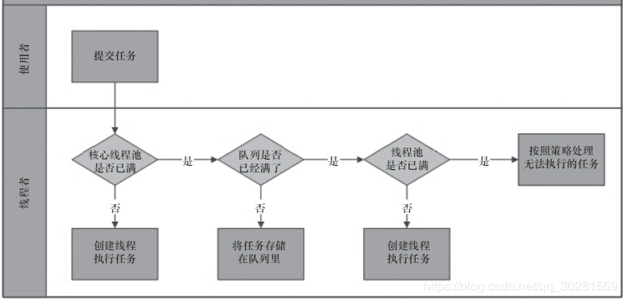

# 7 Java中的线程池

引入原因

1. 任务处理过程从主线程中分离出来， 使得主循环能够更快地重新等待下一个到来的连接，使得任务在完成前面的请求之前可以接受新的请求， 从而提高响应性。
2. 任务可以并行处理， 从而能同时服务多个请求。 如果有多个处理器， 或者任务由于某种原因被阻塞， 程序的吞吐量将得到提高。
3. 任务处理代码必须是线程安全的， 因为当有多个任务时会并发地调用这段代码。

无限制创建线程的不足：(解决方式： 线程池 Executor 框架)

1. 线程生命周期的开销非常高
2. 资源消耗
3. 稳定性

使用线程池的好处：

1. 降低资源消耗
2. 提高响应速度
3. 提高线程的可管理性  

线程池提供了一个线程队列，队列中保存着所有等待状态的线程，避免了创建于销毁的额外开销，提高了响应速度。

## 7.1 Executor框架-异步执行服务

Java的线程既是工作单元，也是执行机制。从JDK 5开始，把**工作单元与执行机制**分离开来。**工作单元包括Runnable和Callable，而执行机制由Executor框架提供。**异步执行的结果用Future封装获取。

### Executor框架的两级调度模型

在HotSpot VM的线程模型中，**Java线程（java.lang.Thread）被一对一映射为本地操作系统线程**。Java线程启动时会创建一个本地操作系统线程；当该Java线程终止时，这个操作系统线程也会被回收。操作系统会调度所有线程并将它们分配给可用的CPU。

**在上层，Java多线程程序通常把应用分解为若干个任务，然后使用用户级的调度器（Executor框架）将这些任务映射为固定数量的线程；在底层，操作系统内核将这些线程映射到硬件处理器上**。这就是两级调度模型。从图中可以看出，**应用程序通过Executor框架控制上层的调度；而下层的调度由操作系统内核控制，下层的调度不受应用程序的控制。**


### 1.Executor框架的结构

`Executors `是 一 个 工 厂 类 ， 可 以 创 建 **3 种 类 型 的 ThreadPoolExecutor 和 2 种 类 型 的ScheduledThreadPool**。  

- java.util.concurrent.Executor:负责线程的使用与调度的根接口
  - `ExecutorService `子接口：线程池的主要接口
    - ThreadPoolExecutor 线程池的实现类
  - `ScheduledExecutorService `子接口：负责线程的调度
    - ScheduledThreadPoolExecutor:继承ThreadPoolExecutor,实现ScheduledExecutorService

1. **任务**;包括被执行任务需要实现的接口：**Runnable接口或Callable接口**。
2. **任务的执行**;包括任务执行机制的核心接口Executor，以及继承自Executor的ExecutorService接口。Executor框架有两个关键类实现了ExecutorService接口（ThreadPoolExecutor和ScheduledThreadPoolExecutor）。
3. **异步计算的结果**;包括接口Future和实现Future接口的FutureTask类。
   

### 2.Executor框架的成员

Executor框架的主要成员：**ThreadPoolExecutor、ScheduledThreadPoolExecutor、Future接口、Runnable接口、Callable接口和Executors。**

> #### **ThreadPoolExecutor**
>
> - SingleThreadExecutor。创建使用单个线程的线程池，**多任务下任务排队**。
>   - 只使用一个线程，使用无界队列LinkedBlockingQueue，线程创建后不会超时终止，该线程顺序执行所有任务。该线程池适用于需要确保所有任务被顺序执行的场合。
> - FixedThreadPool。创建使用固定线程数的线程池，**核心线程数和最大线程数相等**
>   - 使用固定数目的n个线程，使用无界队列LinkedBlockingQueue，线程创建后不会超时终止，任务多时候排队
> - CachedThreadPool。创建一个大小无界的线程池，通常会创建与所需数量相同的线程，然后在他回收旧线程时候停止创建新线程
>   - 它的corePoolSize为0, maximumPoolSize为Integer.MAⅩ_VALUE,keepAliveTime是60秒，队列为SynchronousQueue。它的含义是：当新任务到来时，如果正好有空闲线程在等待任务，则其中一个空闲线程接受该任务，否则就总是创建一个新线程，**创建的总线程个数不受限制**，对任一空闲线程，如果60秒内没有新任务，就终止。
>
> ##### 应该使用newFixedThreadPool还是newCachedThreadPool呢？
>
> **在系统负载很高的情况下**，newFixedThreadPool可以通过队列对新任务排队，保证有足够的资源处理实际的任务，而newCachedThreadPool会为每个任务创建一个线程，导致创建过多的线程竞争CPU和内存资源，使得任何实际任务都难以完成，这时， **newFixedThreadPool更为适用**。
>
> 不过，**如果系统负载不太高**，单个任务的执行时间也比较短，**newCachedThreadPool的效率可能更高**，因为任务可以不经排队，直接交给某一个空闲线程。
>
> 在系统负载可能极高的情况下，两者都不是好的选择，newFixedThreadPool的问题是队列过长，而newCachedThreadPool的问题是线程过多，这时，应根据具体情况自定义ThreadPoolExecutor，传递合适的参数。

> #### **ScheduledThreadPoolExecutor**
>
> - ScheduledThreadPoolExecutor适用于需要多个后台线程执行周期任务，同时为了满足资源管理的需求而需要限制后台线程的数量的应用场景。
> - SingleThreadScheduledExecutor适用于需要单个后台线程执行周期任务，同时需要保证顺序地执行各个任务的应用场景

> #### **Future接口**
>
> - Future接口和实现Future接口的FutureTask类用来表示异步计算的结果，返回一个FutureTask对象
>
> #### **Runnable接口和Callable接口**
>
> - Runnable接口和Callable接口的实现类，都可以被ThreadPoolExecutor或ScheduledThreadPoolExecutor执行。它们之间的区别Runnable不会返回结果，而Callable可以返回结果`Future<T> res = executor.submin(Callable)`,使用`res.get()`方法获取结果。

## 7.2 ThreadPoolExecutor



> 刚创建一个线程池后，实际上并不会创建任何线程。
>
> 有新任务到来的时候，如果当前线程个数小于corePoolSiz，就会创建一个新线程来执行该任务，需要说明的是，即使其他线程现在也是空闲的，也会创建新线程。
>
> 不过，如果线程个数大于等于corePoolSiz，那就不会立即创建新线程了，它会先尝试排队，需要强调的是，它是“尝试”排队，而不是“阻塞等待”入队
>
> 如果队列满了或其他原因不能立即入队，它就不会排队，而是检查线程个数是否达到了maximumPoolSize，如果没有，就会继续创建线程，直到线程数达到maximumPoolSize。


### **创建线程池**

`new ThreadPoolExecutor(corePoolSize, maximumPoolSize, keepAliveTime,milliseconds,threadFactory,runnableTaskQueue, handler);`

1. corePoolSize（线程池的核心线程数）
2. maximumPoolSize（线程池最大数量）
3. keepAliveTime（线程活动保持时间）当线程池中的线程个数大于corePoolSize时额外空闲线程的存活时间。
4. milliseconds（存活时间单位）
5. ThreadFactory：用于设置创建线程的工厂
6. runnableTaskQueue（任务队列）ThreadPoolExecutor要求的队列类型是阻塞队列BlockingQueue
   1. ArrayBlockingQueue： 基于数组的有界阻塞队列， FIFO
   2. LinkedBlockingQueue ： 基于链表的无界阻塞队列 ，FIFO ，吞吐量高于ArrayBlockingQueue， Executors.newFixedThreadPoll()使用了这个队列
   3. SynchronousQueue： 一个只存储一个元素的阻塞队列， 每个插入操作必须等到另一个线程调用移除操作， 否则插入一直处于阻塞状态， 吞吐量高于 LinkedBlockingQueue，Executors#newCachedThreadPoll()使用了这个队列
   4. PriorityBlockingQueue： 具有优先级的无界阻塞队列  
7. RejectedExecutionHandler（==饱和策略==）
   1. ==AbortPolicy：丢弃并抛出异常==。
   2. ==CallerRunsPolicy：在任务提交者线程中执行任务，而不是交给线程池中的线程执行==。
   3. ==DiscardOldestPolicy：将队列中等待时间最长的任务丢掉，并执行当前任务==。
   4. ==DiscardPolicy：丢弃不抛异常==

注意：

1. 只有当任务都是同类型并且相互独立时， 线程池的性能才能达到最佳。 如果将运行时间较长的与运行时间较短的任务混合在一起， 那么除非线程池很大， 否则将可能造成拥塞。 如果提交的任务依赖于其他任务， 那么除非线程池无限大， 否则将可能造成死锁。 幸运的是，在基于网络的典型服务器应用程序中——web 服务器、 邮件服务器、 文件服务器等， 它们的请求通常都是同类型的并且相互独立的。
2. 设置线程池的大小：基于` Runtime.getRuntime().avialableprocessors() `进行动态计算
   1. 对于**计算密集型的任务**， 在 N 个处理器的系统上， 当线程池为 N+1 时， 通过能实现最优的利用率（缺页故障等暂停时额外的线程也能确保 CPU 时钟周期不被浪费） 。
   2. 对于**包含 IO 操作或者其他阻塞操作的任务**， 由于线程并不会一直执行， 因此线程池的规模应该更大， 比如 2*N。 
      要正确地设置线程池的大小， 你必须估算出任务的等待时间与计算时间的比值。 线程等待时间所占比例越高， 需要越多线程。 线程 CPU 时间所占比例越高， 需要越少线程。 这种估算不需要很精确， 而且可以通过一些分析或监控工具来获得。 你还可以通过另一种方法来调节线程池的大小： 在某个基准负载下， 分别设置不同大小的线程池来运行应用程序， 并观察 CPU 利用率。
      最佳线程数目 = （线程等待时间与线程计算时间之比 + 1） * CPU 数目  
3. A.核心线程不会预先创建，只有当有任务时才会创建。B.核心线程不会因为空闲而被终止，keepAliveTime参数不适用于它。
4. 线程的创建与销毁
   基本大小也就是线程池的目标大小， 即在没有任务执行时线程池的大小， 并且只有在工作队列满了的情况下才会创建超出这个数量的线程。 线程池的最大大小表示可同时活动的线程数量的上限。 如果某个线程的空闲时间超过了存活时间， 那么将被标记为可回收的， 并且当线程池的当前大小超过了基本大小时， 这个线程将被终止。
5. 管理队列任务
   ThreadPoolExecutor 允许提供一个 BlockingQueue 来保存等待执行的任务。 基本的任务排队方法有 3 种： 无界队列、 有界队列和同步移交。
   一种稳妥的资源管理策略是使用有界队列， 有界队列有助于避免资源耗尽的情况发生， 但又带来了新的问题： 当队列填满后， 新的任务该怎么办？
6. 饱和策略
   当有界队列被填满后， 饱和策略开始发挥作用。 ThreadPoolExecutor 的饱和策略可以通过setRejectedExecutionHandler 来修改。 JDK 提供了几种不同的 RejectedExecutionHandler 的实现， 每种实现都包含有不同的饱和策略： AbortPolicy、 CallerRunsPolicy、 DiscardPolicy、DiscardOldestPolicy。
   1. 中止策略是默认的饱和策略， 该策略将抛出未检查的 RejectedExecutionException。 调用者可以捕获这个异常， 然后根据需求编写自己的处理代码。
   2. 当新提交的任务无法保存到队列中执行时， 抛弃策略会悄悄抛弃该任务。
   3. 抛弃最旧的策略则会抛弃下一个将被执行的任务， 然后尝试重新提交下一个将被执行的任务（如果工作队列是一个优先级队列， 那么抛弃最旧的将抛弃优先级最高的任务）
   4. 调用者运行策略实现了一种调节机制， 该策略既不会抛弃任务， 也不会抛出异常， 而是将某些任务回退给调用者， 从而降低新任务的流量。 它不会在线程池的某个线程中执行新提交的任务， 而是在一个调用了 execute 的线程中执行该任务。 为什么好？ 因为当服务器过载时， 这种过载情况会逐渐向外蔓延开来——从线程池到工作队列到应用程序再到 TCP 层，最终达到客户端， 导致服务器在高负载下实现一种平缓的性能降低。
   5. 线程工厂
      在许多情况下都需要使用定制的线程工厂方法。 例如， 你希望为线程池中的线程指定一个UncaughtExceptionHandler， 或者实例化一个定制的 Thread 类用于执行调试信息的记录，你还可能希望修改线程的优先级（虽然不提倡这样做） ， 或者只是给线程取一个更有意义的名字， 用来解释线程的转储信息和错误日志。
   6. 在调用构造函数后再定制 ThreadPoolExecutor  

### **向线程池提交任务**

- execute()方法用于提交**不需要返回值**的任务，所以无法判断任务是否被线程池执行成功。
- submit()方法用于提交**需要返回值**的任务。线程池会返回一个**future类型的对象**，通过这个future对象可以判断任务是否执行成功，并且可以通过**future的get()方法来获取返回值**，get()方法会阻塞当前线程直到任务完成，而使用`get（long timeout，TimeUnit unit）`方法则会阻塞当前线程一段时间后立即返回，这时候有可能任务没有执行完。

### **关闭线程池**

可以通过调用ExecutorService 的`shutdown`或`shutdownNow`方法来关闭线程池。它们的<u>原理是遍历线程池中的工作线程，然后逐个调用线程的interrupt方法来中断线程，所以无法响应中断的任务可能永远无法终止</u>。但是它们存在一定的区别

- shutdown只是将线程池的状态设置成SHUTDOWN状态，然后**中断所有没有正在执行任务的线程**。（**表示不再接受新任务，并且完成已经提交的任务**）
- shutdownNow不仅不接受新任务，而且会终止已提交但尚未执行的任务，对于正在执行的任务，一般会调用线程的interrupt方法尝试中断，不过，线程可能不响应中断，shutdownNow会返回已提交但尚未执行的任务列表。

shutdown和shutdownNow不会阻塞等待，它们返回后不代表所有任务都已结束，不过isShutdown方法会返回true。调用者可以通过awaitTermination等待所有任务结束，它可以限定等待的时间，如果超时前所有任务都结束了，即isTerminated方法返回true，则返回true，否则返回false。


ExecutorService有两组批量提交任务的方法：invokeAll和invokeAny，它们都有两个版本，其中一个限定等待时间。invokeAll等待所有任务完成，返回的Future列表中，每个Future的isDone方法都返回true，不过isDone为true不代表任务就执行成功了，可能是被取消了。

- invokeAll可以指定等待时间，如果超时后有的任务没完成，就会被取消。
- 对于invokeAny，只要有一个任务在限时内成功返回了，它就会返回该任务的结果，其他任务会被取消；如果没有任务能在限时内成功返回，抛出TimeoutException；如果限时内所有任务都结束了，但都发生了异常，抛出ExecutionException。


处理非正常的线程终止（只对 execute 提交的任务有效， submit 提交的话会在 future.get 时将受检异常直接抛出）
要为线程池中的所有线程设置一个 UncaughtExceptionHandler， 需要为 ThreadPoolExecutor的构造函数提供一个 ThreadFactory。 标准线程池允许当发生未捕获异常时结束线程， 但由于使用了一个 try-finally 块来接收通知， 因此当线程结束时， 将有新的线程来代替它。 如果没有提供捕获异常处理器或者其他的故障通知机制， 那么任务会悄悄失败， 从而导致很大的混乱。 如果你希望在任务由于发生异常而失败时获得通知， 并且执行一些特定于任务的恢复操 作 ， 那 么 可 以 将 任 务 封 装 在 能 捕 获 异 常 的 Runnable 或 Callable 中 ， 或 者 改 写ThreadPoolExecutor 的 afterExecute 方法。

只有通过 execute 提交的任务， 才能将它抛出的异常交给未捕获异常处理器。 如果一个由submit 提 交的 任 务 由于 抛 出 了异 常 而 结束 ， 那 么这 个 异 常将 被 Future.get 封 装 在ExecutionException 中重新抛出  


## 7.3 定时任务

在Java中，主要有两种方式实现定时任务：

- 使用java.util包中的Timer和TimerTask。
- 使用Java并发包中的ScheduledExecutorService。

### Timer和TimerTask

`TimerTask`表示一个**定时任务**，它是一个抽象类，实现了Runnable，具体的定时任务需要继承该类，实现run方法。

`Timer`是一个具体类，它负责定时**任务的调度和执行**,主要方法有：

```java
//在指定绝对时间time运行任务task
public void schedule(TimerTask task,Date time)
//在当前时间延时delay毫秒后运行任务task
public void schedule(TimerTask task,long delay)
//固定延时重复执行，第一次计划执行时间为firstTime，后一次的计划执行时间为前一次"实际"执行时间加上period
public void schedule(TimerTask task,Date firstTime,long period)
//同样是固定延时重复执行，第一次执行时间为当前时间加上delay
public void schedule(TimerTask task,long delay,long period)
    
//固定频率重复执行，第一次计划执行时间为firstTime，后一次的计划执行时间为前一次"计划”执行时间加上period
public void scheduleAtFixedRate(TimerTask task,Date firstTime,long period)
//固定频率重复执行，第一次计划执行时间为firstTime，后一次的计划执行时间为前一次"计划”执行时间加上period
public void scheduleAtFixedRate(TimerTask task,Date firstTime,long period)
//同样是固定频率重复执行，第一次计划执行时间为当前时间加上delay
public void scheduleAtFixedRate(TimerTask task,long delay,1ong period)

```

> 需要注意固定延时（fixeddelay）与固定频率（fixedrate）的区别，二者都是重复执行，但后一次任务执行相对的时间是不一样的，对于固定延时，它是基于上次任务的“实际”执行时间来算的，如果由于某种原因，上次任务延时了，则本次任务也会延时，而固定频率会尽量补够运行次数。

> ```java
> public class BasicTimer{
> 	static class DelayTask extends TimerTask{
> 	@Override
> 	public void run(){
> 		System.out.print1n("delayed task");
>    }
> 	public static void main(String[] args)throws InterruptedException{
> 		Timer timer = new Timer();
> 		timer.schedule(new DelayTask(),1000);
> 		Thread.sleep(2000);
> 		timer.cancel();
> 	}
> }
> ```
>
> 

-------

原理：

Timer内部主要由**任务队列**和**Timer线程**两部分组成。任务队列是一个基于堆实现的优先级队列，按照下次执行的时间排优先级。Timer线程负责执行所有的定时任务，需要强调的是，一个Timer对象只有一个Timer线程

Timer线程主体是一个循环，从队列中获取任务，如果队列中有任务且计划执行时间小于等于当前时间，就执行它，如果队列中没有任务或第一个任务延时还没到，就睡眠。如果睡眠过程中队列上添加了新任务且新任务是第一个任务，Timer线程会被唤醒，重新进行检查。

在执行任务之前，Timer线程判断任务是否为周期任务，如果是，就设置下次执行的时间并添加到优先级队列中，**对于固定延时的任务，下次执行时间为当前时间加上period，对于固定频率的任务，下次执行时间为上次计划执行时间加上period**。

需要强调是，下次任务的计划是在执行当前任务之前就做出了的，**对于固定延时的任务，延时相对的是任务执行前的当前时间**，而不是任务执行后，这与后面讲到的ScheduledExecutorService的固定延时计算方法是不同的，后者的计算方法更合乎一般的期望。**对于固定频率的任务，延时相对的是最先的计划**，所以，很有可能会出现一下子执行很多次任务的情况。

> #### 注意：
>
> **一个Timer对象只有一个Timer线程**，这意味着，定时任务不能耗时太长，更不能是无限循环。
>
> 固定频率的任务被延迟后，可能会立即执行多次，将次数补够；
>
> 固定延时任务的延时相对的是任务执行前的时间；
>
> 在执行任何一个任务的run方法时，一旦run抛出异常，Timer线程就会退出，从而所有定时任务都会被取消。

### ScheduledExecutorService

ScheduledExecutorService是一个接口，其定义为：

```java
public interface ScheduledExecutorService extends ExecutorService{
	//单次执行，在指定延时delay后运行command
	public ScheduledFuture<?> schedule(Runnable command,long delay,TimeUnit unit);
  //单次执行，在指定延时delay后运行callable
	public <V>ScheduledFuture<V> schedule(Callable<V>callable，long delay,TimeUnit unit);
	//定频率重复执行
	public ScheduledFuture<?> scheduleAtFixedRate(Runnable command,long initialDelay,long period,TimeUnit unit);
	//固定延时重复执行
	public ScheduledFuture<?> scheduleWithFixedDelay(Runnable command,long initialDelay,long delay,TimeUnit unit);
}
```

它们的返回类型都是ScheduledFuture，它是一个接口，扩展了Future和Delayed，没有定义额外方法。这些方法的大部分语义与Timer中的基本是类似的。

- 对于固定频率的任务，第一次执行时间为initialDelay后，第二次为initialDelay+period，第三次为initial-Delay+2*period，以此类推。
- 对于固定延时的任务，它是从任务执行后开始算的，第一次为initialDelay后，第二次为第一次任务执行结束后再加上delay。与Timer不同，它不支持以绝对时间作为首次运行的时间。

ScheduledExecutorService的主要实现类是`ScheduledThreadPoolExecutor`，它是线程池ThreadPoolExecutor的子类

-----

原理：

ScheduledThreadPoolExecutor的实现思路与Timer基本是类似的，都有一个基于堆的优先级队列，保存待执行的定时任务，它的主要不同是：

1. 它的背后是线程池，可以有多个线程执行任务。
2. 它在任务执行后再设置下次执行的时间，对于固定延时的任务更为合理。
3. 任务执行线程会捕获任务执行过程中的所有异常，一个定时任务的异常不会影响其他定时任务，不过，发生异常的任务（即使是一个重复任务）不会再被调度。