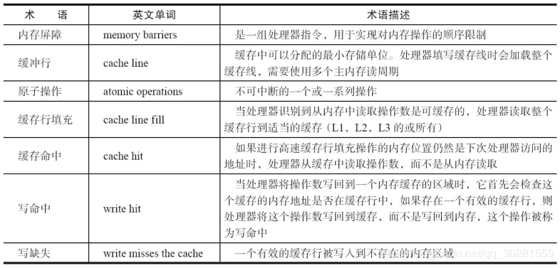
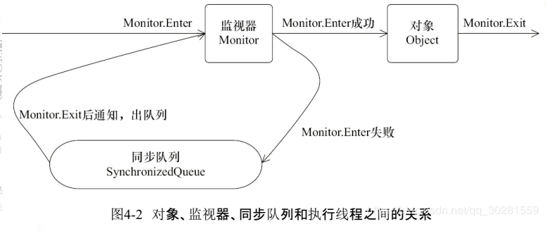

# 2.Java并发机制的底层实现原理

**CPU术语**：



## 2.1 volatile
**作用**：保证可见性、 不会引起线程上下文的切换和调度

**定义**：Java编程语言允许线程访问共享变量，为了确保共享变量能被准确和一致地更新，线程应该确保通过排他锁单独获得这个变量。

 **实现原理**：对声明了volatile的变量进行写操作，JVM就会向处理器发送一条**Lock前缀的指令**，将这个变量所在缓存行的数据写回到系统内存。 每个处理器按照**缓存一致性协议**，通过嗅探在总线上传播的数据来检查自己缓存的值是不是过期了。

**Lock前缀的指令**在多核处理器下会引发了两件事情。
	1）将当前处理器缓存行的数据写回到系统内存。
	2）这个写回内存的操作会使在其他CPU里缓存了该内存地址的数据无效。

**volatile的两条实现原则**
	1）Lock前缀指令会引起处理器缓存回写到内存。
	2）一个处理器的缓存回写到内存会导致其他处理器的缓存无效。

## 2.2 synchronized的实现原理与应用
利用synchronized实现同步的基础：**Java中的每一个对象都可以作为锁**。具体表现为以下3种形式。

- 对于普通同步方法，锁是当前实例对象。
- 对于静态同步方法，锁是当前类的Class对象。
- 对于同步方法块，锁是Synchonized括号里配置的对象。

**Synchonized在JVM里的实现原理**：
JVM基于进入和退出Monitor对象来实现方法同步和代码块同步，但两者的实现细节不一样。
**代码块同步**是使用monitorenter和monitorexit指令实现的
**方法同步**是使用另外一种方式实现的，细节在JVM规范里并没有详细说明。但是，方法的同步同样可以使用这两个指令来实现
monitorenter指令是在编译后插入到同步代码块的开始位置，而monitorexit是插入到方法结束处和异常处，JVM要保证每个monitorenter必须有对应的monitorexit与之配对。
任何对象都有一个`monitor`与之关联，当且一个monitor被持有后，它将处于锁定状态。**线程执行到monitorenter指令时，将会尝试获取对象所对应的monitor的所有权，即尝试获得对象的锁。**

> 任意一个对象都拥有自己的监视器，当这个对象由同步块或者这个对象的同步方法调用时，执行方法的线程必须先获取到该对象的监视器才能进入同步块或者同步方法，而没有获取到监视器（执行该方法）的线程将会被阻塞在同步块和同步方法的入口处，进入BLOCKED状态。
> 任意线程对Object（Object由synchronized保护）的访问，首先要获得Object的监视器。如果获取失败，线程进入**同步队列**，线程状态变为BLOCKED。当访问Object的前驱（获得了锁的线程）释放了锁，则该释放操作唤醒阻塞在同步队列中的线程，使其重新尝试对监视器的获取。



 

## 2.2.1 Java对象头
synchronized用的锁（一般我们也将其称为**监视器monitor**）是**存在Java对象头里的**。如果对象是数组类型，则虚拟机用3个字宽（Word = 32/64bit）存储对象头，如果对象是非数组类型，则用2字宽存储对象头。


Java对象头里的Mark Word里默认存储对象的HashCode、分代年龄和**锁标记位**。


在运行期间，Mark Word里存储的数据会随着锁标志位的变化而变化。Mark Word可能变化为存储以下4种数据


## 2.2.2 锁的升级与对比
锁一共有4种状态，级别从低到高依次是：**无锁状态、偏向锁状态、轻量级锁状态、重量级锁状态**，这几个状态会随着竞争情况逐渐升级。锁可以升级但不能降级。

### 1.偏向锁

**偏向锁原理**：
当一个线程访问同步块并获取锁时，会通过**CAS(Compare And Swap)**来尝试将对象头中的 Thread ID字段设置为自己的线程号，如果设置成功，则获得锁，以后该线程在进入和退出同步块时不需要进行CAS操作来加锁和解锁，只需**简单地检测MarkWord中存储的threadID和当前访问的线程的threadID是否相等**，如果相等，表示当前线程已经获得了偏向锁，则不需要再获得锁直接执行同步代码；如果不相等，则尝试使用CAS将对象头的偏向锁指向当前线程，升级为轻量级锁。

**偏向锁的撤销**
偏向锁使用了一种**等到竞争出现才释放锁的机制**，所以当其他线程尝试竞争偏向锁时，持有偏向锁的线程才会释放锁。

- 需要等待全局安全点（在这个时间点上没有正在执行的字节码）
- 它会首先暂停拥有偏向锁的线程，然后检查持有偏向锁的线程是否活着
- 如果线程处于死亡状态，则将对象头设置成无锁状态，其他直接去尝试获得锁（根据是否允许重偏向（rebiasing），获得偏向锁或者轻量级锁）；
- 如果线程仍然活着，那么锁升级为轻量级锁，其他线程自旋请求获得锁

````java
// 撤销流程的伪代码，在全局检查点执行该操作
if mark word 存储的不是可偏向状态:
    return;     // 如果不是偏向锁，那么没有撤销偏向的必要
else:
    if Thread ID 指向的线程不存活:
        if 允许重偏向:
            退回可偏向但未偏向的状态   // Thread ID为0
        else:
            偏向撤销，变为无锁状态
    else:
        if Thread ID 指向的线程，仍然拥有锁:
            升级为轻量级锁，将mark word复制到线程栈中，然后stack pointer指向最老的相关锁记录
        else:
            if 允许重偏向:
                退回可偏向但未偏向的状态   // Thread ID为0
            else:
                偏向撤销，变为无锁状态
````


### 2.轻量级锁

**轻量级锁CAS加锁** 
在代码进入同步块的时候，如果此同步对象没有被锁定（锁标志位为“01”状态）,**虚拟机首先将在当前线程的栈帧中建立一个名为锁记录（Lock Record)的空间，用于存储锁对象目前的Mark Word的拷贝**（官方把这份拷贝加了一个Displaced前缀，即Displaced Mark Word)，这时候线程堆栈与对象头的状态如图13-3所示。然后，虚拟机将使用**CAS操作**尝试**将锁对象的Mark Word 更新为指向栈帧中Lock Record的指针**。如果这个更新动作成功了，那么这个线程就拥有了该对象的锁，并且对象Mark Word的锁标志位（Mark Word的最后2bit)将转变为“00”，即表示此对象处于轻量级锁定状态，这时候线程堆栈与对象头的状态如图13-4所示。

 如果这个更新操作失败了，虚拟机首先会检查对象的Mark Word是否指向当前线程的栈帧，如果是，说明当前线程已经拥有了这个对象的锁，那就可以直接进入同步块继续执行；否则说明这个锁对象已经被其他线程抢占了，就**先进行自旋（running状态，但会出让时间片，所以其他线程依旧有申请锁和释放锁的机会），如果仍然获取不到锁，那轻量级锁就不再有效，要膨胀为重量级锁，锁标志的状态值变为“10”**，Mark Word中存储的就是指向重量级锁（互斥量）的指针，后面等待锁的线程也要进入阻塞状态。


**轻量级锁CAS解锁**
如果对象的Mark Word仍然指向着线程的锁记录，那就用**CAS操作将Displaced Mark Word替换回到对象头**，如果替换成功，整个同步过程就完成了。如果替换失败，表示当前锁存在竞争，锁就会膨胀成重量级锁。


因为自旋会消耗CPU，为了避免无用的自旋（比如获得锁的线程被阻塞住了），一旦锁升级成重量级锁，就不会再恢复到轻量级锁状态。当锁处于这个状态下，其他线程试图获取锁时，都会被阻塞住，当持有锁的线程释放锁之后会唤醒这些线程，被唤醒的线程就会进行新一轮的夺锁之争。

### 3.锁的优缺点对比


## 2.3 原子操作的实现原理


### 1.处理器如何实现原子操作

处理器使用基于**对缓存加锁或总线加锁**的方式来实现多处理器之间的原子操作。

- 首先处理器会自动保证基本的内存操作的原子性。处理器保证从系统内存中读取或者写入一个字节是原子的，意思是当一个处理器读取一个字节时，其他处理器不能访问这个字节的内存地址
- 多个处理器提供总线锁定和缓存锁定两个机制来保证复杂内存操作的原子性。

**总线锁保证原子性**：读改写操作（i++）就不是原子的，操作完之后共享变量的值会和期望的不一致。处理器使用总线锁就是来解决这个问题的。所谓总线锁就是使用处理器提供的一个**LOCK＃信号**，当一个处理器在总线上输出此信号时，其他处理器的请求将被阻塞住，那么该处理器可以独占共享内存。

**缓存锁保证原子性：**频繁使用的内存会缓存在处理器的L1、L2和L3高速缓存里，那么原子操作就可以直接在处理器内部缓存中进行，并不需要声明总线锁，在Pentium 6和目前的处理器中可以使用“缓存锁定”的方式来实现复杂的原子性。
所谓“**缓存锁定**”是指内存区域如果被缓存在处理器的缓存行中，并且在Lock操作期间被锁定，那么当它执行锁操作回写到内存时，处理器不在总线上声言LOCK＃信号，而是修改内部的内存地址，并允许它的缓存一致性机制来保证操作的原子性，因为缓存一致性机制会阻止同时修改由两个以上处理器缓存的内存区域数据，当其他处理器回写已被锁定的缓存行的数据时，会使缓存行无效

> 但是有两种情况下处理器不会使用缓存锁定。
> 第一种情况是：当操作的数据不能被缓存在处理器内部，或操作的数据跨多个缓存行（cache line）时，则处理器会调用总线锁定。
> 第二种情况是：有些处理器不支持缓存锁定。对于Intel 486和Pentium处理器，就算锁定的内存区域在处理器的缓存行中也会调用总线锁定。

### 2.Java如何实现原子操作

Java中可以通过**锁、循环CAS、原子包装类**的方式来实现原子操作。
