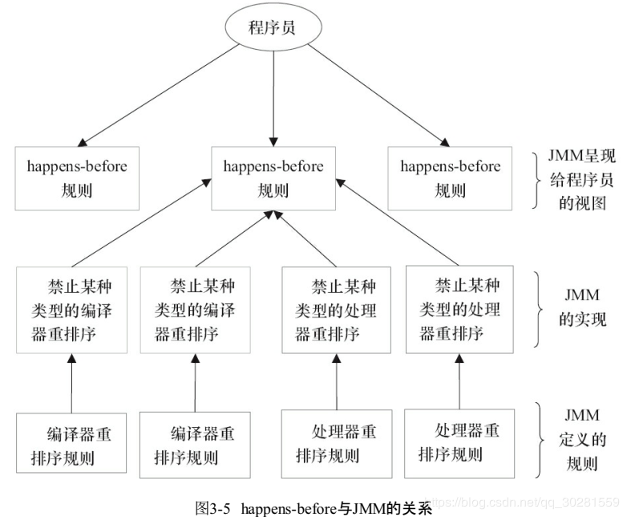
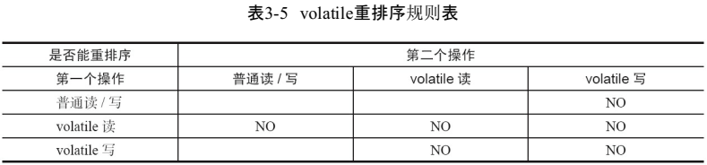
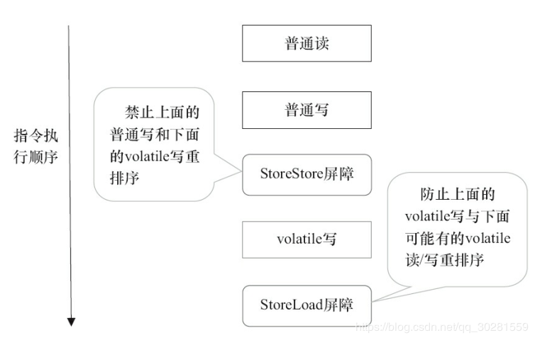
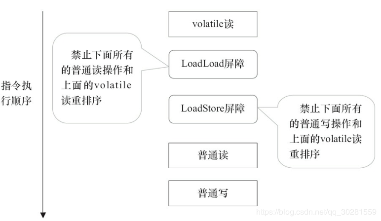
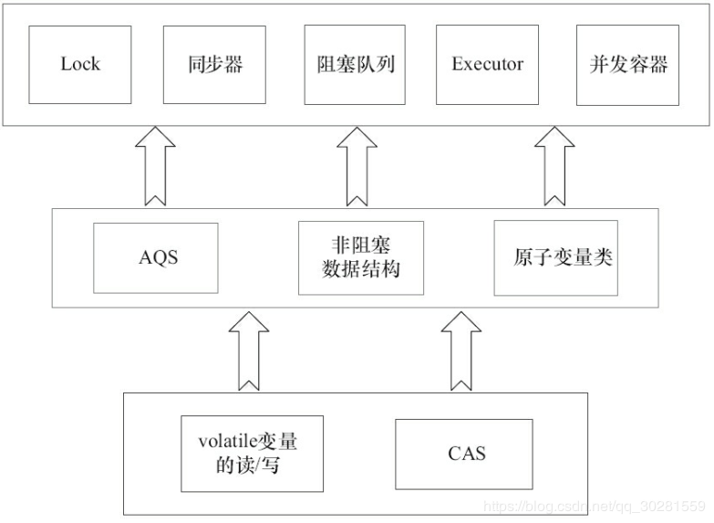

# 3.Java内存模型
## 3.1 Java内存模型的基础
在并发编程中两个关键问题：**线程之间如何通信及线程之间如何同步**（这里的线程是指并发执行的活动实体）。

**通信**是指线程之间以何种机制来交换信息。

- 在命令式编程中，线程之间的通信机制有两种：**共享内存和消息传递**。
- 在共享内存的并发模型里，线程之间共享程序的公共状态，通过写-读内存中的公共状态进行隐式通信。
- 在消息传递的并发模型里，线程之间没有公共状态，线程之间必须通过发送消息来显式进行通信。

**同步**是指程序中用于控制不同线程间操作发生相对顺序的机制。

- 在共享内存并发模型里，同步是显式进行的。程序员必须显式指定某个方法或某段代码需要在线程之间互斥执行。
- 在消息传递的并发模型里，由于消息的发送必须在消息的接收之前，因此同步是隐式进行的。

**Java的并发采用的是共享内存模型**，Java线程之间的通信总是隐式进行，整个通信过程对程序员完全透明。

> 在Java中，所有实例域、静态域和数组元素都存储在堆内存中，堆内存在线程之间共享。
> 局部变量，方法定义参数和异常处理器参数不会在线程之间共享，它们不会有内存可见性问题，也不受内存模型的影响

### 3.1.1 Java内存模型JMM


Java内存模型的主要目标是**定义程序中各个变量的访问规则**；即在虚拟机中将变量存储到内存和从内存中取出变量这样的底层细节。此处的变量（Variables）与java编程中所说的变量有所区别，它包括了实例字段、静态字段和构成数组对象的元素，但不包括局部变量与一方法参数，因为后者是线程私有的，不会被共享，自然就不会存在竞争问题。


**主内存与工作内存**
Java内存模型规定所有的变量都存储在**主内存**（Main Memory中（此处的主内存：与介绍物理硬件时的主内存名字一样，两者也可以互相类比，但此处仅是虚拟机内存的一部分）。
每条线程还自己的**工作内存**（Working Meimory，可与前面讲的处理器高速缓存类比），线程的工作内存中保存了被该线程使用到的变量的**主内存副本拷贝**；**线程对变量的所有操作（读取、赋值等）都必须在工作内存中进行，而不能直接读写主内存中的变量”**。不同的线程之间也无法直接访问对方工作内存中的变量，**线程间变量值的传递均需要通过主内存来完成**，线程、主内存、工作内存三者的交关系如图:


> 注：这里所讲的主内存、工作内存与Java内存区域中的Java堆、栈、方法区等并不是同一个层次的内存划分，这两者基本上是没有关系的：如果两者一定要勉强对应起来，那从变量、主内存、工作内存的定义来看，主内存主要对应于Java堆中的对象实例数据部分，而工作内存则对应于虚拟机栈中的部分区域。从更低层次上说，主内存就直接对应于物理硬件的内存，而为了获取更好的运行速度，虚拟机（甚至是硬件系统本身的优化措施）可能会让工作内存优先存储于寄存器和高速缓存中，因为程序运行时主要访问读写的是工作内存。

### 3.1.2 happens-before
Java 使用happens-before的概念来阐述操作之间的内存可见性。在JMM中，如果一个操作执行的结果需要对另一个操作可见，那么这两个操作之间必须要存在happens-before关系。这里提到的**两个操作既可以是在一个线程之内，也可以是在不同线程之间。**

- **程序次序规则（Program erder Rule）**：在一个线程内，按照程序代码顺序，书写在前面的操作先行发生于书写在后面的操作。准确地说，应该是控制流顺序而不是程序代码顺序，因为要考虑分支、循环等结构。
- **管程锁定规则：（Monitor Lock Rile）**:一个unlock 操作先行发生于后面对同一个锁的lock操作。这里必须强调的是同一个锁；而“后面”是指时间上的先后顺序。
- **volatile变量规则（Volatile Variable Rule）**：对一个volatile变量的写操作先行发生于后面对这个变量的读操作，这里的：“后面“同样是指时间上的先后顺序。
- **传递性**：（Transitivity）:如果A操作先行发生于操作B，操作B先行发生于操作C就可以得出操作A先行发生于操作C的结论。
- 线程启动规则（Thread Start Rule）：Thread对象的start（）方法先行发生于此线程的每一个动作。
- 线程终止规则（Thread Termination Rule）：线程的所有操作都先行发生手对此线程的终正检测，我们可以通Thread.join方法结束，Thread.isAlive的返回值等手段检测到线程已经终止执行
- 线程中断规则（Thread Interuption Rule）：对线程interupt方法的调用先行发生于被中断线程的代码检测到中断事件的发生，可以通过Thread.interiupted方法检测到是否有中断发生
- 对象终结规则（Finalizer.Rule）：个对象的初始化完成（构造函数执行结束）先行发生于它的finalize方法的开始

> 注意 两个操作之间具有happens-before关系，并不意味着前一个操作必须要在后一个操作之前执行！ happens-before仅仅要求前一个操作（执行的结果）对后一个操作可见，且前一个操作按顺序排在第二个操作之前
>
> 如果一个操作happens-before另一个操作，那么第一个操作的执行结果将对第二个操作可见，而且第一个操作的执行顺序排在第二个操作之前。
>
> 两个操作之间存在happens-before关系，并不意味着Java平台的具体实现必须要按照happens-before关系指定的顺序来执行。如果重排序之后的执行结果，与按happens-before关系来执行的结果一致，那么这种重排序并不非法（也就是说，JMM允许这种重排序）。



一个happens-before规则对应于一个或多个编译器和处理器重排序规则

## 3.2 重排序
**重排序**是指编译器和处理器为了优化程序性能而对指令序列进行重新排序的一种手段。

**数据依赖性**:如果两个操作访问同一个变量，且这两个操作中有一个为写操作，此时这两个操作之间就存在数据依赖性。（三种类型：写后读、写后写、读后写）

- 编译器和处理器可能会对操作做重排序。编译器和处理器在重排序时，会遵守数据依赖性，编译器和处理器不会改变存在数据依赖关系的两个操作的执行顺序。(仅针对单个处理器中执行的指令序列和单个线程中执行的操作)
- **as-if-serial语义**的意思是：不管怎么重排序（编译器和处理器为了提高并行度），（单线程）程序的执行结果不能被改变。编译器、runtime和处理器都必须遵守as-if-serial语义。
- 在多线程程序中，对存在控制依赖的操作重排序，可能会改变程序的执行结果

> happens-before关系本质上和as-if-serial语义是一回事。
> ·as-if-serial语义保证单线程内程序的执行结果不被改变，happens-before关系保证正确同步的多线程程序的执行结果不被改变。
> ·as-if-serial语义给编写单线程程序的程序员创造了一个幻境：单线程程序是按程序的顺序来执行的。happens-before关系给编写正确同步的多线程程序的程序员创造了一个幻境：正确同步的多线程程序是按happens-before指定的顺序来执行的。

## 3.3 顺序一致性
JMM对正确同步的多线程程序的内存一致性做了如下保证。

- 如果程序是正确同步的，程序的执行将具有顺序一致性（Sequentially Consistent）——即程序的执行结果与该程序在顺序一致性内存模型中的执行结果相同。
- 这里的同步是指广义上的同步，包括对常用同步原语（synchronized、volatile和final）的正确使用。

## 3.4 volatile的内存语义
**可见性**：对一个volatile变量的读，总是能看到（任意线程）对这个volatile变量最后的写入。
**原子性**：对任意单个volatile变量的读/写具有原子性，但类似于i++这种复合操作不具有原子性

**volatile变量的写-读可以实现线程之间的通信。**
从内存语义的角度来说，**volatile的写-读** 与 **锁的释放-获取** 有相同的内存效果：volatile写和锁的释放有相同的内存语义；volatile读与锁的获取有相同的内存语义。

**volatile写的内存语义如下**
当写一个volatile变量后，JMM会把**该线程对应的本地内存中的所有共享变量值**刷新到主内存，因此本地内存和主内存中的共享变量的值是一致的。
**volatile读的内存语义如下**
当读一个volatile变量时，JMM会把**该线程对应的本地内存置为无效，线程接下来将从主内存中读取共享变量**。
两个步骤综合起来看的话，在读线程B读一个volatile变量后，写线程A在写这个volatile变量之前==所有可见的共享变量的值==都将立即变得对读线程B可见。

### 3.4.1 volatile内存语义的实现
重排序分为编译器重排序和处理器重排序。为了实现volatile内存语义，JMM会分别限制这两种类型的重排序类型


> 当第二个操作是volatile写时，不管第一个操作是什么，都不能重排序。这个规则确保volatile写之前的操作不会被编译器重排序到volatile写之后。

> 当第一个操作是volatile读时，不管第二个操作是什么，都不能重排序。这个规则确保volatile读之后的操作不会被编译器重排序到volatile读之前。

> 当第一个操作是volatile写，第二个操作是volatile读时，不能重排序。

为了实现volatile的内存语义，编译器在生成字节码时，会在指令序列中插入内存屏障来禁止特定类型的处理器重排序。
下面是基于保守策略的JMM内存屏障插入策略。

- 在每个volatile写操作的前面插入一个StoreStore屏障。
- 在每个volatile写操作的后面插入一个StoreLoad屏障。
- 在每个volatile读操作的后面插入一个LoadLoad屏障。
- 在每个volatile读操作的后面插入一个LoadStore屏障。





StoreStore屏障将保障上面所有的普通写在volatile写之前刷新到主内存。
StoreLoad屏障的作用是避免volatile写与后面可能有的volatile读/写操作重排序。
LoadLoad屏障用来禁止处理器把上面的volatile读与下面的普通读重排序。
LoadStore屏障用来禁止处理器把上面的volatile读与下面的普通写重排序。

## 3.5 锁的内存语义
锁除了让**临界区互斥执行**外，还可以**让释放锁的线程向获取同一个锁的线程发送消息**。

**当线程释放锁时，JMM会把该线程对应的本地内存中的共享变量刷新到主内存中。**
**当线程获取锁时，JMM会把该线程对应的本地内存置为无效。从而使得被监视器保护的临界区代码必须从主内存中读取共享变量。**

**锁释放与volatile写有相同的内存语义；锁获取与volatile读有相同的内存语义。**

- 线程A释放一个锁，实质上是线程A向接下来将要获取这个锁的某个线程发出了（线程A对共享变量所做修改的）消息。
- 线程B获取一个锁，实质上是线程B接收了之前某个线程发出的（在释放这个锁之前对共享变量所做修改的）消息。
- **线程A释放锁，随后线程B获取这个锁，这个过程实质上是线程A通过主内存向线程B发送消息**。

### 3.5.1 锁释放-获取的内存语义的实现

**1）利用volatile变量的写-读所具有的内存语义。**
**2）利用CAS所附带的volatile读和volatile写的内存语义。**

**ReentrantLock的实现**依赖于Java同步器框架**AbstractQueuedSynchronizer**（本文简称之为AQS）。
AQS使用一个**整型的volatile变量（命名为state）**来维护同步状态。

**公平锁**在释放锁的最后写volatile变量state，在获取锁时首先读这个volatile变量。根据volatile的happens-before规则，**释放锁的线程在写volatile变量之前可见的共享变量，在获取锁的线程读取同一个volatile变量后将立即变得对获取锁的线程可见**。

**非公平锁**获取时，首先会用**CAS更新volatile变量**，这个操作同时具有volatile读和volatile写的内存语义。

> **CAS如何同时具有volatile读和volatile写的内存语义。**
> 编译器不会对volatile读与volatile读后面的任意内存操作重排序；编译器不会对volatile写与volatile写前面的任意内存操作重排序。组合这两个条件，意味着为了同时实现volatile读和volatile写的内存语义，编译器不能对CAS与CAS前面和后面的任意内存操作重排序

### 3.5.2 concurrent包的实现
由于Java的CAS同时具有volatile读和volatile写的内存语义，因此Java线程之间的通信现在有了下面4种方式。
1）A线程写volatile变量，随后B线程读这个volatile变量。
2）A线程写volatile变量，随后B线程用CAS更新这个volatile变量。
3）A线程用CAS更新一个volatile变量，随后B线程用CAS更新这个volatile变量。
4）A线程用CAS更新一个volatile变量，随后B线程读这个volatile变量。

**concurrent包的源代码实现，是一个通用化的实现模式。**

- 首先，声明共享变量为volatile。

- 然后，使用CAS的原子条件更新来实现线程之间的同步。

- 同时，配合以volatile的读/写和CAS所具有的volatile读和写的内存语义来实现线程之间的通信

  > AQS，非阻塞数据结构、原子变量类，这些concurrent包中的基础类都是使用这种模式来实现的



## 3.6 final域的内存语义
与前面介绍的锁和volatile相比，对final域的读和写更像是普通的变量访问。
对于final域，编译器和处理器要遵守**两个重排序规则**。

- 在构造函数内对一个final域的写入，与随后把这个被构造对象的引用赋值给一个引用变量，这两个操作之间不能重排序。
- 初次读一个包含final域的对象的引用，与随后初次读这个final域，这两个操作之间不能重排序。

**写final域的重排序规则**禁止把final域的写重排序到构造函数之外。这个规则的实现包含下面2个方面。

- 1）JMM禁止编译器把final域的写重排序到构造函数之外。
- 2）编译器会在final域的写之后，构造函数return之前，插入一个StoreStore屏障。这个屏障禁止处理器把final域的写重排序到构造函数之外。

> 写final域的重排序规则可以确保：在对象引用为任意线程可见之前，对象的final域已经被正确初始化过了，而普通域不具有这个保障。

**读final域的重排序规则**是，在一个线程中，初次读对象引用与初次读该对象包含的final域，JMM禁止处理器重排序这两个操作（注意，这个规则仅仅针对处理器）。编译器会在读final域操作的前面插入一个LoadLoad屏障。

> 初次读对象引用与初次读该对象包含的final域，这两个操作之间存在间接依赖关系。由于编译器遵守间接依赖关系，因此编译器不会重排序这两个操作。
> 读final域的重排序规则会把读对象final域的操作“限定”在读对象引用之后，此时该final域已经被A线程初始化过了，这是一个正确的读取操作。

**对于引用类型**，写final域的重排序规则对编译器和处理器增加了如下约束：**在构造函数内对一个final引用的对象的成员域的写入，与随后在构造函数外把这个被构造对象的引用赋值给一个引用变量，这两个操作之间不能重排序**。

````java
//在这里除了1不能和3重排序外，2和3也不能重排序。
public class FinalReferenceExample {
    final int[] intArray; // final是引用类型
    static FinalReferenceExample obj;
    public FinalReferenceExample () { // 构造函数
        intArray = new int[1]; // 1 final域的写入
        intArray[0] = 1; // 2 final域引用的对象的成员域的写入
        }
    public static void writerOne () { // 写线程A执行
        obj = new FinalReferenceExample (); // 3 把被构造的对象的引用赋值给某个引用变量
    }
    public static void writerTwo () { // 写线程B执行
        obj.intArray[0] = 2; // 4
    }
    public static void reader () { // 读线程C执行
        if (obj != null) { // 5
            int temp1 = obj.intArray[0]; // 6
        }
    }
}
````

写final域的重排序规则可以确保：**在引用变量为任意线程可见之前，该引用变量指向的对象的final域已经在构造函数中被正确初始化过了**。其实，要得到这个效果，还需要一个保证：在构造函数内部，不能让这个被构造对象的引用为其他线程所见，也就是对象引用不能在构造函数中“逸出”。