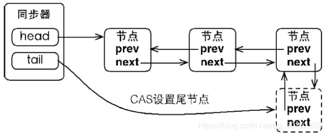
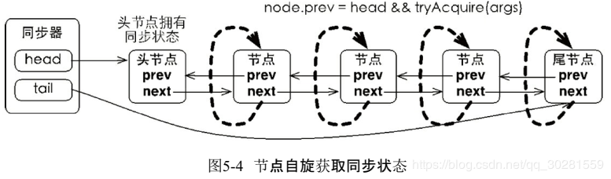
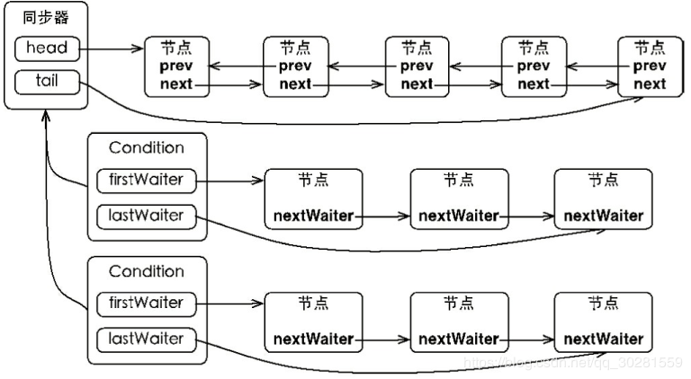
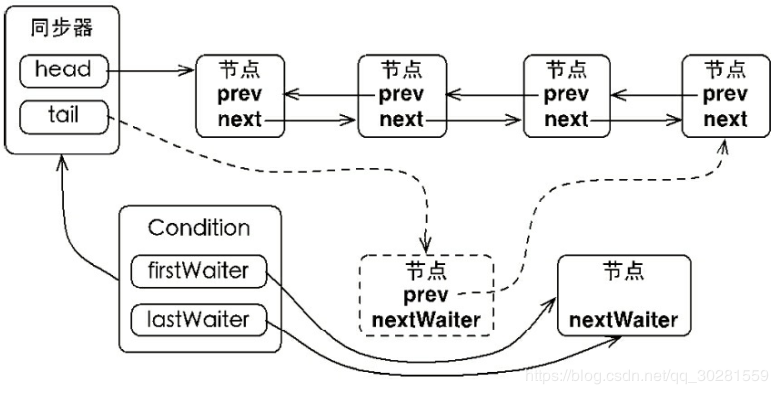
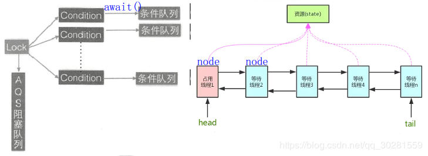

# 5 Java中的锁

**锁是用来控制多个线程访问共享资源的方式**，一般来说，一个锁能够防止多个线程同时访问共享资源（但是有些锁可以允许多个线程并发的访问共享资源，比如读写锁）。在Lock接口出现之前，Java程序是靠synchronized关键字实现锁功能的

````java
Lock lock = new ReentrantLock();
lock.lock();
try {
} finally {
	lock.unlock();
}
````

## 5.1 队列同步器 AQS
队列同步器AbstractQueuedSynchronizer（以下简称同步器），是**用来构建锁或者其他同步组件的基础框架，它使用了一个int成员变量表示同步状态，通过内置的FIFO队列来完成资源获取线程的排队工作**。

- 锁是面向使用者的，它定义了使用者与锁交互的接口（比如可以允许两个线程并行访问），隐藏了实现细节；
- 同步器面向的是锁的实现者，它简化了锁的实现方式，屏蔽了同步状态管理、线程的排队、等待与唤醒等底层操作。

基于AQS实现的同步器包括：**ReentrantLock、Semaphore、ReentrantReadWriteLock、CountDownLatch和FutureTask**。
在 AQS 中 维持了 一 个 单 一 的状态信息 state，可以通过 getState 、 setState 、compareAndS etState 函数修改其值 。

- 对于 Reentran tLock 的 实 现来说， state 可以用 来表示当 前线程获取锁的可重入次数 ；
- 对于 读写锁 ReentrantReadWriteLock 来说 ， state 的 高 16位表示读状态，也就是获取该读锁的次数，低 16 位表示获取到写锁的线程的可重入次数；
- 对于 semaphore 来说， state 用来表示当前可用信号的 个数
- 对于 CountDownlatch 来说，state 用 来表示计数器当前的值 。

### 队列同步器的实现分析
AQS的设计是使用模板方法设计模式，它将一些方法开放给子类进行重写，而同步器给同步组件所提供模板方法又会重新调用被子类所重写的方法。

- 同步组件（这里不仅仅值锁，还包括CountDownLatch等）的实现依赖于同步器AQS，在同步组件实现中，使用AQS的方式被推荐定义继承AQS的静态内存类；
- AQS采用模板方法进行设计，AQS的protected修饰的方法需要由继承AQS的子类进行重写实现，当调用AQS的子类的方法时就会调用被重写的方法；
- AQS负责同步状态的管理，线程的排队，等待和唤醒这些底层操作，而Lock等同步组件主要专注于实现同步语义；
- 在重写AQS的方式时，使用AQS提供的getState(),setState(),compareAndSetState()方法进行修改同步状态

#### **1.同步队列**
同步器依赖内部的**同步队列**（一个FIFO双向队列）来完成同步状态的管理，当前线程获取同步状态(state)失败时，同步器会**将当前线程以及等待状态等信息构造成为一个节点（Node）并将其加入同步队列，同时会阻塞当前线程**，当同步状态释放时，会把首节点中的线程唤醒，使其再次尝试获取同步状态。

同步队列中的**节点（Node）用来保存获取同步状态失败的线程引用、等待状态以及前驱和后继节点**；同步器拥有首节点（head）和尾节点（tail），没有成功获取同步状态的线程将会成为节点加入该队列的**尾部**。（也就是说AQS实际上通过头尾指针来管理同步队列，同时实现包括获取锁失败的线程进行入队，释放锁时对同步队列中的线程进行通知等核心方法）


#### **2.独占式同步状态获取与释放**
通过调用同步器的acquire(int arg)方法可以获取同步状态，该方法对中断不敏感，也就是由于线程获取同步状态失败后进入同步队列中，后续对线程进行中断操作时，线程不会从同步队列中移出；

节点进入同步队列之后，就进入了一个**自旋**的过程，每个节点（或者说每个线程）都在自省地观察，当条件满足，获取到了同步状态，就可以从这个自旋过程中退出，否则依旧留在这个自旋过程中（并会阻塞节点的线程）
**当前线程在“死循环”中尝试获取同步状态，而只有前驱节点是头节点才能够尝试获取同步状态**，这是为什么？ 原因有两个，如下。

- 第一，头节点是成功获取到同步状态的节点，而头节点的线程释放了同步状态之后，将会唤醒其后继节点，后继节点的线程被唤醒后需要检查自己的前驱节点是否是头节点。
- 第二，维护同步队列的FIFO原则。



>由图：由于非首节点线程前驱节点出队或者被中断而从等待状态返回，随后检查自己的前驱是否是头节点，如果是则尝试获取同步状态。可以看到节点和节点之间在循环检查的过程中基本不相互通信，而是简单地判断自己的前驱是否为头节点，这样就使得节点的释放规则符合FIFO，并且也便于对过早通知的处理（过早通知是指前驱节点不是头节点的线程由于中断而被唤醒）。

独占式锁的获取过程也就是acquire()方法的执行流程如下图所示：


独占式锁的获取和释放的过程以及同步队列。可以做一下总结：https://juejin.im/post/5aeb07ab6fb9a07ac36350c8

- 线程获取锁失败，线程被封装成Node进行入队操作，核心方法在于addWaiter()和enq()，同时enq()完成对同步队列的头结点初始化工作以及CAS操作失败的重试;
- 线程获取锁是一个自旋的过程，当且仅当 当前节点的前驱节点是头结点并且成功获得同步状态时，节点出队即该节点引用的线程获得锁，否则，当不满足条件时就会调用LookSupport.park()方法使得线程阻塞；
- 释放锁的时候会唤醒后继节点；

总体来说：**在获取同步状态时，AQS维护一个同步队列，获取同步状态失败的线程会加入到队列中进行自旋；移除队列（或停止自旋）的条件是前驱节点是头结点并且成功获得了同步状态。在释放同步状态时，同步器会调用unparkSuccessor()方法唤醒后继节点**。

#### **3.共享式同步状态获取与释放**
共享式获取与独占式获取最主要的区别在于**同一时刻能否有多个线程同时获取到同步状态**。
共享式访问资源时，其他共享式的访问均被允许，而独占式访问被阻塞；独占式访问资源时，同一时刻其他访问均被阻塞。
## 5.2 重入锁
重入锁ReentrantLock，顾名思义，就是支持重进入的锁，它表示该锁能够支持一个线程对资源的重复加锁。除此之外，该锁的还支持获取锁时的公平和非公平性选择。

ReentrantLock中自定义同步器的实现，**同步状态表示锁被一个线程重复获取的次数**

1. 实现重进入
   - 线程再次获取锁。锁需要去识别获取锁的线程**是否为当前占据锁的线程**，如果是，则再次成功获取。
   - 锁的最终释放。线程重复n次获取了锁，随后在第n次释放该锁后，其他线程能够获取到该锁。锁的最终释放要求锁对于获取进行计数自增，计数表示当前锁被重复获取的次数，而锁被释放时，计数自减，当**计数等于0时表示锁已经成功释放**。
2. 公平与非公平获取锁的区别
   - 对于非公平锁，只要CAS设置同步状态成功，则表示当前线程获取了锁
   - 而公平锁则不同，唯一不同的位置为判断条件多了`hasQueuedPredecessors()`方法，即加入了同步队列中当前节点**是否有前驱节点**的判断，如果该方法返回true，则表示有线程比当前线程更早地请求获取锁，因此需要等待前驱线程获取并释放锁之后才能继续获取锁
     

## 5.3 读写锁
https://juejin.im/post/5aeb0e016fb9a07ab7740d90

之前提到锁（如Mutex和ReentrantLock）基本都是排他锁，这些锁在同一时刻只允许一个线程进行访问，而读写锁在同一时刻可以允许多个读线程访问，但是在写线程访问时，所有的读线程和其他写线程均被阻塞。读写锁维护了一对锁，一个读锁和一个写锁，通过分离读锁和写锁，使得并发性相比一般的排他锁有了很大提升。

1. 读写状态的设计

   - 读写锁同样依赖自定义同步器来实现同步功能，而**读写状态就是其同步器的同步状态**。

   - 读写锁的**自定义同步器需要在同步状态（一个整型变量）上维护多个读线程和一个写线程的状态**，使得该状态的设计成为读写锁实现的关键。
     - **读写锁将变量切分成了两个部分，高16位表示读，低16位表示写来在一个整型变量上维护多种状态；**
     - **读写锁是通过位运算迅速确定读和写各自的状态。**

2. 写锁的获取与释放

   - 写锁是一个支持重进入的排它锁。如果当前线程已经获取了写锁，则增加写状态。如果当前线程在获取写锁时，读锁已经被获取（读状态不为0）或者该线程不是已经获取写锁的线程，则当前线程进入等待状态。

> 读写锁要确保写锁的操作对读锁可见，如果允许读锁在已被获取的情况下对写锁的获取，那么正在运行的其他读线程就无法感知到当
> 前写线程的操作。因此，只有等待其他读线程都释放了读锁，写锁才能被当前线程获取，而写锁一旦被获取，则其他读写线程的后续访问均被阻塞。

写锁的释放与ReentrantLock的释放过程基本类似，每次释放均减少写状态，当写状态为0时表示写锁已被释放，从而等待的读写线程能够继续访问读写锁，同时前次写线程的修改对后续读写线程可见。

3. 读锁的获取与释放
   - 读锁是一个支持重进入的共享锁，它能够被多个线程同时获取，在没有其他写线程访问（或者写状态为0）时，读锁总会被成功地获取，而所做的也只是（线程安全的）增加读状态。如果当前线程已经获取了读锁，则增加读状态。如果当前线程在获取读锁时，写锁已被其他线程获取，则进入等待状态。

4. 锁降级

   - 锁降级指的是**写锁降级成为读锁**。如果当前线程拥有写锁，然后将其释放，最后再获取读锁，这种分段完成的过程不能称之为锁降级。**锁降级是指把持住（当前拥有的）写锁，再获取到读锁，随后释放（先前拥有的）写锁的过程。**

   - 锁降级中读锁的获取是否必要呢？ 答案是必要的。主要是为了保证数据的可见性，如果当前线程不获取读锁而是直接释放写锁，假设此刻另一个线程（记作线程T）获取了写锁并修改了数据，那么当前线程无法感知线程T的数据更新。如果当前线程获取读锁，即遵循锁降级的步骤，则线程T将会被阻塞，直到当前线程使用数据并释放读锁之后，线程T才能获取写锁进行数据更新。

   - RentrantReadWriteLock不支持锁升级（把持读锁、获取写锁，最后释放读锁的过程）。目的也是保证数据可见性，如果读锁已被多个线程获取，其中任意线程成功获取了写锁并更新了数据，则其更新对其他获取到读锁的线程是不可见的。

   - ```java
     public void processData() {
         readLock.lock();
         if (!update) {
             // 必须先释放读锁
             readLock.unlock();
             // 锁降级从写锁获取到开始
             writeLock.lock();
             try {
                 if (!update) {
                 // 准备数据的流程（略）
                 update = true;
                 }
                 readLock.lock();
             } finally {
                 writeLock.unlock();
             }// 锁降级完成，写锁降级为读锁
         }
         try {// 使用数据的流程（略）
         } finally {
         readLock.unlock();
         }
     }
     ```

## 5.4 Condition接口
**任意一个Java对象，都拥有一组监视器方法（定义在java.lang.Object上），主要包括wait()、wait(long timeout)、notify()以及notifyAll()方法，这些方法与synchronized同步关键字配合，可以实现等待/通知模式。**

Condition接口也提供了类似Object的监视器方法，与Lock配合可以实现等待/通知模式

Condition定义了等待/通知两种类型的方法，当前线程调用这些方法时，需要提前获取到Condition对象关联的锁。**Condition对象是由Lock对象（调用Lock对象的newCondition()方法）创建出来的，换句话说，Condition是依赖Lock对象的。**

```java
Lock lock = new ReentrantLock();
Condition condition = lock.newCondition();
public void conditionWait() throws InterruptedException {
    lock.lock();
    try {
        condition.await();
    } finally {
        lock.unlock();
    }
}
public void conditionSignal() throws InterruptedException {
    lock.lock();
    try {
        condition.signal();
    } finally {
        lock.unlock();
    }
}
```

一般都会将Condition对象作为**成员变量**。当调用`await()`方法后，当前线程会释放锁并在此等待，而其他线程调用Condition对象的`signal()`方法，通知当前线程后，当前线程才从await()方法返回，并且在返回前已经获取了锁。

ConditionObject是同步器`AbstractQueuedSynchronizer`的内部类，因为Condition的操作需要获取相关联的锁，所以作为同步器的内部类也较为合理。**每个Condition对象都包含着一个队列（以下称为等待队列），该队列是Condition对象实现等待/通知功能的关键。**
### Condition的实现分析
1. 等待队列

   - 等待队列是一个FIFO的队列，在队列中的**每个节点都包含了一个线程引用**，该线程就是在Condition对象上等待的线程，如果一个线程调用了`Condition.await()`方法，那么该线程将会释放锁、构造成节点加入等待队列并进入等待状态。事实上，**节点的定义复用了同步器中节点的定义**，也就是说，同步队列和等待队列中节点类型都是同步器的静态内部类AbstractQueuedSynchronizer.Node。

   - 在Object的监视器模型上，一个对象拥有**一个同步队列和等待队列**，而并发包中的Lock（更确切地说是同步器）拥有**一个同步队列和多个等待队列**
   - 

2. 等待
   调用Condition的await()方法（或者以await开头的方法），会**使当前线程进入等待队列并释放锁，并唤醒同步队列中的后继节点同时线程状态变为等待状态**。当**从await()方法返回时，当前线程一定获取了Condition相关联的锁**。如果从队列（同步队列和等待队列）的角度看await()方法，当调用await()方法时，**相当于同步队列的首节点（获取了锁的节点）移动到Condition的等待队列中。**

3. 通知
   调用Condition的signal()方法，将**会唤醒在等待队列中等待时间最长的节点（首节点），在唤醒节点之前，会将节点移到同步队列中**。调用该方法的**前置条件是当前线程必须获取了锁**，可以看到signal()方法进行了isHeldExclusively()检查，也就是当前线程必须是获取了锁的线程。接着获取等待队列的首节点，将其移动到同步队列并使用LockSupport唤醒节点中的线程。
   

   