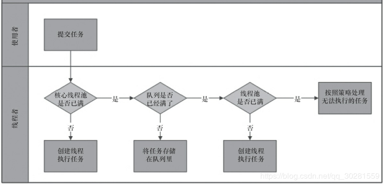
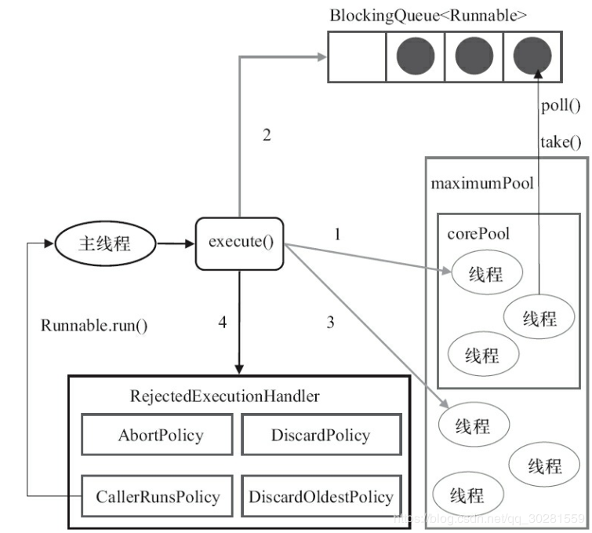
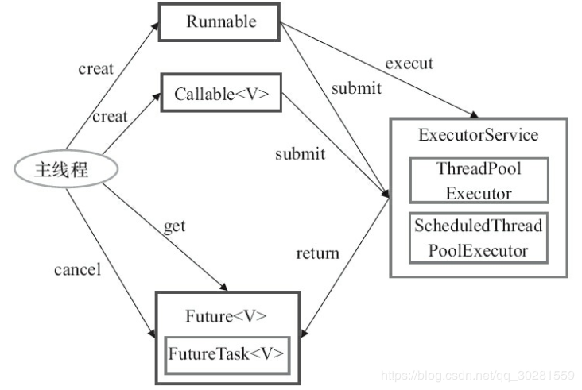

# 9 Java中的线程池

第一：降低资源消耗。通过重复利用已创建的线程降低线程创建和销毁造成的消耗。
第二：提高响应速度。当任务到达时，任务可以不需要等到线程创建就能立即执行。
第三：提高线程的可管理性。

**创建线程池**

`new ThreadPoolExecutor(corePoolSize, maximumPoolSize, keepAliveTime,milliseconds,threadFactory,runnableTaskQueue, handler);`
1）corePoolSize（线程池的基本大小）
2）maximumPoolSize（线程池最大数量）
3）keepAliveTime（线程活动保持时间）
4）milliseconds（存活时间单位）
5）ThreadFactory：用于设置创建线程的工厂
6）runnableTaskQueue（任务队列）
7）RejectedExecutionHandler（饱和策略）

- AbortPolicy：丢弃并抛出异常。
- CallerRunsPolicy：只用调用者所在线程来运行任务。
- DiscardOldestPolicy：丢弃队列里最近的一个任务，并执行当前任务。
- DiscardPolicy：丢弃不抛异常

**向线程池提交任务**

execute()方法用于提交**不需要返回值**的任务，所以无法判断任务是否被线程池执行成功。
submit()方法用于提交**需要返回值**的任务。线程池会返回一个**future类型的对象**，通过这个future对象可以判断任务是否执行成功，并且可以通过**future的get()方法来获取返回值**，get()方法会阻塞当前线程直到任务完成，而使用`get（long timeout，TimeUnit unit）`方法则会阻塞当前线程一段时间后立即返回，这时候有可能任务没有执行完。

**关闭线程池**

可以通过调用线程池的`shutdown`或`shutdownNow`方法来关闭线程池。它们的<u>原理是遍历线程池中的工作线程，然后逐个调用线程的interrupt方法来中断线程，所以无法响应中断的任务可能永远无法终止</u>。但是它们存在一定的区别，shutdownNow首先将线程池的状态设置成STOP，然后**尝试停止所有的正在执行或暂停任务的线程，并返回等待执行任务的列表**，而shutdown只是将线程池的状态设置成SHUTDOWN状态，然后**中断所有没有正在执行任务的线程**。

**合理地配置线程池**

要想合理地配置线程池，就必须首先分析任务特性，可以从以下几个角度来分析。

- 任务的性质：CPU密集型任务、IO密集型任务和混合型任务。
- 任务的优先级：高、中和低。
- 任务的执行时间：长、中和短。
- 任务的依赖性：是否依赖其他系统资源，如数据库连接。

性质不同的任务可以用不同规模的线程池分开处理。

- CPU密集型任务应配置尽可能小的线程，如配置Ncpu+1个线程的线程池。
- IO密集型任务线程并不是一直在执行任务，则应配置尽可能多的线程，如2*Ncpu。混合型的任务

# 10 Executor框架
Java的线程既是工作单元，也是执行机制。从JDK 5开始，把**工作单元与执行机制**分离开来。**工作单元包括Runnable和Callable，而执行机制由Executor框架提供。**

### Executor框架的两级调度模型

在HotSpot VM的线程模型中，**Java线程（java.lang.Thread）被一对一映射为本地操作系统线程**。Java线程启动时会创建一个本地操作系统线程；当该Java线程终止时，这个操作系统线程也会被回收。操作系统会调度所有线程并将它们分配给可用的CPU。

**在上层，Java多线程程序通常把应用分解为若干个任务，然后使用用户级的调度器（Executor框架）将这些任务映射为固定数量的线程；在底层，操作系统内核将这些线程映射到硬件处理器上**。这就是两级调度模型。从图中可以看出，**应用程序通过Executor框架控制上层的调度；而下层的调度由操作系统内核控制，下层的调度不受应用程序的控制。**

### 1.Executor框架的结构

1. 任务;包括被执行任务需要实现的接口：**Runnable接口或Callable接口**。
2. 任务的执行;包括任务执行机制的核心接口Executor，以及继承自Executor的ExecutorService接口。Executor框架有两个关键类实现了ExecutorService接口（ThreadPoolExecutor和ScheduledThreadPoolExecutor）。
3. 异步计算的结果;包括接口Future和实现Future接口的FutureTask类。
   

### 2.Executor框架的成员

Executor框架的主要成员：**ThreadPoolExecutor、ScheduledThreadPoolExecutor、Future接口、Runnable接口、Callable接口和Executors。**

**ThreadPoolExecutor**
1）FixedThreadPool。创建使用固定线程数的线程池
2）SingleThreadExecutor。创建使用单个线程的线程池，多任务下任务排队
3）CachedThreadPool。创建一个大小无界的线程池，通常会创建与所需数量相同的线程，然后在他回收旧线程时候停止创建新线程

**ScheduledThreadPoolExecutor**
1）ScheduledThreadPoolExecutor适用于需要多个后台线程执行周期任务，同时为了满足资源管理的需求而需要限制后台线程的数量的应用场景。
2）SingleThreadScheduledExecutor适用于需要单个后台线程执行周期任务，同时需要保证顺序地执行各个任务的应用场景

**Future接口**
Future接口和实现Future接口的FutureTask类用来表示异步计算的结果，返回一个FutureTask对象

**Runnable接口和Callable接口**
Runnable接口和Callable接口的实现类，都可以被ThreadPoolExecutor或ScheduledThreadPoolExecutor执行。它们之间的区别Runnable不会返回结果，而Callable可以返回结果Future<> res = exectur.submin(Callable),使用res.get()方法获取结果。