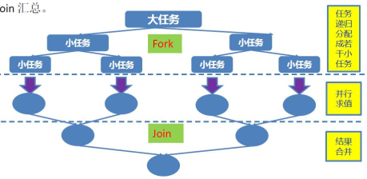

# 6 同步与协作工具类
## 6.1 CountDownLatch(闭锁)
https://juejin.im/post/5aeec3ebf265da0ba76fa327

CountDownLatch**允许一个或多个线程等待其他线程完成操作。**

闭锁可以延迟线程的进度直到其达到终止状态。 它相当于是一个门栓，一开始是关闭的，所有希望通过该门的线程都需要等待，然后开始倒计时，倒计时变为0后，门栓打开，等待的所有线程都可以通过，它是一次性的，打开后就不能再关上了。

闭锁状态包括一个计数器， 该计数器被初始化为一个正数， 表示需要等待的事件数量。countDown 方法递减计数器， 表示有一个事件发生了， 而 await 方法等待计数器达到 0， 这表示所有需要等待的事件都已经发生。 **如果计数器的值非零， 那么 await 会一直阻塞直到计数器为 0， 或者等待中的线程中断， 或者等待超时。**  

门栓的两种应用场景：**一种是同时开始，另一种是主从协作**。它们都有两类线程，互相需要同步

````java
//同时开始：多个子线程内使用countdown.await()等待主线程信号，主线程使用countdown.countDown()发信号
//主从同步：子线程完成任务后countdown.countDown()告诉主线程，主线程使用countdown.await()等待子线程结果
public class CountDownLatchTest {
    staticCountDownLatch c = new CountDownLatch(2);
    public static void main(String[] args) throws InterruptedException {
        new Thread(new Runnable() {
            @Override
            public void run() {
                System.out.println(1);
                c.countDown();
                System.out.println(2);
                c.countDown();
            }
        }).start();
        c.await();//直到值为0才会执行后续代码
        System.out.println("3");
    }
}
````

````java
...
//启动子线程
threadOne.start() ;
threadTwo.start() ;
System.out.println ("wait all child thread over !");
//等待子线程执行完毕，返回
countDownLatch.await() ;
````

创建了一个 CountDownLatch 实例，因为有两个子线程所以构造函数的传参为 2。
主线程调用` countDownLatch.await()`方法后会被阻塞。
子线程执行完毕后调用` countDownLatch.countDown()`方法让 countDownLatch 内部的计数器减1，所有子线程执行完毕并调用 countDown()方法后计数器会变为 0，这时候主线程的 await()方法才会返回 。

CountDownLatch的构造函数接收一个int类型的参数作为计数器，如果你想等待N个点完成，这里就传入N。当我们**调用CountDownLatch的countDown()方法时，N就会减1，CountDownLatch的await()方法会阻塞当前线程，直到N变成零**。由于countDown方法可以用在任何地方，所以这里说的N个点，可以是N个线程，也可以是1个线程里的N个执行步骤。用在多个线程时，只需要把这个CountDownLatch的引用传递到线程里即可。

如果有某个解析sheet的线程处理得比较慢，我们不可能让主线程一直等待，所以可以使用另外一个带指定时间的await方法—`await（long time，TimeUnit unit）`，这个方法等待特定时间后，就会不再阻塞当前线程。join也有类似的方法。

## 6.2 CyclicBarrier(可循环使用的屏障/栅栏）
CyclicBarrier的字面意思是可循环使用（Cyclic）的屏障（Barrier）。它要做的事情是，让一组线程到达一个屏障（也可以叫同步点）时被阻塞，直到最后一个线程到达屏障时，屏障才会开门，所有被屏障拦截的线程才会继续运行。
CyclicBarrier默认的构造方法是`CyclicBarrier(int parties)`，其参数表示屏障拦截的线程数量，每个线程调用await方法告诉CyclicBarrier我已经到达了屏障，然后当前线程被阻塞。

CyclicBarrier 可以使一定数量的参与方反复地在栅栏位置汇集， 它在**并行迭代算法**中非常有用； **这种算法通常将一个问题拆分成一系列相互独立的子问题。 当线程到达栅栏位置时将调用 await 方法， 这个方法将阻塞直到所有线程都达到栅栏位置。调用await后，表示自己已经到达，如果自己是最后一个到达的，就执行可选的命令，执行后，唤醒所有等待的线程，然后重置内部的同步计数，以循环使用。**

> await可以被中断，可以限定最长等待时间，中断或超时后会抛出异常。需要说明的是异常BrokenBarrierException，它表示栅栏被破坏了，什么意思呢？在CyclicBarrier中，参与的线程是互相影响的，只要其中一个线程在调用await时被中断了，或者超时了，栅栏就会被破坏。此外，如果栅栏动作抛出了异常，栅栏也会被破坏。被破坏后，所有在调用await的线程就会退出，抛出BrokenBarrierException。
>
> 如果成功通过栅栏， 那么await 将为每个线程返回一个唯一的到达索引号， 我们可以利用这些索引来选举产生一个领导线程， 并在下一次迭代中由该领导线程执行一些特殊的工作。 

CyclicBarrier 还可以使你将一个栅栏操作传递给构造函数`CyclicBarrier(int parties, Runnable action)`， 这是一个 Runnable，表示栅栏动作，当所有线程到达栅栏后，在所有线程执行下一步动作前，运行参数中的动作，这个动作由最后一个到达栅栏的线程执行。

可以用于多线程计算数据， 最后合并计算结果的场景。 CountDownLatch 的计数器只能使用一次， 而 CyclicBarrier 的计数器可以使用 reset 方法重置。

````java
/**
 * 通过 CyclicBarrier 协调细胞自动衍生系统中的计算
 */
public class CellularAutomata {
    private final Board mainBoard;
    private final CyclicBarrier cyclicBarrier;
    private final Worker[] workers;
    public CellularAutomata(Board board){
        this.mainBoard = board;
        int count = Runtime.getRuntime().availableProcessors();
        this.cyclicBarrier = new CyclicBarrier(count, new Runnable() {
            public void run() {
                mainBoard.commitNewValues();
            }
        });
        this.workers = new Worker[count];
        for (int i = 0; i < count; i++) {
            workers[i] = new Worker(mainBoard.getSubBoard(count,i));
        }
    }
    private class Worker implements Runnable{
        private final Board board;
        public Worker(Board board){
            this.board = board;
        }
        public void run() {
            while (!board.hasConverged()) {
                for (int x = 0; x < board.getMaxX(); x++) {
                    for (int y = 0; y < board.getMaxY(); y++) {
                        board.setNewValue(x, y, computeValue(x, y));
                    }
                } try {
                    cyclicBarrier.await();
                } catch (InterruptedException e) {
                    e.printStackTrace();
                } catch (BrokenBarrierException e) {
                    e.printStackTrace();
                    return;
                }
            }
        }
    }
    private int computeValue(int x, int y) {
        return x+y;
    }
    public void start(){
        for (int i = 0; i < workers.length; i++) {
            new Thread(workers[i]).start();
        }
        mainBoard.waitForConvergence();
    }
}
````


### 6.2.3 CyclicBarrier和CountDownLatch的区别
CountDownLatch 的计数器是一次性的，也就是等到计数器值变为0 后，再调用 CountDownLatch 的 await 和 countdown 方法都会立刻返回，这就起不到线程同步的效果了，而CyclicBarrier的计数器可以使用reset()方法重置。所以CyclicBarrier能处理更为复杂的业务场景。
CyclicBarrier 是回环屏障的 意思 ，它可以让一组线程全部达到一个状态后再全部同 时执行 。这里之所以叫作回环是因为当所有等待线程执行完毕，并重置 CyclicBarrier 的状态后它可以被重用。之所以 叫作屏障是因为线程调用 await 方法后就会被阻塞，这个阻塞点就称为屏障点，等所有线程都调用了 await 方法后，线程们就会冲破屏障，继续 向下运行。

| CountDownLatch                                               | CyclicBarrier                                                |
| ------------------------------------------------------------ | ------------------------------------------------------------ |
| 减计数方式                                                   | 加计数方式                                                   |
| 计算为 0 时释放所有等待的线程                                | 计数达到指定值时释放所有等待线程                             |
| 计数为 0 时，无法重置                                        | 计数达到指定值时，计数置为 0 重新开始                        |
| 调用 countDown()方法计数减一，调用 await()方法只进行阻塞，对计数没任何影 响 | 调用 await()方法计数加 1，若加 1 后的值不等于构 造方法的值，则线程阻塞 |
| 不可重复利用                                                 | 可重复利用                                                   |

线程在 countDown()之后， 会继续执行自己的任务， 而 CyclicBarrier 会在所有线程任务结束之后， 才会进行后续任务。

Barrier 类似于闭锁， 它能阻塞一组线程直到某个线程发生。 栅栏与闭锁的关键区别在于，前者未达到条件时每个线程都会阻塞在 await 上， 直至条件满足所有线程解除阻塞， 后者未达到条件时 countDown 不会阻塞， 条件满足时会解除 await 线程的阻塞。    

## 6.3 控制并发线程数的Semaphore
https://juejin.im/post/5aeec49b518825673614d183

有的单个资源即使可以被并发访问，但并发访问数多了可能影响性能，所以希望限制并发访问的线程数。还有的情况，与软件的授权和计费有关，对不同等级的账户，限制不同的最大并发访问数。

Semaphore（信号量）是**用来控制同时访问特定资源的线程数量，或者同时执行某个指定操作的数量 。它通过协调各个线程，以保证合理的使用公共资源。**

Semaphore 中管理着一组虚拟的许可 permit， 许可的初始数量可通过构造函数来指定。 在执行操作时可以首先获得许可（只要还有剩余的许可） ， 并在使用以后释放许可。 如果没有许可， 那么 `acquire `将阻塞直到有许可（或者直到被中断或者操作超时） 。` release `方法将返回一个许可给信号量。 **计算信号量的一种简化形式是二值信号量， 即初始值为 1 的Semaphore。 二值信号量可以用作互斥体， 并具备不可重入的加锁语义： 谁拥有这个唯一的许可， 谁就拥有了互斥锁。**

````java
//创建一个Semaphore 实例,有一个初始值，表示最多有几个线程获取许可
private static Semaphore permits = new Semaphore(10) ;
    //A线程执行任务并semaphore.release( );
		
    //B线程执行任务并semaphore.release( );
	//等待子线程执行完毕，返回；

//调用 acquire 方法的线程会一直阻塞,直到信号量的计数变为传入值数才会返回
semaphore.acquire (2) ;//线程同时启动
````

可以用于实现资源池， 当池为空时， 请求资源将会阻塞， 直至存在资源。 将资源返回给池之后会调用 release 释放许可  

````java
public class BoundedHashSet<T> {
	private final Set<T> set;
	private final Semaphore semaphore;
	public BoundedHashSet(int bound) {
		this.set = Collections.synchronizedSet(new HashSet<T>());
		this.semaphore = new Semaphore(bound);
	}
  public boolean add(T t) throws InterruptedException {
		semaphore.acquire();
		boolean wasAdded = false;
		try {
			wasAdded = set.add(t);
			return wasAdded;
		} finally {
			if(!wasAdded){
				semaphore.release();
			}
		}
	} 
  public boolean remove(Object o){
		boolean wasRemoved = set.remove(o)
  	if(wasRemoved){
		semaphore.release();
		} 
    return wasRemoved;
	}
}
````


## 6.4Exchanger( 线程间交换数据)
另一种形式的栅栏是 Exchanger， 它是一种两方栅栏， 各方在栅栏位置上交换数据。 当两方执行不对称的操作时， Exchanger 会非常有用。  

Exchanger（交换者）是一个用于线程间协作的工具类。Exchanger用于进行线程间的数据交换。**它提供一个同步点，在这个同步点，两个线程可以交换彼此的数据。**这两个线程通过exchange方法交换数据，**如果第一个线程先执行`exchange()`方法，它会一直等待第二个线程也执行`exchange()`方法，当两个线程都到达同步点时，这两个线程就可以交换数据，将本线程生产出来的数据传递给对方**

````java
public class TestExchanger {
    private Exchanger<String> exchanger = new Exchanger<String>();
    private ExecutorService threadPool = Executors.newFixedThreadPool(2);
    public void start() {
        threadPool.execute(new Runnable() {
            @Override
            public void run() {
                try {
                    String A = "银行流水 A";// A 录入银行流水数据
                    exchanger.exchange(A);
                } catch (InterruptedException e) {
                    e.printStackTrace();
                }
            }
        });
        threadPool.execute(new Runnable() {
            @Override
            public void run() {
                try {
                    String B = "银行流水 B";// B 录入银行流水数据
                    String A = exchanger.exchange("B");
                    System.out.println("A 和 B 数据是否一致： " + A.equals(B) + ",A 录入的是： "
                                    + A + ",B 录入是： " + B);
                } catch (InterruptedException e) {
                    e.printStackTrace();
                }
            }
        });
        threadPool.shutdown();
    }
    public static void main(String[] args) {
        new TestExchanger().start();
    }
}
````

## 6.5 FutureTask（Future 实现类  ）

FurureTask 是 Future 接口的唯一实现类。
FutureTask 表示的计算是通过 Callable 来实现的， 相当于一种可生成结果的 Runnable， 并且可以处于以下 3 种状态： **等待运行、 正在运行和运行完成**。

Future.get 方法的行为取决于任务的状态。 如果任务已经完成， 那么 get 会立即返回结果，否则会阻塞直到任务进入完成状态， 然后返回结果或者抛出异常。 FutureTask 将计算结果从执行计算的线程传递到获取这个结果的线程， 而 FutureTask 的规范确保了这种传递过程能实现结果的安全发布。

Callable 表示的任务可以抛出受检查的或未受检查的异常， 并且任何代码都可能抛出一个Error。 无论任务代码抛出什么异常， 都会被封装到一个 ExecutionException 中， 并在future.get 中被重新抛出。当 get 方法抛出 ExecutionException， 可能是以下三种情况之一： Callable 抛出的受检查异常， RuntimeException， 以及 Error  

### Future

Future 接口设计初衷是对将来某个时刻会发生的结果进行建模。 它建模了一种异步计算， 返回一个执行运算结果的引用， 当运算结束后， 这个引用被返回给调用方。 在 Future 中触发那些潜在耗时的操作把调用线程解放出来， 让它能继续执行其他有价值的工作， 不再需要等待耗时的操作完成  

Future 无法实现以下的功能。

1. 将两个异步操作计算合并为一个——这两个异步计算之间相互独立， 同时第二个又依赖于第一个的结果
2. 等待 Future 集合中的所有任务都完成
3. 仅等待 Future 集合中最快结束的任务完成， 并返回它的结果
4. 通过编程方式完成一个 Future 任务的执行（以手工设定异步操作结果）
5. 应对 Future 的完成事件（完成回调）  

## 6.6 ForkJoin
双端队列 LinkedBlockingDeque 适用于另一种相关模式， 即工作密取（work stealing） 。 在生产者——消费者设计中， 所有消费者有一个共享的工作队列， 而**在工作密取设计中， 每个消费者都有各自的双端队列。 如果一个消费者完成了自己双端队列中的全部工作， 那么它可以从其他消费者双端队列头部秘密地获取工作**。 密取工作模式比传统的生产者——消费者模式具有更高的可伸缩性， 这是因为工作者线程不会在单个共享的任务队列上发生竞争。 **在大多数时候， 它们都只是访问自己的双端队列， 从而极大地减少了竞争**。 当工作者线程需要访问另一个队列时， 它会从队列的头部而不是从**尾部**获取工作， 因此进一步降低了队列上的竞争程度。  

1. Fork/Join框架：就是在必要的时候将一个大任务拆分成为若干小任务（拆到不可再拆分时），然后将各个小任务运算结果进行汇总。
   
2. 采用“工作窃取”模式（work-stealing)：当执行新的任务时它可以将其拆分分成更小的任务执行，并将小任务加
   到线程队列中，然后再从一个随机线程的队列中偷一个并把它放在自己的队列中。
3. 相对于一般的线程池实现，fork/join框架的优势体现在对其中包含的任务的处理方式上
   1. 在一般的线程池中，如果一个线程正在执行的任务由于某些原因无法继续运行，那么该线程会处于等待状态。
   2. 在fork/join框架实现中，如果某个子问题由于等待另外一个子问题的完成而无法继续运行。那么处理该子问题的线程会主动寻找其他尚未运行的子问题来执行。这种方式减少了线程的等待时间，提高了性能。

工作流程：

- 第一步分割任务。 首先我们需要有一个 fork 类来把大任务分割成子任务， 有可能子任务还是很大， 所以还需要不停的分割， 直到分割出的子任务足够小。
- 第二步执行任务并合并结果。 分割的子任务分别放在双端队列里， 然后几个启动线程分别从双端队列里获取任务执行。 子任务执行完的结果都统一放在一个队列里， 启动一个线程从队列里拿数据， 然后合并这些数据。  

Fork/Join 使用两个类来完成以上两件事情：

- ForkJoinTask： 我们要使用 ForkJoin 框架， 必须首先创建一个 ForkJoin 任务。 它提供在任务中执行 fork()和 join()操作的机制， 通常情况下我们不需要直接继承 ForkJoinTask类， 而只需要继承它的子类， Fork/Join 框架提供了以下两个子类：
  - RecursiveAction： 用于没有返回结果的任务。
  - RecursiveTask ： 用于有返回结果的任务。
- ForkJoinPool ： ForkJoinTask 需要通过 ForkJoinPool 来执行， 任务分割出的子任务会添加到当前工作线程所维护的双端队列中， 进入队列的头部。 当一个工作线程的队列里暂时没有任务时， 它会随机从其他工作线程的队列的尾部获取一个任务  

````java
public class TestForkJoin {
    public static void main(String[] args) throws InterruptedException, ExecutionException {
        ForkJoinPool pool = new ForkJoinPool();
        ForkJoinCalculator calculator = new ForkJoinCalculator(0, 10000000L);
        Long result = pool.invoke(calculator);
        System.out.println(result);
        pool.shutdown();
    }
}
class ForkJoinCalculator extends RecursiveTask<Long> {
    private static final long serialVersionUID = -6682191224530210391L;
    private long start;
    private long end;
    private static final long THRESHOLD = 10000L;
    public ForkJoinCalculator(long start, long end) {
        this.start = start;
        this.end = end;
        }
    @Override
    protected Long compute() {
        long length = end - start;
        if (length < THRESHOLD) {
            long sum = 0L;
            for (long i = start; i < end; ++i) {
                 sum += i;
            }
            return sum;
        } else {
            long middle = (start + end) / 2;
            ForkJoinCalculator left = new ForkJoinCalculator(start, middle);
            left.fork();
            ForkJoinCalculator right = new ForkJoinCalculator(middle, end);
            right.fork();
            return left.join() + right.join();
        }
    }
}
````

### 原理浅析

1. 每个 Worker 线程都维护一个任务队列， 即 ForkJoinWorkerThread 中的任务队列。
2. 任务队列是双向队列， 这样可以同时实现 LIFO 和 FIFO。
3. 子任务会被加入到原先任务所在 Worker 线程的任务队列。
4.  Worker 线程用 LIFO 的方法取出任务， 也就后进队列的任务先取出来（子任务总是后加入队列， 但是需要先执行） 。
5. Worker 线程的任务队列为空， 会随机从其他的线程的任务队列中拿走一个任务执行（所谓偷任务： steal work， FIFO 的方式） 。
6. 如果一个 Worker 线程遇到了 join 操作， 而这时候正在处理其他任务， 会等到这个任务结束。 否则直接返回。
7.  如果一个 Worker 线程偷任务失败， 它会用 yield 或者 sleep 之类的方法休息一会儿， 再尝试偷任务（如果所有线程都是空闲状态， 即没有任务运行， 那么该线程也会进入阻塞状态等待新任务的到来）   

### 与 MapReduce 的区别
MapReduce 是把大数据集切分成小数据集， 并行分布计算后再合并。
ForkJoin 是将一个问题递归分解成子问题， 再将子问题并行运算后合并结果。

二者共同点：都是用于执行并行任务的。 基本思想都是把问题分解为一个个子问题分别计算，再合并结果。 应该说并行计算都是这种思想， 彼此独立的或可分解的。 从名字上看 Fork 和Map 都有切分的意思， Join 和 Reduce 都有合并的意思， 比较类似。

区别：

1. 环境差异， 分布式 vs 单机多核： ForkJoin 设计初衷针对单机多核（处理器数量很多的情况） 。 MapReduce 一开始就明确是针对很多机器组成的集群环境的。 也就是说一个是想充分利用多处理器， 而另一个是想充分利用很多机器做分布式计算。 这是两种不同的的应用场景， 有很多差异， 因此在细的编程模式方面有很多不同。
2. 编程差异： MapReduce 一般是： 做较大粒度的切分， 一开始就先切分好任务然后再执行，并且彼此间在最后合并之前不需要通信。 这样可伸缩性更好， 适合解决巨大的问题， 但限制也更多。 ForkJoin 可以是较小粒度的切分， 任务自己知道该如何切分自己， 递归地切分到一组合适大小的子任务来执行， 因为是一个 JVM 内， 所以彼此间通信是很容易的， 更像是传统编程方式  