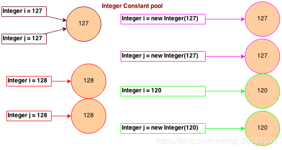

Java 程序是运行在虚拟机（ JVM ）上的，而不是直接运行在操作系统上的，所以 Java语言具有编译一 次到处运行的“跨平台特性”


# 1.Java内存区域
## JVM内存结构

主要有三大块：**堆内存、方法区和栈**。堆内存是JVM中最大的一块由年轻代和老年代组成，而年轻代内存又被分成三部分，Eden空间、From Survivor空间、To Survivor空间,默认情况下年轻代按照8:1:1的比例来分配；  
  
  
**控制参数：** 没有直接设置老年代的参数， **老年代空间大小=堆空间大小-年轻代大空间大小**   
-Xms设置堆的最小空间大小。  
-Xmx设置堆的最大空间大小。  
-XX:NewSize设置新生代最小空间大小。  
-XX:MaxNewSize设置新生代最大空间大小。  
-XX:PermSize设置永久代最小空间大小。  
-XX:MaxPermSize设置永久代最大空间大小。  
-Xss设置每个线程的堆栈大小。  

Java 虚拟机所管理的内存 包括能装载字节码的**类装载子系统、运行时数据区、执行引擎平和本地接口** 
  

### 运行时数据区

为什么分区：**不同的对象数据存活期不同，为了方便归类进行垃圾回收**
  

#### 程序计数器(线程独享)：

记录线程执行字节码的行号指示器

- 字节码解释器通过改变程序计数器来依次读取指令，从而实现代码的流程控制，如：顺序执行、选择、循环、异常处理。
- 在多线程的情况下，程序计数器用于记录当前线程执行的位置，从而当线程被切换回来的时候能够知道该线程上次运行到哪儿了。
- 如果线程正在执行的是 Java 方法， 这个计数器记录的是正在执行的虚拟机字节码指令的地址； 如果正在执行的是 Native 方法， 这个计数器的值为空。   
- 唯一一个在Java虚拟机规范中没有规定任何OutOfMemoryError情况的区域。

#### Java虚拟机栈(线程独享)：

描述Java方法执行的内存模型： 

- Java虚拟机栈是由一个个栈帧组成，每个方法在执行的同时都会创建一个栈帧（StackFrame），每个栈帧存储**局部变量表、操作数栈、动态链接、方法出口**等
- 局部变量表所需内存空间在**编译期完成分配**，之后不会改变；局部变量表存放数据类型（boolean、byte、char、short、int、float、long、double）、对象引用和returnAddress类型（指向了一条字节码指令的地址）。
- 64位长度的long和double类型的数据会占用2个局部变量空间（Slot），其余的数据类型只占用1个。**局部变量表所需的内存空间在编译期间完成分配**，当进入一个方法时，这个方法需要在帧中分配多大的局部变量空间是完全确定的，在方法运行期间不会改变局部变量表的大小。
- 会抛出StackOverflowError和OutOfMemoryError
如果线程请求的栈深度大于虚拟机所允许的深度，将抛出StackOverflowError异常；
如果虚拟机栈可以动态扩展（当前大部分的Java虚拟机都可动态扩展，只不过Java虚拟机规范中也允许固定长度的虚拟机栈），当扩展时无法申请到足够的内存时会抛出OutOfMemoryError异常。

#### 本地方法栈(线程独享)：

为Native方法服务

- StackOverflowError和OutOfMemoryError

#### Java堆（GC堆）：

在虚拟机启动时创建，存放**对象实例、数组**；

- 此内存区域的唯一目的就是**存放对象实例**，几乎所有的对象实例都在这里分配内存；Java堆可以处于物理上不连续的内存空间中，只要逻辑上是连续的即可。
- **新生代（Eden，From Survivor，To Survivor）、老年代**
- OutOfMemoryError

#### 方法区：

**类信息（类的全限定名）、常量、静态变量、即时编译器编译后的代码**等；

- 很多人愿意把方法区称为“永久代”（Permanent Generation），本质上两者并不等价，方法区是JVM 的规范， 而永久代则是 JVM 规范的一种实现， 并且只有 HotSpot 才有 “PermGenspace”。  
- 也需要垃圾清理

> HotSpot 虚拟机将 GC 分代收集拓展至方法区， 或者说使用永久代来实现方法区。 这样的HotSpot 的垃圾收集器可以像管理 Java 堆一样管理这部分内存， 能够省去专门为方法区编写内存管理代码的工作。 如果实现方法区属于虚拟机实现细节， 不受虚拟机规范约束， 但是用永久代实现方法区， 并不是一个好主意， 因为这样容易遇到**内存溢出问题**。
>
> 垃圾收集行为在这个区域是比较少出现的， 但并非数据进入方法区就永久存在了。 这区域的内存回收目标主要是**针对常量池的回收和对类型的卸载**。
>
> ==在 Java8 中， 永久代被删除， 方法区的 HotSpot 的实现为 **Metaspace 元数据区， 不放在虚拟机中而放在本地内存中， 存储类的元信息**；而将**类的静态变量（放在 Class 对象中） 和运行时常量池放在堆中**==

-----

#### 常量池

在Java体系中，共用三种常量池。分别是**字符串常量池**、**Class常量池**和**运行时常量池**。

##### [Class常量池](http://hollischuang.gitee.io/tobetopjavaer/#/basics/java-basic/class-contant-pool?id=class常量池)

> Java可以通过javac命令编译成字节码，有了字节码，无论是哪种平台（如Windows、Linux等），只要安装了虚拟机，都可以直接运行字节码。而且虚拟机不在乎字节码是通过哪一种语言得来的。

Class常量池可以理解为是`.Class`文件中的资源仓库。 Class文件中除了包含类的版本、字段、方法、接口等描述信息外，还有一项信息就是常量池(constant pool table)，用于存放编译器生成的各种**字面量(Literal)和符号引用(Symbolic References)。**

由于不同的Class文件中包含的常量的个数是不固定的，所以在Class文件的常量池入口处会设置两个字节的常量池容量计数器，记录了常量池中常量的个数。



> 字面量（literal）是用于表达源代码中一个固定值的表示法（notation）。说简单点，字面量就是指由字母、数字等构成的字符串或者数值。
>
> 字面量只可以右值出现，所谓右值是指等号右边的值，如：int a=123这里的a为左值，123为右值。

> 符号引用是编译原理中的概念，是相对于直接引用来说的。主要包括了以下三类常量： * 类和接口的全限定名 * 字段的名称和描述符 * 方法的名称和描述符

https://blog.csdn.net/luanlouis/article/details/39960815

Java代码在进行`Javac`编译的时候，并不像C和C++那样有“连接”这一步骤，而是在虚拟机加载Class文件的时候进行动态连接。也就是说，在Class文件中不会保存各个方法、字段的最终内存布局信息，因此这些字段、方法的符号引用不经过运行期转换的话无法得到真正的内存入口地址，也就无法直接被虚拟机使用。当虚拟机运行时，需要从常量池获得对应的符号引用，再在类创建时或运行时解析、翻译到具体的内存地址之中。关于类的创建和动态连接的内容，在虚拟机类加载过程时再进行详细讲解。

前面这段话，看起来很绕，不是很容易理解。其实他的意思就是： Class是用来保存常量的一个媒介场所，并且是一个中间场所。在JVM真的运行时，需要把常量池中的常量加载到内存中。

##### 运行时常量池：

存放编译期已经被确定，存放在`.class`文件中的**字面量和符号引用**数据；

- **JDK1.7及之后版本的 JVM 已经将运行时常量池从方法区中移了出来**，在 **Java 堆（Heap）**中开辟了一块区域存放运行时常量池。
- OutOfMemoryError

#### 直接内存
直接内存（Direct Memory） 并不是虚拟机运行时数据区的一部分， 也不是 Java 虚拟机规范中定义的内存区域， 但这部分内存也被频繁使用。 JDK 的 NIO 类， 引入了一种基于通道和缓冲区的 IO 方式， 它可以使用 Native 函数库直接分配堆外内存， 然后通过一个存储在堆中的 DirectByteBuffer 对象作为这块内存的引用进行操作。 这样能在一些场合显著提高性能，避免了在 Java 堆和 Native 堆来回复制数据。

直接内存的分配不会受到 Java 堆大小的限制， 但会受到本机总内存的限制。  

# 2.对象

## 2.1 对象创建过程

*   **①类加载检查：** 虚拟机遇到一条 **new 指令**时，首先将去检查这个指令的参数是否能在常量池中定位到这个**类的符号引用**，并且检查这个符号引用代表的类是否已被加载过、解析和初始化过。如果没有，那必须先执行相应的**类加载过程**（加载-验证-准备-解析-初始化）。
*   **②分配内存：** 在**类加载检查**通过后，接下来虚拟机将为新生对象**分配内存**。对象所需的内存大小在类加载完成后便可确定，为对象分配空间的任务等同于把一块确定大小的内存从 Java 堆中划分出来。
    - **内存分配的两种方式：（补充内容，需要掌握）**  
    **分配方式**有 **“指针碰撞”** 和 **“空闲列表”** 两种，**选择那种分配方式由 Java 堆是否规整决定**。而 Java 堆内存是否规整，取决于 GC 收集器的算法是"标记-清除"，还是"标记-整理"（也称作"标记-压缩"），值得注意的是，复制算法内存也是规整的
    - **内存分配并发问题(补充内容，需要掌握:** 在创建对象的时候有一个很重要的问题，就是线程安全，因为在实际开发过程中，创建对象是很频繁的事情，作为虚拟机来说，必须要保证线程是安全的，通常来讲，虚拟机采用两种方式来保证线程安全
      - **CAS+失败重试：** CAS 是乐观锁的一种实现方式。所谓乐观锁就是，每次不加锁而是假设没有冲突而去完成某项操作，如果因为冲突失败就重试，直到成功为止。**虚拟机采用 CAS 配上失败重试的方式保证更新操作的原子性。**
      - **TLAB（本地线程分配缓冲）：** 为每一个线程预先在Eden区分配一块儿内存，JVM在给线程中的对象分配内存时，首先在TLAB分配，当对象大于TLAB中的剩余内存或TLAB的内存已用尽时，再采用上述的CAS进行内存分配
*   **③初始化零值：** 内存分配完成后， 虚拟机需要将分配到的内存空间都初始化为零值（不包括对象头），这一步操作保证了对象的实例字段在 Java 代码中可以不赋初始值就直接使用，程序能访问到这些字段的数据类型所对应的零值。
*   **④设置对象头：** 初始化零值完成之后，**虚拟机要对对象进行必要的设置**，例如这个对象是那个类的实例、如何才能找到类的元数据信息、对象的哈希吗、对象的 GC 分代年龄等信息。 **这些信息存放在对象头中。** 另外，根据虚拟机当前运行状态的不同，如是否启用偏向锁等，对象头会有不同的设置方式。
*   **⑤执行 init 方法：** 在上面工作都完成之后，从虚拟机的视角来看，一个新的对象已经产生了，但从 Java 程序的视角来看，对象创建才刚开始，`<init> `方法（构造方法）还没有执行，所有的字段都还为零。所以一般来说，执行 new 指令之后接着执行 `<init> `方法，将**对象属性值进行显示初始化并执行构造方法**（调用子类`<init> `方法之前会先调用父类`<init> `方法）  

**存在继承的情况下，初始化顺序为：**
1.  父类（静态变量、静态语句块）
2.  子类（静态变量、静态语句块）
3.  父类（实例变量、普通语句块）——>父类（构造函数）
4.  子类（实例变量、普通语句块）——>子类（构造函数）

## 2.2 对象的内存布局：
在 HotSpot 虚拟机中， 对象在内存中存储的布局可以分为 3 个区域 ： **对象头、实例数据、对齐填充**

*   对象头：
    - 运行时数据/MarkWord（32bit/64bit）：HashCode、GC分代年龄、锁状态标志、线程持有的锁、偏向线程ID、偏向时间戳等；
    - 类型指针：对象指向他的类元数据的指针， 虚拟机通过这个指针来确定这个对象是哪个类的实例。  
*   实例数据：对象真正存储的有效信息，也是在程序中所定义的各种类型的字段内容。无论是从父类继承的， 还是在子类中定义的， 都需要记录下来。 相同宽度的字段总是被分配到一起， 在这个前提下， 在父类中定义的变量会出现在子类之前  
*   对齐填充：占位符（对象大小必须是8字节的整数倍）
    

## 2.3 对象的访问

**Java程序需要通过栈上的reference操作具体对象**

*   **句柄：**   如果使用句柄的话，那么Java堆中将会划分出一块内存来作为句柄池，reference 中存储的就是对象的句柄地址，而句柄中包含了对象实例数据与类型数据各自的具体地址信息；
*   
*   **直接指针：**  如果使用直接指针访问，那么 Java 堆对象的布局中就必须考虑如何放置访问类型数据的相关信息，而reference 中存储的直接就是对象的地址。
*   
*   这两种对象访问方式各有优势。使用句柄来访问的最大好处是 reference 中存储的是稳定的句柄地址，在对象被移动时只会改变句柄中的实例数据指针，而 reference 本身不需要修改。使用直接指针访问方式最大的好处就是速度快，它节省了一次指针定位的时间开销。

## 2.4 内存溢出和内存泄漏

### 堆溢出
Java 堆用于存储对象实例， 只要不断增加对象， 并且保证 GC Roots 到对象之间有可达路径来避免垃圾回收机制清除这些对象， 那么在对象数量达到最大堆的容量限制后就会产生OOM 异常。  

> VM Options: -Xms20m -Xmx20m -XX:+HeapDumpOnOutOfMemoryError  

- 要解决这个区域的异常， 一般的手段是通过内存映像分析工具对 dump 出来的堆转储快照进行分析， 重点是确认内存中的对象是否是必要的， 也就是要判断是出现来内存泄露还是内存溢出。 前者的话要进一步通过工具查看泄露对象到 GC Roots 的引用链； 后者的话可以**调大虚拟机的堆参数（-Xms 和-Xmx）** ， 或者从代码上检查某些对象**生命周期过长**等  

### 栈溢出（虚拟机栈和本地方法栈）
对于 HotSpot 来说， 虽然-Xoss 参数（设置本地方法栈大小） 存在， 但实际上是无效的， 栈容量只由`-Xss `参数设定。 关于虚拟机栈和本地方法栈， 在 JVM 规范中描述了两种异常：

1. 如果线程请求的栈深度大于虚拟机所允许的最大深度， 将抛出 StackOverflowError 异常。
2. 如果虚拟机在扩展栈时无法申请到足够的内存空间， 将抛出 OutOfMemoryError 异常。  

> -Xss128k（设置栈容量）  

- 操作系统分配给每个进程的内存是有限制的， 每个线程分配到的栈容量越大， 可以建立的线程数量自然就越少， 建立线程时就越容易把剩下的内存耗尽。
- 如果线程过多导致 SOF， 可以通过**减少最大堆和减少栈容量**来换取更多的线程。  

### 方法区溢出
注意 Java8 下运行时常量池在堆中， 所以运行时常量池过大会体现为 `OOM：heap`；
而在此以前是放在永久代中， 体现为 `OOM：PermGen space`。  

> VM Options: -Xms20m -Xmx20m  

方法区还存放 Class 的相关信息， 运行时产生大量的类也会导致方法区（Java8 中放在直接内存中） 溢出  

> VM Options: -XX:MetaspaceSize=10m -XX:MaxMetaspaceSize=10m  

- 方法区溢出也是一种常见的内存溢出异常， 一个类被 GC， 判定条件是比较苛刻的。 在经常生成大量 Class 的应用中， 需要特别注意类的回收情况。 这类场景除了动态代理生成类和动态语言外， 还有： 大量使用 JSP、 基于 OSGi 的应用  

### 直接内存溢出
直接内存可以使用`-XX:MaxDirectMemorySize` 指定， 如果不指定， 则默认与 Java 堆最大值相同。
虽然使用 DirectByteBuffer 分配内存也会抛出 OOM 异常， 但它抛出异常时并没有真正向 OS申请分配内存， 而是通过计算得知内存无法分配， 于是手动抛出异常。

真正申请内存的方法是 `nsafe.allocateMemory()`。  

> VM Options: -XX:MaxDirectMemorySize=10m  

### 内存泄露
1） 非静态内部类
2） 连接未关闭： 比如数据库连接（dataSourse.getConnection()） ， 网络连接(socket)和 io 连接， 除非其显式的调用了其 close（） 方法将其连接关闭， 否则是不会自动被 GC 回收的。  

## 2.5 String 类和常量池

### **1 String 对象的两种创建方式：**

```
String str1 = "abcd";
String str2 = new String("abcd");  
System.out.println(str1==str2);//false
```
第一种方式是在常量池中拿对象，第二种方式是直接在堆内存空间创建一个新的对象。


### 2 String 类型的常量池
如果是**编译期已经创建好**(直接用双引号定义的)的就存储在常量池中，如果是**运行期（new出来的）**才能确定的就存储在堆中。

如果不是用双引号声明的 String 对象，可以使用 String 提供的` intern()` 方法。

- **String.intern()**是一个 Native 方法，它的作用是：**如果运行时常量池中已经包含一个等于此 String 对象内容的字符串，则返回常量池中该字符串的引用；如果没有，则在常量池中创建与此 String 内容相同的字符串，并返回常量池中创建的字符串的引用。**

```
String s1 = new String("计算机");
String s2 = s1.intern();
String s3 = "计算机";
System.out.println(s2);//计算机
System.out.println(s1 == s2);//false，因为一个是堆内存中的String对象一个是常量池中的String对象
System.out.println(s3 == s2);//true，因为两个都是常量池中的String对象
```

### 3 String 字符串拼接

尽量避免使用引用进行多个字符串拼接，因为这样会重新创建对象。如果需要改变字符串的话，可以使用 StringBuilder 或者 StringBuffer。

```
String str1 = "str";
String str2 = "ing";
String str3 = "str" + "ing";//常量池中的对象
String str4 = str1 + str2; //在堆上创建的新的对象      
String str5 = "string";//常量池中的对象
System.out.println(str3 == str4);//false
System.out.println(str3 == str5);//true
System.out.println(str4 == str5);//false
```


> **String s1 = new String("abc");这句话创建了几个对象？**  
> 创建了两个对象。先有字符串"abc"放入常量池，然后 new 了一份字符串"abc"放入Java堆(字符串常量"abc"在编译期就已经确定放入常量池，而 Java 堆上的"abc"是在运行期初始化阶段才确定)，然后 Java 栈的 str1 指向Java堆上的"abc"。

## 2.6 Integer常量

1. `Integer i = value`;如果i是在`-128到127`之间，不会去堆中创建对象，而是直接返回IntegerCache中的值;如果值不在上面范围内则会从堆中创建对象。`"=" 走的是valueOf()方法,valueOf(int)会走缓存`。
2. `Integer i2 = new Integer(xxxx)`;不管参数的value是多少都会从堆中创建对象，与IntegerCache没关系。
3.  `Integer.valueOf() `返回一个表示指定的 int 值的`Integer 实例`。内部是“如果i在-128~127之间直接返回IntegerCache中的Integer实例，否则使用构造方法 Integer(int)创建新的实例”，该方法有可能通过缓存经常请求的值而显著提高空间和时间性能。
4.  `Integer.parseInt(string s)`的作用就是把字符串s解析成有符号的`int基本类型`
5.  `Integer.valueOf(String s)`把字符串s解析成Integer对象类型，返回的integer包装类型 可以调用对象中的方法。

