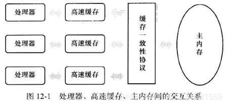
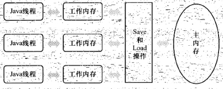
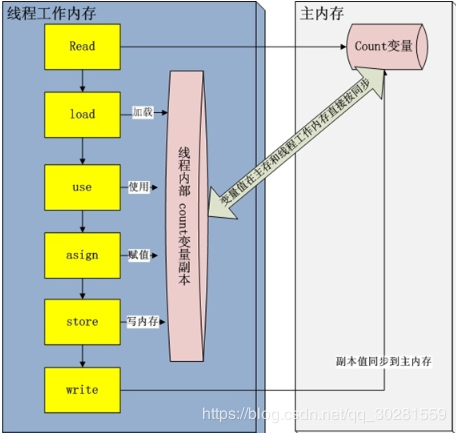
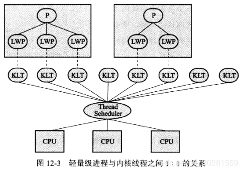
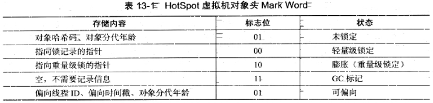
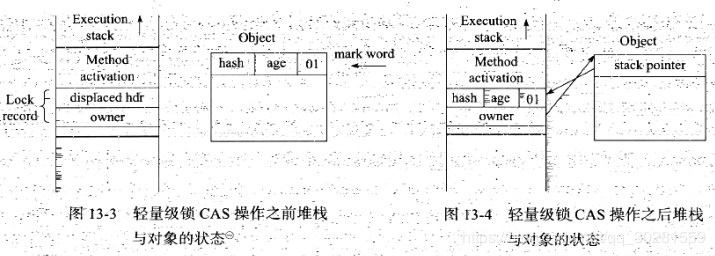
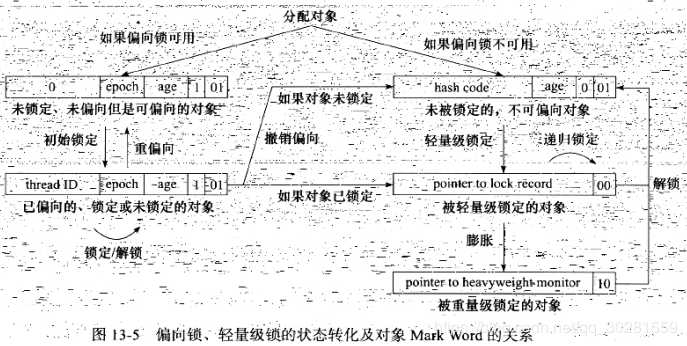

# 12.java内存模型与线程
## 12.1Java内存模型JMM

Java内存模型的主要目标是**定义程序中各个变量的访问规则；即在虚拟机中将变量存储到内存和从内存中取出变量这样的底层细节**。此处的变量（Variables）与java编程中所说的变量有所区别，它<u>包括了实例字段、静态字段和构成数组对象的元素，但不包括局部变量与方法参数</u>，因为后者是线程私有的，不会被共享，自然就不会存在竞争问题。

### **主内存与工作内存**
Java内存模型规定所有的变量都存储在主内存（Main Memory中（此处的主内存：与介绍物理硬件时的主内存名字一样，两者也可以互相类比，但此处仅是虚拟机内存的一部分）。

每条线程还自己的工作内存（Working Meimory，可与前面讲的处理器高速缓存类比），线程的工作内存中保存了被该线程使用到的变量的主内存副本拷贝；线程对变量的所有操作（读取、赋值等）都必须在工作内存中进行，而不能直接读写主内存中的变量”。不同的线程之间也无法直接访问对方工作内存中的变量，线程间变量值的传递均需要通过主内存来完成，线程、主内存、工作内存三者的交关系如图:

>注：这里所讲的主内存、工作内存与Java内存区域中的Java堆、栈、方法区等并不是同一个层次的内存划分，这两者基本上是没有关系的：如果两者一定要勉强对应起来，那从变量、主内存、工作内存的定义来看，主内存主要对应于Java堆中的对象实例数据部分，而工作内存则对应于虚拟机栈中的部分区域。从更低层次上说，主内存就直接对应于物理硬件的内存，而为了获取更好的运行速度，虚拟机（甚至是硬件系统本身的优化措施）可能会让工作内存优先存储于寄存器和高速缓存中，因为程序运行时主要访问读写的是工作内存。

### 内存间交互操作

关于主内存与工作内存之间具体的交互协议，即一个变量如何从主内存拷贝到工作内存、如何从工作内存同步回主内存之类的实现细节，Java内存模型中定义了以下8种操作来完成，虚拟机实现时必须保证下面提及的每一种操作都是原子的、不可再分的（对于double和long类型的变量来说，load、store、read和write操作在某些平台上允许有例外；

- lock（锁定）：作用于主内存的变量，它把一个变量标识为一条线程独占的状态。

- unlock(解锁)：作用于主内存的变量，它把一个处于锁定状态的变量释放出来，释放后的变量才可以被其他线程锁定。

- read（读取）：作用于 主内存的变量，它把一个变量的值从主内存传输到线程的工作内存中，以便随后的load动作使用。

- load（载入)：作用于工作内存的变量，它把read操作从主内存中得到的变量值放入工作内存的变量副本中。

- store(存储)：作用于工作内存的变量，它把工作内存中一个变量的值传送到主内存中，以便随后的write操作使用。

- write（写入)：作用于 主内存的变量，它把store操作从工作内存中得到的变量的值放入主内存的变量中。

- use(使用）：作用于工作内存的变量，它把工作内存中一个变量的值传递给执行引擎，每当虚拟机遇到一个需要使用到变量的值的字节码指令时将会执行这个操作。

- assign(赋值)：作用于工作内存的变量，它把一个从执行引擎接收到的值赋给工作内存的变量，每当虚拟机遇到一个给变量赋值的字节码指令时执行这个操作。

  

### volatile
当一个变量定义为volatile之后，它将具备两种特性：

- 第一是保证此变量对所有线程的可见性，这里的“可见性”是指当一条线程修改了这个变量的值，新值对于其他线程来说是可以立即得知的。
- 第二是禁止指令重排序

**volatile实现原理：**
使用Violatile修饰的变量在汇编阶段，会多出一条**lock前缀指令**，它在多核处理器下回引发两件事情：

- 将当前处理器缓存行的数据写回到系统内存
- 这个写回内存的操作会使在其他CPU里缓存了该内存地址的数据无效。

> 通常处理器和内存之间都有几级缓存来提高处理速度，处理器先将内存中的数据读取到内部缓存后再进行操作，但是对于缓存写会内存的时机则无法得知，因此在一个处理器里修改的变量值，**不一定能及时写会缓存，这种变量修改对其他处理器变得“不可见”了**。但是，使用Volatile修饰的变量，在写操作的时候，会强制将这个变量所在缓存行的数据写回到内存中，但即使写回到内存，其他处理器也有可能使用内部的缓存数据，从而导致变量不一致，所以，在多处理器下，为了保证各个处理器的缓存是一致的，就会实现缓存一致性协议，每个处理器通过嗅探在总线上传播的数据来检查自己缓存的值是不是过期，如果过期，就会将该缓存行设置成无效状态，下次要使用就会重新从内存中读取。

> 在本节的最后，我们回头着下Java内存模型中对volatile变量定义的特殊规则。假定T表示个线程，v和w分别表示两个volatile 型变量：那么在进行read、load、use、asign、store 和write 操作时需要满足如下规则：
>
> 只有当线程对变量v执行的前一个动作是load的时候，线程才能对变量v执行use动作：并且只有当线程T对变量v执行的后一个动作是use的时候，线程能对变量V执行load动作。线程T对变量的use动作可以认为是和线程对变量V的load/read动作相关联；必须连续一起出现（这条规则要求在工作内存中每次使用V前都必须先主内存刷新最新的值用主保证能看见其他线程对变量V.所做的修改后的值。
>
> 只有当线程T对变量v执行的前一个动作是assign 的时候，线程T能对变量v执行store 动作并更有当线程对变量v，执行的后个动作是store的时候；线程T才能对英量v执行assign动作。线程T对变量V的assign 动作可以认为是和线程T对变量v的stores /write动作相关联，.必须连续起出现（这条规则要求在工作内存中每次修改v后都必须立刻同步回主内存中，用于保证其他线程可以看到自己对变量v所做的修改）。
>
> 假定动作A是线程T对变量V实施的use或assign动作，
> 假定动作F是和动作A相关联的load或store动作，
> 假定动作P是和动作下相应的对变量v的read或write动作：
> 假定动作B是线程T对变量w实施的use或asign动作，
> 假定动作G是和动作B相关联的load或store动作，
> 假定动作Q是和动作G相应的对变量w的read或 write动作。
> 则如果A先于B，那么P先于Q（这条规则要求volatile修饰的变量不会被指令重排序优化，保证代码的执行顺序与程序的顺序相同）。

### 原子性
由Java内存模型来直接保证的原子性变量操作包括read、load、assign、use、store和write，我们大致可以认为**基本数据类型的访问读写是具备原子性的（例外就是long和double的非原子性协定**，读者只要知道这件事情就可以了，无须太过在意这些几乎不会发生的例外情况）。如果应用场景需要一个更大范围的原子性保证（经常会遇到），Java内存模型还提供了lock和unlock操作来满足这种需求，尽管虚拟机未把lock和unlock操作直接开放给用户使用，但是却提供了更高层次的字节码指令monitorenter和monitorexit来隐式地使用这两个操作，这两个字节码指令反映到Java代码中就是同步块—synchronized关键字，因此在synchronized块之间的操作也具备原子性。

java 并发包中有一些并发框架也使用了**自旋CAS的方式来实现原子操作**

### 可见性（Visibility)：
可见性是指当一个线程修改了共享变量的值，其他线程能够立即得知这个修改。上文在讲解 volatile变量的时候我们已详细讨论过这一点。Java内存模型是通过在变量修改后将新值同步回主内存，在变量读取前从主内存刷新变量值这种依赖主内存作为传递媒介的方式来实现可见性的，无论是普通变量还是volatile变量都是如此，普通变量与volatile变量的区别是，volatile的特殊规则保证了新值能立即同步到主内存，以及每次使用前立即从主内存刷新。因此，可以说volatile保证了多线程操作时变量的可见性，而普通变量则不能保证这一点。

**除了volatile之外，Java还有两个关键字能实现可见性，即synchronized和final**。

- **同步块的可见性**是由“对一个变量执行unlock操作之前，必须先把此变量同步回主内存中（执行store、write操作）”这条规则获得的；
- **而final关键字的可见性**是指：被final修饰的字段在构造器中一旦初始化完成，并且构造器没有把“this”的引用传递出去（this引用逃逸是一件很危险的事情，其他线程有可能通过这个引用访问到“初始化了一半”的对象），那在其他线程中就能看见final字段的值。

### 有序性（Ordering）：
Java程序中天然的有序性可以总结为一句话：如果在本线程内观察，所有的操作都是有序的；如果在一个线程中观察另一个线程，所有的操作都是无序的。前半句是指“线程内表现为串行的语义”（Within-Thread As-If-Serial Semantics)，后半句是指“指令重排序”现象和“工作内存与主内存同步延迟”现象。

Java语言提供了**volatile和synchronized**两个关键字来保证线程之间操作的有序性，volatile关键字本身就包含了禁止指令重排序的语义，而synchronized则是由“**一个变量在同一个时刻只允许一条线程对其进行lock操作”**这条规则获得的，这条规则决定了持有同一个锁的两个同步块只能串行地进。

1. 先行发生原则
   程序次序规则（Program erder Rule）：在一个线程内，按照程序代码顺序，书写在前面的操作先行发生于书写在后面的操作。准确地说，应该是控制流顺序而不是程序代码顺序，因为要考虑分支、循环等结构。
2. 管程锁定规则：（Monitor Lock Rile）:一个unlock 操作先行发生于后面对同二个锁的lock操作。这里必须强调的是同一个锁；而“后面”是指时间上的先后顺序。
3. volatile变量规则（Volatile Variable Rule）：对一个volatile变量的写操作先行发生于后面对这个变量的读操作，这里的：“后面“同样是指时间上的先后顺序。
4. 线程启动规则（Thread Start Rule）：Thread对象的start（）方法先行发生于此线程的每一个动作。线程终止规则Thread Termination Rule）：线程电的所有操作都先行发生手对此线程的终正检测，我们
5. 可以通Thread.join方法结束，Thread.isAlive的返回值等手段检测到线程已经终止执行
6. 线程中断规则（Thread Interuption Rule）：对线程interupt方法的调用先行发生于被中断线程的代码检测到中断事件的发生，可以通过Thread.interiupted方法检测到是否有中断发生
7. 对象终结规则（Finalizer.Rule）：个对象的初始化完成（构造函数执行结束）先行发生于它的finalize方法的开始
8. 传递性：（Transitivity）:如果A操作先行发生于操作B，操作B先行发生于操作C就可以得出操作A先行发生于操作C的结论。

## 12.2 java与线程
线程是比进程更轻量级的调度执行单位；**线程的引入，可以把一个进程的资源分配和执行调度分开，各个线程既可以共享进程资源（内存地址、文件/o等），又可以独立调度（线程是CPU调度的基本单位）**。

实现线程主要有3种方式：**使用内核线程实现、使用用户线程实现、使用用户线程加轻量级进程混合实现**。.

1. 使用内核线程实现

内核线程（Kernel.Lever.Thread，KLT)就是直接由操作系统内核（Kermel，下称内核）支持的线程，这种线程由内核来完成线程切换，内核通过操纵调度器：（Scheduler）对线程进行调度，并负责将线程的任务映射到各个处理器上。每个内核线程可以视为内核的一个分身，这样操作系统就有能力同时处理多件事情，支持多线程的内核就叫做多线程内核（Multi-Threads Kernel)。

程序一般不会直接去使用内核线程，而是去使用内核线程的一种高级接口——轻量级进程（Light Weight Process，LWP)，轻量级进程就是我们通常意义上所讲的线程，由于每个轻量级进程都由一个内核线程支持，因此只有先支持内核线程，才能有轻量级进程。这种轻量级进程与内核线程之间1：1的关系称为一对一的线程模型，如图所示。

由于内核线程的支持，每个轻量级进程都成为一个独立的调度单元，即使有一个轻量级进程在系统调用中阻塞了，也不会影响整个进程继续工作，但是轻量级进程具有它的局限性：首先，由于是基于内核线程实现的，所以各种线程操作，如创建、析构及同步，都需要进行系统调用。而系统调用的代价相对较高，需要在用户态（User Mode)和内核态（KernelMode)中来回切换。其次，每个轻量级进程都需要有一个内核线程的支持，因此轻量级进程要消耗一定的内核资源（如内核线程的栈空间），因此一个系统支持轻量级进程的数量是有限的。
### Java线程调度
线程调度是**指系统为线程分配处理器使用权**的过程，主要调度方式有两种；分别是**协同式线程调度（Cooperative Threads-Scheduling）和抢占式线程调度（Preemptive Threads-Scheduling)**。

如果使用协同式调度的多线程系统，线程的执行时间由线程本身来控制，线程把自己的工作执行完了之后，要主动通知系统切换到另外一个线程上。协同式多线程的最大好处是实现简单，但是会导致一直阻塞；

如果使用抢占式调度的多线程系统，那么每个线程将由系统来分配执行时间，线程的切换不由线程本身来决定（在Java中，Thread.yield可以让出执行时间，但是要获取执行时间的话，线程本身是没有什么办法的）。在这种实现线程调度的方式下，线程的执行时间是系统可控的，也不会有一个线程导致整个进程阻塞的问题，**Java使用的线程调度方式就是抢占式调度**。
# 13.线程安全与锁优化
## 13.1线程安全
线程安全：恰当的定义：“**当多个线程访问一个对象时，如果不用考虑这些线程在运行时环境下的调度和交替执行，也不需要进行额外的同步，或者在调用方进行任何其他的协调操作，调用这个对象的行为都可以获得正确的结果，那这个对象是线程安全的**”。

按照线程安全的“安全程度”由强至弱来排序，我们可以将Java语言中各种操作共享的数据分为以下5类：**1不可变、2绝对线程安全、3相对线程安全、4线程兼容、5线程对立**

### 1.不可变
在Java语言中**不可变（Immutable)的对象一定是线程安全的**，无论是对象的方法实现还是方法的调用者，都不需要再采取任何的线程安全保障措施，只要一个不可变的对象被正确地构建出来（没有发生this引用逃逸的情况），那其外部的可见状态永远也不会改变，永远也不会看到它在多个线程之中处于不一致的状态。“不可变”带来的安全性是最简单和最纯粹的。

### 2.互斥同步（悲观锁）——加锁
互斥同步（MutuaFExclusion &Syncironization)是常见的一种**并发正确性保障手段**。

同步是指在多个线程并发访问共享数据时，**保证共享数据在同一个时刻只被一个（或者是一些，使用信号量的时候）线程使用**。

而互斥是**实现同步的一种手段**，临界区(Critical Section)在斥量（Mutex）和信号量（Semaphore）都是主要的互斥实现方式。因此，在这4个字里面，**互斥是因，同步是果：互斥是方法，同步是目的**。
1. **synchronized关键字**
   - 在Java中，最基本的同步手段就是**synchronized关键字**，synchronizcd 关键字经过编译之后，在字节码中会在同步块的前后分别形成**monitorenter和monitorexit** 这两个字节码指令，这两个字带码都需要一个<u>reference类型的参数来指明要锁定和解锁的对象</u>。如果Java程序中的synchronized 明确指定了对象参数，那就是这个对象的reference；如果没有明确指定，那就根据synchronized修饰的是实例方法还是类方法，去取对应的对象实例或Class对象来作为锁对象。
   - 在执行monitorenter指令时，首先要尝试**获取对象的锁（monitor）**。如果这对象没被锁定，或者当前线程已经拥有了那个对象的锁；把锁的**计数器加1**；相应的在执行monitorexit指令时会将锁计数器减1；当计数器为0时锁就被释放。如果获取对象锁失败，那当前线程就要阻塞等待；直到对象锁被另外一个线程释放。首先，synclironized同步块对同一条线程来说是**可重入的**，不会出现把自己锁死的问题。其次同步块在已进人的线程执行完之前，会阻塞后面其他线程的进入。
   - **任何对象都有一个monitor与之关联，当且一个monitor被持有后，它将处于锁定状态**。线程执行到monitorenter指令时，将会尝试获取对象所对应的monitor的所有权，即尝试获得对象的锁。

2. **java.util.concurrent**（下文称J.U.C中的重入锁(ReentrantLock)来实现同步
   - 在基本用法上，ReentrantLock.与synchronized很相似，他们都具备一祥的线程重入特性，只是代码写法上有点区别，**一个表现为API层面的互斥锁：lock和unlock方法配合try/finally语句块来完成；另一个表现为原生语法层面的互斥锁**。不过，相比synchronized，ReentrantLock增加了些高级功能，主要有以下3项：**等待可中断、可实现公平锁，以及锁可以绑定多个条件**。
   - **等待可中断**是指当持有锁的线程长期不释放锁的时候，正在等待的线程可以选择放弃等待，改为处理其他事情，可中断特性对处理执行时间非常长的同步块很有帮助。
   - **公平锁**是指多个线程在等待同一个锁时，必须按照申请锁的时间顺序来依次获得锁；而非公平锁则不保证这一点，在锁被释放时，任何一个等待锁的线程都有机会获得锁。**synchronized中的锁是非公平的，ReentrantLock默认情况下也是非公平的，但可以通过带布尔值的构造函数要求使用公平锁**。
   - 锁绑定多个条件是指**一个ReentrantLock对象可以同时绑定多个Condition对象**，而在synchronizcd中，锁对象的wait(）和notify()或notifyAll()方法可以实现一个隐含的条件，如果要和多于一个的条件关联的时候，就不得不额外地添加一个锁，而ReentrantLock则无须这样做，只需要多次调用`new Condition()`方法即可。

### 3. 非阻塞同步（乐观锁）——CAS
互斥同步最主要的问题就是进行线程阻塞和唤醒所带来的性能问题，因此这种同步也称为阻塞同步（Blocking Synchronization)。**互斥同步属于一种悲观的并发策略**，无论共享数据是否真的会出现竞争，它都要进行加锁、用户态核心态转换、维护锁计数器和检查是否有被阻塞的线程需要唤醒等操作。
随着硬件指令集的发展，我们有了另外一个选择：**基于冲突检测的乐观并发策略**，通俗地说，<u>就是先进行操作，如果没有其他线程争用共享数据，那操作就成功了；如果共享数据有争用，产生了冲突，那就再采取其他的补偿措施（最常见的补偿措施就是不断地重试，直到成功为止)，这种乐观的并发策略的许多实现都不需要把线程挂起。</u>

使用乐观并发策略需要“**硬件指令集**的发展”才能进行呢？因为我们需要操作和冲突检测这两个步骤具备原子性，靠什么来保证呢？如果这里再使用互斥同步来保证就失去意义了，所以我们只能靠硬件来完成这件事情，硬件保证一个从语义上看起来需要多次操作的行为只通过一条处理器指令就能完成。

- CAS 指令
  - 需要有3个操作数，分别是**内存位置**（在Java中可以简单理解为变量的内存地址），用V表示、**旧的预期值**（用A表示）和**新值**（用B表示）。CAS指令执行时，当且仅当V符合旧预期值A时，处理器使用更新的值；否则它就不执行更新，但是无论是否更新了V的值，都会返回V的旧值，上述的处理过程是一个原子操作。

### 4. 无同步方案——天生线程安全的代码
要保证线程安全，并不是一定就要进行同步，两者没有因果关系。<u>同步只是保证共享数据争用时的正确性的手段，如果一个方法本来就不涉及共享数据，那它自然就无须任何同步措施去保证正确性，因此会有一些代码天生就是线程安全的</u>

1. **可重入代码**：可重入代码有一些共同的特征，例如不依赖存储在堆上的数据和公用的系统资源、用到的状态量都由参数中传入、不调用非可重入的方法等。我们可以通过一个简单的原则来判断代码是否具备可重入性：<u>如果一个方法，它的返回结果是可以预测的，只要输入了相同的数据，就都能返回相同的结果，那它就满足可重入性的要求，当然也就是线程安全的</u>。

2. **线程本地存储**（Thrcad Local Storage)：如果一段代码中所需要的数据必须与其他代码共享，那就看看这些共享数据的代码是否能保证在同一个线程中执行？如果能保证，我们就可以把共享数据的可见范围限制在同一个线程之内，这样，无须同步也能保证线程之间不出现数据争用的问题。

经典Web交互模型中的“一个请求对应一个服务器线程”（Thread-per-Request)的处理方式，这种处理方式的广泛应用使得很多Web服务端应用都可以使用线程本地存储来解决线程安全

Java.lang.ThreadLocal类来实现线程本地存储的功能。每一个线程的Thread对象中都有一个ThreadLocalMap对象，这个对象存储了一组以ThreadLocal.threadLocalHashCode为键，以本地线程变量为值的K-V值对，ThreadLocal对象就是当前线程的ThreadLocalMap的访问入口，每一个ThreadLocal对象都包含了一个独一无二的threadLocalllashCode值，使用这个值就可以在线程K-V值对中找回对应的本地线程变量。
# 13.2锁优化
### 自旋锁

如果物理机器有一个以上的处理器，能让两个或以上的线程同时并行执行，我们就可以让后面请求锁的那个线程“稍等一下”，但不放弃处理器的执行时间，看看持有锁的线程是否很快就会释放锁。为了让线程等待，我们只需让线程执行一个忙循环（自旋），这项技术就是所谓的自旋锁。

在JDK1.6中引入了**自适应的自旋锁**。自适应意味着自旋的时间不再固定了，而是由前一次在同一个锁上的自旋时间及锁的拥有者的状态来决定。如果在同一个锁对象上，自旋等待刚刚成功获得过锁，并且持有锁的线程正在运行中，那么虚拟机就会认为这次自旋也很有可能再次成功，进而它将允许自旋等待持续相对更长的时间。另外，如果对于某个锁，自旋很少成功获得过，那在以后要获取这个锁时将可能省略掉自旋过程，以避免浪费处理器资源。有了自适应自旋，随着程序运行和性能监控信息的不断完善，虚拟机对程序锁的状况预测就会越来越准确，虚拟机就会变得越来越“聪明”了。

### 锁消除

锁消除是指虚拟机即时编译器在运行时，对一些代码上要求同步，但是<u>被检测到不可能存在共享数据竞争的锁进行消除</u>。锁消除的主要判定依据来源于逃逸分析的数据支持。如果判断在一段代码中，堆上的所有数据都不会逃逸出去从而被其他线程访问到，那就可以把它们当做栈上数据对待，认为它们是线程私有的，同步加锁自然就无须进行

### 锁粗化

如果一系列的连续操作都对同一个对象反复加锁和解锁，甚至加锁操作是出现在循环体中的，那即使没有线程竞争，频繁地进行互斥同步操作也会导致不必要的性能损耗，就需要进行锁粗化

### 轻量级锁

轻量级锁是JDK1.6之中加入的新型锁机制，它名字中的“轻量级”是相对于使用操作系统互斥量来实现的传统锁而言的，因此传统的锁机制就称为“重量级”锁。首先需要强调一点的是，轻量级锁并不是用来代替重量级锁的，它的本意是在没有多线程竞争的前提下，减少传统的重量级锁使用操作系统互斥量产生的性能消耗。

要理解轻量级锁，以及后面会讲到的偏向锁的原理和运作过程，必须从HotSpot 虚拟机的对象（对象头部分）的内存布局开始介绍。
HotSpot虚拟机的**对象头（Object Header)**分为两部分信息，第一部分用于存储对象自身的**运行时数据**，如<u>哈希码（HashCode）、GC分代年龄（Generational GCAge)等</u>，这部分数据的长度在32位和64位的虚拟机中分别为32bit和64bit，官方称它为“Mark Word”，它是实现轻量级锁和偏向锁的关键。另外一部分用于存储**指向方法区对象类型数据的指针**，如果是数组对象的话，还会有一个额外的部分用于存储数组长度。

#### 轻量级锁CAS加锁        

在代码进入同步块的时候，如果此同步对象没有被锁定（锁标志位为“01”状态）-虚拟机<u>首先将在当前线程的栈帧中建立一个名为锁记录（Lock Record)的空间，用于存储锁对象目前的Mark Word的拷贝</u>（官方把这份拷贝加了一个Displaced前缀，即Displaced Mark Word)，这时候线程堆栈与对象头的状态如图13-3所示。然后，虚拟机将使用<u>CAS操作尝试将锁对象的：Mark Word 更新为指向栈帧中Lock Record的指针</u>。如果这个更新动作成功了，那么这个线程就拥有了该对象的锁，并且对象Mark Word的锁标志位（Mark Word的最后2bit)将转变为“00”，即表示此对象处于轻量级锁定状态，这时候线程堆栈与对象头的状态如图13-4所示。

如果这个更新操作失败了，虚拟机首先会检查对象的Mark Word是否指向当前线程的栈帧，如果是说明当前线程已经拥有了这个对象的锁，那就可以直接进入同步块继续执行，否则说明这个锁对象已经被其他线程抢占了。如果有两条以上的线程争用同一个锁，那轻量级锁就不再有效，要膨胀为重量级锁，锁标志的状态值变为“10”，Mark Word中存储的就是指向重量级锁（互斥量）的指针，后面等待锁的线程也要进入阻塞状态。

#### 轻量级锁CAS解锁

如果对象的Mark Word仍然指向着线程的锁记录，那就用CAS操作把对象当前的Mark Word和线程中复制的Displaced Mark Word替换回来，如果替换成功，整个同步操作过程就完成了。如果替换失败，说明有其他线程尝试过获取该锁（有锁在等待），那就要在释放锁的同时，唤醒被挂起的线程。
### 偏向锁
偏向锁也是JDK1.6中引入的一项锁优化，它的目的是消除数据在无竞争情况下的同步原语，进一步提高程序的运行性能。如果说<u>轻量级锁是在无竞争的情况下使用CAS操作去消除同步使用的互斥量，那偏向锁就是在无竞争的情况下把整个同步都消除掉，连CAS操作都不做了</u>。偏向锁的“偏”，就是偏心的“偏”、偏袒的“偏”，它的意思是这个锁会偏向于第一个获得它的线程，如果在接下来的执行过程中，该锁没有被其他的线程获取，则持有偏向锁的线程将永远不需要再进行同步。

#### 偏向锁加锁

当锁对象第一次被线程获取的时候，虚拟机将会把对象头中的标志位设为“01”，即**偏向模式**。同时使用CAS操作把获取到这个锁的线程的ID记录在对象的Mark Word之中，如果CAS操作成功，持有偏向锁的线程以后每次进入这个锁相关的同步块时，虚拟机都可以不再进行任何同步操作（例如Locking、Unlocking 及对Mark Word的 Update等）。（**只需要第一次使用CAS**）

#### 偏向锁升级和消除

当有另外一个线程去尝试获取这个锁时，偏向模式就宣告结束。根据锁对象目前是否处于被锁定的状态，撤销偏向（RevokeBias)后恢复到未锁定（标志位为“01”)或轻量级锁定（标志位为“00”）的状态；后续的同步操作就如上面介绍的轻量级锁那样执行。偏问锁、轻量级锁的状态转化及对象Mark Word的关系如图13-5所示

