## Maven简介

### 是什么

Maven是一个项目管理工具。

### 作用

Maven主要用于jar包管理，工程打包、编译、部署之类的事情Maven也可以来做。使用Maven构建一个项目之后，在项目目录里会有一个名为pom.xml的配置文件，该文件里有工程信息和很多依赖，这些依赖是由dependency标签构成的，用于声明项目所需要的jar包。

pom.xml文件的根节点是project，它有三个主要的子节点groupId, artifactId,version，这三个字段是创建Maven工程时所必须的，它们的作用如下：

- groupId	定义工程所属的包名（组名）
- artifactId	定义工程名（项目名）
- version	定义工程的版本号

### 使用方法

在项目开发过程中如果需要导入jar包，传统方式是到相应的官网下载jar包，然后手动添加jar包路径到项目中，这种方式繁琐且不便于版本管理。
使用Maven的好处在于当项目需要某个jar包时，可以通过访问https://mvnrepository.com/输入并查询所需要的jar包，然后复制依赖代码添加到pom.xml中，此外，如果要修改版本的话只需要通过在pom.xml文件里修改一下版本号就行，可使一个项目中所有人使用的jar包都是统一的，这种方式与传统方式等价，简便且便于版本管理。

以引入servlet的jar包为例：

访问https://mvnrepository.com/输入servlet并查询：

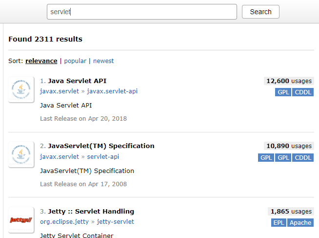

点击javax.servlet-api：

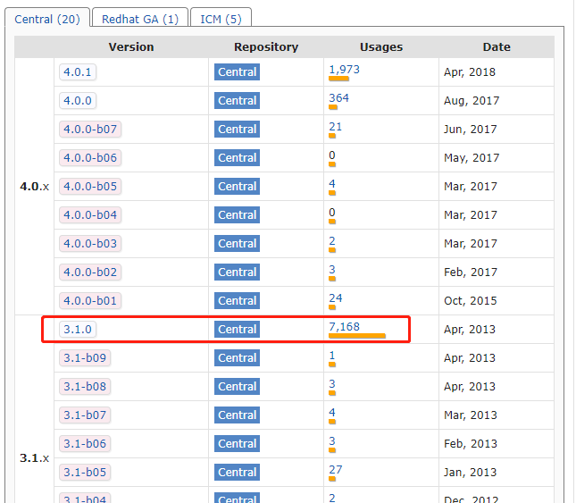

可以看到servlet3.1.0版本使用量最多，点击3.1.0可获得该jar包的相应依赖：

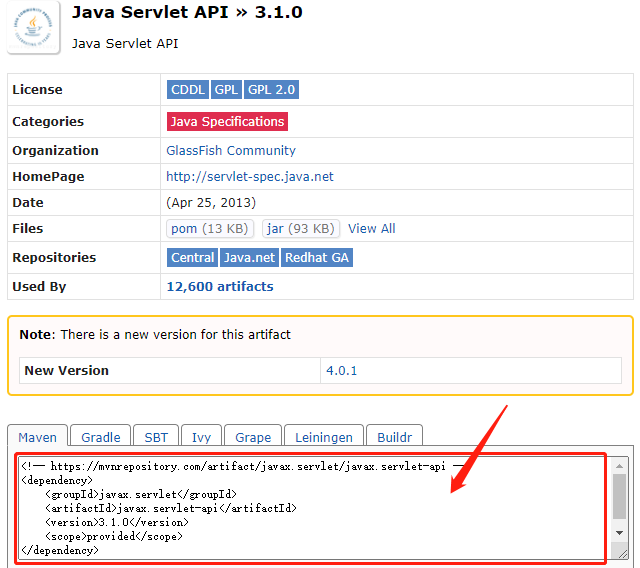

把它们复制到pom.xml文件中即可。

### jar包管理原理

Maven的依赖机制
请参考：

https://www.w3cschool.cn/maven/d29q1ht9.html

http://www.yiibai.com/maven/maven-dependency-to-download-library.html

[原文链接](https://blog.csdn.net/gxx_csdn/article/details/78798175)

## Maven安装

### 下载安装

#### [下载地址](https://maven.apache.org/download.cgi)

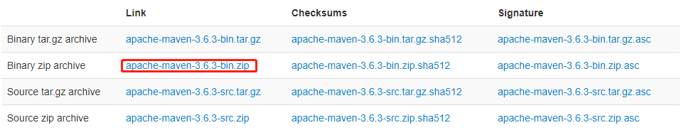

#### 解压到`C:\program_work\maven-3.6.3`

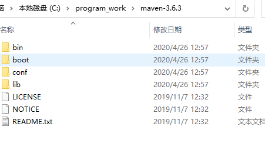

#### 配置环境变量`MAVEN_HOME`与`Path`

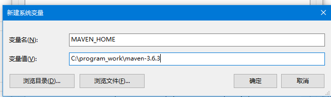

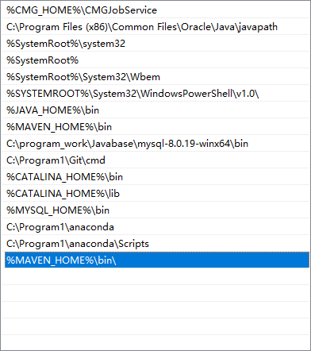

#### 安装成功

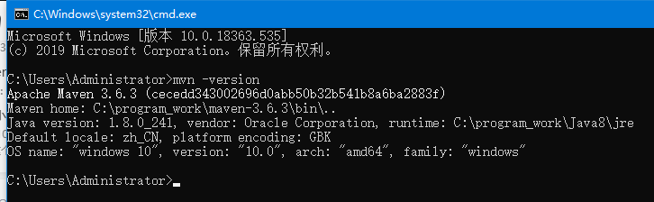

### 配置本地仓库

1. 创建`C:\program_work\maven-repository`文件夹作为本地仓库

2. 打开`C:\program_work\maven-3.6.3\conf\settings.xml`，查找下面这行代码：`/path/to/local/repo`，替换为本地仓库目录

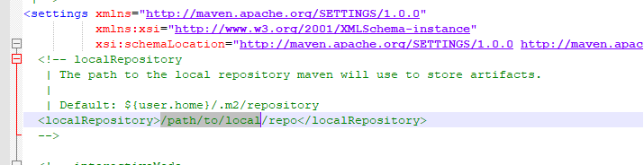

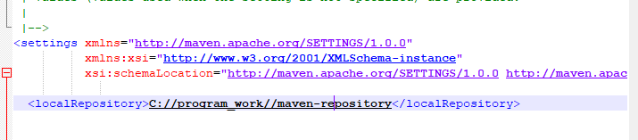

> 当我们从maven中获取jar包的时候，maven首先会在本地仓库中查找，如果本地仓库有则返回；如果没有则从远程仓库中获取包，并在本地库中保存。

3. 运行一下DOS命令`mvn help:system`，如果前面的配置成功，仓库中会出现一些文件

### 修改下载镜像

打开`C:\program_work\maven-3.6.3\conf\settings.xml`

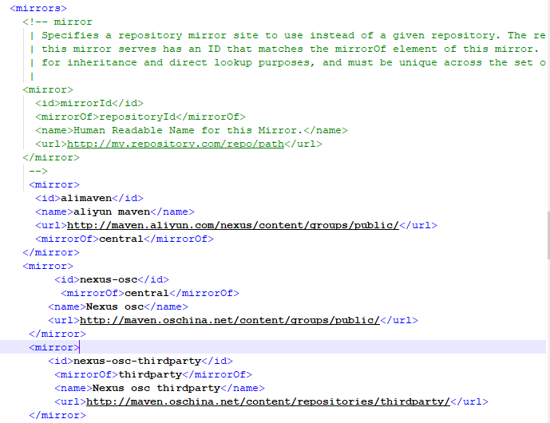

```
<mirror>
      <id>alimaven</id>
      <name>aliyun maven</name>
      <url>http://maven.aliyun.com/nexus/content/groups/public/</url>
      <mirrorOf>central</mirrorOf>        
    </mirror>
    <mirror>
         <id>nexus-osc</id>
          <mirrorOf>central</mirrorOf>
        <name>Nexus osc</name>
        <url>http://maven.oschina.net/content/groups/public/</url>
     </mirror>
     <mirror>
        <id>nexus-osc-thirdparty</id>
         <mirrorOf>thirdparty</mirrorOf>
         <name>Nexus osc thirdparty</name>
         <url>http://maven.oschina.net/content/repositories/thirdparty/</url>
     </mirror>
```

## IDEA Maven配置

### 新项目设置


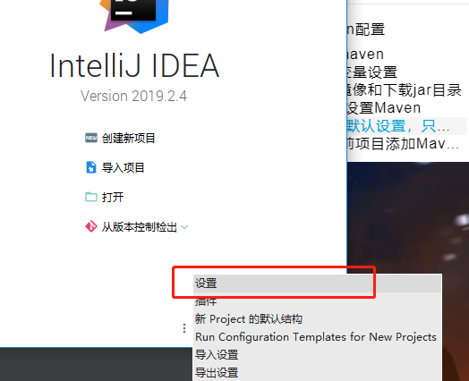

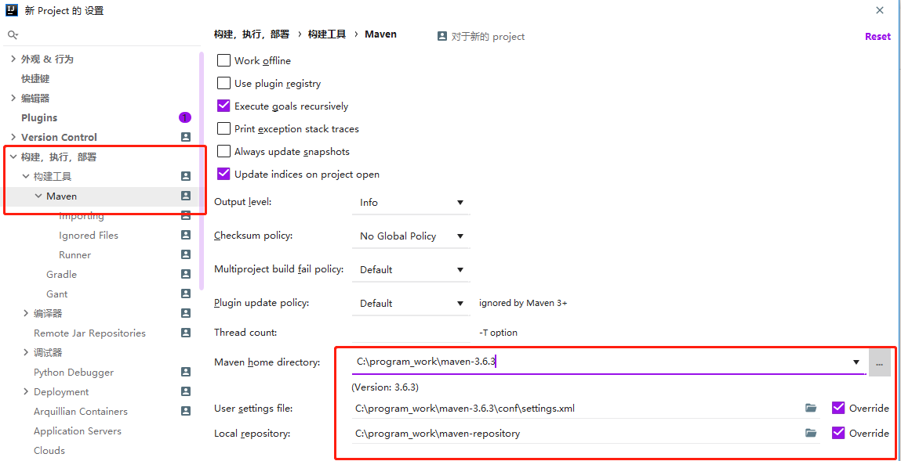

### 当前项目添加

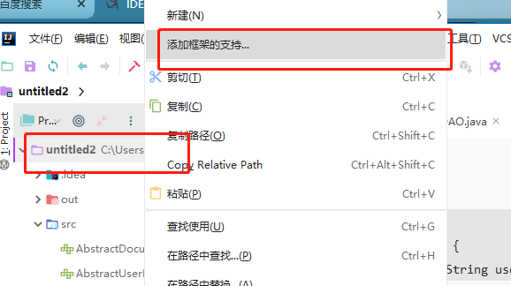

出现的菜单中选择maven

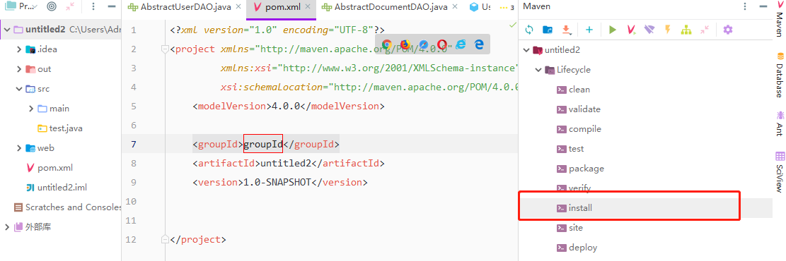

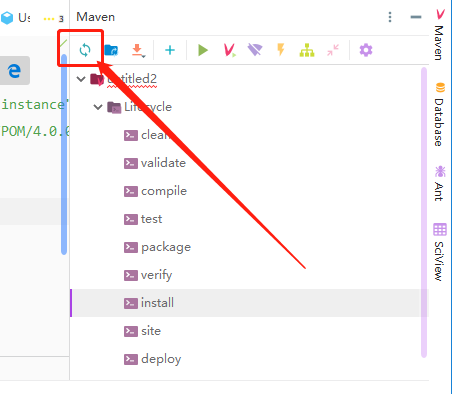