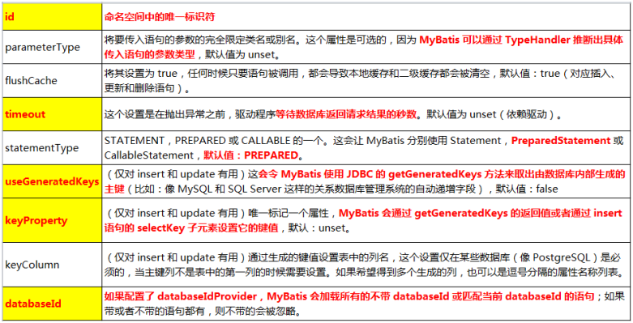
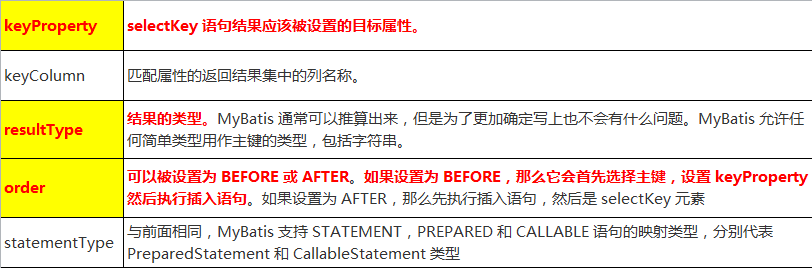
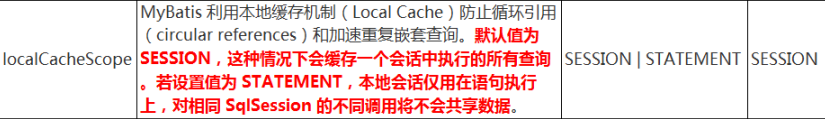
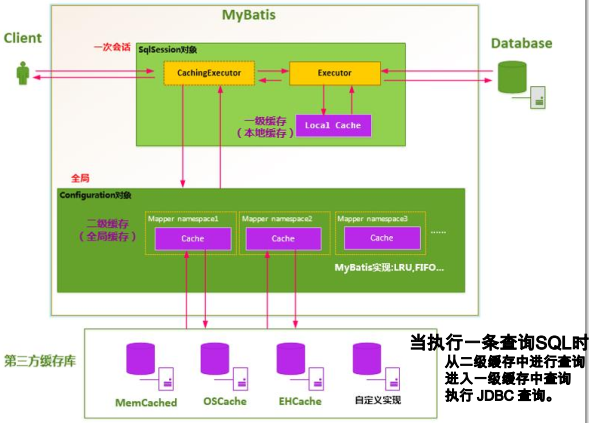

## MyBatis-映射文件  

SQL 映射文件有很少的几个顶级元素（按照它们应该被定义的顺序）：

- `cache` – 给定命名空间的缓存配置。
- `cache-ref` – 其他命名空间缓存配置的引用。
- `resultMap` – 是最复杂也是最强大的元素，用来描述如何从数据库结果集中来加载对象。
- `sql` – 可被其他语句引用的可重用语句块。
- `insert` – 映射插入语句
- `update` – 映射更新语句
- `delete` – 映射删除语句
- `select` – 映射查询语句


### insert/update/delete  



```xml
<insert id="insertAuthor">
  insert into Author (id,username,password,email,bio)
  values (#{id},#{username},#{password},#{email},#{bio})
</insert>
```


#### 主键生成方式  

插入语句的配置规则更加丰富，在插入语句里面有一些额外的属性和子元素用来处理主键的生成，而且有多种生成方式。

首先，如果你的数据库**支持自动生成主键**的字段（比如 MySQL 和 SQL Server），那么你可以设置 `useGeneratedKeys=”true”`，然后再把 keyProperty 设置到目标属性上就OK了。

```xml
<insert id="insertAuthor" useGeneratedKeys="true" keyProperty="id">
  insert into Author (username,password,email,bio)
  values (#{username},#{password},#{email},#{bio})
</insert>
```

而对于**不支持自增型主键的数据库**（例如Oracle），则可以使用 selectKey 子元素：selectKey 元素将会首先运行， id 会被设置， 然后插入语句会被调用  

```xml
<insert id="insertAuthor">
  <selectKey keyProperty="id" resultType="int" order="BEFORE"><!--产生一个随机的id值-->
    select CAST(RANDOM()*1000000 as INTEGER) a from SYSIBM.SYSDUMMY1
  </selectKey>
  insert into Author
    (id, username, password, email,bio, favourite_section)
  values
    (#{id}, #{username}, #{password}, #{email}, #{bio}, #{favouriteSection,jdbcType=VARCHAR})
</insert>
```



### sql

这个元素可以被用来定义可重用的 SQL 代码段，可以包含在其他语句中。

```
<sql id="userColumns"> ${alias}.id,${alias}.username,${alias}.password </sql>
```

这个 SQL 片段可以被包含在其他语句中，例如：

```xml
<select id="selectUsers" resultType="map">
  select
    <include refid="userColumns"><property name="alias" value="t1"/></include>,
    <include refid="userColumns"><property name="alias" value="t2"/></include>
  from some_table t1
    cross join some_table t2
</select>
```

### 参数（Parameters）

1. 单个参数
   可以接受基本类型，对象类型，集合类型的值。这种情况MyBatis可直接使用这个参数，不需要经任何处理。

2. 多个参数
   任意多个参数，都会被MyBatis重新包装成一个Map传入。Map的key是param1， param2， 0， 1…，值就是参数的值。

3. 命名参数
   为参数使用@Param起一个名字， MyBatis就会将这些参数封装进map中， key就是我们自己指定的名字
4. POJO
   当这些参数属于我们业务POJO时，我们直接传递POJO
5. Map
   我们也可以封装多个参数为map，直接传递  

----

参数也可以指定一个特殊的数据类型：  

`  #{property,javaType=int,jdbcType=NUMERIC}`

`#{height,javaType=double,jdbcType=NUMERIC,numericScale=2}`

- javaType 通常可以从参数对象中来去确定，前提是只要对象不是一个 HashMap。那么 javaType 应该被确定来保证使用正确类型处理器。
- 如果 null 被当作值来传递，对于所有可能为空的列，jdbcType 需要被设置  
- 对于数值类型，还可以设置小数点后保留的位数：numericScale=2  
- mode 属性允许指定 IN， OUT 或 INOUT 参数。如果参数为 OUT 或 INOUT，参数对象属性的真实值将会被改变，就像在获取输出参数时所期望的那样。  
- 参数位置支持的属性:
  javaType、 jdbcType、 mode、 numericScale、resultMap、 typeHandler、 jdbcTypeName、 

`#{key}`：获取参数的值，预编译到SQL中。安全。
`${key}`：获取参数的值，拼接到SQL中。有SQL注入问题。   

### select

Select元素来定义查询操作。

```xml
 <select
  id="selectPerson"
  parameterType="int"
  parameterMap="deprecated"
  resultType="hashmap"
  resultMap="personResultMap"
  flushCache="false"
  useCache="true"
  timeout="10000"
  fetchSize="256"
  statementType="PREPARED"
  resultSetType="FORWARD_ONLY"> 
```

| 属性           | 描述                                                         |
| -------------- | ------------------------------------------------------------ |
| **id**         | 在命名空间中唯一的标识符，可以被用来引用这条语句。           |
| parameterType  | 将会传入这条语句的参数类的完全限定名或别名。这个属性是可选的，因为 MyBatis 可以通过 TypeHandler 推断出具体传入语句的参数，默认值为 unset。 |
| **resultType** | 从这条语句中**返回的期望类型的类的完全限定名或别名**。注意如果是集合情形，那**应该是集合可以包含的类型，而不能是集合本身**。使用 resultType 或 resultMap，但不能同时使用。 |
| **resultMap**  | 外部 resultMap 的命名引用。使用 resultMap 或 resultType，但不能同时使用。 |
| flushCache     | 将其设置为 true，任何时候只要语句被调用，都会导致本地缓存和二级缓存都会被清空，默认值：false。 |
| useCache       | 将其设置为 true，将会导致本条语句的结果被二级缓存，默认值：对 select 元素为 true。 |
| **timeout**    | 这个设置是在抛出异常之前，**驱动程序等待数据库返回请求结果的秒数**。默认值为 unset（依赖驱动）。 |
| **fetchSize**  | 这是尝试影响驱动程序每次批量返回的结果行数和这个设置值相等。默认值为 unset（依赖驱动）。 |
| statementType  | STATEMENT，PREPARED 或 CALLABLE 的一个。这会让 MyBatis 分别使用 Statement，PreparedStatement 或 CallableStatement，默认值：PREPARED。 |
| resultSetType  | FORWARD_ONLY，SCROLL_SENSITIVE 或 SCROLL_INSENSITIVE 中的一个，默认值为 unset （依赖驱动）。 |
| **databaseId** | **如果配置了 databaseIdProvider，MyBatis 会加载所有的不带 databaseId 或匹配当前 databaseId 的语句；如果带或者不带的语句都有，则不带的会被忽略。** |
| resultOrdered  | 这个设置仅针对嵌套结果 select 语句适用：如果为 true，就是假设包含了嵌套结果集或是分组了，这样的话当返回一个主结果行的时候，就不会发生有对前面结果集的引用的情况。这就使得在获取嵌套的结果集的时候不至于导致内存不够用。默认值：false。 |
| resultSets     | 这个设置仅对多结果集的情况适用，它将列出语句执行后返回的结果集并每个结果集给一个名称，名称是逗号分隔的。 |

### resultMap  

```xml
<select id="selectUsers" resultType="User">
  select
    user_id             as "id",
    user_name           as "userName",
    hashed_password     as "hashedPassword"
  from some_table
  where id = #{id}
</select>
```

MyBatis 会在幕后**自动创建一个 ResultMap,基于属性名来映射列到 JavaBean 的属性上**。如果列名没有精确匹配,你可以在列名上使用 **select 字句的别名**来匹配标签。

解决列名不匹配的另外一种方式:

```xml
<resultMap id="userResultMap" type="User">
  <id property="id" column="user_id" />
  <result property="username" column="username"/>
  <result property="password" column="password"/>
</resultMap>    
```

引用它的语句使用 resultMap 属性就行了(注意我们去掉了 resultType 属性)。比如:

```xml
<select id="selectUsers" resultMap="userResultMap">
  select user_id, user_name, hashed_password
  from some_table
  where id = #{id}
</select>
```

### resultMap高级映射

- `constructor `- 类在实例化时,用来注入结果到构造方法中
  - `idArg` - ID 参数;标记结果作为 ID 可以帮助提高整体效能
  - `arg` - 注入到构造方法的一个普通结果
- `id` – 一个 ID 结果;标记结果作为 ID 可以帮助提高整体效能
- `result` – 注入到字段或 JavaBean 属性的普通结果
- `association`– 一个复杂的类型关联;许多结果将包成这种类型
  - 嵌入结果映射 – 结果映射自身的关联,或者参考一个
- `collection`– 复杂类型的集
  - 嵌入结果映射 – 结果映射自身的集,或者参考一个
- `discriminator`– 使用结果值来决定使用哪个结果映射
  - `case`– 基于某些值的结果映射
    - 嵌入结果映射 – 这种情形结果也映射它本身,因此可以包含很多相 同的元素,或者它可以参照一个外部的结果映射。

#### id & result

```xml
<id property="id" column="post_id"/>
<result property="subject" column="post_subject"/>
```

id 和 result 都映射**一个单独列的值到简单数据类型**(字符 串,整型,双精度浮点数,日期等)的单独属性或字段。

这两者之间的唯一不同是 **id 表示的结果将是当比较对象实例时用到的标识属性**。这帮 助来改进整体表现,特别是缓存和嵌入结果映射(也就是联合映射) 。

| `property`    | 映射到列结果的字段或属性。如果匹配的是存在的,和给定名称相同 的 JavaBeans 的属性,那么就会使用。否则 MyBatis 将会寻找给定名称 property 的字段。这两种情形你可以使用通常点式的复杂属性导航。比如,你 可以这样映射一些东西: "username" ,或者映射到一些复杂的东西: "address.street.number" 。 |
| ------------- | ------------------------------------------------------------ |
| `column`      | **从数据库中得到的列名**,或者是列名的重命名标签。这也是通常和会 传递给 resultSet.getString(columnName)方法参数中相同的字符串。 |
| `javaType`    | **一个 Java 类的完全限定名,或一个类型别名** 。如果你映射到一个 JavaBean,MyBatis 通常可以断定类型。 |
| `jdbcType`    | 在这个表格之后的所支持的 JDBC 类型列表中的类型。JDBC 类型是仅 仅需要对插入,更新和删除操作可能为空的列进行处理。 |
| `typeHandler` | 我们在前面讨论过默认的类型处理器。使用这个属性,你可以覆盖默 认的类型处理器。 |

#### association  关联

- 复杂对象映射

- POJO中的属性可能会是一个对象
- 我们可以使用联合查询，并以级联属性的方式封装对象。
- 使用association标签定义对象的封装规则

```xml
<association property="author" column="blog_author_id" javaType="Author">
  <id property="id" column="author_id"/>
  <result property="username" column="author_username"/>
</association>
```

**关联元素处理"有一个"类型的关系**。比如,在我们的示例中,一个博客有一个用户。 关联映射就工作于这种结果之上。你指定了目标属性,来获取值的列,属性的 java 类型(很 多情况下 MyBatis 可以自己算出来) ,如果需要的话还有 jdbc 类型,如果你想覆盖或获取的 结果值还需要类型控制器。

关联中不同的是你需要告诉 MyBatis 如何加载关联。MyBatis 在这方面会有两种不同的 方式:

- **嵌套查询**:通过执行另外一个 SQL 映射语句来返回预期的复杂类型。
- **嵌套结果**:使用嵌套结果映射来处理重复的联合结果的子集。

----

##### **嵌套查询**

```xml
<resultMap id="blogResult" type="Blog">
  <association property="author" column="author_id" javaType="Author" select="selectAuthor"/>
</resultMap>

<select id="selectBlog" resultMap="blogResult">
  SELECT * FROM BLOG WHERE ID = #{id}
</select>

<select id="selectAuthor" resultType="Author">
  SELECT * FROM AUTHOR WHERE ID = #{id}
</select>
```

我们有两个查询语句:一个来加载博客,另外一个来加载作者,而且博客的结果映射描 述了"selectAuthor"语句应该被用来加载它的 author 属性。

其他所有的属性将会被自动加载,假设它们的列和属性名相匹配。

这种方式很简单, 但是对于大型数据集合和列表将不会表现很好。 问题就是我们熟知的 "N+1 查询问题"。概括地讲,N+1 查询问题可以是这样引起的:

- 你执行了一个单独的 SQL 语句来获取结果列表(就是"+1")。
- 对返回的每条记录,你执行了一个查询语句来为每个加载细节(就是"N")。

这个问题会导致成百上千的 SQL 语句被执行。这通常不是期望的。

MyBatis 能延迟加载这样的查询就是一个好处,因此你可以分散这些语句同时运行的消 耗。然而,如果你加载一个列表,之后迅速迭代来访问嵌套的数据,你会调用所有的延迟加 载,这样的行为可能是很糟糕的。

所以还有另外一种方法。

-----

##### 关联的嵌套结果

| 属性            | 描述                                                         |
| --------------- | ------------------------------------------------------------ |
| `resultMap`     | **这是结果映射的 ID,可以映射关联的嵌套结果到一个合适的对象图中**。这 是一种替代方法**来调用另外一个查询语句**。这允许你联合多个表来合成到 resultMap 一个单独的结果集。 |
| `columnPrefix`  |                                                              |
| `notNullColumn` |                                                              |
| `autoMapping`   |                                                              |

```xml
<select id="selectBlog" resultMap="blogResult">
  select
    B.id            as blog_id,
    B.title         as blog_title,
    B.author_id     as blog_author_id,
    A.id            as author_id,
    A.username      as author_username,
    A.password      as author_password,
    A.email         as author_email,
    A.bio           as author_bio
  from Blog B left outer join Author A on B.author_id = A.id
  where B.id = #{id}
</select>
```

注意这个联合查询, 以及采取保护来确保所有结果被唯一而且清晰的名字来重命名。 这使得映射非常简单。现在我们可以映射这个结果:

```xml
<resultMap id="blogResult" type="Blog">
  <id property="id" column="blog_id" />
  <result property="title" column="blog_title"/>
  <association property="author" column="blog_author_id" javaType="Author" resultMap="authorResult"/>
</resultMap>

<resultMap id="authorResult" type="Author">
  <id property="id" column="author_id"/>
  <result property="username" column="author_username"/>
  <result property="password" column="author_password"/>
  <result property="email" column="author_email"/>
  <result property="bio" column="author_bio"/>
</resultMap>
```

在上面的示例中你可以看到博客的作者关联代表着"authorResult"结果映射来加载作 者实例。

> 非常重要: 在嵌套据诶过映射中 id 元素扮演了非常重要的角色。应该通常指定一个 或多个属性,它们可以用来唯一标识结果。实际上就是如果你离开她了,但是有一个严重的 性能问题时 MyBatis 仍然可以工作。选择的属性越少越好,它们可以唯一地标识结果。主键 就是一个显而易见的选择(尽管是联合主键)。

现在,上面的示例用了外部的结果映射元素来映射关联。这使得 **Author 结果映射可以 重用**。然而,如果你不需要重用它的话,或者你仅仅引用你所有的结果映射合到一个单独描 述的结果映射中。你可以嵌套结果映射。这里给出使用这种方式的相同示例:

```xml
<resultMap id="blogResult" type="Blog">
  <id property="id" column="blog_id" />
  <result property="title" column="blog_title"/>
  <association property="author" javaType="Author">
    <id property="id" column="author_id"/>
    <result property="username" column="author_username"/>
    <result property="password" column="author_password"/>
    <result property="email" column="author_email"/>
    <result property="bio" column="author_bio"/>
  </association>
</resultMap>
```


#### collection 集合

```xml
<collection property="posts" ofType="domain.blog.Post">
  <id property="id" column="post_id"/>
  <result property="subject" column="post_subject"/>
  <result property="body" column="post_body"/>
</collection>
```

一个博客只有一个作者。但是博客有很多文章`private List posts;`，要映射嵌套结果集合到 List 中,我们使用集合元素。就像关联元素一样,我们可以从 连接中使用嵌套查询,或者嵌套结果。

##### 集合的嵌套查询

使用嵌套查询来为博客加载文章。

```xml
<resultMap id="blogResult" type="Blog">
  <collection property="posts" javaType="ArrayList" column="id" ofType="Post" select="selectPostsForBlog"/>
</resultMap>

<select id="selectBlog" resultMap="blogResult">
  SELECT * FROM BLOG WHERE ID = #{id}
</select>

<select id="selectPostsForBlog" resultType="Blog">
  SELECT * FROM POST WHERE BLOG_ID = #{id}
</select>
```

这里你应该注意很多东西,但大部分代码和上面的关联元素是非常相似的。首先,你应 该注意我们使用的是集合元素。然后要注意那个新的"`ofType`"属性。这个属性用来区分 **JavaBean(或字段)属性类型**和**集合包含的类型**来说是很重要的。

javaType 属性是不需要的,因为 MyBatis 在很多情况下会为你算出来。所以你可以缩短 写法:

```xml
<collection property="posts" column="id" ofType="Post" select="selectPostsForBlog"/>
```

##### 集合的嵌套结果

集合的嵌套结果和关联完全相同,除了它应 用了一个"`ofType`"属性

```xml
<select id="selectBlog" resultMap="blogResult">
  select
  B.id as blog_id,
  B.title as blog_title,
  B.author_id as blog_author_id,
  P.id as post_id,
  P.subject as post_subject,
  P.body as post_body,
  from Blog B
  left outer join Post P on B.id = P.blog_id
  where B.id = #{id}
</select>
```

我们又一次联合了博客表和文章表,而且关注于保证特性,结果列标签的简单映射。现 在用文章映射集合映射博客,可以简单写为:

```xml
<resultMap id="blogResult" type="Blog">
  <id property="id" column="blog_id" />
  <result property="title" column="blog_title"/>
  <collection property="posts" ofType="Post">
    <id property="id" column="post_id"/>
    <result property="subject" column="post_subject"/>
    <result property="body" column="post_body"/>
  </collection>
</resultMap>
```

同样, 如果你引用更长的形式允许你的结果映射的更多重用, 你可以使用下面这个替代 的映射:

```xml
<resultMap id="blogResult" type="Blog">
  <id property="id" column="blog_id" />
  <result property="title" column="blog_title"/>
  <collection property="posts" ofType="Post" resultMap="blogPostResult" columnPrefix="post_"/>
</resultMap>

<resultMap id="blogPostResult" type="Post">
  <id property="id" column="id"/>
  <result property="subject" column="subject"/>
  <result property="body" column="body"/>
</resultMap>
```

注意 这个对你所映射的内容没有深度,广度或关联和集合相联合的限制。当映射它们 时你应该在大脑中保留它们的表现。 你的应用在找到最佳方法前要一直进行的单元测试和性 能测试。好在 myBatis 让你后来可以改变想法,而不对你的代码造成很小(或任何)影响。

### 自动映射

在简单的场景下，MyBatis可以替你自动映射查询结果。 如果遇到复杂的场景，你需要构建一个result map。 但是也可以混合使用这两种策略.

当自动映射查询结果时，MyBatis会**获取sql返回的列名并在java类中查找相同名字的属性（忽略大小写）**。 这意味着如果Mybatis发现了_ID_列和_id_属性，Mybatis会将_ID_的值赋给*id*。

通常数据库列使用大写单词命名，单词间用下划线分隔；而java属性一般遵循驼峰命名法。 为了在这两种命名方式之间启用自动映射，需要将 `mapUnderscoreToCamelCase`设置为true。

自动映射甚至在特定的result map下也能工作。在这种情况下，**对于每一个result map,所有的ResultSet提供的列， 如果没有被手工映射，则将被自动映射。自动映射处理完毕后手工映射才会被处理。** 在接下来的例子中， *id* 和 _userName_列将被**自动映射**， hashed_password 列将**根据配置映射**。

```xml
<select id="selectUsers" resultMap="userResultMap">
  select
    user_id             as "id",
    user_name           as "userName",
    hashed_password
  from some_table
  where id = #{id}
</select>
<resultMap id="userResultMap" type="User">
  <result property="password" column="hashed_password"/>
</resultMap>
```

有三个自动映射级别:

- `NONE` - 禁用自动映射,只有手动映射属性才会被设置。
- `PARTIAL` - 将自动映射结果，除了那些嵌套结果映射（连接）内的结果。
- `FULL` - 自动映射一切

`默认值是 PARTIAL`,这是有原因的。 使用FULL时，将在处理连接结果时执行自动映射，并且连接会检索同一行中的多个不同实体的数据，因此可能会导致不需要的映射。

## MyBatis-缓存机制  

MyBatis 包含一个非常强大的查询缓存特性,它可以非常方便地配置和定制。缓存可以极大的提升查询效率。

MyBatis系统中默认定义了两级缓存。

- 一级缓存和二级缓存。
  - 默认情况下，只有一级缓存（ SqlSession级别的缓存，也称为本地缓存）开启。
  - 二级缓存需要手动开启和配置，他是基于namespace级别的缓存。
  - 为了提高扩展性。 MyBatis定义了缓存接口Cache。我们可以通过实现Cache接口来自定义二级缓存  

### 一级缓存

**一级缓存(local cache)**，即本地缓存, 作用域默认为sqlSession（**同一次会话期间**）。当 Session flush 或 close 后, 该Session 中的所有 Cache 将被清空。

本地缓存不能被关闭, 但可以调用 clearCache()来清空本地缓存, 或者改变缓存的作用域.

在mybatis3.1之后, 可以配置本地缓存的作用域.在 mybatis.xml 中配置  



> 同一次会话期间只要查询过的数据都会保存在当前SqlSession的一个Map中
>
> key:`hashCode+查询的SqlId+编写的sql查询语句+参数  `

一级缓存失效的四种情况

1. 不同的SqlSession对应不同的一级缓存
2. 同一个SqlSession但是查询条件不同
3. 同一个SqlSession两次查询期间执行了任何一次增删改操作
4. 同一个SqlSession两次查询期间手动清空了缓存  

### 二级缓存

二级缓存(second level cache)，全局作用域缓存，基于namespace级别的缓存。

二级缓存默认不开启，需要手动配置

MyBatis提供二级缓存的接口以及实现，缓存实现要求POJO实现Serializable接口

二级缓存在 SqlSession 关闭或提交之后才会生效

使用步骤

1. 全局配置文件中开启二级缓存`<setting name="cacheEnabled" value="true"/>`
2. 需要使用二级缓存的mapper映射文件处使用cache配置缓存`<cache></cache>`
3. 注意： POJO需要实现Serializable接口  

------

缓存相关属性

- eviction=“FIFO”： 缓存回收策略：
  - LRU – 最近最少使用的：移除最长时间不被使用的对象。
  - FIFO – 先进先出：按对象进入缓存的顺序来移除它们。
  - SOFT – 软引用：移除基于垃圾回收器状态和软引用规则的对象。
  - WEAK – 弱引用：更积极地移除基于垃圾收集器状态和弱引用规则的对象。
  - 默认的是 LRU。
- flushInterval： 刷新间隔，单位毫秒
  - 默认情况是不设置，也就是没有刷新间隔，缓存仅仅调用语句时刷新
- size： 引用数目，正整数
  - 代表缓存最多可以存储多少个对象，太大容易导致内存溢出
- readOnly： 只读， true/false
  - true：只读缓存；会给所有调用者返回缓存对象的相同实例。 因此这些对象不能被修改。这提供了很重要的性能优势。
  - false：读写缓存； 会返回缓存对象的拷贝（通过序列化）。这会慢一些，但是安全，因此默认是 false。  

----

缓存有关设置

1. 全局setting的cacheEnable：
   – 配置二级缓存的开关。一级缓存一直是打开的。
2. select标签的useCache属性：
   – 配置这个select是否使用二级缓存。一级缓存一直是使用的
3. sql标签的flushCache属性：
   – 增删改默认flushCache=true。 sql执行以后，会同时清空一级和二级缓存。查询默认flushCache=false
4. sqlSession.clearCache()：
   – 只是用来清除一级缓存。
5. 当在某一个作用域 (一级缓存Session/二级缓存Namespaces) 进行了 C/U/D 操作后，默认该作用域下所有 select 中的缓存将被clear。  



> 先看二级缓存然后再看一级缓存