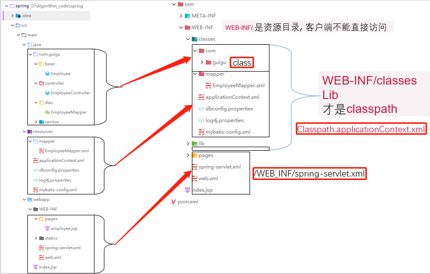

## 示例：

https://github.com/mybatis/jpetstore-6



- classpath：只会到你的class路径中查找找文件;
- classpath*：不仅包含class路径，还包括jar文件中(class路径)进行查找.

### POM文件

```xml
<properties>
    <project.build.sourceEncoding>UTF-8</project.build.sourceEncoding>
    <maven.compiler.source>1.8</maven.compiler.source>
    <maven.compiler.target>1.8</maven.compiler.target>
    <!--web-->
    <spring.version>4.3.14.RELEASE</spring.version>
    <mysql.version>8.0.19</mysql.version>
    <thymeleaf.version>3.0.11.RELEASE</thymeleaf.version>
  </properties>

  <dependencies>
<!--    测试-->
    <dependency>
      <groupId>junit</groupId>
      <artifactId>junit</artifactId>
      <version>4.12</version>
      <scope>test</scope>
    </dependency>
<!--    日志-->
      <dependency>
          <groupId>org.slf4j</groupId>
          <artifactId>slf4j-log4j12</artifactId>
          <version>1.7.21</version>
      </dependency>
    <!--JavaEE-->
    <dependency>
      <groupId>javax.servlet</groupId>
      <artifactId>servlet-api</artifactId>
      <version>2.5</version>
      <scope>provided</scope>
    </dependency>
    <dependency>
      <groupId>javax.servlet.jsp</groupId>
      <artifactId>javax.servlet.jsp-api</artifactId>
      <version>2.3.1</version>
      <scope>provided</scope>
    </dependency>
    <dependency>
      <groupId>javax.servlet</groupId>
      <artifactId>jstl</artifactId>
      <version>1.2</version>
    </dependency>
    <dependency>
      <groupId>javax.ws.rs</groupId>
      <artifactId>javax.ws.rs-api</artifactId>
      <version>2.0</version>
    </dependency>
    <dependency>
      <groupId>javax.websocket</groupId>
      <artifactId>javax.websocket-api</artifactId>
      <version>1.0</version>
    </dependency>
    <dependency>
      <groupId>javax.annotation</groupId>
      <artifactId>javax.annotation-api</artifactId>
      <version>1.2</version>
    </dependency>
    <dependency>
      <groupId>javax.transaction</groupId>
      <artifactId>javax.transaction-api</artifactId>
      <version>1.2</version>
    </dependency>

    <!--Spring-->
    <dependency>
        <groupId>org.springframework</groupId>
        <artifactId>spring-core</artifactId>
        <version>${spring.version}</version>
    </dependency>
    <dependency>
      <groupId>org.springframework</groupId>
      <artifactId>spring-context</artifactId>
      <version>${spring.version}</version>
    </dependency>
    <dependency>
      <groupId>org.springframework</groupId>
      <artifactId>spring-jdbc</artifactId>
      <version>${spring.version}</version>
    </dependency>
    <dependency>
      <groupId>org.springframework</groupId>
      <artifactId>spring-tx</artifactId>
      <version>${spring.version}</version>
    </dependency>
    <dependency>
      <groupId>org.springframework</groupId>
      <artifactId>spring-web</artifactId>
      <version>${spring.version}</version>
    </dependency>
    <dependency>
      <groupId>org.springframework</groupId>
      <artifactId>spring-webmvc</artifactId>
      <version>${spring.version}</version>
    </dependency>
    <dependency>
      <groupId>org.springframework</groupId>
      <artifactId>spring-aop</artifactId>
      <version>${spring.version}</version>
    </dependency>
    <dependency>
      <groupId>org.springframework</groupId>
      <artifactId>spring-test</artifactId>
      <version>${spring.version}</version>
      <scope>test</scope>
    </dependency>

    <!--spring-oxm依赖-->
    <dependency>
      <groupId>org.codehaus.castor</groupId>
      <artifactId>castor-xml</artifactId>
      <version>1.4.1</version>
    </dependency>

    <!--spring-json依赖-->
    <dependency>
      <groupId>com.fasterxml.jackson.core</groupId>
      <artifactId>jackson-databind</artifactId>
      <version>2.9.4</version>
    </dependency>
    <dependency>
      <groupId>mysql</groupId>
      <artifactId>mysql-connector-java</artifactId>
      <version>${mysql.version}</version>
    </dependency>
    <!--druid-->
    <!-- https://mvnrepository.com/artifact/com.alibaba/druid -->
    <dependency>
      <groupId>com.alibaba</groupId>
      <artifactId>druid</artifactId>
      <version>1.1.9</version>
    </dependency>


    <!--Mybatis-->
    <dependency>
      <groupId>org.mybatis</groupId>
      <artifactId>mybatis</artifactId>
      <version>3.4.6</version>
    </dependency>
    <dependency>
      <groupId>org.mybatis</groupId>
      <artifactId>mybatis-spring</artifactId>
      <version>1.3.2</version>
    </dependency>
    <!-- Mybatis Generator -->
    <dependency>
      <groupId>org.mybatis.generator</groupId>
      <artifactId>mybatis-generator-core</artifactId>
      <version>1.3.6</version>
      <scope>compile</scope>
      <optional>true</optional>
    </dependency>
<!--      Thymeleaf-->
      <dependency>
          <groupId>org.thymeleaf</groupId>
          <artifactId>thymeleaf</artifactId>
          <version>${thymeleaf.version}</version>
      </dependency>

      <!-- https://mvnrepository.com/artifact/org.thymeleaf/thymeleaf-spring4 -->
      <dependency>
          <groupId>org.thymeleaf</groupId>
          <artifactId>thymeleaf-spring4</artifactId>
          <version>${thymeleaf.version}</version>
      </dependency>


    <!--  工具集  -->
    <!--操作json-->
    <!-- https://mvnrepository.com/artifact/com.alibaba/fastjson -->
    <dependency>
      <groupId>com.alibaba</groupId>
      <artifactId>fastjson</artifactId>
      <version>1.2.47</version>
    </dependency>
    <dependency>
      <groupId>org.junit.jupiter</groupId>
      <artifactId>junit-jupiter</artifactId>
      <version>RELEASE</version>
      <scope>compile</scope>
    </dependency>
      <dependency>
          <groupId>org.testng</groupId>
          <artifactId>testng</artifactId>
          <version>6.8.7</version>
          <scope>compile</scope>
      </dependency>


  </dependencies>

  <build>
    <finalName>ssm</finalName>
    <pluginManagement><!-- lock down plugins versions to avoid using Maven defaults (may be moved to parent pom) -->
      <plugins>
        <plugin>
          <artifactId>maven-clean-plugin</artifactId>
          <version>3.1.0</version>
        </plugin>
        <!-- see http://maven.apache.org/ref/current/maven-core/default-bindings.html#Plugin_bindings_for_war_packaging -->
        <plugin>
          <artifactId>maven-resources-plugin</artifactId>
          <version>3.0.2</version>
        </plugin>
        <plugin>
          <artifactId>maven-compiler-plugin</artifactId>
          <version>3.8.0</version>
        </plugin>
        <plugin>
          <artifactId>maven-surefire-plugin</artifactId>
          <version>2.22.1</version>
        </plugin>
        <plugin>
          <artifactId>maven-war-plugin</artifactId>
          <version>3.2.2</version>
        </plugin>
        <plugin>
          <artifactId>maven-install-plugin</artifactId>
          <version>2.5.2</version>
        </plugin>
        <plugin>
          <artifactId>maven-deploy-plugin</artifactId>
          <version>2.8.2</version>
        </plugin>
      </plugins>
    </pluginManagement>
    <resources>
      <resource>
        <directory>src/main/java</directory>
        <includes>
          <include>**/*.xml</include>
        </includes>
        <filtering>true</filtering>
      </resource>
      <resource>
        <directory>src/main/resources</directory>
        <includes>
          <include>**/*.properties</include>
          <include>**/*.xml</include>
        </includes>
        <filtering>false</filtering>
      </resource>
    </resources>
  </build>
```


### mapper映射文件

conf/mybatis/mapper

```xml
<?xml version="1.0" encoding="UTF-8" ?>
<!DOCTYPE mapper
 PUBLIC "-//mybatis.org//DTD Mapper 3.0//EN"
 "http://mybatis.org/dtd/mybatis-3-mapper.dtd">
<mapper namespace="com.atguigu.mybatis.dao.EmployeeMapper">

	<!-- public Employee getEmpById(Integer id); -->
	<select id="getEmpById" resultType="com.atguigu.mybatis.bean.Employee">
		select * from tbl_employee where id=#{id}
	</select>
	
	<!--public List<Employee> getEmps();  -->
	<select id="getEmps" resultType="com.atguigu.mybatis.bean.Employee">
		select * from tbl_employee
	</select>
</mapper>
```

### mybatis全局配置文件

conf/mybatis-config.xml

只需要配置设置属性，其他的在applicationContext.xml中配置

```xml
<?xml version="1.0" encoding="UTF-8" ?>
<!DOCTYPE configuration
 PUBLIC "-//mybatis.org//DTD Config 3.0//EN"
 "http://mybatis.org/dtd/mybatis-3-config.dtd">
<configuration>
	<settings>
		<setting name="mapUnderscoreToCamelCase" value="true"/>
		<setting name="jdbcTypeForNull" value="NULL"/>
		
		<!--显式的指定每个我们需要更改的配置的值，即使他是默认的。防止版本更新带来的问题  -->
		<setting name="cacheEnabled" value="true"/>
		<setting name="lazyLoadingEnabled" value="true"/>
		<setting name="aggressiveLazyLoading" value="false"/>
	</settings>
	
	<databaseIdProvider type="DB_VENDOR">
		<property name="MySQL" value="mysql"/>
		<property name="Oracle" value="oracle"/>
		<property name="SQL Server" value="sqlserver"/>
	</databaseIdProvider>
	
</configuration>
```

### web.xml

```xml
<?xml version="1.0" encoding="UTF-8"?>
<web-app xmlns:xsi="http://www.w3.org/2001/XMLSchema-instance" xmlns="http://java.sun.com/xml/ns/javaee" xsi:schemaLocation="http://java.sun.com/xml/ns/javaee http://java.sun.com/xml/ns/javaee/web-app_2_5.xsd" id="WebApp_ID" version="2.5">
  <display-name>MyBatis_06_ssm</display-name>
  
  <!--Spring配置： needed for ContextLoaderListener -->
	<context-param>
		<param-name>contextConfigLocation</param-name>
		<param-value>classpath:applicationContext.xml</param-value>
	</context-param>

	<!-- Bootstraps the root web application context before servlet initialization -->
	<listener>
		<listener-class>org.springframework.web.context.ContextLoaderListener</listener-class>
	</listener>
	
	<!-- SpringMVC配置 -->
	<!-- The front controller of this Spring Web application, responsible for handling all application requests -->
	<servlet>
		<servlet-name>spring</servlet-name>
		<servlet-class>org.springframework.web.servlet.DispatcherServlet</servlet-class>
		<load-on-startup>1</load-on-startup>
	</servlet>

	<!-- Map all requests to the DispatcherServlet for handling -->
	<servlet-mapping>
		<servlet-name>spring</servlet-name>
		<url-pattern>/</url-pattern>
	</servlet-mapping>
  
</web-app>
```

### applicationContext.xml

conf/applicationContext.xml

```xml
<?xml version="1.0" encoding="UTF-8"?>
<beans xmlns="http://www.springframework.org/schema/beans"
	xmlns:xsi="http://www.w3.org/2001/XMLSchema-instance"
	xmlns:context="http://www.springframework.org/schema/context"
	xmlns:mybatis-spring="http://mybatis.org/schema/mybatis-spring"
	xmlns:tx="http://www.springframework.org/schema/tx"
	xsi:schemaLocation="http://www.springframework.org/schema/beans http://www.springframework.org/schema/beans/spring-beans.xsd
		http://mybatis.org/schema/mybatis-spring http://mybatis.org/schema/mybatis-spring-1.2.xsd
		http://www.springframework.org/schema/tx http://www.springframework.org/schema/tx/spring-tx-4.0.xsd
		http://www.springframework.org/schema/context http://www.springframework.org/schema/context/spring-context-4.0.xsd">

	<!-- Spring希望管理所有的业务逻辑组件，等。。。 -->
	<context:component-scan base-package="com.atguigu.mybatis">
		<context:exclude-filter type="annotation" expression="org.springframework.stereotype.Controller" />
	</context:component-scan>

	<!-- 引入数据库的配置文件 -->
	<context:property-placeholder location="classpath:dbconfig.properties" />
	<!-- Spring用来控制业务逻辑。数据源、事务控制、aop -->
	<bean id="dataSource" class="com.mchange.v2.c3p0.ComboPooledDataSource">
		<property name="jdbcUrl" value="${jdbc.url}"></property>
		<property name="driverClass" value="${jdbc.driver}"></property>
		<property name="user" value="${jdbc.username}"></property>
		<property name="password" value="${jdbc.password}"></property>
	</bean>
	<!-- spring事务管理 -->
	<bean id="dataSourceTransactionManager" class="org.springframework.jdbc.datasource.DataSourceTransactionManager">
		<property name="dataSource" ref="dataSource"></property>
	</bean>

	<!-- 开启基于注解的事务 -->
	<tx:annotation-driven transaction-manager="dataSourceTransactionManager"/>
	
	<!-- 
	整合mybatis 
		目的：1、spring管理所有组件。mapper的实现类。
				service==>Dao   @Autowired:自动注入mapper；
			2、spring用来管理事务，spring声明式事务
	-->
	<!--创建出SqlSessionFactory对象  -->
	<bean id="sqlSessionFactoryBean" class="org.mybatis.spring.SqlSessionFactoryBean">
		<property name="dataSource" ref="dataSource"></property>
		<!-- configLocation指定全局配置文件的位置 -->
		<property name="configLocation" value="classpath:mybatis-config.xml"></property>
		<!--mapperLocations: 指定mapper文件的位置-->
		<property name="mapperLocations" value="classpath:mybatis/mapper/*.xml"></property>
	</bean>
	
	<!--配置一个可以进行批量执行的sqlSession  -->
	<bean id="sqlSession" class="org.mybatis.spring.SqlSessionTemplate">
		<constructor-arg name="sqlSessionFactory" ref="sqlSessionFactoryBean"></constructor-arg>
		<constructor-arg name="executorType" value="BATCH"></constructor-arg>
	</bean>
	
	<!-- 扫描所有的mapper接口的实现，让这些mapper能够自动注入；	base-package：指定mapper接口的包名
	 -->
	<mybatis-spring:scan base-package="com.atguigu.mybatis.dao"/>
	<!-- <bean class="org.mybatis.spring.mapper.MapperScannerConfigurer">
		<property name="basePackage" value="com.atguigu.mybatis.dao"></property>
	</bean> -->
	
</beans>

```


### spring-servlet.xml

WEB-INF/spring-servlet.xml

```xml
<?xml version="1.0" encoding="UTF-8"?>
<beans xmlns="http://www.springframework.org/schema/beans"
	xmlns:xsi="http://www.w3.org/2001/XMLSchema-instance"
	xmlns:context="http://www.springframework.org/schema/context"
	xmlns:mvc="http://www.springframework.org/schema/mvc"
	xsi:schemaLocation="http://www.springframework.org/schema/mvc http://www.springframework.org/schema/mvc/spring-mvc-4.0.xsd
		http://www.springframework.org/schema/beans http://www.springframework.org/schema/beans/spring-beans.xsd
		http://www.springframework.org/schema/context http://www.springframework.org/schema/context/spring-context-4.0.xsd">

	<!--SpringMVC只是控制网站跳转逻辑  -->
	<!-- 只扫描控制器 -->
	<context:component-scan base-package="com.guigu.controller" use-default-filters="false">
        <context:include-filter type="annotation" expression="org.springframework.stereotype.Controller"/>
    </context:component-scan>
    <context:annotation-config/>
    <mvc:annotation-driven/>
    <mvc:default-servlet-handler/>
    <!-- 视图解析器 -->
     <!--    模板解析器-->
    <bean id="templateResolver"
          class="org.thymeleaf.spring4.templateresolver.SpringResourceTemplateResolver">
        <property name="prefix" value="/WEB-INF/pages/" />
        <property name="suffix" value=".html" />
        <property name="templateMode" value="HTML" />
        <property name="cacheable" value="true" />
    </bean>
<!--    模板引擎-->
    <bean id="templateEngine"
          class="org.thymeleaf.spring4.SpringTemplateEngine">
        <property name="templateResolver" ref="templateResolver" />
        <property name="enableSpringELCompiler" value="true" />
    </bean>
<!--    視圖解析器-->
    <bean class="org.thymeleaf.spring4.view.ThymeleafViewResolver">
        <property name="templateEngine" ref="templateEngine" />
        <property name="order" value="1" />
        <property name="viewNames" value="*.html,*.xhtml" />
    </bean>
    <!--静态资源映射-->
    <!--本项目把静态资源放在了webapp的statics目录下，资源映射如下-->
    <mvc:resources mapping="/css/**" location="/WEB-INF/statics/css/"/>
    <mvc:resources mapping="/js/**" location="/WEB-INF/statics/js/"/>
    <mvc:resources mapping="/image/**" location="/WEB-INF/statics/image/"/>
</beans>

```


