# 2装配Bean

**创建应用对象之间协作关系的行为通常称为装配（wiring） ， 这也是依赖注入（DI） 的本质**  

## 2.1Spring配置

Spring容器负责创建应用程序中的bean并通过DI来协调这些对象之间的关系。 但是， 作为开发人员需要告诉Spring要**创建哪些bean（声明）**并且**如何将其装配**在一起。 当描述bean如何进行装配时，提供了三种主要的装配机制：

- 在XML中进行显式配置。
- 在Java中进行显式配置。
- 隐式的bean发现机制和自动装配  

> Spring的配置风格是可以互相搭配的， 所以你可以选择使用XML装配一些bean， 使用Spring基于Java的配置（JavaConfig） 来装配另一些bean， 而将剩余的bean让Spring去自动发现  

### 1. 自动化装配bean

Spring从两个角度来实现自动化装配：

- **组件扫描（component scanning）** ：Spring 能够从 classpath 下自动扫描, 侦测和实例化具有特定注解的组件.
- **自动装配（autowiring）** ： Spring自动满足bean之间的依赖  

#### 一步：组件扫描

1. 创建一个任务**接口A**
2. 带有`@Component`注解的**接口A实现类** ：这个注解表明该类会作为组件类， 并告知Spring要为这个类创建bean实例  
3. 带有`@Configuration`和`@ComponentScan`的**Java配置类**：@ComponentScan会启动组件扫描，默认会扫描与配置类相同的包和子包，找到使用注解的bean并在容器中创建bean实例。   
   1. 使用XML来启用组件扫描的话， 可以使用Spring context命名空间的`<context:component-scan>`元素。
   2. `<context:component-scan>` 元素还会自动注册 `AutowiredAnnotationBeanPostProcessor` 实例, 该实例可以**自动装配**具有 @Autowired 和 @Resource 、@Inject注解的属性  

> Spring容器默认关闭注解装配,可以使用`@ComponentScan`或`<context:component-scan base-package="xxx.xxx"/>`开启注解装配
>
> 测试：
>
> 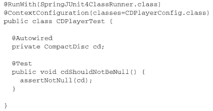
>
> CDPlayerTest使用了Spring的`SpringJUnit4ClassRunner`， 以便在测试开始的时候自动创建Spring的应用上下文。 注解@ContextConfiguration会告诉它需要在CDPlayerConfig中加载配置。   

> 1. `<context: annotation-config/>`这个标签会自动向Spring容器注册四个BeanPostProcessor让系统识别对应的注解从而支持相关的自动装配，这个标签只支持自动装配，不支持自动注册（因为不能识别@Component, @Controller, @Service, @Repository；要想识别这四个注解，需要配置`<context: component-scan base-package="xxx.xxx"/>`标签
> 2. `<context: component-scan base-package="xxx.xxx"/>`这个标签包含了`<context: annotation-config/>`的功能；既支持自动装配，又支持自动注册。
> 3. `<mvc: annotation-driven>`这是Spring MVC为@Controller, @RequestMapping分发请求所必需的，现在Spring 3以上对@Controller, @RequestMapping两个注解的支持是默认开启的，一般不需要声明该标签。

**组件命名**

Spring应用上下文中所有的bean都会给定一个ID  。这个bean所给定的ID就是将类名的第一个字母变为小写 。或者自己命名：`@Component("yourname")`

**设置组件扫描的基础包**  

- @ComponentScan如果没有设置任何属性，这意味着按照默认规则， 它会以**配置类所在的包作为基础包（base**
  **package） 来扫描组件（与配置类相同的包和子包）**。  
- 也可以自己在@ComponentScan的value属性中指明包的名称 ：`@ComponentScan("onepackage")`
- 如果你想更加清晰地表明你所设置的是基础包， 那么你可以通过basePackages属性进行配置：  `@ComponentScan(basePackages="onepackage")`
- 如果有多个基础包：`@ComponentScan(basePackages={"onepackage","another"})`
- 以上所设置的基础包是以String类型表示的，是类型不安全（not type-safe） ，也可以将其指定为包中所包含的类或接口，这些类所在的包将会作为组件扫描的基础包。   ：  `@ComponentScan(basePackageClasses={A.class,B.class})`

> 尽管在样例中， 我为basePackageClasses设置的是组件类， 但是你可以考虑在包中创建一个用来进行扫描的空标记接口（markerinterface） 。 通过标记接口的方式， 你依然能够保持对重构友好的接口引用， 但是可以避免引用任何实际的应用程序代码  
>
> 声明 `<context:component-scan>` ：
>
> - base-package 属性指定一个需要扫描的基类包，Spring 容器将会扫描这个**基类包里及其子包中的所有类**. 
>
> - 当需要扫描多个包时, 可以使用逗号分隔.
>
> - 如果仅希望扫描特定的类而非基包下的所有类，可使用 resource-pattern 属性过滤特定的类，示例：
>
> - 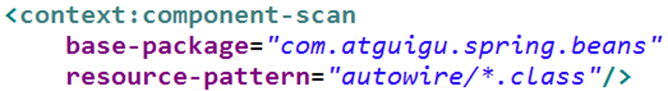
>
> - `<context:include-filter> `子节点表示要包含的目标类
>
> - `<context:exclude-filter> `子节点表示要排除在外的目标类
>
> - `<context:component-scan> `下可以拥有若干个` <context:include-filter> `和` <context:exclude-filter> `子节点

#### 二步：自动装配

自动装配就是让Spring自动满足bean依赖的一种方法， 在满足依赖的过程中， 会在Spring应用上下文中寻找匹配某个bean需求的其他bean。需要用到`@Autowired`注解   

- **构造器上**
  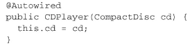
- **setter方法上**
  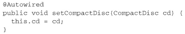
- @Autowired注解**可以用在类的任何方法上**
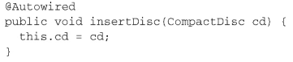

> - @Autowired 注解自动装配具有兼容类型的单个 Bean属性
>   - 构造器, 普通字段(即使是非 public), **一切具有参数的方法都可以应用@Authwired 注解**
>   - 默认情况下, 所有使用 @Authwired 注解的属性都需要被设置. 当 Spring 找不到匹配的 Bean 装配属性时, 会抛出异常, 若某一属性允许不被设置, 可以设置 @Authwired 注解的` required `属性为 `false`
>   - 默认情况下, 当 IOC 容器里存在多个类型兼容的 Bean 时, 通过类型的自动装配将无法工作. 此时可以在 @Qualifier 注解里提供 Bean 的名称. Spring 允许对方法的入参标注 `@Qualifiter `已指定注入 Bean 的名称
>   -  @Authwired 注解也可以应用在**数组类型**的属性上, 此时 Spring 将会把所有匹配的 Bean 进行自动装配.
>   - @Authwired 注解也可以应用在**集合属性**上, 此时 Spring 读取该集合的类型信息, 然后自动装配所有与之兼容的 Bean.
>   - @Authwired 注解用在 **java.util.Map** 上时, 若该 Map 的键值为 String, 那么 Spring 将自动装配与之 Map 值类型兼容的 Bean, 此时 Bean 的名称作为键值
> - @Resource 和 @Inject 注解，这两个注解和 @Autowired 注解的功用类似
>   - @Resource 注解要求提供一个 Bean 名称的属性，若该属性为空，则自动采用标注处的变量或方法名作为 Bean 的名称
>   - @Inject 和 @Autowired 注解一样也是按类型匹配注入的 Bean， 但没有 reqired 属性

### 2. JavaConfig装配Bean

> 想要将第三方库中的组件装配到你的应用中， 在这种情况下， 是没有办法在它的类上添加@Component和@Autowired注解的， 因此就不能使用自动化装配的方案了。  

> 通常会将JavaConfig放到单独的包中， 使它与其他的应用程序逻辑分离开来  

#### 一步：创建配置类

关键在于为其添加`@Configuration`注解， @Configuration注解表明这个类是一个配置类， 该类应该包含在Spring应用上下文中如何创建bean的细节

  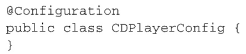

#### 二步：声明简单的bean

要**在JavaConfig中声明bean**， 我们需要编写一个方法创建所需类型的实例， 然后给这个方法添加`@Bean`注解。     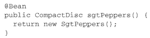

> 1. @Bean注解会告诉Spring这个方法将会返回一个对象， 该对象要注册为Spring应用上下文中的bean。
>
> 2. bean的ID与带有@Bean注解的**方法名**是一样的 ，也可以通过name属性指定 :`@Bean(name="myname")`

#### 三步：装配注入  

在JavaConfig中装配bean的最简单方式就是**引用创建bean的方法**。  

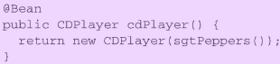

> 看起来， CompactDisc是通过调用sgtPeppers()得到的， 但情况并非完全如此。 因为sgtPeppers()方法上添加了@Bean注解，**Spring将会拦截所有对它的调用， 并确保直接返回该方法所创建的bean（即容器中已经创建的bean）， 而不是每次都对其进行实际的调用**  

**最佳的选择** ：它不会要求将CompactDisc声明到同一个配置类之中，**还可以是XML配置或自动发现**，只要在容器中有实例就可以 

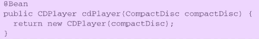

> 带有@Bean注解的方法可以采用任何必要的Java功能来产生bean实例。 构造器和Setter方法只是@Bean方法的两个简单样例。   

### 3. XML装配Bean

#### 一步：创建XML配置规范  

> 在使用JavaConfig的时候， 这意味着要创建一个带有@Configuration注解的类， 而在XML配置中， 这意味着要创建一个XML文件， 并且要以`<beans>`元素为根  
>
> 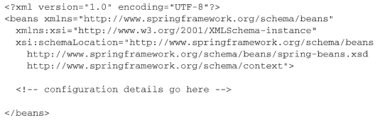

#### 二步：声明简单的`<bean>`

`<bean>`元素类似于JavaConfig中的@Bean注解：

  `<bean class="soundsystem.SgtPeppers">`

> 这里声明了一个很简单的bean， 创建这个bean的类通过class属性来指定的， 并且要使用**全限定的类名**  
>
> 没有明确给定ID  ,bean的ID将会是“soundsystem.SgtPeppers#0”  ,通常来讲更好的办法是借助id属性， 为每个bean设置一个你自己选择的名字   `<bean id="compactDisc" class="soundsystem.SgtPeppers">`

注意：

1. 你不再需要直接负责创建SgtPeppers的实例， 在基于JavaConfig的配置中， 我们是需要这样做的。 当Spring发
   现这个`<bean>`元素时， 它将会调用SgtPeppers的**默认构造器**来创建bean。  
2. 在这个简单的`<bean>`声明中， 我们将bean的类型以字符串的形式设置在了class属性中，难以保证正确性。  

#### 三步：借助构造器装配bean  

> 在Spring XML配置中， 只有一种声明bean的方式： 使用`<bean>`元素并指定class属性；但是， 在XML中声明DI时， 会有多种可选的配置方案和风格  
>
> - `<constructor-arg>`元素
> - 使用Spring 3.0所引入的c-命名空间  

**构造器注入bean引用**  

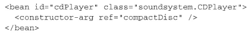

> `<constructor-arg>`元素会告知Spring要将一个ID为compactDisc的bean引用传递到CDPlayer的构造器中  
>
> `<constructor-arg>`中没有 `name `属性，(因为是参数不是属性)，使用`value`(字面量)或者`ref`（引用类型）

c-命名空间 :

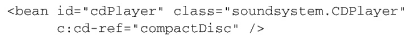

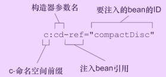

**构造器 注入字面量**

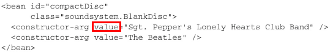

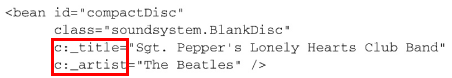

**装配集合**

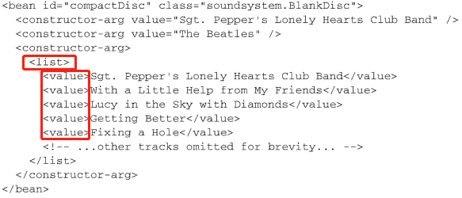

> `<list>`声明一个列表，`<value>`指定列表中的元素值，`<value>`可以被`<ref bean="onebeanId">`替换
>
> c命名空间不可以装配集合
>
> `<map>`声明一个映射集合，使用多个`<entry>`子节点，每个条目包含一个键和一个值：`<entry key="" value-ref=""></entry>`

**装配Properties**

使用`<props>`定义 `java.util.Properties`类型属性, 该标签使用多个`<props>`作为子标签. 每个`<props>`标签必须定义 **key** 属性

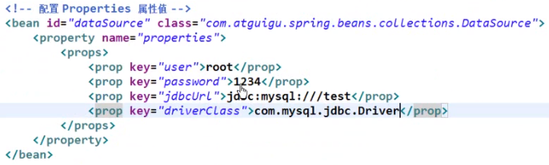

#### 三步：借助属性注入装配

> 对强依赖使用构造器注入， 而对可选性的依赖使用属性注入  ；

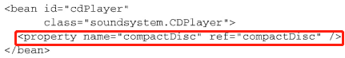

> `<property>`元素为属性的Setter方法所提供的功能与`<constructor-arg>`元素为构造器所提供的功能是一样的  ；`ref=""`可以替换为`value=""`注入字面量
>
> `name `属性指定 Bean 的属性名称，`value` 属性或` <value> `子节点指定属性值

可以使用p-命名空间 :

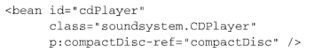

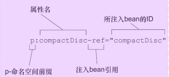

### 4. 导入混合配置

> 自动装配的时候会考虑到Spring容器中所有的bean， 不管它是在JavaConfig或XML中声明的还是通过组件扫描获取到的。  

#### 在JavaConfig中引用XML配置  

使用@Import注解导入其他配置类

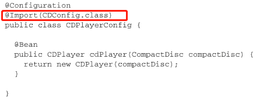

**最好创建一个更高级别的Config类**， 在这个类中使用@Import将两个配置类组合在一起  

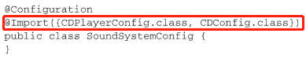

**使用@ImportResource注解** 在一个配置类中导入XML配置

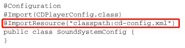

#### 在XML配置中引用JavaConfig  

在XML中， 我们可以使用import元素来拆分XML配置。  

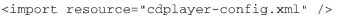

`<import>`元素只能导入其他的XML配置文件， 并没有XML元素能够导入JavaConfig类  .为了将JavaConfig类导入到XML配置中， 我们只需要**声明一个配置类bean**：  

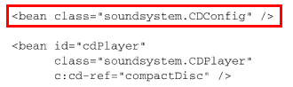

可以创建一个更高级别的配置文件，只负责组合各种配置：

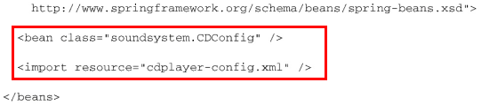

> 不管使用JavaConfig还是使用XML进行装配， 我通常都会创建一个**根配置（root configuration）** ， 也就是这里展现的这样， 这个配置会将两个或更多的装配类和/或XML文件组合起来。 我也会在根配置中启用组件扫描（通过`<context:component-scan>`或`@ComponentScan`）   

