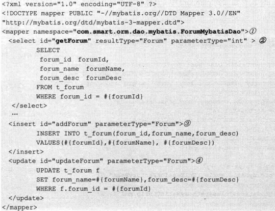

# 09持久化数据Mybatis

> #### [MyBatis中文官网](http://www.mybatis.cn/)
>
> 
>
> #### **《精通Spring4.X》**


Java持久化API（Java Persistence API， JPA）   

Java 持久层框架访问数据库的方式大致分为两种。

- 一种**以 SQL 核心**，封装一定程度的 JDBC 操作，比如： MyBatis。
- 另一种是以 **Java 实体类为核心**，将实体类的和数据库表之间建立映射关系，也就是我们说的ORM框架，如：Hibernate、Spring Data JPA。(完全消除SQL)

## 为什么要使用MyBatis？


MyBatis是一个半自动化的持久化层框架。
JDBC

- SQL夹在Java代码块里，耦合度高导致硬编码内伤
- 维护不易且实际开发需求中sql是有变化，频繁修改的情况 多见

Hibernate和JPA

- 长难复杂SQL，对于Hibernate而言处理也不容易
- 内部自动生产的SQL，不容易做特殊优化。
- 基于全映射的全自动框架，大量字段的POJO进行部分映射时比较困难。导致数据库性能下降。

对开发人员而言，核心sql还是需要自己优化。 sql和java编码分开，功能边界清晰，一个专注业务、一个专注数据。  

> HelloWorld简单版
>
> - 创建一张测试表
> - 创建对应的javaBean
> - 创建mybatis配置文件
> -  sql映射文件  

## Spring 中使用Mybatis

### MyBatis工作原理

MyBatis（前身是iBatis）是一个支持普通SQL查询、存储过程以及高级映射的持久层框架，它消除了几乎所有的JDBC代码和参数的手动设置以及对结果集的检索，并使用简单的XML或注解进行配置和原始映射，用以将接口和Java的POJO（Plain Old Java Object，普通Java对象）映射成数据库中的记录

MyBatis框架也被称之为ORM（Object/Relational Mapping，即对象关系映射）框架。所谓的ORM就是一种为了解决面向对象与关系型数据库中数据类型不匹配的技术，它通过描述Java对象与数据库表之间的映射关系，自动将Java应用程序中的对象持久化到关系型数据库的表中。


使用ORM框架后，应用程序不再直接访问底层数据库，而是以面向对象的方式来操作持久化对象（Persisent Object,PO），而ORM框架则会通过映射关系将这些面向对象的操作转换成底层的SQL操作。

----


1. 读取MyBatis配置文件mybatis-config.xml。mybatis-config.xml作为MyBatis的全局配置文件，配置了MyBatis的运行环境等信息，其中主要内容是获取数据库连接。
2. 加载映射文件Mapper.xml。Mapper.xml文件即SQL映射文件，该文件中配置了操作数据库的SQL语句，需要在mybatis-config.xml中加载才能执行。mybatis-config.xml可以加载多个配置文件，每个配置文件对应数据库中的一张表。
3. 构建会话工厂。通过MyBatis的环境等配置信息构建会话工厂SqlSessionFactory。
4. 创建SqlSession对象。由会话工厂创建SqlSession对象，该对象中包含了执行SQL的所有方法。
5. MyBatis底层定义了一个Executor接口来操作数据库，它会根据SqlSession传递的参数动态地生成需要执行的SQL语句，同时负责查询缓存的维护。
6. 在Executor接口的执行方法中，包含一个MappedStatement类型的参数，该参数是对映射信息的封装，用于存储要映射的SQL语句的id、参数等。Mapper.xml文件中一个SQL对应一个MappedStatement对象，SQL的id即是MappedStatement的id。
7. 输入参数映射。在执行方法时，MappedStatement对象会对用户执行SQL语句的输入参数进行定义（可以定义为Map、List类型、基本类型和POJO类型）, Executor执行器会通过MappedStatement对象在执行SQL前，将输入的Java对象映射到SQL语句中。这里对输入参数的映射过程就类似于JDBC编程中对preparedStatement对象设置参数的过程。
8. 输出结果映射。在数据库中执行完SQL语句后，MappedStatement对象会对SQL执行输出的结果进行定义（可以定义为Map和List类型、基本类型、POJO类型）, Executor执行器会通过MappedStatement对象在执行SQL语句后，将输出结果映射至Java对象中。这种将输出结果映射到Java对象的过程就类似于JDBC编程中对结果的解析处理过程。

### 1 配置SqlMapClient

每个MyBatis的应用程序都以一个**`SqlSessionFactory`对象的实例为核心**。SqlSessionFactory对象的实例可以通过`SqlSessionFactoryBuilder` 对象来获得。

SqlSessionFactoryBuilder 对象可以从XML配置文件或Configuration类的实例中构建SqlSessionFactory对象。

MyBatis 拥有多个**SQL映射文件**，并通过一个配置文件对这些SQL映射文件进行装配，同时在该文件中定义一些控制属性的信息。

- **mybatisConfig.xml**:构建SqlSessionFactory对象需要该文件


> 在①处提供可控制MyBatis框架运行行为的属性信息。在②处定义全限定类名的别名，在映射文件中可以通过别名代替具体的类名（简化mapper中的返回值类型），简化配置。在③处将MyBatis的所有映射文件组装起来。

- **SQL映射文件Mapper**::egg:Forum.xml（接口与查询语句的对应关系）



该文件定义了对Forum实体类进行数据操作时所需的SQL语句，同时还定义了查询结果和对象属性的映射关系。

在①处指定了映射所在的命名空间(**接口的全限定类名**)，每个具体的映射项都有一个id，可以通过**命名空间**和**映射项的id**定位到具体的**映射项**。如通过如下语句可以调用`getForum`的映射语句：


在②、③和④处分别定义了一条SELECT、INSERT及UPDATE语句映射项，映射项的`parameterType`指定**传入的参数对象**，可以是**全限定名的类，也可以是类的别名**(*类的别名在MyBatis的主配置文件中定义*)，如代码`mybatisConfig.xml`中的②处所示。如果映射项的入参是基础类型或String类型，则可以使用如int、long、string的基础类型名。SELECT映射项拥有**返回类型对象**，通过`resultType`指定。在映射项中通过`#{xxx}`绑定parameterType 指定参数类的属性，支持级联属性，如`#{topic.forumld}`。

### 2 在Spring中配置MyBatis
可以使用MyBatis 提供的`mybatis-spring` 整合类包实现Spring和MyBatis的整合，从功能上来说，mybatis-spring完全符合Spring的风格。要在Spring中整合MyBatis，**必须将mybatis-spring构件添加到pom.xml中**

- **applicationContext-mybatis.xml**

```xml
	<context:component-scan base-package="com.smart.orm.dao.mybatis">
    <context:component-scan base-package="com.smart.orm.service.mybatis">
<!--读取db.properties -->
    <context:property-placeholder location="classpath:jdbc.properties"/>
    <!-- 配置数据源 -->
     <bean id="dataSource" class="org.apache.commons.dbcp.BasicDataSource">
        <!--数据库驱动 -->
        <property name="driverClassName" value="${jdbc.driver}" />
        <!--连接数据库的url -->
        <property name="url" value="${jdbc.url}" />
        <!--连接数据库的用户名 -->
        <property name="username" value="${jdbc.username}" />
        <!--连接数据库的密码 -->
        <property name="password" value="${jdbc.password}" />
        <!--最大连接数 -->
        <property name="maxTotal" value="${jdbc.maxTotal}" />
        <!--最大空闲连接  -->
        <property name="maxIdle" value="${jdbc.maxIdle}" />
        <!--初始化连接数  -->
        <property name="initialSize" value="${jdbc.initialSize}" />
     </bean>
     <!-- 事务管理器，依赖于数据源 -->
     <bean id="transactionManager" class=  "org.springframework.jdbc.datasource.DataSourceTransactionManager">
         <property name="dataSource" ref="dataSource" />
     </bean>
    <!--开启事务注解 -->
     <tx:annotation-driven transaction-manager="transactionManager"/>
    
    <!--配置MyBatis工厂sqlSessionFactory，这里需要mybatisConfig.xml和mapper.xml -->
    <bean id="sqlSessionFactory" class="org.mybatis.spring.SqlSessionFactoryBean">
        <!--注入数据源 -->
        <property name="dataSource" ref="dataSource" />
        <!--指定核心配置文件位置 -->
   		<property name="configLocation" value="classpath:mybatis-config.xml"/>
   </bean>
  	 <!--自动的扫描所有的mapper的实现并加入到ioc容器中 -->
		<mybatis-spring:scan base-package="com.atguigu.dao"/>
 </beans>

```

> 首先定义了读取properties文件的配置，然后配置了数据源，接下来配置了事务管理器并开启了事务注解，最后配置了MyBatis工厂来与Spring整合。其中，MyBatis工厂的作用就是构建SqlSessionFactory，它是通过mybatis-spring包中提供的`org.mybatis.spring.SqlSessionFactoryBean·`类来配置的。通常，在配置时需要提供两个参数：**一个是数据源，另一个是MyBatis的配置文件路径。**这样Spring的IoC容器就会在初始化id为sqlSessionFactory的Bean时解析MyBatis的配置文件，并与数据源一同保存到Spring的Bean中。

> 如果在MyBatis的总装配置文件mybatisConfig.xml中指定了SQL映射文件，则必须逐个列出所有的SQL映射文件，比较烦琐。是否可以像Spring加载Hibernate映射文件一样按资源路径匹配规则扫描式加载呢?
>
> 答案是肯定的。SqlSessionFactoryBean提供了mapperLocations属性，支持扫描式加载SQL映射文件。  
> 首先将映射文件匹配从mybatisConfig.xml中移除，然后通过如下便捷方式加载SQL映射文件：
>
> 

### 3 编写MyBatis的DAO

----

1. **使用SqlSessionTemplate**

mybatis-spring效仿Spring的风格提供了一个**模板类SqlSessionTemplate**，它负责管理MyBatis的SqlSession，调用MyBatis的SQL方法。当调用SQL方法时，SqlSessionTemplate将会保证使用的SqlSession和当前Spring的事务是相关的。它还管理SqlSession的生命周期，包含必要的关闭、提交和回滚操作。

首先在`applicationContext-mybatis.xml`中配置好SqlSessionTemplate Bean。


然后就可以使用SqlSessionTemplate 调用SQL映射项完成数据访问操作:


> 在①处，SqlSessionTemplate通过selectOne()方法调用在Forum.xml映射文件中定义的命名空间com.smart.orm.dao.mybatis.ForumMybatisDao、映射项id为getForum的SQL映射项，并传入参数，返回映射成Forum对象的查询结果。

在SqlSession Template模板类中提供了多个方便调用的方法，常用方法介绍如下。

- `List<?>selectList(String statement,Object parameter)`:调用select映射项，返回一个结果对象集合。其中，statement为映射项全限定名，即包括命名空间和映射项id（下同）；而parameter为传递给映射项的入参。
- `int insert(String statement,Object parameter)`:调用insert映射项，返回插入的记录数。
- `int update(String statement,Object parameter)`:调用update映射项，返回更改的记录数。

-------

2. **使用映射接口**

代码清单14-10在①处使用字符串指定映射项，这种方式很容易引起错误。因为字符串本身没有语义性，如果存在编写错误，则在编译期无法识别，只能等到运行期才能发现。MyBatis为解决这个问题，特别提供了一种可将SQL映射文件中的映射项通过名称匹配接口进行调用的方法：

==**接口名称和映射命名空间相同，接口方法和映射元素的id相同。**==

下面为`Forum.xml`文件的映射项定义一个调用接口，如代码所示:


类名为`com.smart.orm.dao.mybatis.ForumMybatisDao`，`Forum.xml`文件中的**每个映射项对应一个接口方法，接口方法的签名和映射项的声明匹配。**


在定义好ForumMybatisDao接口后，该如何通过该接口进行数据访问呢?毕竟ForumMybatisDao接口没有任何实现类。一种简单的方式是通过SqlSession Template获取接口的实例。


这种方法虽然比直接通过字符串指定映射项的方法安全便捷，但还不是最优的方法。对于Spring应用来说，更希望在Service类中通过@Autowired注解直接注入接口实例。

**转换器MapperScannerConfigurer**

> mybatis-spring提供了一个“神奇”的**转换器MapperScannerConfigurer**，它**可以将映射接口直接转换为Spring容器中的Bean**，这样就可以在Service中注入映射接口的Bean了。

假设已经为3个SOL映射文件分别定义了对应的接口类，这些接口类位于`com.smart.orm.dao.mybatis`包中，接口名分别为`ForumMybatisDao、TopicMybatisDao及PostMybatisDao`。使用如下配置即可将接口转换为Bean：


MapperScannerConfigurer 将扫描 basePackage所指定的包下的所有接口类（包括子包），如果它们在SQL映射文件中定义过，则将它们动态定义为一个Spring Bean，**这样就不需要SQLSessionTemplate创建实现类了，在Service中直接注入映射接口的Bean了**:


### 4日志

MyBatis默认使用log4j输出日志信息，所以如果要查看控制台的输出SQL语句，那么就需要在classpath路径下配置其日志文件。在项目的src目录下创建log4j.properties文件


> 在文件6-1中，包含了全局的日志配置、MyBatis的日志配置和控制台输出，其中MyBatis的日志配置用于将com.itheima包下所有类的日志记录级别设置为DEBUG。

##  Mapper接口方式的开发整合

合MapperFactoryBean是MyBatis-Spring团队提供的一个用于**根据Mapper接口生成Mapper对象的类**，该类在Spring配置文件中使用时可以配置以下参数。

- mapperInterface：用于指定接口。
- SqlSessionFactory：用于指定SqlSessionFactory。
- SqlSessionTemplate：用于指定SqlSessionTemplate。如果与SqlSessionFactory同时设定，则只会启用SqlSessionTemplate。

----

创建一个com.itheima.mapper包，然后在该包中创建CustomerMapper接口以及对应的映射文件，**同一个包下**

- 首先编写Mapper接口：

````java
package com.itheima.mapper;
public interface CustomerMapper{
//通过id查询客户
public Customer findCustomerById(Integer id);
}
````

- 编写对应的Mapper.xml映射文件：

```xml
<?xml version="1.0"encoding="UTF-8"?>
<!DOCTYPE mapper PUBLIC"-//mybatis.org//DTD Mapper 3.0//E 
	"http://mybatis.org/dtd/mybatis-3-mapper.dtd">
<mapper namespace="com.itheima.mapper.CustomerMapper">
<!--根据id查询客户信息-->
    <select id="findCustomerById" parameterType="Integer" resultType="customer">
    select *from t_customer where id=#{id}
    </select>
</mapper>

```

----

在MyBatis的配置文件中，引入新的映射文件：

```xml
<!--Mapper接口开发方式-->
<mapper resource="com/itheima/mapper/CustomerMapper.xml"/>
```

---

在Spring的配置文件中，创建sqlSessionFactory和一个id为customerMapper的Bean:

```xml
<!--Mapper代理开发（基于MapperFactoryBean）-->
<bean id="customerMapper" class="org.mybatis.spring.mapper.MapperFactoryBean">
	<property name="mapperInterface" value="com.itheima.mapper.CustomerMapper"/>
	<property name="sqlSessionFactory" ref="sqlSessionFactory"/>
</bean>
```

上述配置代码为MapperFactoryBean指定了**接口**以及**SqlSessionFactory**。但是如果有多个mapper接口，就要写多次Mapper动态代理配置；

也可以配置支持扫描的Mapper动态代理： [05SSM整合.md](../Mybatis/05SSM整合.md) 

````xml
1 <!--生成Dao的代理对象 
 2      当前配置会被本包中所有的接口生成代理对象
 3     -->
 4     <bean  class="org.mybatis.spring.mapper.MapperScannerConfigurer">
 5         <property name="sqlSessionFactoryBeanName" value="mySqlSessionFactory" />
 6         <property name="basePackage" value="com.jmu.dao" />
 7     </bean>

 8 
 9     <!-- 注册Service -->
10     <bean id="studentService" class="com.jmu.service.StudentServiceImpl">
11          <!-- 这里的Dao的注入需要使用ref属性，且其作为接口的简单类名 -->
12         <property name="dao" ref="studentDao" />
13     </bean>

applicationContext
````


---

> 脚下留心：
>
> Mapper接口编程方式只需要程序员编写Mapper接口（相当于DAO接口），然后由MyBatis框架根据接口的定义创建接口的动态代理对象，这个代理对象的方法体等同于DAO接口的实现类方法。虽然使用Mapper接口编程的方式很简单，但是在具体使用时还是需要遵循以下规范。
>
> 1. Mapper接口的名称和对应的Mapper.xml映射文件的名称必须一致。
> 2. Mapper.xml文件中的**namespace**与Mapper**接口的类路径**相同（即**接口文件和映射文件需要放在同一个包中**）。
> 3. Mapper接口中的**方法名**和Mapper.xml中定义的每个执行语句的**id相同**。
> 4. Mapper接口中方法的**输入参数类型**要和Mapper.xml中定义的每个sql的parameterType的类型相同。
> 5. Mapper接口方法的**输出参数类型**要和Mapper.xml中定义的每个sql的resultType的类型相同。


---

## DAO层设计

### DAO基类设计

### 查询接口方法设计

### 分页查询接口设计

分页技术大致可分为以下3种。

- 客户端分页：直接将全部或多页结果数据一次性返回给客户端，客户端通过展现组件进行数据分页的控制。
- 数据库分页：在进行数据查询时，数据库仅返回一页数据给客户端。
- 服务器端分页：从数据库返回全部或多页数据，在服务器端缓存多页数据，但只返回一页数据给客户端。

> 客户端分页可以减小和服务器交互的次数，在进行分页切换时，直接从客户端的缓存中获取数据，无须和服务器端进行再次交互，提高了系统交互性；但会增加第一次交互的负荷。
>
> 数据库分页要求每次切页时都访问数据库，这增加了数据库访问的并发性；但每次从数据库返回的数据较少，当次交互的负荷较轻。
>
> 服务器端分页在以上两者之间寻求平衡，它既减少了数据库访问的并发性，同时使服务器端返回给客户端的当次负荷也较小；但服务器端分页技术需要考虑到数据缓存、数据同步等问题，提高了系统的复杂性。

DAO不可避免地需要涉及分页查询接口，分页查询接口包括查询参数、分页设置及分页结果等对象。下面是一个简单的分页查询接口的设计方案。


queryXxxs有两个入参，其中

- `XxxQueryParam`为查询参数对象
- `PageParam`为分页的设置信息，包括页码（pageNo）、每页记录数（pageSize)及允许查询的最大查询页数（maxPageNum）等。
- `Page<T>`为当前页数据的封装类，其中pageNo为页码，totalPageNum为结果集总页数（客户端的分页导航栏需要用到pageNo和totalPageNum)，pageltems为当前页的业务数据集合。
- 当需要查询的页码超过结果集的最大页数，或者超过允许查询的最大页数时，将抛出OutOfPageSizeException 运行期异常。


