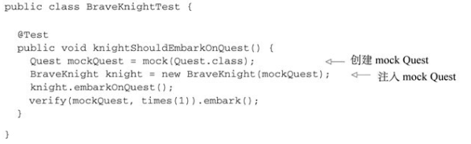
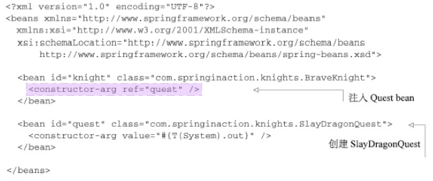
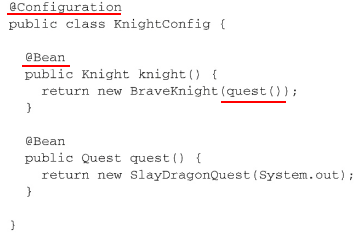
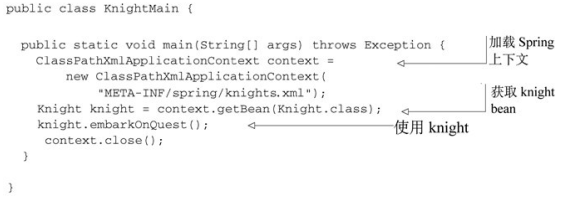
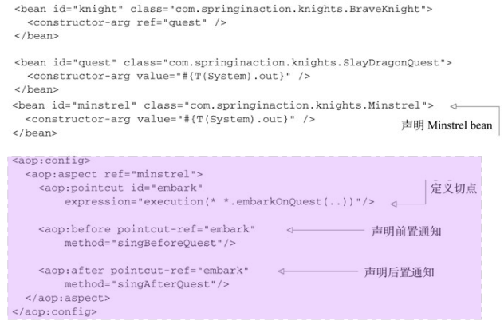
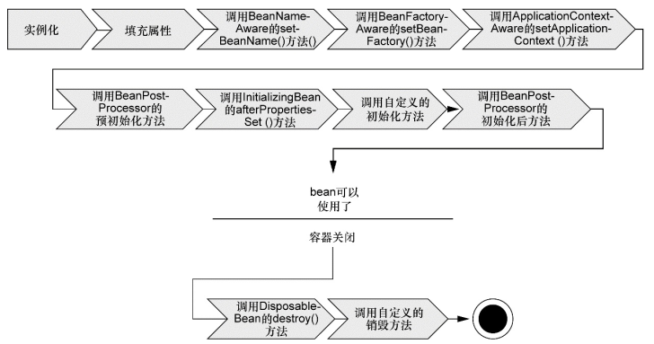
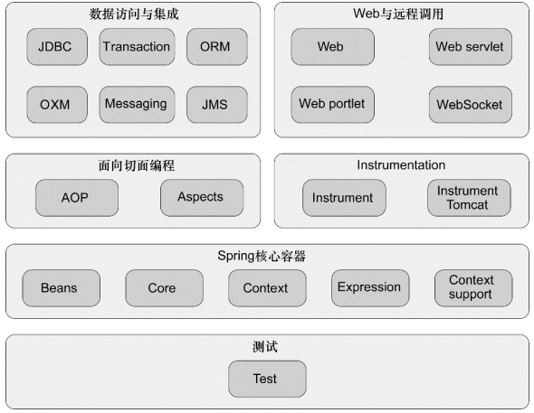

# 1Spring简介

## 1.1简化Java开发

一个Spring组件可以是任何形式的POJO  

Spring最根本的使命： **简化Java开发**

为了降低Java开发的复杂性， Spring采取了以下4种关键策略：

1. 基于POJO的轻量级和最小侵入性编程；
2. 通过依赖注入和面向接口实现松耦合；
3. 基于切面和惯例进行声明式编程；
4. 通过切面和模板减少样板式代码。  

### 依赖注入

通过DI， 对象的依赖关系将由系统中负责协调各对象的第三方组件在创建对象的时候进行设定。 对象无需自行创建或管理它们的依赖关系

**构造器注入（constructor injection）**：在构造Bean的时候把依赖对象（接口）作为**构造器参数**传入。

> 如果一个对象只通过接口（而不是具体实现或初始化过程） 来表明依赖关系， 那么这种依赖就能够在对象本身毫不知情的情况下， 用不同的具体实现进行替换  。对依赖进行替换的一个最常用方法就是在测试的时候使用mock实现  
>
> 

**装配：创建应用组件之间协作的行为** 。Spring有多种装配bean的方式：XML方式、JavaConfig方式、自动装配

> - XML
>   
>
> - JavaConfig
>   -

 **应用上下文（Application Context） :**Spring通过应用上下文（Application Context） 装载bean的定义并把它们组装起来。 Spring应用上下文全权负责对象的创建和组装。  

> 

### 切面开发

> DI能够让相互协作的软件组件保持松散耦合， 而面向切面编程（aspect-oriented programming， AOP） 允许你把遍布应用各处的功能分离出来形成可重用的组件。  
>
> 借助AOP， 可以使用各种功能层去包裹核心业务层。 这些层以声明的方式灵活地应用到系统中， 你的核心应用甚至根本不知道它们的存在  

要将一个组件Bean抽象为一个切面， 你所需要做的事情就是在一个Spring配置文件中声明它  ：

> 
>
> - 首先， 需要把Minstrel声明为一个bean
> - 然后在`<aop:aspect>`元素中引用该bean
> - 为了进一步定义切面， 声明（使用`<aop:before>`） 在`embarkOnQuest()`方法执行前调用Minstrel的`singBeforeQuest()`方法。 这种方式被称为前置通知（before advice） 。 同时声明（使用`<aop:after>`）在embarkOnQuest()方法执行后调用singAfter Quest()方法。 这种方式被称为后置通知（after advice） 。 
> - `pointcut-ref`属性都引用了名字为embank的切入点。 该切入点是在前边的`<pointcut>`元素中定义的， 并配置`expression`属性来选择所应用的通知   
>
> 尽管我们使用Spring魔法把Minstrel转变为一个切面， 但首先要把它声明为一个Spring bean。 能够为其他Spring bean做到的事情都可以同样应用到Spring切面中  

## 1.2容纳bean的容器

Spring容器负责创建对象， 装配它们， 配置它们并管理它们的整个生命周期  

Spring自带了多个容器实现， 可以归为两种不同的类型。

- **bean工厂**（由org.springframework. beans.factory.eanFactory接口定义） 是最简单的容器， 提供基本的DI支持。
- **应用上下文**（由org.springframework.context.ApplicationContext接口定义） 基于BeanFactory构建， 并提供应用框架级别的服务  

### 应用上下文

- AnnotationConfigApplicationContext： 从一个或多个基于Java的配置类中加载Spring应用上下文。
- AnnotationConfigWebApplicationContext： 从一个或多个基于Java的配置类中加载Spring Web应用上下文。
- ClassPathXmlApplicationContext： 从类路径下的一个或多个XML配置文件中加载上下文定义， 把应用上下文的定义文件作为类资源。
- FileSystemXmlapplicationcontext： 从文件系统下的一个或多个XML配置文件中加载上下文定义。
- XmlWebApplicationContext： 从Web应用下的一个或多个XML配置文件中加载上下文定义。  

### bean生命周期

1. Spring对bean进行实例化；
2. Spring将值和bean的引用注入到bean对应的属性中；
3. 如果bean实现了BeanNameAware接口， Spring将bean的ID传递给setBean-Name()方法；
4. 如果bean实现了BeanFactoryAware接口， Spring将调用setBeanFactory()方法， 将BeanFactory容器实例传入；
5. 如果bean实现了ApplicationContextAware接口， Spring将调用setApplicationContext()方法， 将bean所在的应用上下文的引用传入进来；
6. 如果bean实现了BeanPostProcessor接口， Spring将调用它们的post-ProcessBeforeInitialization()方法；
7. 如果bean实现了InitializingBean接口， Spring将调用它们的after-PropertiesSet()方法。 类似地， 如果bean使用initmethod声明了初始化方法， 该方法也会被调用；
8. 如果bean实现了BeanPostProcessor接口， Spring将调用它们的post-ProcessAfterInitialization()方法；
9. 此时， bean已经准备就绪， 可以被应用程序使用了， 它们将一直驻留在应用上下文中， 直到该应用上下文被销毁；
10. 如果bean实现了DisposableBean接口， Spring将调用它的destroy()接口方法。 同样， 如果bean使用destroy-method声明了销毁方法， 该方法也会被调用。  

### Spring模块

