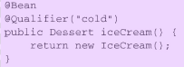

# 3高级装配

> 如何在开发、测试和QA阶段配置不同的数据库环境

## 3.1 环境与Profile

### 配置profile bean  

> Spring是在运行时再来确定环境相关的bean哪些需要创建哪些不需要创建
>
> Spring引入了`bean profile`的功能。 要使用profile， 你**首先要将所有不同的bean定义整理到一个或多个profile之中， 在将应用部署到每个环境时， 要确保对应的profile处于激活（active） 的状态**。  

- **Java配置中**

可以使用`@Profile`注解指定某个bean属于哪一个profile：

> 只有当规定的profile激活时， 相应的bean才会被创建， 但是可能会有其他的bean并没有声明在一个给定的profile范围内。 没有指定profile的bean始终都会被创建， 与激活哪个profile没有关系。  
>
> `@Profile("dev")`注解如果应用在了**类级别上**。 它会告诉Spring这个**配置类中的bean只有在`dev profile`激活时才会创建**。 如果dev profile没有激活的话， 那么带有@Bean注解的方法都会被忽略掉。  

- **在XML中配置profile  **

可以通过`<beans>`元素的·`profile属性`， 在XML中配置profile bean

还可以在根`<beans>`元素中嵌套定义`<beans>`元素， 而不是为每个环境都创建一个profile XML文件。 这能够将所有的profile bean定义放到同一个XML文件中  

### 激活profile

> Spring在确定哪个profile处于激活状态时， 需要依赖两个独立的属性： `spring.profiles.active`和`spring.profiles.default`。   有多种方式来设置这两个属性：
>
> - 作为DispatcherServlet的初始化参数；
> - 作为Web应用的上下文参数；
> - 作为JNDI条目；
> - 作为环境变量；
> - 作为JVM的系统属性；
> - 在集成测试类上， 使用@ActiveProfiles注解设置。  

## 3.2 自动装配的歧义性

> 仅有一个bean匹配所需的结果时， 自动装配才是有效的。 如果不仅有一个bean能够匹配结果的话， 这种歧义性会阻碍Spring自动装配属性、 构造器参数或方法参数  
>
> 当确实发生歧义性的时候，可以将可选bean中的某一个设为**首选（`primary`） 的bean**， 或者使用限定符（`qualifier`） 来帮助Spring将可选的bean的范围缩小到只有一个bean。  ·

- **标示首选bean**

`@Primary`能够与@Component组合**用在组件扫描的bean上**， 也可以与@Bean组合**用在Java配置的bean声明中**  

XML配置bean  :

- **限定自动装配的bean**  

`@Qualifier`注解是使用限定符的主要方式。 它可以与@Autowired和@Inject协同使用， 在注入的时候指定想要注入进去的是哪个bean。  

> 为@Qualifier注解所设置的参数就是想要注入的bean的ID。   (这是基于限定符是bean ID的方式)
>
> 可以为bean设置**自己的限定符**， 而不是依赖于将bean ID作为限定符。 在这里所需要做的就是在**bean声明上添加**`@Qualifier`注解。  
>
> 
>
> 装配：在注入的地方或者在配置类中
>
> 

## 3.3 bean的作用域

Spring定义了多种作用域， 可以基于这些作用域创建bean， 包括：

- 单例（Singleton） ： 在整个应用中， 只创建bean的一个实例。
- 原型（Prototype） ： 每次注入或者通过Spring应用上下文获取的时候， 都会创建一个新的bean实例。
- 会话（Session） ： 在Web应用中， 为每个会话创建一个bean实例。
- 请求（Rquest） ： 在Web应用中， 为每个请求创建一个bean实例  

> 在默认情况下， Spring应用上下文中所有bean都是作为以单例（singleton） 的形式创建的  
>
> 如果选择其他的作用域， 要使用@Scope注解， 它可以与@Component或@Bean一起使用。 

- **组件扫描方式：**

 也可以使用`@Scope("prototype")  `

- **Java配置方式：**

- **XML来配置bean  ：**

## 运行时注入

