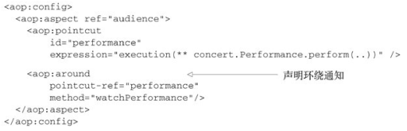

# 04面向切面编程

## 基础知识

采用JDK或者CGLib动态代理实现切面编程存在3个明显需要改进的地方：

- 目标类的**所有方法都添加了性能监视横切逻辑**，而有时这并不是我们所期望的，我们可能希望对业务类中的某些特定方法添加横切逻辑。
- 通过硬编码的方式指定了织入横切逻辑的织入点，即在目标类业务方法的开始和结束前织入代码。
- **手工编写代理实例的创建过程**，在为不同类创建代理时，需要分别编写相应的创建代码，无法做到通用。

SpringAOP便是以以上三个问题展开的。

----

> DI有助于**应用对象之间的解耦**， 而AOP可以实现**横切关注点(附加功能)与它们所影响的对象之间的解耦** 

**通知/增强（ Advice）** ：切面中织入目标类中连接点上的一段程序代码被称为通知/增强  

- 前置通知（Before） ： 在目标方法被调用之前调用通知功能；
- 后置通知（After） ： 在目标方法完成之后调用通知， 此时不会关心方法的输出是什么；
- 返回通知（After-returning） ： 在目标方法成功执行之后调用通知；
- 异常通知（After-throwing） ： 在目标方法抛出异常后调用通知；
- 环绕通知（Around） ： 通知包裹了被通知的方法， 在被通知的方法调用之前和调用之后执行自定义的行为  

**连接点（ Join point）**  ：连接点是在应用执行过程中能够插入切面的一个位置 

**切点（ Poincut）  **：如果说通知定义了切面的“什么”和“何时”的话， 那么切点就定义了“**何处**”。 切点的定义会定位通知所要织入的一个或多个连接点  （定位连接点）

**切面（ Aspect）  **：切面（横切关注点）是**通知和切点的结合**。 通知和切点共同定义了切面的全部内容——**它是什么， 在何时和何处**完成其功能  

**目标对象（Target）**：增强逻辑织入的目标类

**引入（ Introduction）  ：**引入允许我们向现有的类添加新方法或属性，可以在无需修改这些现有的类的情况下， 让它们具有新的行为和状态  

**织入（ Weaving）：**织入是把切面应用到目标对象并创建新的代理对象的过程。  

- 在目标对象的生命周期里有多个点可以进行织入：
  - **编译期**： 切面在目标类编译时被织入。 这种方式需要特殊的编译器。 **AspectJ的织入编译器就是以这种方式织入切面的。**
  - **类加载期**： 切面在目标类加载到JVM时被织入。 这种方式需要特殊的类加载器（ClassLoader） ， 它可以在目标类被引入应用之前增强该目标类的字节码。 **AspectJ 5的加载时织入**（load-time weaving， LTW） 就支持以这种方式织入切面。
  - **运行期**： 切面在应用运行的某个时刻被织入。 一般情况下， 在织入切面时， AOP容器会为目标对象**动态地创建一个代理对象。Spring AOP就是以这种方式织入切面的**。  

------

Spring提供了4种类型的AOP支持：

- 基于代理的经典Spring AOP(太笨重)；
- 纯POJO切面；
- @AspectJ注解驱动的切面；
- 注入式AspectJ切面（适用于Spring各版本） 。  

> 前三种都是Spring AOP实现的变体， Spring AOP构建在**动态代理基础之上**， 因此， Spring对AOP的支持**局限于方法拦截**。   [11设计模式之Proxy代理模式.md](../../08.设计模式/11设计模式之Proxy代理模式.md) 

> 借助Spring的aop命名空间， 我们可以将纯POJO转换为切面，这种技术需要XML配置  。  
>
> Spring借鉴了AspectJ的切面， 以提供注解驱动的AOP  

> **Spring在运行时通知对象**  
>
> Spring AOP使用了两种代理机制：**一种是基于JDK的动态代理；另一种是基于CGLib的动态代理**。之所以需要两种代理机制，很大程度上是因为JDK本身只提供接口的代理，而不支持类的代理。
>
> 代理类封装了目标类， 并拦截被通知方法的调用， 再把调用转发给真正的目标bean。   直到应用需要被代理的bean时， Spring才创建代理对象。
>
> 如果使用的是ApplicationContext的话， 在ApplicationContext从BeanFactory中加载所有bean的时候， Spring才会创建被代理的对象。 因为**Spring运行时才创建代理对象**  

> **Spring只支持方法级别的连接点**  
>
> AspectJ和JBoss， 除了方法切点， 它们还提供了字段和构造器接入点。 Spring缺少对字段连接点的支持， 无法让我们创建细粒度的通知， 例如拦截对象字段的修改  

## 1通过切点来选择连接点  

在Spring AOP中， 要使用AspectJ的切点表达式语言来定义切点。  Spring仅支持AspectJ切点指示器（pointcut designator） 的一个子集  

Spring借助AspectJ的**切点表达式语言来定义Spring切面** :

 

> 注意只有execution指示器是实际执行匹配的， 而其他的指示器都是用来限制匹配的。   

### 编写切点  

使用AspectJ切点表达式来选择Performance的perform()方法 :使用execution指示器指定执行perform()方法时候应用通知

现在假设我们需要配置的切点仅匹配concert包。 在此场景下， 可以使用within()指示器来限制匹配 ：可以使用and来代替“&&”  

### 在切点中选择bean  

Spring还引入了一个新的bean()指示器，bean()使用bean ID或bean名称作为参数来限制切点只匹配特定的bean。  

## 2使用注解创建切面  

-----

### 自定义注解

------

### 定义切面  

Audience类使用`@AspectJ`注解进行了标注。 该注解表明Audience不仅仅是一个POJO， 还是一个**切面**。 

AspectJ提供了五个注解来定义通知 : (这些注解都给定了一个切点表达式作为它的值  )

`@Pointcut`注解能够在一个@AspectJ切面内定义**可重用的切点**。   

> 注意， 除了注解和没有实际操作的performance()方法， Audience类依然是一个POJO。 我们能够像使用其他的Java类那样调用它的方法， 它的方法也能够独立地进行单元测试， 这与其他的Java类并没有什么区别。 Audience只是一个Java类， 只不过它通过注解表明会作为切面使用而已。  

> 此时即便使用了AspectJ注解， 但它并不会被视为切面， 这些**注解不会解析， 也不会创建将其转换为切面的代理**  

### 启动自动代理

JavaConfig的话， 可以在配置类的类级别上通过使用`@EnableAspectJAutoProxy`注解**启用自动代理功能**，并**声明切面bean**。  

使用XML来装配bean的话， 那么需要使用Springaop命名空间中的`<aop:aspectj-autoproxy>`元素  

> 不管你是使用JavaConfig还是XML， AspectJ自动代理都会为使用@Aspect注解的bean创建一个代理， 这个代理会围绕着所有该切面的切点所匹配的bean。  
>
> attention：Spring的AspectJ自动代理仅仅使用@AspectJ作为创建切面的指导， 切面依然是基于代理的。 在**本质上， 它依然是Spring基于代理的切面**。    
>
> - 这意味着尽管使用的是@AspectJ注解， 但我们仍然限于代理方法的调用。 如果想利用AspectJ的所有能力， 我们必须在运行时使用AspectJ并且不依赖Spring来创建基于代理的切面  

### 环绕通知

> 环绕通知是最为强大的通知类型。 它能够让你所编写的逻辑将被通知的目标方法完全包装起来。 实际上就像在一个通知方法中同时编写前置通知和后置通知。  

它接受`ProceedingJoinPoint`作为参数。 这个对象是**必须要有的**， 因为你要在通知中**通过它来调用被通知的方法**。 通知方法中可以做任何的事情， 当要将控制权交给被通知的方法时， 它需要调用ProceedingJoinPoint的`proceed()`方法。  

### 处理通知中的参数  

举例：统计每个磁道播放的次数

> args(trackNumber)限定符表明传递给playTrack()方法的**int类型参数也会传递到通知中去**。 参数的名称trackNumber也**与切点方法签名中的参数相匹配**。  

### 通过注解引入新功能  

## 3在XML中声明切面

> 面向注解的切面声明有一个明显的劣势： 你必须能够为通知类添加注解。 为了做到这一点， 必须要有源码。如果你没有源码的话， 或者不想将AspectJ注解放到你的代码之中就必须转向XML配置了    

Spring的AOP配置元素能够以非侵入性的方式声明切面  :

> eg:一个没有注解的切面，就是一个普通bean
>
> 

### 声明前置和后置通知  

通过XML将无注解的Audience声明为切面  :

> 大多数的AOP配置元素必须在`<aop:config>`元素的上下文内使用。   
>
> 使用`<aop:aspect>`元素声明一个简单的切面。 ref元素引用了一个POJO bean， 该bean实现了切面的功能——在这里就是audience。 ref元素所引用的bean提供了在切面中通知所调用的方法。  
>
> 可以有多个`<aop:aspect>`元素

> 在基于AspectJ注解的通知中， 当发现切入点表达式重复时， 我们使用@Pointcut注解消除了这些重复的内容。 而在基于XML的切面声明中， 我们需要使用`<aop:pointcut>`元素。  

> `<aop:pointcut>`如果位于`<aop:aspect>`元素中，则命名切点只能被当前`<aop:aspect>`内定义的元素访问到。为了能被整个`<aop:config>`元素中定义的所有增强访问，必须在`<aop:config>`元素下定义`<aop:pointcut>`切点。

### 声明环绕通知  

> 环绕通知可以实现对一个业务功能整个过程中状态的追踪，使用前置通知和后置通知容易出现线程安全问题

### 为通知传递参数  

> 明显的差别在于切点表达式中包含了一个参数， 这个参数会传递到通知方法中 ;而且只能使用`and`不能用`&&`

### 通过切面引入新的功能  

## 4注入AspectJ切面  