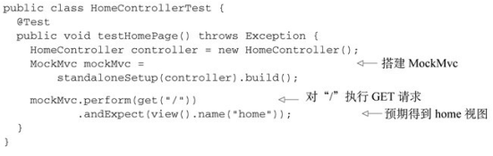

# 05 构建Spring Web应用程序

Spring MVC基于模型-视图-控制器（Model-View-Controller， MVC） 模式实现  

## 1Spring MVC

用户在Web浏览器中点击链接或提交表单的时候， 请求就开始工作了  ，请求使用Spring MVC所经历的所有站点 ：


- Spring MVC所有的请求都会通过一个前端控制器 Servlet（DispatcherServlet）将请求发送给Spring MVC控制器（controller）进行实际的逻辑处理 。   
- 应用程序中可能会有多个控制器， DispatcherServlet需要知道应该将请求发送给哪个控制器。 所以DispatcherServlet以会查询一个或多个处理器映射（handler mapping） 来确定请求的下一站在哪里。 处理器映射会根据请求所携带的URL信息来进行决策。 
- 一旦选择了合适的控制器， DispatcherServlet会将请求发送给选中的控制器 。 到了控制器， 请求会卸下其负载（用户提交的信息） 并耐心等待控制器处理这些信息   
- 控制器在完成逻辑处理后， 通常会产生一些信息， 这些信息需要返回给用户并在浏览器上显示。 这些信息被称为模型（model） 。   
- 控制器所做的最后一件事就是将模型数据打包， 并且标示出用于渲染输出的视图名。 它接下来会将请求连同模型和视图名发送回DispatcherServlet 。  
- 最后一站是视图的实现（可能是JSP） ， 在这里它交付模型数据。 请求的任务就完成了。 视图将使用模型数据渲染输出， 这个输出会通过响应对象传递给客户端  

## 2JavaConf搭建Spring MVC

要了解Spring MVC框架的工作机理，必须回答以下3个问题。

1. DispatcherServlet 框架如何截获特定的HTTP 请求并交由Spring MVC框架处理？
2. 位于Web层的Spring容器（`WebApplicationContext`)如何与位于业务层的Spring容器（`ApplicationContext`)建立关联，以使Web层的Bean可以调用业务层的Bean?
3. 如何初始化SpringMVC的各个组件，并将它们装配到DispatcherServlet中?

### 2.1 配置DispatcherServlet  

按照传统的方式， 像DispatcherServlet这样的Servlet会配置在web.xml文件中， 这个文件会放到应用的WAR包里面

也可以使用Java将DispatcherServlet配置在Servlet容器中；通过`AbstractAnnotationConfigDispatcherServletInitializer`来配置DispatcherServlet是传统web.xml方式的替代方案。   

  

> - 在Servlet 3.0环境中， 容器会在类路径中查找实现`javax.servlet.ServletContainerInitializer`接口的类，如果能发现的话， 就会用它来配置Servlet容器。在Spring中扩展`AbstractAnnotationConfigDispatcherServletInitializer`的任意类在容器启动时候都会被自动发现，并**配置DispatcherServlet上下文和Spring应用上下文**。  
> - `getServletMappings()`， 它会将一个或多个路径映射到DispatcherServlet上。 在本例中， 它映射的是“/”， 这表示它会是应用的默认Servlet。 它会处理进入应用的所有请求  
> - `getServletConfigClasses()`方法中， 我们要求DispatcherServlet加载应用上下文时， 使用定义在WebConfig配置类（使用Java配置） 中的bean。  
> - 本例中， 根配置定义在RootConfig中， DispatcherServlet的配置声明在WebConfig中  

-----

**DispatcherServlet和一个Servlet监听器（也就是ContextLoaderListener） 的关系**  

当DispatcherServlet启动的时候， 它会**创建`webApplicationContext`应用上下文**，并加载配置文件或配置类中所声明的bean。 

在Spring Web应用中， 通常还会有另外一个**应用上下文`applicationContext`**，这个应用上下文是**由ContextLoaderListener创建的**。   

我们希望**DispatcherServlet加载包含Web组件的bean， 如控制器、 视图解析器以及处理器映射， ContextLoaderListener要加载应用中的其他bean。 这些bean通常是驱动应用后端的中间层和数据层组件**。  

实际上，` AbstractAnnotationConfigDispatcherServletInitializer`会同时创建`DispatcherServlet`和`ContextLoaderListener ` 

- `GetServletConfigClasses()`方法返回的带有@Configuration注解的类将会用来定义**DispatcherServlet应用上下文中的**
  **bean。**
-  `getRootConfigClasses()`方法返回的带有@Configuration注解的类将会用来配置**ContextLoaderListener创建的应用上下文中的bean。**  

---

### 2.2 启用Spring MVC

Spring使用XML进行配置可以使用`<mvc:annotation-driven>`启用注解驱动的Spring MVC  

也可以基于Java进行配置 ：使用`@EnableWebMvc`注解


还需要：

- **配置视图解析器**。 如果没有配置， Spring默认会使用BeanNameView-Resolver， 这个视图解析器会查找ID与视
  图名称匹配的bean， 并且查找的bean要实现View接口， 它以这样的方式来解析视图。
- **启用组件扫描**。 不启用的结果就是， Spring只能找到显式声明在配置类中的控制器。
- **启用静态资源处理**，不配置的话， DispatcherServlet会映射为应用的默认Servlet， 所以它会处理所有的请求， 包括对静态资源的请求， 如图片和样式表（在大多数情况下， 这可能并不是你想要的效果）  


> 添加了@Component-Scan注解， 因此将会扫描spitter.web包来查找组件  
>
> 添加了一个ViewResolver bean,在查找的时候， 它会在视图名称上加一个特定的前缀和后缀  
>
> 重写了其configureDefaultServletHandling()方法 ，要求DispatcherServlet将对静态资源的请求转发到Servlet容器中默认的Servlet上， 而不是使用DispatcherServlet本身来处理此类请求。  

Web相关的配置通过DispatcherServlet创建的应用上下文都已经配置好了， 因此现在的`RootConfig`相对很简单：  


## 2编写控制器

控制器只是方法上添加了`@RequestMapping`注解的类， 这个注解声明了它们所要处理的请求。  


### mock测试控制器  

Spring现在包含了一种`mock Spring MVC`并针对控制器执行HTTP请求的机制  



### 定义类级别的请求处理  

可以拆分@RequestMapping， 并将其路径映射部分放到类级别上。  


> @RequestMapping的value属性能够接受一个String类型的数组  

### 传递模型数据到视图中  

需要定义一个数据访问的Repository。 为了实现解耦以及避免陷入数据库访问的细节之中， 我们将**Repository定义为一个接口**， 并在稍后实现它  


编写controller类


> Model实际上就是一个Map（也就是key-value对的集合） ， 它会传递给视图， 这样数据就能渲染到客户端了。 当调用addAttribute()方法并且不指定key的时候， 那么key会根据值的对象类型推断确定。  

当视图是JSP的时候， 模型数据会作为请求属性放到请求（request）之中。 因此， 在spittles.jsp文件中可以使用JSTL（JavaServer PagesStandard Tag Library） 的·`<c:forEach>`标签渲染spittle列表  

## 3接受请求的输入  

Spring MVC允许以多种方式将客户端中的数据传送到控制器的处理器方法中， 包括：

- 查询参数（Query Parameter） 。
- 表单参数（Form Parameter） 。
- 路径变量（Path Variable） 。  

### 查询参数

形如：`/spittles/max=23000&count=50`，使用`@RequestParam`注解  


如果同时处理有参数的和无参数的：


> 因为**查询参数都是String类型**的， 因此defaultValue属性需要String类型的值。 因此， 使用Long.MAX_VALUE是不行的。 我们可以将Long.MAX_VALUE转换为名为MAX_LONG_-AS_STRING的String类型常量：  
>
> 
>
> 尽管defaultValue属性给定的是String类型的值， 但是当绑定到方法的max参数时， 它会转换为Long类型。  

### 路径参数

形如：`/spittles/12345  `

> 对`/spittles/12345`发起GET请求要优于对`/spittles/show?spittle_id=12345`发起请求。 前者能够识别出要查询的资源， 而后者描述的是带有参数的一个操作——本质上是通过HTTP发起的RPC。  

Spring MVC允许我们在`@RequestMapping`路径中添加**占位符**。 占位符的名称要用大括号（“{”和“}”） 括起来。路径中的其他部分要与所处理的请求完全匹配， 但是占位符部分可以是任意的值。  


> `@PathVariable("spittleId")`注解表明在请求路径中， 不管占位符部分的值是什么都会传递到处理器方法的spittleId参数  
>
> 如果@PathVariable中没有value属性的话， 它会假设占位符的名称与方法的参数名相同。  

### 表单数据

> 使用表单分为两个方面： 展现表单；处理用户通过表单提交的数据。  

- 控制器编写


> 当处理注册表单的POST请求时， 控制器需要接受表单数据并将表单数据保存为Spitter对象。 最后， **为了防止重复提交**（用户点击浏览器的刷新按钮有可能会发生这种情况） ， 应该将浏览器**重定向**到新创建用户的基本信息页面。在本例中， 它将会重定向到用户基本信息的页面。  
>
> 视图格式中以“forward:”作为前缀时， 请求将会前往（forward） 指定的URL路径， 而不再是重定向。  
>
> Spitter对象作为参数有firstName、 lastName、 username和password属性， 这些属性将会使用**请求中同名的参数进行填充**  

- 注册表单：


> 这里的`<form>`标签中并没有设置action属性。 在这种情况下， 当表单提交时， 它会提交到与展现时相同的URL路径上。 也就是说， 它会提交到`/spitter/register`上，即需要处理post请求。  

### 校验表单 

使用Spring对Java校验API（`Java Validation API`， 又称JSR-303） 的支持 ，只要保证在类路径下包含这个Java API的实现即可， 比如Hibernate Validator。

Java校验API所提供的校验注解：


- eg：在Spitter域对象上添加约束

  

- 控制器编写

  

> Spitter参数添加了`@Valid`注解， 这会告知Spring， 需要确保这个对象满足校验限制。  
>
> 如果有校验出现错误的话， 那么这些错误可以通过`Errors对象`进行访问， 现在这个对象已作为processRegistration() 方法的参数。 （很重要一点需要注意， **Errors参数要紧跟在带有@Valid注解的参数后面**， @Valid注解所标注的就是要检验的参数。 ）  


## 4Spring MVC配置的替代方案  

### 自定义DispatcherServlet配置  


### 4.1 web.xml中声明DispatcherServlet  

**web.xml：**


> **ContextLoaderListener和DispatcherServlet各自都会加载一个Spring应用上下文**。ContextLoaderListener和DispatcherServlet都会在Web容器启动的时候加载一下bean配置. 区别在于:
>
> - **ContextLoaderListener一般会加载整个Spring容器相关的bean配置管理**(如: Log, Service, Dao, PropertiesLoader, etc.),使用·`ApplicationContext`作为上下文
> - **DispatcherServlet一般会加载MVC相关的bean配置管理**(如: ViewResolver, Controller, MultipartResolver, ExceptionHandler, etc.)。默认使用`WebApplicationContext`作为上下文.
>
> 上下文参数contextConfigLocation是一个ServletContextListener，它通过contextConfigLocation 参数所指定的Spring配置文件启动“业务层”的Spring容器。 如程序所示， 根上下文会从“`/WEB-INF/spring/root-context.xml`”中加载bean定义。  
>
> DispatcherServlet会根据Servlet的名字找到一个文件， 并基于该文件加载应用上下文。 在程序清单中， Servlet的名字是appServlet， 因此DispatcherServlet会从“`/WEBINF/appServlet-context.xml（<servlerName>-context.xml）`”文件中加载其应用上下文 
>
> > 值得注意的是, DispatcherServlet的上下文仅仅是Spring MVC的上下文, 而ContextLoaderListener的上下文则对整个Spring都有效. 一般Spring web项目中同时会使用这两种上下文. 

> > - Spring的ContextLoaderListener所创建出来的ApplicationContext和Spring MVC DispatcherServlet所创建出来的WebApplicationContext是父子关系，FrameworkServlet在实例化对应的webapplicationContext后通过setParent将从ServletContext中获取到的**ContextLoaderListener创建的applicaitonContext设置成父上下文**，然后加载在对应的xml配置文件对其初始化。
> >
> > - 在这里里，“Web层”Spring容器将作为“业务层”Spring容器的子容器，即“Web层”容器可以引用“业务层”容器的Bean，而“业务层”容器却访问不到“Web层”容器的Bean。
> >
> > - 所以在使用Spring MVC时启用自动检测功能，应在**applicationContext.xml里只component-scan非Controller的类，而在Spring MVC里只component-scan Controller类**
> >
> > - ```xml
> >   <--applicationContext.xml-->
> >   <context:component-scan base-package="com.test">
> >      <context:exclude-filter  expression="org.springframework.stereotype.Controller" type="annotation" />
> >      <context:exclude-filter type="annotation" expression="org.springframework.web.bind.annotation.ControllerAdvice" />
> >   </context:component-scan>
> >   
> >   <--dispatcher-servlet.xml-->
> >   <context:component-scan base-package="com.test.web" use-default-filters="false">
> >       <context:include-filter expression="org.springframework.stereotype.Controller"
> >           type="annotation" />
> >       <context:include-filter type="annotation" expression="org.springframework.web.bind.annotation.ControllerAdvice" />
> >   </context:component-scan>
> >   ```


### 4.2 基于Java配置的DispatcherServlet

要在Spring MVC中使用基于Java的配置， 我们需要告诉DispatcherServlet和ContextLoaderListener使用AnnotationConfigWebApplicationContext， 这是一个WebApplicationContext的实现类， 它会加载Java配置类， 而不是使用XML。 要实现这种配置， 我们可以设置contextClass上下文参数以及DispatcherServlet的初始化参数。  

设置**web.xml**使用基于Java的配置 ：

