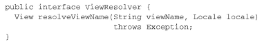
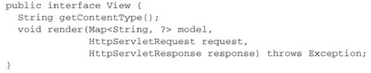
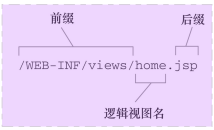
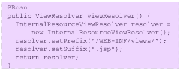
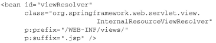
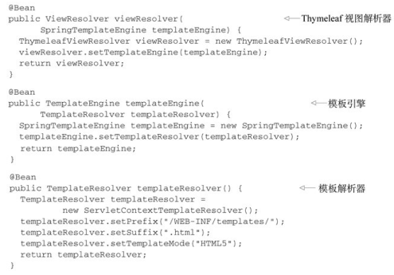
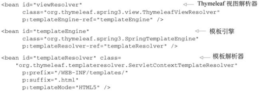
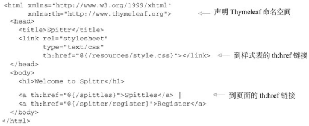
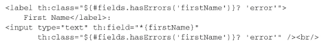

# 06渲染web视图

## 1理解视图解析

Spring该如何确定使用哪一个视图实现来渲染模型呢？ 这就是Spring视图解析器的任务了。  

Spring MVC定义了一个名为ViewResolver的接口  ：传入一个视图名和Locale对象，返回一个View实例  

View接口的任务就是接受模型以及Servlet的`request`和`response`对象，并将输出结果渲染到`response`中：  

Spring提供了多个内置的ViewResolver和View的实现。 

## 2创建JSP视图  

InternalResourceViewResolver会将视图名解析为JSP文件。  

### 配置适用于JSP的视图解析器  

InternalResourceViewResolver所采取的方式遵循一种约定， 会在视图名上添加前缀和后缀， 进而确定一个Web应用中视图资源的物理路径。  

- @Bean注解  

- 基于XML的Spring配置  

## 3使用Thymeleaf  

Thymeleaf模板是原生的， 不依赖于标签库。 它能在接受原始HTML的地方进行编辑和渲染。 因为它没有与Servlet规范耦合， 因此Thymeleaf模板能够进入JSP所无法涉足的领域。  

### 配置Thymeleaf视图解析器  

为了要在Spring中使用Thymeleaf， 我们需要配置三个启用Thymeleaf与Spring集成的bean：

- ThymeleafViewResolver： 将逻辑视图名称解析为Thymeleaf模板视图；
- SpringTemplateEngine： 处理模板并渲染结果；
- TemplateResolver： 加载Thymeleaf模板。  

Java配置：

XML 配置：

> TemplateResolver会最终定位和查找模板。 与之前配置InternalResource-ViewResolver类似， 它使用了prefix和suffix属性。 前缀和后缀将会与逻辑视图名组合使用， 进而定位Thymeleaf引擎。   

### [定义Thymeleaf模板](../../前端技术/Thymeleaf.md) 

#### 借助Thymeleaf实现表单绑定  

表单绑定是Spring MVC的一项重要特性。 它能够将表单提交的数据填充到命令对象中， 并将其传递给控制器， 而在展现表单的时候， 表单中也会填充命令对象中的值。  

---

> `th:class`属性会渲染为一个class属性， 它的值是根据给定的表达式计算得到的  
>
> `<input>`标签使用了th:field属性， 用来引用后端对象的firstName域。  
>
> 貌似使用`th:value`属性来设置`<input>`标签的value属性才是合理的。其实不然， 因为我们是在将这个输入域绑定到后端对象的firstName属性上， 因此使用`th:field`属性引用firstName域。通过使用`th:field`， 我们将value属性设置为firstName的值，同时还会将name属性设置为firstName。  