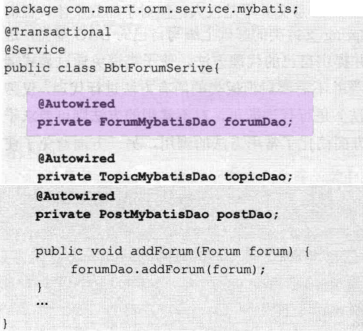

# 09持久化数据

**《精通Spring4.X》**

Java持久化API（Java Persistence API， JPA）   

## Spring 中使用Mybatis

### 1 配置SqlMapClient

每个MyBatis的应用程序都以一个**`SqlSessionFactory`对象的实例为核心**。SqlSessionFactory对象的实例可以通过`SqlSessionFactoryBuilder` 对象来获得。

SqlSessionFactoryBuilder 对象可以从XML配置文件或Configuration类的实例中构建SqlSessionFactory对象。

MyBatis 拥有多个**SQL映射文件**，并通过一个配置文件对这些SQL映射文件进行装配，同时在该文件中定义一些控制属性的信息。

- **mybatisConfig.xml**

> 在①处提供可控制MyBatis框架运行行为的属性信息。在②处定义全限定类名的别名，在映射文件中可以通过别名代替具体的类名，简化配置。在③处将MyBatis的所有映射文件组装起来。

- **SQL映射文件Mapper**::egg:Forum.xml

该文件定义了对Forum实体类进行数据操作时所需的SQL语句，同时还定义了查询结果和对象属性的映射关系。

在①处指定了映射所在的命名空间，每个具体的映射项都有一个id，可以通过**命名空间**和**映射项的id**定位到具体的**映射项**。如通过如下语句可以调用`getForum`的映射语句：

在②、③和④处分别定义了一条SELECT、INSERT及UPDATE语句映射项，映射项的`parameterType`指定**传入的参数对象**，可以是**全限定名的类，也可以是类的别名**(*类的别名在MyBatis的主配置文件中定义*)，如代码`mybatisConfig.xml`中的②处所示。如果映射项的入参是基础类型或String类型，则可以使用如int、long、string的基础类型名。SELECT映射项拥有**返回类型对象**，通过`resultType`指定。在映射项中通过`#{xxx}`绑定parameterType 指定参数类的属性，支持级联属性，如`#{topic.forumld}`。

### 2 在Spring中配置MyBatis
可以使用MyBatis 提供的`mybatis-spring` 整合类包实现Spring和MyBatis的整合，从功能上来说，mybatis-spring完全符合Spring的风格。要在Spring中整合MyBatis，**必须将mybatis-spring构件添加到pom.xml中**

- **applicationContext-mybatis.xml**

> 如果在MyBatis的总装配置文件mybatisConfig.xml中指定了SQL映射文件，则必须逐个列出所有的SQL映射文件，比较烦琐。是否可以像Spring加载Hibernate映射文件一样按资源路径匹配规则扫描式加载呢?
>
> 答案是肯定的。SqlSessionFactoryBean提供了mapperLocations属性，支持扫描式加载SQL映射文件。  
> 首先将映射文件匹配从mybatisConfig.xml中移除，然后通过如下便捷方式加载SQL映射文件：
>
> 

### 3 编写MyBatis的DAO

----

1. **使用SqlSessionTemplate**

mybatis-spring效仿Spring的风格提供了一个**模板类SqlSessionTemplate**，可以通过模板类轻松地访问数据库。

首先在`applicationContext-mybatis.xml`中配置好SqlSessionTemplate Bean。

然后就可以使用SqlSessionTemplate 调用SQL映射项完成数据访问操作:

> 在①处，SqlSessionTemplate通过selectOne()方法调用在Forum.xml映射文件中定义的命名空间com.smart.orm.dao.mybatis.ForumMybatisDao、映射项id为getForum的SQL映射项，并传入参数，返回映射成Forum对象的查询结果。

在SqlSession Template模板类中提供了多个方便调用的方法，常用方法介绍如下。

- `List<?>selectList(String statement,Object parameter)`:调用select映射项，返回一个结果对象集合。其中，statement为映射项全限定名，即包括命名空间和映射项id（下同）；而parameter为传递给映射项的入参。
- `int insert(String statement,Object parameter)`:调用insert映射项，返回插入的记录数。
- `int update（String statement,Object parameter)`:调用update映射项，返回更改的记录数。

-------

2. **使用映射接口**

代码清单14-10在①处使用字符串指定映射项，这种方式很容易引起错误。因为字符串本身没有语义性，如果存在编写错误，则在编译期无法识别，只能等到运行期才能发现。MyBatis为解决这个问题，特别提供了一种可将SQL映射文件中的映射项通过名称匹配接口进行调用的方法：

==**接口名称和映射命名空间相同，接口方法和映射元素的id相同。**==

下面为`Forum.xml`文件的映射项定义一个调用接口，如代码所示:

类名为`com.smart.orm.dao.mybatis.ForumMybatisDao`，`Forum.xml`文件中的**每个映射项对应一个接口方法，接口方法的签名和映射项的声明匹配。**

在定义好ForumMybatisDao接口后，该如何通过该接口进行数据访问呢?毕竟ForumMybatisDao接口没有任何实现类。一种简单的方式是通过SqlSession Template获取接口的实例。

这种方法虽然比直接通过字符串指定映射项的方法安全便捷，但还不是最优的方法。对于Spring应用来说，更希望在Service类中通过@Autowired注解直接注入接口实例。

mybatis-spring提供了一个“神奇”的**转换器MapperScannerConfigurer**，它**可以将映射接口直接转换为Spring容器中的Bean**，这样就可以在Service中注入映射接口的Bean了。假设已经为3个SOL映射文件分别定义了对应的接口类，这些接口类位于`com.smart.orm.dao.mybatis`包中，接口名分别为`ForumMybatisDao、TopicMybatisDao及PostMybatisDao`。使用如下配置即可将接口转换为Bean：

MapperScannerConfigurer 将扫描 basePackage所指定的包下的所有接口类（包括子包），如果它们在SQL映射文件中定义过，则将它们动态定义为一个Spring Bean，这样就可以在Service中直接注入映射接口的Bean了:

---

## DAO层设计

### DAO基类设计

### 查询接口方法设计

### 分页查询接口设计

分页技术大致可分为以下3种。

- 客户端分页：直接将全部或多页结果数据一次性返回给客户端，客户端通过展现组件进行数据分页的控制。
- 数据库分页：在进行数据查询时，数据库仅返回一页数据给客户端。
- 服务器端分页：从数据库返回全部或多页数据，在服务器端缓存多页数据，但只返回一页数据给客户端。

> 客户端分页可以减小和服务器交互的次数，在进行分页切换时，直接从客户端的缓存中获取数据，无须和服务器端进行再次交互，提高了系统交互性；但会增加第一次交互的负荷。
>
> 数据库分页要求每次切页时都访问数据库，这增加了数据库访问的并发性；但每次从数据库返回的数据较少，当次交互的负荷较轻。
>
> 服务器端分页在以上两者之间寻求平衡，它既减少了数据库访问的并发性，同时使服务器端返回给客户端的当次负荷也较小；但服务器端分页技术需要考虑到数据缓存、数据同步等问题，提高了系统的复杂性。

DAO不可避免地需要涉及分页查询接口，分页查询接口包括查询参数、分页设置及分页结果等对象。下面是一个简单的分页查询接口的设计方案。

queryXxxs有两个入参，其中

- `XxxQueryParam`为查询参数对象
- `PageParam`为分页的设置信息，包括页码（pageNo）、每页记录数（pageSize)及允许查询的最大查询页数（maxPageNum）等。
- `Page<T>`为当前页数据的封装类，其中pageNo为页码，totalPageNum为结果集总页数（客户端的分页导航栏需要用到pageNo和totalPageNum)，pageltems为当前页的业务数据集合。
- 当需要查询的页码超过结果集的最大页数，或者超过允许查询的最大页数时，将抛出OutOfPageSizeException 运行期异常。