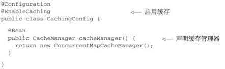
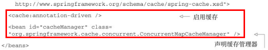
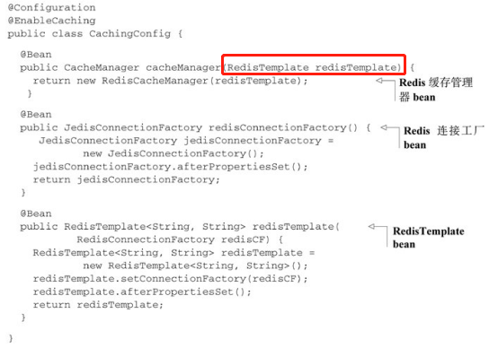
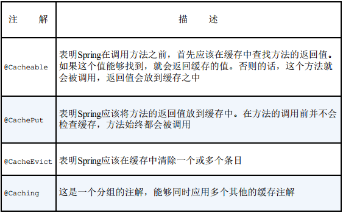
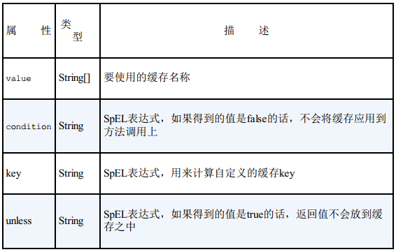
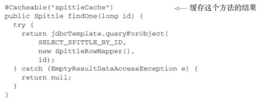

# 12缓存数据

缓存（Caching） 可以存储经常会用到的信息， 这样每次需要的时候， 这些信息都是立即可用的。   

## 启用对缓存的支持  

使用Spring的缓存抽象时， 最为通用的方式就是在方法上添加`@Cacheable`和`@CacheEvict`注解。   

在往bean上添加缓存注解之前， 必须要**启用Spring对注解驱动缓存的支持**。 如果我们使用Java配置的话， 那么可以在其中的一个配置类上添加`@EnableCaching`， 这样的话就能启用注解驱动的缓存  

> 如果以XML的方式配置应用的话， 那么可以使用Spring cache命名空间中的`<cache:annotation-driven>`元素来启用注解驱动的缓存。  
>
> 
>
> 其实在本质上， `@EnableCaching`和`<cache:annotationdriven>`的工作方式是相同的。 **它们都会创建一个切面（aspect） 并触发Spring缓存注解的切点（pointcut） 。 根据所使用的注解以及缓存的状态， 这个切面会从缓存中获取数据， 将数据添加到缓存之中或者从缓存中移除某个值。**  

### 配置缓存管理器

缓存管理器是Spring缓存抽象的核心， 它能够与多个流行的缓存实现进行集成。  

- SimpleCacheManager
- NoOpCacheManager
- ConcurrentMapCacheManager
- CompositeCacheManager
- EhCacheCacheManager  
- RedisCacheManager（来自于Spring Data Redis项目）
- GemfireCacheManager（来自于Spring Data GemFire项目）  

我们必须选择一个缓存管理器， 然后要在Spring应用上下文中， 以bean的形式对其进行配置。  

---

**使用Redis缓存**  

为了使用RedisCacheManager， 我们需要RedisTemplate bean以及RedisConnectionFactory实现类（如JedisConnectionFactory） 的一个bean。  

## 为方法添加注解以支持缓存  

Spring的缓存抽象在很大程度上是围绕切面构建的。 在Spring中启用缓存时， 会创建一个切面， 它触发一个或更多的Spring的缓存注解。   

Spring提供了四个注解来声明缓存规则  ：

### 填充缓存  

@Cacheable和@CachePut有一些共有的属性  ：

> 当findOne()被调用时， 缓存切面会拦截调用并在缓存中查找之前以名spittleCache存储的返回值。 缓存的key是传递到findOne()方法中的id参数。 如果按照这个key能够找到值的话，就会返回找到的值， 方法不会再被调用。 如果没有找到值的话， 那么就会调用这个方法， 并将返回值放到缓存之中， 为下一次调用findOne()方法做好准备。  
>
> @Cacheable注解也可以添加到接口的方法声明上，而不是实现类上，这样每个实现类都具有缓存功能

## 使用XML声明缓存  