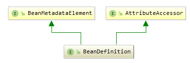
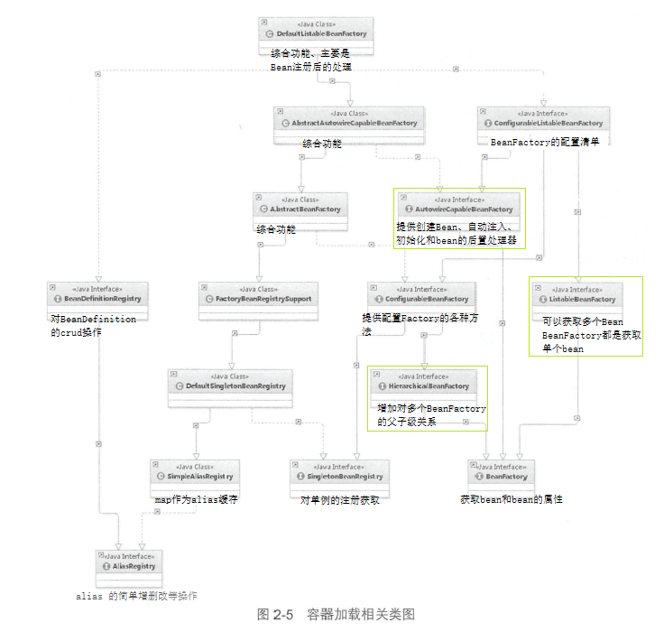
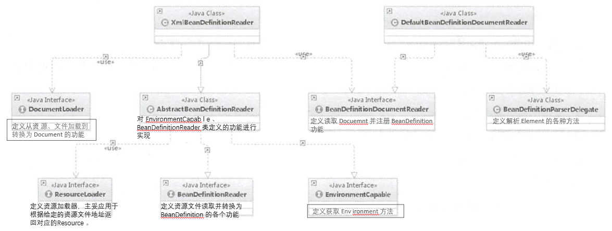
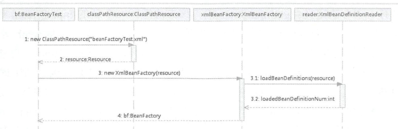
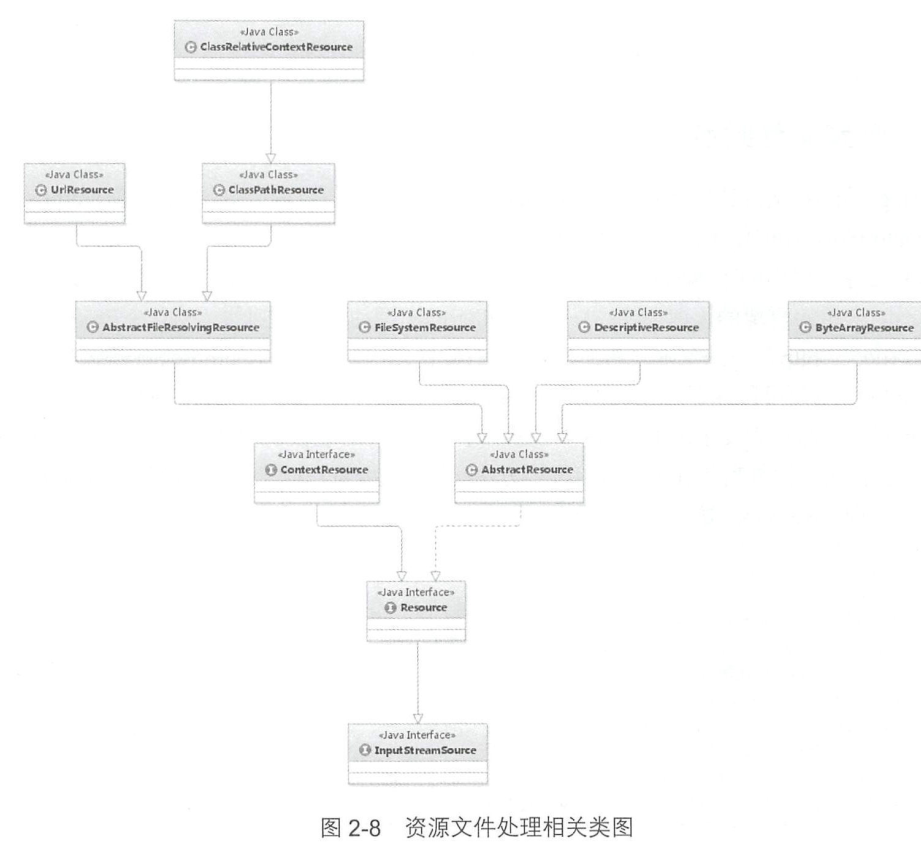
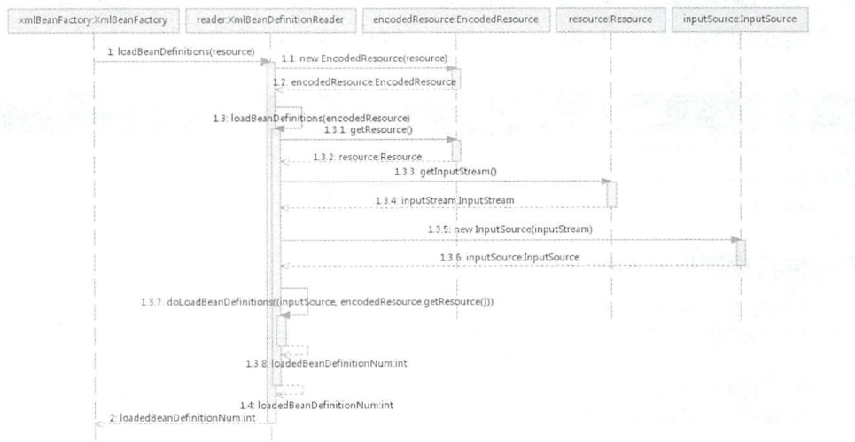

# Spring源码深度分析
# 1.bean和beanDefinition
BeanDefinition 就是我们所说的 Spring 的 Bean，我们自己定义的各个 Bean 其实会转换成一个个 BeanDefinition 存在于 Spring 的 BeanFactory 中。
BeanDefinition与Bean的关系, 就好比类与对象的关系. 类在spring的数据结构就是BeanDefinition.根据BeanDefinition得到的对象就是我们需要的Bean.
所以，如果有人问你 Bean 是什么的时候，你要知道 `Bean 在代码层面上可以认为是 BeanDefinition 的实例`。
>BeanDefinition 中保存了我们的 Bean 信息，比如这个 Bean 指向的是哪个类、是否是单例的、是否懒加载、这个 Bean 依赖了哪些 Bean 等等。
## BeanDefinition
BeanDefinition是bean在spring中的描述，有了BeanDefinition我们就可以创建Bean,BeanDefinition是Bean在spring中的定义形态
接下来我们看看BeanDefinition的相关接口与类.
- **定义**：BeanDefinition接口顶级基础接口,用来描述Bean,里面存放Bean元数据，比如Bean类名、scope、属性、构造函数参数列表、依赖的bean、是否是单例类、是否是懒加载等一些列信息。
```java
public interface BeanDefinition extends AttributeAccessor, BeanMetadataElement {
     // 默认只提供 sington 和 prototype 两种，
    // 还有 request, session, globalSession, application, websocket 这几种，不过，它们属于基于 web 的扩展。
    String SCOPE_SINGLETON = "singleton";
    String SCOPE_PROTOTYPE = "prototype";
    int ROLE_APPLICATION = 0;
    int ROLE_SUPPORT = 1;
    int ROLE_INFRASTRUCTURE = 2;
    // 设置父 Bean，这里涉及到 bean 继承，不是 java 继承。
    // 一句话就是：继承父 Bean 的配置信息而已
    void setParentName(String var1);
    String getParentName();
    // 设置 Bean 的类名称，将来是要通过反射来生成实例的
    void setBeanClassName(String var1);
    // 获取 Bean 的类名称
    String getBeanClassName();
    // 设置 bean 的 scope
    void setScope(String var1);
    String getScope();
    void setLazyInit(boolean var1);
    boolean isLazyInit();
    // 设置该 Bean 依赖的所有的 Bean，注意，这里的依赖不是指属性依赖(如 @Autowire 标记的)，
    // 是 depends-on="" 属性设置的值。
    void setDependsOn(String... var1);
    // 返回该 Bean 的所有依赖
    String[] getDependsOn();
    // 设置该 Bean 是否可以注入到其他 Bean 中，只对根据类型注入有效，
    // 如果根据名称注入，即使这边设置了 false，也是可以的
    void setAutowireCandidate(boolean var1);
    // 该 Bean 是否可以注入到其他 Bean 中
    boolean isAutowireCandidate();
    // 主要的。同一接口的多个实现，如果不指定名字的话，Spring 会优先选择设置 primary 为 true 的 bean
    void setPrimary(boolean var1);
    boolean isPrimary();
    // 如果该 Bean 采用工厂方法生成，指定工厂名称。对工厂不熟悉的读者，请参加附录
    // 一句话就是：有些实例不是用反射生成的，而是用工厂模式生成的
    void setFactoryBeanName(String var1);
    String getFactoryBeanName();
    void setFactoryMethodName(String var1);
    String getFactoryMethodName();
    ConstructorArgumentValues getConstructorArgumentValues();
    MutablePropertyValues getPropertyValues();
    boolean isSingleton();
    boolean isPrototype();
    boolean isAbstract();
    int getRole();
    String getDescription();
    String getResourceDescription();
    BeanDefinition getOriginatingBeanDefinition();
}
```

BeanMetadataElement接口：BeanDefinition元数据，返回该Bean的来源
AttributeAccessor接口：提供对BeanDefinition属性操作能力，

## Bean
Bean是我们需要的对象，是我们从spring内得到的结果，也就是对象实例
- **定义**：从定义层面看.Bean其实就是我们需要的对象.

# 2.容器的基本实现
### 1.DefaultlistableBeanFactory
 DefaultListableBeanFactmy 是整个 bean加载的核心部分，是 Spring 注册及加载 bean 的默认实现


### 2.XmlBeanDefinitionReader

1. 通过继承向 AbstractBeanDefinitionReader 中的方法，来使用 ResourLoader 将资源文件路径转换为对应的 `Resource 文件`。
2. 通过 DocumentLoader对 Resource 文件进行转换，将 Resource 文件转换为 `Document文件`。
3. 通过实现接口 BeanDefinitionDocumentReader 的 DefaultBeanDefinitionDocumentReader 类`对 Document 进行解析`，并使用 BeanDefinitionParserDelegate `对 Element 进行解析`。
## 2.1容器的基础 XmlBeanFactory
**`BeanFactory bf= new XmlBeanFactory (new ClassPathResource ("beanFactoryTest.xml"));`**
`XmlBeanFactory是DefaultListableBeanFactory的子类`
-  XmlBeanFactory初始化时序图

### 配置文件的封装
Spring 的配置文件读取是通过 ClassPathResource 进行封装的，如` new ClassPathResource(”beanFactory Test.xml＂)`
>在 Java 中，`将不同来源的资源抽象成 URL` ，通过注册不同的 handler ( URLStreamHandler )来处理不同来源的资源的读取逻辑，一般 handler 的类型使用不同前缀（协议， Protocol ）来识别，如"file：”“http：” “jar：”等，然而 URL 没有默认定义相对 Classpath 或 ServletContext 等资源的 handler ， `Spring 对其内部使用到的资源实现了自己的抽象结构 ： Resource 接口封装底层资源 `。

```java
public interface InputStrearnSource (
        InputStceam getInputStream() throws IOException;
public interface Resource extends InputStreamSource (
        boolean exists ();
        boolean isReadable() ;
        boolean isOpen();
        URL getURL() throws IOException ;
        URI getURI() throws IOException ;
        File getFile() throws IOException ;
        long lastModified() throws IOException ;
        Resource createRelative (String relativePath) throws IOException ;
        String getFilename() ;
        String getDescription() ;
}
```
InputStreamSource 封装任何能返回 InputStream 的类
Resource 接口抽象了所有 Spring 内部使用到的底层资源： File 、 URL 、 Classpath 等
对不同来源的资源文件都有相应的 Resource 实现 ：文件（ FileSystemResource ） 、 Classpath资源（ ClassPathResource ）、 URL 资源（ UrlResource ）、 InputStream 资源（ InputStreamResource ） 、Byte 数组（ ByteArrayResource ）等

资源文件的加载也是经常用到的，可以直接使用 Spring 提供的类，如：`Resource resource=new ClassPathResource( "beanFactoryTest.xml ”);  InputStream inputStream=resource.getinputStream();`有了 Resource 接口便可以对所有资源文件进行统一处理.
ClassPathResource 的实现方式便是通过 class 或者 classLoader 提供的底层方法进行调用

```java
if (this.clazz is != null ) {
        is = this.clazz.getResourceAsStream(this.path) ;
    }else {
        is= this.classLoader.getResourceAsStream(this.path} ;
```
通过 Resource 相关类完成了对配置文件进行封装后配置文件的读取工作就全权交给XmlBeanDefinitionReader 来处理了 

### XmlBeanFactory 的初始化过程
XmlBeanFactory 的初始化有若干办法,Spring 中提供了很多的构造函数，在这里分析的是`使用 Resource 实例作为构造函数参数`的办法
```java
public XmlBeanFactory(Resource resource) throws BeansException (
    //调用XmlBeanFactory(Resource, BeanFactory)构造方法
    this(resource, null);
}
    //调用内部构造函数，parentBeanFactory 为父类BeanFactory用于factory 合并，可以为空
public XmlBeanFactory(Resource resource , BeanFactory parentBeanFactory) throws BeansException {
       super(parentBeanFactory);
       //XmlBeanDefinitionReader 类型的 reader属性*********
       this.reader.loadBeanDefinitions(resource);
}  
```
**this.reader.loadBeanDefinitions(resource）**才是资源加载的真正实现；
#### 加载Bean配置
- loadBeanDefinitions 函数执行时序图

梳理整个的处理过程如下：
1. 封装资源文件 。当 进入 XmlBean.DefinitionReader 后首先对参数 Resource 使用EncodedResource 类进行编码封装 。
2. 获取输入流 。 从 Resource 中获取对应的 InputStream 并构造 lnputSource 。
3. 通过构造的 lnputSource 实例和 Resource 实例继续调用函数 doLoadBeanDefinitions 。

doLoadBeanDefinitions三件事：**支撑着整个 Spring 容器部分的实现**
**A获取对 XML 文件的验证模式 。
B加载 XML 文件，并得到对应的 Document。
C根据返回的 Document 注册 BeanDefinition 信息 。**

## 2.2获取 XML 的验证模式
XML 文件的验证模式保证了 XML 文件的正确性，而比较常用的验证模式有两种： DTD 和 XSD 。
- DTD ( Document Type Definition ）即文挡类型定义,一个 DTD 文档包含 ：元素的定义规则 ，元素间关系的定义规则 ，元素可使用的属性， 可使用的实体或符号规则 。
- XML Schema 语言就是 XSD ( XML Schemas Definition ）。 XML Schema 描述了 XML 文档的结构 。 可以用一个指定的 XML Schema 来验证某个 XML 文档 ， 以检查该 XML 文档是否符合其要求 。
`xmlns="http://www.springframework.org/schema/beans"`声明名称空间;
`xmlns:xsi="http://www.w3.org/2001/XMLSchema-instance"`
`xsi:schemaLocation="http://www.springframework.org/schema/beans http://www.springframework.org/schema/beans/spring-beans.xsd">`该名称空间所对应的 XML Schema文档的存储位置。一部分是名称空间的 URI ，另一部分就是该名称空间所标识的 XML Schema文件位置或 URL 地址。
### 验证模式的读取
Spring 用来检测验证模式的办法就是判断是荷包含 DOCTYPE ，如果包含就是 DTD ，否则就是 XSD 。
## 2.3获取 Document
 XmlBeanFactoryReader 类对于文档读取并没有亲力亲为，而是委托给了 DocumentLoader 去执行， 这里的 DocumentLoader是个接口，而真正调用的是 DefaultDocumentLoader ;
## 2.4 解析及注册 BeanDefinilions
当把文件转换为 Document 后，接下来的提取及注册 bean 就是我们的重头戏。
程序已经拥有 XML 文档文件的 Document 实例对象时，就会被引人下面这个方法`XmlBeanDefinitionReader.registerBeanDefinitions (Document doc , Resource resource ) `
```java
public int registerBeanDefinitions(Document doc, Resource resource) throws BeanDefinitionStoreException {
        //实例化BeanDefinitionDocumentReader
        BeanDefinitionDocumentReader documentReader = this.createBeanDefinitionDocumentReader();
       //记录统计前 BeanDefinition 的加载个数
        int countBefore = this.getRegistry().getBeanDefinitionCount();
        //加载注册bean*********
        documentReader.registerBeanDefinitions(doc, this.createReaderContext(resource));
        return this.getRegistry().getBeanDefinitionCount() - countBefore;
    }
```
其中的参数 doc 是通过上一节 loadDocurnent 加载转换出来的 。 
**DefaultBeanDefinitionDocumentReader.java**
```java
public void registerBeanDefinitions(Document doc, XmlReaderContext readerContext) {
        this.readerContext = readerContext;
        this.logger.debug("Loading bean definitions");
        Element root = doc.getDocumentElement();
        //******
        this.doRegisterBeanDefinitions(root);
    }

//doRegisterBeanDefinitions 算是真正地开始进行解析
 protected void doRegisterBeanDefinitions(Element root) {
        BeanDefinitionParserDelegate parent = this.delegate;
        this.delegate = this.createDelegate(this.getReaderContext(), root, parent);
        if (this.delegate.isDefaultNamespace(root)) {
        //处理profile属性
            String profileSpec = root.getAttribute("profile");
            if (StringUtils.hasText(profileSpec)) {
                String[] specifiedProfiles = StringUtils.tokenizeToStringArray(profileSpec, ",; ");
                if (!this.getReaderContext().getEnvironment().acceptsProfiles(specifiedProfiles)) {
                    if (this.logger.isInfoEnabled()) {
                        this.logger.info("Skipped XML bean definition file due to specified profiles [" + profileSpec + "] not matching: " + this.getReaderContext().getResource());
                    }

                    return;
                }
            }
        }
        //解析前处理，留给子类实现
        //如果继承自DefaultBeanDefinitionDocumentReader 的子类需要在 Bean 解析前后做一些处理的话，那么只需要重写这两个方法就可以了 。
        this.preProcessXml(root);
        //解析******
        this.parseBeanDefinitions(root, this.delegate);
        this.postProcessXml(root);
        this.delegate = parent;
    }
```
### profile 属性的使用

### 解析并注册 BeanDefinition
处理了 profile 后就可以进行 XML 的读取了
```java
protected void parseBeanDefinitions(Element root, BeanDefinitionParserDelegate delegate) {
        //对beans的处理
        if (delegate.isDefaultNamespace(root)) {
            NodeList nl = root.getChildNodes();

            for(int i = 0; i < nl.getLength(); ++i) {
                Node node = nl.item(i);
                if (node instanceof Element) {
                    Element ele = (Element)node;
                    if (delegate.isDefaultNamespace(ele)) {
                        //对bean的处理：默认命名空间******
                        this.parseDefaultElement(ele, delegate);
                    } else {
                        //对bean的处理：自定义命名空间进行解析，如：<tx:annotation-driven/>
                        delegate.parseCustomElement(ele);
                    }
                }
            }
        } else {
            delegate.parseCustomElement(root);
        }

    }
```
#### 1.XML配置文件解析
```java
//DefaultBeanDefinitionDocumentReader.java
private void parseDefaultElement(Element ele, BeanDefinitionParserDelegate delegate) {
        if (delegate.nodeNameEquals(ele, "import")) {
            this.importBeanDefinitionResource(ele);
        } else if (delegate.nodeNameEquals(ele, "alias")) {
            this.processAliasRegistration(ele);
            //对bean标签的处理******
        } else if (delegate.nodeNameEquals(ele, "bean")) {
            this.processBeanDefinition(ele, delegate);
        } else if (delegate.nodeNameEquals(ele, "beans")) {
            this.doRegisterBeanDefinitions(ele);
        }

    }
    
//对bean标签的处理
protected void processBeanDefinition(Element ele, BeanDefinitionParserDelegate delegate) {
        //解析BeanDefinition******
        BeanDefinitionHolder bdHolder = delegate.parseBeanDefinitionElement(ele);
        if (bdHolder != null) {
            bdHolder = delegate.decorateBeanDefinitionIfRequired(ele, bdHolder);

            try {
            //对解析后的 bdHolder 进行注册****** 
                BeanDefinitionReaderUtils.registerBeanDefinition(bdHolder, this.getReaderContext().getRegistry());
            } catch (BeanDefinitionStoreException var5) {
                this.getReaderContext().error("Failed to register bean definition with name '" + bdHolder.getBeanName() + "'", ele, var5);
            }

            this.getReaderContext().fireComponentRegistered(new BeanComponentDefinition(bdHolder));
        }

    }
```
1. 首先委托 BeanDefinitionParserDelegate类的 parseBeanDefinitionElement 方法进行元素解析，返回 BeanDefinitionHolder 类型的实例 **bdHolder** ， 经过这个方法后， `bdHolder 实例已经包含我们配置文件中配置的各种属性了，例如 class 、 name 、 id 、 alias 之类的属性` 。
2. 当返回的 bdHolder 不为空 的情况下若存在默认标签 的子节点下再有自定义属性 ， 还需要再次对**自定义标签**进行解析。
3. 解析完成后， 需要对解析后的 bdHolder 进行**注册**，同样， 注册操作委托给了 BeanDefinitionReaderUtils 的registerBeanDefinition方法。
4. 最后发出 响应事件，通知相关的监昕器，这个 bean 已 经加载完成了 。

#### 2.解析 BeanDefinition
**BeanDefinitionDelegate.java**
`BeanDefinitionHolder bdHolder = delegate.parseBeanDefinitionElement(ele);`主要工作包括如下内容 ：
1. 提取元素中的 id 以 及 name 属性 。
2. 进一步解析其他所有属性并统一封装至 GenericBeanDefinition 类型的实例中 。
3. 如果检测到 bean 没有指定 beanName ，那么使用默认规则为此 Bean 生成 beanName 。
4. 将获取到的信息封装到 BeanDefinitionHolder 的实例中 。

**Spring 通过 BeanDefinition 将配置文件中的＜bean＞配置信息转换为容器 的内部表示，并将这些 BeanDefiniton 注册到 BeanDefinitonRegistry 中** 。 Spring 容器的 BeanDefinitionRegistry 就像是 Spring 配置信息的内存数据库，主要是以**map 的形式** 保存，后续操作直接从 BeanDefinitionRegistry 中读取配置信息 。
#### 3.注册BeanDefinition
**BeanDefinitionReaderUtils.**`registerBeanDefinition(bdHolder, this.getReaderContext().getRegistry());`
```java
public static void registerBeanDefinition(BeanDefinitionHolder definitionHolder, BeanDefinitionRegistry registry) throws BeanDefinitionStoreException {
        String beanName = definitionHolder.getBeanName();
        //Map(beanName, BeanDefinition)
        registry.registerBeanDefinition(beanName, definitionHolder.getBeanDefinition());
        String[] aliases = definitionHolder.getAliases();
        if (aliases != null) {
            String[] var4 = aliases;
            int var5 = aliases.length;

            for(int var6 = 0; var6 < var5; ++var6) {
                String alias = var4[var6];
                registry.registerAlias(beanName, alias);
            }
        }

    }
```
解析的 beanDefinition 都会被注册到 BeanDefinitionRegistry 类型的实例 Registry 中,对于 beanDefinition 的注册分成了两部分：通过 beanName 的注册以及通过别名 的注册 。
- bean 的注册处理方式(通过 beanName 的注册)：
1. 对 AbstractBeanDefinition 的校验 。 在解析 XML 文件的时候我们提过校验，但是此校验非彼校验，之前的校验时针对于 XML 格式的校验，而此时的校验时针是对于 AbstractBeanDefinition 的 methodOverrides 属性的 。
2. 对 beanName 已经注册的情况的处理 。 如果设置了不允许 bean 的覆盖，则 需要抛出异常，否则直接覆盖。
3. 加入 map 缓存。
4. 清除解析之前留下的对应 beanName 的缓存 。

