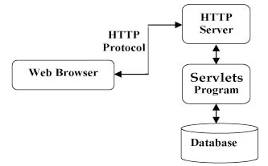
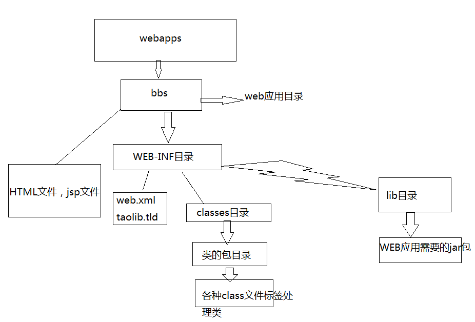
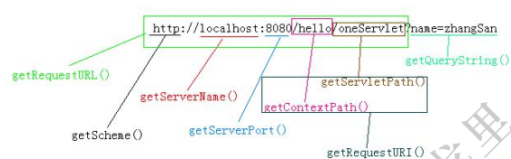
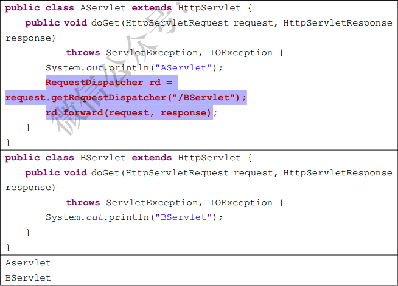

# Web服务器

Web服务器的作用是**接收客户端的请求，给客户端作出响应**。

对于JavaWeb程序而已，还需要有**Servlet容器**，Servlet容器的基本功能是**把动态资源转换成静态资源。**
我们需要使用的是**Web服务器和Servlet 容器**，通常这两者会集于一身。下面是对JavaWeb服务器：

- Tomcat（Apache)：是一款 Java Servlet 和 JavaServer Pages 技术的开源软件实现，可以作为测试 Servlet 的独立服务器，而且可以集成到 Apache Web 服务器。
- JBoss(Redhat红帽）：支持JavaEE，应用比较广；EJB容器
- GlassFish（Orcale):Oracle 开发JavaWeb服务器，应用不是很广；
- Resin（Caucho):支持JavaEE，应用越来越广；
- Weblogic（Oracle)：收费；支持JavaEE，适合大型项目；
- Websphere（IBM）：收费；支持JavaEE，适合大型项目；

# Servlet

## 定义

Servlet是运行在 Web 服务器或应用服务器上的程序(**遵循Servlet开发的java类**)，是JavaWeb的三大组件之一，它属于**动态资源**。Servlet的作用是**处理请求，服务器会把接收到的请求交给Servlet来处理**，在Servlet中通常需要：

- 读取客户端（浏览器）发送的显式的数据。这包括网页上的 HTML 表单，或者也可以是来自 applet 或自定义的 HTTP 客户端程序的表单。
- 读取客户端（浏览器）发送的隐式的 HTTP 请求数据。这包括 cookies、媒体类型和浏览器能理解的压缩格式等等。
- 处理数据并生成结果。这个过程可能需要访问数据库，执行 RMI 或 CORBA 调用，调用 Web 服务，或者直接计算得出对应的响应。
- 发送显式的数据（即文档）到客户端（浏览器）。该文档的格式可以是多种多样的，包括文本文件（HTML 或 XML）、二进制文件（GIF 图像）、Excel 等。
- 发送隐式的 HTTP 响应到客户端（浏览器）。这包括告诉浏览器或其他客户端被返回的文档类型（例如 HTML），设置 cookies 和缓存参数，以及其他类似的任务。

> 例如客户端发出登录请求，或者输出注册请求，这些请求都应该由Servlet来完成处理！
> Java Servlet 是运行在带有支持 Java Servlet 规范的解释器的 web 服务器上的 Java 类。Servlet 需要我们自己来编写，每个Servlet必须实现`javax.servlet.Servlet`接口。



## JAVAWEB目录结构




- bbs目录代表一个web应用
- bbs目录下的html,jsp文件可以直接被浏览器访问
- **WEB-INF目录下的资源是不能直接被浏览器访问的**
- web.xml文件是web程序的主要配置文件
- 所有的classes文件都放在classes目录下
- jar文件放在lib目录下

## 实现Servlet接口编写Servlet程序

- 创建一个自定义类MyServlet，**实现Serlvet接口**或者**继承HttpServlet类**
- 重写方法，有init【初始化】，destroy【销毁】,service【服务】,ServletConfig【Servlet配置】,getServletInfo【Serlvet信息】（通过ServletResponse对象输出信息）
- 配置xml文件，光写了Servlet是不行的，Tomcat还要知道浏览器怎么访问这个Servlet。

```xml
<servlet>
	<servlet-name>MyServlet</servlet-name>
	<servlet-class>com.web.MyServlet</servlet-class>
    <load-on-startup>1</load-on-startup>
</servlet>
<servlet-mapping>
	<servlet-name>MyServlet</servlet-name>
	<url-pattern>/myservlet</url-pattern>
</servlet-mapping>
```

- 浏览器访问：`http://localhost:8080/myservlet`

## Servlet生命周期

- **加载Servlet**。当Tomcat第一次访问Servlet的时候，**Tomcat会负责创建Servlet的实例**
- **初始化 **，init ()** 方法进行初始化（**只执行一次**）。
- **处理服务**，Servlet 调用 **service()** 方法来处理客户端的请求。
- **销毁**,Servlet 通过调用 **destroy()** 方法终止（**执行一次**）。
- 最后，Servlet 是由 JVM 的垃圾回收器进行垃圾回收的。

### init()

init 方法被设计成只调用一次。它在第一次创建 Servlet 时被调用，在后续每次用户请求时不再调用。

Servlet 创建于用户第一次调用对应于该 Servlet 的 URL 时，但是您也可以指定 Servlet 在服务器第一次启动时被加载。

> 如果服务器启动时就创建 Servlet， 那么还需要在 web.xml 文件中配置。 也就是说默认情况下， Servlet 是在第一次被访问时由服务器创建的  

当用户调用一个 Servlet 时，就会创建**一个 Servlet 实例**，**每一个用户请求都会产生一个新的线程**，适当的时候移交给 doGet 或 doPost 方法。init() 方法简单地创建或加载一些数据，这些数据将被用于 Servlet 的整个生命周期。

> **Servlet 是单例的**， 一个类只有一个对象； 当然可能存在多个 Servlet 类 ；**是多线程的**， 所以它的效率比较高（不是线程安全的）  
>
> Servlet 类由我们来写， 但对象由服务器来创建， 并且由服务器来调用相应的方法  

### service()

service() 方法是执行实际任务的主要方法。Servlet 容器（即 Web 服务器）调用 service() 方法来处理来自客户端（浏览器）的请求，并把格式化的响应写回给客户端。

**每次服务器接收到一个 Servlet 请求时，服务器会产生一个新的线程并调用服务。**service() 方法检查 HTTP 请求类型（GET、POST、PUT、DELETE 等），并在适当的时候调用 doGet、doPost、doPut，doDelete 等方法。

### destroy()

destroy() 方法只会被调用一次，在 Servlet 生命周期结束时被调用。destroy() 方法可以让您的 Servlet 关闭数据库连接、停止后台线程、把 Cookie 列表或点击计数器写入到磁盘，并执行其他类似的清理活动。

在调用 destroy() 方法之后，servlet 对象被标记为垃圾回收。

## Servlet接口相关

### ServletRequest 和ServletResponse
ServletRequest和ServletResponse是`Servlet.service()`方法的两个参数，一个是请求对
象，一个是响应对象，可以从ServletRequest 对象中获取请求数据，可以使用ServletResponse
对象完成响应。

ServletRequest和 ServletResponse的实例由服务器创建，然后传递给`service()`方法。如
果在`service()`方法中希望使用HTTP相关的功能，那么可以把ServletRequest和
ServletResponse 强转成HttpServletRequest和HttpServletResponse。

HttpServletRequest方法：

- string getParameter(String paramName):获取指定请求参数的值；
- String getMethod()：获取请求方法，例如GET或POST；
- string getHeader(String name):获取指定请求头的值；
- void setCharacterEncoding(String encoding):设置请求体的编码！
  因为GET请求没有请求体，所以这个方法只对post请求有效。当调用`request.setCharacterEncoding("utf-8")`之后，再通过`getParameter()`方法获取参数值时，那么参数值都已经通过了转码，即转换成了UTF-8编码。所以，这个方法必须在调用`getParameter()`方法之前调用！

### ServletConfig

Servlet 的配置信息， 即 web.xml 文件中的`<servlet>`元素。
一个 ServletConfig 对象对应着一个 servlet 元素的配置信息（servlet-name， servlet-class）  ,通过此对象可以读取web.xml中配置的初始化参数。

```xml
<servlet>
	<servlet-name>Demol</servlet-name>
	<servlet-class>com.web.Demo1</servlet-class>
    <load-on-startup>1</load-on-startup>
</servlet>
<servlet-mapping>
	<servlet-name>Demol</servlet-name>
	<url-pattern>/</url-pattern>
</servlet-mapping>

```

- getServletName 获取的是`<servlet-name>`的功能
- getServletContext 获取的是 Servlet 上下文对象  

ServletConfig 对象是由服务器创建的， 然后传递给 Servlet 的 init()方法， 你可以在 init()方法中使用它  

## Servlet 细节

- 不要在Servlet中创建成员！创建局部变量即可！
- 可以创建无状态成员！
- 可以创建有状态的成员，但状态必须为只读的1（只有get，没有 set)

### Servlet是单例的

**浏览器多次对Servlet的请求**，一般情况下，**服务器只创建一个Servlet对象(一个类一个对象，可以有多个Servlet类)**，也就是说，Servlet对象**一旦创建了**，就会**驻留在内存中，为后续的请求做服务，直到服务器关闭**。

对于**每次访问请求**，Servlet引擎都会**创建一个新的HttpServletRequest请求对象和一个新的HttpServletResponse响应对象**，然后将这两**个对象作为参数传递给它调用的Servlet的service()方法**，**service方法再根据请求方式分别调用doXXX方法**。

### 线程安全问题

当多个用户访问Servlet的时候，**服务器会为每个用户创建一个线程**。**当多个用户并发访问Servlet共享资源的时候就会出现线程安全问题**。

原则：

1. 如果一个**变量需要多个用户共享**，则应当在访问该变量的时候，**加同步机制synchronized (对象){}**
2. 如果一个变量**不需要共享**，则**直接在 doGet() 或者 doPost()定义**.这样不会存在线程安全问题

### `<url-pattern>`

`<url-pattern>`中可以使用通配符 "*",但是通配符要么为前缀，要么为后缀，不能在中间。

- `<url-pattern>*.do</url-pattern>`： /abc/def/ghi.do、 /a.do， 都匹配*.do；*
- `<url-pattern>/*<url-pattern>`： 匹配所有 URL；  
- 不能为：`<url-pattern>/*.do<url-pattern>`

### load-on-startup

如果在元素中配置了一个元素，那么**WEB应用程序在启动时**，就会**装载并创建Servlet的实例对象**、以及**调用Servlet实例对象的init()方法**。

作用：

1. 为web应用写一个InitServlet，这个**servlet配置为启动时装载**，为整个web应用**创建必要的数据库表和数据**
2. 完成一些定时的任务【定时写日志，定时备份数据】

### web.xml

在`${CATALINA_HOME}\conf\web.xml `中的内容， 相当于写到了每个项目的 web.xml 中，它是所有 web.xml 的父文件。

每个完整的 JavaWeb 应用中都需要有 web.xml， 所有的 web.xml 文件都有一个共同的父文件， 它在 Tomcat 的 `conf/web.xml `路径。  

## ServletContext

当Tomcat启动的时候，就会创建一个ServletContext对象。它**代表着当前web站点**，==**一个项目只有一个ServletContext对象**==！我们可以在**N多个Servlet中来获取这个唯一的对象**，使用它可以给多个Servlet传递数据！

**这个对象在Tomcat启动时就创建，在Tomcat关闭时才会死去！**

### ServletContext 概述

服务器会为**每个应用创建一个ServletContext对象**：

- ServletContext对象的创建是在**服务器启动时完成的**；
- ServletContext对象的销毁是在**服务器关闭时完成的**。

> ServletContext对象的作用是**==在整个Web应用的动态资源之间共享数据==**！例如在AServlet中向ServletContext对象中保存一个值，然后在BServlet中就可以获取这个值，这就是共享数据了。
>
> 1. ServletContext既然代表着当前web站点，那么**所有Servlet都共享着一个ServletContext对象**，所以**Servlet之间可以通过ServletContext实现通讯**。
> 2. ServletConfig获取的是配置的是单个Servlet的参数信息，**ServletContext可以获取的是配置整个web站点的参数信息**
> 3. **利用ServletContext读取web站点的资源文件**；如获取`/WEB-INF/classes/`路径下的文件
> 4. 实现Servlet的转发【用ServletContext转发不多，主要用request转发】

### 获取ServletContext

在Servlet中获取ServletContext对象：

- 在`void init(ServletConfig config)`中：`ServletContext context=config.getServletContext()；`,
  ServletConfig类的getServletContext（)方法可以用来获取ServletContext对象；

在GenericeServlet 或HttpServlet中获取ServletContext对象：

- GenericServlet类有` getServletContext()`方法，所以可以直接使用`this.getservletContext()`来获取；

### 域对象的功能

域对象是什么呢？其实域对象可以简单理解成**一个容器【类似于Map集合】**

ServletContext是JavaWeb四大域对象之一：

- PageContext；
- ServletRequest;
- HttpSession；
- ServletContext；

所有域对象都**有存取数据的功能**，因为域对象内部有一个`Map`，用来存储数据，下面是ServletContext对象用来操作数据的方法：

- `void setAttribute(String name,Object value)`:用来存储一个对象，也可以称之为存储一个域属性，例如：`servletContext.setAttribute(“xxx”,“XXX”)`，在ServletContext中保存了一个域属性，域属性名称为xxx，域属性的值为XXX。请注意，如果多次调用该方法，并且使用相同的name，那么会覆盖上一次的值，这一特性与Map相同；
- `object getAttribute(String name)`:用来获取ServletContext中的数据，当前在获取之前需要先去存储才行，例如：`String value=(String)servletContext.getAttribute("xxx");`，获取名为xxx的域属性；
- `void removeAttribute(String name)`:用来移除 ServletContext中的域属性，如果参数name指定的域属性不存在，那么本方法什么都不做；
- `Enumeration getAttributeNames()`:获取所有域属性的名称；

## 请求/响应

https://mp.weixin.qq.com/s?__biz=MzI4Njg5MDA5NA==&mid=2247484081&idx=2&sn=06d118f2976a1f2cf98e5fca47af252a&chksm=ebd743b0dca0caa6895f25f0eaaac66bec5f5f8141e1a869bfc8562f8c4e933ef8c1fe807dfd&scene=21###wechat_redirect

### Response

#### 概述

response是`Servlet#service`方法的一个参数，类型为`javax.servlet.http.HttpServletResponse`。在客户端发出每个请求时，服务器都会创建一个response对象，并传入给`Servlet.service()`方法。response对象是用来对客户端进行响应的，这说明在service()方法中使用response对象可以完成对客户端的响应工作。

response对象的功能分为以下四种：

- 设置响应头信息；
- 发送状态码；
- 设置响应正文；
- 重定向。

#### 响应正文

response 是响应对象， 向客户端输出响应正文（响应体） 可以使用 response 的响应流，repsonse 一共提供了两个响应流对象：

- `PrintWriter out = response.getWriter()`： 获取字符流；
- `ServletOutputStream out = response.getOutputStream()`： 获取字节流；

当然， 如果响应正文内容为字符（html）， 那么使用 response.getWriter()， 如果响应内容是字节（图片等）， 例如下载时， 那么可以使用 response.getOutputStream()(ServletOutputStream)。  

#### 设置响应头信息
响应头是键值对

可以使用response对象的`setHeader()`方法来设置响应头！使用该方法设置的响应头最终会发送给客户端浏览器！

- `response.setHeader("content-type","text/html;charset=utf-8")`:设置content-type响应头，该头的作用是告诉浏览器响应内容为html类型，编码为utf-8。而且同时会设置response的字符流编码为utf-8，即`response.setCharaceterEncoding(\"utf-8\")`；
- `response.setHeader("Refresh","5;URL=http://www.itcast.cn")`:5秒后自动跳转到传智主页。

#### 设置状态码及其他方法
- `response.setContentType（"text/html;charset=utf-8")`:等同\于调用`response.setHeader("content-type","text/html;charset=utf-8")`；
- response.setCharacterEncoding(\"utf-8\"):设置字符响应流的字符编码为utf-8；
- response.setStatus(200)：设置状态码；
- response.sendError(404,“您要查找的资源不存在”）：当发送错误状态码时，Tomcat会跳转到固定的错误页面去，但可以显示错误信息。
- response.sendError(状态码）

#### 重定向

重定向是服务器通知浏览器去访问另一个地址， 即再发出另一个请求。客户端发送了两个请求。

响应码为200表示响应成功，而响应码为302表示重定向。

所以完成重定向的**第一步就是设置响应码为302**。因为重定向是通知浏览器发出第二个请求，所以浏览器需要知道第二个请求的URL，所以完成重定向的**第二步是设置Location头，指定第二个请求的URL地址**。

````java
public class AServlet extends HttpServlet{
	public void doGet(HttpServletRequest request,HttpServletResponseresponse) throws ServletException,IOException{
		response.setStatus(302);
		response.setHeader(\"Location\",\"http://www.itcast.cn\");
    }
}
````

>  上面代码的作用是：当访问AServlet后，会通知浏览器重定向到传智主页。客户端浏览器解析到响应码为302后，就知道服务器让它重定向，所以它会马上获取响应头Location，然发出第二个请求。

#### 便捷的重定向方式 sendRedirect

````java
public class AServletfextends HttpServlet{
	public void doGet(HttpServletRequest request,HttpServletResponse response) throws ServletException,IOException{
		response.SendRedirect("http://www.itcast.cn");
	}
}
````

>  response.sendRedirect()方法会设置响应头为302，以设置Location响应头。

#### 重定向小结
- 重定向是两次请求；
- 重定向的URL可以是其他应用，不局限于当前应用；
- 重定向的响应头为302，并且必须要有Location响应头；
- 重定向就不要再使用`response.getWriter()`或`esponse.getOutputStream()`输出数据，不然可能会出现异常；

### Request

#### 1 概述
request 是` Servlet.service()`方法的一个参数， 类型为 `avax.servlet.http.HttpServletRequest`。
**在客户端发出每个请求时， 服务器都会创建一个 request 对象， 并把请求数据封装到 request中**， 然后在调用 Servlet.service()方法时传递给 service()方法， 这说明在 service()方法中可以通过 request 对象来获取请求数据  

request的功能可以分为以下几种：

- 封装了请求头数据；
- 封装了请求正文数据，如果是GET请求，那么就没有正文；
- request是一个域对象，可以把它当成Map来添加获取数据；
- request提供了请求转发和请求包含功能;

#### 2 域方法

**request 是域对象  。一个请求会创建一个 request 对象， 如果在一个请求中经历了多个 Servlet， 那么多个
Servlet 就可以使用 request 来共享数据**  

#### 3 获取请求头数据

- string getHeader(String name):获取指定名称的请求头；
- Enumeration getHeaderNames()：获取多值头；
- int getlntHeader(String name):获取值为int类型的请求头。
- long getDateHeader(String name):获取值为long类型的请求头

#### 4 获取请求相关的其它方法  



#### 5 获取请求参数
最为常见的客户端传递参数方式有两种：

- 浏览器地址栏直接输入：一定是GET请求；
- 超链接：定是GET请求；
- 表单：可以是GET，也可以是PosT，这取决与`<form>`的method属性值；

SET请求和POST请求的区别：

- GET请求：
  - 请求参数会在浏览器的地址栏中显示，所以不安全；
  - 请求参数长度限制长度在1K之内；
  - GET请求没有请求体，无法通过`request.setCharacterEncoding（）`来设置参数的编码；

- POST请求：
  - 请求参数不会显示浏览器的地址栏，相对安全；
  - 请求参数长度没有限制；

> 无论是GET|POST请求，都可以使用相同的APl来获取请求参数。请求参数有一个key一个value的，也有一个key多个value的。

- String getParameter(String name)： 通过指定名称获取参数值  
- String[] getParameterValues(String name)： 当多个参数名称相同时， 可以使用方法来获取；
- Enumeration getParameterNames()： 获取所有参数的名字；  
- Map getParameterMap()： 获取所有参数封装到 Map 中， 其中 key 为参数名， value为参数值， 因为一个参数名称可能有多个值， 所以参数值是 String[]， 而不是 String。

#### 6 请求转发和请求包含  

无论是请求转发还是请求包含， 都表示由多个 Servlet 共同来处理一个请求。  

在 AServlet 中， 把请求转发到 BServlet：参数是 Servlet 路径（servlet-mapping 中的 url-pattern）相当于/项目名  



>  如果转发了， 那么在原本请求的 Servlet 中设置的响应体是失效的。  

### 请求转发与响应重定向比较

- 请求转发是一个请求，而重定向是两个请求；
  - 请求转发后浏览器地址栏不会有变化，而重定向会有变化，因为重定向是两个请求；

- 请求转发的目标**只能是本应用中的资源（给出Servlet路径）**，重定向的目标**可以是其他应用（请求URI或者其他路径）**；
- 请求转发对AServlet和BServlet的请求方法是相同的，即要么都是GET，要么都是PosT，因为请求转发是一个请求；**重定向的第二个请求一定是GET；**
- 请求转发效率更高；当需要地址栏发生变化时，需要使用重定向；需要在下一个Servlet中获取之前Servlet设置的域，需要使用转发

#### 实际发生位置不同，地址栏不同

- 转发是发生在服务器的
  - **转发是由服务器进行跳转的**，在转发的时候，**浏览器的地址栏是没有发生变化的**。也就是说**浏览器是不知道该跳转的动作，转发是对浏览器透明的**。**实现转发只是一次的http请求**，**一次转发中request和response对象都是同一个**。这也解释了，为什么可以使用**request作为域对象进行Servlet之间的通讯。**
- 重定向是发生在浏览器的
  - **重定向是由浏览器进行跳转的**，进行重定向跳转的时候，**浏览器的地址会发生变化的**。实现重定向的原理是由response的状态码和Location头组合而实现的。**这是由浏览器进行的页面跳转**实现重定向**会发出两个http请求**，**request域对象是无效的，因为它不是同一个request对象**

#### 用法不同

转发和重定向的时候，**资源地址究竟怎么写**。有的时候要把应用名写上，有的时候不用把应用名写上。记住一个原则：**给服务器用的直接从资源名开始写，给浏览器用的要把应用名写上**

- request.getRequestDispatcher("/资源名 URI").forward(request,response)
- **转发时"/"代表的是本应用程序的根目录【zhongfucheng】**
- response.send("/web应用/资源名 URI");
- **重定向时"/"代表的是webapps目录**

#### 能够去往的URL的范围不一样

- **转发是服务器跳转只能去往当前web应用的资源**
- **重定向是浏览器跳转，可以去往任何的资源**

#### 传递数据的类型不同

- **转发的request对象可以传递各种类型的数据，包括对象**
- **重定向只能传递字符串**

#### 跳转的时间不同

- **转发时：执行到跳转语句时就会立刻跳转**
- **重定向：整个页面执行完之后才执行跳转**

------

### 转发和重定向使用哪一个？

根据上面说明了转发和重定向的区别也可以很容易概括出来**。转发是带着转发前的请求的参数的。重定向是新的请求**。

典型的应用场景：

1. 转发: 访问 Servlet 处理业务逻辑，然后 forward 到 jsp 显示处理结果，浏览器里 URL 不变
2. 重定向: 提交表单，处理成功后 redirect 到另一个 jsp，防止表单重复提交，浏览器里 URL 变了