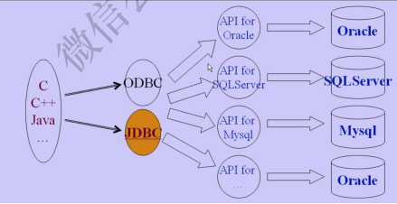

# JDBC 

JDBC 是 java 与数据库统一的接口 。

## JDBC编程步骤

1. Load the Drive：
   1. Class.forName()/class.forName().newlnstance()/new DriverName()
   2. 实例化时自动向DriverManager注册，不需显式调用DriverManager.registerDriver方法
2. Connect to the DataBase
   1. DriverManager.getConnection()
3. Execute the SQL
   1. Connection.CreateStatement()
   2. Statement.executeQuery()
   3. Statement.executeUpdate()
4. Retrieve the result data
   1. 循环取得结果 while(rs.next())
5. Show the result data
   1. 将数据库中的各种类型转换为Java中的类型（getxXX)方法
6. Close
   1.close the resultset./ close the statement/ close the connection

>java 并不知道使用的是哪种数据库， 而 java 有一个管理数据库的管家 DriverManager， 它来管理使用哪种数据库的连接。
>连接到某个数据库， 需要先向 DriverManager 注册。 然后通过 DriverManager 连接到数据库。  