# 01浏览器生成消息

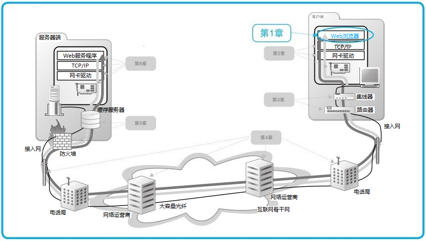

## 1.1 生成HTTP请求消息

### URL 网址

网址，准确来说应该叫URL（统一资源定位符）

> 浏览器是一个具备多种客户端功能的综合性客户端软件，因此它需要一些东西来判断应该使用其中哪种功能来访问相应的数据，而各种不同的URL就是用来干这个的，比如访问Web服务器时用“http:”，而访问FTP服务器时用“ftp:”。
>
> 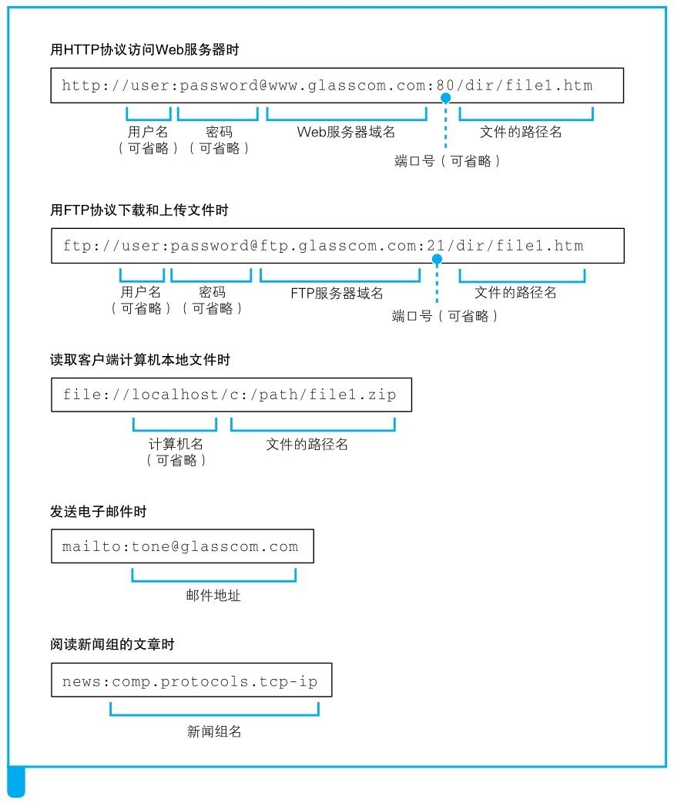

### 浏览器先要解析URL

当对URL进行解析时，首先需要按照格式将其中的各个元素拆分出来。然后，通过拆分出来的这些元素，我们就能够明白URL代表的含义

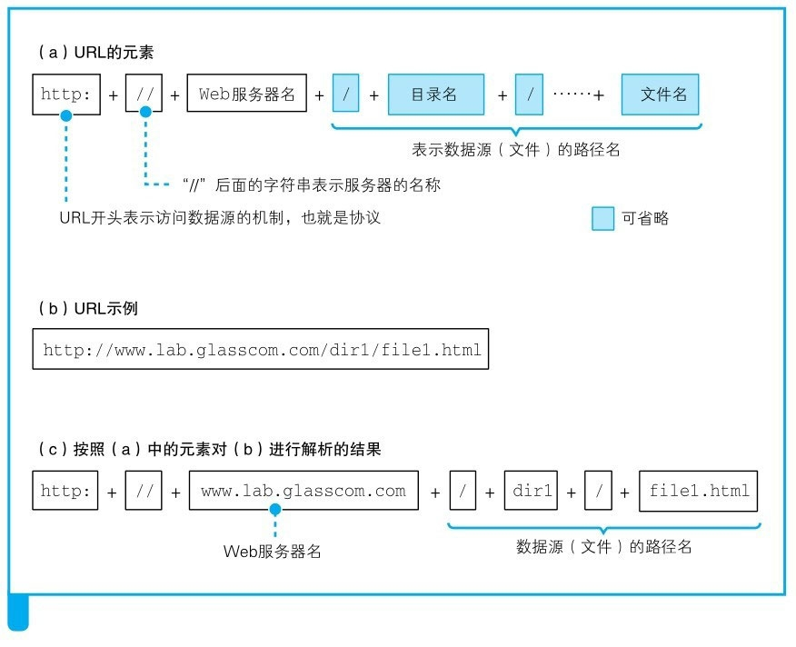

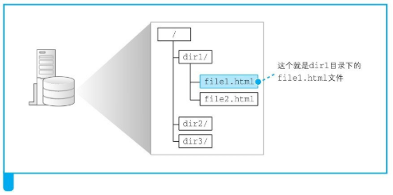

### 省略文件名的情况

有的URL以`/`结尾如：`http://www.wego.com/dir/`,`http://www.wego.com/`，可以认为以`/`结尾代表`/`后面本来应该有的文件名被省略了。因此会访问服务器设置的默认文件如`/index.html`

有的URL`/`都被省略如：`http://www.wego.com`，像这样连目录名都省略时，真不知道到底在请求哪个文件了。不过，这种写法也是允许的。当没有路径名时，就代表访问根目录下事先设置的默认文件，如主页

### HTTP的基本思路

解析完URL之后，我们就知道应该要访问的目标在哪里了。接下来，浏览器会使用HTTP协议来访问Web服务器

HTTP协议定义了客户端和服务器之间交互的消息内容和步骤，其基本思路非常简单：

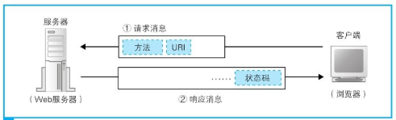

- 首先，客户端会向服务器发送请求消息。请求消息中包含的内容是“对什么”和“进行怎样的操作”两个部分。
  - 其中相当于“对什么”的部分称为`URI`。一般来说，URI的内容是一个存放网页数据的文件名或者是一个CGI程序的文件名，例如“/dir1/file1.html”“/dir1/program1.cgi”等。不过，URI不仅限于此，也可以直接使用“http:”开头的URL来作为URI。换句话说就是，这里可以写各种访问目标，而这些访问目标统称为URI。
  - 接下来“进行怎样的操作”的部分称为`方法`。方法表示需要让Web服务器完成怎样的工作，其中典型的例子包括读取URI表示的数据、将客户端输入的数据发送给URI表示的程序等。
- 收到请求消息之后，Web服务器会对其中的内容进行解析，通过URI和方法来判断“对什么”“进行怎样的操作”，并根据这些要求来完成自己的工作，然后将结果存放在响应消息中。响应消息会被发送回客户端，客户端收到之后，浏览器会从消息中读出所需的数据并显示在屏幕上。到这里，HTTP的整个工作就完成了。

> 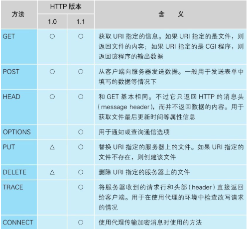

### 生成HTTP请求消息

对URL进行解析之后，浏览器确定了Web服务器和文件名，接下来就是根据这些信息来生成HTTP请求消息了。

HTTP消息在格式上是有严格规定的，因此浏览器会按照规定的格式来生成请求消息

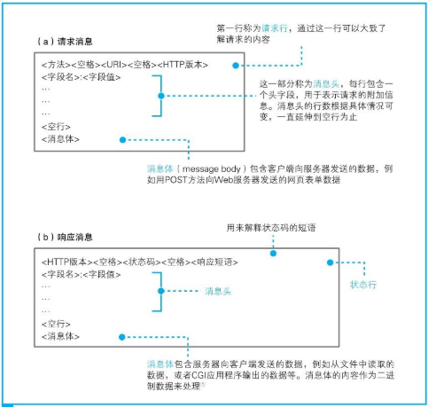

> 第一行是请求行：（1）方法如GET/POST表示使用哪种方法发送数据（2）URI已经包含在URL中了，直接提取（3）HTTP版本说明基于哪个版本的HTTP规格编写的
>
> 第二部分开始为消息头：一些额外的详细信息。消息头的规格中定义了很多项目，如日期、客户端支持的数据类型、语言、压缩格式、客户端和服务器的软件名称和版本、数据有效期和最后更新时间等
>
> 第三为空行
>
> 第四为消息体：

### 发送请求后会收到响应

响应消息的格式以及基本思路和请求消息是相同的，差别只在第一行上。在响应消息中，第一行的内容为**状态码和响应短语**，用来表示请求的执行结果是成功还是出错。状态码和响应短语表示的内容一致，但它们的用途不同。状态码是一个数字，它主要用来向程序告知执行的结果；相对地，响应短语则是一段文字，用来向人们告知执行的结果。

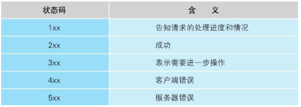

> **由于每条请求消息中只能写1个URI，所以每次只能获取1个文件，如果需要获取多个文件，必须对每个文件单独发送1条请求**。比如1个网页中包含3张图片，那么获取网页加上获取图片，一共需要向Web服务器发送4条请求。
>
> 判断所需的文件，然后获取这些文件并显示在屏幕上，这一系列工作的整体指挥也是浏览器的任务之一，而Web服务器却毫不知情。Web服务器完全不关心这4条请求获取的文件到底是1个网页上的还是不同网页上的，它的任务就是对每一条单独的请求返回1条响应而已。

## 1.2 向DNS服务器查询Web服务器的IP地址

### IP地址的基本知识

生成HTTP消息之后，接下来我们需要委托操作系统将消息发送给Web服务器。尽管浏览器能够解析网址并生成HTTP消息，但它本身并不具备将消息发送到网络中的功能，因此这一功能需要委托操作系统来实现

在委托操作系统发送消息时，必须要提供的不是通信对象的域名，而是它的IP地址。因此，在生成HTTP消息之后，下一个步骤就是根据域名查询IP地址。

TCP/IP的结构如图所示，就是由一些小的子网，通过路由器连接起来组成一个大的网络。这里的子网可以理解为用集线器连接起来的几台计算机，我们将它看作一个单位，称为子网。将子网通过路由器连接起来，就形成了一个网络。

> 在网络中，所有的设备都会被分配一个地址。这个地址就相当于现实中某条路上的“××号××室”。其中“号”对应的号码是分配给整个子网的，而“室”对应的号码是分配给子网中的计算机的，这就是网络中的地址。“号”对应的号码称为网络号，“室”对应的号码称为主机号，这个地址的整体称为IP地址。

实际的IP地址是一串**32比特的数字**，按照**8比特（1字节）为一组分成4组**，分别用十进制表示然后再用圆点隔开。在IP地址的规则中，**网络号和主机号**连起来总共是32比特，但这两部分的具体结构是不固定的。

在组建网络时，用户可以自行决定它们之间的分配关系，因此，我们还需要另外的附加信息来表示IP地址的内部结构。这一附加信息称为**子网掩码**。

IP地址标示方法：

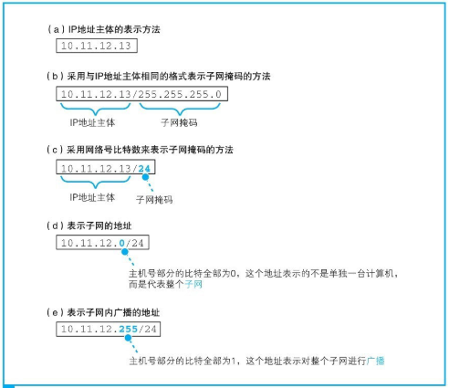

> 子网掩码的格式如图1.10②所示，是一串与IP地址长度相同的32比特数字，其左边一半都是1，右边一半都是0。其中，**子网掩码为1的部分表示网络号，子网掩码为0的部分表示主机号。**
>
> 将子网掩码按照和IP地址一样的方式以每8比特为单位用圆点分组后写在IP地址的右侧，这就是图1.9（b）的方法。这种写法太长，我们也可以把1的部分的比特数用十进制表示并写在IP地址的右侧，如图1.9（c）所示。这两种方式只是写法上的区别，含义是完全一样的。
>
> 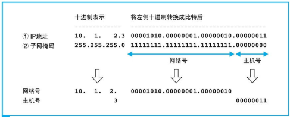
>
> 子网掩码表示网络号与主机号之间的边界。在本例中，这个边界与字节的边界是正好吻合的，也就是正好划分在句点的位置上，实际上也可以划分在字节的中间位置。

主机号部分的比特全部为0或者全部为1时代表两种特殊的含义。

- 主机号部分全部为0代表整个子网而不是子网中的某台设备
- 主机号部分全部为1代表向子网上所有设备发送包，即广播

### 域名和IP地址并用的理由

TCP/IP网络是通过IP地址来确定通信对象的，因此不知道IP地址就无法将消息发送给对方

让路由器使用IP地址可以节约资源，让人使用域名比较容易理解记忆。为了填补两者之间的障碍，需要有一个机制能够通过名称来查询IP地址，或者通过IP地址来查询名称，这样就能够在人和机器双方都不做出牺牲的前提下完美地解决问题。这个机制就是DNS（域名服务系统）

### Socket库提供查询IP地址的功能

向DNS服务器发出查询，也就是向DNS服务器发送查询消息，并接收服务器返回的响应消息。换句话说，对于DNS服务器，我们的计算机上一定有相应的**DNS客户端**，而相当于DNS客户端的部分称为**DNS解析器**，或者简称解析器。通过DNS查询IP地址的操作称为**域名解析**，因此负责执行解析（resolution）这一操作的就叫解析器（resolver）了。

解析器实际上是一段程序，它包含在操作系统的Socket库中。库就是一堆通用程序组件的集合，其他的应用程序都需要使用其中的组件。Socket库也是一种库，其中包含的程序组件可以让其他的应用程序调用操作系统的网络功能，而解析器就是这个库中的其中一种程序组件。

Socket库中的程序都是标准组件，只要从应用程序中进行调用就可以了。具体来说，在编写浏览器等应用程序的时候，只要像图1.11这样写上解析器的程序名称“gethostbyname”以及Web服务器的域名“www.lab.glasscom.com”就可以了，这样就完成了对解析器的调用

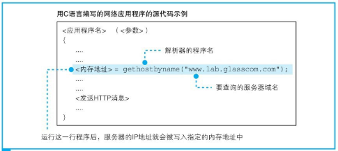

调用解析器后，解析器会向DNS服务器发送查询消息，然后DNS服务器会返回响应消息。响应消息中包含查询到的IP地址，解析器会取出IP地址，并将其写入浏览器指定的内存地址中。

接下来，浏览器在向Web服务器发送消息时，只要从该内存地址取出IP地址，并将它与HTTP请求消息一起交给操作系统就可以了。

-----

网络应用程序（在我们的场景中就是指浏览器）调用解析器时，程序的控制流程就会转移到解析器的内部。

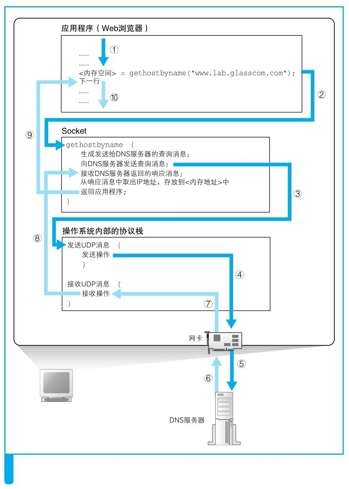

> 顺带一提，向DNS服务器发送消息时，我们当然也需要知道DNS服务器的IP地址。只不过这个IP地址是作为TCP/IP的一个设置项目事先设置好的，不需要再去查询了。如Windows中的IPv4设置

## 1.3 DNS服务器

### DNS服务器的基本工作

DNS服务器的基本工作就是接收来自客户端的查询消息，然后根据消息的内容返回响应。其中，来自客户端的查询消息包含以下3种信息。

- 域名
  - 服务器、邮件服务器（邮件地址中@后面的部分）的名称
-  Class
  - 在最早设计DNS方案时，DNS在互联网以外的其他网络中的应用也被考虑到了，而Class就是用来识别网络的信息。不过，如今除了互联网并没有其他的网络了，因此Class的值永远是代表互联网的IN
- 记录
  - 类型表示域名对应何种类型的记录。例如，当类型为A时，表示域名对应的是IP地址；当类型为MX时，表示域名对应的是邮件服务器。对于不同的记录类型，服务器向客户端返回的信息也会不同

DNS服务器上事先保存有前面这3种信息对应的记录数据。DNS服务器就是根据这些记录查找符合查询请求的内容并对客户端作出响应，返回IP地址的。

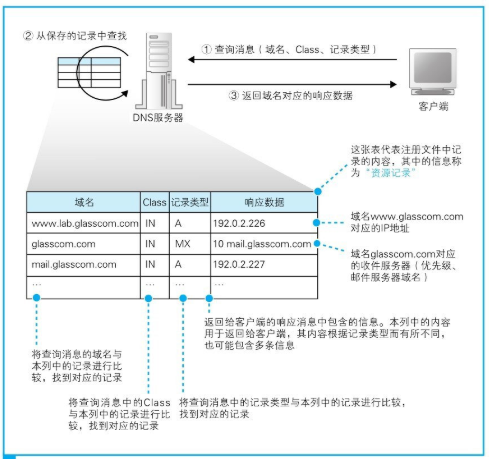

### 域名的层次结构

互联网中存在着不计其数的服务器，将这些服务器的信息全部保存在一台DNS服务器中是不可能的，就是将信息分布保存在多台DNS服务器中，这些DNS服务器相互接力配合，从而查找出要查询的信息。

首先，DNS服务器中的所有信息都是按照域名以分层次的结构来保存的。

DNS中的域名都是用句点来分隔的，比如www.lab.glasscom.com，这里的句点代表了不同层次之间的界限，就相当于公司里面的组织结构不用部、科之类的名称来划分，只是用句点来分隔而已。在域名中，越靠右的位置表示其层级越高。

这种具有层次结构的域名信息会注册到DNS服务器中，而每个域都是作为一个整体来处理的。换句话说就是，一个域的信息是作为一个整体存放在DNS服务器中的，不能将一个域拆开来存放在多台DNS服务器中，但是一台DNS服务器中也可以存放多个域的信息。

### 寻找相应的DNS服务器并获取IP地址

关键在于如何找到我们要访问的Web服务器的信息归哪一台DNS服务器管。

首先，将负责管理下级域的DNS服务器的IP地址注册到它们的上级DNS服务器中，然后上级DNS服务器的IP地址再注册到更上一级的DNS服务器中，以此类推。

在互联网中，com和jp的上面还有一级域，称为根域。根域不像com、jp那样有自己的名字，因此在一般书写域名时经常被省略，如果要明确表示根域，应该像www.lab.glasscom.com．这样在域名的最后再加上一个句点，而这个最后的句点就代表根域。

由于上级DNS服务器保管着所有下级DNS服务器的信息，所以我们可以从根域开始一路往下顺藤摸瓜找到任意一个域的DNS服务器。

除此之外还需要完成另一项工作，那就是将根域的DNS服务器信息保存在互联网中所有的DNS服务器中。这样一来，任何DNS服务器就都可以找到并访问根域DNS服务器了

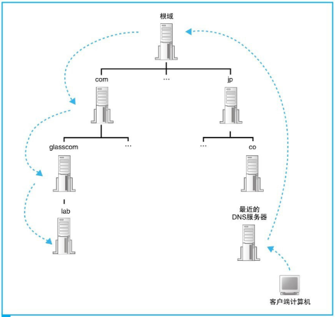

----

在真实的互联网中，一台DNS服务器可以管理多个域的信息，因此并不是每个域都有一台自己的DNS服务器

有时候并不需要从最上级的根域开始查找，因为DNS服务器有一个**缓存功能**

这个缓存机制中有一点需要注意，那就是信息被缓存后，原本的注册信息可能会发生改变，这时缓存中的信息就有可能是不正确的。因此，DNS服务器中保存的信息都设置有一个有效期，当缓存中的信息超过有效期后，数据就会从缓存中删除。

## 1.4 委托协议栈发送消息

知道了IP地址之后，就可以委托操作系统内部的协议栈向这个目标IP地址，也就是我们要访问的Web服务器发送消息了。要发送给Web服务器的HTTP消息是一种数字信息（digital data），因此也可以说是委托协议栈来发送数字信息。

**向操作系统内部的协议栈发出委托时，需要按照指定的顺序来调用Socket库中的程序组件。**

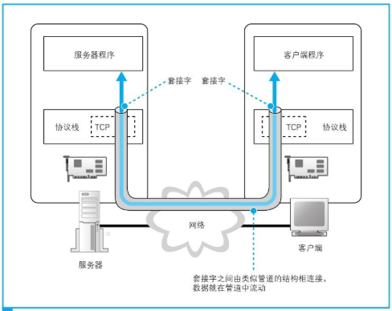

在进行收发数据操作之前，双方需要先建立起这条管道才行。建立管道的关键在于管道两端的数据出入口，这些出入口称为套接字。我们需要先创建套接字，然后再将套接字连接起来形成管道

综上所述，收发数据的操作分为若干个阶段，可以大致总结为以下4个。

1. 创建套接字（创建套接字阶段）
2. 将管道连接到服务器端的套接字上（连接阶段）
3. 收发数据（通信阶段）
4. 断开管道并删除套接字（断开阶段）

前面这4个操作都是由操作系统中的协议栈来执行的，浏览器等应用程序并不会自己去做连接管道、放入数据这些工作，而是委托协议栈来代劳

### 创建套接字阶段

首先是套接字创建阶段。客户端创建套接字的操作非常简单，只要调用Socket库中的socket程序组件。

套接字创建完成后，协议栈会返回一个描述符，应用程序会将收到的描述符存放在内存中。描述符是用来识别不同的套接字的

> 实际上计算机中会同时进行多个数据的通信操作，比如可以打开两个浏览器窗口，同时访问两台Web服务器。这时，有两个数据收发操作在同时进行，也就需要创建两个不同的套接字。即同一台计算机上可能同时存在多个套接字，在这样的情况下，我们就需要一种方法来识别出某个特定的套接字，这种方法就是描述符。

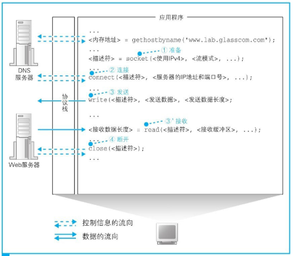

### 连接阶段：把管道接上去

接下来，我们需要委托协议栈将客户端创建的套接字与服务器那边的套接字连接起来。应用程序通过调用Socket库中的名为connect的程序组件来完成这一操作。这里的要点是当**调用connect时**，需要指定**描述符、服务器IP地址和端口号**这3个参数

1. 描述符，就是在创建套接字的时候由协议栈返回的那个描述符。connect会将应用程序指定的描述符告知协议栈，然后协议栈根据这个描述符来判断到底使用哪一个套接字去和服务器端的套接字进行连接，并执行连接的操作[插图]。
2. 服务器IP地址，就是通过DNS服务器查询得到的我们要访问的服务器的IP地址。在DNS服务器的部分已经讲过，在进行数据收发操作时，双方必须知道对方的IP地址并告知协议栈。这个参数就是那个IP地址了。
3. 端口号，这个需要稍微解释一下。IP地址是为了区分网络中的各个计算机而分配的数值。因此，只要知道了IP地址，我们就可以识别出网络上的某台计算机。但是，连接操作的对象是某个具体的套接字，因此必须要识别到具体的套接字才行，而端口号就是这样一种方式。**当同时指定IP地址和端口号时，就可以明确识别出某台具体的计算机上的某个具体的套接字**。

> 能不能用前面创建套接字时提到的那个描述符来识别套接字呢？”这种方法其实是行不通的，因为描述符是和委托创建套接字的应用程序进行交互时使用的，并不是用来告诉网络连接的另一方的，因此另一方并不知道这个描述符。同样地，客户端也无法知道服务器上的描述符。
>
> 如果说描述符是用来在一台计算机内部识别套接字的机制，那么端口号就是用来让通信的另一方能够识别出套接字的机制
>
> 服务器上所使用的端口号是根据应用的种类事先规定好的，仅此而已。比如Web是80号端口，电子邮件是25号端口。只要指定了事先规定好的端口号，就可以连接到相应的服务器程序的套接字。

总而言之，就是当调用connect时，协议栈就会执行连接操作。当连接成功后，协议栈会将对方的IP地址和端口号等信息保存在套接字中，这样我们就可以开始收发数据了。

**描述符：应用程序用来识别套接字的机制**

**IP地址和端口号：客户端和服务器之间用来识别对方套接字的机制**

### 通信阶段：传递消息

**只要将数据送入套接字，数据就会被发送到对方的套接字中**。当然，应用程序无法直接控制套接字，因此还是要**通过Socket库委托协议栈**来完成这个操作。这个操作需要使用write这个程序组件

首先，应用程序需要在内存中准备好要发送的数据。根据用户输入的网址生成的HTTP请求消息就是我们要发送的数据。接下来，当调用write时，需要指定描述符和发送数据，然后协议栈就会将数据发送到服务器。由于套接字中已经保存了已连接的通信对象的相关信息，所以只要通过描述符指定套接字，就可以识别出通信对象，并向其发送数据。接着，发送数据会通过网络到达我们要访问的服务器。

接下来，服务器执行接收操作，解析收到的数据内容并执行相应的操作，向客户端返回响应消息。接收消息的操作是通过Socket库中的read程序组件委托协议栈来完成的

### 断开阶段：收发数据结束

断开的过程如下。Web使用的HTTP协议规定，当Web服务器发送完响应消息之后，应该主动执行断开操作，因此Web服务器会首先调用close来断开连接。断开操作传达到客户端之后，客户端的套接字也会进入断开阶段。接下来，当浏览器调用read执行接收数据操作时，read会告知浏览器收发数据操作已结束，连接已经断开。浏览器得知后，也会调用close进入断开阶段。

这就是HTTP的工作过程。HTTP协议将HTML文档和图片都作为单独的对象来处理，每获取一次数据，就要执行一次连接、发送请求消息、接收响应消息、断开的过程。因此后来人们又设计出了能够在一次连接中收发多个请求和响应的方法。

