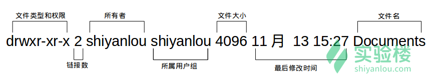
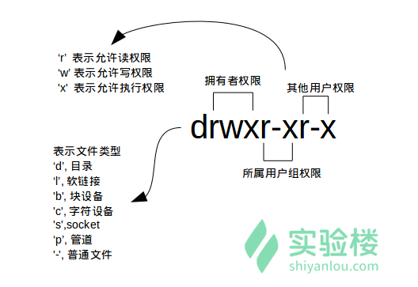
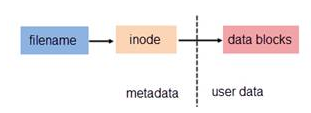
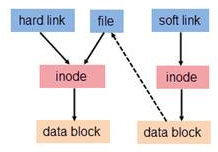
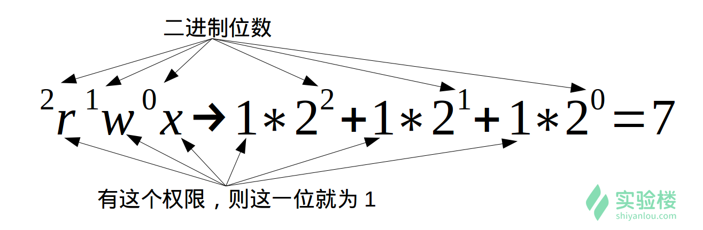
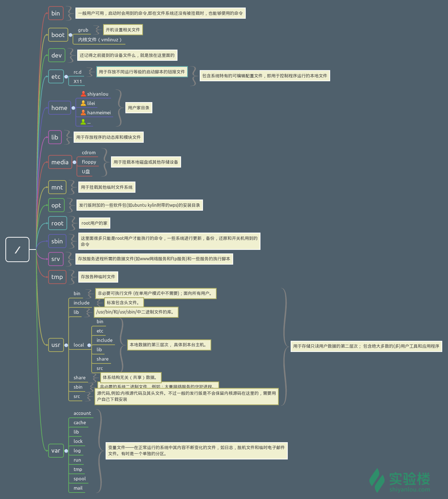
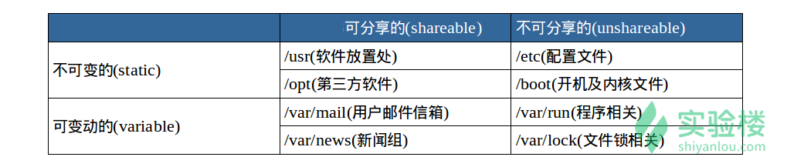
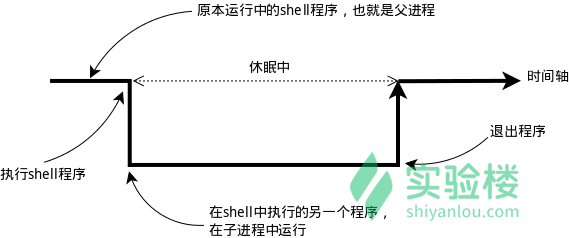
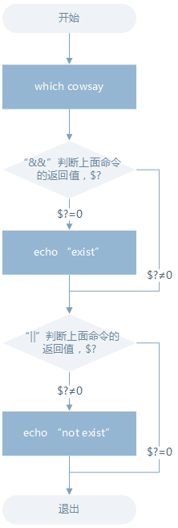
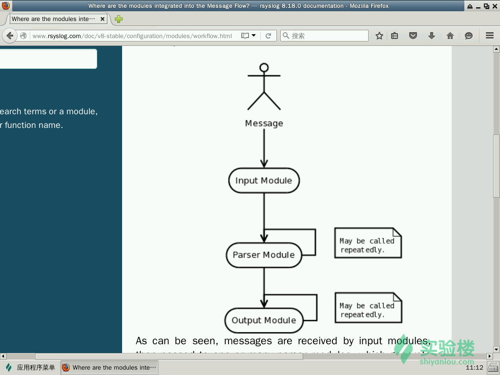

# 用户及文件权限管理

## 用户管理

### who 登录在本机的用户与来源

`who am i`查看当前伪终端的用户的用户名和伪终端

`whoami`查看当前登录用户的用户名

| 参数 | 说明                       |
| ---- | -------------------------- |
| `-a` | 打印能打印的全部           |
| `-d` | 打印死掉的进程             |
| `-m` | 同`am i`，`mom likes`      |
| `-q` | 打印当前登录用户数及用户名 |
| `-u` | 打印当前登录用户登录信息   |
| `-r` | 打印运行等级               |

### su，su- 与 sudo

`su ` 可以切换到用户 user，执行时需要输入目标用户的密码

`sudo ` 可以以特权级别运行 cmd 命令，需要当前用户属于 sudo 组，且需要输入当前用户的密码

`su - ` 命令也是切换用户，但是同时用户的环境变量和工作目录也会跟着改变成目标用户所对应的。

```java
sudo adduser lilei //增加一个用户lilei
su -l lilei //切换到用户lilei
exit //退出当前用户跟退出终端一样，可以使用 exit 命令或者使用快捷键 Ctrl+D。
```

### 用户组 groups

在 Linux 里面每个用户都有一个归属（用户组），用户组简单地理解就是一组用户的集合，它们共享一些资源和权限，同时拥有私有资源。当然一个用户是可以属于多个用户组的：`groups lilei`，结果中冒号之前表示用户，后面表示该用户所属的用户组。

每次新建用户如果不指定用户组的话，默认会自动创建一个与用户名相同的用户组。

默认情况下在 sudo 用户组里的可以使用 sudo 命令获得 root 权限

`$ cat /etc/group | grep -E "shiyanlou"`

> /etc/group 的内容包括用户组（Group）、用户组口令、GID（组 ID） 及该用户组所包含的用户

将其它用户加入 sudo 用户组:使用 `usermod` 命令可以为用户添加用户组，同样使用该命令你必需有 root 权限，你可以直接使用 root 用户为其它用户添加用户组，或者用其它已经在 sudo 用户组的用户使用 sudo 命令获取权限来执行该命令

` sudo usermod -G sudo lilei`:用 shiyanlou 用户执行 sudo 命令将 lilei 添加到 sudo 用户组

### 删除用户和用户组

删除用户：`$ sudo deluser lilei --remove-home`.使用 `--remove-home` 参数在删除用户时候会一并将该用户的工作目录一并删除。如果不使用那么系统会自动在 /home 目录为该用户保留工作目录。

删除用户组可以使用 `groupdel` 命令，倘若该群组中仍包括某些用户，则必须先删除这些用户后，才能删除群组。

## Linux 文件权限

### 查看文件权限

`ls -l`列出文件：





- 文件类型

牢记 **Linux 里面一切皆文件**，正因为这一点才有了设备文件（ `/dev` 目录下有各种设备文件，大都跟具体的硬件设备相关）这一说。 `socket`：网络套接字。`pipe` 管道。

`软链接文件`：链接文件是分为两种的，另一种当然是“硬链接”（硬链接不常用，是有着相同 inode 号仅文件名不同的文件；软链接与硬链接不同，若文件用户数据块中存放的内容是另一文件的路径名的指向，则该文件就是软连接。软链接就是一个普通文件，只是数据块内容有点特殊。软链接有着自己的 inode 号以及用户数据块）。[理解 Linux 的硬链接与软链接](https://www.ibm.com/developerworks/cn/linux/l-cn-hardandsymb-links/index.html#major2)



- 文件权限

读权限，表示你可以使用 `cat ` 之类的命令来读取某个文件的内容；写权限，表示你可以编辑和修改某个文件的内容； 执行权限，通常指可以运行的二进制程序文件或者脚本文件，不过 Linux 上不是通过文件后缀名来区分文件的类型。

**一个目录同时具有读权限和执行权限才可以打开并查看内部文件，而一个目录要有写权限才允许在其中创建其它文件**，这是因为目录文件实际保存着该目录里面的文件的列表等信息。

所有者权限，指自己；所属用户组权限，是指兄弟姐妹一家人。

- 链接数

> 链接到该文件所在的 inode 结点的文件名数目（关于这个概念涉及到 Linux 文件系统的相关概念知识，不在本课程的讨论范围，感兴趣的用户可以查看 [硬链接和软链接的联系与区别](https://www.ibm.com/developerworks/cn/linux/l-cn-hardandsymb-links/index.html#major2)）。

- 文件大小

> 以 inode 结点大小为单位来表示的文件大小，你可以给 ls 加上 `-lh` 参数来更直观的查看文件的大小。

`ls  [选项] [目录名]  `列出相关目录下的所有目录和文件 

```
-a  显示除了 .（当前目录）和 ..（上一级目录）之外的所有文件，包括隐藏文件
-A  同-a，但不列出"."和".."
-l  列出文件的详细信息
-c  根据ctime排序显示
-t  根据文件修改时间排序
---color[=WHEN] 用色彩辨别文件类型 WHEN 可以是'never'、'always'或'auto'其中之一
   白色：表示普通文件
   蓝色：表示目录
   绿色：表示可执行文件
   红色：表示压缩文件
   浅蓝色：链接文件
   红色闪烁：表示链接的文件有问题
   黄色：表示设备文件
   灰色：表示其它文件
```

### 变更文件拥有者

`sudo chown shiyanlou iphone11`:将iphone11改为shiyanlou用户拥有

### 修改文件权限

文件的权限有两种表示方式：

- 方式一：二进制数字表示



> 每个文件有三组固定的权限，分别对应拥有者，所属用户组，其他用户，**记住这个顺序是固定的**。文件的读写执行对应字母 `rwx`，以二进制表示就是 `111`，用十进制表示就是 `7`

`chmod 600 iphone11`：iphone11文件所属用户可读可写，其他人没有任何权限

- 方式二：加减赋值操作

`chmod go-rw iphone11`

`g`、`o` 还有 `u` 分别表示 group（用户组）、others（其他用户） 和 user（用户），`+` 和 `-` 分别表示增加和去掉相应的权限。


> `adduser` 和 `useradd` 的区别是什么?
>
> 答：`useradd` 只创建用户，不会创建用户密码和工作目录，创建完了需要使用 `passwd ` 去设置新用户的密码。`adduser` 在创建用户的同时，会创建工作目录和密码（提示你设置），做这一系列的操作。其实 `useradd`、`userdel` 这类操作更像是一种命令，执行完了就返回。而 `adduser` 更像是一种程序，需要你输入、确定等一系列操作

# 目录结构和文件基本操作

## 目录结构

 Linux 的目录与 Windows 的目录的区别：一种不同是体现在**目录与存储介质（磁盘，内存，DVD 等）的关系上**，以往的 Windows 一直是以存储介质为主的，主要以盘符（C 盘，D 盘...）及分区来实现文件管理，然后之下才是目录，目录就显得不是那么重要，除系统文件之外的用户文件放在任何地方任何目录也是没有多大关系。所以通常 Windows 在使用一段时间后，磁盘上面的文件目录会显得杂乱无章。然而 UNIX/Linux 恰好相反，UNIX 是以目录为主的，Linux 也继承了这一优良特性。 Linux 是以**树形目录结构的形式**来构建整个系统的，可以理解为树形目录是一个用户可操作系统的骨架。虽然本质上无论是目录结构还是操作系统内核都是存储在磁盘上的，但**从逻辑上来说 Linux 的磁盘是“挂在”（挂载在）目录上的，每一个目录不仅能使用本地磁盘分区的文件系统，也可以使用网络上的文件系统**。举例来说，可以利用网络文件系统（Network File System，NFS）服务器载入某特定目录等。

> **FHS（英文：Filesystem Hierarchy Standard 中文：文件系统层次结构标准）**，多数 Linux 版本采用这种文件组织形式（死结构），FHS 定义了系统中每个区域的用途、所需要的最小构成的文件和目录同时还给出了例外处理与矛盾处理。

FHS 定义了两层规范，第一层是， `/` 下面的各个目录应该要放什么文件数据，例如 `/etc` 应该放置设置文件，`/bin` 与 `/sbin` 则应该放置可执行文件等等。

第二层则是针对 `/usr` 及 `/var` 这两个目录的子目录来定义。例如 `/var/log` 放置系统日志文件，`/usr/share` 放置共享数据等等。





使用 `cd` 命令可以切换目录，在 Linux 里面使用 `.` 表示当前目录，`..` 表示上一级目录（**以 `.` 开头的文件都是隐藏文件，所以这两个目录必然也是隐藏的，你可以使用 `ls -a` 命令查看隐藏文件**）, `-` 表示上一次所在目录，`～` 通常表示当前用户的 `home` 目录。使用 `pwd` 命令可以获取当前所在路径（绝对路径）。

绝对路径：绝对路径，简单地说就是以根" / "目录为起点的完整路径，以你所要到的目录为终点，表现形式如： `/usr/local/bin`，表示根目录下的 `usr` 目录中的 `local` 目录中的 `bin` 目录。

相对路径：也就是相对于你当前的目录的路径，相对路径是以当前目录 `.` 为起点，以你所要到的目录为终点，表现形式如： `usr/local/bin` （假设你当前目录为根目录）。你可能注意到，我们表示相对路径实际并没有加上表示当前目录的那个 `.` ，而是直接以目录名开头，因为这个 `usr` 目录为 `/` 目录下的子目录，是可以省略这个 `.` 的；如果是当前目录的上一级目录，则需要使用 `..` ，比如你当前目录为 `/home/shiyanlou` 目录下，根目录就应该表示为 `../../` ，表示上一级目录（ `home` 目录）的上一级目录（ `/` 目录）。

## 文件操作

### 新建touch/mkdir

使用 `touch` 命令创建空白文件，关于 `touch` 命令，其主要作用是来更改已有文件的时间戳的（比如，最近访问时间，最近修改时间），但其在不加任何参数的情况下，只指定一个文件名，则可以创建一个指定文件名的空白文件（不会覆盖已有同名文件）

`touch [选项] 文件`创建空文件或更新文件时间 

````java
-a  只修改存取时间
-m  值修改变动时间
-r  eg:touch -r a b ,使b的时间和a相同
-t  指定特定的时间 eg:touch -t 201211142234.50 log.log 
   -t time [[CC]YY]MMDDhhmm[.SS],C:年前两位
````

使用 `mkdir`（make directories）命令可以创建一个空目录，也可同时指定创建目录的权限属性。

>若当前目录已经创建了一个 test **文件**，再使用 `mkdir test` 新建同名的**文件夹**，系统会报错文件已存在。这符合 Linux 一切介文件的理念。
>
>若当前目录存在一个 test 文件夹，则 `touch` 命令，则会更改该文件夹的时间戳而不是新建文件。

`mkdir [选项] 目录… `创建新目录

```
-p  递归创建目录，若父目录不存在则依次创建
-m  自定义创建目录的权限  eg:mkdir -m 777 hehe
-v  显示创建目录的详细信息
```

### 复制cp

使用 `cp` 命令（copy）复制一个文件到指定目录：`cp test father/son/grandson`

复制目录需要加上 `-r` 或者 `-R` 参数，表示递归复制:`cp -r father family`

### 删除rm

使用 `rm`（remove files or directories）命令删除一个文件：`rm test`；`rm -f test`强制删除

删除一个目录，也需要加上 `-r` 或 `-R` 参数：`rm -r family`

### 移动与重命名mv

使用 `mv`（move or rename files）命令移动文件（剪切）。命令格式是 `mv 源目录文件 目的目录`。

`mv` 命令除了能移动文件外，还能给文件重命名。命令格式为 `mv 旧的文件名 新的文件名

`rename`可以批量重命名，不过它要用 perl 正则表达式来作为参数：

```
# 使用通配符批量创建 5 个文件:
$ touch file{1..5}.txt

# 批量将这 5 个后缀为 .txt 的文本文件重命名为以 .c 为后缀的文件:
$ rename 's/\.txt/\.c/' *.txt
```

> `rename` 是先使用第二个参数的通配符匹配所有后缀为 `.txt` 的文件，然后使用第一个参数提供的正则表达式将匹配的这些文件的 `.txt` 后缀替换为 `.c`

### 使用 `cat`，`tac` 和 `nl` 命令查看文件

前两个命令都是用来打印文件内容到标准输出（终端），其中 `cat` 为正序显示，`tac` 为倒序显示。

> 标准输入输出：当我们执行一个 shell 命令行时通常会自动打开三个标准文件，即标准输入文件（stdin），默认对应终端的键盘、标准输出文件（stdout）和标准错误输出文件（stderr），后两个文件都对应被重定向到终端的屏幕，以便我们能直接看到输出内容。进程将从标准输入文件中得到输入数据，将正常输出数据输出到标准输出文件，而将错误信息送到标准错误文件中。

`cat pass.txt`;

`cat -n pass.txt`:显示内容带行号

> - -b : 指定添加行号的方式，主要有两种：    
>   - -b a:表示无论是否为空行，同样列出行号("cat -n"就是这种方式)    
>   - -b t:只列出非空行的编号并列出（默认为这种方式）
> -  -n : 设置行号的样式，主要有三种：  
>   - -n ln:在行号字段最左端显示    
>   - -n rn:在行号字段最右边显示，且不加 0    
>   - -n rz:在行号字段最右边显示，且加 0 
> - -w : 行号字段占用的位数(默认为 6 位)

### 使用 `more` 和 `less` 命令分页查看文件

如果说上面的 `cat` 是用来快速查看一个文件的内容的，那么这个 `more` 和 `less` 就是天生用来"阅读"一个文件的内容的，比如说 man 手册内部就是使用的 `less` 来显示内容。其中 `more` 命令比较简单，只能向一个方向滚动，而 `less` 为基于 `more` 和 `vi` 开发，功能更强大。`less` 的使用基本和 `more` 一致，具体使用请查看 man 手册，这里只介绍 `more` 命令的使用。

`more pass.txt`:打开后默认只显示一屏内容，终端底部显示当前阅读的进度。可以使用 `Enter` 键向下滚动一行，使用 `Space` 键向下滚动一屏，按下 `h` 显示帮助，`q` 退出。

### 使用 `head` 和 `tail` 命令查看文件

它们一个是只查看文件的头几行（默认为 10 行，不足 10 行则显示全部）和尾几行。

`head pass.txt` ：查看头10行；`head -n 11 pass.txt` ：查看头11行；

`tail pass.txt`：查看尾10行；`tail -n 11 pass.txt`：查看尾11行

> `tail` 命令，不得不提的还有它一个很牛的参数 `-f`，这个参数可以实现不停地读取某个文件的内容并显示。这可以让我们动态查看日志，达到实时监视的目的。

### file查看文件类型

`file /bin/ls`

## 环境变量

### 变量

变量是什么，准确的说应该是 Shell 变量，所谓变量就是计算机中用于记录一个值（不一定是数值，也可以是字符或字符串）的符号，而这些符号将用于不同的运算处理中。

通常变量与值是一对一的关系，可以通过表达式读取它的值并赋值给其它变量，也可以直接指定数值赋值给任意变量。为了便于运算和处理，大部分的编程语言会区分变量的类型，用于分别记录数值、字符或者字符串等等数据类型。Shell 中的变量也基本如此，有不同类型（但不用专门指定类型名），可以参与运算，有作用域限定。

> 变量的作用域即变量的有效范围（比如一个函数中、一个源文件中或者全局范围），在该范围内只能有一个同名变量。一旦离开则该变量无效，如同不存在这个变量一般。

在 Shell 中如何创建一个变量，如何给变量赋值和如何读取变量的值呢？

使用 `declare` 命令创建一个变量名为 tmp 的变量：`declare tmp`

> 其实也可以不用 declare 预声明一个变量，直接即用即创建，这里只是告诉你 declare 的作用，这在创建其它指定类型的变量（如数组）时会用到。

使用 `=` 号赋值运算符，将变量 tmp 赋值为 shiyanlou。注意，与其他语言不同的是， Shell 中的赋值操作，`=` **两边不可以输入空格**，否则会报错:`tmp=shiyanlou`

读取变量的值，使用 `echo` 命令和 `$` 符号（**$ 符号用于表示引用一个变量的值，初学者经常忘记输入**）：`echo $tmp`

**注意：并不是任何形式的变量名都是可用的，变量名只能是英文字母、数字或者下划线，且不能以数字作为开头。**

### 环境变量

环境变量的作用域比自定义变量的要大，如 Shell 的环境变量作用于自身和它的子进程。在所有的 UNIX 和类 UNIX 系统中，每个进程都有其各自的环境变量设置，且默认情况下，当一个进程被创建时，除了创建过程中明确指定的话，它将继承其父进程的绝大部分环境设置。Shell 程序也作为一个进程运行在操作系统之上，而我们在 Shell 中运行的大部分命令都将以 Shell 的子进程的方式运行。



通常我们会涉及到的变量类型有三种：

- 当前 Shell 进程私有用户自定义变量，如上面我们创建的 tmp 变量，只在当前 Shell 中有效。
- Shell 本身内建的变量。
- 从自定义变量导出的环境变量。

也有三个与上述三种环境变量相关的命令：`set`，`env`，`export`。这三个命令很相似，都是用于打印环境变量信息，区别在于涉及的变量范围不同

- set	显示当前 Shell 所有变量，包括其内建环境变量（与 Shell 外观等相关），用户自定义变量及导出的环境变量。
- env	显示与当前用户相关的环境变量，还可以让命令在指定环境中运行。
- export	显示从 Shell 中导出成环境变量的变量，也能通过它将自定义变量导出为环境变量。

> 关于哪些变量是环境变量，可以简单地理解成在当前进程的子进程有效则为环境变量，否则不是（有些人也将所有变量统称为环境变量，只是以全局环境变量和局部环境变量进行区分，我们只要理解它们的实质区别即可）

**注意：为了与普通变量区分，通常我们习惯将环境变量名设为大写。**

#### 永久生效

按变量的生存周期来划分，Linux 变量可分为两类：

1. 永久的：需要修改配置文件，变量永久生效；
2. 临时的：使用 `export `命令行声明即可，变量在关闭 shell 时失效。

这里介绍两个重要文件 `/etc/bashrc`（有的 Linux 没有这个文件） 和 `/etc/profile` ，它们分别存放的是 shell 变量和环境变量。

写在 `/etc/profile` 里面的是对所有用户永久生效，所以如果想要添加一个永久生效的环境变量，只需要打开 `/etc/profile`，在最后加上你想添加的环境变量就好

命令的查找路径与顺序

### 命令的查找与顺序

我们在 Shell 中输入一个命令，Shell 是怎么知道去哪找到这个命令然后执行的呢？这是通过环境变量 `PATH` 来进行搜索的，熟悉 Windows 的用户可能知道 Windows 中的也是有这么一个 PATH 环境变量。这个 `PATH` 里面就保存了 Shell 中执行的命令的搜索路径。

查看 `PATH` 环境变量的内容：`echo $PATH`:显示结果是一系列目录，通常这一类目录下放的都是可执行文件，当我们在 Shell 中执行一个命令时，系统就会按照 PATH 中设定的路径按照顺序依次到目录中去查找，如果存在同名的命令，则执行先找到的那个。

### 添加自定义路径到PATH环境变量

在前面我们应该注意到 `PATH` 里面的路径是以 `:` 作为分割符的，所以我们可以这样添加自定义路径：

```bash
$ PATH=$PATH:/home/shiyanlou/mybin
```

>  **注意这里一定要使用绝对路径。**现在你就可以在任意目录执行`/home/shiyanlou/mybin`下的可执行文件了。但是只是在当前 Shell 有效，一旦退出终端，就会失效。
>
> 有没有方法让添加的环境变量全局有效？

在每个用户的 home 目录中有一个 Shell 每次启动时会默认执行一个配置脚本，以初始化环境，包括添加一些用户自定义环境变量等等。如果环境使用的 Shell 是 zsh，它的配置文件是 `.zshrc`，相应的如果使用的 Shell 是 `Bash`，则配置文件为 `.bashrc`。它们在 `etc` 下还都有一个或多个全局的配置文件，不过我们一般只修改用户目录下的配置文件。Shell 的种类有很多，可以使用 `cat /etc/shells` 命令查看当前系统已安装的 Shell。

`$ echo "PATH=$PATH:/home/shiyanlou/mybin" >> .zshrc`:**`>>` 表示将标准输出以追加的方式重定向到一个文件中; `>` 是以覆盖的方式重定向到一个文件中，使用的时候一定要注意分辨。在指定文件不存在的情况下都会创建新的文件。**

### 修改和删除已有变量

变量的修改有以下几种方式：

- `${变量名#匹配字串}`	从头向后开始匹配，删除符合匹配字串的最短数据
- `${变量名##匹配字串}`	从头向后开始匹配，删除符合匹配字串的最长数据
- `${变量名%匹配字串}`	从尾向前开始匹配，删除符合匹配字串的最短数据
- `${变量名%%匹配字串}`	从尾向前开始匹配，删除符合匹配字串的最长数据
- `${变量名/旧的字串/新的字串}`	将符合旧字串的第一个字串替换为新的字串
- `${变量名//旧的字串/新的字串}`	将符合旧字串的全部字串替换为新的字串

可以使用 `unset` 命令删除一个环境变量：`$ mypath=$PATH` ,`$ unset mypath`

### 让环境变量立即生效

在 Shell 中修改了一个配置脚本文件之后（比如 zsh 的配置文件 home 目录下的 `.zshrc`），每次都要退出终端重新打开甚至重启主机之后其才能生效，很是麻烦，我们可以使用 `source` 命令来让其立即生效:`source .zshrc`。`source` 命令还有一个别名就是 `.`：`. ./.zshrc`

> 注意第一个点后面有一个空格，而且后面的文件必须指定完整的绝对或相对路径名，source 则不需要。

## 搜索文件

与搜索相关的命令常用的有 `whereis`，`which`，`find` 和 `locate`。

- **`locate`快而全**

`whereis` 只能搜索二进制文件(-b)，man 帮助文件(-m)和源代码文件(-s)。`whereis who`

- **`locate`快而全**

 `locate` 命令查找文件也不会遍历硬盘，它通过查询 `/var/lib/mlocate/mlocate.db` 数据库来检索信息。不过这个数据库也不是实时更新的，系统会使用定时任务每天自动执行 `updatedb` 命令来更新数据库。所以有时候你刚添加的文件，它可能会找不到，需要手动执行一次 `updatedb` 命令。注意这个命令也不是内置的命令，环境中就需要手动安装，然后执行更新。

它可以用来查找指定目录下的不同文件类型，如查找 /etc 下所有以 sh 开头的文件：`locate /etc/sh`.**注意，它不只是在 /etc 目录下查找，还会自动递归子目录进行查找。**

- **`which`小而精**

`which` 本身是 Shell 内建的一个命令，我们通常使用 `which` 来确定是否安装了某个指定的程序，因为它只从 `PATH` 环境变量指定的路径中去搜索命令并且返回第一个搜索到的结果。也就是说，我们可以看到某个系统命令是否存在以及执行的到底是哪一个地方的命令:`which man`;`which nginx`

- **`find`精而细**

`find` 应该是这几个命令中最强大的了，它不但可以通过文件类型、文件名进行查找而且可以根据文件的属性（如文件的时间戳，文件的权限等）进行搜索。

`sudo find /etc/ -name interfaces`这条命令表示去 /etc/ 目录下面 ，搜索名字叫做 interfaces 的文件或者目录。这是 find 命令最常见的格式，千万记住 find 的第一个参数是要搜索的地方

> **注意 find 命令的路径是作为第一个参数的， 基本命令格式为 `find [path][option] [action]`** 

## 文件的打包与解压

在 Windows 上最常见的不外乎这两种 `*.zip`，`*.7z` 后缀的压缩文件。而在 Linux 上面常见的格式除了以上两种外，还有 `.rar`，`*.gz`，`*.xz`，`*.bz2`，`*.tar`，`*.tar.gz`，`*.tar.xz`，`*.tar.bz2`

- *.zip	zip 程序打包压缩的文件
- *.rar	rar 程序压缩的文件
- *.7z	7zip 程序压缩的文件
- *.tar	tar 程序打包，未压缩的文件
- *.gz	gzip 程序（GNU zip）压缩的文件
- *.xz	xz 程序压缩的文件
- *.bz2	bzip2 程序压缩的文件
- *.tar.gz	tar 打包，gzip 程序压缩的文件
- *.tar.xz	tar 打包，xz 程序压缩的文件
- *tar.bz2	tar 打包，bzip2 程序压缩的文件
- *.tar.7z	tar 打包，7z 程序压缩的文件

### zip 压缩打包程序

`zip -r -q -o shiyanlou.zip /home/shiyanlou/Desktop`

上面命令将目录 /home/shiyanlou/Desktop 打包成一个文件，并查看了打包后文件的大小和类型。第一行命令中，`-r` 参数表示递归打包包含子目录的全部内容，`-q` 参数表示为安静模式，即不向屏幕输出信息，`-o`，表示输出文件，需在其后紧跟打包输出文件名。

`unzip shiyanlou.zip`：解压到当前目录

`unzip -q shiyanlou.zip -d ziptest`：使用安静模式，将文件解压到指定目录，目录不存在，将会自动创建。

### tar打包工具

tar 原本只是一个打包工具，只是同时还是实现了对 7z、gzip、xz、bzip2 等工具的支持，这些压缩工具本身只能实现对文件或目录（单独压缩目录中的文件）的压缩，没有实现对文件的打包压缩

`tar [主选项+辅选项] 文件或者目录`多个目录或档案打包、压缩成一个大档案

````
主选项：
   -c  建立打包档案，可搭配 
   -v  来察看过程中被打包的档名(filename)
   -t  察看打包档案的内容含有哪些档名，重点在察看『档名』就是了；
   -x  解打包或解压缩的功能，可以搭配 -C (大写) 在特定目录解开
辅选项：
   -j  透过 bzip2 的支持进行压缩/解压缩：此时档名最好为 *.tar.bz2
   -z  透过 gzip 的支持进行压缩/解压缩：此时档名最好为 *.tar.gz
   -v  在压缩/解压缩的过程中，将正在处理的文件名显示出来！
   -f filename -f 后面要立刻接要被处理的档名！
   -C 目录   这个选项用在解压缩，若要在特定目录解压缩，可以使用这个选项。
   --exclude FILE：在压缩打包过程中忽略某文件 eg: tar --exclude /home/zenghao -zcvf myfile.tar.gz /home/* /etc
   -p  保留备份数据的原本权限与属性，常用于备份(-c)重要的配置文件
   -P(大写）  保留绝对路径，亦即允许备份数据中含有根目录存在之意；
eg:
   压 缩：tar -jcvf filename.tar.bz2 要被压缩的档案或目录名称
   查 询：tar -jtvf filename.tar.bz2
   解压缩：tar -jxvf filename.tar.bz2 -C 欲解压缩的目录
````

 `tar -P -cf shiyanlou.tar /home/shiyanlou/Desktop`上面命令中，`-P` 保留绝对路径符，`-c` 表示创建一个 tar 包文件，`-f` 用于指定创建的文件名，注意文件名必须紧跟在 `-f` 参数之后，比如不能写成 `tar -fc shiyanlou.tar`，可以写成 `tar -f shiyanlou.tar -c ~`。你还可以加上 `-v` 参数以可视的的方式输出打包的文件

`tar -xf shiyanlou.tar -C tardir`解包一个文件（`-x` 参数）到指定路径的**已存在**目录（`-C` 参数）

`tar -czf shiyanlou.tar.gz /home/shiyanlou/Desktop`在创建 tar 文件的基础上添加 `-z` 参数，使用 `gzip` 来压缩文件

## 文件系统基本操作

使用 `df `命令查看磁盘的容量`df`,`df -h`

使用 `du` 命令查看目录的容量:`$ du -h -d 0 ~`# 只查看1级目录的信息  `$ du -h -d 1 ~`# 查看2级 

`du -h `#同--human-readable以K，M，G为单位，提高信息的可读性。 `du -a `同--all 显示目录中所有文件的大小。 `du -s `#同--summarize 仅显示总计，只列出最后加总的值。

## 磁盘管理

### dd 命令

`dd`命令用于转换和复制文件，不过它的复制不同于`cp`。之前提到过关于 Linux 的很重要的一点，**一切即文件**，在 Linux 上，硬件的设备驱动（如硬盘）和特殊设备文件（如`/dev/zero`和`/dev/random`）都像普通文件一样，只是在各自的驱动程序中实现了对应的功能，dd 也可以读取文件或写入这些文件。这样，`dd`也可以用在备份硬件的引导扇区、获取一定数量的随机数据或者空数据等任务中。`dd`程序也可以在复制时处理数据，例如转换字节序、或在 ASCII 与 EBCDIC 编码间互换。

`dd`的命令行语句与其他的 Linux 程序不同，因为它的命令行选项格式为`选项=值`，而不是更标准的`--选项 值`或`-选项=值`。`dd`默认从标准输入中读取，并写入到标准输出中，但可以用选项`if`（input file，输入文件）和`of`（output file，输出文件）改变。

```
# 输出到文件
$ dd of=test bs=10 count=1 # 或者 dd if=/dev/stdin of=test bs=10 count=1
# 输出到标准输出
$ dd if=/dev/stdin of=/dev/stdout bs=10 count=1
# 注:在打完了这个命令后，继续在终端打字，作为你的输入
```

> 上述命令从标准输入设备读入用户输入（缺省值，所以可省略）然后输出到 test 文件，`bs`（block size）用于指定块大小（缺省单位为 Byte，也可为其指定如'K'，'M'，'G'等单位），`count`用于指定块数量。如上图所示，我指定只读取总共 10 个字节的数据，当我输入了“hello shiyanlou”之后加上空格回车总共 16 个字节（一个英文字符占一个字节）内容，显然超过了设定大小。使用`du`和`cat`命令看到的写入完成文件实际内容确实只有 10 个字节,而其他的多余输入将被截取并保留在标准输入。

- 使用` dd `命令创建虚拟镜像文件

`dd if=/dev/zero of=virtual.img bs=1M count=256`：从`/dev/zero`设备创建一个容量为 256M 的空文件

- 使用 `mkfs `命令格式化磁盘

`sudo mkfs.ext4 virtual.img`：格式化为`ext4`文件系统。可以看到很多个以 `mkfs `为前缀的命令，这些不同的后缀其实就是表示着不同的文件系统，可以用 `mkfs `格式化成的文件系统

- 使用 ·`mount `命令挂载磁盘到目录树

用户在 Linux/UNIX 的机器上打开一个文件以前，包含该文件的文件系统必须先进行挂载的动作，此时用户要对该文件系统执行 mount 的指令以进行挂载。该指令通常是使用在 USB 或其他可移除存储设备上，而根目录则需要始终保持挂载的状态。又因为 Linux/UNIX 文件系统可以对应一个文件而不一定要是硬件设备，所以可以挂载一个包含文件系统的文件到目录树。

Linux/UNIX 命令行的 mount 指令是告诉操作系统，对应的文件系统已经准备好，可以使用了，而该文件系统会对应到一个特定的点（称为挂载点）。挂载好的文件、目录、设备以及特殊文件即可提供用户使用:`mount [options] [source] [directory]`;`mount [-o [操作选项]] [-t 文件系统类型] [-w|--rw|--ro] [文件系统源] [挂载点]`

```
$ mount -o loop -t ext4 virtual.img /mnt
# 也可以省略挂载类型，很多时候 mount 会自动识别
# 以只读方式挂载
$ mount -o loop --ro virtual.img /mnt
# 或者mount -o loop,ro virtual.img /mnt
```

- umount 命令卸载已挂载磁盘

## 内建命令和外部命令

> **内建命令**实际上是 shell 程序的一部分，其中包含的是一些比较简单的 Linux 系统命令，这些命令是写在 bash 源码的 builtins 里面的，由 shell 程序识别并在 shell 程序内部完成运行，通常在 Linux 系统加载运行时 shell 就被加载并驻留在系统内存中。而且解析内部命令 shell 不需要创建子进程，因此其执行速度比外部命令快。比如：history、cd、exit 等等。

> **外部命令**是 Linux 系统中的实用程序部分，因为实用程序的功能通常都比较强大，所以其包含的程序量也会很大，在系统加载时并不随系统一起被加载到内存中，而是在需要时才将其调入内存。虽然其不包含在 shell 中，但是其命令执行过程是由 shell 程序控制的。外部命令是在 Bash 之外额外安装的，通常放在 /bin， /usr/bin， /sbin， /usr/sbin  等等。比如：ls、vi 等。

简单来说就是：一个是天生自带的天赋技能，一个是后天得来的附加技能。我们可以使`type` 命令来区分命令是内建的还是外部的:`type ls`

## 帮助命令

`help` 命令只能用于显示内建命令的帮助信息：`help exit`

外部命令基本上都有一个参数--help,这样就可以得到相应的帮助:`ls --help`

 `man` 没有内建与外部命令的区分，因为 `man` 工具是显示系统手册页中的内容，也就是一本电子版的字典，这些内容大多数都是对命令的解释信息，还有一些相关的描述。通过查看系统文档中的 man 也可以得到程序的更多相关信息和 Linux 的更多特性:`man ls`

`info`展示信息更加详细

## 任务计划crontab

`crontab` 命令常见于 Unix 和类 Unix 的操作系统之中（Linux 就属于类 Unix 操作系统），用于设置周期性被执行的指令

crontab 命令从输入设备读取指令，并将其存放于 crontab 文件中，以供之后读取和执行。通常，crontab 储存的指令被守护进程激活，crond 为其守护进程，crond 常常在后台运行，每一分钟会检查一次是否有预定的作业需要执行。

通过 crontab 命令，我们可以在固定的间隔时间执行指定的系统指令或 shell 　 script 脚本。时间间隔的单位可以是分钟、小时、日、月、周的任意组合。

```
# crontab 的格式:
# Example of job definition:
# .---------------- minute (0 - 59)
# |  .------------- hour (0 - 23)
# |  |  .---------- day of month (1 - 31)
# |  |  |  .------- month (1 - 12) OR jan,feb,mar,apr ...
# |  |  |  |  .---- day of week (0 - 6) (Sunday=0 or 7) OR sun,mon,tue,wed,thu,fri,sat
# |  |  |  |  |
# *  *  *  *  * user-name command to be executed
```

**启动日志记录**：crontab 在环境中需要做一些特殊的准备，首先我们会启动 rsyslog，以便我们可以通过日志中的信息来了解我们的任务是否真正的被执行了;`sudo apt-get install -y rsyslog `;`sudo service rsyslog start`

**启动crontab**：crontab 也是不被默认启动的，同时不能在后台由 upstart 来管理，所以需要我们来启动它:`sudo cron －f &`

**添加任务**：添加一个计划任务:`crontab -e`

文件最后加入`*/1 * * * * touch /home/shiyanlou/$(date +\%Y\%m\%d\%H\%M\%S)`该任务是每分钟我们会在/home/shiyanlou 目录下创建一个以当前的年月日时分秒为名字的空白文件

> **注意** “ % ” 在 crontab 文件中，有结束命令行、换行、重定向的作用，前面加 ” \ ” 符号转义，否则，“ % ” 符号将执行其结束命令行或者换行的作用，并且其后的内容会被做为标准输入发送给前面的命令。

**查看任务列表**：`crontab -l`查看我们添加了哪些任务

**查看进程是否启动**：虽然我们添加了任务，但是如果 cron 的守护进程并没有启动，它根本都不会监测到有任务，当然也就不会帮我们执行，我们可以通过以下 2 种方式来确定我们的 cron 是否成功的在后台启动，默默的帮我们做事，若是没有就得执行上文准备中的第二步了:`ps aux | grep cron `or `pgrep cron`

**查看日志反馈**：通过这样一个命令可以查看到执行任务命令之后在日志中的信息反馈:`sudo tail -f /var/log/syslog`

**删除任务**：当我们并不需要这个任务的时候我们可以使用这么一个命令去删除任务:`crontab -r`


每个用户使用 `crontab -e` 添加计划任务，都会在 `/var/spool/cron/crontabs` 中添加一个该用户自己的任务文档，这样目的是为了隔离。

如果是系统级别的定时任务，应该如何处理？只需要以 sudo 权限编辑 `/etc/crontab` 文件就可以。

cron 服务监测时间最小单位是分钟，所以 cron 会每分钟去读取一次 /etc/crontab 与 /var/spool/cron/crontabs 里面的內容。

每个目录的作用：

1. /etc/cron.daily，目录下的脚本会每天执行一次，在每天的 6 点 25 分时运行；
2. /etc/cron.hourly，目录下的脚本会每个小时执行一次，在每小时的 17 分钟时运行；
3. /etc/cron.monthly，目录下的脚本会每月执行一次，在每月 1 号的 6 点 52 分时运行；
4. /etc/cron.weekly，目录下的脚本会每周执行一次，在每周第七天的 6 点 47 分时运行；

系统默认执行时间可以根据需求进行修改。

## 命令执行顺序的控制

简单的顺序执行你可以使用`;`来完成：`$ sudo apt-get update;sudo apt-get install some-tool `

`&&`就是用来实现选择性执行的，它表示如果前面的命令执行结果（不是表示终端输出的内容，而是表示命令执行状态的结果）返回 0 则执行后面的，否则不执行，你可以从`$?`环境变量获取上一次命令的返回结

`||`在这里就是与`&&`相反的控制效果，当上一条命令执行结果为 ≠0($?≠0)时则执行它后面的命令

`which cowsay>/dev/null && echo "exist" || echo "not exist"`




## 管道

管道是什么？管道是一种**通信机制**，通常用于进程间的通信（也可通过 socket 进行网络通信），它表现出来的形式就是**将前面每一个进程的输出(stdout)直接作为下一个进程的输入(stdin)**。

管道又分为**匿名管道和具名管道**。我们在使用一些过滤程序时经常会用到的就是匿名管道，在命令行中由`|`分隔符表示。具名管道简单的说就是有名字的管道，通常只会在源程序中用到具名管道。

`$ ls -al /etc | less`通过管道将前一个命令(`ls`)的输出作为下一个命令(`less`)的输入，然后就可以一行一行地看

### cut 命令，打印每一行的某一字段

`$ cut /etc/passwd -d ':' -f 1,6`打印`/etc/passwd`文件中以`:`为分隔符的第 1 个字段和第 6 个字段分别表示用户名和其家目录


```
# 打印`/etc/passwd`文件中每一行的前 N 个字符
# 前五个（包含第五个）
$ cut /etc/passwd -c -5
# 前五个之后的（包含第五个）
$ cut /etc/passwd -c 5-
# 第五个
$ cut /etc/passwd -c 5
# 2到5之间的（包含第五个）
$ cut /etc/passwd -c 2-5
```

### grep 命令，在文本中或 stdin 中查找匹配字符串

`grep [命令选项]... 用于匹配的表达式 [文件]...`

`$ grep -rnI "shiyanlou" .`#查看当前目录下所有包含"shiyanlou"的文本文件，并显示出现在文本中的行号

`$ export | grep ".*yanlou$"`\# 查看环境变量中以"yanlou"结尾的字符串 

### wc 命令，简单小巧的计数工具

wc 命令用于统计并输出一个文件中行、单词和字节的数目:`$ wc /etc/passwd`

```
# 行数
$ wc -l /etc/passwd
# 单词数
$ wc -w /etc/passwd
# 字节数
$ wc -c /etc/passwd
# 字符数
$ wc -m /etc/passwd
# 最长行字节数
$ wc -L /etc/passwd
```

> **注意：对于西文字符来说，一个字符就是一个字节，但对于中文字符一个汉字是大于 2 个字节的，具体数目是由字符编码决定的**

`$ ls -dl /etc/*/ | wc -l`

### sort 排序命令

将输入按照一定方式排序，然后再输出,它支持的排序有按字典排序,数字排序，按月份排序，随机排序，反转排序，指定特定字段进行排序等等。默认为字典排序

`$ cat /etc/passwd | sort -r`反转排序

`$ cat /etc/passwd | sort -t':' -k 3`上面的`-t`参数用于指定字段的分隔符，这里是以":"作为分隔符；`-k 字段号`用于指定对哪一个字段进行排序。

### uniq 去重命令

`uniq`命令可以用于过滤或者输出重复行

## 文本处理

### tr

tr 命令可以用来删除一段文本信息中的某些文字。或者将其进行转换：`tr [option]...SET1 [SET2]`

- -d	删除和 set1 匹配的字符，注意不是全词匹配也不是按字符顺序匹配
- -s	去除 set1 指定的在输入文本中连续并重复的字符

```
# 删除 "hello shiyanlou" 中所有的'o','l','h'
$ echo 'hello shiyanlou' | tr -d 'olh'
# 将"hello" 中的ll,去重为一个l
$ echo 'hello' | tr -s 'l'
# 将输入文本，全部转换为大写或小写输出
$ echo 'input some text here' | tr '[:lower:]' '[:upper:]'
# 上面的'[:lower:]' '[:upper:]'你也可以简单的写作'[a-z]' '[A-Z]',当然反过来将大写变小写也是可以的
```

### col

col 命令可以将`Tab`换成对等数量的空格键，或反转这个操作

- -x	将Tab转换为空格
- -h	将空格转换为Tab（默认选项）

```
# 查看 /etc/protocols 中的不可见字符，可以看到很多 ^I ，这其实就是 Tab 转义成可见字符的符号
$ cat -A /etc/protocols
# 使用 col -x 将 /etc/protocols 中的 Tab 转换为空格,然后再使用 cat 查看，你发现 ^I 不见了
$ cat /etc/protocols | col -x | cat -A
```

### join 命令

将两个文件中包含相同内容的那一行合并在一起`join [option]... file1 file2`

- -t	指定分隔符，默认为空格
- -i	忽略大小写的差异
- -1	指明第一个文件要用哪个字段来对比，默认对比第一个字段
- -2	指明第二个文件要用哪个字段来对比，默认对比第一个字段

```
$ cd /home/shiyanlou
# 创建两个文件
$ echo '1 hello' > file1
$ echo '1 shiyanlou' > file2
$ join file1 file2
# 将/etc/passwd与/etc/shadow两个文件合并，指定以':'作为分隔符
$ sudo join -t':' /etc/passwd /etc/shadow
# 将/etc/passwd与/etc/group两个文件合并，指定以':'作为分隔符, 分别比对第4和第3个字段
$ sudo join -t':' -1 4 /etc/passwd -2 3 /etc/group
```

### paste 命令

`paste`这个命令与`join` 命令类似，它是在不对比数据的情况下，简单地将多个文件合并一起，以`Tab`隔开。`paste [option] file...`

- -d	指定合并的分隔符，默认为 Tab
- -s	不合并到一行，每个文件为一行

```
$ echo hello > file1
$ echo shiyanlou > file2
$ echo www.shiyanlou.com > file3
$ paste -d ':' file1 file2 file3
$ paste -s file1 file2 file3
```

## 数据流重定向

Linux 默认提供了三个特殊设备，用于终端的显示和输出，分别为`stdin`（标准输入,对应于你在终端的输入），`stdout`（标准输出，对应于终端的输出），`stderr`（标准错误输出，对应于终端的输出）

| 文件描述符 | 设备文件      | 说明     |
| ---------- | ------------- | -------- |
| `0`        | `/dev/stdin`  | 标准输入 |
| `1`        | `/dev/stdout` | 标准输出 |
| `2`        | `/dev/stderr` | 标准错误 |

> 文件描述符：文件描述符在形式上是一个非负整数。实际上，它是一个索引值，指向内核为每一个进程所维护的该进程打开文件的记录表。当程序打开一个现有文件或者创建一个新文件时，内核向进程返回一个文件描述符。在程序设计中，一些涉及底层的程序编写往往会围绕着文件描述符展开。但是文件描述符这一概念往往只适用于 UNIX、Linux 这样的操作系统。

> **管道默认是连接前一个命令的输出到下一个命令的输入**，而**重定向通常是需要一个文件来建立两个命令的连接**

默认使用终端的标准输入作为命令的输入和标准输出作为命令的输出:`cat`按Ctrl+C退出

```
# 使用cat 命令同时读取两个文件，其中一个存在，另一个不存在
$ cat Documents/test.c hello.c
# 你可以看到除了正确输出了前一个文件的内容，还在末尾出现了一条错误信息
# 下面我们将输出重定向到一个文件
$ cat Documents/test.c hello.c > somefile
```


## 软件安装

`$ sudo apt-get install w3m`

> **注意**:如果你在安装一个软件之后，无法立即使用`Tab`键补全这个命令，你可以尝试先执行`source ~/.zshrc`，然后你就可以使用补全操作。

### apt 包管理工具介绍

> APT 是 Advance Packaging Tool（高级包装工具）的缩写，是 Debian 及其派生发行版的软件包管理器，APT 可以自动下载，配置，安装二进制或者源代码格式的软件包，因此简化了 Unix 系统上管理软件的过程。APT 最早被设计成 dpkg 的前端，用来处理 deb 格式的软件包。现在经过 APT-RPM 组织修改，APT 已经可以安装在支持 RPM 的系统管理 RPM 包。这个包管理器包含以 `apt-` 开头的多个工具，如 `apt-get` `apt-cache` `apt-cdrom` 等，在 Debian 系列的发行版中使用。

当你在执行安装操作时，首先`apt-get` 工具会在**本地**的一个数据库中搜索关于 `w3m` 软件的相关信息，并根据这些信息在相关的服务器上下载软件安装，这里大家可能会一个疑问：既然是在线安装软件，为啥会在本地的数据库中搜索？要解释这个问题就得提到几个名词了：

- **软件源镜像服务器**
- **软件源**

我们需要定期从服务器上下载一个软件包列表，使用 `sudo apt-get update` 命令来保持本地的软件包列表是最新的（有时你也需要手动执行这个操作，比如更换了软件源），而这个表里会有**软件依赖**信息的记录，对于软件依赖，我举个例子：我们安装 `w3m` 软件的时候，而这个软件需要 `libgc1c2` 这个软件包才能正常工作，这个时候 `apt-get` 在安装软件的时候会一并替我们安装了，以保证 `w3m` 能正常的工作。

### apt-get

`apt-get` 是用于处理 apt包的公用程序集，我们可以用它来在线安装、卸载和升级软件包等，下面列出一些apt-get包含的常用的一些工具：

- install	其后加上软件包名，用于安装一个软件包
- update	从软件源镜像服务器上下载/更新用于更新本地软件源的软件包列表
- upgrade	升级本地可更新的全部软件包，但存在依赖问题时将不会升级，通常会在更新之前执行一次update
- dist-upgrade	解决依赖关系并升级(存在一定危险性)
- remove	移除已安装的软件包，包括与被移除软件包有依赖关系的软件包，但不包含软件包的配置文件
- autoremove	移除之前被其他软件包依赖，但现在不再被使用的软件包
- purge	与 remove 相同，但会完全移除软件包，包含其配置文件
- clean	移除下载到本地的已经安装的软件包，默认保存在/var/cache/apt/archives/
- autoclean	移除已安装的软件的旧版本软件包

下面是一些apt-get常用的参数：

- -y	自动回应是否安装软件包的选项，在一些自动化安装脚本中使用这个参数将十分有用
- -s	模拟安装
- -q	静默安装方式，指定多个q或者-q=#,#表示数字，用于设定静默级别，这在你不想要在安装软件包时屏幕输出过多时很有用
- -f	修复损坏的依赖关系
- -d	只下载不安装
- --reinstall	**重新安装已经安装但可能存在问题的软件包**
- --install-suggests	同时安装 APT 给出的建议安装的软件包


`$ sudo apt-get --reinstall install w3m`重新安装

```
# 软件升级
# 更新软件源
$ sudo apt-get update
# 升级没有依赖问题的软件包
$ sudo apt-get upgrade
# 升级并解决依赖关系
$ sudo apt-get dist-upgrade
```

`sudo apt-get remove w3m`卸载软件

`sudo apt-cache search softname1 softname2 softname3……`当自己刚知道了一个软件，想下载使用，需要确认软件仓库里面有没有，就需要用到搜索功能了

### 使用 dpkg

### 从二进制包安装

二进制包的安装比较简单，我们需要做的只是将从网络上下载的二进制包解压后放到合适的目录，然后将包含可执行的主程序文件的目录添加进`PATH`环境变量即可

## Linux 进程

首先程序与进程是什么？程序与进程又有什么区别？

> **程序**（procedure）：不太精确地说，程序就是执行一系列有逻辑、有顺序结构的指令，帮我们达成某个结果。就如我们去餐馆，给服务员说我要牛肉盖浇饭，她执行了做牛肉盖浇饭这么一个程序，最后我们得到了这么一盘牛肉盖浇饭。它需要去执行，不然它就像一本武功秘籍，放在那里等人翻看。

> **进程**（process）：**进程是程序在一个数据集合上的一次执行过程**，在早期的 UNIX、Linux 2.4 及更早的版本中，它是系统进行资源分配和调度的独立基本单位。

简单来说，程序是为了完成某种任务而设计的软件，比如 vim 是程序。什么是进程呢？进程就是运行中的程序。

程序只是一些列指令的集合，是一个静止的实体，而进程不同，进程有以下的特性：

- 动态性：进程的实质是一次程序执行的过程，有创建、撤销等状态的变化。而程序是一个静态的实体。
- 并发性：进程可以做到在一个时间段内，有多个程序在运行中。程序只是静态的实体，所以不存在并发性。
- 独立性：进程可以独立分配资源，独立接受调度，独立地运行。
- 异步性：进程以不可预知的速度向前推进。
- 结构性：进程拥有代码段、数据段、PCB（进程控制块，进程存在的唯一标志）。也正是因为有结构性，进程才可以做到独立地运行。

> **并发：**在一个时间段内，宏观来看有多个程序都在活动，有条不紊的执行（**每一瞬间只有一个在执行，只是在一段时间有多个程序都执行过**）

> **并行：**在每一个瞬间，都有多个程序都在同时执行，这个**必须有多个 CPU 才行**

引入进程是因为传统意义上的程序已经不足以描述 OS 中各种活动之间的动态性、并发性、独立性还有相互制约性。程序就像一个公司，只是一些证书，文件的堆积（静态实体）。而当公司运作起来就有各个部门的区分，财务部，技术部，销售部等等，就像各个进程，各个部门之间可以独立运做，也可以有交互（独立性、并发性）。

而随着程序的发展越做越大，又会继续细分，从而引入了线程的概念，当代多数操作系统、Linux 2.6 及更新的版本中，**进程本身不是基本运行单位，而是线程的容器**。就像上述所说的，每个部门又会细分为各个工作小组（线程），而工作小组需要的资源需要向上级（进程）申请。

> **线程**（thread）是**操作系统能够进行运算调度的最小单位**。它被包含在进程之中，是进程中的实际运作单位。一条线程指的是进程中一个单一顺序的控制流，一个进程中可以并发多个线程，每条线程并行执行不同的任务。因为线程中几乎不包含系统资源，所以执行更快、更有效率。

简而言之,一个程序至少有一个进程,一个进程至少有一个线程。线程的划分尺度小于进程，使得多线程程序的并发性高。另外，进程在执行过程中拥有独立的内存单元，而多个线程共享内存，从而极大地提高了程序的运行效率。

### 进程的分类

大概明白进程是个什么样的存在后，我们需要进一步了解的就是进程分类。可以从两个角度来分：

- 以进程的功能与服务的对象来分；
- 以应用程序的服务类型来分；

第一个角度来看，我们可以分为**用户进程与系统进程**：

- 用户进程：通过执行用户程序、应用程序或称之为内核之外的系统程序而产生的进程，此类进程可以在用户的控制下运行或关闭。
- 系统进程：通过执行系统内核程序而产生的进程，比如可以执行内存资源分配和进程切换等相对底层的工作；而且该进程的运行不受用户的干预，即使是 root 用户也不能干预系统进程的运行。

第二角度来看，我们可以将进程分为**交互进程、批处理进程、守护进程**

- 交互进程：由一个 shell 终端启动的进程，在执行过程中，需要与用户进行交互操作，可以运行于前台，也可以运行在后台。
- 批处理进程：该进程是一个进程集合，负责按顺序启动其他的进程。
- 守护进程：守护进程是一直运行的一种进程，在 Linux 系统启动时启动，在系统关闭时终止。它们独立于控制终端并且周期性的执行某种任务或等待处理某些发生的事件。例如 httpd 进程，一直处于运行状态，等待用户的访问。还有经常用的 cron（在 centOS 系列为 crond）进程，这个进程为 crontab 的守护进程，可以周期性的执行用户设定的某些任务。

### 进程的衍生

进程有这么多的种类，那么进程之间定是有相关性的，而这些有关联性的进程又是如何产生的，如何衍生的？

就比如我们启动了终端，就是启动了一个 bash 进程，我们可以在 bash 中再输入 bash 则会再启动一个 bash 的进程，此时第二个 bash 进程就是由第一个 bash 进程创建出来的，他们之间又是个什么关系？

我们一般称呼**第一个 bash 进程是第二 bash 进程的父进程，第二 bash 进程是第一个 bash 进程的子进程**，这层关系是如何得来的呢？

关于父进程与子进程便会提及这两个系统调用 `fork()` 与 `exec()`

> **fork-exec**是由 Dennis M. Ritchie 创造的

> **fork()** 是一个系统调用（system call），它的主要作用就是**为当前的进程创建一个新的进程，这个新的进程就是它的子进程，这个子进程除了父进程的返回值和 PID 以外其他的都一模一样**，如进程的执行代码段，内存信息，文件描述，寄存器状态等等

> **exec()** 也是系统调用，作用是**切换子进程中的执行程序也就是替换其从父进程复制过来的代码段与数据段**

子进程就是父进程通过系统调用 `fork()` 而产生的复制品，`fork()` 就是把父进程的 PCB 等进程的数据结构信息直接复制过来，只是修改了 PID，所以一模一样，只有在执行 `exec()` 之后才会不同，而早先的 `fork()` 比较消耗资源后来进化成 `vfork()`,效率高了不少。

既然子进程是通过父进程而衍生出来的，那么子进程的退出与资源的回收定然与父进程有很大的相关性。当一个子进程要正常的终止运行时，或者该进程结束时它的主函数 `main()` 会执行 `exit(n);` 或者 `return n`，这里的返回值 n 是一个信号，系统会把这个 SIGCHLD 信号传给其父进程，当然若是异常终止也往往是因为这个信号。	

在将要结束时的子进程代码执行部分已经结束执行了，系统的资源也基本归还给系统了，但若是其进程的进程控制块（PCB）仍驻留在内存中，而它的 PCB 还在，代表这个进程还存在（因为 PCB 就是进程存在的唯一标志，里面有 PID 等消息），并没有消亡，这样的进程称之为**僵尸进程**（Zombie）

正常情况下，父进程会收到两个返回值：`exit code（SIGCHLD 信号）`与 `reason for termination` 。之后，父进程会使用 `wait(&status)` 系统调用以获取子进程的退出状态，然后内核就可以从内存中释放已结束的子进程的 PCB；而如若父进程没有这么做的话，子进程的 PCB 就会一直驻留在内存中，一直留在系统中成为**僵尸进程**（Zombie）。

虽然僵尸进程是已经放弃了几乎所有内存空间，没有任何可执行代码，也不能被调度，在进程列表中保留一个位置，记载该进程的退出状态等信息供其父进程收集，从而释放它。但是 **Linux 系统中能使用的 PID 是有限的，如果系统中存在有大量的僵尸进程，系统将会因为没有可用的 PID 从而导致不能产生新的进程**。

另外如果父进程结束（非正常的结束），未能及时收回子进程，子进程仍在运行，这样的子进程称之为**孤儿进程**。在 **Linux 系统中，孤儿进程一般会被 init 进程所“收养”，成为 init 的子进程。由 init 来做善后处理**，所以它并不至于像僵尸进程那样无人问津，不管不顾，大量存在会有危害。

进程 0 是系统引导时创建的一个特殊进程，也称之为**内核初始化**，其最后一个动作就是调用 `fork()` 创建出一个子进程运行 `/sbin/init` 可执行文件,而该进程就是 PID=1 的进程 1，而进程 0 就转为交换进程（也被称为空闲进程），**进程 1 （init 进程）是第一个用户态的进程，再由它不断调用 fork() 来创建系统里其他的进程，所以它是所有进程的父进程或者祖先进程**。同时它是一个**守护程序**，直到计算机关机才会停止。

`pstree` ：显示进程树

`ps －fxo user,ppid,pid,pgid,command`其中 pid 就是该进程的一个唯一编号，ppid 就是该进程的父进程的 pid，command 表示的是该进程通过执行什么样的命令或者脚本而产生的

### 进程组与 Sessions

每一个进程都会是一个进程组的成员，而且这个进程组是唯一存在的，他们是依靠 PGID（process group ID）来区别的，而每当一个进程被创建的时候，它便会成为其父进程所在组中的一员。

一般情况，进程组的 PGID 等同于进程组的第一个成员的 PID，并且这样的进程称为该进程组的领导者,也就是领导进程，进程一般通过使用 `getpgrp()` 系统调用来寻找其所在组的 PGID，领导进程可以先终结，此时进程组依然存在，并持有相同的 PGID，直到进程组中最后一个进程终结。

与进程组类似，每当一个进程被创建的时候，它便会成为其父进程所在 Session 中的一员，每一个进程组都会在一个 Session 中，并且这个 Session 是唯一存在的，

Session 主要是针对一个 tty 建立，Session 中的每个进程都称为一个工作(job)。每个会话可以连接一个终端(control terminal)。当控制终端有输入输出时，都传递给该会话的前台进程组。**Session 意义在于将多个 jobs 囊括在一个终端，并取其中的一个 job 作为前台，来直接接收该终端的输入输出以及终端信号。 其他 jobs 在后台运行。**

> **前台**（foreground）就是在终端中运行，能与你有交互的

> **后台**（background）就是在终端中运行，但是你并不能与其任何的交互，也不会显示其执行的过程

### 工作管理

bash(Bourne-Again shell)支持工作控制（job control）,而 sh（Bourne shell）并不支持。

并且每个终端或者说 bash 只能管理当前终端中的 job，不能管理其他终端中的 job。比如我当前存在两个 bash 分别为 bash1、bash2，bash1 只能管理其自己里面的 job 并不能管理 bash2 里面的 job

我们都知道当一个进程在前台运作时我们可以用 `ctrl + c` 来终止它，但是若是在后台的话就不行了。

### top 工具

实时的查看我们系统的一些关键信息的变化

top 是一个在前台执行的程序，所以执行后便进入到这样的一个交互界面，正是因为交互界面我们才可以实时的获取到系统与进程的信息。在交互界面中我们可以通过一些指令来操作和筛选。在此之前我们先来了解显示了哪些信息。

-  我们看到 top 显示的第一排:

| 内容                         | 解释                                    |
| ---------------------------- | --------------------------------------- |
| top                          | 表示当前程序的名称                      |
| 11:05:18                     | 表示当前的系统的时间                    |
| up 8 days,17:12              | 表示该机器已经启动了多长时间            |
| 1 user                       | 表示当前系统中只有一个用户              |
| load average: 0.29,0.20,0.25 | 分别对应 1、5、15 分钟内 cpu 的平均负载 |

- 来看 top 的第二行数据，基本上第二行是进程的一个情况统计

  | 内容            | 解释                 |
  | --------------- | -------------------- |
  | Tasks: 26 total | 进程总数             |
  | 1 running       | 1 个正在运行的进程数 |
  | 25 sleeping     | 25 个睡眠的进程数    |
  | 0 stopped       | 没有停止的进程数     |
  | 0 zombie        | 没有僵尸进程数       |

- 来看 top 的第三行数据，这一行基本上是 CPU 的一个使用情况的统计了

  | 内容           | 解释                                                         |
  | -------------- | ------------------------------------------------------------ |
  | Cpu(s): 1.0%us | 用户空间进程占用 CPU 百分比                                  |
  | 1.0% sy        | 内核空间运行占用 CPU 百分比                                  |
  | 0.0%ni         | 用户进程空间内改变过优先级的进程占用 CPU 百分比              |
  | 97.9%id        | 空闲 CPU 百分比                                              |
  | 0.0%wa         | 等待输入输出的 CPU 时间百分比                                |
  | 0.1%hi         | 硬中断(Hardware IRQ)占用 CPU 的百分比                        |
  | 0.0%si         | 软中断(Software IRQ)占用 CPU 的百分比                        |
  | 0.0%st         | (Steal time) 是 hypervisor 等虚拟服务中，虚拟 CPU 等待实际 CPU 的时间的百分比 |

  CPU 利用率是对一个时间段内 CPU 使用状况的统计，通过这个指标可以看出在某一个时间段内 CPU 被占用的情况，而 Load Average 是 CPU 的 Load，它所包含的信息不是 CPU 的使用率状况，而是在一段时间内 CPU 正在处理以及等待 CPU 处理的进程数情况统计信息，这两个指标并不一样。

  

- 来看 top 的第四行数据，这一行基本上是内存的一个使用情况的统计了：

  | 内容           | 解释                 |
  | -------------- | -------------------- |
  | 8176740 total  | 物理内存总量         |
  | 8032104 used   | 使用的物理内存总量   |
  | 144636 free    | 空闲内存总量         |
  | 313088 buffers | 用作内核缓存的内存量 |

  > **注意**系统中可用的物理内存最大值并不是 free 这个单一的值，而是 free + buffers + swap 中的 cached 的和

- 来看 top 的第五行数据，这一行基本上是交换区的一个使用情况的统计了

  | 内容   | 解释                                                         |
  | ------ | ------------------------------------------------------------ |
  | total  | 交换区总量                                                   |
  | used   | 使用的交换区总量                                             |
  | free   | 空闲交换区总量                                               |
  | cached | 缓冲的交换区总量,内存中的内容被换出到交换区，而后又被换入到内存，但使用过的交换区尚未被覆盖 |

- 再下面就是进程的一个情况了

  | 列名    | 解释                                         |
  | ------- | -------------------------------------------- |
  | PID     | 进程 id                                      |
  | USER    | 该进程的所属用户                             |
  | PR      | 该进程执行的优先级 priority 值               |
  | NI      | 该进程的 nice 值                             |
  | VIRT    | 该进程任务所使用的虚拟内存的总数             |
  | RES     | 该进程所使用的物理内存数，也称之为驻留内存数 |
  | SHR     | 该进程共享内存的大小                         |
  | S       | 该进程进程的状态: S=sleep R=running Z=zombie |
  | %CPU    | 该进程 CPU 的利用率                          |
  | %MEM    | 该进程内存的利用率                           |
  | TIME+   | 该进程活跃的总时间                           |
  | COMMAND | 该进程运行的名字                             |

  > **注意**:**NICE 值**叫做静态优先级，是用户空间的一个优先级值，其取值范围是-20 至 19。这个值越小，表示进程”优先级”越高，而值越大“优先级”越低。nice 值中的 -20 到 19，中 -20 优先级最高， 0 是默认的值，而 19 优先级最低

  > **PR 值**表示 Priority 值叫动态优先级，是进程在内核中实际的优先级值，进程优先级的取值范围是通过一个宏定义的，这个宏的名称是 MAX_PRIO，它的值为 140。Linux 实际上实现了 140 个优先级范围，取值范围是从 0-139，这个值越小，优先级越高。而这其中的 0 - 99 是实时进程的值，而 100 - 139 是给用户的。

  > 其中 PR 中的 100 to 139 值部分有这么一个对应 `PR = 20 + (-20 to +19)`，这里的 -20 to +19 便是 nice 值，所以说两个虽然都是优先级，而且有千丝万缕的关系，但是他们的值，他们的作用范围并不相同

  > **VIRT ** 任务所使用的虚拟内存的总数，其中包含所有的代码，数据，共享库和被换出 swap 空间的页面等所占据空间的总数

  在上文我们曾经说过 top 是一个前台程序，所以是一个可以交互的

  | 常用交互命令 | 解释                                                         |
  | ------------ | ------------------------------------------------------------ |
  | q            | 退出程序                                                     |
  | I            | 切换显示平均负载和启动时间的信息                             |
  | P            | 根据 CPU 使用百分比大小进行排序                              |
  | M            | 根据驻留内存大小进行排序                                     |
  | i            | 忽略闲置和僵死的进程，这是一个开关式命令                     |
  | k            | 终止一个进程，系统提示输入 PID 及发送的信号值。一般终止进程用 15 信号，不能正常结束则使用 9 信号。安全模式下该命令被屏蔽。 |

### ps 工具的使用

`ps aux`罗列出所有的进程信息

`ps aux | grep zsh`查找其中的某个进程的话，我们还可以配合着 grep 和正则表达式一起使用

| 内容      | 解释                                                         |
| --------- | ------------------------------------------------------------ |
| F         | 进程的标志（process flags），当 flags 值为 1 则表示此子程序只是 fork 但没有执行 exec，为 4 表示此程序使用超级管理员 root 权限 |
| USER      | 进程的拥有用户                                               |
| PID       | 进程的 ID                                                    |
| PPID      | 其父进程的 PID                                               |
| SID       | session 的 ID                                                |
| TPGID     | 前台进程组的 ID                                              |
| %CPU      | 进程占用的 CPU 百分比                                        |
| %MEM      | 占用内存的百分比                                             |
| NI        | 进程的 NICE 值                                               |
| VSZ       | 进程使用虚拟内存大小                                         |
| RSS       | 驻留内存中页的大小                                           |
| TTY       | 终端 ID                                                      |
| S or STAT | 进程状态                                                     |
| WCHAN     | 正在等待的进程资源                                           |
| START     | 启动进程的时间                                               |
| TIME      | 进程消耗 CPU 的时间                                          |
| COMMAND   | 命令的名称和参数                                             |

> **TPGID**栏写着-1 的都是没有控制终端的进程，也就是守护进程

> **STAT**表示进程的状态，而进程的状态有很多，如下表所示

| 状态 | 解释                               |
| ---- | ---------------------------------- |
| R    | Running.运行中                     |
| S    | Interruptible Sleep.等待调用       |
| D    | Uninterruptible Sleep.不可中断睡眠 |
| T    | Stoped.暂停或者跟踪状态            |
| X    | Dead.即将被撤销                    |
| Z    | Zombie.僵尸进程                    |
| W    | Paging.内存交换                    |
| N    | 优先级低的进程                     |
| <    | 优先级高的进程                     |
| s    | 进程的领导者                       |
| L    | 锁定状态                           |
| l    | 多线程状态                         |
| +    | 前台进程                           |

> 其中的 D 是不能被中断睡眠的状态，处在这种状态的进程不接受外来的任何 signal，所以无法使用 kill 命令杀掉处于 D 状态的进程，无论是 `kill`，`kill -9` 还是 `kill -15`，一般处于这种状态可能是进程 I/O 的时候出问题了。

### pstree

 pstree 可以很直接的看到相同的进程数量，最主要的还是我们可以看到所有进程之间的相关性


### kill命令

当一个进程结束的时候或者要异常结束的时候，会向其父进程返回一个或者接收一个 SIGHUP 信号而做出的结束进程或者其他的操作，这个 SIGHUP 信号不仅可以由系统发送，我们可以使用 kill 来发送这个信号来操作进程的结束或者重启等等

`kill -9 1608`\#使用9这个信号强制结束 gedit 进程 

## 日志系统

常见的日志一般存放在 `/var/log` 中： `ll /var/log`

可以根据服务对象粗略的将日志分为两类

- 系统日志
- 应用日志

系统日志主要是存放系统内置程序或系统内核之类的日志信息如 `alternatives.log` 、`btmp` 等等，应用日志主要是我们装的第三方应用所产生的日志如 `tomcat7` 、`apache2` 等等。

接下来我们来看看常见的系统日志有哪些，他们都记录了怎样的信息

| 日志名称           | 记录信息                                                     |
| ------------------ | ------------------------------------------------------------ |
| alternatives.log   | 系统的一些更新替代信息记录                                   |
| apport.log         | 应用程序崩溃信息记录                                         |
| apt/history.log    | 使用 apt-get 安装卸载软件的信息记录                          |
| apt/term.log       | 使用 apt-get 时的具体操作，如 package 的下载、打开等         |
| auth.log           | 登录认证的信息记录                                           |
| boot.log           | 系统启动时的程序服务的日志信息                               |
| btmp               | 错误的信息记录                                               |
| Consolekit/history | 控制台的信息记录                                             |
| dist-upgrade       | dist-upgrade 这种更新方式的信息记录                          |
| dmesg              | 启动时，显示屏幕上内核缓冲信息,与硬件有关的信息              |
| dpkg.log           | dpkg 命令管理包的日志。                                      |
| faillog            | 用户登录失败详细信息记录                                     |
| fontconfig.log     | 与字体配置有关的信息记录                                     |
| kern.log           | 内核产生的信息记录，在自己修改内核时有很大帮助               |
| lastlog            | 用户的最近信息记录                                           |
| wtmp               | 登录信息的记录。wtmp 可以找出谁正在进入系统，谁使用命令显示这个文件或信息等 |
| syslog             | 系统信息记录                                                 |

### 配置日志

rsyslog 的全称是 rocket-fast system for log，它提供了高性能，高安全功能和模块化设计。rsyslog 能够接受各种各样的来源，将其输入，输出的结果到不同的目的地。rsyslog 可以提供超过每秒一百万条消息给目标文件。

```
sudo apt-get update
sudo apt-get install -y rsyslog
# 启动rsyslog
sudo service rsyslog start
ps aux | grep syslog
```

 rsyslog 的配置文件有两个，

- 一个是 `/etc/rsyslog.conf`
- 一个是 `/etc/rsyslog.d/50-default.conf`。

第一个主要是配置的环境，也就是 rsyslog 加载什么模块，文件的所属者等；而第二个主要是配置的 Filter Conditions

rsyslog 的结构框架，数据流的走向吧。



通过这个简单的流程图我们可以知道 rsyslog 主要是由 Input、Output、Parser 这样三个模块构成的，并且了解到数据的简单走向，首先通过 Input module 来收集消息，然后将得到的消息传给 Parser module，通过分析模块的层层处理，将真正需要的消息传给 Output module，然后便输出至日志文件中


##  4.scp [参数] [原路径] [目标路径] | 在Linux服务器之间复制文件和目录

```java
-v  详细显示输出的具体情况
-r  递归复制整个目录
(1) 复制文件： 
命令格式： 
scp local_file remote_username@remote_ip:remote_folder  
或者  
scp local_file remote_username@remote_ip:remote_file  
或者  
scp local_file remote_ip:remote_folder  
或者  
scp local_file remote_ip:remote_file  
第1,2个指定了用户名，命令执行后需要输入用户密码，第1个仅指定了远程的目录，文件名字不变，第2个指定了文件名  
第3,4个没有指定用户名，命令执行后需要输入用户名和密码，第3个仅指定了远程的目录，文件名字不变，第4个指定了文件名   
(2) 复制目录： 
命令格式： 
scp -r local_folder remote_username@remote_ip:remote_folder  
或者  
scp -r local_folder remote_ip:remote_folder  
第1个指定了用户名，命令执行后需要输入用户密码； 
第2个没有指定用户名，命令执行后需要输入用户名和密码；
eg:
   从 本地 复制到 远程
   scp /home/daisy/full.tar.gz root@172.19.2.75:/home/root 
   从 远程 复制到 本地
   scp root@/172.19.2.75:/home/root/full.tar.gz /home/daisy/full.tar.gz
```

## 5.rm [选项] 文件 | 删除文件

````java
-r  删除文件夹
-f  删除不提示
-i  删除提示
-v  详细显示进行步骤
````

##  6.touch [选项] 文件 | 创建空文件或更新文件时间 

````java
-a  只修改存取时间
-m  值修改变动时间
-r  eg:touch -r a b ,使b的时间和a相同
-t  指定特定的时间 eg:touch -t 201211142234.50 log.log 
   -t time [[CC]YY]MMDDhhmm[.SS],C:年前两位
````

## 7.pwd 查看当前所在路径

## 8.cd 改变当前目录

```java
-  ：返回上次目录
.. : 返回上层目录
回车 ：返回主目录
/    :根目录
```

## 9.mkdir [选项] 目录… | 创建新目录

```
-p  递归创建目录，若父目录不存在则依次创建
-m  自定义创建目录的权限  eg:mkdir -m 777 hehe
-v  显示创建目录的详细信息
```

## 10.rmdir 删除空目录

```
-v  显示执行过程
-p  若自父母删除后父目录为空则一并删除
```

## 11.rm [选项] 文件… | 删除一个或多个文件或目录

```
-f  忽略不存在的文件，不给出提示
-i  交互式删除
-r  将列出的目录及其子目录递归删除
-v  列出详细信息
```

## 12.echo：显示内容

````jav
-n  输出后不换行
-e  遇到转义字符特殊处理  
   eg:
       echo "hehe"   显示hehe
       ehco -e "hehe"    显示he(换行了)he
````

## 

## 15.more | 按页查看文章内容，从前向后读取文件，因此在启动时就加载整个文件

```
+n  从第n行开始显示
-n  每次查看n行数据
+/String    搜寻String字符串位置，从其前两行开始查看
-c  清屏再显示
-p  换页时清屏
```

## 16.less | 可前后移动地逐屏查看文章内容，在查看前不会加载整个文件

```
-m  显示类似于more命令的百分比
-N  显示行号
/   字符串：向下搜索“字符串”的功能
?   字符串：向上搜索“字符串”的功能
n   重复前一个搜索（与 / 或 ? 有关）
N   反向重复前一个搜索（与 / 或 ? 有关）
b   向后翻一页
d   向后翻半页
```

## 17.nl [选项]… [文件]… | 将输出内容自动加上行号 

```
-b 
-b a 不论是否有空行，都列出行号（类似 cat -n) 
-b t 空行则不列行号（默认） 
-n 有ln rn rz三个参数，分别为再最左方显示，最右方显示不加0，最右方显示加0
```

## 18.head [参数]… [文件]… | 显示档案开头，默认开头10行

```
-v  显示文件名
-c number   显示前number个字符,若number为负数,则显示除最后number个字符的所有内容
-number/n (+)number     显示前number行内容，
-n number   若number为负数，则显示除最后number行数据的所有内容
```

## 19.tail [必要参数] [选择参数] [文件] | 显示文件结尾内容

```
-v  显示详细的处理信息
-q  不显示处理信息
-num/-n (-)num      显示最后num行内容
-n +num 从第num行开始显示后面的数据
-c  显示最后c个字符
-f  循环读取
```

## 20.vi 编辑文件

````jav
:w filename 将文章以指定的文件名保存起来  
:wq 保存并退出
:q! 不保存而强制退出
命令行模式功能键
1）插入模式
   按「i」切换进入插入模式「insert mode」，按"i"进入插入模式后是从光标当前位置开始输入文件；
   按「a」进入插入模式后，是从目前光标所在位置的下一个位置开始输入文字；
   按「o」进入插入模式后，是插入新的一行，从行首开始输入文字。

2）从插入模式切换为命令行模式
 按「ESC」键。
3）移动光标
　　vi可以直接用键盘上的光标来上下左右移动，但正规的vi是用小写英文字母「h」、「j」、「k」、「l」，分别控制光标左、下、上、右移一格。
　　按「ctrl」+「b」：屏幕往"后"移动一页。
　　按「ctrl」+「f」：屏幕往"前"移动一页。
　　按「ctrl」+「u」：屏幕往"后"移动半页。
　　按「ctrl」+「d」：屏幕往"前"移动半页。
　　按数字「0」：移到文章的开头。
　　按「G」：移动到文章的最后。
　　按「$」：移动到光标所在行的"行尾"。
　　按「^」：移动到光标所在行的"行首"
　　按「w」：光标跳到下个字的开头
　　按「e」：光标跳到下个字的字尾
　　按「b」：光标回到上个字的开头
　　按「#l」：光标移到该行的第#个位置，如：5l,56l。

4）删除文字
　　「x」：每按一次，删除光标所在位置的"后面"一个字符。
　　「#x」：例如，「6x」表示删除光标所在位置的"后面"6个字符。
　　「X」：大写的X，每按一次，删除光标所在位置的"前面"一个字符。
　　「#X」：例如，「20X」表示删除光标所在位置的"前面"20个字符。
　　「dd」：删除光标所在行。
　　「#dd」：从光标所在行开始删除#行

5）复制
　　「yw」：将光标所在之处到字尾的字符复制到缓冲区中。
　　「#yw」：复制#个字到缓冲区
　　「yy」：复制光标所在行到缓冲区。
　　「#yy」：例如，「6yy」表示拷贝从光标所在的该行"往下数"6行文字。
　　「p」：将缓冲区内的字符贴到光标所在位置。注意：所有与"y"有关的复制命令都必须与"p"配合才能完成复制与粘贴功能。

6）替换
　　「r」：替换光标所在处的字符。
　　「R」：替换光标所到之处的字符，直到按下「ESC」键为止。

7）回复上一次操作
　　「u」：如果您误执行一个命令，可以马上按下「u」，回到上一个操作。按多次"u"可以执行多次回复。

8）更改
　　「cw」：更改光标所在处的字到字尾处
　　「c#w」：例如，「c3w」表示更改3个字

9）跳至指定的行
　　「ctrl」+「g」列出光标所在行的行号。
　　「#G」：例如，「15G」，表示移动光标至文章的第15行行首。
````

## 21.which 可执行文件名称 | 查看可执行文件的位置，在PATH变量指定的路径中查看系统命令是否存在及其位置

## 22.whereis [-bmsu] [BMS 目录名 -f ] 文件名| 定位可执行文件、源代码文件、帮助文件在文件系统中的位置

```
-b   定位可执行文件。
-m   定位帮助文件。
-s   定位源代码文件。
-u   搜索默认路径下除可执行文件、源代码文件、帮助文件以外的其它文件。
-B   指定搜索可执行文件的路径。
-M   指定搜索帮助文件的路径。
-S   指定搜索源代码文件的路径。
```

## 23.locate | 通过搜寻数据库快速搜寻档案

```
-r  使用正规运算式做寻找的条件
```

## 24.find [PATH] [option] [action] | 在文件树种查找文件，并作出相应的处理

````java
选项与参数：
1. 与时间有关的选项：共有 -atime, -ctime 与 -mtime 和-amin,-cmin与-mmin，以 -mtime 说明
   -mtime n ：n 为数字，意义为在 n 天之前的『一天之内』被更动过内容的档案；
   -mtime +n ：列出在 n 天之前(不含 n 天本身)被更动过内容的档案档名；
   -mtime -n ：列出在 n 天之内(含 n 天本身)被更动过内容的档案档名。
   -newer file ：file 为一个存在的档案，列出比 file 还要新的档案档名

2. 与使用者或组名有关的参数：
   -uid n ：n 为数字，这个数字是用户的账号 ID，亦即 UID
   -gid n ：n 为数字，这个数字是组名的 ID，亦即 GID
   -user name ：name 为使用者账号名称！例如 dmtsai
   -group name：name 为组名，例如 users ；
   -nouser ：寻找档案的拥有者不存在 /etc/passwd 的人！
   -nogroup ：寻找档案的拥有群组不存在于 /etc/group 的档案！

3. 与档案权限及名称有关的参数：
   -name filename：搜寻文件名为 filename 的档案（可使用通配符）
   -size [+-]SIZE：搜寻比 SIZE 还要大(+)或小(-)的档案。这个 SIZE 的规格有：
       c: 代表 byte
       k: 代表 1024bytes。所以，要找比 50KB还要大的档案，就是『 -size +50k 』
   -type TYPE ：搜寻档案的类型为 TYPE 的，类型主要有：
       一般正规档案 (f)
       装置档案 (b, c)
       目录 (d)
       连结档 (l)
       socket (s)
       FIFO (p)
   -perm mode ：搜寻档案权限『刚好等于』 mode的档案，这个mode为类似chmod的属性值，举例来说，-rwsr-xr-x 的属性为4755！
   -perm -mode ：搜寻档案权限『必须要全部囊括 mode 的权限』的档案，举例来说，
       我们要搜寻-rwxr--r-- 亦即 0744 的档案，使用-perm -0744，当一个档案的权限为 -rwsr-xr-x ，亦即 4755 时，也会被列出来，因为 -rwsr-xr-x 的属性已经囊括了 -rwxr--r-- 的属性了。
   -perm +mode ：搜寻档案权限『包含任一 mode 的权限』的档案，举例来
       说，我们搜寻-rwxr-xr-x ，亦即 -perm +755 时，但一个文件属性为 -rw-------也会被列出来，因为他有 -rw.... 的属性存在！
4. 额外可进行的动作：
   -exec command ：command 为其他指令，-exec 后面可再接额外的指令来处理搜寻到的结果。
   -print ：将结果打印到屏幕上，这个动作是预设动作！
   eg:
       find / -perm +7000 -exec ls -l {} ; ,额外指令以-exec开头，以;结尾{}代替前面找到的内容
   | xargs 
       -i  默认的前面输出用{}代替 
       eg:
           find . -name "*.log" | xargs -i mv {} test4
````

##  25.grep ‘正则表达式’ 文件名 | 用正则表达式搜索文本，并把匹配的行打印出来 

````
-c  只输出匹配行的计数。
-I  不区分大小写(只适用于单字符)。
-l  只显示文件名
-v  显示不包含匹配文本的所有行。
-n  显示匹配行数据及其行号
````

## 25.file | 判断文件类型

## 26.gzip [-cdtv#] 檔名 | 压缩、解压缩，源文件都不再存在

````
-d  进行解压缩
-c  将压缩的数据输出到屏幕上
-v  :显示原档案/压缩文件案的压缩比等信息
-#  ：压缩等级，-1最快，但压缩比最差，=9最慢，但压缩比最好
````

## 27.gunzip | 解压缩

## 28.bzip2 | 压缩、解压缩

```
-d  :解压
-z  :压缩
-k  :保留源文件
-c ：将压缩的过程产生的数据输出到屏幕上！
-v ：可以显示出原档案/压缩文件案的压缩比等信息；
-# ：与 gzip 同样的，都是在计算压缩比的参数， -9 最佳， -1 最快！
```

## 29.bzcat 读取数据而无需解压

## 30.tar [主选项+辅选项] 文件或者目录 | 多个目录或档案打包、压缩成一个大档案

````
主选项：
   -c  建立打包档案，可搭配 
   -v  来察看过程中被打包的档名(filename)
   -t  察看打包档案的内容含有哪些档名，重点在察看『档名』就是了；
   -x  解打包或解压缩的功能，可以搭配 -C (大写) 在特定目录解开
辅选项：
   -j  透过 bzip2 的支持进行压缩/解压缩：此时档名最好为 *.tar.bz2
   -z  透过 gzip 的支持进行压缩/解压缩：此时档名最好为 *.tar.gz
   -v  在压缩/解压缩的过程中，将正在处理的文件名显示出来！
   -f filename -f 后面要立刻接要被处理的档名！
   -C 目录   这个选项用在解压缩，若要在特定目录解压缩，可以使用这个选项。
   --exclude FILE：在压缩打包过程中忽略某文件 eg: tar --exclude /home/zenghao -zcvf myfile.tar.gz /home/* /etc
   -p  保留备份数据的原本权限与属性，常用于备份(-c)重要的配置文件
   -P(大写）  保留绝对路径，亦即允许备份数据中含有根目录存在之意；
eg:
   压 缩：tar -jcvf filename.tar.bz2 要被压缩的档案或目录名称
   查 询：tar -jtvf filename.tar.bz2
   解压缩：tar -jxvf filename.tar.bz2 -C 欲解压缩的目录
````

## 31.exit 退出当前shell 

## 32.logout 退出登录shell 

## 33.shutdown -h now

## 34.users 显示当前登录系统地用户

## 35.

|      |      |
| ---- | ---- |
|      |      |
|      |      |
|      |      |
|      |      |
|      |      |
|      |      |

## 36.w 登录在本机的用户及其运行的程序

```
-s 　使用简洁格式列表，不显示用户登入时间，终端机阶段作业和程序所耗费的CPU时间。-h 　不显示各栏位的标题信息列。
```

## 37.write 给当前联机的用户发消息

## 38.wall 给所有登录再本机的用户发消息

## 39.last 查看用户的登陆日志

## 40.lastlog 查看每个用户最后的登陆时间

## 41.finger [选项] [使用者] [用户@主机] | 查看用户信息

```
-s 显示用户的注册名、实际姓名、终端名称、写状态、停滞时间、登录时间等信息
-l 除了用-s选项显示的信息外，还显示用户主目录、登录shell、邮件状态等信息，以及用户主目录下的.plan、.project和.forward文件的内容。
-p 除了不显示.plan文件和.project文件以外，与-l选项相同
```

## 42.hostname 查看主机名

## 43.alias ii = “ls -l” | 添加别名

## 44.unalias ii | 清除别名

## 45.useradd [-u UID] [-g 初始群组] [-G 次要群组] [-c 说明栏] [-d 家目录绝对路径] [-s shell] 使用者账号名 | 新增用户

```
-M  不建立用户家目录！(系统账号默认值)
-m  建立用户家目录！(一般账号默认值)
-r  建立一个系统的账号，这个账号的 UID 会有限制 
-e  账号失效日期，格式为『YYYY-MM-DD』
-D  查看useradd的各项默认值
```

##  46.passwd | 修改密码 

```
-l  使密码失效
-u  与-l相对，用户解锁
-S  列出登陆用户passwd文件内的相关参数
-n  后面接天数，shadow 的第 4 字段，多久不可修改密码天数
-x  后面接天数，shadow 的第 5 字段，多久内必须要更动密码
-w  后面接天数，shadow 的第 6 字段，密码过期前的警告天数
-i  后面接『日期』，shadow 的第 7 字段，密码失效日期
使用管道刘设置密码：echo "zeng" | passwd --stdin zenghao
```

## 47.userdel 删除用户

```
-r  用户文件一并删除
```

## 48.chage [-ldEImMW] 账号名 | 修改用户密码的相关属性

```
-l  列出该账号的详细密码参数；
-d  后面接日期，修改 shadow 第三字段(最近一次更改密码的日期)，格式YYYY-MM-DD
-E  后面接日期，修改 shadow 第八字段(账号失效日)，格式 YYYY-MM-DD
-I  后面接天数，修改 shadow 第七字段(密码失效日期)
-m  后面接天数，修改 shadow 第四字段(密码最短保留天数)
-M  后面接天数，修改 shadow 第五字段(密码多久需要进行变更)
-W  后面接天数，修改 shadow 第六字段(密码过期前警告日期)
```

##  49.usermod [-cdegGlsuLU] username | 修改用户的相关属性 

````
-c  后面接账号的说明，即 /etc/passwd 第五栏的说明栏，可以加入一些账号的说明。
-d  后面接账号的家目录，即修改 /etc/passwd 的第六栏；
-e  后面接日期，格式是 YYYY-MM-DD 也就是在 /etc/shadow 内的第八个字段数据啦！
-f  后面接天数为 shadow 的第七字段。
-g  后面接初始群组，修改 /etc/passwd 的第四个字段，亦即是GID的字段！
-G  后面接次要群组，修改这个使用者能够支持的群组
-l  后面接账号名称。亦即是修改账号名称， /etc/passwd 的第一栏！
-s  后面接 Shell 的实际档案，例如 /bin/bash 或 /bin/csh 等等。
-u  后面接 UID 数字啦！即 /etc/passwd 第三栏的资料；
-L  冻结密码
-U  解冻密码
````

## 50.id [username] | 查看用户相关的id信息，还可以用来判断用户是否存在

## 51.groups 查看登陆用户支持的群组， 第一个输出的群组为有效群组

## 52.newgrp 切换有效群组

## 53.groupadd [-g gid] 组名 | 添加组

```
-g  设定添加组的特定组id
```

## 54.groupmod [-g gid] [-n group_name] 群组名 | 修改组信息

```
-g  修改既有的 GID 数字-n  修改既有的组名
```

## 55.groupdel [groupname] | 删除群组

## 56.gpasswd | 群组管理员功能

```
root管理员动作：
   -gpasswd groupname 设定密码
   -gpasswd [-A user1,...] [-M user3,...] groupname
       -A  将 groupname 的主控权交由后面的使用者管理(该群组的管理员)
       -M  将某些账号加入这个群组当中
   -gpasswd [-r] groupname
       -r  将 groupname 的密码移除
群组管理员动作：
   - gpasswd [-ad] user groupname 
       -a  将某位使用者加入到 groupname 这个群组当中
       -d  将某位使用者移除出 groupname 这个群组当中
```

## 57.chfn修改个人信息

## 58.mount [-t vfstype] [-o options] device dir

```
-ro 采用只读方式挂接设备
-rw 采用读写方式挂接设备
eg:mount /home/mydisk.iso /tmp/mnt 通过mnt访问mydisk内的内容
```

## 59.umount 取消挂载

## 60.cut

````
-b ：以字节为单位进行分割。这些字节位置将忽略多字节字符边界，除非也指定了 -n 标志。
-c ：以字符为单位进行分割。
-d ：自定义分隔符，默认为制表符。
-f  ：与-d一起使用，指定显示哪个区域。
````

##  61.sort 

````
-n  依照数值的大小排序。
-o<输出文件>  将排序后的结果存入指定的文件。
-r  以相反的顺序来排序。
-t<分隔字符>  指定排序时所用的栏位分隔字符。
-k  选择以哪个区间进行排序。
````

## 62.wc 统计指定文件中的字节数、字数、行数, 并将统计结果显示输出

```
-l filename 报告行数
-c filename 报告字节数
-m filename 报告字符数
-w filename 报告单词数
```

## 63.uniq 去除文件中相邻的重复行

```
-c或——count：在每列旁边显示该行重复出现的次数；
-d或--repeated：仅显示重复出现的行列；
-f<栏位>或--skip-fields=<栏位>：忽略比较指定的栏位；
-s<字符位置>或--skip-chars=<字符位置>：忽略比较指定的字符；
-u或——unique：仅显示出一次的行列；
-w<字符位置>或--check-chars=<字符位置>：指定要比较的字符。
```

## 64.set 显示环境变量和普通变量 

## 65.env 显示环境变量 

## 66.export 把普通变量变成环境变量 

## 67.unset 删除一个环境变量

```
aaa(){} 定义函数
```

## 68.read

```
-p  接提示字符
-t  接等待的秒数
```

## 69.declare、typeset

```
-i 声明为整数
-a 声明为数组
-f 声明为函数
-r 声明为只读
```

## 70.ulimit 限制使用者的某些系统资源

```
-f  此 shell 可以建立的最大档案容量 (一般可能设定为 2GB)单位为 Kbytes eg: ulimit -f 1024 限制使用者仅能建立 1MBytes 以下的容量的档案
```

## 71.df [选项] [文件] | 显示指定磁盘文件的可用空间,如果没有文件名被指定，则所有当前被挂载的文件系统的可用空间将被显示

```
-a  显示全部文件系统
-h  文件大小友好显示
-l  只显示本地文件系统
-i  显示inode信息
-T  显示文件系统类型
```

## 72.du [选项] [文件] | 显示每个文件和目录的磁盘使用空间

```
-h  方便阅读的方式
-s  只显示总和的大小
```

## 73.ln [参数] [源文件或目录] [目标文件或目录] | 某一个文件在另外一个位置建立一个同步的链接

```
-s  建立软连接   
-v  显示详细的处理过程
```

## 74.diff [参数] [文件1或目录1] [文件2或目录2] | 比较单个文件或者目录内容

```
-b 　不检查空格字符的不同。
-B 　不检查空白行。
-i  不检查大小写
-q  仅显示差异而不显示详细信息eg: diff a b > parch.log 比较两个文件的不同并产生补丁
```

## 75.date [参数]… [+格式] | 显示或设定系统的日期与时间

```
%H 小时(以00-23来表示)。 %M 分钟(以00-59来表示)。 %P AM或PM。%D 日期(含年月日)%U 该年中的周数。date -s “2015-10-17 01:01:01″ //时间设定date +%Y%m%d         //显示前天年月日date +%Y%m%d --date="+1 day/month/year"  //显示前一天/月/年的日期date +%Y%m%d --date="-1 day/month/year"  //显示后一天/月/年的日期date -d '2 weeks' 2周后的日期
```

## 76.cal [参数] 月份] [年份] | 查看日历

```
-1  显示当月的月历-3  显示前、当、后一个月的日历-m  显示星期一为一个星期的第一天-s  （默认）星期天为第一天-j  显示当月是一年中的第几天的日历-y  显示当前年份的日历
```

## 77.ps | 列出当前进程的快照

```
a   显示所有的进程
-a  显示同一终端下的所有程序
e   显示环境变量
f   显示进程间的关系
-H  显示树状结构
r   显示当前终端的程序
T   显示当前终端的所有程序
-au 显示更详细的信息
-aux    显示所有包含其他使用者的行程 
-u  指定用户的所有进程
```

## 78.top [参数] | 显示当前系统正在执行的进程的相关信息，包括进程ID、内存占用率、CPU占用率等

## 79.kill [参数] [进程号] | 杀死进程

## 80.free [参数] | 显示linux系统中空闲的、已用的物理内存及swap内存,及被内核使用的buffer

## 81.vmstat | 对操作系统的虚拟内存、进程、CPU活动进行监控

## 82.iostat [参数] [时间t] [次数n](每隔t时间刷新一次，最多刷新n次）| 对系统的磁盘操作活动进行监视,汇报磁盘活动统计情况，同时也会汇报出CPU使用情况

```
-p[磁盘] 显示磁盘和分区的情况
```

## 83.watch [参数] [命令] |重复执行某一命令以观察变化

```
-n  时隔多少秒刷新-d  高亮显示动态变化
```

## 84.at [参数] [时间] | 在一个指定的时间执行一个指定任务，只能执行一次

```
HH:MM[am|pm] + number [minutes|hours|days|weeks] 强制在某年某月某日的某时刻进行该项任务atq 查看系统未执行的任务atrm n 删除编号为n的任务at -c n 显示编号为n的任务的内容
```

## 85.crontab | 定时任务调度

```
file    载入crontab-e  编辑某个用户的crontab文件内容-l  显示某个用户的crontab文件内容-r  删除某个用户的crontab文件
```

## 86.ifconfig [网络设备] [参数] | 查看和配置网络设备

## 87.route | 显示和操作IP路由表

## 88.ping [参数] [主机名或IP地址] | 测试与目标主机的连通性

```
-q  只显示最后的结果
```

## 89.netstat | 显示与IP、TCP、UDP和ICMP协议相关的统计数据

## 90.telnet [参数] [主机] | 用于远程登录，采用明文传送报文，安全性不好

## 91.rcp [参数] [源文件] [目标文件] | 远程文件拷贝

```
-r  递归复制-p  保留源文件的属性usage: rcp –r remote_hostname:remote_dir local_dir
```

## 92.wget [参数] [URL地址] | 直接从网络上下载文件

```
-o FILE 把记录写到FILE文件中    eg : wget -O a.txt URLwget --limit-rate=300k URL  限速下载
```

93.awk

```
-F 分隔符  以分隔符分隔内容
{}  要执行的脚本内容 eg:cat /etc/passwd |awk  -F ':'  '{print $1""$7}'
```

## 94.sed 对数据行进行替换、删除、新增、选取等操作

```
a   新增，在新的下一行出现c   取代，取代 n1,n2 之间的行 eg: sed '1,2c Hi' abd   删除i   插入，在新的上一行出现
```

## 95.paste 合并文件，需确保合并的两文件行数相同

```
-d  指定不同于空格或tab键的域分隔符-s  按行合并，单独一个文件为一行
```

## 96.su [参数] user | 切换登陆

```
-l  切换时连同环境变量、工作目录一起改变-c command  执行command变回原来的使用者
```

## 97.sudo | 以特定用户的权限执行特定命令

```
-l  列出当前用户可执行的命令-u username#uid 以指定用户执行命令
```