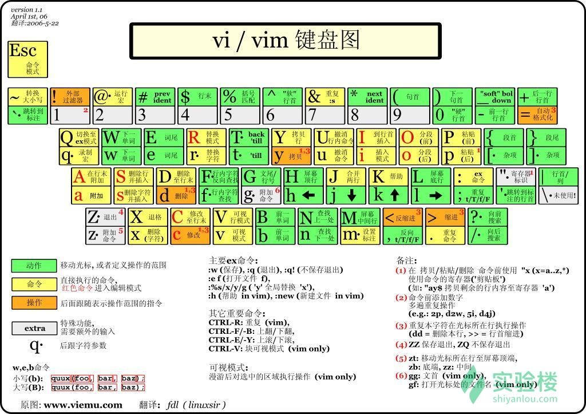

Vim具有6种基本模式和5种派生模式，6种基本模式：

- 普通模式(Normal mode)

> 在普通模式中，用的编辑器命令，比如移动光标，删除文本等等。这也是Vim启动后的默认模式。这正好和许多新用户期待的操作方式相反（大多数编辑器默认模式为插入模式）。

> Vim强大的编辑能来自于其普通模式命令。普通模式命令往往需要一个操作符结尾。例如普通模式命令`dd`删除当前行，但是第一个"d"的后面可以跟另外的移动命令来代替第二个`d`，比如用移动到下一行的"j"键就可以删除当前行和下一行。另外还可以指定命令重复次数，`2dd`（重复`dd`两次），和`dj`的效果是一样的。用户学习了各种各样的文本间移动／跳转的命令和其他的普通模式的编辑命令，并且能够灵活组合使用的话，能够比那些没有模式的编辑器更加高效地进行文本编辑。

> 在普通模式中，有很多方法可以进入插入模式。比较普通的方式是按`a`（append／追加）键或者`i`（insert／插入）键。

- 插入模式(Insert mode)

> 在这个模式中，大多数按键都会向文本缓冲中插入文本。大多数新用户希望文本编辑器编辑过程中一直保持这个模式。

> 在插入模式中，可以按`ESC`键回到普通模式。

- 可视模式(Visual mode)

> 这个模式与普通模式比较相似。但是移动命令会扩大高亮的文本区域。高亮区域可以是字符、行或者是一块文本。当执行一个非移动命令时，命令会被执行到这块高亮的区域上。Vim的"文本对象"也能和移动命令一样用在这个模式中。

- 选择模式(Select mode)

> 这个模式和无模式编辑器的行为比较相似（Windows标准文本控件的方式）。这个模式中，可以用鼠标或者光标键高亮选择文本，不过输入任何字符的话，Vim会用这个字符替换选择的高亮文本块，并且自动进入插入模式。

- 命令行模式(Command line mode)

> 在命令行模式中可以输入会被解释成并执行的文本。例如执行命令（`:`键），搜索（`/`和`?`键）或者过滤命令（`!`键）。在命令执行之后，Vim返回到命令行模式之前的模式，通常是普通模式。

- Ex模式(Ex mode)

> 这和命令行模式比较相似，在使用`:visual`命令离开Ex模式前，可以一次执行多条命令。

> 这其中我们常用到就是普通模式、插入模式和命令行模式

#### 模式切换

vim启动进入普通模式，处于插入模式或命令行模式时只需要按`Esc`或者`Ctrl+[`即可进入普通模式。普通模式中按`i`（插入）或`a`（附加）键都可以进入插入模式，普通模式中按`:`进入命令行模式。命令行模式中输入`wq`回车后保存并退出vim。

#### 使用vim命令进入vim界面

vim后面加上你要打开的已存在的文件名或者不存在（则作为新建文件）的文件名。

直接使用vim也可以打开vim编辑器，但是不会打开任何文件，进入命令行模式后输入`:e 文件路径` 同样可以打开相应文件。

#### 游标移动

在进入vim后，按下`i`键进入插入模式。

按`Esc`进入普通模式，在该模式下使用方向键或者`h`,`j`,`k`,`l`键可以移动游标。

- h	左
- l	右（小写L）
- j	下
- k	上
- w	移动到下一个单词
- b	移动到上一个单词

#### 插入模式

- i	在当前光标处进行编辑
- I	在行首插入
- A	在行末插入
- a	在光标后插入编辑
- o	在当前行后插入一个新行
- O	在当前行前插入一个新行
- cw	替换从光标所在位置后到一个单词结尾的字符

#### 命令行模式下退出/保存文档

从普通模式输入`:`进入命令行模式，输入`w`回车，保存文档。

输入`:w 文件名`可以将文档另存为其他文件名或存到其它路径下

- `:q!`	强制退出，不保存
- `:q`	退出
- `:wq!`	强制保存并退出
- `:w <文件路径>`	另存为
- `:saveas 文件路径`	另存为
- `:x	保存并退出`
- `:wq`	保存并退出

#### 普通模式下退出vim

普通模式下输入`Shift+zz`即可保存退出vim

#### 普通模式下删除vim文本信息

进入普通模式，使用下列命令可以进行文本快速删除：

- `x`	删除游标所在的字符
- `X`	删除游标所在前一个字符
- `Delete`	同x
- `dd`	删除整行
- `dw`	删除一个单词（不适用中文）
- `d$`或`D`	删除至行尾
- `d^`	删除至行首
- `dG`	删除到文档结尾处
- `d1G`	删至文档首部

除此之外，你还可以在命令之前加上数字，表示一次删除多行，如：`2dd`表示一次删除2行

#### Vim重复命令

在普通模式下`.`(小数点)表示重复上一次的命令操作：普通模式下输入`x`，删除第一个字符，输入`.`(小数点)会再次删除一个字符，除此之外也可以重复`dd`的删除操作

进入普通模式输入`N<command>`，N 表示重复后面的次数：`10x`，删除10个连续字符；输入`3dd`，将会删除3行文本

在普通模式下，你还可以使用`dw`或者`daw`(delete a word)删除一个单词，所以你可以很容易的联想到`dnw`(**n替换为相应数字**) 表示删除n个单词

#### 游标快速跳转

- `nG(n Shift+g)`	游标移动到第 n 行(如果默认没有显示行号，请先进入命令模式，输入`:set nu`以显示行号)
- `gg`	游标移动到到第一行
- `G(Shift+g)`	到最后一行

#### 复制及粘贴文本

- 普通模式中使用`y`复制
  - 普通模式中，`yy`复制游标所在的整行（`3yy`表示复制3行）
  - 普通模式中，`y^` 复制至行首，或`y0`。不含光标所在处字符。
  - 普通模式中，`y$` 复制至行尾。含光标所在处字符。
  - 普通模式中，`yw` 复制一个单词。
  - 普通模式中，`y2w` 复制两个单词。
  - 普通模式中，`yG` 复制至文本末。
  - 普通模式中，`y1G` 复制至文本开头。
- 普通模式中使用 `p` 粘贴
  - 普通模式中，`p`(小写)代表粘贴至光标后（下）
  - 普通模式中，`P`(大写)代表粘贴至光标前（上）

#### 剪切及粘贴

 `dd` 删除命令就是剪切，你每次 `dd` 删除文档内容后，便可以使用 `p` 来粘贴，也这一点可以让我们实现一个很爽快的功能——交换上下行：`ddp` 

#### 替换和撤销(Undo)命令
替换和`Undo`命令都是针对普通模式下的操作

- `r+<待替换字母>`	将游标所在字母替换为指定字母
- `R`	连续替换，直到按下Esc
- `cc`	替换整行，即删除游标所在行，并进入插入模式
- `cw`	替换一个单词，即删除一个单词，并进入插入模式
- `C(大写)`	替换游标以后至行末
- `~`	反转游标所在字母大小写
- `u{n}`	撤销一次或n次操作
- `U(大写)`	撤销当前行的所有修改
- `Ctrl+r`	redo，即撤销undo的操作

#### 使用命令进行快速调整缩进操作

普通模式下输入`>>` 整行将向右缩进（使用，用于格式化代码超爽）

普通模式下输入`<<` 整行向左回退

普通模式下输入`:`进入命令行模式下对`shiftwidth`值进行设置可以控制缩进和回退的字符数：`set shiftwidth=10`

命令行模式下输入`:ce`(center)命令使本行内容居中

命令行模式下输入`:ri`(right)命令使本行文本靠右

命令行模式下输入:`le`(left)命令使本行内容靠左

#### 查找

普通模式下输入 `/` 然后键入需要查找的字符串 按回车后就会进行查找。 `？` 与`/` 功能相同，只不过 `？` 是向上而 `/` 是向下查找。 进入查找之后，输入`n` 和 `N` 可以继续查找。 `n`是查找下一个内容,`N`查找上一个内容:`/love`

- 普通模式下输入`\*`寻找游标所在处的单词
- 普通模式下输入`\#`同上，但 `\#` 是向前（上）找，`\*`则是向后（下）找
- 普通模式下输入`g\*`同`\*` ，但部分符合该单词即可
- 普通模式下输入`g\#`同`\#` ，但部分符合该单词即可

#### 使用vim编辑多个文件

编辑多个文件有两种形式，一种是在进入vim前使用的参数就是多个文件。另一种就是进入vim后再编辑其他的文件。 同时创建两个新文件并编辑.

`vim 1.txt 2.txt`：默认进入`1.txt`文件的编辑界面

- 命令行模式下输入 `:n` 编辑 2.txt 文件，可以加 `!` 即 `:n!` 强制切换，之前一个文件的输入没有保存，仅仅切换到另一个文件
- 命令行模式下输入 `:N` 编辑 1.txt 文件，可以加 `!` 即 `:N!` 强制切换，之前文件内的输入没有保存，仅仅是切换到另一个文件

#### 进入vim后打开新文件

- 命令行模式下输入`:e 3.txt` 打开新文件3.txt
- 命令行模式下输入`:e#` 回到前一个文件
- 命令行模式下输入`:ls`可以列出以前编辑过的文档
- 命令行模式下输入`:b 2.txt`（或者编号）可以直接进入文件2.txt编辑
- 命令行模式下输入`:bd 2.txt`（或者编号）可以删除以前编辑过的列表中的文件项目
- 命令行模式下输入`:e! 4.txt`，新打开文件4.txt，放弃正在编辑的文件
- 命令行模式下输入`:f` 显示正在编辑的文件名
- 命令行模式下输入`:f new.txt`，改变正在编辑的文件名字为new.txt

#### 恢复文件

如果因为断电等原因造成文档没有保存，可以采用恢复方式，`vim -r`进入文档后，输入`:ewcover 1.txt`来恢复

` vim -r 1.txt`

#### 可视模式命令简介

- 在普通模式下输入 `v`（小写），进入字符选择模式，就可以移动光标，光标走过的地方就会选取。再次按下v后就会取消选取。
- 在普通模式下输入 `Shift+v`（小写），进入行选择模式，按下V之后就会把整行选取，您可以上下移动光标选更多的行，同样，再按一次 `Shift+v` 就可以取消选取。
- 在普通模式下输入 `Ctrl+v`（小写），这是区域选择模式，可以进行矩形区域选择，再按一次 `Ctrl+v` 取消选取。
- 在可视模式下输入 `d` 删除选取区域内容
- 在可视模式下输入`y`复制选取区域内容

#### 视窗操作简介

vim 可以在一个界面里打开多个窗口进行编辑，这些编辑窗口称为 vim 的视窗。 打开方法有很多种，例如可以使用在命令行模式下输入 `:new` 打开一个新的 vim 视窗，并进入视窗编辑一个新文件（普通模式下输入 `Ctrl+w`也可以），除了 `:new` 命令，下述列举的多种方法也可以在命令模式或普通模式下打开新的视窗：

**注意：快捷键可能会与浏览器的快捷键冲突，可换为 IE 浏览器进行实验或者在浏览器设置里禁用浏览器快捷键。**

- 命令行模式下输入`:sp 1.txt` 打开新的水平分屏视窗来编辑1.txt
- 命令行模式下输入`:vsp 2.txt` 打开新的垂直分屏视窗来编辑2.txt
- 普通模式下`Ctrl+w s` 将当前窗口分割成两个水平的窗口
- 普通模式下`Ctrl+w v` 将当前窗口分割成两个垂直的窗口
- 普通模式下`Ctrl+w q` 即 :q 结束分割出来的视窗。如果在新视窗中有输入需要使用强制符！即:q!
- 普通模式下`Ctrl+w o` 打开一个视窗并且隐藏之前的所有视窗
- 普通模式下`Ctrl+w j` 移至下面视窗
- 普通模式下`Ctrl+w k` 移至上面视窗
- 普通模式下`Ctrl+w h` 移至左边视窗
- 普通模式下`Ctrl+w l` 移至右边视窗
- 普通模式下`Ctrl+w J` 将当前视窗移至下面
- 普通模式下`Ctrl+w K` 将当前视窗移至上面
- 普通模式下`Ctrl+w H` 将当前视窗移至左边
- 普通模式下`Ctrl+w L` 将当前视窗移至右边
- 普通模式下`Ctrl+w -` 减小视窗的高度
- 普通模式下`Ctrl+w +` 增加视窗的高度

#### 创建加密文档

`vim -x file1`:输入您的密码 确认密码 这样在下一次打开时，vim就会要求你输入密码

#### 执行外部的shell命令

在命令行模式中输入`!`可以执行外部的shell命令

- `:!ls` 用于显示当前目录的内容
- `:!rm FILENAME`用于删除名为 FILENAME 的文件
- `:w FILENAME`可将当前 VIM 中正在编辑的文件另存为 FILENAME 文件

#### vim中的查看帮助

- 普通模式下按`F1`打开`vim`自己预设的帮助文档
- 命令行模式下输入`:h shiftwidth` 打开名为`shiftwidth`的帮助文件
- 命令行模式下输入`:ver` 显示版本及参数

#### vim的功能设定

可以在编辑文件的时候进行功能设定，如命令行模式下输入`:set nu`（显示行数），设定值退出vim后不会保存。要永久保存配置需要修改vim配置文件。 vim的配置文件`~/.vimrc`(实验楼环境中配置文件在/etc/vim/vimrc)，可以打开文件进行修改，不过务必小心不要影响vim正常使用

#### 获取目前的设定

- 命令行模式下输入`:set`或者`:se`显示所有修改过的配置
- 命令行模式下输入`:set all` 显示所有的设定值
- 命令行模式下输入`:set option?` 显示option的设定值
- 命令行模式下输入`:set nooption` 取消当前设定值

#### set功能的说明

- 命令行模式下输入`:set autoindent(ai)` 设置自动缩进
- 命令行模式下输入`:set autowrite(aw)` 设置自动存档，默认未打开
- 命令行模式下输入`:set background=dark`或`light`，设置背景风格
- 命令行模式下输入`:set backup(bk)` 设置自动备份，默认未打开
- 命令行模式下输入`: set cindent(cin)` 设置C语言风格缩进