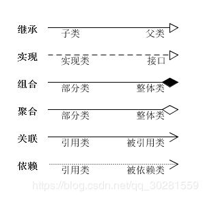

# 《设计模式的艺术》--刘伟

## 零、设计模式

模式是在特定环境下人们解决某类重复出现问题的一套成功或有效的解决方案。

软件模式是指在软件开发过程中某些可重现问题的有效解决方法，其基础结构主要由4部分构成，包括**问题描述（待解决的问题是什么)、前提条件（在何种环境或约束条件下使用）、解法（如何解决）和效果（有哪些优缺点）**。

**设计模式（Design Pattern)是一套被反复使用的、多数人知晓的、经过分类编目的、代码设计经验的总结，使用设计模式是为了可重用代码、让代码更容易被他人理解并且保证代码可靠性。**

在**GoF23种设计模式**中，包含**5种创建型设计模式、7种结构型设计模式和11种行为型设计模式**。此外，根据某个模式主要是用于处理类之间的关系还是用于处理对象之间的关系，设计模式还可以分为**类模式和对象模式**。

## **一、设计模式七大原则**

设计原则是思想上的指导，而设计模式是实现上的手段，是针对某个场景下某些问题的某个解决方案，因此设计模式应该遵 守这些原则，换句话说，设计模式就是这些设计原则的一些具体体现。

**设计模式常用的七大原则有:**

- 单一职责原则	——一个类只负责一个功能领域中的相应职责
- 开闭原则	——对扩展开放，对修改关闭
- 里氏代换原则	——所有引用基类的地方必须能透明地使用其子类的对象
- 依赖倒转原则	——依赖于抽象，不能依赖于具体实现
- 接口隔离原则	——类之间的依赖关系应该建立在最小的接口上
- 合成/聚合复用原则	——尽量使用合成/聚合，而不是通过继承达到复用的目的
- 迪米特法则	——一个软件实体应当尽可能少的与其他实体发生相互作用
### 1.单一职责原则(Single Responsibility Principle)
**对于一个类，只有一个引起该类变化的原因；该类的职责是唯一的，且这个职责是唯一引起其他类变化的原因。**

如果一个类承担的职责过多，就等于把这些职责耦合在一起了。一个职责的变化可能会削弱或者抑制这个类完成其他职责的能力。

**解决：**将不同的职责封装到不同的类或者模块中。 当有新的需求将现有的职责分为颗粒度更小的职责的时候，应该及时对现有代码进行重构。当系统逻辑足够简单，方法足够少，子类够少或后续关联够少时，也可以不必严格遵循你SRP原则，避免过度设计、颗粒化过于严重。

一个类不能做太多的东西。在软件系统中，一个类(一个模块、或者一个方法)承担的职责越多，那么其被复用的可能性就会越低。如类 A 负责两个不同职责：职责 1，职责 2。当职责 1 需求变更而改变 A 时，可能造成职责 2 执行错误，所以需要将类 A 的粒度分解为 A1，A2。

1. 降低类的复杂度，一个类只负责一项职责。
2. 提高类的可读性，可维护性
3. 降低变更引起的风险
4. 通常情况下，我们应当遵守单一职责原则，只有逻辑足够简单，才可以在代码级违反单一职责原则；只有类中方法数量足够少，可以在方法级别保持单一职责原则

### 2.开放-关闭原则OCP（Open-Closed Principle) 
**所谓开放一关闭原则，指的是，一个软件实体应该对扩展开放，对修改关闭。**即**软件实体的行为是可以扩展的，而且是在不修改已有代码的情况下进 行扩展，也不必改动已有的源代码或者二进制代码。**

> 在开闭原则的定义中，软件实体可以指一个软件模块、一个由多个类组成的局部结构或一个独立的类。

**开闭原则的意义：**
在软件的生命周期内，因为变化、升级和维护等原因需要对软件原有代码进行修改时，可能会给旧代码中引入错误，也可能会使我们不得不对整个功能进行重构，并且需要原有代码经过重新测试。当软件需要变化时，尽量通过扩展软件实体的行为来实现变化，而不是通过修改已有的代码来实现变化。

**如何实现对扩展开放，对修改关闭？**
要实现对扩展开放，对修改关闭，即遵循开闭原则，需要对系统进行抽象化设计，抽象可以基于抽象类或者接口。一般来说需要做到几点：

 1. 通过接口或者抽象类约束扩展，对扩展进行边界限定，不允许出现在接口或抽象类中不存在的public方法，也就是扩展必须添加具体实现而不是改变具体的方法。
 2. 参数类型、引用对象尽量使用接口或者抽象类，而不是实现类，这样就能尽量保证抽象层是稳定的。
 3. 一般抽象模块设计完成(例如接口的方法已经敲定)，不允许修改接口或者抽象方法的定义。
### 3.里氏代换原则（Liskov Substitution Principle）
**所有引用基类的地方必须能透明地使用其子类的对象，也可以简单理解为任何基类可以出现的地方，子类一定可以出现。**

**里氏代换原则的意义：只有当衍生类可以替换掉基类，软件单位的功能不受到影响时，基类才能真正被复用，而衍生类也能够在基类的基础上增加新的行为。**

里氏代换原则是对"开-闭"原则的补充。实现"开-闭"原则的关键步骤就是抽象化。而基类与子类的继承关系就是抽象化的具体实现，所以里氏代换原则是对实现抽象化的具体步骤的规范。当然，如果反过来，软件单位使用的是一个子类对象的话，那么它不一定能够使用基类对象。

> 举个很简单的例子说明这个问题：如果一个方法接收Map类型参数，那么它一定可以接收Map的子类参数例如HashMap、LinkedHashMap、ConcurrentHashMap类型的参数；但是返过来，如果另一个方法只接收HashMap类型的参数，那么它一定不能接收所有Map类型的参数，否则它可以接收LinkedHashMap、ConcurrentHashMap类型的参数。

**子类为什么可以替换基类的位置？**  
其实原因很简单，只要存在继承关系，基类的所有非私有属性或者方法，子类都可以通过继承获得(白箱复用)，反过来不成立，因为子类很有可能扩充自身的非私有属性或者方法，这个时候不能用基类获取子类新增的这些属性或者方法。

里氏代换原则是实现开闭原则的基础，它告诉我们在设计程序的时候进可能使用基类进行对象的定义和引用，在运行时再决定基类的具体子类型。从另外一个角度来说，里氏替换原则是实现开闭的主要原则之一。开闭原则要求对 扩展开放，扩展的一个实现手段就是使用继承；而里氏替换原则是保证子类型能够正确 替换父类型，只有能正确替换，才能实现扩展，否则扩展了也会出现错误。
### 4.依赖倒转原则（Dependency Inversion Principle，DIP）

**依赖倒转原则（Dependency Inversion Principle，DIP)：抽象不应该依赖于细节，细节应当依赖于抽象。换言之，要针对接口编程，而不是针对实现编程。**

**依赖倒转原则的意义：**

依赖倒转原则要求我们在程序代码中传递参数时或在关联关系中，尽量引用层次高的抽象层类，即使用接口和抽象类进行变量类型声明、参数类型声明、方法返回类型声明，以及数据类型的转换等，而不要用具体类来做这些事情。
为了确保该原则的应用，一个具体类应当只实现接口或抽象类中声明过的方法，而不要给出多余的方法，否则将无法调用到在子类中增加的新方法。

在引入抽象层后，系统将具有很好的灵活性，在程序中尽量使用抽象层进行编程，而将具体类写在配置文件中，这样一来，如果系统行为发生变化，只需要对抽象层进行扩展，并修改配置文件，而无须修改原有系统的源代码，在不修改的情况下来扩展系统的功能，满足开闭原则的要求。

**依赖倒转原则的注意事项：**
 - 高层模块不应该依赖低层模块，高层模块和低层模块都应该依赖于抽象。 
 - 抽象不应该依赖于具体，具体应该依赖于抽象。

在实现依赖倒转原则时，我们需要**针对抽象层编程，而将具体类的对象通过依赖注入(DependencyInjection, DI)的方式注入到其他对象中，依赖注入是指当一个对象要与其他对象发生依赖关系时，通过抽象来注入所依赖的对象。**常用的注入方式有三种，分别是：**构造注入，设值注入（Setter注入）和接口注入**。这些方法在定义时使用的是抽象类型，在运行时再传入具体类型的对象，由子类对象来覆盖父类对象。Spring的IOC是此实现的典范。

从Java角度看待依赖倒转原则的本质就是：**面向接口(抽象)编程。**
 - 每个具体的类都应该有其接口或者基类，或者两者都具备。
 - 类中的引用对象应该是接口或者基类。
 -  任何具体类都不应该派生出子类。
 - 尽量不要覆写基类中的方法。
 - 结合里氏代换原则使用。

### 5.接口隔离原则(Interface Segregation Principle)
**使用多个专门的接口，而不使用单一的总接口。即客户端不应该依赖它不需要的接口，类间的依赖关系应该建立在最小的接口上。**

简单来说就是建立单一的接口，不要建立臃肿庞大的接口。也就是接口尽量细化，同时接口中的方法尽量少。

**如何看待接口隔离原则和单一职责原则？**  
单一职责原则注重的是类和接口的职责单一，这里职责是从业务逻辑上划分的，但是在接口隔离原则要求当一个接口太大时，我们需要将它分割成一些更细小的接口，使用该接口的客户端仅需知道与之相关的方法即可。也就是说，我们在设计接口的时候有可能满足单一职责原则但是不满足接口隔离原则。

**接口隔离原则的规范：**

- 使用接口隔离原则前首先需要满足单一职责原则。
- 接口需要高内聚，也就是提高接口、类、模块的处理能力，少对外发布public的方法。
- 定制服务，就是单独为一个个体提供优良的服务，简单来说就是拆分接口，对特定接口进行定制。
- 接口设计是有限度的，接口的设计粒度越小，系统越灵活，但是值得注意不能过小，否则变成"字节码编程"。

### 6.合成/聚合复用原则（Composite/Aggregate Reuse Principle，CARP）
一般也叫合成复用原则(Composite Reuse Principle, CRP)，定义是：**尽量使用合成/聚合，而不是通过继承达到复用的目的。**

合成/聚合复用原则就是在一个新的对象里面使用一些已有的对象，使之成为新对象的一部分；新的对象通过向内部持有的这些对象的委派达到复用已有功能的目的，而不是通过继承来获得已有的功能。

- 聚合(Aggregate)的概念：聚合表示一种弱的"拥有"关系，一般表现为松散的整体和部分的关系，其实，所谓整体和部分也可以是完全不相关的。例如A对象持有B对象，B对象并不是A对象的一部分，也就是B对象的生命周期是B对象自身管理，和A对象不相关。
- 合成(Composite)的概念：合成表示一种强的"拥有"关系，一般表现为严格的整体和部分的关系，部分和整体的生命周期是一样的。

**为什么要用合成/聚合来替代继承达到复用的目的?**

- 继承复用破坏包装，因为继承将基类的实现细节暴露给派生类，基类的内部细节通常对子类来说是可见的，这种复用也称为`"白箱复用"`。这里有一个明显的问题是：派生类继承自基类，如果基类的实现发生改变，将会影响到所有派生类的实现；如果从基类继承而来的实现是静态的，不可能在运行时发生改变，不够灵活。
- 由于合成或聚合关系可以将已有的对象，一般叫成员对象，纳入到新对象中，使之成为新对象的一部分，因此新对象可以调用已有对象的功能，这样做可以使得成员对象的内部实现细节对于新对象不可见，所以这种复用又称为`"黑箱复用"`，相对继承关系而言，其耦合度相对较低，成员对象的变化对新对象的影响不大，可以在新对象中根据实际需要有选择性地调用成员对象的操作；
- 合成/聚合复用可以在运行时动态进行，新对象可以动态地引用与成员对象类型相同的其他对象。

>一般而言，如果两个类之间是“Has-A”的关系，应使用组合或聚合，如果是“Is-A”关系，可使用继承。“Is-A”是严格的分类学意义上的定义，意思是一个类是另一个类的“一种”；而“Has-A”则不同，它表示某一个角色具有某一项责任。

### 7.迪米特法则（Law of Demeter，LOD）
也叫做最少知识原则（Least Knowledge Principle，LKP），它的定义是：**一个软件实体应当尽可能少地与其他实体发生相互作用。每一个软件单位对其他的单位都只有最少的知识，而且局限于那些与本单位密切相关的软件单位。**

迪米特法则的初衷在于降低类之间的耦合。由于每个类尽量减少对其他类的依赖，因此，很容易使得系统的功能模块功能独立，相互之间不存在（或很少有）依赖关系。迪米特法则不希望类之间建立直接的联系。如果真的有需要建立联系，也希望能通过它的友元类（中间类或者跳转类）来转达。

**迪米特法则的规则：**

- Only talk to your immediate friends(只与直接的朋友通讯)，一个对象的"朋友"包括
  - 当前对象本身（this)。
  - 以参数形式传入到当前对象方法中的对象。
  - 当前对象的成员对象。
  - 如果当前对象的成员对象是一个集合，那么集合中的元素也都是朋友
  - 当前对象所创建的对象。
- 尽量少发布public的变量和方法，一旦公开的属性和方法越多，修改的时候影响的范围越大。
- "是自己的就是自己的"，如果一个方法放在本类中，既不产生新的类间依赖，也不造成负面的影响，那么这个方法就应该放在本类中。

**迪米特法则的意义：**
迪米特法则的核心观念就是类间解耦，也就降低类之间的耦合，只有类处于弱耦合状态，类的复用率才会提高。所谓降低类间耦合，实际上就是尽量减少对象之间的交互，如果两个对象之间不必彼此直接通信，那么这两个对象就不应当发生任何直接的相互作用，如果其中的一个对象需要调用另一个对象的某一个方法的话，可以通过第三者转发这个调用。简言之，就是通过引入一个合理的第三者来降低现有对象之间的耦合度。但是这样会引发一个问题，有可能产生大量的中间类或者跳转类，导致系统的复杂性提高，可维护性降低。如果一味追求极度解耦，那么最终有可能变成面向字节码编程甚至是面向二进制的0和1编程。

## 二、UML类图
UML是一种由图形符号表达的**建模语言**，其结构主要包括以下几个部分：

1. **视图（View)**：UML视图用于从不同的角度来表示待建模系统。视图是由许多图形组成的一个抽象集合，在建立一个系统模型时，只有通过定义多个视图，每个视图显示该系统的一个特定方面，才能构造出该系统的完整蓝图，视图也将建模语言链接到开发所选择的方法和过程。
2. **图（Diagram)**：UML图是描述UML视图内容的图形。最新的UML2.0提供了13种图。
3. **模型元素（Model Element）**：模型元素是指UML图中所使用的一些概念，它们对应于普通的面向对象概念，如类、对象、消息以及这些概念之间的关系，如关联关系、依赖关系、泛化关系等。
4. **通用机制（General Mechanism）**：UML提供的通用机制为模型元素提供额外的注释、信息和语义，这些通用机制也提供了扩展机制，允许用户对UML进行扩展，如定义新的建模元素、扩展原有元素的语义、添加新的特殊信息来扩展模型元素的规则说明等，以便适用于一个特定的方法或过程、组织或用户。

### 1 类结构
类（Class)封装了数据和行为，是面向对象的重要组成部分，它是具有相同属性、操作、关系的对象集合的总称。类的属性即类的数据职责，类的操作即类的行为职责。

类图（Class Diagram）是用出现在系统中的不同类来描述系统的静态结构，主要用来描述不同的类以及它们之间的关系。

在类的UML图中，使用长方形描述一个类的主要构成，长方形垂直地分为三层，以此放置类的**名称、属性和方法**。

其中，

 - 一般类的类名用正常字体粗体表示；抽象类名用斜体字粗体；接口则需在上方加上<<interface>>。
 - 属性用来描述类所具有的特征。描述属性的语法格式为： "`可见性 属性名：类型名[=初值]`"   其中属性名和类型名是一定要有的，其他部分可选。
 - 属性和方法都需要标注可见性符号，`+代表public，#代表protected，-代表private`。另外，还可以用冒号`:`表明属性的类型和方法的返回类型，如`+$name:string`、`+getName():string`。当然，类型说明并非必须。
 - 类图中，如果属性或者方法是static的，那么在属性或者方法定义的下面，添加一 条下划线表示是`static`的
 - UML规定操作的表示方式为：`可见性 名称(参数列表)[：返回类型]`
### 2 类关系
类与类之间的关系主要有六种：依赖、泛化（继承）、实现、关联、聚合与组合。可以从关系的强弱来理解，各类关系从强到弱依次是：继承→实现→组合→聚合→关联→依赖。这六种关系的箭头表示如下，

#### 1.依赖关系
依赖关系（Dependence）：**赖关系是一种“使用”关系**，特定事物的改变有可能会影响到使用该事物的其他事物，在需要表示一个事物使用另一个事物时使用依赖关系。

代码实现中有三种方式：第1种**将一个类的对象作为另一个类中方法的参数**；第2种方式是在一个类的方法中**将另一个类的对象作为其局部变量**；第3种方式是在一个类的**方法中调用另一个类的静态方法**。

例如：汽车依赖汽油，如果没有汽油，汽车将无法行驶。

#### 2.关联关系

关联关系（Association）：表示一类对象与另一类对象之间有联系。通常表示一个类的属性保存了对另一个类的一个实例（**成员变量**）的引用。

组合、聚合也属于关联关系，只是关联关系的类间关系比其他两种要弱。

关联关系有四种：双向关联、单向关联、自关联、多重数关联。

1. 双向关联
   例如：汽车和司机，一辆汽车对应特定的司机，一个司机也可以开多辆车。两个类互相持有对方实例作为成员变量
   
2. 单向关联：类的关联关系也可以是单向的，在UML中单向关联用带箭头的实线表示。
   例如，顾客（Customer)拥有地址（Address)，则Customer类与Address类具有单向关联关系
   
3. 自关联：在系统中可能会存在一些类的属性对象类型为该类本身，这种特殊的关联关系称为自关联。
   例如，一个节点类（Node)的成员又是节点Node类型的对象
   
4. 多重数关联：多重性关联关系又称为重数性（Multiplicity)关联关系，表示两个关联对象在数量上的对应关系。在UML中，对象之间的多重性可以直接在关联直线上用一个数字或一个数字范围表示。
   例如，一个界面（Form）可以拥有零个或多个按钮（Button)，但是一个按钮只能属于一个界面，因此，一个Form类的对象可以与零个或多个Button类的对象相关联，但一个Button类的对象只能与一个Form类的对象关联
   

#### 3.聚合关系

聚合关系（Aggregation）：整体和部分的关系，整体与部分可以分开。**是关联关系的特例**。

聚合关系**成员对象是整体对象的一部分，但是成员对象可以脱离整体对象独立存在**。

在代码实现聚合关系时，**成员对象通常作为构造方法、Setter方法或业务方法的参数注入到整体对象中**

例如：公交车司机和工衣、工帽是整体与部分的关系，但是可以分开，工衣、工帽可以穿在别的司机身上，公交司机也可以穿别的工衣、工帽。

#### 4.组合关系

组合关系（Composition）：整体与部分的关系，但是整体与部分不可以分开。**是关联关系的特例**。

组合关系表示类之间整体与部分的关系，**整体和部分有一致的生存期。一旦整体对象不存在，部分对象也将不存在，是同生共死的关系。**

在代码实现组合关系时，通常**在整体类的构造方法中直接实例化成员类**

例如：人由头部和身体组成，两者不可分割，共同存在。

#### 5.继承/泛化

用于描述父类与子类之间的关系。父类又称作基类，子类又称作派生类。是依赖关系的特例。

继承关系中，子类继承父类的所有功能，父类所具有的属性、方法，子类应该都有。子类中除了与父类一致的信息以外，还包括额外的信息。

例如：公交车、出租车和小轿车都是汽车，他们都有名称，并且都能在路上行驶。

#### 6.实现
实现关系（Implementation），主要用来规定接口和实现类的关系。是依赖关系的特例。
接口（包括抽象类）是方法的集合，通常没有属性，只有方法的声明。在实现关系中，类实现了接口，类中的方法实现了接口声明的所有方法。

例如：汽车和轮船都是交通工具，而交通工具只是一个可移动工具的抽象概念，船和车实现了具体移动的功能。

### 总结

## 三、设计模式类型
 **设计模式分为三种类型，共23种** 
1）创建型模式：单例模式、抽象工厂模式、原型模式、建造者模式、工厂模式。
2）结构型模式：适配器模式、桥接模式、装饰模式、组合模式、外观模式、享元模式、代理模式。
3）行为型模式：模版方法模式、命令模式、访问者模式、迭代器模式、观察者模式、中介者模式、备忘录模式、 解释器模式（Interpreter模式）、状态模式、策略模式、职责链模式（责任链模式）。

参考：https://www.cnblogs.com/ldj3/p/9143821.html