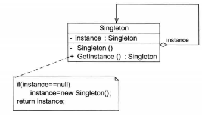
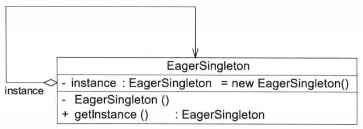
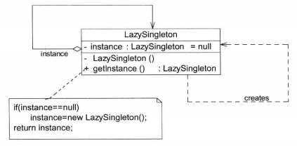

# 单例模式

## 单例模式概述

**单例模式（Singleton Pattern)：确保某一个类只有一个实例，而且自行实例化并向整个系统提供这个实例，这个类称为单例类，它提供全局访问的方法。单例模式是一种对象创建型模式。**

对于一个普通类如何改为单例模式？如TaskManager类。

1. 创建：由于每次使用new关键字来实例化类时都将产生一个新对象，为了确保实例的唯一性，需要**禁止类的外部直接使用new来创建对象**，因此需要将**构造函数的可见性改为private**。`private TaskManager(){…}`

2. 保存：类内部会创建该类唯一的实例，为了保存该实例并且让外界可以访问这个唯一实例，需要在类中定义**一个静态的TaskManager类型的私有成员变量**，为了保证成员变量的**封装性**，将TaskManager类型的tm对象的可见性设置为·`private`代码如下：`private static TaskManager tm = null;`

3. 访问：外界该如何使用该成员变量并何时实例化该成员变量呢?答案是增加一个公有的静态方法，代码如下：

   ```java
   public static Taskfanager getInstance(){
   	if(tm==null){ //先判断是否已经创建
   		tm=new TaskManager();//自行实例化
   	return tm;
   }
   //首先它应该是一个public方法，以便外界其他对象使用；
   //其次它使用了static关键字，即它是一个静态方法，在类外可以直接通过类名来访问，而无须创建TaskManager对象。
   ```



Singleton(单例）：在单例类的内部实现只生成一个实例，同时它提供一个**静态的Getlnstance()方法**，让客户可以访问它的唯一实例；为了防止在外部对单例类实例化，它的**构造函数可见性为private**；在单例类内部定义了一个**Singleton类型的静态对象**，作为供外部共享访问的唯一实例。

## 懒汉式和饿汉式

### 1.饿汉式单例类
饿汉式单例类是实现起来最简单的单例类：


在定义静态变量的时候实例化单例类，因此在类加载的时候就已经创建了单例对象。代码如下：

```java
class BagerSingleton {
	private static final EagerSingleton instance = new EagerSingleton();
	private EagerSingleton(){}
	public static EagerSingleton getInstance(){
		return instance;
	}
}
```

> 当类被加载时，静态变量instance会被初始化，此时类的私有构造函数会被调用，单例类的唯一实例将被创建。

### 2.懒汉式单例类与线程锁定



懒汉式单例在第一次调用getlnstance（）方法时实例化，在类加载时并不自行实例化，这种技术又称为**延迟加载（Lazy Load)**技术，即需要的时候再加载实例，为了避免多个线程同时调用getInstance（）方法，可以使用关键字synchronized，代码如下：

````java
class LazySingleton{
	private static LazySingleton instance=null;
	private Lazysingleton(){}
	synchronized public static LazySingleton getInstance(){
		if(instance==null){
			instance = new Lazysingleton();
		return instance;
  }
}
````

> 该懒汉式单例类在getlnstance（）方法前面增加了关键字`synchronized`进行线程锁定，以处理多个线程同时访问的问题。上述代码虽然解决了线程安全问题，但是每次调用getInstance（）时都需要进行线程锁定判断，在多线程高并发访问环境中，将会导致系统性能大大降低。

改进性能一：(会出现多个实例)

```java
public static LazySingleton getInstance(){
	if(instance==null){
		synchronized(LazySingleton.class){
			instance=new LazySingleton();
    }
	return instance;
}

```

改进性能二：(双重检查锁定)

```java
class LazySingleton {
	private volatile static LazySingleton instance=null;
	private Lazysingleton(){}
	public static LazySingleton getInstance(){
		//第一重判断
		if(instance==null){
			//锁定代码块
			synchronized(Lazysingleton.class)(
				//第二重判断
				if(instance==null)
					instance=new Lazysingleton();/∥创建单例实例
			}
    }
		return instance;
	}
}        
```

> 双重检查锁定来实现懒汉式单例类，需要在静态成员变量instance之前增加修饰符 `volatile`，被volatile修饰的成员变量可以确保多个线程都能够正确处理:https://blog.csdn.net/hll174/article/details/51491414
>
> ```
> //对于instance=new Lazysingleton()可以分解为以下三个伪代码：
> memory = allocate();   //1：分配对象的内存空间  
> ctorInstance(memory);  //2：初始化对象
> instance = memory;     //3：设置instance指向刚分配的内存地址
> //没有volatile修饰时候，2/3会重排序：
> memory = allocate();   //1：分配对象的内存空间  
> instance = memory;     //3：设置instance指向刚分配的内存地址//注意，此时对象还没有被初始化！
> ctorInstance(memory);  //2：初始化对象
> //这会导致其他线程判断instance != null 后直接使用一个没有完成初始化的对象
> ```

### 3.饿汉式单例类与懒汉式单例类比较
饿汉式单例类在类被加载时就将自己实例化，它的优点在于无须考虑多线程访问问题，可以确保实例的唯一性；从调用速度和反应时间角度来讲，由于单例对象一开始就得以创建，因此要优于懒汉式单例。但是无论系统在运行时是否需要使用该单例对象，由于在类加载时该对象就需要创建，因此从资源利用效率角度来讲，饿汉式单例不及懒汉式单例，而且在系统加载时由于需要创建饿汉式单例对象，加载时间可能会比较长。

懒汉式单例类在第一次使用时创建，无须一直占用系统资源，实现了延迟加载，但是必须处理好多个线程同时访问的问题，特别是当单例类作为资源控制器，在实例化时必然涉及资源初始化，而资源初始化很有可能耗费大量时间，这意味着出现多线程同时首次引用此类的几率变得较大，需要通过双重检查锁定等机制进行控制，这将导致系统性能受到一定影响。

## 一种更好的单例实现方法
饿汉式单例类不能实现延迟加载，不管将来用不用，它始终占据内存；懒汉式单例类线程安全控制烦琐，而且性能受影响。

JVM在类的初始化阶段（即在Class被加载后，且被线程使用之前），会执行类的初始化。在执行类的初始化期间，JVM会去获取一个锁。这个锁可以同步多个线程对同一个类的初始化（只进行一次）。

基于这个特性，可以实现另一种线程安全的延迟初始化方案被称之为`Initialization on Demand Holder(IoDH)`的技术。实现IoDH时，需在单例类中增加一个**静态（static)内部类**，在该内部类中创建单例对象，再将该单例对象通过`getInstance()`方法返回给外部使用，实现代码如下：

```java
//Initialization on Demand Holder
class Singleton{
	private Singleton(){}
  //静态（static)内部类
	private static class HolderClass {
		private final static Singleton instance =new Singleton();//外部类拥有对内部类中private字段的访问权限
  }
	public static Singleton getInstance(){
			return HolderClass.instance;//导致初始化发生
  }
}
```

由于静态单例对象没有作为Singleton的成员变量直接实例化，因此类加载时不会实例化Singleton；第一次调用`getInstance()`时将加载内部类HolderClass，在该内部类中定义了一个static类型的变量instance，此时会首先初始化这个成员变量，由Java虚拟机来保证其线程安全性，确保**该成员变量只能初始化一次**。由于getlnstance（）方法没有任何线程锁定，因此其性能不会造成任何影响。

> 初始化一个类，包括执行这个类的静态初始化和初始化在这个类中声明的静态字段。根据java语言规范，在首次发生下列任意一种情况时，一个类或接口类型T将被立即初始化：
>
> - T是一个类，而且一个T类型的实例被创建；
> - T是一个类，且T中声明的一个静态方法被调用；
> - T中声明的一个静态字段被赋值；
> - T中声明的一个静态字段被使用，而且这个字段不是一个常量字段；
> - T是一个顶级类（top level class，见java语言规范的§7.6），而且一个断言语句嵌套在T内部被执行。

通过使用loDH，既可以实现延迟加载，又可以保证线程安全，不影响系统性能，因此，IoDH不失为一种最好的Java语言单例模式实现方式；其缺点是**与编程语言本身的特性相关，很多面向对象语言不支持loDH**。

## 总结

### 1.主要优点
单例模式的主要优点如下：

1. 单例模式提供了对唯一实例的受控访问。因为单例类封装了它的唯一实例，所以它可以严格控制客户怎样以及何时访问它。
2. 由于在系统内存中只存在一个对象，因此可以节约系统资源，对于一些需要频繁创建和销毁的对象，单例模式无疑可以提高系统的性能。
3. 允许可变数目的实例。基于单例模式，开发人员可以进行扩展，使用与控制单例对象相似的方法来获得指定个数的实例对象，既节省系统资源，又解决了由于单例对象共享过多有损性能的问题。（注：自行提供指定数目实例对象的类可称之为多例类。）

### 2.主要缺点

单例模式的主要缺点如下：

1. 由于单例模式中没有抽象层，因此单例类的扩展有很大的困难。
2. 单例类的职责过重，在一定程度上违背了单一职责原则。因为单例类既提供了业务方法，又提供了创建对象的方法（工厂方法），将对象的创建和对象本身的功能耦合在一起。
3. 现在很多面向对象语言（如Java、C#）的运行环境都提供了自动垃圾回收技术，因此，如果实例化的共享对象长时间不被利用，系统会认为它是垃圾，会自动销毁并回收资源，下次利用时又将重新实例化，这将导致共享的单例对象状态的丢失。

### 3.适用场景

1. 系统只需要一个实例对象。例如，系统要求提供一个唯一的序列号生成器或资源管理器，或者需要考虑资源消耗太大而只允许创建一个对象。
2. 客户调用类的单个实例只允许使用一个公共访问点，除了该公共访问点，不能通过其他途径访问该实例。