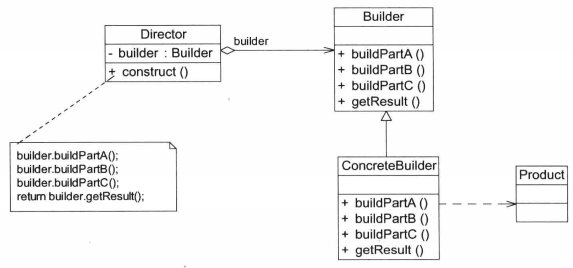
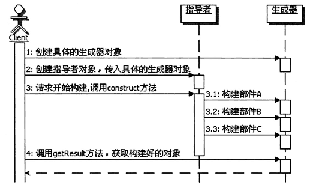

# 设计模式之Builder建造者模式
## 1、结构说明
**建造者模式（Builder Pattern)**：将一个复杂对象的构建与它的表示分离，使得同样的构建过程可以创建不同的表示。建造者模式是一种对象创建型模式。

> 建造者模式一步一步地创建一个复杂的对象，不同的具体建造者定义了不同的创建过程，且具体建造者相互独立，它允许用户只通过指定复杂对象的类型和内容就可以构建它们，用户不需要知道内部的具体构建细节。

2. **解决问题的思路：** 怎样实现同样的构建过程可以创建不同的表示？
    - 先将构建过程独立出来——Director:指导装配过程，但是不负责每一步的具体实现
    - 具体实现每一步的对象——Builder:负责每一步的具体实现
3. UML图  
    
    - Builder(抽象建造者）：它为创建一个产品Product对象的各个部件指定抽象接口，在该接口中一般声明类方法法：一类方法是buildPartX（），用于创建复杂对象的各个部件；另一类方法是getResult（），用于返回复杂对象。Builder既可以是抽象类，也可以是接口。
    - ConcreteBuilder(具体建造者）：它实现了Builder接口，实现各个部件的具体构造和装配方法，定义并明确其所创建的复杂对象，也可以提供一个方法返回创建好的复杂产品对象。
    - Product(产品角色）：它是被构建的复杂对象，包含多个组成部件，具体建造者创建该产品的内部表示并定义其装配过程。
    - Director(指挥者）：指挥者又称为导演类，它负责安排复杂对象的建造次序，指挥者与抽象建造者之间存在关联关系，可以在其construct（）建造方法中调用建造者对象的部件构造与装配方法，完成复杂对象的建造。客户端一般只需要与指挥者进行交互，在客户端确定具体建造者的类型，并实例化具体建造者对象（也可以通过配置文件和反射机制），然后通过指挥者类的构造函数或者Setter方法将该对象传入指挥者类中。
      - 一方面它隔离了客户与创建过程
      - 另一方面它控制产品的创建过程，包括某个buildPartX（）方法是否被调用，以及多个buildPartX（）方法调用的先后次序等。
      - 指挥者针对抽象建造者编程，客户端只需要知道具体建造者的类型，即可通过指挥者类调用建造者的相关方法，返回一个完整的产品对象。
>这个过程中Director根据注入的不同的Builder来创建出不同的Product，即**相同的Director（整体创建过程），不同的Builder实现（不同的表示）**

## 2、具体认识

1. 建造者模式的功能
    - 生成器模式的主要功能是构建复杂的产品，而且是细化的、分步骤的构建产品，也就是生成器模式重在一步一步解决构造复杂对象的问题。
    - 更为重要的是，这个**构建的过程是统一的、固定不变的，变化的部分放到生成 示器部分了，只要配置不同的生成器Builder，那么同样的构建过程，就能构建出不同的 产品来。**
2. 构成
    - 生成器模式分成两个很重要的部分。
        - 一个部分是Builder接口，这里是定义了如何构建各个部件，也就是知道每个部件功能如何实现，以及如何装配这些部件到产品中去
        - 一个部分是Director，Director是知道如何组合来构建产品，也就是说Director 负责整体的构建算法，而且通常是分步骤地来执行。
    - 不管如何变化，Builder模式都存在这么两个部分，一个部分是部件构造和产品装配， 另一个部分是整体构建的算法。认识这点是很重要的，因为在生成器模式中，强调的是 **固定整体构建的算法，而灵活扩展和切换部件的具体构造和产品装配的方式**，所以要严 格区分这两个部分。
3. 调用顺序示意图  
     - 
4. Builder的实现
    - 实际上在Builder接口的实现中，每个部件构建的方法里面，**除了部件装配外，也可 以实现如何具体地创建各个部件对象**。也就是说每个方法都可以有两部分功能，**一部分 是创建部件对象，另一部分是组装部件。**
    - 在构建部件的方法里面可以实现选择并创建具体的部件对象，然后再把这个部件对 象组装到产品对象中去。这样一来，Builder就可以和工厂方法配合使用了。
    - 再进一步，如果在实现Builder的时候，**只有创建对象的功能，而没有组装的功能， 那么这个时候的Builder实现跟抽象工厂的实现是类似的。**
    这种情况下，Builder接口就类似于抽象工厂的接口，Builder的具体实现就类似于具 体的工厂，而且Builder接口里面定义的创建各个部件的方法也是有关联的，这些方法是 构建一个复杂对象所需要的部件对象。
5. Director的实现
    - 在生成器模式里面，指导者承担的是整体构建算法部分，是相对不变的部分。因此 在实现指导者的时候，把变化的部分分离出去是很重要的。
6. 优点：
    1. 在建造者模式中，客户端不必知道产品内部组成的细节，将产品本身与产品的创建过程解耦，使得相同的创建过程可以创建不同的产品对象。
    2. 每一个具体建造者都相对独立，而与其他具体建造者无关，因此可以很方便地替换具体建造者或增加新的具体建造者，用户使用不同的具体建造者即可得到不同的产品对象。由于指挥者类针对抽象建造者编程，增加新的具体建造者无须修改原有类库的代码，系统扩展方便，符合开闭原则。
    3. 可以更加精细地控制产品的创建过程。将复杂产品的创建步骤分解在不同的方法中，使得创建过程更加清晰，也更方便使用程序来控制创建过程。
7. 缺点
    1. 建造者模式所创建的产品一般县有较多的共同点，其组成部分相似，如果产品之间的差异性很大，例如很多组成部分都不相同，就不适合使用建造者模式，因此其使用范围受到一定的限制。
    2. 如果产品的内部结构复杂且多变，可能会需要定义很多具体建造者类来实现这种变化，这就导致系统变得很庞大，增加系统的理解难度和运行成本。
8. 适应场景
    1. 需要生成的产品对象有复杂的内部结构，这些产品对象通常包含多个成员变量。
    2. 需要生成的产品对象的属性相互依赖，需要指定其生成顺序。
    3. 对象的创建过程独立于创建该对象的类。在建造者模式中通过引入指挥者类，将创建过程封装在指挥者类中，而不在建造者类和客户类中。
    4. 隔离复杂对象的创建和使用，并使得相同的创建过程可以创建不同的产品。

## 3、相关模式

1. 建造者模式和工厂方法模式 
    - 这两个模式可以组合使用。
    - 生成器模式的Builder实现中，通常需要选择具体的部件实现。一个可行的方案 就是实现成为工厂方法，通过工厂方法来获取具体的部件对象，然后再进行部件的装配。

2. 生成器模式和抽象工厂模式 
    - 这两个模式既相似又有区别，也可以组合使用。
    - 先说相似性，如果在实现Builder的时候，只有创建对象的功能，而没有组装的功能， 那么这个时候的Builder实现跟抽象工厂的实现是类似的。这种情况下，Builder接口就类似于抽象工厂的接口，Builder的具体实现就类似于具 体的工厂，而且Builder接口里面定义的创建各个部件的方法也是有关联的，这些方法是 构建一个复杂对象所需要的部件对象。
    - 再说说区别：抽象工厂模式的主要目的是创建产品簇，这个产品簇里面的单个 产品就相当于是构成一个复杂对象的部件对象，抽象工厂对象创建完成后就立 即返回整个产品簇；而生成器模式的主要目的是按照构造算法，一步一步来构 建一个复杂的产品对象，通常要等到整个构建过程结束以后，才会得到最终的 产品对象。
    - 事实上，这两个模式是可以组合使用的。在生成器模式的Builder实现中，需要 创建各个部件对象，而这些部件对象是有关联的，通常是构成一个复杂对象的 部件对象。也就是说，Builder实现中，需要获取构成一个复杂对象的产品簇， 那自然就可以使用抽象工厂模式来实现。这样一来，由抽象工厂模式负责了部 件对象的创建，Builder实现里面则主要负责产品对象整体的构建了。

3. 生成器模式和模板方法模式 
    - 模板方法模式主要是**用来定义算法的骨架，把算法中某些步骤延迟到子类中实现**。再想想生成器模式， Director用来**定义整体的构建算法，把算法中某些涉及到具体部件对象的创建和装配的功能，委托给具体的Builder来实现。**
    - 虽然生成器不是延迟到子类，是委托给Builder，但那只是具体实现方式上的差 别，**从实质上看两个模式很类似，都是定义一个固定的算法骨架，然后把算法 中的某些具体步骤交给其他类来完成，都能实现整体算法步骤和某些具体步骤 实现的分离。**
    - 当然这两个模式也有很大的区别，首先是模式的目的，**生成器模式是用来构建 复杂对象的，而模板方法是用来定义算法骨架，尤其是一些复杂的业务功能的 处理算法的骨架**；其次是模式的实现，**生成器模式是采用委托的方法，而模板 方法采用的是继承的方式**；另外从使用的复杂度上，**生成器模式需要组合 Director 和Builder对象，然后才能开始构建，要等构建完后才能获得最终的对 象，而模板方法就没有这么麻烦，直接使用子类对象即可**。

