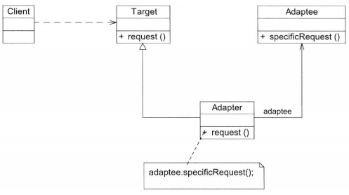
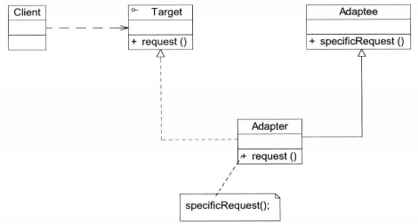
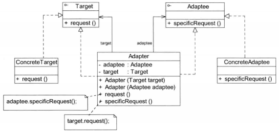

# 05适配器模式--不兼容结构的协调

## 1 概述

**适配器模式（Adapter Pattern)**：将一个接口转换成客户希望的另一个接口，使接口不兼容的那些类可以一起工作，其别名为包装器（Wrapper)。适配器模式既可以作为类结构型模式，也可以作为对象结构型模式。

> 注：在适配器模式定义中所提及的接口是指广义的接口，它可以表示一个方法或者方法的集合。
>
> 在适配器模式中，通过增加一个新的适配器类来解决接口不兼容的问题，使得原本没有任何关系的类可以协同工作。根据适配器类与适配者类的关系不同，适配器模式可分为对象适配器模式和类适配器模式两种。
>
> - 在对象适配器模式中，适配器与适配者之间是关联关系；(在实际开发中使用频率更高)
> - 在类适配器模式中，适配器与适配者之间是继承（或实现）关系。

### UML类图

**对象适配器模式：**

1. Target(目标抽象类）：目标抽象类定义客户所需接口，可以是一个抽象类或接口，也可以是具体类。
2. Adapter（适配器类）：适配器可以调用另一个接口，作为一个转换器，对Adaptee和Target进行适配。适配器类是适配器模式的核心，在对象适配器模式中，它通过**继承或实现Target 并关联一个Adaptee对象**使二者产生联系。
3. Adaptee(适配者类）：适配者即被适配的角色，它定义了一个已经存在的接口，这个接口需要适配，适配者类一般是一个具体类，包含了客户希望使用的业务方法，在某些情况下可能没有适配者类的源代码。

**类适配器模式：**

类适配器模式中，适配器与适配者之间是继承（或实现）关系。

**双向适配器：**

在对象适配器模式的使用过程中，如果在**适配器中同时包含对目标类和适配者类的引用**，适配者可以通过它调用目标类中的方法，目标类也可以通过它调用适配者类中的方法，那么该适配器就是一个双向适配器，其模式结构示意图如图所示。

**缺省适配器模式：**缺省适配器模式是适配器模式的一种变体

缺省适配器模式（Default Adapter Pattern)：当不需要实现一个接口所提供的所有方法时，可先设计一个抽象类实现该接口，并为接口中每个方法提供一个默认实现（空方法），那么该抽象类的子类可以选择性地覆盖父类的某些方法来实现需求，它适用于不想使用一个接口中的所有方法的情况，又称为单接口适配器模式。

## 总结

主要优点

1. 将目标类和适配者类解耦，通过引入一个适配器类来重用现有的适配者类，无须修改原有结构。
2. 增加了类的透明性和复用性，将具体的业务实现过程封装在适配者类中，对于客户端类而言是透明的，而且提高了适配者类的复用性，同一个适配者类可以在多个不同的系统中复用。
3. 灵活性和扩展性都非常好，通过使用配置文件，可以很方便地更换适配器，也可以在不修改原有代码的基础上增加新的适配器类，完全符合开闭原则。
4. 类适配器模式还有这样的优点：由于适配器类是适配者类的子类，因此可以在适配器类中置换一些适配者的方法，使得适配器的灵活性更强。
5. 对象适配器模式还有如下优点：
   （1）一个对象适配器可以把多个不同的适配者适配到同一个目标。
   （2）可以适配一个适配者的子类，由于适配器和适配者之间是关联关系，根据里氏代换原则，适配者的子类也可通过该适配器进行适配。

主要缺点：

1. 类适配器模式的缺点如下：
   （1）对于Java、C#等不支持多重类继承的语言，一次最多只能适配一个适配者类，不能同时适配多个适配者。
   （2）适配者类不能为最终类，例如在Java中不能为final类，C#中不能为sealed类。
   （3）在Java、C#等语言中，类适配器模式中的目标抽象类只能为接口，不能为类，其使用有一定的局限性。
2. 对象适配器模式的缺点是：与类适配器模式相比，要在适配器中置换适配者类的某些方法比较麻烦。如果一定要置换掉适配者类的一个或多个方法，可以先做一个适配者类的子类，在子类中将适配者类的方法置换掉，然后再把适配者类的子类当做真正的适配者进行适配，实现过程较为复杂。

适用场景：

1. 系统需要使用一些现有的类，而这些类的接口（例如方法名）不符合系统的需要，甚至没有这些类的源代码。
2. 想创建一个可以重复使用的类，用于与一些彼此之间没有太大关联的类，包括一些可能在将来引进的类一起工作。