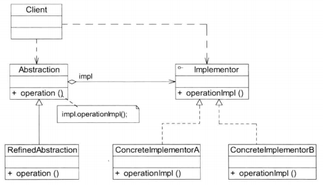
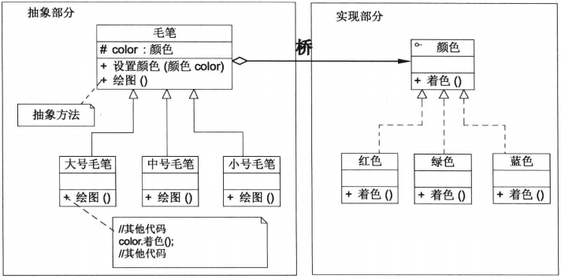

# 06桥接模式--处理多维度变化

## 概述

**桥接模式（Bridge Pattern)**：将抽象部分与其实现部分分离，使它们都可以独立地变化。它是一种对象结构型模式，又称为柄体（Handle and Body)模式或接口（Interface)模式。

> 桥接模式是一种很实用的结构型设计模式。如果软件系统中**某个类存在两个独立变化的维度**，通过该模式可以将这**两个维度分离出来，使两者可以独立扩展**，让系统更加符合单一职责原则。与多层继承方案不同，它将两个独立变化的维度设计为两个独立的继承等级结构，并且在抽象层建立一个抽象关联，该关联关系类似一条连接两个独立继承结构的桥，故名桥接模式。

1. Abstraction(抽象类）：用于定义抽象类的接口，它一般是抽象类而不是接口，其中定义了一个Implementor（实现类接口）类型的对象并可以维护该对象，它与Implementor之间具有关联关系，它既可以包含抽象业务方法，也可以包含具体业务方法。
2. RefinedAbstraction(扩充抽象类）：扩充由Abstraction定义的接口，通常情况下它不再是抽象类而是具体类，它实现了在Abstraction中声明的抽象业务方法，在RefinedAbstraction中可以调用在Implementor中定义的业务方法。
3. Implementor（实现类接口）：定义实现类的接口，这个接口不一定要与Abstraction的接口完全一致，事实上这两个接口可以完全不同，一般而言，Implementor接口仅提供基本操作，而Abstraction定义的接口可能会做更多、更复杂的操作。Implementor接口对这些基本操作进行了声明，而具体实现交给其子类。**通过关联关系，在Abstraction中不仅拥有自己的方法，还可以调用到Implementor中定义的方法，使用关联关系来替代继承关系。**
4. ConcreteImplementor(具体实现类）：具体实现Implementor接口，在不同的Concretelmplementor 中提供基本操作的不同实现，在程序运行时，Concretelmplementor对象将替换其父类对象，提供给抽象类具体的业务操作方法。

>在使用桥接模式时，首先应该识别出一个类所具有的**两个独立变化的维度**，将它们设计为两个独立的继承等级结构，为两个维度都提供抽象层，并建立抽象耦合。通常情况下，**将具有两个独立变化维度的类的一些普通业务方法和与之关系最密切的维度设计为抽象类层次结构（抽象部分），而将另一个维度设计为实现类层次结构（实现部分）**。如毛笔的型号和颜色属性：
>
>

## 总结

主要优点

1. 分离抽象接口及其实现部分。桥接模式使用“对象间的关联关系”解耦了抽象和实现之间固有的绑定关系，使得抽象和实现可以沿着各自的维度来变化（即抽象和实现不再在同一个继承层次结构中，而是“子类化”它们，使它们各自都具有自己的子类，以便任意组合子类，从而获得多维度组合对象）。
2. 在很多情况下，桥接模式可以取代多层继承方案。多层继承方案违背了单一职责原则，复用性较差，且类的个数非常多，桥接模式是比多层继承方案更好的解决方法，它极大地减少了子类的个数。
3. 桥接模式提高了系统的可扩展性，在两个变化维度中任意扩展一个维度，都不需要修改原有系统，符合开闭原则。

主要缺点：

1. 桥接模式的使用会增加系统的理解与设计难度，由于关联关系建立在抽象层，要求开发者一开始就针对抽象层进行设计与编程。
2. 桥接模式要求正确识别出系统中两个独立变化的维度，因此其使用范围具有一定的局限性，如何正确识别两个独立维度也需要一定的经验积累。

适用场景：

1. 如果一个系统需要在抽象类和具体类之间增加更多的灵活性，避免在两个层次之间建立静态的继承关系，通过桥接模式可以使它们在抽象层建立一个关联关系。
2. 抽象部分和实现部分可以以继承的方式独立扩展而互不影响，在程序运行时可以动态地将一个抽象类子类的对象和一个实现类子类的对象进行组合，即系统需要对抽象类角色和实现类角色进行动态耦合。
3. 一个类存在两个（或多个）独立变化的维度，且这两个（或多个）维度都需要独立进行扩展。
4. 对于那些不希望使用继承或因为多层继承导致系统类的个数急剧增加的系统，桥接模式尤为适用。