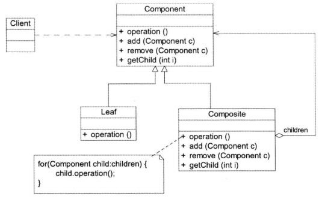

# 07组合模式--树形结构的处理

## 概述

**组合模式（Composite Pattern)**：组合多个对象形成树形结构以表示具有“整体一部|分”关系的层次结构。组合模式对单个对象（即叶子对象）和组合对象（即容器对象）的使用具有一致性，组合模式又可以称为“整体一部分”（Part-Whole)模式，它是一种对象结构型模式。

在组合模式中引入了抽象构件类Component，它是所有容器类和叶子类的公共父类，客户端针对Component进行编程。组合模式结构如图所示：

1. Component(抽象构件）：它可以是接口或抽象类，**为叶子构件和容器构件对象声明接口**，在该角色中可以包含所有子类共有行为的声明和实现。在抽象构件中定义了访问及管理它的子构件的方法，例如增加子构件、删除子构件、获取子构件等。
2. Leaf(叶子构件）：它在组合模式结构中表示**叶子节点对象**。叶子节点没有子节点，它实现了在抽象构件中定义的行为。对于那些访问及管理子构件的方法，可以通过捕获异常等方式进行处理。
3. Composite（容器构件）：它在组合模式结构中表示**容器节点对象**。容器节点包含子节点，其子节点可以是叶子节点，也可以是容器节点，它提供一个集合用于存储子节点，实现了在抽象构件中定义的行为，包括那些访问及管理子构件的方法，在其业务方法中可以递归调用其子节点的业务方法。

组合模式的**关键是定义了一个抽象构件类，它既可以代表叶子，又可以代表容器，而客户端针对该抽象构件类进行编程，无须知道它到底表示的是叶子还是容器，可以对其进行统一处理**。同时容器对象与抽象构件类之间还建立一个聚合关联关系，在容器对象中既可以包含叶子，也可以包含容器，以此实现递归组合，形成一个树形结构。

## 总结

主要优点

1. 组合模式可以清楚地定义分层次的复杂对象，表示对象的全部或部分层次，它让客户端忽略了层次的差异，方便对整个层次结构进行控制。
2. 客户端可以一致地使用一个组合结构或其中单个对象，不必关心处理的是单个对象还是整个组合结构，简化了客户端代码。
3. 在组合模式中增加新的容器构件和叶子构件都很方便，无须对现有类库进行任何修改，符合开闭原则。
4. 组合模式为树形结构的面向对象实现提供了一种灵活的解决方案，通过叶子对象和容器对象的递归组合，可以形成复杂的树形结构，但对树形结构的控制却非常简单。

主要缺点

- 在增加新构件时很难对容器中的构件类型进行限制。有时候希望一个容器中只能有某些特定类型的对象，例如在某个文件夹中只能包含文本文件，使用组合模式时，不能依赖类型系统来施加这些约束，因为它们都来自于相同的抽象层，在这种情况下，必须通过在运行时进行类型检查来实现，这个实现过程较为复杂。

适用场景

1. 在具有整体和部分的层次结构中，希望通过一种方式忽略整体与部分的差异，客户端可以一致性地对待它们。
2. 在一个使用面向对象语言开发的系统中需要处理一个树形结构。
3. 在一个系统中能够分离出叶子对象和容器对象，而且它们的类型不固定，需要增加一些新的类型。