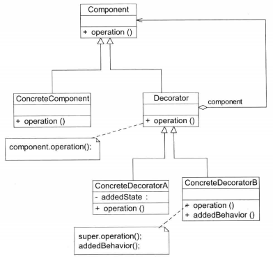

# 设计模式之Decorator装饰者模式
## 概述
> 装饰模式是一种用于替代继承的技术，它通过一种无须定义子类的方式来给对象动态增加职责，使用对象之间的关联关系取代类之间的继承关系。在装饰模式中引入了装饰类，在装饰类中既可以调用待装饰的原有类的方法，还可以增加新的方法，以扩充原有类的功能。

**装饰模式（Decorator Pattern)**：动态地给一个对象增加一些额外的职责，就增加对象功能来说，装饰模式比生成子类实现更为灵活。装饰模式是一种对象结构型模式。

1. 解决问题的思路：
    - 如何透明的给一个对象增加功能，即给一个对象添加功能却不能让这个对象知道，也就是说不能修改这个对象
    - 通过定义一个抽象类，让这个类实现与被修饰对象相同的接口，然后在具体的实现类中转调被修饰的对象，在转调前后增添一些额外的功能

### UML图

 - Component(抽象构件）：它是具体构件和抽象装饰类的**共同父类**，声明了在具体构件中实现的业务方法。它的引入**可以使客户端以一致的方式处理未被装饰的对象以及装饰之后的对象，实现客户端的透明操作。**
 - ConcreteComponent(具体构件）：它是抽象构件类的子类，用于定义具体的构件对象，实现了在抽象构件中声明的方法，装饰器可以给它增加额外的职责（方法）。
 - Decorator(抽象装饰类)：它也是抽象构件类的子类，**用于给具体构件增加职责**，但是**具体职责在其子类中实现**。它**维护一个指向抽象构件对象的引用**，通过该引用可以调用装饰之前构件对象的方法，并通过其子类扩展该方法，以达到装饰的目的。
 - ConcreteDecorator(具体装饰类）：它是抽象装饰类的子类，负责向构件添加新的职责。每一个具体装饰类都定义了一些新的行为，**可以调用在抽象装饰类中定义的方法，并可以增加新的方法用以扩充对象的行为。**

## 具体认识
1. 装饰模式的功能 
    - 装饰模式能够实现动态地为对象添加功能，是**从一个对象外部来给对象增加功能， 相当于是改变了对象的外观**。当装饰过后，从外部使用系统的角度看，就不再是使用原 始的那个对象了，而是使用被一系列的装饰器装饰过后的对象。
2. 对象组合 
    - 一个类的功能的扩展方式，可以是继承，也可以是功能更强大、 更灵活的对象组合的方式。
    - 在面向对象的设计中，有一条基本的规则就是“尽量使用对象组合，而 不是对象继承”来扩展和复用功能。装饰模式的思考起点就是这个规则。
3. 装饰器 
    - 装饰器实现了对被装饰对象的某些装饰功能，可以在装饰器中调用被装饰对象的功能，获取相应的值，这其实是一种递归调用。
    - 在装饰器中不仅仅是可以给被装饰对象增加功能，还可以根据需要选择是否调用被装饰对象的功能，如果不调用被装饰对象的功能，那就变成完全重新实现了
4. 装饰器和组件类的关系 
    - 装饰器是用来装饰组件的，装饰器一定要实现和组件类一致的接口，保证它们是同 一个类型，并具有同一个外观，这样组合完成的装饰才能够递归调用下去。
    - 组件类是不知道装饰器的存在的，装饰器为组件添加功能是一种透明的包装，组件 类毫不知情。需要改变的是外部使用组件类的地方，现在需要使用包装后的类，接口是 一样的，但是具体的实现类发生了改变。
5. 退化形式 
    - **如果仅仅只是想要添加一个功能，就没有必要再设计装饰器的抽象类了，直接在装饰器中实现跟组件一样的接口，然后实现相应的装饰功能就可以了**。但是建议最好还是 设计上装饰器的抽象类，这样有利于程序的扩展。

## 应用场景

1. I/O流
2. 在不影响其他对象的情况下，以动态、透明的方式给单个对象添加职责。
3. 当不能采用继承的方式对系统进行扩展或者采用继承不利于系统扩展和维护时可以使用装饰模式。不能采用继承的情况主要有两类：第1类是系统中存在大量独立的扩展，为支持每一种扩展或者扩展之间的组合将产生大量的子类，使得子类数目呈爆炸性增长；第2类是因为类已定义为不能被继承（如Java语言中的final类）。

## 相关模式
1. 装饰者模式和代理模式
2. 装饰模式与组合模式 
    - 这两个模式有相似之处，都涉及到对象的递归调用，从某个角度来说，可以把 装饰看做是只有一个组件的组合。
    - 它们的目的完全不一样，**装饰模式是要动态地给对象增加功能**；而组合模 式是想**要管理组合对象和叶子对象，为它们提供一个一致的操作接口给客户端， 方便客户端的使用。**
3. 装饰模式与策略模式 
    - 这两个模式可以组合使用。
    - 策略模式也可以实现动态地改变对象的功能，但是**策略模式只是一层选择，也 就是根据策略选择一下具体的实现类而已**。而**装饰模式不是一层，而是递归调 用，无数层都可以**，只要组合好装饰器的对象组合，那就可以依次调用下去。所以装饰模式更灵活。
    - 策略模式改变的是原始对象的功能，不像装饰模式，后面一个装饰器，改 变的是经过前一个装饰器装饰后的对象。也就是**策略模式改变的是对象的内核， 而装饰模式改变的是对象的外壳。**
4. 装饰者模式和模板方法模式
    - 模板方法模式主要应用在**算法骨架固定的情况**，那么要是算法步骤不固定呢， 也就是一个**相对动态的算法步骤，就可以使用装饰模式了**，因为在使用装饰模 式的时候，进行装饰器的组装，其实也相当于是一个调用算法步骤的组装，相 当于是一个动态的算法骨架。
    - 既然装饰模式可以实现动态的算法步骤的组装和调用，那么把这些算法步骤固 定下来，那就是模板方法模式实现的功能了，因此装饰模式可以模拟实现模板 方法模式的功能。
    - 但是请注意，仅仅只是可以模拟功能而已，**两个模式的设计目的、原本的功能、 本质思想等都是不一样的。**

