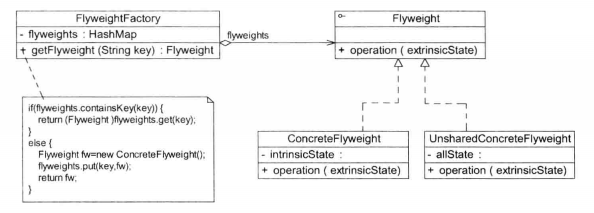
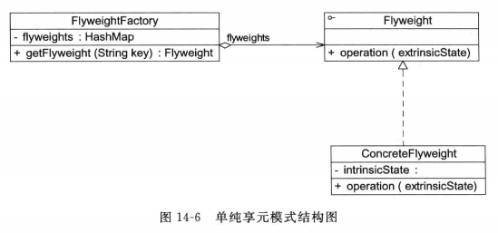
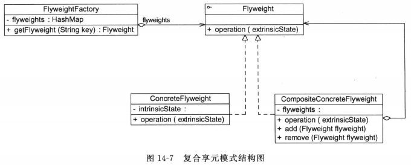

# 享元模式--实现对象的复用

**享元模式（Flyweight Pattern)**：运用共享技术有效地支持大量细粒度对象的复用。系统只使用少量的对象，而这些对象都很相似，状态变化很小，可以实现对象的多次复用。由于享元模式要求能够共享的对象必须是细粒度对象，因此它又称为轻量级模式，是一种对象结构型模式。

> 享元模式通过共享技术实现相同或相似对象的重用，在逻辑上每一个出现的字符都有一个对象与之对应，然而在物理上它们却共享同一个享元对象，这个对象可以出现在一个字符串的不同地方，相同的字符对象都指向同一个实例。在享元模式中，存储实例对象的地方称为**享元池（Flyweight Pool）**。可以针对每一个不同的字符创建一个享元对象，将其放在享元池中，需要时再从享元池取出。

享元模式以共享的方式高效地支持大量细粒度对象的重用。享元对象能做到共享的关键是区分了内部状态（Intrinsic State)和外部状态（Extrinsic State）。

1. 内部状态是存储在享元对象内部并且不会随环境改变而改变的状态，内部状态可以共享。例如字符的内容
2. 外部状态是随环境改变而改变的、不可以共享的状态。享元对象的外部状态通常由客户端保存，并在享元对象被创建之后，需要使用的时候，再传入到享元对象内部。一个外部状态与另一个外部状态之间是相互独立的。如字符的颜色、大小



1. Flyweight(抽象享元类)：通常是一个接口或抽象类，在抽象享元类中声明了具体享元类公共的方法，这些方法可以向外界提供享元对象的内部数据（内部状态），同时也可以通过这些方法来设置外部数据（外部状态）。
2. ConcreteFlyweight(具体享元类)：它实现了抽象享元类，其实例称为享元对象；在具体享元类中**为内部状态提供了存储空间**。通常，可以结合单例模式来设计具体享元类，为每一个具体享元类提供唯一的享元对象。
3. UnsharedConcreteFlyweight(非共享具体享元类）：并不是所有的抽象享元类的子类都需要被共享，**不能被共享的子类**可设计为非共享具体享元类；当需要一个非共享具体享元类的对象时可以直接通过实例化创建。
4. FlyweightFactory(享元工厂类）：享元工厂类用于创建并管理享元对象，它针对抽象享元类编程，将各种类型的具体享元对象存储在一个享元池中，享元池一般设计为一个存储**“键值对Map”**的集合（也可以是其他类型的集合），可以结合工厂模式进行设计；当用户请求一个具体享元对象时，享元工厂**提供一个存储在享元池中已创建的实例或者创建一个新的实例（如果不存在的话），返回新创建的实例并将其存储在享元池中**。

> 享元类的设计是享元模式的要点之一，在享元类中要将内部状态和外部状态分开处理，通常将内部状态作为享元类的成员变量，而外部状态通过注入的方式添加到享元类中。典型的享元类代码如下：
>
> ```java
> class Flyweight{
> 	//内部状态intrinsicstate作为成员变量，同一个享元对象其内部状态是一致的
> 	private String intrinsicState;
> 	public Flyweight(String intrinsicState){
> 		this.intrinsicState=intrinsicState;
>   }
> 	//外部状态extrinsicstate在使用时由外部设置，不保存在享元对象中，即使是同一个对象，在每一次调用时可以传入不同的外部状态
> 	public void operation(String extrinsicstate){
>   	....
>   }
> }
> ```

实际使用过程中，有时候会用到两种特殊的享元模式：单纯享元模式和复合享元模式

1. 单纯享元模式
   在单纯享元模式中，所有的具体享元类都是可以共享的，不存在非共享具体享元类。
2. 复合享元模式
   将一些单纯享元对象使用组合模式加以组合，还可以形成复合享元对象，这样的复合享元对象本身不能共享，但是它们可以分解成单纯享元对象，而后者则可以共享。
   通过复合享元模式，可以确保复合享元类CompositeConcreteFlyweight中所包含的每个单纯享元类ConcreteFlyweight都具有相同的外部状态，而这些单纯享元的内部状态往往可以不同。





## 认知补充

### 与其他模式的联用

享元模式通常需要和其他模式一起联用，几种常见的联用方式如下：

1. 在享元模式的享元工厂类中通常提供一个静态的工厂方法用于返回享元对象，使用简单工厂模式来生成享元对象。
2. 在一个系统中，通常只有唯一一个享元工厂，因此可以使用单例模式进行享元工厂类的设计。
3. 享元模式可以结合组合模式形成复合享元模式，统一对多个享元对象设置外部状态。

### 享元模式与String类

JDK类库中的String类使用了享元模式，通过如下代码来加以说明：

```java
class Demo{
	public static void main(String args[]){
	String strl="abcd";
	String str2="abcd";
	String str3="ab"+"cd";
	String str4="ab";
	str4+="cd";
	System.out.println(strl==str2);//true
	System.out.println(strl==str3);//true
	System.out.printin(strl==str4);//false
	str2+="e";
	System.out.println(str1==str2);//false
}
```

> 可以看出，前两个输出语句均为true，说明str1、str2、str3在内存中引用了相同的对象；如果有一个字符串str4，其初值为“ab\"，再对它进行str4+=\"cd\"操作，此时虽然str4的内容与str1相同，但是由于str4的初始值不同，在创建str4时重新分配了内存，所以第3个输出语句结果为false；最后一个输出语句结果也为false，说明当对str2进行修改时将创建一个新的对象，修改工作在新对象上完成，而原来引用的对象并没有发生任何改变，str1仍然引用原有对象，而str2引用新对象，str1与str2引用了两个完全不同的对象。

## 总结

主要优点

1. 可以极大减少内存中对象的数量，使得相同或相似对象在内存中只保存一份，从而可以节约系统资源，提高系统性能。
2. 享元模式的外部状态相对独立，而且不会影响其内部状态，从而使得享元对象可以在不同的环境中被共享。

主要缺点

1. 享元模式使得系统变得复杂，需要分离出内部状态和外部状态，这使得程序的逻辑复杂化。
2. 为了使对象可以共享，享元模式需要将享元对象的部分状态外部化，而读取外部状态将使得运行时间变长。

适用场景

1. 一个系统有大量相同或者相似的对象，造成内存的大量耗费。
2. 对象的大部分状态都可以外部化，可以将这些外部状态传人对象中。
3. 在使用享元模式时需要维护一个存储享元对象的享元池，而这需要耗费一定的系统资源，因此，在需要多次重复使用享元对象时才值得使用享元模式。